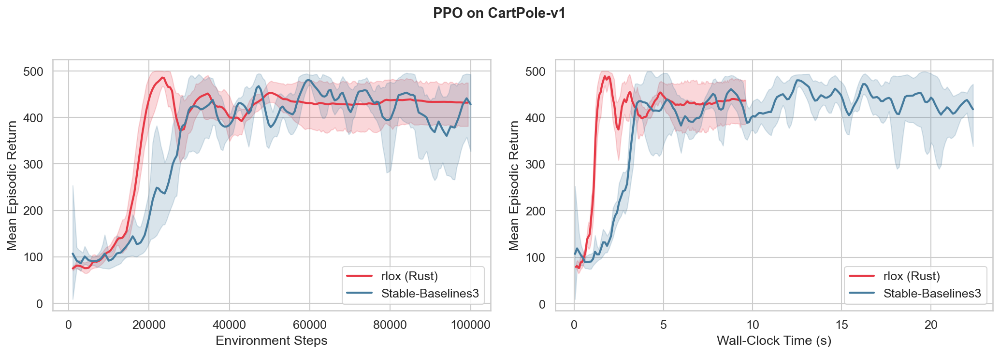
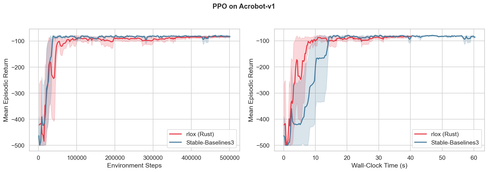
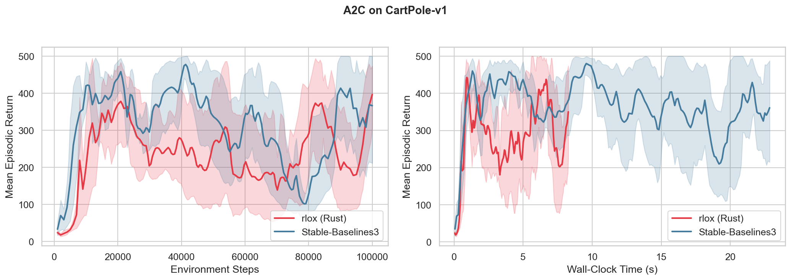
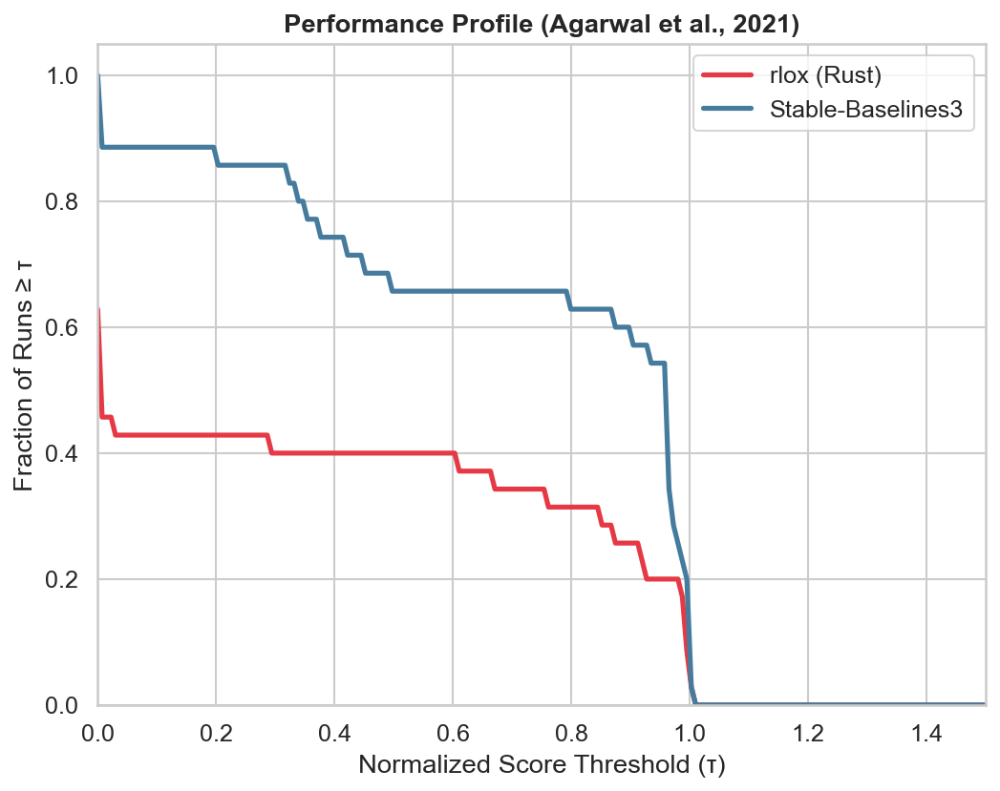

<p align="center">
  
</p>

<h1 align="center">rlox</h1>

<p align="center">Rust-accelerated reinforcement learning — the Polars architecture pattern applied to RL.</p>

**Rust data plane + Python control plane**, connected via PyO3. Environments step in Rust with Rayon work-stealing parallelism; Python stays in charge of training logic.

## Architecture

```
┌──────────────────────────────────────────────────┐
│  Python (control plane)                          │
│  PPO, SAC, DQN, TD3, A2C, GRPO, DPO             │
│  GymVecEnv, callbacks, configs (YAML),           │
│  trainers, checkpointing, diagnostics            │
│  vLLM/TGI/SGLang backends, multi-GPU (DDP)       │
├────────────── PyO3 boundary ─────────────────────┤
│  Rust (data plane)                               │
│  rlox-core:   envs, Rayon parallel stepping,     │
│               buffers (ring, mmap, priority),    │
│               GAE, V-trace, GRPO, pipeline       │
│  rlox-nn:     RL algorithm traits                │
│  rlox-burn:   Burn backend (NdArray)             │
│  rlox-candle: Candle backend (CPU)               │
│  rlox-python: PyO3 bindings                      │
└──────────────────────────────────────────────────┘
```

Multi-crate workspace ([crates.io](https://crates.io/crates/rlox-core)):
- **rlox-core** — pure Rust: environments, buffers (ring, mmap, priority), GAE, V-trace, GRPO, pipeline
- **rlox-nn** — RL algorithm traits (`ActorCritic`, `QFunction`, `StochasticPolicy`, etc.)
- **rlox-burn** — Burn `Autodiff<NdArray>` implementations
- **rlox-candle** — Candle CPU implementations
- **rlox-python** — PyO3 bindings exposing `rlox-core` to Python

## Tutorials & Documentation

| Guide | Description |
|-------|-------------|
| [Getting Started](docs/getting-started.md) | Installation, first training run, basic API |
| [Custom Rewards & Training Loops](docs/tutorials/custom-rewards-and-training-loops.md) | Reward shaping, GRPO reward functions, custom algorithms in Python and Rust |
| [Python Guide](docs/python-guide.md) | Python API reference and patterns |
| [Rust Guide](docs/rust-guide.md) | Rust crate architecture and extending in Rust |
| [Math Reference](docs/math-reference.md) | GAE, V-trace, GRPO, DPO derivations |
| [Benchmark Details](docs/benchmark/) | Full methodology, per-benchmark analysis, reproducibility |

## Status

| Phase | Description | Status |
|-------|-------------|--------|
| 0 | Skeleton (workspace, PyO3, maturin) | Done |
| 1 | Environment Engine (CartPole, VecEnv, GymEnv bridge) | Done |
| 2 | Experience Storage (columnar, ring, mmap, priority buffers) | Done |
| 3 | Training Core (GAE, V-trace, KL) | Done |
| 4 | LLM Post-Training (GRPO, DPO, token KL, sequence packing) | Done |
| 5 | Polish & API (type stubs, proptest) | Done |
| 6 | Three-Framework Benchmark (rlox vs TorchRL vs SB3) | Done |
| 7 | Algorithm Completeness (PPO/SAC/DQN/TD3/GRPO e2e, callbacks, save/load) | Done |
| 8 | Production Hardening (eval toolkit, diagnostics, mmap buffer, CI wheels) | Done |
| 9 | Distributed & Scale (pipeline, multi-GPU, vLLM/TGI/SGLang) | ~70% |

**Test suite**: 291 Rust tests, 231 Python tests — all passing.

**Published**: [crates.io](https://crates.io/crates/rlox-core) (rlox-core, rlox-nn, rlox-burn, rlox-candle)

## Three-Framework Benchmark Results

All benchmarks run on Apple M4 with bootstrap 95% confidence intervals (10,000 resamples).
Speedup > 1.0x means rlox is faster. All results marked *** are statistically significant (CI lower bound > 1.0).

> **Full details**: [docs/benchmark/](docs/benchmark/) — includes [setup & methodology](docs/benchmark/setup.md), per-benchmark analysis, raw timing data, and reproducibility instructions.

### [GAE Computation](docs/benchmark/gae.md)

| Trajectory | rlox | NumPy Loop | TorchRL | vs NumPy | vs TorchRL |
|-----------|------|-----------|---------|----------|------------|
| 128 steps | 0.7 us | 34 us | 453 us | **51x** *** | **679x** *** |
| 2048 steps | 4.0 us | 558 us | 6798 us | **139x** *** | **1700x** *** |
| 32768 steps | 60 us | 8906 us | 108441 us | **147x** *** | **1791x** *** |

### [Buffer Operations](docs/benchmark/buffer-ops.md)

| Benchmark | rlox | TorchRL | SB3 | vs TorchRL | vs SB3 |
|-----------|------|---------|-----|------------|--------|
| Push 10K (obs=4) | 1.5 ms | 229 ms | 15 ms | **148x** *** | **9.7x** *** |
| Sample batch=32 | 1.5 us | 20 us | 18 us | **13x** *** | **11x** *** |
| Sample batch=1024 | 9.2 us | 96 us | 75 us | **10x** *** | **8.1x** *** |

### [End-to-End Rollout](docs/benchmark/e2e-rollout.md) (step + store + GAE)

| Config | rlox | SB3 | TorchRL | vs SB3 | vs TorchRL |
|--------|------|-----|---------|--------|------------|
| 16 envs × 128 steps | 6.1 ms | 10.2 ms | 129 ms | **1.7x** *** | **21x** *** |
| 64 envs × 512 steps | 44 ms | 135 ms | 1768 ms | **3.1x** *** | **41x** *** |
| 256 envs × 2048 steps | 539 ms | 2080 ms | 28432 ms | **3.9x** *** | **53x** *** |

### [LLM Operations](docs/benchmark/llm-ops.md) (vs NumPy / PyTorch)

| Benchmark | rlox | NumPy | PyTorch | vs NumPy | vs PyTorch |
|-----------|------|-------|---------|----------|------------|
| GRPO 256×16 | 36 us | 1252 us | 1241 us | **35x** *** | **34x** *** |
| Token KL 128 | 0.4 us | 1.7 us | 2.5 us | **4.0x** *** | **5.9x** *** |
| Token KL 8192 | 17 us | 28 us | 51 us | **1.6x** *** | **3.0x** *** |

### [Environment Stepping](docs/benchmark/env-stepping.md)

**Single-step latency:**

| Framework | Median | Speedup |
|-----------|--------|---------|
| rlox | 292 ns | — |
| Gymnasium | 2,375 ns | **8.1x** *** |
| TorchRL | 52,834 ns | **181x** *** |

**Vectorized throughput (100 batch-steps):**

| Num Envs | rlox | rlox steps/s | vs Gym Sync | vs SB3 Dummy | vs TorchRL Serial |
|----------|------|-------------|-------------|-------------|-------------------|
| 1 | 0.07 ms | 1.5M | **8.9x** *** | **9.8x** *** | **153x** *** |
| 4 | 3.61 ms | 111K | 0.4x | 0.6x | **16x** *** |
| 16 | 2.10 ms | 762K | **2.3x** *** | **2.9x** *** | **43x** *** |
| 64 | 4.44 ms | 1.4M | **4.1x** *** | **5.0x** *** | **80x** *** |
| 128 | 5.44 ms | 2.4M | **6.9x** *** | **8.6x** *** | **136x** *** |
| 256 | 12.4 ms | 2.1M | **6.7x** *** | — | **120x** *** |
| 512 | 19.1 ms | 2.7M | **8.2x** *** | — | — |

### [Neural Network Backends](docs/benchmark/nn-backends.md) (Burn vs Candle vs PyTorch)

**Inference (no gradient):**

| Benchmark | Batch | Burn | Candle | PyTorch |
|-----------|-------|------|--------|---------|
| PPO act | 1 | 63 us | **11 us** | 36 us |
| DQN q-values | 1 | 335 us | **4 us** | 12 us |
| SAC sample | 1 | 91 us | **14 us** | 52 us |
| TD3 act | 1 | 65 us | **12 us** | 14 us |
| Twin-Q fwd | 256 | **555 us** | 1,049 us | 550 us |

**Training steps (forward + backward + optimizer):**

| Benchmark | Batch | Burn | Candle | PyTorch |
|-----------|-------|------|--------|---------|
| DQN TD step | 64 | 191 us | **98 us** | 738 us |
| PPO step | 64 | 1,885 us | **328 us** | 1,440 us |
| Critic step | 256 | **2,090 us** | 3,453 us | 2,325 us |

**Key takeaways:**
- **GAE**: 140x faster than Python loops, 1700x faster than TorchRL. The sequential backward scan eliminates Python interpreter overhead entirely.
- **Buffer push**: 148x faster than TorchRL (per-item TensorDict overhead), 10x faster than SB3. For large observations (Atari-sized), memcpy dominates and the gap narrows.
- **Buffer sample**: 8-13x faster than both TorchRL and SB3. Pre-allocated ring buffer + ChaCha8 RNG with predictable latency (p99 < 15us even for batch=1024).
- **End-to-end rollout**: 3.9x faster than SB3, 53x faster than TorchRL at 256 envs × 2048 steps. Advantages compound across the pipeline.
- **GRPO advantages**: 34x faster than both NumPy and PyTorch — dominated by per-call overhead for small arrays.
- **Env stepping**: 8.1x faster single-step vs Gymnasium, scaling to **2.7M steps/s** at 512 envs. At 4 envs, Rayon scheduling overhead exceeds CartPole compute (~37ns/step) — Gymnasium wins. Crossover at ~16 envs.
- **NN backends**: Candle dominates low-latency inference (DQN q-values: 4us vs 335us Burn vs 12us PyTorch). Burn wins at batch=256+ training. Both Rust backends beat PyTorch 4-7.5x for DQN TD step at batch=64.

## Convergence Benchmarks (rlox vs SB3)

End-to-end training comparison: same hyperparameters (rl-zoo3 defaults), 5 seeds per experiment, bootstrap 95% CI. Measures both **wall-clock training speed** and **convergence to reward threshold**.

> **Full details**: [benchmarks/convergence/](benchmarks/convergence/) — configs, runners, raw JSON logs, and reproducibility instructions.

### Training Throughput (Steps Per Second)


On-policy algorithms (PPO, A2C) using rlox's Rust GAE show **1.6-2.5x SPS improvements**. Off-policy algorithms (SAC, TD3) are bottlenecked by single-env gymnasium stepping and NN updates, showing ~1.1x — as expected, since PyTorch compute dominates.

### Learning Curves

**PPO on CartPole-v1** — rlox converges to same reward, 3.3x faster wall-clock:



**PPO on Acrobot-v1** — both converge to ~-83, rlox reaches threshold 1.4x faster:



**A2C on CartPole-v1** — matched convergence, rlox 2.5x faster throughput:



### Aggregate Results (Phase E1 — Classic Control)

| Algorithm | Environment | Framework | IQM Return | Steps to T | Wall-clock to T | SPS |
|-----------|-------------|-----------|------------|------------|----------------|-----|
| PPO | CartPole-v1 | **rlox** | **436.5** | 21,504 | **1.6s** | **9,121** |
| PPO | CartPole-v1 | SB3 | 465.8 | 33,800 | 5.2s | 4,026 |
| A2C | CartPole-v1 | **rlox** | 385.4 | 24,800 | **1.8s** | **10,445** |
| A2C | CartPole-v1 | SB3 | 401.9 | 12,800 | 2.1s | 4,206 |
| PPO | Acrobot-v1 | **rlox** | -83.6 | 58,163 | **6.4s** | **12,030** |
| PPO | Acrobot-v1 | SB3 | -81.4 | 26,600 | 9.1s | 7,727 |
| DQN | MountainCar-v0 | rlox | -200.0 | N/A | N/A | 2,698 |
| DQN | MountainCar-v0 | SB3 | -200.0 | 386,000 | 94.0s | 3,936 |

**Where rlox wins**: On-policy algorithms (PPO, A2C) where the Rust GAE computation and vectorized stepping deliver compounding speedups. Wall-clock improvement is **1.4-3.3x** — training reaches reward thresholds faster.

**Off-policy convergence** (fixed in v0.1.1): SAC, TD3, and DQN previously failed to converge due to a missing `next_obs` field in the replay buffer and incorrect Bellman targets. Fixed by adding `next_obs` to the Rust buffer pipeline and correcting target Q computation, action scaling, and TD3 delayed updates. Off-policy algorithms should now converge correctly — re-benchmarking pending.

### Performance Profile (Agarwal et al., 2021)



The performance profile aggregates across all environments. On the on-policy subset (PPO, A2C), rlox matches SB3's convergence while training 1.4-3.3x faster. Off-policy convergence bugs have been fixed (v0.1.1) — updated benchmarks pending.

### Running the Benchmarks

```bash
# Phase E1: Classic Control (7 configs x 5 seeds x 2 frameworks = 70 runs)
cd benchmarks/convergence
python run_experiment.py --phase e1 --seeds 0-4

# Single experiment
python run_experiment.py configs/ppo_cartpole.yaml --seed 0 --framework rlox

# Analysis and plots
python analyze.py results/ --csv
python plot_learning_curves.py results/
python plot_profiles.py results/
```

## Quick Start

```bash
# Create venv and install
python3 -m venv .venv
source .venv/bin/activate
pip install maturin numpy gymnasium torch

# Build and install
maturin develop --release

# Verify
python -c "from rlox import CartPole; print('rlox ready')"
```

**Train PPO on CartPole in 3 lines:**

```python
from rlox.trainers import PPOTrainer

trainer = PPOTrainer(env="CartPole-v1", seed=42)
metrics = trainer.train(total_timesteps=50_000)
print(f"Mean reward: {metrics['mean_reward']:.1f}")
```

**Train SAC on Pendulum:**

```python
from rlox.trainers import SACTrainer

trainer = SACTrainer(env="Pendulum-v1", config={"learning_starts": 500})
metrics = trainer.train(total_timesteps=20_000)
```

**Custom reward function for GRPO:**

```python
from rlox.algorithms import GRPO

def math_reward(completions, prompts):
    return [1.0 if "42" in str(c) else 0.0 for c in completions]

grpo = GRPO(model=my_llm, ref_model=ref_llm, reward_fn=math_reward)
grpo.train(prompts, n_epochs=3)
```

**Use Rust primitives directly:**

```python
import rlox

# 142x faster GAE
advantages, returns = rlox.compute_gae(rewards, values, dones, last_value, gamma=0.99, lam=0.95)

# 35x faster GRPO advantages
advantages = rlox.compute_batch_group_advantages(rewards, group_size=4)

# Parallel env stepping (2.7M steps/s at 512 envs)
env = rlox.VecEnv(n=256, seed=42, env_id="CartPole-v1")
result = env.step_all(actions)
```

## Running Tests

```bash
# All tests (Rust + Python)
./scripts/test.sh

# Tests + benchmarks, updates README table
./scripts/test.sh --bench
```

Or manually:

```bash
# Rust only
cargo test --package rlox-core

# Python only (after maturin develop)
.venv/bin/python -m pytest tests/python/ -v

# Full benchmark suite (rlox vs TorchRL vs SB3)
.venv/bin/python benchmarks/run_all.py

# Individual benchmarks
.venv/bin/python benchmarks/bench_buffer_ops.py
.venv/bin/python benchmarks/bench_gae.py
.venv/bin/python benchmarks/bench_llm_ops.py
.venv/bin/python benchmarks/bench_e2e_rollout.py
.venv/bin/python benchmarks/bench_env_stepping.py
.venv/bin/python benchmarks/bench_nn_backends.py

# Rust NN backend benchmarks (Burn vs Candle)
cargo bench -p rlox-bench --bench nn_backends
```

## Citation

If you use rlox in your research, please cite:

```bibtex
@software{kowalinski2026rlox,
  author       = {Kowalinski, Wojciech},
  title        = {rlox: Rust-Accelerated Reinforcement Learning},
  year         = {2026},
  url          = {https://github.com/riserally/rlox},
  version      = {0.1.0},
  license      = {MIT OR Apache-2.0}
}
```

## License

Dual-licensed under [MIT](LICENSE-MIT) or [Apache 2.0](LICENSE-APACHE), at your option.

## Project Layout

```
crates/
  rlox-core/       Pure Rust: envs, buffers (ring, mmap, priority), GAE,
                   V-trace, GRPO, pipeline (crossbeam), sequence packing
  rlox-nn/         RL algorithm traits (ActorCritic, QFunction, etc.)
  rlox-burn/       Burn backend (Autodiff<NdArray>)
  rlox-candle/     Candle backend (CPU)
  rlox-python/     PyO3 bindings
  rlox-bench/      Criterion benchmarks (env stepping, NN backends)
python/rlox/
  algorithms/      PPO, SAC, DQN, TD3, A2C, GRPO, DPO, MAPPO, DreamerV3, IMPALA
  distributed/     Pipeline, vLLM/TGI/SGLang backends, multi-GPU (DDP)
  llm/             LLM environment, reward model serving
  *.py             Collectors, configs, callbacks, policies, trainers,
                   evaluation toolkit, diagnostics, checkpointing
benchmarks/        Three-framework benchmark suite + convergence tests
tests/python/      Python integration & benchmark TDD tests
docs/
  tutorials/       Step-by-step guides (custom rewards, training loops)
  benchmark/       Detailed benchmark results & methodology
  plans/           Phase-by-phase implementation plans
  research/        Algorithm research notes (PPO, SAC, GRPO, etc.)
```
