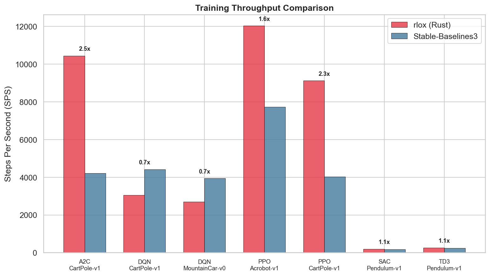

<p align="center">
  
</p>

<h1 align="center">rlox</h1>

<p align="center">Rust-accelerated reinforcement learning — the Polars architecture pattern applied to RL.</p>

<p align="center">
  <a href="https://crates.io/crates/rlox-core"></a>
  <a href="https://pypi.org/project/rlox/"></a>
  <a href="https://github.com/riserally/rlox/actions/workflows/ci.yml"></a>
  <a href="https://deepwiki.com/riserally/rlox"></a>
  <a href="LICENSE-MIT"></a>
</p>

## Why rlox?

RL frameworks like Stable-Baselines3 and TorchRL do everything in Python — environment stepping, buffer storage, advantage computation. This works, but Python interpreter overhead becomes the bottleneck long before your GPU does.

rlox applies the **Polars architecture pattern** to RL: a **Rust data plane** handles the compute-heavy, latency-sensitive work (env stepping, buffers, GAE) while a **Python control plane** stays in charge of training logic, configs, and neural networks via PyTorch. The two connect through PyO3 with zero-copy where possible.

The result: **3-50x faster** than SB3/TorchRL on data-plane operations, with the same Python training API you're used to.

## Quick Start

```bash
pip install rlox
```

Or build from source (requires Rust 1.75+):

```bash
python3 -m venv .venv && source .venv/bin/activate
pip install maturin numpy gymnasium torch
maturin develop --release
```

**Train PPO on CartPole in 3 lines:**

```python
from rlox.trainers import PPOTrainer

trainer = PPOTrainer(env="CartPole-v1", seed=42)
metrics = trainer.train(total_timesteps=50_000)
print(f"Mean reward: {metrics['mean_reward']:.1f}")
```

**Train SAC on Pendulum:**

```python
from rlox.trainers import SACTrainer

trainer = SACTrainer(env="Pendulum-v1", config={"learning_starts": 500})
metrics = trainer.train(total_timesteps=20_000)
```

**Use Rust primitives directly:**

```python
import rlox

# 140x faster GAE than Python loops
advantages, returns = rlox.compute_gae(rewards, values, dones, last_value, gamma=0.99, lam=0.95)

# 35x faster GRPO advantages
advantages = rlox.compute_batch_group_advantages(rewards, group_size=4)

# Parallel env stepping (2.7M steps/s at 512 envs)
env = rlox.VecEnv(n=256, seed=42, env_id="CartPole-v1")
result = env.step_all(actions)
```

> More examples in [`examples/`](examples/) — PPO, SAC, GRPO custom rewards, fast GAE, VecEnv throughput.

## Architecture

```
┌──────────────────────────────────────────────────┐
│  Python (control plane)                          │
│  PPO, SAC, DQN, TD3, A2C, GRPO, DPO             │
│  GymVecEnv, callbacks, configs (YAML),           │
│  trainers, checkpointing, diagnostics            │
│  vLLM/TGI/SGLang backends, multi-GPU (DDP)       │
├────────────── PyO3 boundary ─────────────────────┤
│  Rust (data plane)                               │
│  rlox-core:   envs, Rayon parallel stepping,     │
│               buffers (ring, mmap, priority),    │
│               GAE, V-trace, GRPO, pipeline       │
│  rlox-nn:     RL algorithm traits                │
│  rlox-burn:   Burn backend (NdArray)             │
│  rlox-candle: Candle backend (CPU)               │
│  rlox-python: PyO3 bindings                      │
└──────────────────────────────────────────────────┘
```

Multi-crate workspace ([crates.io](https://crates.io/crates/rlox-core)):
- **rlox-core** — pure Rust: environments, buffers (ring, mmap, priority), GAE, V-trace, GRPO, pipeline
- **rlox-nn** — RL algorithm traits (`ActorCritic`, `QFunction`, `StochasticPolicy`, etc.)
- **rlox-burn** — Burn `Autodiff<NdArray>` implementations
- **rlox-candle** — Candle CPU implementations
- **rlox-python** — PyO3 bindings exposing `rlox-core` to Python

> For a deep-dive into the architecture, module relationships, and API reference, see the [DeepWiki](https://deepwiki.com/riserally/rlox).

## Benchmark Highlights

All benchmarks on Apple M4 with bootstrap 95% CI (10,000 resamples). All results statistically significant (CI lower bound > 1.0).

| Component | vs SB3 | vs TorchRL | Details |
|-----------|--------|------------|---------|
| GAE (32K steps) | 147x vs NumPy | **1,700x** | [docs/benchmark/gae.md](docs/benchmark/gae.md) |
| Buffer push (10K) | **9.7x** | **148x** | [docs/benchmark/buffer-ops.md](docs/benchmark/buffer-ops.md) |
| Buffer sample (1024) | **8.1x** | **10x** | [docs/benchmark/buffer-ops.md](docs/benchmark/buffer-ops.md) |
| E2E rollout (256×2048) | **3.9x** | **53x** | [docs/benchmark/e2e-rollout.md](docs/benchmark/e2e-rollout.md) |
| GRPO advantages | 35x vs NumPy | 34x vs PyTorch | [docs/benchmark/llm-ops.md](docs/benchmark/llm-ops.md) |
| Env stepping (512 envs) | — | — | [2.7M steps/s](docs/benchmark/env-stepping.md) |

> **Full methodology, raw data, and reproducibility instructions**: [docs/benchmark/](docs/benchmark/)

### Convergence (rlox vs SB3)

Same hyperparameters (rl-zoo3 defaults), 5 seeds per experiment. On-policy algorithms (PPO, A2C) show **1.4-3.3x faster wall-clock** convergence with matching reward thresholds.

| Algorithm | Environment | rlox Wall-clock | SB3 Wall-clock | rlox SPS | SB3 SPS |
|-----------|-------------|-----------------|----------------|----------|---------|
| PPO | CartPole-v1 | **1.6s** | 5.2s | **9,121** | 4,026 |
| A2C | CartPole-v1 | **1.8s** | 2.1s | **10,445** | 4,206 |
| PPO | Acrobot-v1 | **6.4s** | 9.1s | **12,030** | 7,727 |



> Full convergence results, learning curves, and performance profiles: [benchmarks/convergence/](benchmarks/convergence/)

## Features

- **Algorithms**: PPO, SAC, DQN, TD3, A2C, GRPO, DPO, MAPPO, DreamerV3, IMPALA
- **Environments**: Gymnasium-compatible, Rayon-parallel VecEnv, CartPole built-in
- **Buffers**: ring, mmap, priority replay — all in Rust with zero-copy Python access
- **LLM post-training**: GRPO, DPO, token KL, sequence packing, vLLM/TGI/SGLang backends
- **Distributed**: pipeline parallelism (crossbeam), gRPC workers, multi-GPU (DDP)
- **Production**: YAML configs, callbacks, checkpointing, eval toolkit, diagnostics
- **NN backends**: Burn (NdArray) and Candle (CPU) for pure-Rust inference, PyTorch for training
- **313 Rust tests, 382 Python tests** — all passing

## Tutorials & Documentation

| Guide | Description |
|-------|-------------|
| [Getting Started](docs/getting-started.md) | Installation, first training run, basic API |
| [Custom Rewards & Training Loops](docs/tutorials/custom-rewards-and-training-loops.md) | Reward shaping, GRPO reward functions, custom algorithms |
| [Python Guide](docs/python-guide.md) | Python API reference and patterns |
| [Rust Guide](docs/rust-guide.md) | Rust crate architecture and extending in Rust |
| [Math Reference](docs/math-reference.md) | GAE, V-trace, GRPO, DPO derivations |
| [Benchmark Details](docs/benchmark/) | Full methodology, per-benchmark analysis, reproducibility |
| [DeepWiki](https://deepwiki.com/riserally/rlox) | Auto-generated architecture docs and API reference |

## Running Tests

```bash
# All tests (Rust + Python)
./scripts/test.sh

# Rust only
cargo test --package rlox-core

# Python only (after maturin develop)
.venv/bin/python -m pytest tests/python/ -v

# Full benchmark suite (rlox vs TorchRL vs SB3)
.venv/bin/python benchmarks/run_all.py
```

## Project Layout

```
crates/
  rlox-core/       Pure Rust: envs, buffers (ring, mmap, priority), GAE,
                   V-trace, GRPO, pipeline (crossbeam), sequence packing
  rlox-nn/         RL algorithm traits (ActorCritic, QFunction, etc.)
  rlox-burn/       Burn backend (Autodiff<NdArray>)
  rlox-candle/     Candle backend (CPU)
  rlox-python/     PyO3 bindings
  rlox-bench/      Criterion benchmarks (env stepping, NN backends)
python/rlox/
  algorithms/      PPO, SAC, DQN, TD3, A2C, GRPO, DPO, MAPPO, DreamerV3, IMPALA
  distributed/     Pipeline, vLLM/TGI/SGLang backends, multi-GPU (DDP)
  llm/             LLM environment, reward model serving
  *.py             Collectors, configs, callbacks, policies, trainers,
                   evaluation toolkit, diagnostics, checkpointing
benchmarks/        Three-framework benchmark suite + convergence tests
tests/python/      Python integration & benchmark TDD tests
docs/              Guides, tutorials, benchmark methodology
```

## Citation

If you use rlox in your research, please cite:

```bibtex
@software{kowalinski2026rlox,
  author       = {Kowalinski, Wojciech},
  title        = {rlox: Rust-Accelerated Reinforcement Learning},
  year         = {2026},
  url          = {https://github.com/riserally/rlox},
  version      = {0.2.3},
  license      = {MIT OR Apache-2.0}
}
```

## License

Dual-licensed under [MIT](LICENSE-MIT) or [Apache 2.0](LICENSE-APACHE), at your option.
