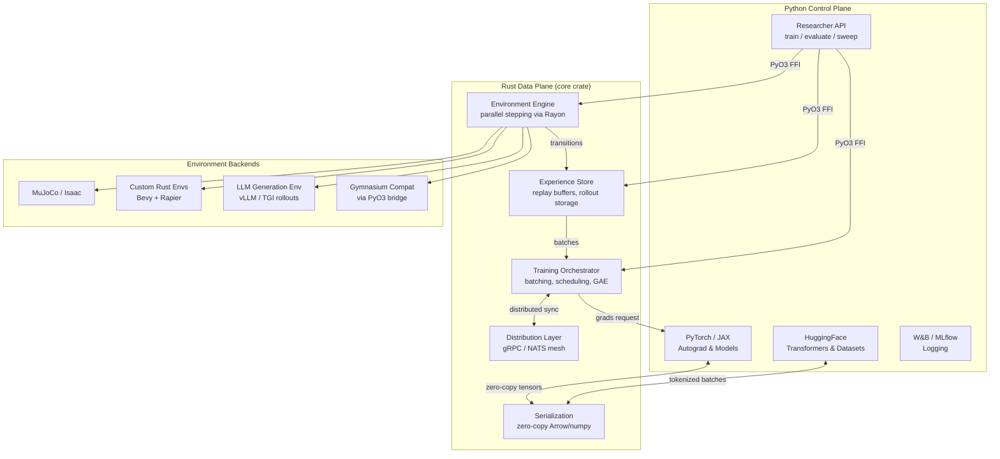
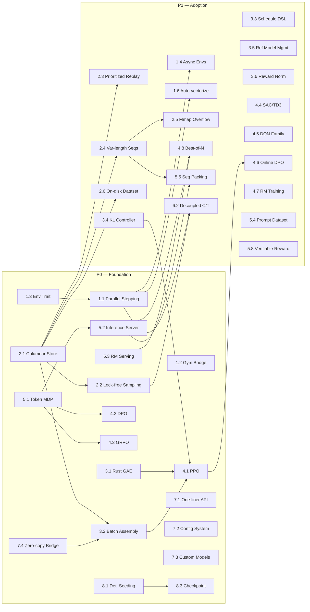
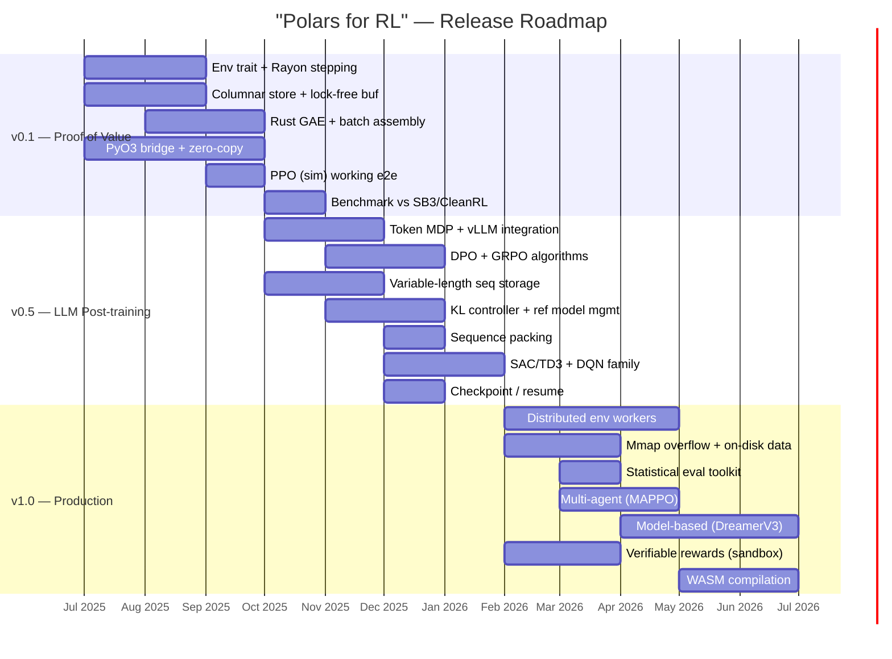

# "Polars for RL" — Feature Specification & Priority Matrix

**Vision**: A Rust-core, Python-interface reinforcement learning framework following the Polars architecture pattern. Rust handles the performance-critical data plane; Python remains the researcher-facing control plane with full PyTorch/JAX interop.

**Target users**: RL researchers working across classic simulation (MuJoCo, Atari, custom envs) **and** LLM post-training (RLHF, DPO, GRPO, online RL from human/AI feedback).

---

## Architecture overview



---

## Priority levels

| Level | Label | Meaning |
|-------|-------|---------|
| **P0** | **Critical** | Must-have for v0.1. Without these, the framework has no reason to exist over SB3/TorchRL. |
| **P1** | **High** | Required for v0.5 adoption by research teams. Core competitive advantages. |
| **P2** | **Medium** | Important for v1.0 production readiness. Differentiators for power users. |
| **P3** | **Nice-to-have** | Future roadmap. Ecosystem maturity signals. |

---

## 1 · Environment engine

The single highest-ROI Rust component. Environment stepping is CPU-bound, GIL-constrained, and embarrassingly parallel — the exact profile where Rust delivers 10–20× gains.

| # | Feature | Priority | Sim | LLM | Description |
|---|---------|----------|-----|-----|-------------|
| 1.1 | **Parallel env stepping (Rayon)** | **P0** | ★★★ | ★★ | True multi-threaded `step()` across N environments with zero GIL contention. Rayon work-stealing scheduler. Target: linear scaling to 128+ envs on a single machine. |
| 1.2 | **Gymnasium-compatible Python bridge** | **P0** | ★★★ | ★ | Any existing `gymnasium.Env` subclass works via PyO3 bridge. Fallback mode: wraps Python env in a Rust-managed thread with GIL acquisition batched per step-batch. |
| 1.3 | **Rust-native env trait** | **P0** | ★★★ | ★★ | `trait RLEnv { fn step(&mut self, action: Action) -> Transition; fn reset(&mut self) -> Obs; }` with compile-time action/observation space type checking. |
| 1.4 | **Async env collection** | **P1** | ★★★ | ★★★ | Environments that finish early don't block others. Critical for LLM generation where sequence lengths vary 10–100×. Uses `tokio` or Rayon async tasks with per-env completion futures. |
| 1.5 | **LLM generation env wrapper** | **P0** | — | ★★★ | Wraps vLLM/TGI/SGLang as an RL environment. `action = token_ids`, `obs = (prompt, generated_so_far)`, `reward = reward_model_score`. Handles KV-cache lifecycle, batched generation, and variable-length episodes. |
| 1.6 | **Auto-vectorization** | **P1** | ★★★ | ★★ | Automatic batching of `step()` calls across envs into contiguous tensor operations where possible (e.g., batch MuJoCo physics). Analogous to EnvPool's batched C++ stepping. |
| 1.7 | **Env checkpointing / forking** | **P2** | ★★ | ★★★ | Save/restore env state for MCTS-style planning, best-of-N sampling in LLM post-training, or reward model data collection. Copy-on-write semantics in Rust. |
| 1.8 | **WASM env compilation** | **P3** | ★★ | ★ | Rust envs compile to WASM for browser-based visualization, human evaluation interfaces, and edge deployment. |

---

## 2 · Experience storage (replay buffers & rollout storage)

The second highest-ROI component. Python replay buffers are memory-unsafe, GIL-bound on sampling, and waste memory on object overhead.

| # | Feature | Priority | Sim | LLM | Description |
|---|---------|----------|-----|-----|-------------|
| 2.1 | **Columnar experience store** | **P0** | ★★★ | ★★★ | Arrow-backed columnar storage for transitions. Zero-copy sharing with PyTorch/NumPy via `rust-numpy`. Fixed per-transition overhead regardless of observation complexity. |
| 2.2 | **Lock-free concurrent sampling** | **P0** | ★★★ | ★★★ | Writers (env workers) and readers (learner) operate concurrently without blocking. Crossbeam-based lock-free ring buffer or epoch-based reclamation. |
| 2.3 | **Prioritized experience replay** | **P1** | ★★★ | ★★ | Sum-tree in Rust with O(log N) sampling and O(log N) priority update. Thread-safe priority updates from learner thread. |
| 2.4 | **Variable-length sequence storage** | **P0** | ★ | ★★★ | LLM trajectories have variable token lengths. Store sequences contiguously with offset arrays (Arrow list-type pattern). No padding waste. Efficient slicing for KL-penalty windows. |
| 2.5 | **Memory-mapped overflow** | **P1** | ★★ | ★★★ | When buffer exceeds RAM, transparently spill to NVMe via `mmap`. Critical for LLM post-training where a single trajectory can be 100K+ tokens. RLlib currently cannot do this at all. |
| 2.6 | **On-disk experience dataset** | **P1** | ★★ | ★★★ | Read/write experience in Parquet or Arrow IPC for offline RL, DPO pair datasets, and reward model training data. Lazy loading with predicate pushdown (Polars-style). |
| 2.7 | **Multi-table relational storage** | **P2** | ★ | ★★★ | Separate tables for prompts, completions, rewards, KL terms, reward model features. Join on `(episode_id, step_id)`. Essential for complex LLM post-training pipelines with multiple reward signals. |
| 2.8 | **Automatic trajectory segmentation** | **P1** | ★★★ | ★★★ | Automatically detect and segment episodes within a continuous stream. Compute per-episode returns, advantages (GAE), and statistics in Rust. |

---

## 3 · Training loop orchestration

Where Python interpreter overhead costs 2–7× (per LeanRL benchmarks). The orchestrator batches work and calls PyTorch only for forward/backward passes.

| # | Feature | Priority | Sim | LLM | Description |
|---|---------|----------|-----|-----|-------------|
| 3.1 | **Rust-native GAE / advantage computation** | **P0** | ★★★ | ★★★ | Generalized Advantage Estimation computed in Rust. TorchRL showed 10.6× over SB3's NumPy GAE. Support lambda-returns, V-trace, UPGO. |
| 3.2 | **Batch assembly pipeline** | **P0** | ★★★ | ★★★ | Collate transitions into training batches in Rust. Handle padding, masking, and sequence packing for LLM trajectories. Output: zero-copy PyTorch tensors. |
| 3.3 | **Training schedule DSL** | **P1** | ★★★ | ★★★ | Declarative specification of the collect→process→train→evaluate loop. Supports `n_steps` and `n_episodes` collection, configurable train/collect ratio, periodic evaluation. Compiled to Rust state machine. |
| 3.4 | **KL-penalty / KL-controller** | **P0** | — | ★★★ | Adaptive KL penalty coefficient (Ziegler et al. 2019 style) managed in Rust. Computes token-level KL divergence between policy and reference model efficiently. Critical for RLHF/PPO. |
| 3.5 | **Reference model management** | **P1** | — | ★★★ | Efficient reference model logprob computation. Support for: (a) separate ref model copy, (b) LoRA-based ref as base model, (c) periodic ref model update. Orchestrate GPU memory between policy and ref model. |
| 3.6 | **Reward normalization & shaping** | **P1** | ★★★ | ★★★ | Running reward statistics (mean, variance, min, max) maintained in Rust. Whitening, clipping, multi-objective reward mixing. For LLMs: per-token vs per-sequence reward decomposition. |
| 3.7 | **Mixed-precision orchestration** | **P2** | ★★ | ★★★ | Coordinate bf16/fp16 forward passes with fp32 gradient accumulation. Manage loss scaling. Particularly important for LLM post-training where memory is the binding constraint. |
| 3.8 | **Gradient accumulation scheduler** | **P1** | ★ | ★★★ | Accumulate gradients across micro-batches before optimizer step. Rust orchestrator tracks accumulation state and triggers optimizer only at step boundaries. Essential for large-batch LLM training on limited GPU memory. |

---

## 4 · Algorithm implementations

The framework should ship batteries-included, but algorithms are the *least* important piece to rewrite in Rust — the gradient computation stays in PyTorch.

| # | Feature | Priority | Sim | LLM | Description |
|---|---------|----------|-----|-----|-------------|
| 4.1 | **PPO (clip + KL variants)** | **P0** | ★★★ | ★★★ | The universal RL algorithm. Used for simulation tasks and as the backbone of RLHF. Must support both clip-objective and adaptive-KL variants. |
| 4.2 | **DPO / IPO / KTO** | **P0** | — | ★★★ | Direct preference optimization family. No explicit reward model — pairs of (chosen, rejected) completions. Rust handles pair sampling, batch construction, and implicit reward computation. |
| 4.3 | **GRPO (Group Relative Policy Optimization)** | **P0** | — | ★★★ | DeepSeek-R1's algorithm. Generates K completions per prompt, ranks by reward, uses group-relative advantages. Rust manages the K-completion parallel generation and advantage normalization. |
| 4.4 | **SAC / TD3 / DDPG** | **P1** | ★★★ | — | Continuous-control staples. Twin Q-networks, automatic entropy tuning, target network polyak updates. |
| 4.5 | **DQN family (DQN, C51, Rainbow)** | **P1** | ★★★ | — | Discrete-action algorithms. Prioritized replay integration from feature 2.3. |
| 4.6 | **Online DPO / OAIF** | **P1** | — | ★★★ | Online variants that generate completions on-policy, score with reward model, construct preference pairs, and update — all in a single loop iteration. |
| 4.7 | **Reward model training loop** | **P1** | — | ★★★ | Bradley-Terry preference model training on comparison data. Shares the experience storage layer (feature 2.6). |
| 4.8 | **Best-of-N / rejection sampling** | **P1** | ★ | ★★★ | Generate N completions, score with reward model, keep best. A simple but effective post-training baseline. Rust parallelizes the generation and scoring. |
| 4.9 | **REINFORCE Leave-One-Out (RLOO)** | **P2** | ★ | ★★★ | Variance reduction technique for policy gradient LLM training. Rust computes leave-one-out baselines from K samples per prompt. |
| 4.10 | **Model-based (DreamerV3 / TD-MPC)** | **P2** | ★★★ | — | World-model RL. Rust-native imagination rollouts in learned latent space eliminate Python overhead in the planning loop. |
| 4.11 | **Multi-agent (MAPPO, QMIX)** | **P2** | ★★★ | — | Centralized training, decentralized execution. Rust manages observation routing and shared replay across agents. |

---

## 5 · LLM post-training specifics

These features don't exist in any current simulation-focused RL framework. They represent the strongest differentiation opportunity.

| # | Feature | Priority | Sim | LLM | Description |
|---|---------|----------|-----|-----|-------------|
| 5.1 | **Token-level MDP abstraction** | **P0** | — | ★★★ | Model the LLM generation process as an MDP where states are token sequences, actions are next-token selections, and rewards can be per-token or per-sequence. Rust trait unifies both granularities. |
| 5.2 | **Inference server integration** | **P0** | — | ★★★ | First-class connectors for vLLM, TGI, SGLang. Manage generation requests, KV-cache reuse, and continuous batching. Rust async client with connection pooling and backpressure. |
| 5.3 | **Reward model serving integration** | **P0** | — | ★★★ | Batch scoring of completions against reward model(s). Support for: single RM, ensemble, multi-objective (helpfulness + safety + style). Rust manages batching and caching of RM scores. |
| 5.4 | **Prompt dataset management** | **P1** | — | ★★★ | Streaming prompt iteration with shuffling, curriculum ordering, and deduplication. Parquet/Arrow-native. Support stratified sampling by difficulty, domain, or source. |
| 5.5 | **Sequence packing** | **P1** | — | ★★★ | Pack multiple variable-length sequences into fixed-size GPU batches to maximize utilization. Rust bin-packing solver with position-ID and attention-mask generation. Reduces wasted GPU FLOPS by 30–60%. |
| 5.6 | **KV-cache aware rollout scheduling** | **P2** | — | ★★★ | Schedule prompt batches to maximize KV-cache reuse across generation and scoring. Co-locate prompts that share prefixes. Rust manages the scheduling optimization. |
| 5.7 | **Constitutional AI / RLAIF pipeline** | **P2** | — | ★★★ | Full pipeline: generate → critique (LLM-as-judge) → revise → create preference pairs → train. Rust orchestrates the multi-step LLM interaction and manages the growing dataset. |
| 5.8 | **Verifiable reward computation** | **P1** | — | ★★★ | For code/math tasks: execute code, check proofs, run test suites as reward signals. Rust sandbox with timeout, memory limits, and output parsing. Key for DeepSeek-R1 style training. |

---

## 6 · Distribution & scaling

| # | Feature | Priority | Sim | LLM | Description |
|---|---------|----------|-----|-----|-------------|
| 6.1 | **Single-machine multi-GPU** | **P0** | ★★ | ★★★ | NCCL-backed data-parallel training across GPUs on one node. Rust orchestrator manages micro-batch distribution. The 90% case for most research teams. |
| 6.2 | **Decoupled collection / training** | **P1** | ★★★ | ★★★ | Env workers and learner run as separate Rust async tasks (single-machine) or processes (multi-machine). Asynchronous experience transfer via shared memory or gRPC. |
| 6.3 | **Distributed env workers** | **P2** | ★★ | ★★★ | Env stepping across multiple machines. For LLMs: distribute generation requests across inference server replicas. Rust gRPC service with load balancing. |
| 6.4 | **Multi-node training** | **P2** | ★ | ★★★ | Full cluster training with gradient synchronization across nodes. Leverage PyTorch DDP/FSDP for the gradient part; Rust handles data routing. |
| 6.5 | **Elastic scaling** | **P3** | ★ | ★★ | Add/remove env workers without restarting training. Useful for preemptible GPU instances. |

---

## 7 · Python API & developer experience

The make-or-break layer. If the Python API is worse than SB3's one-liner, adoption fails regardless of Rust performance.

| # | Feature | Priority | Sim | LLM | Description |
|---|---------|----------|-----|-----|-------------|
| 7.1 | **"One-liner" training API** | **P0** | ★★★ | ★★★ | `trainer = PPOTrainer(env="HalfCheetah-v4", model=policy); trainer.train(1_000_000)` — must be this simple for the default case. |
| 7.2 | **Composable config system** | **P0** | ★★★ | ★★★ | Dataclass-based config with full type hints. Merge from YAML/CLI/code. No RLlib-style nested dict hell. Inspired by Hydra but lighter. |
| 7.3 | **Custom model support** | **P0** | ★★★ | ★★★ | Any `nn.Module` (simulation) or HuggingFace `PreTrainedModel` (LLM) works as the policy. Framework does not impose model architecture. |
| 7.4 | **Zero-copy tensor bridge** | **P0** | ★★★ | ★★★ | Rust buffers exposed as PyTorch tensors without data copy. `rust-numpy` + `torch.from_numpy` or direct DLPack. Validated by Polars' zero-copy DataFrame interop. |
| 7.5 | **Callback / hook system** | **P1** | ★★★ | ★★★ | Python callbacks at well-defined points: `on_step`, `on_episode_end`, `on_train_batch`, `on_eval`. Rust invokes Python callbacks via PyO3 with batched payloads (not per-step). |
| 7.6 | **Rich logging integration** | **P1** | ★★★ | ★★★ | Native W&B, MLflow, TensorBoard integration. Rust collects metrics (reward, loss, KL, entropy, fps) and flushes to Python loggers periodically. |
| 7.7 | **Jupyter / notebook experience** | **P1** | ★★★ | ★★ | Progress bars, inline plots, interactive env rendering. Training runs don't block the notebook kernel. |
| 7.8 | **Type-safe space definitions** | **P1** | ★★★ | ★★ | Python-side type hints that mirror Rust's compile-time space checks. `Box[float32, (84,84,4)]`, `Discrete[18]`, `Dict[obs=Box, mask=MultiBinary]`. Early error on mismatch. |
| 7.9 | **Comprehensive error messages** | **P0** | ★★★ | ★★★ | Rust panics translated to clear Python exceptions with context. "Expected action shape (4,), got (3,) for environment HalfCheetah" — not a raw Rust backtrace. |

---

## 8 · Reproducibility & correctness

RL's reproducibility crisis means this is a genuine differentiator, not just a nice-to-have.

| # | Feature | Priority | Sim | LLM | Description |
|---|---------|----------|-----|-----|-------------|
| 8.1 | **Deterministic seeding** | **P0** | ★★★ | ★★★ | Single seed controls all Rust RNG, env resets, buffer sampling, and PyTorch seed. Bit-exact reproduction on same hardware + thread count. |
| 8.2 | **Experiment snapshot** | **P1** | ★★★ | ★★★ | Automatically record: git hash, full config, dependency versions, hardware info, seed. Serialize to JSON alongside checkpoints. |
| 8.3 | **Checkpoint / resume** | **P0** | ★★★ | ★★★ | Save and restore: model weights, optimizer state, buffer contents, RNG state, training step counter. Resume produces identical trajectory to uninterrupted run. |
| 8.4 | **Statistical evaluation toolkit** | **P1** | ★★★ | ★★★ | Built-in IQM, optimality gap, performance profiles (Agarwal et al., NeurIPS 2021). Stratified bootstrap CIs. Researchers should never need to reimplement rliable. |
| 8.5 | **Deterministic parallel reduction** | **P2** | ★★ | ★★ | When aggregating across parallel envs, use deterministic summation order (Kahan summation or sorted reduction). Eliminates floating-point non-associativity across thread counts. |
| 8.6 | **Transition-level provenance** | **P2** | ★ | ★★★ | Every stored transition tagged with: env_id, episode_id, step, policy_version, reward_model_version. Critical for debugging LLM post-training pipelines where data is generated across multiple policy iterations. |

---

## 9 · Observability & debugging

| # | Feature | Priority | Sim | LLM | Description |
|---|---------|----------|-----|-----|-------------|
| 9.1 | **Real-time throughput dashboard** | **P1** | ★★★ | ★★★ | Live FPS, GPU utilization, buffer occupancy, collect/train ratio. Terminal or web UI. |
| 9.2 | **Training diagnostics** | **P1** | ★★★ | ★★★ | Automatic detection of: policy entropy collapse, KL divergence spikes, gradient norm explosions, reward hacking signals. Logged as warnings. |
| 9.3 | **Trajectory inspector** | **P2** | ★★ | ★★★ | Browse individual trajectories: for simulation, replay env states; for LLMs, view prompt → completion → reward. Filter by reward, length, or anomaly. |
| 9.4 | **Profiler integration** | **P2** | ★★ | ★★ | Breakdown of wall-clock time: env stepping, buffer ops, model forward, backward, optimizer, data transfer. Identify which component is the bottleneck. |

---

## 10 · Testing & quality

| # | Feature | Priority | Sim | LLM | Description |
|---|---------|----------|-----|-----|-------------|
| 10.1 | **Algorithm correctness tests** | **P0** | ★★★ | ★★★ | Every algorithm tested against known baselines on canonical environments. PPO must solve CartPole in <50K steps, match CleanRL learning curves on Atari within 1 std. |
| 10.2 | **Property-based buffer tests** | **P1** | ★★★ | ★★★ | QuickCheck / proptest for replay buffer invariants: no data loss, correct priority ordering, FIFO eviction, thread-safety under concurrent read/write. |
| 10.3 | **Benchmark suite** | **P1** | ★★★ | ★★★ | Automated nightly benchmarks against SB3, CleanRL, TorchRL on standardized tasks. Publish results. "N× faster than X" must be continuously validated. |
| 10.4 | **Fuzz testing for env bridge** | **P2** | ★★ | ★ | Fuzz the PyO3 boundary with malformed observations, NaN rewards, infinite actions. The Rust core must never panic — only return typed errors. |

---

## Feature dependency graph



---

## Implementation phasing



---

## Competitive positioning matrix

```mermaid
quadrantChart
    title Framework Positioning: Performance vs Ecosystem
    x-axis "Narrow Ecosystem" --> "Rich Ecosystem"
    y-axis "Lower Performance" --> "Higher Performance"

    "Polars-for-RL (target)": [0.7, 0.9]
    SB3: [0.75, 0.3]
    CleanRL: [0.4, 0.35]
    TorchRL: [0.6, 0.65]
    RLlib: [0.8, 0.5]
    LeanRL: [0.3, 0.7]
    EnvPool: [0.2, 0.85]
    border (Rust): [0.1, 0.6]
```

---

## Summary of P0 features (MVP)

The minimum viable framework consists of **21 features** that together deliver the core value proposition: "SB3's simplicity, TorchRL's speed, plus first-class LLM post-training support."

| Category | P0 Count | Key deliverable |
|----------|----------|----------------|
| Environment Engine | 4 | Parallel Rust stepping + Gym bridge + LLM gen env |
| Experience Storage | 3 | Columnar store + lock-free sampling + var-length seqs |
| Training Orchestrator | 3 | Rust GAE + batch assembly + KL controller |
| Algorithms | 3 | PPO + DPO + GRPO |
| LLM Specifics | 3 | Token MDP + inference server + RM serving |
| Python API | 4 | One-liner API + config + custom models + zero-copy |
| Reproducibility | 2 | Det. seeding + checkpoint/resume |
| Quality | 1 | Algorithm correctness tests |

**Total estimated engineering effort for v0.1**: 3–4 months with a 2–3 person team experienced in both Rust and RL. The critical path runs through the PyO3 bridge (everything depends on it) and the LLM generation env wrapper (novel, unvalidated design).
