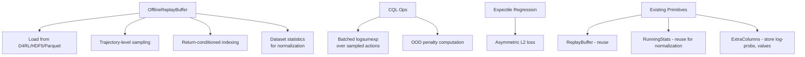
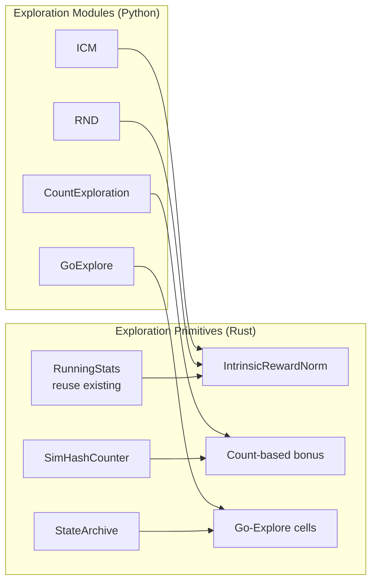
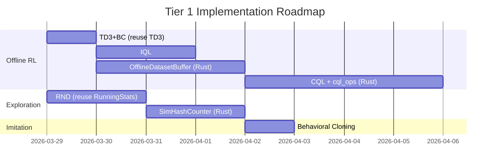
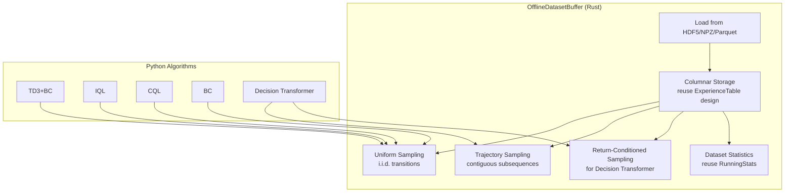

# rlox Algorithm Gap Analysis

**Date:** 2026-03-28
**Scope:** Identify missing algorithm families and prioritize by Rust-acceleration benefit

---

## 1. Current Inventory

### Python Algorithms (`python/rlox/algorithms/`)

| Algorithm | Lines | Category | Key Rust Deps |
|-----------|-------|----------|---------------|
| PPO | 240 | On-policy | VecEnv, GAE, RolloutCollector |
| A2C | 146 | On-policy | VecEnv, GAE |
| IMPALA | 383 | On-policy (distributed) | V-trace, Pipeline |
| MAPPO | 249 | Multi-agent | GAE, RolloutCollector |
| SAC | 362 | Off-policy | ReplayBuffer |
| TD3 | 343 | Off-policy | ReplayBuffer |
| DQN | 411 | Off-policy | ReplayBuffer, PrioritizedReplayBuffer |
| DreamerV3 | 276 | Model-based | ReplayBuffer |
| GRPO | 183 | LLM post-training | batch_group_advantages, token_kl |
| DPO | 136 | LLM post-training | DPOPair |
| OnlineDPO | 99 | LLM post-training | - |
| BestOfN | 61 | LLM post-training | - |

### Rust Primitives (`crates/rlox-core/src/`, 6823 LOC)

| Primitive | Lines | Hot Path? |
|-----------|-------|-----------|
| ReplayBuffer (ringbuf) | 617 | Yes - sampling |
| PrioritizedReplayBuffer (sum-tree) | 754 | Yes - O(log N) sampling |
| MmapReplayBuffer | 523 | Yes - spill-to-disk |
| ExperienceTable (columnar) | 214 | Yes - push |
| ExtraColumns | 270 | Yes - extensible metadata |
| Provenance (TransitionMeta) | 217 | No - metadata |
| VarLenStore | 159 | Yes - variable-length sequences |
| GAE (single + batched) | 376 | Yes - advantage computation |
| V-trace | 509 | Yes - off-policy correction |
| KL + GRPO ops | 73 | Yes - token-level LLM ops |
| Normalization (RunningStats) | 262 | Yes - obs/reward normalization |
| Sequence Packing | 330 | Yes - LLM batch packing |
| VecEnv (parallel) | 459 | Yes - env stepping |
| Built-in envs (CartPole) | 327 | Yes - native stepping |
| Pipeline (collector + channel) | 592 | Yes - async data pipeline |
| Candle collector | varies | Yes - Rust-native NN + env |

---

## 2. Gap Analysis by Algorithm Family

### 2.A Offline RL --- HIGH PRIORITY

**Status:** Completely absent. This is the largest gap.

**Why it matters:** Offline RL is the dominant paradigm for applying RL to real-world problems (healthcare, robotics, recommendation) where online interaction is expensive or dangerous. It is also directly adjacent to rlox's LLM post-training story (RLHF datasets are offline).

#### Candidate Algorithms

| Algorithm | Paper | Core Idea | Rust Acceleration Potential |
|-----------|-------|-----------|---------------------------|
| **CQL** [1] | Kumar et al., NeurIPS 2020 | Conservative Q-learning: penalize OOD Q-values | **HIGH** - CQL loss requires logsumexp over sampled actions in the buffer. Rust buffer sampling with CQL-specific action sampling (uniform + policy) is a hot loop |
| **IQL** [2] | Kostrikov et al., ICLR 2022 | Implicit Q-learning via expectile regression | **MEDIUM** - Standard buffer sampling, but expectile loss is a simple Python op |
| **TD3+BC** [3] | Fujimoto & Gu, NeurIPS 2021 | TD3 + behavioral cloning regularization | **HIGH** - Reuses existing TD3 + ReplayBuffer directly. Minimal new code (~150 LOC Python) |
| **Decision Transformer** [4] | Chen et al., NeurIPS 2021 | Sequence modeling with return conditioning | **HIGH** - Requires trajectory-level sampling from buffer (not i.i.d. transitions). New Rust primitive: `TrajectoryBuffer` with return-conditioned sampling |
| **AWAC** [5] | Nair et al., 2020 | Advantage-weighted actor-critic | **MEDIUM** - Standard buffer sampling + advantage weighting |
| **Cal-QL** [6] | Nakamoto et al., NeurIPS 2023 | Calibrated CQL with online fine-tuning | **HIGH** - Extends CQL, same buffer needs |

#### Recommended Rust Primitives for Offline RL



**New Rust primitives needed:**

1. **`OfflineDatasetBuffer`** (~400 LOC Rust): Load-once, no-overwrite buffer from static datasets. Supports HDF5/numpy/Parquet ingestion. Trajectory-level indexing via episode boundary tracking. Return-conditioned sampling for Decision Transformer.

2. **`cql_ops`** (~150 LOC Rust): Batched logsumexp over N random + N policy actions per state. This is the CQL bottleneck --- for each state in the batch, you sample `N_random + N_policy` actions and compute `log(sum(exp(Q(s,a))))`. With batch_size=256 and N=10, that is 5120 Q-evaluations per step. The action sampling and assembly is Rust-acceleratable.

3. **`trajectory_sampler`** (~200 LOC Rust): Sample contiguous subsequences of length `K` from episode boundaries. Critical for Decision Transformer, which needs `(R, s, a)` subsequences. Currently no episode-boundary tracking in `ReplayBuffer`.

**Estimated total:** ~750 LOC Rust, ~800 LOC Python (CQL + IQL + TD3+BC + DT)

#### Priority Ordering

1. **TD3+BC** --- Lowest effort, highest reuse (existing TD3 + ReplayBuffer). ~150 LOC Python, ~0 LOC Rust. Ship in 1 day.
2. **IQL** --- Clean algorithm, strong baselines. ~250 LOC Python, ~50 LOC Rust (expectile ops). Ship in 2 days.
3. **CQL** --- The "standard" offline RL method. ~300 LOC Python, ~150 LOC Rust (cql_ops). Ship in 3-4 days.
4. **Decision Transformer** --- Requires trajectory buffer. ~400 LOC Python, ~400 LOC Rust (trajectory_sampler + OfflineDatasetBuffer). Ship in 1 week.

---

### 2.B Contextual Bandits --- LOW-MEDIUM PRIORITY

**Status:** Absent.

**Assessment:** Bandits occupy a different niche than rlox's core positioning. They are primarily used in recommendation systems and A/B testing, where the "environment" is a request stream rather than an MDP. However, two subcategories have genuine Rust-acceleration potential:

| Algorithm | Rust Benefit | Notes |
|-----------|-------------|-------|
| **LinUCB** [7] (Li et al., 2010) | **HIGH** - Online matrix inverse updates (Sherman-Morrison), batched arm selection | O(d^2) per step, vectorizes well |
| **Thompson Sampling** [8] (Agrawal & Goyal, 2013) | **MEDIUM** - Posterior sampling is a hot loop for large action spaces | |
| **Neural Bandits** (NeuralUCB [9], NeuralTS) | **LOW** - Forward pass dominates, Rust adds little | PyTorch handles the NN; only the UCB/TS selection logic could be Rust |
| **UCB1** | **LOW** - Trivial algorithm | |

**Verdict:** Skip for now. LinUCB is the only one where Rust genuinely helps, and it serves a different user base. Revisit if demand appears.

---

### 2.C Multi-Agent RL --- MEDIUM PRIORITY

**Status:** MAPPO exists (249 LOC). No value decomposition or communication protocols.

| Algorithm | Paper | Rust Benefit | Complexity |
|-----------|-------|-------------|------------|
| **QMIX** [10] (Rashid et al., 2018) | Value decomposition with monotonic mixing | **HIGH** - Requires centralized replay buffer with per-agent observations; batch assembly from multi-agent transitions is O(n_agents * batch_size) | ~350 LOC Python, ~200 LOC Rust (multi-agent buffer) |
| **MADDPG** [11] (Lowe et al., 2017) | Multi-agent DDPG with centralized critic | **MEDIUM** - Reuses off-policy buffer, but needs per-agent action concatenation | ~300 LOC Python, ~100 LOC Rust |
| **HAPPO** [12] (Kuba et al., 2022) | Heterogeneous-agent PPO | **MEDIUM** - Sequential policy update with trust region | ~250 LOC Python |

**New Rust primitive:**

- **`MultiAgentReplayBuffer`** (~300 LOC): Ring buffer storing `(obs_1..N, act_1..N, reward_shared, obs_next_1..N)`. Efficient joint-observation assembly for centralized critics. Extends existing `ReplayBuffer` with agent-axis indexing.

**Verdict:** QMIX is the natural next step after MAPPO. It requires a multi-agent buffer which is a genuine Rust win (assembling joint observations for N agents x batch_size transitions).

---

### 2.D Safe RL --- LOW PRIORITY

**Status:** Absent.

| Algorithm | Paper | Rust Benefit |
|-----------|-------|-------------|
| **CPO** [13] (Achiam et al., 2017) | Constrained policy optimization | **LOW** - Conjugate gradient + line search are small Python ops |
| **PCPO** [14] (Yang et al., 2020) | Projection-based CPO | **LOW** |
| **Lagrangian PPO** [15] | PPO with Lagrange multiplier for constraints | **LOW** - Adds ~30 lines to existing PPO |
| **WCSAC** [16] (Yang et al., 2021) | Worst-case SAC | **LOW** |

**Verdict:** The constraint handling logic is lightweight Python (Lagrange multiplier update, cost advantage computation). The heavy lifting (GAE, buffer sampling) already exists in Rust. Adding Lagrangian PPO is trivial (~50 LOC delta on existing PPO) but does not constitute a Rust acceleration story. Low priority unless safety-critical users appear.

---

### 2.E Meta-RL --- LOW PRIORITY

**Status:** Absent.

| Algorithm | Paper | Rust Benefit |
|-----------|-------|-------------|
| **MAML** [17] (Finn et al., 2017) | Model-agnostic meta-learning | **LOW** - Second-order gradients are PyTorch ops. The inner loop is short. |
| **RL^2** [18] (Duan et al., 2016) | RL with recurrent policies | **LOW** - Just PPO with GRU, no new primitives |
| **PEARL** [19] (Rakelly et al., 2019) | Context-based meta-learning | **MEDIUM** - Context buffer (task-indexed replay buffer) could be Rust |

**Verdict:** Meta-RL's bottleneck is the many-task inner loop, which is inherently sequential per-task. rlox's VecEnv helps with task parallelism, but the meta-gradient computation is PyTorch territory. Low priority.

---

### 2.F Inverse RL / Imitation Learning --- MEDIUM PRIORITY

**Status:** Absent.

| Algorithm | Paper | Rust Benefit | Notes |
|-----------|-------|-------------|-------|
| **Behavioral Cloning** | N/A | **HIGH** - Uses OfflineDatasetBuffer (same as offline RL) | ~100 LOC Python, reuses offline buffer |
| **DAgger** [20] (Ross et al., 2011) | Dataset aggregation | **HIGH** - Aggregation buffer (append-only with mixing) is a natural Rust primitive | ~200 LOC Python, ~100 LOC Rust |
| **GAIL** [21] (Ho & Ermon, 2016) | Generative adversarial IL | **MEDIUM** - Discriminator is PyTorch; demo buffer reuses ReplayBuffer | ~300 LOC Python, ~50 LOC Rust |
| **IRL (MaxEntIRL)** [22] (Ziebart et al., 2008) | Maximum entropy IRL | **LOW** - Small-scale, feature-based | Not relevant for rlox |

**Verdict:** BC and DAgger are low-hanging fruit. BC is literally "supervised learning on demonstrations" and requires only the `OfflineDatasetBuffer` from the offline RL work. DAgger adds an aggregation buffer. Both are commonly requested by robotics users. GAIL is more complex but reuses existing off-policy infrastructure.

---

### 2.G Exploration --- MEDIUM-HIGH PRIORITY

**Status:** Basic noise strategies exist (GaussianNoise, EpsilonGreedy, OUNoise in `exploration.py`). No intrinsic motivation.

| Algorithm | Paper | Rust Benefit | Notes |
|-----------|-------|-------------|-------|
| **RND** [23] (Burda et al., 2019) | Random Network Distillation | **HIGH** - Running normalization of intrinsic rewards is a Rust op (reuse `RunningStats`). The predictor/target networks are PyTorch. | ~200 LOC Python, ~50 LOC Rust |
| **ICM** [24] (Pathak et al., 2017) | Intrinsic Curiosity Module | **MEDIUM** - Forward/inverse model are PyTorch | ~250 LOC Python |
| **Count-based** [25] (Bellemare et al., 2016) | Pseudo-counts via density models | **HIGH** - Hash-based counting in Rust with SimHash is very fast, O(1) per step | ~100 LOC Rust, ~100 LOC Python |
| **Go-Explore** [26] (Ecoffet et al., 2021) | Archive of interesting states | **HIGH** - State archive with cell-based hashing is a pure data structure problem. Rust excels here | ~300 LOC Rust, ~200 LOC Python |



**Verdict:** Exploration is a strong Rust story. The data structures (hash counters, state archives, running statistics) are exactly where Rust shines --- high-throughput, cache-friendly, zero-allocation hot paths. RND is the easiest win because it reuses `RunningStats`.

---

### 2.H Hierarchical RL --- LOW PRIORITY

**Status:** Absent.

| Algorithm | Paper | Rust Benefit |
|-----------|-------|-------------|
| **Options Framework** [27] (Sutton et al., 1999) | Macro-actions with termination | **LOW** - Option selection/termination is lightweight |
| **HIRO** [28] (Nachum et al., 2018) | Hierarchical with off-policy correction | **MEDIUM** - Goal-conditioned replay buffer needs relabeling in Rust |
| **HAM** [29] (Parr & Russell, 1997) | Hierarchies of abstract machines | **LOW** - Academic interest, little practical demand |

**Verdict:** Low demand, limited Rust acceleration story. The only interesting Rust primitive would be a goal-conditioned replay buffer with Hindsight Experience Replay (HER) [30] relabeling, which is genuinely hot-path.

**HER relabeling primitive** (~200 LOC Rust): For each sampled transition, relabel the goal with a future achieved goal from the same episode. Requires episode boundary tracking (same need as Decision Transformer).

---

## 3. Prioritized Roadmap

### Tier 1: High Impact, Strong Rust Story (next 2-4 weeks)



| # | Algorithm | New Rust LOC | New Python LOC | Reused Primitives | Est. Days |
|---|-----------|-------------|----------------|-------------------|-----------|
| 1 | TD3+BC | 0 | 150 | ReplayBuffer, TD3 | 1 |
| 2 | IQL | 50 | 250 | ReplayBuffer | 2 |
| 3 | OfflineDatasetBuffer | 400 | 100 | ReplayBuffer (design pattern) | 3 |
| 4 | CQL | 150 | 300 | OfflineDatasetBuffer | 4 |
| 5 | RND | 50 | 200 | RunningStats | 2 |
| 6 | BC | 0 | 100 | OfflineDatasetBuffer | 1 |
| 7 | SimHashCounter | 100 | 100 | - | 2 |

**Total Tier 1:** ~750 LOC Rust, ~1200 LOC Python, ~15 days

### Tier 2: Medium Impact (weeks 5-8)

| # | Algorithm | New Rust LOC | New Python LOC | Est. Days |
|---|-----------|-------------|----------------|-----------|
| 8 | Decision Transformer | 400 | 400 | 5 |
| 9 | QMIX | 200 | 350 | 4 |
| 10 | DAgger | 100 | 200 | 2 |
| 11 | GAIL | 50 | 300 | 3 |
| 12 | Go-Explore archive | 300 | 200 | 3 |

### Tier 3: Low Priority / Niche (backlog)

| Algorithm | Rationale for deprioritizing |
|-----------|------------------------------|
| Lagrangian PPO | Trivial delta on PPO, add when requested |
| CPO/PCPO | Niche safe-RL, low Rust benefit |
| MAML/RL^2/PEARL | Meta-RL bottleneck is PyTorch, not data |
| LinUCB/bandits | Different user base |
| HIRO/Options | Low demand |
| HER | Add when goal-conditioned envs are common |

---

## 4. Architectural Recommendations

### 4.1 Shared Offline RL Infrastructure

The `OfflineDatasetBuffer` is the keystone primitive. It unlocks TD3+BC, IQL, CQL, BC, and Decision Transformer with a single Rust investment.



Key design decisions:
- **No overwrite**: Unlike `ReplayBuffer`, the offline buffer is loaded once and never modified (except for normalization).
- **Episode boundaries**: Store `episode_id` per transition. Enable trajectory-level sampling by indexing into episode start/end positions.
- **Lazy loading**: For D4RL-scale datasets (1M+ transitions), support memory-mapped loading via the existing `MmapReplayBuffer` pattern.
- **Normalization**: Compute `(obs - mean) / std` in Rust at load time using `RunningStats`.

### 4.2 Exploration as Pluggable Bonuses

```python
# Proposed API
from rlox.exploration import RNDBonus, CountBonus

rnd = RNDBonus(obs_dim=17, feature_dim=64)
count = CountBonus(hash_dim=32)  # Uses Rust SimHashCounter

# In training loop:
intrinsic_reward = rnd.compute_bonus(obs)  # or count.compute_bonus(obs)
total_reward = extrinsic_reward + beta * intrinsic_reward
```

The intrinsic reward normalization uses the existing `RunningStats` Rust primitive.

### 4.3 What NOT to Build in Rust

Some operations are better left in Python/PyTorch:

- **CQL's logsumexp** over Q-values: This requires Q-network forward passes, which are PyTorch ops. Only the action sampling (uniform + policy) benefits from Rust.
- **GAIL's discriminator training**: Pure PyTorch.
- **Decision Transformer's attention**: Pure PyTorch (or use HuggingFace's GPT-2).
- **Meta-RL inner loops**: Require `torch.autograd` for second-order gradients.

---

## 5. Competitive Landscape

| Library | Offline RL | Bandits | MARL | Exploration | Safe RL |
|---------|-----------|---------|------|-------------|---------|
| **d3rlpy** | CQL, IQL, TD3+BC, DT, BC, AWAC | No | No | No | No |
| **CleanRL** | No | No | No | No | No |
| **TorchRL** | CQL, IQL, DT | No | No | RND | No |
| **Stable-Baselines3** | No | No | No | No | No |
| **Tianshou** | CQL, BCQ, TD3+BC, BC | No | No | ICM | No |
| **OmniSafe** | No | No | No | No | CPO, PCPO, Lag |
| **EPyMARL** | No | No | QMIX, MAPPO | No | No |
| **rlox (current)** | No | No | MAPPO | Basic noise | No |
| **rlox (proposed)** | CQL, IQL, TD3+BC, DT, BC | No | MAPPO, QMIX | RND, Count | No |

**Key insight:** d3rlpy is the only serious offline RL library, and it is pure Python with no Rust acceleration. rlox could differentiate by offering Rust-accelerated offline RL --- particularly for large datasets where buffer I/O dominates.

---

## 6. References

[1] A. Kumar, A. Zhou, G. Tucker, S. Levine, "Conservative Q-Learning for Offline Reinforcement Learning," in Proc. NeurIPS, 2020.

[2] I. Kostrikov, A. Nair, S. Levine, "Offline Reinforcement Learning with Implicit Q-Learning," in Proc. ICLR, 2022.

[3] S. Fujimoto, S. Gu, "A Minimalist Approach to Offline Reinforcement Learning," in Proc. NeurIPS, 2021.

[4] L. Chen, K. Lu, A. Rajeswaran, K. Lee, A. Grover, M. Laskin, P. Abbeel, A. Srinivas, I. Mordatch, "Decision Transformer: Reinforcement Learning via Sequence Modeling," in Proc. NeurIPS, 2021.

[5] A. Nair, M. Dalal, A. Gupta, S. Levine, "Accelerating Online Reinforcement Learning with Offline Datasets," arXiv:2006.09359, 2020.

[6] M. Nakamoto, S. Zhai, A. Singh, M. Frederick, J. Tung, S. Levine, A. Kumar, "Cal-QL: Calibrated Offline RL Pre-Training for Efficient Online Fine-Tuning," in Proc. NeurIPS, 2023.

[7] L. Li, W. Chu, J. Langford, R. Schapire, "A Contextual-Bandit Approach to Personalized News Article Recommendation," in Proc. WWW, 2010.

[8] S. Agrawal, N. Goyal, "Thompson Sampling for Contextual Bandits with Linear Payoffs," in Proc. ICML, 2013.

[9] W. Zhou, D. Li, Q. Gu, "Neural Contextual Bandits with UCB-based Exploration," in Proc. ICML, 2020.

[10] T. Rashid, M. Samvelyan, C. de Witt, G. Farquhar, J. Foerster, S. Whiteson, "QMIX: Monotonic Value Function Factorisation for Deep Multi-Agent Reinforcement Learning," in Proc. ICML, 2018.

[11] R. Lowe, Y. Wu, A. Tamar, J. Harb, P. Abbeel, I. Mordatch, "Multi-Agent Actor-Critic for Mixed Cooperative-Competitive Environments," in Proc. NeurIPS, 2017.

[12] J. Kuba, R. Chen, M. Wen, Y. Wen, F. Sun, J. Wang, Y. Yang, "Trust Region Policy Optimisation in Multi-Agent Reinforcement Learning," in Proc. ICLR, 2022.

[13] J. Achiam, D. Held, A. Tamar, P. Abbeel, "Constrained Policy Optimization," in Proc. ICML, 2017.

[14] T. Yang, J. Rosca, T. Narasimhan, P. Ramadge, "Projection-Based Constrained Policy Optimization," in Proc. ICLR, 2020.

[15] R. Tessler, D. Mankowitz, S. Mannor, "Reward Constrained Policy Optimization," in Proc. ICLR, 2019.

[16] Q. Yang, T. Simao, S. Tindemans, M. Spaan, "WCSAC: Worst-Case Soft Actor Critic for Safety-Constrained Reinforcement Learning," in Proc. AAAI, 2021.

[17] C. Finn, P. Abbeel, S. Levine, "Model-Agnostic Meta-Learning for Fast Adaptation of Deep Networks," in Proc. ICML, 2017.

[18] Y. Duan, J. Schulman, X. Chen, P. Bartlett, I. Sutskever, P. Abbeel, "RL^2: Fast Reinforcement Learning via Slow Reinforcement Learning," arXiv:1611.02779, 2016.

[19] K. Rakelly, A. Zhou, C. Finn, S. Levine, D. Quillen, "Efficient Off-Policy Meta-Reinforcement Learning via Probabilistic Context Variables," in Proc. ICML, 2019.

[20] S. Ross, G. Gordon, J. Bagnell, "A Reduction of Imitation Learning and Structured Prediction to No-Regret Online Learning," in Proc. AISTATS, 2011.

[21] J. Ho, S. Ermon, "Generative Adversarial Imitation Learning," in Proc. NeurIPS, 2016.

[22] B. Ziebart, A. Maas, J. Bagnell, A. Dey, "Maximum Entropy Inverse Reinforcement Learning," in Proc. AAAI, 2008.

[23] Y. Burda, H. Edwards, A. Storkey, O. Klimov, "Exploration by Random Network Distillation," in Proc. ICLR, 2019.

[24] D. Pathak, P. Agrawal, A. Efros, T. Darrell, "Curiosity-driven Exploration by Self-Supervised Prediction," in Proc. ICML, 2017.

[25] M. Bellemare, S. Srinivasan, G. Ostrovski, T. Schaul, D. Saxton, R. Munos, "Unifying Count-Based Exploration and Intrinsic Motivation," in Proc. NeurIPS, 2016.

[26] A. Ecoffet, J. Huizinga, J. Lehman, K. Stanley, J. Clune, "First Return, Then Explore," Nature, vol. 590, pp. 580-586, 2021.

[27] R. Sutton, D. Precup, S. Singh, "Between MDPs and Semi-MDPs: A Framework for Temporal Abstraction in Reinforcement Learning," Artificial Intelligence, vol. 112, pp. 181-211, 1999.

[28] O. Nachum, S. Gu, H. Lee, S. Levine, "Data-Efficient Hierarchical Reinforcement Learning," in Proc. NeurIPS, 2018.

[29] R. Parr, S. Russell, "Reinforcement Learning with Hierarchies of Machines," in Proc. NeurIPS, 1997.

[30] M. Andrychowicz, F. Wolski, A. Ray, J. Schneider, R. Fong, P. Welinder, B. McGrew, J. Tobin, P. Abbeel, W. Zaremba, "Hindsight Experience Replay," in Proc. NeurIPS, 2017.
