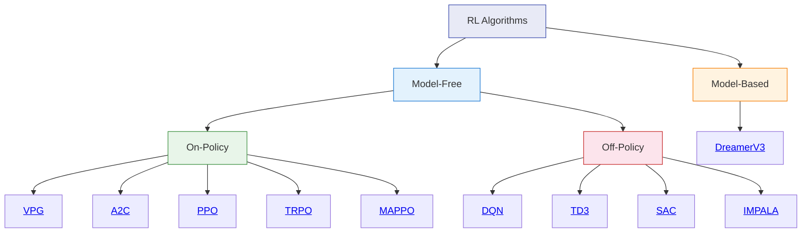

# Algorithm Reference

rlox implements a broad set of reinforcement learning algorithms spanning model-free on-policy, model-free off-policy, model-based, multi-agent, and distributed paradigms.

## Taxonomy

## Comparison Table

| Algorithm | Action Space | Policy Type | Data Efficiency | Stability | Complexity |
|-----------|-------------|-------------|-----------------|-----------|------------|
| [VPG](vpg.md) | Discrete / Continuous | Stochastic | Low | Low | Minimal |
| [A2C](a2c.md) | Discrete / Continuous | Stochastic | Low | Medium | Low |
| [PPO](ppo.md) | Discrete / Continuous | Stochastic | Low | High | Low |
| [TRPO](trpo.md) | Discrete / Continuous | Stochastic | Low | High | Medium |
| [DQN](dqn.md) | Discrete only | Value-based | Medium | Medium | Low |
| [TD3](td3.md) | Continuous only | Deterministic | High | High | Medium |
| [SAC](sac.md) | Continuous | Stochastic | High | High | Medium |
| [IMPALA](impala.md) | Discrete / Continuous | Stochastic | Medium | Medium | High |
| [DreamerV3](dreamer.md) | Discrete / Continuous | Learned model | Very high | Medium | High |
| [MAPPO](mappo.md) | Discrete / Continuous | Stochastic (CTDE) | Low | High | Medium |

## Choosing an algorithm

**Start with PPO.** It works across discrete and continuous action spaces, is stable, and requires minimal tuning. Branch out from there:

- **Continuous control with sample efficiency constraints** -- use SAC or TD3
- **Discrete actions with replay** -- use DQN (with Double + Dueling extensions)
- **Multi-agent cooperative tasks** -- use MAPPO
- **Pixel observations or complex dynamics** -- use DreamerV3
- **Large-scale distributed training** -- use IMPALA
- **Formal trust-region guarantees** -- use TRPO

## All algorithms

### On-policy

- [VPG -- Vanilla Policy Gradient](vpg.md)
- [A2C -- Advantage Actor-Critic](a2c.md)
- [PPO -- Proximal Policy Optimization](ppo.md)
- [TRPO -- Trust Region Policy Optimization](trpo.md)

### Off-policy

- [DQN -- Deep Q-Network](dqn.md)
- [TD3 -- Twin Delayed DDPG](td3.md)
- [SAC -- Soft Actor-Critic](sac.md)

### Distributed

- [IMPALA -- Importance Weighted Actor-Learner Architecture](impala.md)

### Model-based

- [DreamerV3 -- World Model RL](dreamer.md)

### Multi-agent

- [MAPPO -- Multi-Agent PPO](mappo.md)
