# Algorithm Reference

rlox implements a broad set of reinforcement learning algorithms spanning model-free on-policy, model-free off-policy, model-based, multi-agent, distributed, offline, and LLM post-training paradigms.

## Taxonomy

```mermaid
graph TD
    A[RL Algorithms] --> B[Model-Free]
    A --> C[Model-Based]
    A --> G[Offline RL]
    A --> H[LLM Post-Training]
    B --> D[On-Policy]
    B --> E[Off-Policy]
    B --> F[Multi-Agent]
    B --> I[Distributed]
    D --> VPG[<a href='vpg/'>VPG</a>]
    D --> A2C_node[<a href='a2c/'>A2C</a>]
    D --> PPO_node[<a href='ppo/'>PPO</a>]
    D --> TRPO_node[<a href='trpo/'>TRPO</a>]
    E --> DQN_node[<a href='dqn/'>DQN</a>]
    E --> TD3_node[<a href='td3/'>TD3</a>]
    E --> SAC_node[<a href='sac/'>SAC</a>]
    E --> MPO_node[<a href='mpo/'>MPO</a>]
    F --> MAPPO_node[<a href='mappo/'>MAPPO</a>]
    F --> QMIX_node[<a href='qmix/'>QMIX</a>]
    I --> IMPALA_node[<a href='impala/'>IMPALA</a>]
    C --> Dreamer_node[<a href='dreamer/'>DreamerV3</a>]
    G --> CQL_node[<a href='cql/'>CQL</a>]
    G --> CalQL_node[<a href='calql/'>Cal-QL</a>]
    G --> IQL_node[<a href='iql/'>IQL</a>]
    G --> TD3BC_node[<a href='td3bc/'>TD3+BC</a>]
    G --> BC_node[<a href='bc/'>BC</a>]
    G --> AWR_node[<a href='awr/'>AWR</a>]
    G --> DT_node[<a href='dt/'>Decision Transformer</a>]
    G --> Diff_node[<a href='diffusion/'>Diffusion Policy</a>]
    H --> GRPO_node[<a href='grpo/'>GRPO</a>]
    H --> DPO_node[<a href='dpo/'>DPO</a>]

    style A fill:#e8eaf6,stroke:#3949ab
    style B fill:#e3f2fd,stroke:#1976d2
    style C fill:#fff3e0,stroke:#f57c00
    style D fill:#e8f5e9,stroke:#388e3c
    style E fill:#fce4ec,stroke:#c62828
    style F fill:#f3e5f5,stroke:#7b1fa2
    style G fill:#e0f7fa,stroke:#00838f
    style H fill:#fff8e1,stroke:#f9a825
    style I fill:#fbe9e7,stroke:#d84315
```

## Comparison Table

| Algorithm | Action Space | Policy Type | Data Efficiency | Stability | Complexity |
|-----------|-------------|-------------|-----------------|-----------|------------|
| [VPG](vpg.md) | Discrete / Continuous | Stochastic | Low | Low | Minimal |
| [A2C](a2c.md) | Discrete / Continuous | Stochastic | Low | Medium | Low |
| [PPO](ppo.md) | Discrete / Continuous | Stochastic | Low | High | Low |
| [TRPO](trpo.md) | Discrete / Continuous | Stochastic | Low | High | Medium |
| [DQN](dqn.md) | Discrete only | Value-based | Medium | Medium | Low |
| [TD3](td3.md) | Continuous only | Deterministic | High | High | Medium |
| [SAC](sac.md) | Continuous | Stochastic | High | High | Medium |
| [MPO](mpo.md) | Continuous | Stochastic | High | High | High |
| [IMPALA](impala.md) | Discrete / Continuous | Stochastic | Medium | Medium | High |
| [DreamerV3](dreamer.md) | Discrete / Continuous | Learned model | Very high | Medium | High |
| [MAPPO](mappo.md) | Discrete / Continuous | Stochastic (CTDE) | Low | High | Medium |
| [QMIX](qmix.md) | Discrete only | Value decomposition | Medium | Medium | Medium |
| [CQL](cql.md) | Continuous | Stochastic (offline) | N/A (offline) | High | Medium |
| [Cal-QL](calql.md) | Continuous | Stochastic (offline) | N/A (offline) | High | Medium |
| [IQL](iql.md) | Continuous | Deterministic (offline) | N/A (offline) | High | Low |
| [TD3+BC](td3bc.md) | Continuous | Deterministic (offline) | N/A (offline) | High | Low |
| [BC](bc.md) | Discrete / Continuous | Supervised | N/A (offline) | High | Minimal |
| [AWR](awr.md) | Discrete / Continuous | Stochastic | Medium | Medium | Low |
| [Decision Transformer](dt.md) | Discrete / Continuous | Sequence model | N/A (offline) | High | Medium |
| [Diffusion Policy](diffusion.md) | Continuous | Diffusion | N/A (offline) | High | High |
| [GRPO](grpo.md) | Token sequences | Stochastic (LLM) | N/A | Medium | Medium |
| [DPO](dpo.md) | Token sequences | Stochastic (LLM) | N/A | High | Low |

## Choosing an algorithm

**Start with PPO.** It works across discrete and continuous action spaces, is stable, and requires minimal tuning. Branch out from there:

- **Continuous control with sample efficiency constraints** -- use SAC or TD3
- **Principled off-policy with KL constraints** -- use MPO
- **Discrete actions with replay** -- use DQN (with Double + Dueling extensions)
- **Multi-agent cooperative tasks** -- use MAPPO or QMIX
- **Pixel observations or complex dynamics** -- use DreamerV3
- **Large-scale distributed training** -- use IMPALA
- **Formal trust-region guarantees** -- use TRPO
- **Offline RL (fixed dataset, no interaction):**
    - Start with IQL or TD3+BC for simplicity
    - Use CQL or Cal-QL for stronger value conservatism
    - Use BC when data is expert-quality
    - Use Decision Transformer for large datasets with return conditioning
    - Use Diffusion Policy for multimodal action distributions
    - Use AWR for a simple advantage-weighted approach
- **LLM post-training:**
    - Use DPO when you have pairwise preference data
    - Use GRPO for reward-based optimization without a critic

## All algorithms

### On-policy

- [VPG -- Vanilla Policy Gradient](vpg.md)
- [A2C -- Advantage Actor-Critic](a2c.md)
- [PPO -- Proximal Policy Optimization](ppo.md)
- [TRPO -- Trust Region Policy Optimization](trpo.md)

### Off-policy

- [DQN -- Deep Q-Network](dqn.md)
- [TD3 -- Twin Delayed DDPG](td3.md)
- [SAC -- Soft Actor-Critic](sac.md)
- [MPO -- Maximum a Posteriori Policy Optimization](mpo.md)

### Distributed

- [IMPALA -- Importance Weighted Actor-Learner Architecture](impala.md)

### Model-based

- [DreamerV3 -- World Model RL](dreamer.md)

### Multi-agent

- [MAPPO -- Multi-Agent PPO](mappo.md)
- [QMIX -- Monotonic Value Function Factorisation](qmix.md)

### Offline RL

- [CQL -- Conservative Q-Learning](cql.md)
- [Cal-QL -- Calibrated Conservative Q-Learning](calql.md)
- [IQL -- Implicit Q-Learning](iql.md)
- [TD3+BC -- TD3 with Behavioral Cloning](td3bc.md)
- [BC -- Behavioral Cloning](bc.md)
- [AWR -- Advantage Weighted Regression](awr.md)
- [Decision Transformer -- RL via Sequence Modeling](dt.md)

### Policy as Diffusion

- [Diffusion Policy -- Action Generation via Denoising](diffusion.md)

### LLM Post-Training

- [GRPO -- Group Relative Policy Optimization](grpo.md)
- [DPO -- Direct Preference Optimization](dpo.md)
