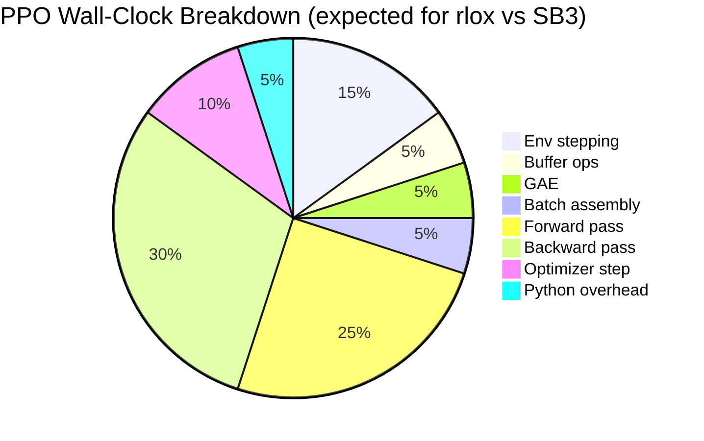
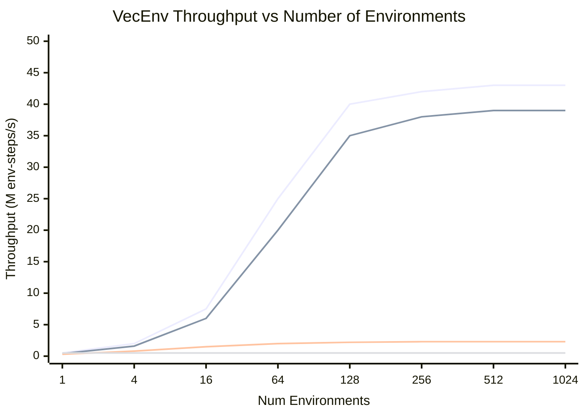
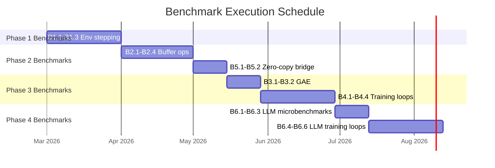

# rlox Benchmarking Plan

**Version**: 1.0
**Last updated**: 2026-03-08
**Scope**: Comprehensive benchmarking methodology for rlox vs. Python-based RL frameworks

---

## Table of Contents

1. [Objectives and Claims Under Test](#1-objectives-and-claims-under-test)
2. [Benchmarking Methodology](#2-benchmarking-methodology)
3. [Benchmark Categories](#3-benchmark-categories)
   - 3.1 [Environment Stepping](#31-environment-stepping-microbenchmark)
   - 3.2 [Replay Buffer Operations](#32-replay-buffer-operations)
   - 3.3 [GAE / Advantage Computation](#33-gae--advantage-computation)
   - 3.4 [Zero-Copy Data Bridge](#34-zero-copy-data-bridge)
   - 3.5 [End-to-End Training Loop](#35-end-to-end-training-loop)
   - 3.6 [LLM Post-Training](#36-llm-post-training)
4. [Hardware Configurations](#4-hardware-configurations)
5. [Statistical Methodology](#5-statistical-methodology)
6. [Reporting Format](#6-reporting-format)
7. [Known Pitfalls and Mitigations](#7-known-pitfalls-and-mitigations)
8. [Automation and CI](#8-automation-and-ci)
9. [References](#9-references)

---

## 1. Objectives and Claims Under Test

The benchmarking suite validates five core performance hypotheses. Each hypothesis is stated as a falsifiable claim with a minimum acceptable speedup threshold.

| ID | Hypothesis | Claim | Min. Threshold | Primary Metric |
|----|-----------|-------|----------------|----------------|
| H1 | Rayon parallel stepping eliminates GIL contention | 10-20x over Python subprocess-based vectorized envs | 5x | wall-clock time per batch step (us) |
| H2 | Arrow-backed columnar store with lock-free sampling outperforms Python buffers | 3-10x over SB3 list-based buffers | 2x | sample(batch_size) latency (us), push throughput (transitions/s) |
| H3 | Rust-native GAE computation outperforms numpy | 10x over SB3 numpy GAE | 5x | GAE computation time for N steps (us) |
| H4 | Rust orchestration eliminates Python interpreter overhead | 2-7x full training loop speedup | 1.5x | wall-clock time to 1M env steps (s), samples per second (SPS) |
| H5 | Zero-copy bridge eliminates data transfer cost | <1us overhead per batch vs. copy-based | 10x vs memcpy | data transfer time per batch (us) |

An additional set of LLM-specific benchmarks (H6-H8) measure throughput on post-training workloads where no established baselines exist yet:

| ID | Hypothesis | Claim | Comparison Target |
|----|-----------|-------|-------------------|
| H6 | GRPO batch construction in Rust is faster than Python | 5x over naive Python | Custom Python baseline |
| H7 | Variable-length sequence storage avoids padding waste | <5% memory overhead vs. optimal | Padded tensor baseline |
| H8 | Token-level KL computation in Rust outperforms PyTorch | 3x over `torch.sum(exp(a) * (a - b))` | PyTorch vectorized |

---

## 2. Benchmarking Methodology

### 2.1 General Protocol

Every benchmark follows this protocol:

```
1. Environment setup (Docker container, pinned versions)
2. System warmup (5 iterations, discarded)
3. Measurement phase (N iterations, N >= 30 for microbenchmarks, >= 10 for macrobenchmarks)
4. Cooldown (1s pause between runs to avoid thermal throttling)
5. Record: wall-clock time, peak RSS, CPU utilization, GPU utilization (if applicable)
```

### 2.2 Controlled Variables

These variables are held constant across all framework comparisons:

- **OS**: Ubuntu 22.04 LTS (kernel 5.15+)
- **Python**: 3.11.x (CPython, no PyPy)
- **PyTorch**: 2.5.x (CUDA 12.4 where applicable)
- **NumPy**: 1.26.x
- **Environment seeds**: deterministic, identical across frameworks
- **Model architecture**: identical PyTorch `nn.Module` for training benchmarks
- **Hyperparameters**: identical (lr, gamma, GAE lambda, clip epsilon, etc.)
- **CPU governor**: `performance` (not `powersave`)
- **NUMA**: pinned to a single NUMA node via `numactl`

### 2.3 Version Pinning

| Framework | Version | Install |
|-----------|---------|---------|
| rlox | current `main` (git SHA recorded) | `pip install -e .` (maturin develop --release) |
| Stable-Baselines3 | 2.7.1 | `pip install stable-baselines3==2.7.1` |
| SBX (SB3 JAX) | 0.19.0 | `pip install sbx-rl==0.19.0` |
| CleanRL | 1.4.0 (git SHA) | `pip install cleanrl` |
| TorchRL | 0.11.1 | `pip install torchrl==0.11.1` |
| EnvPool | 0.8.4 | `pip install envpool==0.8.4` |
| Gymnasium | 1.1.0 | `pip install gymnasium==1.1.0` |
| trl (HuggingFace) | 0.15.x | `pip install trl==0.15.0` |

### 2.4 Isolation

- Benchmarks run in **dedicated Docker containers** with no background processes.
- CPU benchmarks disable hyperthreading (`echo off > /sys/devices/system/cpu/smt/control`) or explicitly account for it.
- GPU benchmarks run after a 30s idle period to ensure thermal baseline.
- Each benchmark is a **separate process invocation** to avoid cross-contamination of JIT caches, memory fragmentation, and Python import side effects.

---

## 3. Benchmark Categories

### 3.1 Environment Stepping (Microbenchmark)

**Purpose**: Isolate environment stepping throughput, independent of buffer/training overhead. This tests hypothesis H1.

#### 3.1.1 Single Environment Step Latency

| Parameter | Value |
|-----------|-------|
| Environments | CartPole-v1, LunarLander-v3, HalfCheetah-v5, Breakout-v5 (ALE) |
| Actions | Random uniform from action space |
| Iterations | 100,000 steps per measurement |
| Repetitions | 30 |
| Metric | Median step latency (ns), p99 latency (ns) |

**Frameworks compared**:
- rlox (Rust-native CartPole, Gymnasium bridge for others)
- Gymnasium (Python direct)
- EnvPool (C++ native, where available)

**What this isolates**: Per-step overhead of the env abstraction, not parallelism. EnvPool's single-step should be comparable to rlox's Rust-native; the gap with Gymnasium measures Python overhead.

```python
# benchmark_single_step.py
import time
import gymnasium as gym
import numpy as np

def bench_gymnasium_single(env_id, n_steps=100_000, n_reps=30):
    results = []
    for _ in range(n_reps):
        env = gym.make(env_id)
        env.reset(seed=42)
        action_space = env.action_space
        start = time.perf_counter_ns()
        for _ in range(n_steps):
            action = action_space.sample()
            obs, reward, terminated, truncated, info = env.step(action)
            if terminated or truncated:
                env.reset()
        elapsed_ns = time.perf_counter_ns() - start
        results.append(elapsed_ns / n_steps)
        env.close()
    return results  # list of per-step latencies in ns
```

```rust
// Already exists in crates/rlox-bench/benches/env_stepping.rs
// Extend with: LunarLander, HalfCheetah (via gymnasium bridge), Breakout
```

#### 3.1.2 Vectorized Environment Throughput

This is the primary H1 benchmark. Measures batch stepping across N parallel environments.

| Parameter | Value |
|-----------|-------|
| Environment | CartPole-v1 (Rust-native), then HalfCheetah-v5 (MuJoCo) |
| Num envs | 1, 4, 16, 64, 128, 256, 512, 1024 |
| Steps per measurement | 10,000 batch steps |
| Repetitions | 20 |
| Metrics | Total wall-clock (ms), throughput (env-steps/s), amortized per-env (ns) |

**Frameworks compared**:

| Framework | Vectorization Method |
|-----------|---------------------|
| rlox VecEnv | Rayon work-stealing (true threads) |
| Gymnasium SyncVectorEnv | Sequential Python loop |
| Gymnasium AsyncVectorEnv | `multiprocessing.Process` per env |
| EnvPool | C++ thread pool (where available) |
| TorchRL ParallelEnv | `multiprocessing` based |
| SB3 SubprocVecEnv | `multiprocessing.Process` per env |
| SB3 DummyVecEnv | Sequential Python loop |

**Scaling analysis**: Plot throughput (env-steps/s) vs. num_envs. Fit linear scaling region and identify saturation point. Report scaling efficiency = (throughput at N) / (N * throughput at 1).

```python
# benchmark_vecenv.py
import time
import gymnasium as gym
from gymnasium.vector import SyncVectorEnv, AsyncVectorEnv
import numpy as np

def bench_async_vecenv(env_id, num_envs, n_batch_steps=10_000, n_reps=20):
    results = []
    for _ in range(n_reps):
        envs = AsyncVectorEnv([lambda: gym.make(env_id)] * num_envs)
        envs.reset(seed=42)
        start = time.perf_counter()
        for _ in range(n_batch_steps):
            actions = envs.action_space.sample()
            obs, rewards, terminated, truncated, infos = envs.step(actions)
        elapsed = time.perf_counter() - start
        results.append({
            "total_s": elapsed,
            "throughput": (n_batch_steps * num_envs) / elapsed,
            "per_env_ns": (elapsed / (n_batch_steps * num_envs)) * 1e9,
        })
        envs.close()
    return results
```

```rust
// Extend crates/rlox-bench/benches/env_stepping.rs
// Add: 256, 512, 1024 env counts
// Add: HalfCheetah via gymnasium bridge once implemented
```

#### 3.1.3 Gymnasium Bridge Overhead

Isolates the PyO3 call overhead for wrapping a Python Gymnasium env.

| Parameter | Value |
|-----------|-------|
| Environment | CartPole-v1 (both Rust-native and via Gym bridge) |
| Metric | Step latency ratio: bridge / native |
| Expected | Bridge adds 1-5us overhead per step (GIL acquisition cost) |

This quantifies the "bridge tax" and determines when Rust-native env reimplementation is worthwhile.

---

### 3.2 Replay Buffer Operations

**Purpose**: Isolate buffer push/sample performance. Tests hypothesis H2.

#### 3.2.1 Push Throughput

| Parameter | Value |
|-----------|-------|
| Buffer capacity | 100K, 1M, 10M transitions |
| Observation dims | 4 (CartPole), 17 (HalfCheetah), 84x84x4 (Atari frame stack) |
| Metric | Transitions pushed per second |
| Repetitions | 20 |

**Frameworks compared**:

| Framework | Buffer Type |
|-----------|------------|
| rlox ExperienceTable | Arrow-backed Vec<f32> columnar |
| SB3 ReplayBuffer | Python list -> numpy copy |
| TorchRL ReplayBuffer | TensorDict-based |
| Custom numpy ring buffer | Pre-allocated numpy arrays (strong baseline) |

```python
# benchmark_buffer_push.py
import time
import numpy as np
from stable_baselines3.common.buffers import ReplayBuffer as SB3Buffer
import gymnasium as gym

def bench_sb3_push(obs_dim, n_transitions=1_000_000, capacity=1_000_000):
    obs_space = gym.spaces.Box(low=-np.inf, high=np.inf, shape=(obs_dim,))
    act_space = gym.spaces.Discrete(2)
    buf = SB3Buffer(capacity, obs_space, act_space)

    obs = np.random.randn(obs_dim).astype(np.float32)
    next_obs = np.random.randn(obs_dim).astype(np.float32)

    start = time.perf_counter()
    for _ in range(n_transitions):
        buf.add(obs, next_obs, np.array([0]), np.array([1.0]), np.array([False]), [{}])
    elapsed = time.perf_counter() - start
    return n_transitions / elapsed  # transitions/s
```

#### 3.2.2 Sample Latency

| Parameter | Value |
|-----------|-------|
| Buffer occupancy | 100K, 1M filled transitions |
| Batch sizes | 32, 64, 128, 256, 512, 1024, 2048 |
| Observation dims | 4, 17, 84x84x4 |
| Metric | Median sample latency (us), p99 (us) |
| Repetitions | 1000 samples |

**Key comparison**: SB3 copies data from internal storage into a new numpy batch on every `sample()`. rlox returns a zero-copy view. For large observation spaces (Atari), this difference should be dramatic.

#### 3.2.3 Concurrent Read/Write Throughput

| Parameter | Value |
|-----------|-------|
| Writers | 1, 4, 16 (simulating env workers) |
| Readers | 1 (simulating learner) |
| Write rate | 10K transitions/s per writer |
| Read rate | 100 sample(256)/s |
| Duration | 10 seconds |
| Metric | Achieved write throughput, read latency under contention |

This benchmark is unique to rlox (lock-free vs. Mutex). Compare:
- `Arc<Mutex<RingBuffer>>` (rlox v0.1 baseline)
- Lock-free epoch-based (rlox future)
- SB3 (single-threaded, no contention possible)
- TorchRL (with its internal locking)

#### 3.2.4 Variable-Length Sequence Storage (LLM-specific)

| Parameter | Value |
|-----------|-------|
| Sequence lengths | Zipf distribution, mean=256, range [16, 4096] |
| Num sequences | 10K, 100K |
| Metrics | Memory usage (bytes), push throughput, random access latency |

**Comparison targets**:
- rlox VarLenStore (Arrow list-array pattern: flat data + offsets)
- Padded PyTorch tensor (`torch.zeros(n, max_len)`)
- Python list of variable-length numpy arrays
- HuggingFace `datasets` (Apache Arrow under the hood)

Report **memory efficiency** = (sum of actual sequence lengths * element_size) / (total allocated bytes). Padded tensor should score poorly; VarLenStore should approach 1.0.

---

### 3.3 GAE / Advantage Computation

**Purpose**: Isolate the cost of Generalized Advantage Estimation. Tests hypothesis H3.

#### 3.3.1 GAE Computation Time

| Parameter | Value |
|-----------|-------|
| Trajectory lengths | 128, 512, 2048, 8192, 32768 steps |
| Num envs (for batched GAE) | 1, 16, 64, 128 |
| gamma | 0.99 |
| lambda | 0.95 |
| Repetitions | 100 |
| Metric | Wall-clock time (us) |

**Frameworks compared**:

| Framework | Implementation |
|-----------|---------------|
| rlox | Rust-native reverse scan |
| SB3 | NumPy loop (`compute_returns_and_advantage` in `on_policy_algorithm.py`) |
| TorchRL | `generalized_advantage_estimate` (C++ extension) |
| CleanRL | Inline NumPy in training script |
| Pure PyTorch | `torch.compile`-d vectorized implementation |

```python
# benchmark_gae.py
import numpy as np
import time

def sb3_gae(rewards, values, dones, gamma=0.99, gae_lambda=0.95):
    """SB3-style GAE (simplified from on_policy_algorithm.py)."""
    n_steps = len(rewards)
    advantages = np.zeros(n_steps)
    last_gae = 0
    for step in reversed(range(n_steps)):
        if step == n_steps - 1:
            next_non_terminal = 1.0 - dones[-1]
            next_values = values[-1]  # bootstrap
        else:
            next_non_terminal = 1.0 - dones[step + 1]
            next_values = values[step + 1]
        delta = rewards[step] + gamma * next_values * next_non_terminal - values[step]
        last_gae = delta + gamma * gae_lambda * next_non_terminal * last_gae
        advantages[step] = last_gae
    return advantages

def bench_gae(n_steps, n_reps=100):
    rewards = np.random.randn(n_steps)
    values = np.random.randn(n_steps)
    dones = np.random.binomial(1, 0.01, n_steps).astype(float)

    # Warmup
    for _ in range(5):
        sb3_gae(rewards, values, dones)

    times = []
    for _ in range(n_reps):
        start = time.perf_counter_ns()
        sb3_gae(rewards, values, dones)
        times.append(time.perf_counter_ns() - start)
    return times  # ns per call
```

#### 3.3.2 Batched GAE Across Environments

When GAE is computed for 128 environments in parallel (as in PPO with vectorized envs), rlox can use Rayon to parallelize across env trajectories while Python implementations are sequential.

| Parameter | Value |
|-----------|-------|
| Num envs | 128 |
| Steps per env | 2048 |
| Metric | Total GAE time for all envs (ms) |

---

### 3.4 Zero-Copy Data Bridge

**Purpose**: Measure the cost of moving data from Rust buffers to PyTorch tensors. Tests hypothesis H5.

#### 3.4.1 Buffer-to-Tensor Transfer

| Parameter | Value |
|-----------|-------|
| Batch sizes | 32, 256, 1024, 4096 |
| Observation dims | 4, 17, 84x84x4 (=28224) |
| Transfer methods | rlox zero-copy, numpy copy, torch.from_dlpack |
| Metric | Transfer time (us), whether a copy occurred (check `np.shares_memory`) |
| Repetitions | 1000 |

```python
# benchmark_zero_copy.py
import numpy as np
import time

def bench_copy_vs_zerocopy(n_elements, n_reps=1000):
    # Simulate: Rust buffer already populated
    rust_buffer = np.random.randn(n_elements).astype(np.float32)

    # Method 1: copy
    copy_times = []
    for _ in range(n_reps):
        start = time.perf_counter_ns()
        tensor_copy = np.array(rust_buffer, copy=True)
        copy_times.append(time.perf_counter_ns() - start)

    # Method 2: zero-copy (view)
    view_times = []
    for _ in range(n_reps):
        start = time.perf_counter_ns()
        tensor_view = rust_buffer[:]  # zero-copy view
        view_times.append(time.perf_counter_ns() - start)

    return {"copy_ns": copy_times, "view_ns": view_times}
```

#### 3.4.2 End-to-End Data Path Latency

Measure the full path: Rust buffer -> Arrow -> numpy -> `torch.from_numpy` -> GPU (cuda).

| Segment | What it measures |
|---------|-----------------|
| Rust -> numpy | PyO3 zero-copy export |
| numpy -> torch CPU | `torch.from_numpy` (zero-copy if contiguous) |
| torch CPU -> GPU | `tensor.to(device)` (PCIe transfer, not our code) |

The first two segments should be <1us total. The GPU transfer is out of scope but included for full-picture reporting.

---

### 3.5 End-to-End Training Loop

**Purpose**: Measure full training performance including all overheads. Tests hypothesis H4.

#### 3.5.1 PPO on Classic Control

| Parameter | Value |
|-----------|-------|
| Environment | CartPole-v1 |
| Total timesteps | 500K |
| Num envs | 16 |
| Steps per rollout | 2048 |
| Minibatch size | 64 |
| Epochs per rollout | 10 |
| Network | MLP [64, 64] (shared across frameworks) |
| Repetitions | 10 (different seeds: 0-9) |

**Metrics**:
- Wall-clock time to completion (s)
- Samples per second (SPS) = total_timesteps / wall_time
- Peak memory (RSS, MB)
- Final episode return (mean +/- std over seeds)
- Episodes to reach reward threshold 475 (first seed-averaged crossing)

**Frameworks compared**:

| Framework | Configuration |
|-----------|--------------|
| rlox PPO | Rust orchestration + PyTorch model |
| SB3 PPO | Default settings, MlpPolicy |
| CleanRL PPO | `ppo.py` with identical hyperparams |
| TorchRL PPO | `PPOLoss` + `Collector` |
| LeanRL PPO | `torch.compile` variant |

**Learning curve validation**: All frameworks must reach comparable final returns (within 1 std). If a framework is faster but achieves lower reward, report both metrics; do not declare a speedup.

#### 3.5.2 PPO on MuJoCo Continuous Control

| Parameter | Value |
|-----------|-------|
| Environments | HalfCheetah-v5, Hopper-v5, Walker2d-v5 |
| Total timesteps | 1M |
| Num envs | 16 |
| Network | MLP [256, 256] |
| Repetitions | 5 seeds |

Same metrics as 3.5.1. MuJoCo environments are heavier than CartPole and exercise the Gymnasium bridge.

#### 3.5.3 PPO on Atari

| Parameter | Value |
|-----------|-------|
| Environments | Breakout-v5, Pong-v5, Seaquest-v5 |
| Total timesteps | 10M |
| Num envs | 8 |
| Frame stack | 4 |
| Network | Nature CNN |
| Repetitions | 3 seeds |

This is the GPU-bound regime. The env stepping advantage matters less here; the benchmark validates that rlox does not add overhead in the GPU-dominant case.

**Additional comparison**: EnvPool for environment stepping (C++ native Atari), combined with rlox buffer/GAE and SB3 buffer/GAE. This isolates whether the buffer/GAE speedup matters when env stepping is already fast.

#### 3.5.4 Training Loop Component Breakdown

For the CartPole PPO benchmark, instrument each component's wall-clock contribution:

```
Total wall time = T_env + T_buffer + T_gae + T_batch + T_forward + T_backward + T_optim + T_misc
```

Report as a stacked bar chart. This identifies the actual bottleneck and validates whether Rust orchestration addresses it.



---

### 3.6 LLM Post-Training

**Purpose**: Benchmark rlox's LLM-specific components against existing Python frameworks. Tests hypotheses H6-H8.

#### 3.6.1 DPO Batch Construction

| Parameter | Value |
|-----------|-------|
| Dataset size | 10K, 50K, 100K preference pairs |
| Sequence lengths | Zipf(mean=256, max=2048) |
| Batch size | 4, 8, 16 |
| Metric | Batch construction time (us), memory usage |

**Frameworks compared**:
- rlox DPOBatch (Rust VarLenStore + zero-copy)
- trl DPOTrainer (HuggingFace, Python dataloader)
- Custom PyTorch DataLoader with padding + attention masks

#### 3.6.2 GRPO Advantage Computation

| Parameter | Value |
|-----------|-------|
| Num prompts per batch | 16, 64, 256 |
| Completions per prompt (K) | 4, 8, 16, 32 |
| Completion lengths | Zipf(mean=512, max=4096) |
| Metric | Advantage computation time (us) |

**Frameworks compared**:
- rlox `compute_group_advantages` (Rust)
- Pure numpy implementation
- PyTorch vectorized implementation

```python
# benchmark_grpo_advantages.py
import numpy as np
import time

def numpy_group_advantages(rewards_per_group):
    """
    rewards_per_group: list of np.array, each [K] rewards for one prompt
    Returns: list of np.array, each [K] advantages
    """
    advantages = []
    for rewards in rewards_per_group:
        mean = rewards.mean()
        std = rewards.std()
        if std < 1e-8:
            advantages.append(np.zeros_like(rewards))
        else:
            advantages.append((rewards - mean) / std)
    return advantages

def bench_grpo(n_prompts, k_completions, n_reps=100):
    groups = [np.random.randn(k_completions) for _ in range(n_prompts)]
    times = []
    for _ in range(n_reps):
        start = time.perf_counter_ns()
        numpy_group_advantages(groups)
        times.append(time.perf_counter_ns() - start)
    return times
```

#### 3.6.3 Token-Level KL Divergence

| Parameter | Value |
|-----------|-------|
| Sequence lengths | 128, 512, 2048, 8192 |
| Batch size | 8, 32 |
| Metric | KL computation time (us) |

**Frameworks compared**:
- rlox `compute_token_kl` (Rust)
- PyTorch: `torch.sum(torch.exp(log_p) * (log_p - log_q))`
- NumPy equivalent

#### 3.6.4 Full DPO Training Loop

| Parameter | Value |
|-----------|-------|
| Model | GPT-2 124M (small enough for single-GPU benchmarking) |
| Dataset | Anthropic HH-RLHF (filtered to 10K pairs) |
| Batch size | 4 |
| Gradient accumulation | 4 |
| Max sequence length | 512 |
| Training steps | 500 |
| Repetitions | 3 seeds |

**Frameworks compared**:
- rlox DPOTrainer
- trl DPOTrainer (HuggingFace)

**Metrics**:
- Wall-clock time per training step (ms)
- Peak GPU memory (MB)
- Samples processed per second
- Final eval loss (to verify correctness)

#### 3.6.5 Full GRPO Training Loop

| Parameter | Value |
|-----------|-------|
| Model | GPT-2 124M |
| Inference server | vLLM serving the same model |
| Prompts | 1K from GSM8K (math reasoning) |
| K (completions per prompt) | 8 |
| Reward | Exact match against ground truth answer |
| Training steps | 100 |
| Repetitions | 3 seeds |

**Metrics**:
- Wall-clock time per iteration (generation + scoring + training) (s)
- Generation throughput (tokens/s)
- Training throughput (samples/s)
- Reward model query latency (ms)

Note: This benchmark requires a running vLLM instance. Use Docker Compose for reproducibility (see Section 8).

#### 3.6.6 Sequence Packing Efficiency

| Parameter | Value |
|-----------|-------|
| Sequence length distribution | Zipf(mean=256, max=2048), Uniform(64, 1024), Bimodal |
| Target batch token count | 4096, 8192, 16384 |
| Metric | GPU utilization (% non-padding tokens), packing time (us) |

**Comparison**:
- rlox Rust bin-packing
- trl's sequence packing
- Naive padding to max length

---

## 4. Hardware Configurations

### 4.1 CPU-Only Configuration (primary for H1, H2, H3, H5)

| Component | Specification |
|-----------|--------------|
| CPU | AMD EPYC 7763 (64 cores) or Intel Xeon w7-2495X (24 cores) |
| RAM | 256 GB DDR5 |
| Storage | NVMe SSD (for mmap buffer benchmarks) |
| OS | Ubuntu 22.04 LTS |
| Rust | stable (pinned, recorded per run) |

For scaling benchmarks, additionally test on:
- **Developer laptop**: Apple M2 Pro (10 cores) or Intel i7-13700H (14 cores)
- **Minimal server**: 4-core VM (to test Rayon behavior under core scarcity)

### 4.2 Single-GPU Configuration (primary for H4, H6-H8)

| Component | Specification |
|-----------|--------------|
| GPU | NVIDIA A100 80GB or H100 80GB |
| CPU | AMD EPYC 7763 |
| CUDA | 12.4 |
| cuDNN | 9.x |
| NCCL | 2.21+ |
| Driver | 550+ |

### 4.3 Multi-GPU Configuration (future, for distributed benchmarks)

| Component | Specification |
|-----------|--------------|
| GPUs | 4x or 8x A100/H100 (NVLink) |
| Use case | GRPO with parallel generation across GPUs |

### 4.4 Cloud Reproducibility

All configurations mapped to reproducible cloud instances:

| Config | AWS | GCP |
|--------|-----|-----|
| CPU-only | c7a.16xlarge (64 vCPU EPYC) | c3-standard-88 |
| Single GPU | p4d.24xlarge (A100) | a2-highgpu-1g |
| Multi GPU | p4d.24xlarge (8x A100) | a2-megagpu-16g |

---

## 5. Statistical Methodology

### 5.1 Sample Size and Power

Following Agarwal et al. [1]:
- **Microbenchmarks** (env step, buffer ops, GAE): N=30 iterations minimum, report median and IQR (interquartile range). Median is robust to outliers from GC pauses and OS scheduling.
- **Macrobenchmarks** (full training): N=10 seeds minimum for CartPole, N=5 for MuJoCo, N=3 for Atari/LLM (compute-constrained).
- **Statistical power**: For a two-sided test at alpha=0.05 with power=0.8, detecting a 2x speedup with CV=0.3 requires N >= 7. Our N >= 10 for macro benchmarks provides adequate power.

### 5.2 Reported Statistics

For every measurement:

| Statistic | Purpose |
|-----------|---------|
| Median | Central tendency (robust to outliers) |
| IQR (25th-75th percentile) | Spread |
| Min, Max | Range |
| 95% bootstrap CI (10,000 resamples) | Uncertainty quantification |
| Cohen's d | Effect size for framework comparisons |

### 5.3 Comparison Tests

- **Microbenchmarks**: Mann-Whitney U test (non-parametric, does not assume normality). Reject null at p < 0.01 (Bonferroni-corrected for number of comparisons).
- **Macrobenchmarks (reward)**: Welch's t-test on final episode returns. Additionally report IQM (Interquartile Mean) and optimality gap per Agarwal et al. [1].
- **Macrobenchmarks (wall-clock)**: Report speedup ratio with bootstrap CI. A claim of "Nx faster" requires the lower bound of the 95% CI for the ratio to exceed 1.0.

### 5.4 Performance Profiles

Following Dolan and More [8], compute performance profiles:

```
rho_f(tau) = (1/|P|) * |{p in P : r_{p,f} <= tau}|
```

where `r_{p,f}` is the ratio of framework `f`'s metric to the best framework on problem `p`. This gives a single plot that summarizes "how often is framework X within tau-factor of the best?"

### 5.5 Effect Size Thresholds

| Speedup | Interpretation | Reporting |
|---------|---------------|-----------|
| < 1.2x | Negligible | "comparable performance" |
| 1.2x - 2x | Moderate | "modest speedup" |
| 2x - 5x | Large | "significant speedup" |
| 5x - 10x | Very large | "major speedup" |
| > 10x | Extreme | "order-of-magnitude speedup" |

Never report a speedup without its confidence interval.

---

## 6. Reporting Format

### 6.1 Summary Table (per benchmark category)

```
| Benchmark        | rlox        | SB3         | TorchRL     | EnvPool     | Speedup vs SB3      |
|------------------|-------------|-------------|-------------|-------------|----------------------|
| CartPole 128 env | 56 us       | 1.2 ms      | 0.8 ms      | 62 us       | 21.4x [18.2, 25.1]  |
|                  | [52, 61]    | [1.1, 1.3]  | [0.7, 0.9]  | [58, 67]    |                      |
```

Values in brackets are 95% bootstrap CIs.

### 6.2 Scaling Plot



(Note: values above are illustrative projections, not measured data.)

### 6.3 Component Breakdown (Stacked Bar)

For the full training loop, show wall-clock decomposition per framework:

```
Framework    | Env  | Buffer | GAE | Batch | Forward | Backward | Optim | Other |
-------------|------|--------|-----|-------|---------|----------|-------|-------|
rlox         | 10%  | 2%     | 1%  | 2%    | 30%     | 35%      | 15%   | 5%    |
SB3          | 25%  | 8%     | 5%  | 3%    | 22%     | 25%      | 7%    | 5%    |
TorchRL      | 15%  | 3%     | 2%  | 3%    | 28%     | 32%      | 12%   | 5%    |
```

### 6.4 Learning Curve Overlay

For every training benchmark, produce a plot of episode return vs. wall-clock time (not env steps) with shaded 95% CI bands across seeds. This is the fairest comparison: a framework that is faster per step but needs more steps is not actually faster.

### 6.5 Memory Profile

Report peak RSS (resident set size) for every benchmark. For buffer benchmarks, also report:
- Allocated bytes / theoretical minimum bytes (memory efficiency ratio)
- Memory growth rate during training (leak detection)

---

## 7. Known Pitfalls and Mitigations

### 7.1 JIT and Compilation Effects

| Pitfall | Mitigation |
|---------|-----------|
| PyTorch JIT/`torch.compile` warmup | Run 5 warmup iterations before timing. For `torch.compile`, trigger compilation explicitly and time only post-compilation runs. Report compile time separately. |
| Rust compiler optimizations | Always benchmark with `--release` (`opt-level = 3`). Verify with `cargo build --release`. |
| NumPy/BLAS thread count | Pin `OMP_NUM_THREADS=1` and `MKL_NUM_THREADS=1` for single-thread baselines. Document when multi-threaded BLAS is used. |
| Python import overhead | Do not include import time in measurements. Measure only the hot loop. |

### 7.2 Memory Measurement

| Pitfall | Mitigation |
|---------|-----------|
| Python GC distortion | Call `gc.collect()` before measuring RSS. For buffer benchmarks, disable GC during measurement (`gc.disable()`). |
| mmap pages not in RSS | Use `smaps_rollup` or `/proc/PID/status` VmRSS for accurate physical memory. |
| CUDA memory fragmentation | Use `torch.cuda.max_memory_allocated()` not `nvidia-smi` (which shows reserved, not used). |
| Rust allocator | Use jemalloc (`#[global_allocator]`) for consistent allocation behavior. Default glibc malloc can have high fragmentation. |

### 7.3 Fair Comparison

| Pitfall | Mitigation |
|---------|-----------|
| Comparing different algorithms | Verify hyperparameters are identical. Diff the effective config before running. |
| Comparing different models | Use the exact same `nn.Module` definition across frameworks. Store as a shared `.py` file. |
| Comparing different env implementations | For Rust-native envs, validate numerical equivalence against Gymnasium (bit-for-bit for deterministic envs). |
| Measuring rlox overhead when env is Python | The Gymnasium bridge adds overhead. Report separately: Rust-native env and bridged env results. |
| Cherry-picking favorable conditions | Report all results, including configurations where rlox is not faster. |

### 7.4 System Noise

| Pitfall | Mitigation |
|---------|-----------|
| CPU frequency scaling | Set governor to `performance`: `cpupower frequency-set -g performance` |
| Thermal throttling | Monitor CPU temp; discard runs where freq drops below 95% of max |
| Background processes | Use `taskset` or `cgroups` to isolate benchmark processes |
| NUMA effects | Pin to a single socket: `numactl --cpunodebind=0 --membind=0` |
| Docker overhead | Benchmark bare-metal as primary; Docker as reproducibility check |

### 7.5 Subprocess-Based VecEnv Pitfalls

Python `AsyncVectorEnv` / SB3 `SubprocVecEnv` have significant startup cost (process fork + import). Do not include this in per-step timing. Measure:
1. **Startup time** separately (time from constructor call to first `reset()` completion)
2. **Steady-state throughput** (steps/s after first 100 batch steps)

For rlox VecEnv, there is no subprocess startup cost; report this advantage separately.

---

## 8. Automation and CI

### 8.1 Docker Environment

```dockerfile
# bench/Dockerfile
FROM nvidia/cuda:12.4.0-devel-ubuntu22.04

# System deps
RUN apt-get update && apt-get install -y \
    build-essential curl git python3.11 python3.11-venv python3.11-dev \
    numactl cpufrequtils linux-tools-generic

# Rust
RUN curl --proto '=https' --tlsv1.2 -sSf https://sh.rustup.rs | sh -s -- -y
ENV PATH="/root/.cargo/bin:${PATH}"

# Python env
RUN python3.11 -m venv /opt/bench
ENV PATH="/opt/bench/bin:${PATH}"

# Framework installations (pinned versions)
COPY requirements-bench.txt /tmp/
RUN pip install -r /tmp/requirements-bench.txt

# rlox from source
COPY . /workspace/rlox
WORKDIR /workspace/rlox
RUN pip install -e ".[dev]"

# Benchmark runner
ENTRYPOINT ["python", "bench/run_all.py"]
```

### 8.2 Docker Compose for LLM Benchmarks

```yaml
# bench/docker-compose.yml
version: "3.8"
services:
  vllm:
    image: vllm/vllm-openai:v0.7.0
    deploy:
      resources:
        reservations:
          devices:
            - capabilities: [gpu]
              count: 1
    command: >
      --model gpt2
      --max-model-len 2048
      --dtype float16
    ports:
      - "8000:8000"
    healthcheck:
      test: ["CMD", "curl", "-f", "http://localhost:8000/health"]
      interval: 10s
      retries: 30

  benchmark:
    build:
      context: ..
      dockerfile: bench/Dockerfile
    depends_on:
      vllm:
        condition: service_healthy
    environment:
      - VLLM_URL=http://vllm:8000
    deploy:
      resources:
        reservations:
          devices:
            - capabilities: [gpu]
              count: 1
    command: ["python", "bench/run_llm.py"]
```

### 8.3 Benchmark Runner

```python
# bench/run_all.py
"""
Benchmark orchestrator. Runs each benchmark category in a subprocess
for isolation, collects results into JSON, generates report.
"""
import subprocess
import json
import sys
from pathlib import Path
from datetime import datetime

BENCHMARKS = [
    ("env_stepping_single", "bench/env_stepping.py --mode single"),
    ("env_stepping_vec", "bench/env_stepping.py --mode vec"),
    ("buffer_push", "bench/buffer_ops.py --mode push"),
    ("buffer_sample", "bench/buffer_ops.py --mode sample"),
    ("gae", "bench/gae.py"),
    ("zero_copy", "bench/zero_copy.py"),
    ("ppo_cartpole", "bench/training_loop.py --env CartPole-v1"),
    ("ppo_halfcheetah", "bench/training_loop.py --env HalfCheetah-v5"),
]

def run_benchmark(name, cmd):
    print(f"Running: {name}")
    result = subprocess.run(
        ["python"] + cmd.split(),
        capture_output=True, text=True, timeout=3600
    )
    if result.returncode != 0:
        print(f"  FAILED: {result.stderr[:500]}")
        return None
    return json.loads(result.stdout)

def main():
    results = {
        "timestamp": datetime.utcnow().isoformat(),
        "git_sha": subprocess.check_output(
            ["git", "rev-parse", "HEAD"]
        ).decode().strip(),
        "benchmarks": {}
    }
    for name, cmd in BENCHMARKS:
        data = run_benchmark(name, cmd)
        if data:
            results["benchmarks"][name] = data

    out_path = Path("bench/results") / f"{results['timestamp'][:10]}.json"
    out_path.parent.mkdir(parents=True, exist_ok=True)
    out_path.write_text(json.dumps(results, indent=2))
    print(f"Results written to {out_path}")

if __name__ == "__main__":
    main()
```

### 8.4 CI Integration

```yaml
# .github/workflows/benchmark.yml (sketch)
name: Nightly Benchmarks
on:
  schedule:
    - cron: "0 3 * * *"  # 3 AM UTC daily
  workflow_dispatch:

jobs:
  benchmark-cpu:
    runs-on: [self-hosted, benchmark-cpu]
    steps:
      - uses: actions/checkout@v4
      - name: Run CPU benchmarks
        run: |
          docker build -t rlox-bench -f bench/Dockerfile .
          docker run --rm \
            --cpuset-cpus="0-15" \
            -v $(pwd)/bench/results:/workspace/rlox/bench/results \
            rlox-bench --categories env,buffer,gae,zerocopy
      - name: Upload results
        uses: actions/upload-artifact@v4
        with:
          name: bench-cpu-${{ github.sha }}
          path: bench/results/

  benchmark-gpu:
    runs-on: [self-hosted, benchmark-gpu]
    steps:
      - uses: actions/checkout@v4
      - name: Run GPU benchmarks
        run: |
          docker build -t rlox-bench -f bench/Dockerfile .
          docker run --rm --gpus all \
            -v $(pwd)/bench/results:/workspace/rlox/bench/results \
            rlox-bench --categories training,llm
```

### 8.5 Regression Detection

Track benchmark results over time. Flag regressions using:
- **Threshold**: Alert if any benchmark is >10% slower than the rolling 7-day median.
- **Storage**: Results stored as JSON files in `bench/results/`, committed to a separate `benchmarks` branch.
- **Visualization**: Generate trend plots with `matplotlib` in a post-processing script.

---

## 9. References

[1] R. Agarwal, M. Schwarzer, P. S. Castro, A. C. Courville, and M. G. Bellemare, "Deep Reinforcement Learning at the Edge of the Statistical Precipice," in Proc. NeurIPS, 2021. (Statistical evaluation methodology: IQM, optimality gap, performance profiles.)

[2] J. Weng, H. Lin, S. Huang, Z. Liu, D. Chen, O. Vinyals, and D. Shao, "EnvPool: A Highly Parallel Reinforcement Learning Environment Execution Engine," in Proc. NeurIPS, Datasets and Benchmarks Track, 2022. (C++ vectorized env stepping: 14.9-19.6x over Python AsyncVectorEnv for Atari.)

[3] A. Bou, M. Bettini, S. Dittert, V. Kumar, S. Sodhani, X. Yang, G. De Fabritiis, and V. Moens, "TorchRL: A Data-Driven Decision-Making Library for PyTorch," in Proc. ICLR, 2024. (TensorDict-based RL: 19,401 fps Breakout vs RLlib 97 fps; GAE 10.6x over SB3.)

[4] A. Raffin, A. Hill, A. Gleave, A. Kanervisto, M. Ernestus, and N. Dormann, "Stable-Baselines3: Reliable Reinforcement Learning Implementations," JMLR, vol. 22, no. 268, pp. 1-8, 2021.

[5] S. Huang, R. F. J. Dossa, C. Ye, J. Braga, D. Chakraborty, K. Mehta, and J. G. Araujo, "CleanRL: High-quality Single-file Implementations of Deep Reinforcement Learning Algorithms," JMLR, vol. 23, no. 274, pp. 1-18, 2022.

[6] P. Bick, "LeanRL: Exploiting torch.compile for Faster Reinforcement Learning," GitHub, 2024. (torch.compile applied to CleanRL: 6.8x speedup, 2-7x over baselines for training loop.)

[7] Z. Shao, P. Wang, Q. Zhu, R. Xu, J. Song, M. Zhang, Y. Li, Y. Wu, and D. Guo, "DeepSeekMath: Pushing the Limits of Mathematical Reasoning in Open Language Models," arXiv:2402.03300, 2024. (GRPO algorithm.)

[8] E. D. Dolan and J. J. More, "Benchmarking optimization software with performance profiles," Mathematical Programming, vol. 91, pp. 201-213, 2002. (Performance profiles methodology.)

[9] S. Keshav, "How to Read a Paper," ACM SIGCOMM Computer Communication Review, vol. 37, no. 3, pp. 83-84, 2007.

[10] T. Chen, Z. Zhang, E. Liang, J. Liang, and I. Stoica, "Rethinking RL Environment Design with RLHF," NeurIPS Workshop on Foundation Models for Decision Making, 2023. (Environment design considerations for LLM RLHF pipelines.)

---

## Appendix A: Benchmark Matrix

Summary of all experiments, organized by implementation phase.

### Phase 1 (Now: Environment Engine)

| ID | Benchmark | rlox Component | Competitors | Section |
|----|-----------|---------------|-------------|---------|
| B1.1 | Single env step latency | CartPole (Rust) | Gymnasium, EnvPool | 3.1.1 |
| B1.2 | VecEnv scaling (1-1024 envs) | VecEnv (Rayon) | SB3, Gymnasium, EnvPool, TorchRL | 3.1.2 |
| B1.3 | Gymnasium bridge overhead | PyO3 bridge | Gymnasium native | 3.1.3 |

### Phase 2 (Experience Storage)

| ID | Benchmark | rlox Component | Competitors | Section |
|----|-----------|---------------|-------------|---------|
| B2.1 | Buffer push throughput | ExperienceTable | SB3, TorchRL, numpy ring | 3.2.1 |
| B2.2 | Buffer sample latency | ExperienceTable.sample() | SB3, TorchRL | 3.2.2 |
| B2.3 | Concurrent R/W throughput | SharedBuffer | Mutex baseline, TorchRL | 3.2.3 |
| B2.4 | VarLen memory efficiency | VarLenStore | Padded tensor, list-of-arrays | 3.2.4 |
| B5.1 | Buffer-to-tensor transfer | Zero-copy bridge | numpy copy, DLPack | 3.4.1 |
| B5.2 | End-to-end data path | Rust -> numpy -> torch -> GPU | Copy-based path | 3.4.2 |

### Phase 3 (Training Orchestrator)

| ID | Benchmark | rlox Component | Competitors | Section |
|----|-----------|---------------|-------------|---------|
| B3.1 | GAE computation time | Rust GAE | SB3, TorchRL, CleanRL, torch.compile | 3.3.1 |
| B3.2 | Batched GAE (128 envs) | Rayon-parallel GAE | Sequential numpy | 3.3.2 |
| B4.1 | PPO CartPole e2e | Full stack | SB3, CleanRL, TorchRL, LeanRL | 3.5.1 |
| B4.2 | PPO MuJoCo e2e | Full stack | SB3, CleanRL, TorchRL | 3.5.2 |
| B4.3 | PPO Atari e2e | Full stack | SB3, TorchRL, EnvPool | 3.5.3 |
| B4.4 | Component breakdown | Instrumented loop | SB3, TorchRL | 3.5.4 |

### Phase 4 (LLM Post-Training)

| ID | Benchmark | rlox Component | Competitors | Section |
|----|-----------|---------------|-------------|---------|
| B6.1 | DPO batch construction | DPOBatch | trl, PyTorch DataLoader | 3.6.1 |
| B6.2 | GRPO advantage computation | compute_group_advantages | numpy, PyTorch | 3.6.2 |
| B6.3 | Token-level KL | compute_token_kl | PyTorch, numpy | 3.6.3 |
| B6.4 | DPO training loop | DPOTrainer | trl DPOTrainer | 3.6.4 |
| B6.5 | GRPO training loop | GRPOTrainer | Custom Python | 3.6.5 |
| B6.6 | Sequence packing efficiency | Rust bin-packing | trl, naive padding | 3.6.6 |

### Execution Priority



---

## Appendix B: Checklist for Each Benchmark Run

Before running any benchmark suite, verify:

- [ ] Docker image builds and matches the pinned Dockerfile
- [ ] `git rev-parse HEAD` recorded in results JSON
- [ ] CPU governor set to `performance` (or documented if not possible)
- [ ] `OMP_NUM_THREADS` and `MKL_NUM_THREADS` set as specified
- [ ] No other significant processes running (`top` / `htop` check)
- [ ] GPU idle (if applicable): `nvidia-smi` shows 0% utilization
- [ ] Python framework versions match the pinning table (Section 2.3)
- [ ] Rust built with `--release`
- [ ] Warmup iterations completed before measurement
- [ ] Results file written with timestamp and git SHA
- [ ] Raw data (all individual measurements) preserved, not just summaries

---

## Appendix C: Numerical Equivalence Validation

Before any performance comparison, validate that rlox produces correct results by checking numerical agreement with reference implementations.

### C.1 CartPole Trajectory Equivalence

Run identical seed through rlox Rust CartPole and Gymnasium CartPole-v1. Assert:
- Observations match to float32 precision (atol=1e-6)
- Rewards match exactly (always 1.0)
- Terminated/truncated flags match exactly
- Episode lengths match exactly

```python
# tests/numerical_equivalence/test_cartpole.py
import numpy as np
import gymnasium as gym
# import rlox

def test_cartpole_trajectory_matches_gymnasium():
    seed = 42
    n_steps = 500

    # Gymnasium reference
    gym_env = gym.make("CartPole-v1")
    gym_obs, _ = gym_env.reset(seed=seed)
    gym_trajectory = [gym_obs.tolist()]
    for _ in range(n_steps):
        action = 1  # deterministic action sequence
        obs, reward, terminated, truncated, info = gym_env.step(action)
        gym_trajectory.append(obs.tolist())
        if terminated or truncated:
            break

    # rlox
    # rlox_env = rlox.CartPole(seed=seed)
    # rlox_trajectory = [rlox_env.reset().tolist()]
    # ... (same action sequence)

    # Assert element-wise agreement
    # for g, r in zip(gym_trajectory, rlox_trajectory):
    #     np.testing.assert_allclose(g, r, atol=1e-6)
```

### C.2 GAE Numerical Equivalence

Compute GAE with identical inputs in rlox and SB3. Assert element-wise agreement (atol=1e-5, allowing for floating-point ordering differences in Rust vs. Python).

### C.3 DPO Loss Equivalence

Compute DPO loss on a fixed batch with known log-probabilities. Assert agreement with trl's implementation (atol=1e-4, accounting for numerical precision differences).
