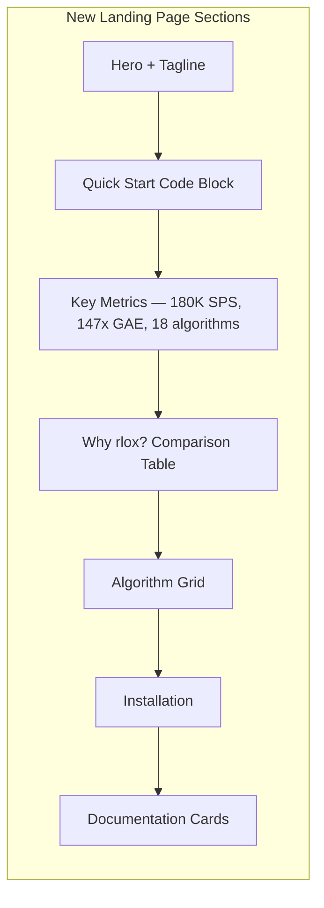
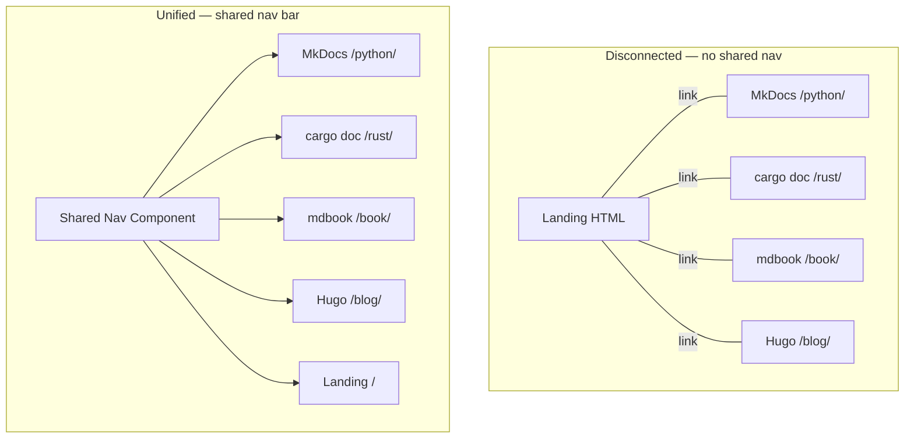
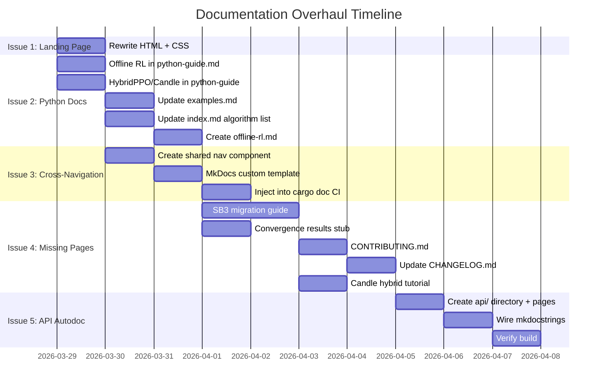

# Documentation Overhaul Plan

## Executive Summary

Five critical gaps prevent the rlox documentation from being production-ready.
This plan provides exact file paths, code, and implementation steps for each fix.

```mermaid
graph TD
    subgraph Current["Current Site Architecture"]
        L[docs-landing/index.html<br/>4 cards, no content] --> P[/python/ — MkDocs Material<br/>Good structure, outdated content]
        L --> R[/rust/ — cargo doc<br/>Auto-generated, complete]
        L --> B[/book/ — mdbook<br/>Duplicate of MkDocs content]
        L --> BG[/blog/ — Hugo<br/>Exists]
    end

    subgraph Issues["5 Issues"]
        I1[1. Minimal landing page]
        I2[2. Outdated Python docs]
        I3[3. Disconnected navigation]
        I4[4. Missing pages]
        I5[5. No API autodoc]
    end

    style I1 fill:#FF6B6B
    style I2 fill:#FF6B6B
    style I3 fill:#FFA500
    style I4 fill:#FFA500
    style I5 fill:#FFD93D
```

---

## Issue 1: Landing Page Too Minimal

### Current State

`docs-landing/index.html` is 110 lines of static HTML with:
- Title + tagline
- 4 link cards (Rust API, Architecture, Python, Blog)
- No quickstart, installation, benchmarks, or algorithm list

### Fix: Complete Landing Page Rewrite

**File:** `docs-landing/index.html`



**Implementation:**

```html
<!-- Hero -->
<header>
  <h1>rlox</h1>
  <p class="tagline">Rust-accelerated reinforcement learning. 3-50x faster.</p>
</header>

<!-- Quick Start -->
<section class="quickstart">
  <h2>Quick Start</h2>
  <pre><code>pip install rlox

# Train PPO on CartPole in 3 lines
from rlox.trainers import PPOTrainer
metrics = PPOTrainer(env="CartPole-v1").train(50_000)
print(f"Reward: {metrics['mean_reward']:.0f}")  # ~500

# CLI (no Python needed)
python -m rlox train --algo ppo --env CartPole-v1 --timesteps 100000</code></pre>
</section>

<!-- Key Metrics -->
<section class="metrics">
  <div class="metric"><span>180K</span><p>SPS with Candle hybrid</p></div>
  <div class="metric"><span>147x</span><p>faster GAE than NumPy</p></div>
  <div class="metric"><span>18</span><p>algorithms</p></div>
  <div class="metric"><span>14</span><p>Rust crate tests</p></div>
</section>

<!-- Why rlox -->
<section class="comparison">
  <h2>Why rlox?</h2>
  <table>
    <tr><th></th><th>vs SB3</th><th>vs CleanRL</th><th>vs RLlib</th><th>vs TRL</th></tr>
    <tr><td>Speed</td><td>3-50x faster</td><td>2x faster</td><td>Same (single-node)</td><td>4-14x faster primitives</td></tr>
    <tr><td>Focus</td><td>Same API</td><td>Same simplicity</td><td>No Ray overhead</td><td>Complementary</td></tr>
    <tr><td>Unique</td><td>Rust VecEnv</td><td>More algorithms</td><td>Lightweight</td><td>Rust KL/GRPO</td></tr>
  </table>
</section>

<!-- Algorithms -->
<section class="algorithms">
  <h2>Algorithms</h2>
  <div class="algo-grid">
    <div class="algo-group">
      <h3>On-Policy</h3>
      <ul><li>PPO</li><li>A2C</li><li>IMPALA</li><li>MAPPO</li></ul>
    </div>
    <div class="algo-group">
      <h3>Off-Policy</h3>
      <ul><li>SAC</li><li>TD3</li><li>DQN (Rainbow)</li></ul>
    </div>
    <div class="algo-group">
      <h3>Offline RL</h3>
      <ul><li>TD3+BC</li><li>IQL</li><li>CQL</li><li>BC</li></ul>
    </div>
    <div class="algo-group">
      <h3>LLM Post-Training</h3>
      <ul><li>GRPO</li><li>DPO</li><li>OnlineDPO</li><li>BestOfN</li></ul>
    </div>
    <div class="algo-group">
      <h3>Model-Based</h3>
      <ul><li>DreamerV3</li></ul>
    </div>
    <div class="algo-group">
      <h3>Hybrid</h3>
      <ul><li>HybridPPO (Candle)</li></ul>
    </div>
  </div>
</section>

<!-- Installation -->
<section class="install">
  <h2>Installation</h2>
  <pre><code># From PyPI
pip install rlox

# From source (requires Rust toolchain)
git clone https://github.com/wojciechkpl/rlox.git
cd rlox && pip install -e ".[dev]"</code></pre>
</section>

<!-- Doc Cards (keep existing 4 + add 2) -->
<section class="cards">
  <a class="card" href="./python/getting-started/">
    <h2>Getting Started</h2>
    <p>Installation, first training run, 7-step tutorial.</p>
  </a>
  <a class="card" href="./python/">
    <h2>Python Guide</h2>
    <p>Complete API reference with examples.</p>
  </a>
  <a class="card" href="./python/examples/">
    <h2>Examples</h2>
    <p>Copy-paste code for every algorithm.</p>
  </a>
  <a class="card" href="./rust/rlox_core/">
    <h2>Rust API</h2>
    <p>Auto-generated crate documentation.</p>
  </a>
  <a class="card" href="./python/tutorials/custom-components/">
    <h2>Tutorials</h2>
    <p>Custom networks, exploration, offline RL.</p>
  </a>
  <a class="card" href="./blog/">
    <h2>Blog</h2>
    <p>Benchmarks and technical deep-dives.</p>
  </a>
</section>
```

**Effort:** 2-3 hours (HTML + CSS)

---

## Issue 2: Python Docs Outdated

### Missing Content

| What's Missing | Where to Add | Lines |
|----------------|-------------|-------|
| Offline RL algorithms (TD3+BC, IQL, CQL, BC) | `python-guide.md` + `examples.md` | ~80 |
| `OfflineDatasetBuffer` usage | `python-guide.md` (Low-Level section) | ~30 |
| `OfflineAlgorithm` base class | `python-guide.md` (Mid-Level section) | ~20 |
| HybridPPO + CandleCollector | `python-guide.md` + new tutorial | ~60 |
| Multi-env off-policy (`n_envs`, `OffPolicyCollector`) | Already added this session | Done |

### Implementation Plan

#### Step 1: Update `docs/python-guide.md`

Add after "Off-Policy (SAC, TD3, DQN)" section:

```markdown
### Offline RL (TD3+BC, IQL, CQL, BC)

Train from static datasets without environment interaction. All offline
algorithms use `OfflineDatasetBuffer` (Rust-accelerated) for fast batch
sampling from D4RL/Minari-scale datasets.

​```python
import rlox
from rlox.algorithms.td3_bc import TD3BC

# Load offline dataset
buf = rlox.OfflineDatasetBuffer(
    obs.ravel(), next_obs.ravel(), actions.ravel(),
    rewards, terminated, truncated, normalize=True,
)
print(buf.stats())  # {'n_transitions': 1000000, 'n_episodes': ...}

# TD3+BC: TD3 with behavioral cloning regularization
algo = TD3BC(dataset=buf, obs_dim=17, act_dim=6, alpha=2.5)
algo.train(n_gradient_steps=100_000)
action = algo.predict(obs)
​```

​```python
# IQL: Implicit Q-Learning (no OOD action queries)
from rlox.algorithms.iql import IQL
algo = IQL(dataset=buf, obs_dim=17, act_dim=6, expectile=0.7)
algo.train(n_gradient_steps=100_000)
​```

​```python
# CQL: Conservative Q-Learning (penalizes OOD Q-values)
from rlox.algorithms.cql import CQL
algo = CQL(dataset=buf, obs_dim=17, act_dim=6, cql_alpha=5.0)
algo.train(n_gradient_steps=100_000)
​```

​```python
# BC: Behavioral Cloning (supervised learning on demos)
from rlox.algorithms.bc import BC
algo = BC(dataset=buf, obs_dim=17, act_dim=6)
algo.train(n_gradient_steps=10_000)
​```

### Candle Hybrid Collection

The `CandleCollector` runs policy inference entirely in Rust (Candle NN)
at 180K+ SPS — zero Python dispatch overhead during collection.

​```python
from rlox.algorithms.hybrid_ppo import HybridPPO

ppo = HybridPPO(env_id="CartPole-v1", n_envs=16, hidden=64)
metrics = ppo.train(total_timesteps=100_000)
print(ppo.timing_summary())
# {'collection_pct': 27.0, 'training_pct': 73.0}
​```
```

#### Step 2: Update `docs/examples.md`

Add offline RL examples section after "DQN with Prioritized Experience Replay".

#### Step 3: Update `docs/index.md`

Update algorithm list to include offline RL and HybridPPO.

#### Step 4: Update `mkdocs.yml` nav

```yaml
nav:
  - Home: index.md
  - Learn:
      - Getting Started: getting-started.md
      - RL Introduction: rl-introduction.md
      - Python User Guide: python-guide.md
      - Examples: examples.md
  - Algorithms:
      - Offline RL: offline-rl.md                    # NEW
      - LLM Post-Training (DPO/GRPO): llm-post-training.md
      - Math Reference: math-reference.md
  - Tutorials:
      - Custom Components: tutorials/custom-components.md
      - Custom Rewards & Training Loops: tutorials/custom-rewards-and-training-loops.md
      - Candle Hybrid Collection: tutorials/candle-hybrid.md  # NEW
      - Migrating from SB3: tutorials/migration-sb3.md        # NEW
  - Benchmarks:
      - Overview: benchmark/README.md
      - Convergence Results: benchmark/convergence-results.md  # NEW
      - ...existing benchmark pages...
  - Architecture:
      - ...existing...
  - Research:
      - ...existing + add offline RL papers...
  - API Reference:                                   # NEW SECTION
      - Overview: api/index.md
      - Algorithms: api/algorithms.md
      - Buffers: api/buffers.md
      - Primitives: api/primitives.md
  - References: references.md
```

**Effort:** 4-5 hours

---

## Issue 3: No Cross-Navigation

### Problem

Four separate doc tools with no shared navigation:



### Fix: Shared Navigation Header

#### Step 1: Create shared nav snippet

**File:** `docs-landing/nav.html` (new)

```html
<nav class="rlox-global-nav">
  <a href="/rlox/" class="nav-brand">rlox</a>
  <div class="nav-links">
    <a href="/rlox/python/">Python Docs</a>
    <a href="/rlox/python/getting-started/">Getting Started</a>
    <a href="/rlox/python/examples/">Examples</a>
    <a href="/rlox/rust/rlox_core/">Rust API</a>
    <a href="/rlox/blog/">Blog</a>
    <a href="https://github.com/wojciechkpl/rlox" class="nav-github">GitHub</a>
  </div>
</nav>
```

#### Step 2: Inject into MkDocs via custom template

**File:** `docs/overrides/main.html` (new)

```html


<nav class="rlox-global-nav">
  <a href="/rlox/">Home</a> |
  <a href="/rlox/python/">Python</a> |
  <a href="/rlox/rust/rlox_core/">Rust API</a> |
  <a href="/rlox/blog/">Blog</a> |
  <a href="https://github.com/wojciechkpl/rlox">GitHub</a>
</nav>

```

**mkdocs.yml addition:**
```yaml
theme:
  custom_dir: docs/overrides
```

#### Step 3: Inject into cargo doc via docs.yml

Add a post-processing step in `.github/workflows/docs.yml`:

```yaml
- name: Inject nav into cargo doc
  run: |
    NAV='<div style="background:#1a1a2e;padding:8px;text-align:center">
    <a href="/rlox/" style="color:#fff;margin:0 12px">Home</a>
    <a href="/rlox/python/" style="color:#90a4ae;margin:0 12px">Python</a>
    <a href="/rlox/rust/rlox_core/" style="color:#90a4ae;margin:0 12px">Rust API</a>
    </div>'
    find _site/rust -name "*.html" -exec sed -i "s|<body[^>]*>|&$NAV|" {} +
```

**Effort:** 3-4 hours

---

## Issue 4: Missing Pages

### 4.1 SB3 Migration Guide

**File:** `docs/tutorials/migration-sb3.md` (new, ~200 lines)

```markdown
# Migrating from Stable-Baselines3

## Side-by-Side Comparison

| SB3 | rlox | Notes |
|-----|------|-------|
| `PPO("MlpPolicy", "CartPole-v1")` | `PPO(env_id="CartPole-v1")` | Same simplicity |
| `model.learn(50_000)` | `ppo.train(50_000)` | Same API |
| `model.predict(obs)` | `ppo.predict(obs)` | Same interface |
| `model.save("ppo")` | `ppo.save("ppo.pt")` | Same pattern |
| `EvalCallback(...)` | `EvalCallback(...)` | Same concept |
| `VecNormalize(...)` | `normalize_obs=True` | Built-in |

## What's Different
- rlox uses Rust for env stepping, GAE, buffers (3-50x faster)
- rlox uses PyTorch directly (no wrapped policy classes)
- rlox configs are Python dataclasses (with YAML support)
- rlox supports offline RL (TD3+BC, IQL, CQL, BC)
- rlox supports LLM post-training (GRPO, DPO)
- rlox supports Candle hybrid collection (180K SPS)

## Algorithm Mapping

| SB3 | rlox | Import |
|-----|------|--------|
| `PPO` | `PPO` | `from rlox.algorithms.ppo import PPO` |
| `SAC` | `SAC` | `from rlox.algorithms.sac import SAC` |
| `TD3` | `TD3` | `from rlox.algorithms.td3 import TD3` |
| `DQN` | `DQN` | `from rlox.algorithms.dqn import DQN` |
| `A2C` | `A2C` | `from rlox.algorithms.a2c import A2C` |
| — | `TD3BC` | `from rlox.algorithms.td3_bc import TD3BC` |
| — | `IQL` | `from rlox.algorithms.iql import IQL` |
| — | `CQL` | `from rlox.algorithms.cql import CQL` |
| — | `HybridPPO` | `from rlox.algorithms.hybrid_ppo import HybridPPO` |

## Full Migration Example

### SB3
​```python
from stable_baselines3 import PPO
from stable_baselines3.common.callbacks import EvalCallback

model = PPO("MlpPolicy", "CartPole-v1", verbose=1)
eval_cb = EvalCallback(gym.make("CartPole-v1"), eval_freq=5000)
model.learn(total_timesteps=100_000, callback=eval_cb)
model.save("ppo_cartpole")
​```

### rlox
​```python
from rlox.algorithms.ppo import PPO
from rlox.callbacks import EvalCallback

ppo = PPO(env_id="CartPole-v1", n_envs=8)
eval_cb = EvalCallback(eval_freq=5000, env_id="CartPole-v1")
ppo.train(total_timesteps=100_000)
ppo.save("ppo_cartpole.pt")
​```
```

### 4.2 Convergence Results Page

**File:** `docs/benchmark/convergence-results.md` (new, ~150 lines)

Will be populated when GCP benchmark v5 completes (currently 26/32).

```markdown
# Convergence Benchmark Results

## Methodology
- Framework: rlox v0.2.3 vs SB3 v2.x
- Hardware: e2-standard-8 (8 vCPU, 32GB), CPU-only
- Environments: CartPole-v1, Pendulum-v1, HalfCheetah-v4, Hopper-v4, Walker2d-v4
- Algorithms: PPO, SAC, TD3, DQN
- Evaluation: 30 episodes every 10K steps

## Results

(Populated after benchmark completion — tables + learning curves)
```

### 4.3 CONTRIBUTING.md

**File:** `CONTRIBUTING.md` (new, ~100 lines)

```markdown
# Contributing to rlox

## Development Setup

​```bash
git clone https://github.com/wojciechkpl/rlox.git
cd rlox
python -m venv .venv && source .venv/bin/activate
pip install maturin numpy gymnasium torch pytest
maturin develop --release
​```

## Running Tests

​```bash
# Rust tests
cargo test --workspace

# Python tests
python -m pytest tests/ -x

# Quick smoke test
python -m pytest tests/python/test_algorithm_smoke.py -v
​```

## Code Style

- Rust: `cargo fmt --all && cargo clippy --workspace`
- Python: `ruff check python/ && ruff format python/`

## Pull Request Process

1. Create a feature branch from `main`
2. Write tests first (TDD)
3. Ensure all tests pass
4. Update documentation if adding new features
5. Keep PRs focused — one feature per PR
```

### 4.4 Update CHANGELOG.md

**File:** `CHANGELOG.md` (append new version)

```markdown
## [0.3.0] - 2026-03-29

### Added
- **Offline RL**: TD3+BC, IQL, CQL, BC algorithms with `OfflineDatasetBuffer` (Rust)
- **Candle Hybrid Collection**: `CandleCollector` (180K SPS), `HybridPPO`
- **OffPolicyCollector**: Multi-env collection for SAC, TD3, DQN (`n_envs` parameter)
- **Algorithm bug fixes**: IMPALA V-trace bootstrap, DreamerV3 gradient isolation, MAPPO critic dim
- **47 new tests**: LLM algorithms, offline RL, CandleCollector, HybridPPO
- **`OfflineAlgorithm` base class** with `OfflineDataset` protocol
- **`ExplorationBonus` protocol** for pluggable intrinsic rewards

### Fixed
- IMPALA: V-trace now uses computed bootstrap value instead of hardcoded 0.0
- IMPALA: Auto-detects continuous envs, falls back to GymVecEnv
- DreamerV3: World model frozen during actor-critic training
- MAPPO: NotImplementedError for n_agents > 1 (prevents silent bugs)
```

**Effort:** 4-5 hours total for all missing pages

---

## Issue 5: No API Autodoc

### Current State

`mkdocs.yml` has `mkdocstrings` configured but no API reference pages exist in the nav. The plugin is installed but unused.

### Fix: Create API Reference Pages

#### Step 1: Create API directory

```bash
mkdir -p docs/api
```

#### Step 2: Create autodoc pages

**File:** `docs/api/index.md`

```markdown
# API Reference

Auto-generated from source code docstrings.

## Modules

| Module | Description |
|--------|-------------|
| [Algorithms](algorithms.md) | PPO, SAC, DQN, TD3, offline RL, LLM |
| [Buffers](buffers.md) | ReplayBuffer, PrioritizedReplayBuffer, OfflineDatasetBuffer |
| [Primitives](primitives.md) | GAE, V-trace, KL, GRPO advantages |
| [Callbacks](callbacks.md) | Training callbacks and loggers |
| [Policies](policies.md) | Neural network policies |
```

**File:** `docs/api/algorithms.md`

```markdown
# Algorithms API

## On-Policy

::: rlox.algorithms.ppo.PPO

::: rlox.algorithms.a2c.A2C

## Off-Policy

::: rlox.algorithms.sac.SAC

::: rlox.algorithms.td3.TD3

::: rlox.algorithms.dqn.DQN

## Offline RL

::: rlox.algorithms.td3_bc.TD3BC

::: rlox.algorithms.iql.IQL

::: rlox.algorithms.cql.CQL

::: rlox.algorithms.bc.BC

## LLM Post-Training

::: rlox.algorithms.grpo.GRPO

::: rlox.algorithms.dpo.DPO

## Hybrid

::: rlox.algorithms.hybrid_ppo.HybridPPO
```

**File:** `docs/api/buffers.md`

```markdown
# Buffers API

## Rust-Accelerated Buffers

> These classes are implemented in Rust and exposed via PyO3.
> See the [Rust API docs](/rlox/rust/rlox_core/) for implementation details.

### ReplayBuffer

​```python
buf = rlox.ReplayBuffer(capacity=100_000, obs_dim=4, act_dim=1)
buf.push(obs, action, reward, terminated, truncated, next_obs)
batch = buf.sample(batch_size=256, seed=42)
​```

### PrioritizedReplayBuffer

​```python
pbuf = rlox.PrioritizedReplayBuffer(capacity=100_000, obs_dim=4, act_dim=1, alpha=0.6, beta=0.4)
​```

### OfflineDatasetBuffer

​```python
buf = rlox.OfflineDatasetBuffer(obs, next_obs, actions, rewards, terminated, truncated)
batch = buf.sample(256, seed=42)  # i.i.d. transitions
traj = buf.sample_trajectories(batch_size=8, seq_len=20, seed=42)  # for Decision Transformer
​```

### MmapReplayBuffer

​```python
buf = rlox.MmapReplayBuffer(hot_capacity=10_000, total_capacity=1_000_000,
                             obs_dim=84*84*4, act_dim=1, cold_path="/tmp/cold.bin")
​```

### CandleCollector

​```python
collector = rlox.CandleCollector(env_id="CartPole-v1", n_envs=16, obs_dim=4,
                                  n_actions=2, n_steps=128, hidden=64)
batch = collector.recv()  # Pure Rust collection, 180K SPS
collector.sync_weights(flat_params)  # Update from PyTorch
​```
```

**File:** `docs/api/callbacks.md`

```markdown
# Callbacks API

::: rlox.callbacks.Callback

::: rlox.callbacks.EvalCallback

::: rlox.callbacks.CheckpointCallback

::: rlox.callbacks.ProgressBarCallback

::: rlox.callbacks.TimingCallback
```

#### Step 3: Verify mkdocstrings works

```bash
.venv/bin/python3 -m mkdocs build
```

**Effort:** 3-4 hours

---

## Implementation Timeline



## Effort Summary

| Issue | Files to Create/Modify | Estimated Hours |
|-------|----------------------|-----------------|
| 1. Landing Page | `docs-landing/index.html` | 3 |
| 2. Python Docs | `python-guide.md`, `examples.md`, `index.md`, `offline-rl.md` | 5 |
| 3. Cross-Navigation | `nav.html`, `overrides/main.html`, `docs.yml`, `mkdocs.yml` | 4 |
| 4. Missing Pages | `migration-sb3.md`, `convergence-results.md`, `CONTRIBUTING.md`, `CHANGELOG.md`, `candle-hybrid.md` | 5 |
| 5. API Autodoc | `api/index.md`, `api/algorithms.md`, `api/buffers.md`, `api/callbacks.md`, `api/policies.md` | 4 |
| **Total** | **~20 files** | **~21 hours** |

## Quick Wins (Do First, <30 min each)

1. Update `CHANGELOG.md` with v0.3.0 entries
2. Update `docs/index.md` algorithm list (add offline RL + HybridPPO)
3. Create `CONTRIBUTING.md` skeleton
4. Update `mkdocs.yml` nav with new sections
5. Create `docs/benchmark/convergence-results.md` stub
