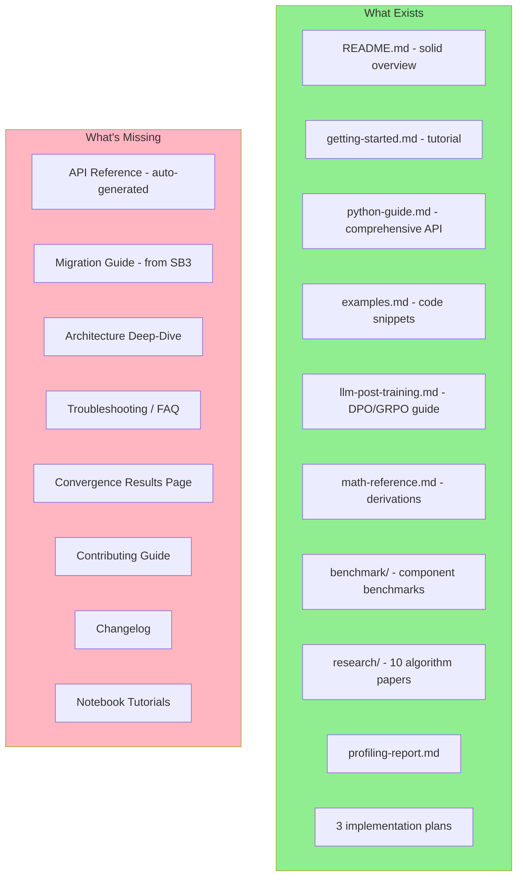
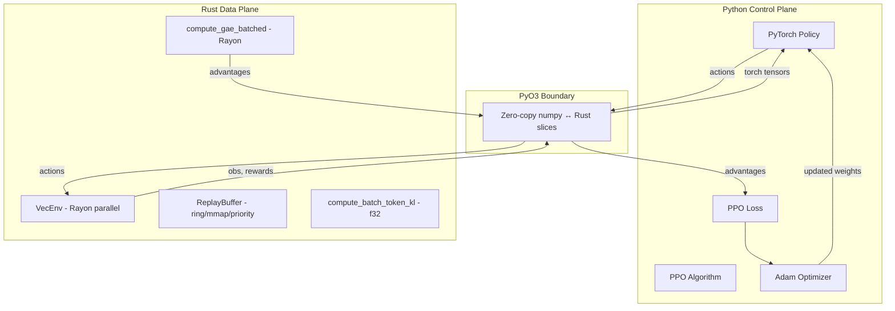
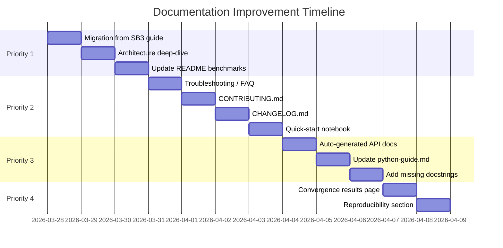

# Documentation Improvement Plan

## Current State

rlox has extensive documentation across 15+ files, but it has gaps that make onboarding harder for both researchers and practitioners.



---

## Priority 1: Researcher Onboarding

### 1.1 Create `docs/migration-from-sb3.md`

Most rlox users will come from Stable-Baselines3. A side-by-side migration guide is the single most impactful doc for adoption.

```markdown
# Migrating from Stable-Baselines3

## Side-by-Side Comparison

| SB3 | rlox | Notes |
|-----|------|-------|
| `model = PPO("MlpPolicy", "CartPole-v1")` | `ppo = PPO(env_id="CartPole-v1")` | Same simplicity |
| `model.learn(50_000)` | `ppo.train(50_000)` | Same API shape |
| `model.predict(obs)` | `ppo.predict(obs)` | Same interface |
| `model.save("ppo")` | `ppo.save("ppo.pt")` | Same pattern |
| `EvalCallback(...)` | `EvalCallback(...)` | Same concept |

## What's Different
- rlox uses Rust for env stepping, GAE, buffers (2-50x faster)
- rlox uses PyTorch directly (no wrapped policy classes)
- rlox configs are Python dataclasses, not dicts
- rlox supports LLM post-training (GRPO, DPO)

## SB3 Compatibility Layer
```python
from rlox.compat.sb3 import PPO  # drop-in replacement
model = PPO("MlpPolicy", "CartPole-v1")
model.learn(50_000)
```
```

**Effort**: 2-3 hours

### 1.2 Create `docs/architecture.md`

A visual deep-dive for researchers who want to understand the system before extending it.

Should include:
- Mermaid diagram of the data flow (env → buffer → GAE → policy → loss)
- Crate dependency graph
- PyO3 boundary explanation with zero-copy examples
- How the collection pipeline works (RolloutCollector flow)
- How off-policy training loops work (SAC/TD3 data flow)



**Effort**: 4-5 hours

### 1.3 Update README convergence table

The README shows old convergence numbers (5 seeds, Classic Control only). Update with the latest fair comparison results including MuJoCo, and note the VecNormalize fix.

**Effort**: 1 hour (once benchmark run completes)

---

## Priority 2: Practitioner Onboarding

### 2.1 Create `docs/troubleshooting.md`

Common issues and solutions:

```markdown
# Troubleshooting & FAQ

## Installation Issues
- "cargo not found" → Install Rust: `curl --proto '=https' --tlsv1.2 -sSf https://sh.rustup.rs | sh`
- "PyO3 Python version mismatch" → Set `PYO3_PYTHON=.venv/bin/python`
- "protoc not found" → `apt-get install protobuf-compiler` or `brew install protobuf`

## Training Issues
- SAC reward stuck at -1500 on Pendulum → Check action scaling (act_high)
- PPO not converging on MuJoCo → Enable obs normalization: `normalize_obs=True`
- DQN not learning on MountainCar → Increase exploration_fraction to 0.5
- A2C unstable on CartPole → Normal — A2C with n_steps=5 has high variance, use PPO instead

## Performance Issues
- "Slow on Apple Silicon" → Ensure `--release` flag with maturin
- "torch.compile makes it slower" → Normal for <100K steps (compilation overhead); benefit shows at 500K+
- "GIL contention in multi-threaded" → rlox releases GIL during Rust computation automatically

## CLI Issues
- `python -m rlox train --algo ppo --env CartPole-v1` → Ensure `pip install rlox[all]` for torch/gymnasium
```

**Effort**: 2 hours

### 2.2 Create `docs/tutorials/` notebooks

Interactive Jupyter notebooks are the gold standard for practitioner onboarding:

1. **`01-quick-start.ipynb`** — Train PPO, plot rewards, save/load model
2. **`02-custom-environment.ipynb`** — Use SAC with a custom Gymnasium env
3. **`03-hyperparameter-tuning.ipynb`** — PPOConfig, YAML configs, comparing runs
4. **`04-llm-post-training.ipynb`** — DPO and GRPO with a small model
5. **`05-profiling-your-training.ipynb`** — TimingCallback, ConsoleLogger, bottleneck analysis

**Effort**: 1 day per notebook

### 2.3 Create `CONTRIBUTING.md`

Essential for open-source adoption:

```markdown
# Contributing to rlox

## Development Setup
1. Fork and clone
2. `python3 -m venv .venv && source .venv/bin/activate`
3. `pip install maturin numpy gymnasium torch pytest`
4. `maturin develop --release`
5. `cargo test --workspace && python -m pytest tests/`

## Code Style
- Rust: `cargo fmt && cargo clippy`
- Python: `ruff check python/rlox/`
- No hardcoded magic numbers (use named constants or CLI args)

## Pull Request Checklist
- [ ] Tests pass locally (`cargo test && pytest`)
- [ ] New features have tests
- [ ] Documentation updated
- [ ] No `Co-Authored-By` in commits

## Architecture Overview
See [docs/architecture.md](docs/architecture.md)
```

**Effort**: 2 hours

### 2.4 Create `CHANGELOG.md`

Track what changed between versions. Users need to know what's new and what might break.

**Effort**: 1 hour

---

## Priority 3: API Discoverability

### 3.1 Auto-generated API reference

Set up `pdoc` or `mkdocs` with `mkdocstrings` to auto-generate API docs from docstrings:

```bash
pip install pdoc
pdoc rlox --html --output-dir docs/api/
```

This gives users searchable, hyperlinked API docs for every class/function.

**Effort**: 3-4 hours (setup + CI integration)

### 3.2 Update `docs/python-guide.md` with new features

The guide is mostly current but missing:
- `predict()` method examples
- `EvalCallback` / `CheckpointCallback` usage (now functional)
- `push_batch()` for vectorized buffer ops
- `compile=True` flag
- `MmapReplayBuffer` usage
- `get_action_value()` combined forward

**Effort**: 1-2 hours

### 3.3 Add docstrings to undocumented public APIs

Check coverage:
```bash
python -c "
import rlox
for attr in dir(rlox):
    obj = getattr(rlox, attr)
    if callable(obj) and not attr.startswith('_'):
        doc = getattr(obj, '__doc__', None)
        status = 'OK' if doc else 'MISSING'
        print(f'{status}: {attr}')
"
```

**Effort**: 2-3 hours

---

## Priority 4: Research Credibility

### 4.1 Create `docs/benchmark/convergence/README.md`

Synthesize convergence results with proper statistical reporting:

```markdown
# Convergence Benchmark Results

## Methodology
- Hardware: GCP e2-standard-8 (8 vCPU, 32GB RAM)
- Both frameworks: DummyVecEnv (sequential stepping)
- SB3: VecNormalize when config specifies normalize_obs
- 30 eval episodes for MuJoCo, 10 for Classic Control

## Results Table
| Algorithm | Environment | rlox | SB3 | Gap | Throughput |
...

## Learning Curves


## Statistical Analysis
- IQM with 95% bootstrap CI (Agarwal et al., 2021)
- Performance profiles
```

**Effort**: 3-4 hours (once results are final)

### 4.2 Add reproducibility section to README

```markdown
## Reproducing Results

```bash
# Component benchmarks (10 min)
docker compose run --rm benchmark-components

# Convergence benchmarks (8-12 hours)
docker compose run --rm benchmark-convergence

# Results in ./results/
```
```

**Effort**: 30 minutes

---

## Implementation Timeline



---

## Summary

| # | Document | Target Audience | Impact | Effort |
|---|----------|----------------|--------|--------|
| 1.1 | Migration from SB3 | **Practitioners** | **High** | 3 hours |
| 1.2 | Architecture deep-dive | **Researchers** | **High** | 5 hours |
| 1.3 | Update README benchmarks | **Everyone** | **High** | 1 hour |
| 2.1 | Troubleshooting / FAQ | **Practitioners** | **High** | 2 hours |
| 2.2 | Jupyter notebooks | **Practitioners** | **Medium** | 1 day/notebook |
| 2.3 | CONTRIBUTING.md | **Contributors** | **Medium** | 2 hours |
| 2.4 | CHANGELOG.md | **Everyone** | **Medium** | 1 hour |
| 3.1 | Auto-generated API docs | **Everyone** | **Medium** | 4 hours |
| 3.2 | Update python-guide.md | **Everyone** | **Low** | 2 hours |
| 3.3 | Add missing docstrings | **Everyone** | **Low** | 3 hours |
| 4.1 | Convergence results page | **Researchers** | **High** | 4 hours |
| 4.2 | Reproducibility section | **Researchers** | **Medium** | 30 min |
