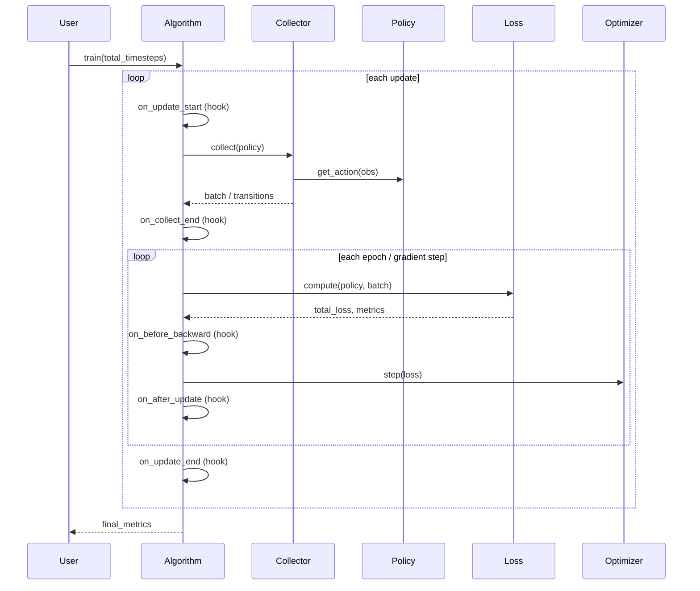
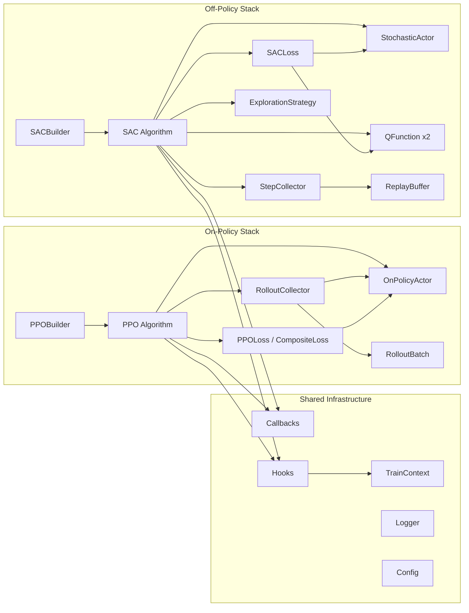

# Extensible Trainer Architecture Plan

## Status: Proposal (2026-03-28)

---

## 1. Current Architecture Analysis

### What exists today

The rlox training stack has five algorithm implementations (PPO, SAC, TD3, DQN) and thin `*Trainer` wrappers. Each algorithm is a monolithic class that owns its entire lifecycle: environment detection, network construction, data collection, loss computation, optimization, and logging.

```
PPOTrainer ─────> PPO
                   ├── PPOConfig (dataclass)
                   ├── DiscretePolicy / ContinuousPolicy (nn.Module)
                   ├── RolloutCollector
                   │     ├── VecEnv (Rust) or GymVecEnv
                   │     └── compute_gae_batched (Rust)
                   ├── PPOLoss (callable)
                   ├── Adam optimizer
                   ├── CallbackList
                   └── LoggerCallback
```

### What users CAN customize today

| Customization | How | Limitations |
|---|---|---|
| Policy network (PPO) | `PPO(policy=my_net)` | Must implement exact method names; SAC/TD3/DQN don't accept `policy=` |
| Reward shaping | `RolloutCollector(reward_fn=...)` | Only for on-policy; off-policy algorithms ignore this |
| Hyperparameters | Config dicts or `**kwargs` | No validation for unknown keys; silently dropped |
| Callbacks | `callbacks=[...]` | Good hook points, but no access to loss computation internals |
| Logger | `logger=WandbLogger(...)` | PPO only; SAC/DQN have inconsistent logger support |
| Environment | Pass env string | No custom env wrappers without subclassing |

### What users CANNOT customize today

1. **Custom loss terms** -- PPOLoss is a sealed class; no hook for auxiliary losses (e.g., representation learning, curiosity, KL penalties against a reference policy).

2. **Custom networks for off-policy algorithms** -- SAC hardcodes `SquashedGaussianPolicy` and `QNetwork`; TD3 hardcodes `DeterministicPolicy`. Users cannot inject a CNN-based critic or a transformer actor.

3. **Custom exploration strategies** -- DQN hardcodes epsilon-greedy; TD3 hardcodes Gaussian noise. No way to plug in Ornstein-Uhlenbeck, parameter-space noise, or count-based exploration.

4. **Custom optimizers or schedulers** -- All algorithms hardcode `Adam` with a fixed LR (PPO has linear annealing only). No way to use AdamW, LAMB, or cosine schedules.

5. **Custom replay buffers** -- SAC/TD3 hardcode `rlox.ReplayBuffer`. No way to plug in HER, trajectory buffers, or custom sampling strategies.

6. **Mixed components** -- Cannot use PPO's rollout collector with a custom training loop, or SAC's critic update with a different actor loss. Components are not separable.

7. **Custom environment wrappers** -- SAC/TD3/DQN accept raw env IDs or env objects but don't expose a wrapper pipeline. No `env_fn` factory pattern.

8. **Training loop modification** -- The `train()` method is a single monolithic function. Users who want to add mid-loop logic (curriculum learning, dynamic reward scaling, model distillation) must fork the entire class.

9. **Multi-objective / constrained RL** -- No mechanism for Lagrangian constraint handling or Pareto optimization.

10. **Inconsistent interfaces** -- PPO policies need `get_action_and_logprob`, `get_value`, `get_logprob_and_entropy`. SAC policies need `sample`, `deterministic`. No shared protocol.

---

## 2. Proposed Architecture

### Design Principles

- **Protocols over ABCs**: Use `typing.Protocol` for structural subtyping -- users don't need to inherit from our base classes.
- **Composition over inheritance**: Algorithms are assembled from pluggable components, not monolithic classes.
- **Sensible defaults**: Zero-config usage remains as easy as today. Customization is opt-in.
- **CleanRL clarity**: Keep the training loop readable -- no deeply nested abstractions.
- **SB3 ergonomics**: Builder-style construction with `policy=` injection.
- **TorchRL composability**: Loss modules and data carriers are reusable across algorithms.

### Component Dependency Flow

```mermaid
graph TD
    subgraph "User-facing API"
        A[AlgorithmBuilder] --> B[Algorithm]
        B --> T["train(total_timesteps)"]
    end

    subgraph "Pluggable Components"
        P[Policy Protocol]
        C[Collector Protocol]
        L[Loss Protocol]
        BUF[Buffer Protocol]
        E[ExplorationStrategy Protocol]
        O[OptimizerFactory]
        S[Scheduler]
    end

    subgraph "Defaults"
        P1[DiscretePolicy]
        P2[ContinuousPolicy]
        P3[SquashedGaussianPolicy]
        C1[RolloutCollector]
        C2[StepCollector]
        L1[PPOLoss]
        L2[SACLoss]
        L3[TD3Loss]
        L4[DQNLoss]
        BUF1["ReplayBuffer (Rust)"]
        BUF2[PrioritizedReplayBuffer]
        E1[EpsilonGreedy]
        E2[GaussianNoise]
        E3[OUNoise]
    end

    B --> P
    B --> C
    B --> L
    B --> BUF
    B --> E
    B --> O
    B --> S

    P1 -.->|implements| P
    P2 -.->|implements| P
    P3 -.->|implements| P
    C1 -.->|implements| C
    C2 -.->|implements| C
    L1 -.->|implements| L
    L2 -.->|implements| L
    L3 -.->|implements| L
    L4 -.->|implements| L
    BUF1 -.->|implements| BUF
    BUF2 -.->|implements| BUF
    E1 -.->|implements| E
    E2 -.->|implements| E
    E3 -.->|implements| E
```



### Training Loop Decomposition



---

## 3. Protocol Definitions

### 3.1 Policy Protocols

```python
from typing import Protocol, runtime_checkable
import torch

@runtime_checkable
class OnPolicyActor(Protocol):
    """Policy that produces actions with log-probabilities for on-policy algorithms."""

    def get_action_and_logprob(
        self, obs: torch.Tensor
    ) -> tuple[torch.Tensor, torch.Tensor]:
        """Sample action and return (action, log_prob)."""
        ...

    def get_logprob_and_entropy(
        self, obs: torch.Tensor, actions: torch.Tensor
    ) -> tuple[torch.Tensor, torch.Tensor]:
        """Evaluate (log_prob, entropy) for given (obs, action) pairs."""
        ...

    def get_value(self, obs: torch.Tensor) -> torch.Tensor:
        """Return scalar value estimate V(s)."""
        ...

    def parameters(self) -> ...:
        """PyTorch parameter iterator (inherited from nn.Module)."""
        ...


@runtime_checkable
class StochasticActor(Protocol):
    """Policy that samples actions with log-probabilities (SAC-style)."""

    def sample(self, obs: torch.Tensor) -> tuple[torch.Tensor, torch.Tensor]:
        """Return (action, log_prob) via reparameterized sampling."""
        ...

    def deterministic(self, obs: torch.Tensor) -> torch.Tensor:
        """Return deterministic action (e.g., mean through tanh)."""
        ...

    def parameters(self) -> ...: ...


@runtime_checkable
class DeterministicActor(Protocol):
    """Deterministic policy (TD3-style)."""

    def __call__(self, obs: torch.Tensor) -> torch.Tensor:
        """Return deterministic action."""
        ...

    def parameters(self) -> ...: ...


@runtime_checkable
class QFunction(Protocol):
    """Q-value network that takes (obs, action) -> scalar."""

    def __call__(
        self, obs: torch.Tensor, action: torch.Tensor
    ) -> torch.Tensor: ...

    def parameters(self) -> ...: ...


@runtime_checkable
class DiscreteQFunction(Protocol):
    """Q-network that takes obs -> Q-values for all actions."""

    def __call__(self, obs: torch.Tensor) -> torch.Tensor: ...

    def parameters(self) -> ...: ...
```

### 3.2 Collector Protocol

```python
from typing import Protocol, TypeVar
from rlox.batch import RolloutBatch

BatchT = TypeVar("BatchT")

@runtime_checkable
class OnPolicyCollector(Protocol):
    """Collects rollout data for on-policy algorithms."""

    def collect(self, policy: OnPolicyActor, n_steps: int) -> RolloutBatch: ...


@runtime_checkable
class OffPolicyCollector(Protocol):
    """Collects single transitions and stores them in a buffer."""

    def collect_step(
        self,
        policy: StochasticActor | DeterministicActor,
        exploration: ExplorationStrategy | None = None,
    ) -> dict[str, float]:
        """Take one env step, store transition in buffer, return info."""
        ...

    @property
    def buffer(self) -> ReplayBufferProtocol: ...
```

### 3.3 Buffer Protocol

```python
@runtime_checkable
class ReplayBufferProtocol(Protocol):
    """Minimal replay buffer interface."""

    def push(
        self,
        obs: np.ndarray,
        action: np.ndarray,
        reward: float,
        terminated: bool,
        truncated: bool,
        next_obs: np.ndarray,
        **kwargs,
    ) -> None: ...

    def sample(self, batch_size: int, step: int = 0) -> dict[str, np.ndarray]: ...

    def __len__(self) -> int: ...
```

### 3.4 Loss Protocol

```python
from dataclasses import dataclass

@dataclass
class LossOutput:
    """Standard return type for all loss functions."""
    loss: torch.Tensor          # Scalar for backprop
    metrics: dict[str, float]   # Logging metrics
    aux: dict[str, torch.Tensor] | None = None  # Auxiliary tensors (for custom losses)


class LossFunction(Protocol):
    """Computes a loss given policy and data."""

    def __call__(self, **kwargs) -> LossOutput: ...
```

### 3.5 Exploration Protocol

```python
@runtime_checkable
class ExplorationStrategy(Protocol):
    """Modifies actions for exploration."""

    def select_action(
        self,
        action: np.ndarray | int,
        step: int,
        total_timesteps: int,
    ) -> np.ndarray | int:
        """Apply exploration noise/strategy to an action."""
        ...

    def reset(self) -> None:
        """Reset internal state (e.g., OU process)."""
        ...
```

---

## 4. Composable Loss System

The key innovation: losses are composable via `+` operator and `CompositeLoss`.

```python
class CompositeLoss:
    """Combine multiple loss terms with coefficients.

    Example:
        loss_fn = PPOLoss() + 0.1 * CuriosityLoss(icm) + 0.01 * KLPenalty(ref_policy)
    """

    def __init__(self):
        self._terms: list[tuple[float, LossFunction]] = []

    def add(self, loss_fn: LossFunction, coef: float = 1.0) -> CompositeLoss:
        self._terms.append((coef, loss_fn))
        return self

    def __call__(self, **kwargs) -> LossOutput:
        total_loss = torch.tensor(0.0)
        all_metrics = {}
        for coef, fn in self._terms:
            out = fn(**kwargs)
            total_loss = total_loss + coef * out.loss
            all_metrics.update(out.metrics)
        return LossOutput(loss=total_loss, metrics=all_metrics)


# Enable operator syntax
class LossFunction:
    def __add__(self, other: LossFunction) -> CompositeLoss:
        c = CompositeLoss()
        c.add(self)
        c.add(other)
        return c

    def __rmul__(self, coef: float) -> tuple[float, LossFunction]:
        return (coef, self)
```

---

## 5. Algorithm Builder Pattern

```python
class PPOBuilder:
    """Construct a PPO algorithm from composable parts.

    Example:
        algo = (
            PPOBuilder(env="CartPole-v1")
            .with_policy(MyCustomPolicy(4, 2))
            .with_loss(PPOLoss() + 0.1 * KLPenalty(ref_policy))
            .with_optimizer(lambda params: torch.optim.AdamW(params, lr=3e-4))
            .with_scheduler(lambda opt: CosineAnnealingLR(opt, T_max=1000))
            .with_collector(RolloutCollector("CartPole-v1", n_envs=16))
            .with_reward_fn(lambda obs, act, rew: rew + curiosity_bonus(obs))
            .with_callbacks([WandbLogger(), EvalCallback()])
            .build()
        )
        algo.train(100_000)
    """

    def __init__(self, env: str | gym.Env, seed: int = 42, **config_kwargs):
        self._env = env
        self._seed = seed
        self._config_kwargs = config_kwargs
        self._policy = None
        self._loss_fn = None
        self._optimizer_factory = None
        self._scheduler_factory = None
        self._collector = None
        self._reward_fn = None
        self._callbacks = None
        self._logger = None
        self._env_fn = None

    def with_policy(self, policy: nn.Module) -> PPOBuilder:
        self._policy = policy
        return self

    def with_loss(self, loss_fn) -> PPOBuilder:
        self._loss_fn = loss_fn
        return self

    def with_optimizer(
        self, factory: Callable[[Iterable], torch.optim.Optimizer]
    ) -> PPOBuilder:
        self._optimizer_factory = factory
        return self

    def with_scheduler(
        self, factory: Callable[[torch.optim.Optimizer], Any]
    ) -> PPOBuilder:
        self._scheduler_factory = factory
        return self

    def with_collector(self, collector: OnPolicyCollector) -> PPOBuilder:
        self._collector = collector
        return self

    def with_reward_fn(self, fn: Callable) -> PPOBuilder:
        self._reward_fn = fn
        return self

    def with_callbacks(self, callbacks: list[Callback]) -> PPOBuilder:
        self._callbacks = callbacks
        return self

    def with_env_fn(
        self, fn: Callable[[], gym.Env]
    ) -> PPOBuilder:
        """Factory function for creating environments (enables custom wrappers)."""
        self._env_fn = fn
        return self

    def build(self) -> PPO:
        # Detect env, build defaults for anything not provided, then construct
        ...
```

---

## 6. Hook System (extending callbacks)

Current callbacks operate at coarse granularity (training start/end, step, rollout end, batch). The proposal adds fine-grained hooks that receive mutable context:

```python
@dataclass
class TrainContext:
    """Mutable context passed through hooks during training."""
    step: int
    update: int
    policy: nn.Module
    optimizer: torch.optim.Optimizer
    batch: RolloutBatch | dict | None
    loss: torch.Tensor | None
    metrics: dict[str, float]
    should_stop: bool = False
    extra: dict[str, Any] = field(default_factory=dict)


class TrainingHook(Protocol):
    """Fine-grained hook into the training loop."""

    def on_update_start(self, ctx: TrainContext) -> None: ...
    def on_collect_end(self, ctx: TrainContext) -> None: ...
    def on_before_backward(self, ctx: TrainContext) -> None: ...
    def on_after_update(self, ctx: TrainContext) -> None: ...
    def on_update_end(self, ctx: TrainContext) -> None: ...
```

The difference from `Callback`:
- Callbacks are **observers** (read-only, return bool for early stopping).
- Hooks are **interceptors** (can mutate `TrainContext` -- modify the batch, add to loss, adjust learning rate, etc.).

```python
# Example: curriculum learning hook
class CurriculumHook:
    """Increase environment difficulty based on performance."""

    def on_update_end(self, ctx: TrainContext) -> None:
        if ctx.metrics.get("mean_reward", 0) > self.threshold:
            ctx.extra["difficulty"] += 1
            self.update_env_difficulty(ctx.extra["difficulty"])
```

---

## 7. Refactored Training Loop (PPO)

The core change: the `train()` method becomes a thin orchestrator that delegates to protocols and calls hooks at defined points.

```python
class PPO:
    def __init__(
        self,
        env_id: str,
        *,
        policy: OnPolicyActor | nn.Module | None = None,
        collector: OnPolicyCollector | None = None,
        loss_fn: LossFunction | None = None,
        optimizer_factory: Callable | None = None,
        scheduler_factory: Callable | None = None,
        reward_fn: Callable | None = None,
        callbacks: list[Callback] | None = None,
        hooks: list[TrainingHook] | None = None,
        seed: int = 42,
        **config_kwargs,
    ):
        self.config = PPOConfig(**{
            k: v for k, v in config_kwargs.items()
            if k in PPOConfig.__dataclass_fields__
        })

        # Auto-detect and build defaults
        obs_dim, action_space, is_discrete = _detect_env_spaces(env_id)

        self.policy = policy or self._default_policy(obs_dim, action_space, is_discrete)
        self.collector = collector or RolloutCollector(
            env_id, n_envs=self.config.n_envs, seed=seed,
            reward_fn=reward_fn,
            gamma=self.config.gamma, gae_lambda=self.config.gae_lambda,
        )
        self.loss_fn = loss_fn or PPOLoss(
            clip_eps=self.config.clip_eps,
            vf_coef=self.config.vf_coef,
            ent_coef=self.config.ent_coef,
        )

        opt_factory = optimizer_factory or (
            lambda params: torch.optim.Adam(params, lr=self.config.learning_rate, eps=1e-5)
        )
        self.optimizer = opt_factory(self.policy.parameters())

        if scheduler_factory:
            self.scheduler = scheduler_factory(self.optimizer)
        else:
            self.scheduler = None

        self.callbacks = CallbackList(callbacks)
        self.hooks = hooks or []

    def train(self, total_timesteps: int) -> dict[str, float]:
        cfg = self.config
        steps_per_rollout = cfg.n_envs * cfg.n_steps
        n_updates = max(1, total_timesteps // steps_per_rollout)

        ctx = TrainContext(step=0, update=0, policy=self.policy,
                          optimizer=self.optimizer, batch=None,
                          loss=None, metrics={})

        self.callbacks.on_training_start()

        for update in range(n_updates):
            ctx.update = update
            self._run_hooks("on_update_start", ctx)

            # --- Collect ---
            batch = self.collector.collect(self.policy, n_steps=cfg.n_steps)
            ctx.batch = batch
            self._run_hooks("on_collect_end", ctx)

            # --- Optimize ---
            for _epoch in range(cfg.n_epochs):
                for mb in batch.sample_minibatches(cfg.batch_size, shuffle=True):
                    adv = mb.advantages
                    if cfg.normalize_advantages:
                        adv = (adv - adv.mean()) / (adv.std() + 1e-8)

                    out = self.loss_fn(
                        policy=self.policy, obs=mb.obs, actions=mb.actions,
                        old_log_probs=mb.log_probs, advantages=adv,
                        returns=mb.returns, old_values=mb.values,
                    )

                    ctx.loss = out.loss
                    ctx.metrics.update(out.metrics)
                    self._run_hooks("on_before_backward", ctx)

                    self.optimizer.zero_grad(set_to_none=True)
                    out.loss.backward()
                    nn.utils.clip_grad_norm_(
                        self.policy.parameters(), cfg.max_grad_norm
                    )
                    self.optimizer.step()

                    self._run_hooks("on_after_update", ctx)
                    ctx.step += 1

            if self.scheduler:
                self.scheduler.step()

            self._run_hooks("on_update_end", ctx)

            if ctx.should_stop:
                break

        self.callbacks.on_training_end()
        return ctx.metrics

    def _run_hooks(self, method: str, ctx: TrainContext) -> None:
        for hook in self.hooks:
            if hasattr(hook, method):
                getattr(hook, method)(ctx)
```

---

## 8. Concrete Examples: Current vs Proposed

### Example 1: Custom loss term for PPO (KL penalty against reference policy)

**Current way -- impossible without forking PPO:**

```python
# User must copy-paste the entire PPO.train() method and modify the loss line
class MyPPO(PPO):
    def __init__(self, *args, ref_policy=None, **kwargs):
        super().__init__(*args, **kwargs)
        self.ref_policy = ref_policy

    def train(self, total_timesteps):
        # ... 70 lines of copy-pasted training loop ...
        # Only change: add KL term to loss
        kl = compute_kl(self.policy, self.ref_policy, obs)
        loss = loss + 0.1 * kl
        # ... 30 more lines of copy-paste ...
```

**Proposed way -- compose losses:**

```python
class KLPenalty:
    """Auxiliary loss: KL divergence against a frozen reference policy."""

    def __init__(self, ref_policy: nn.Module, coef: float = 0.1):
        self.ref_policy = ref_policy
        self.coef = coef

    def __call__(self, *, policy, obs, **kwargs) -> LossOutput:
        with torch.no_grad():
            ref_logits = self.ref_policy.actor(obs)
        cur_logits = policy.actor(obs)
        kl = F.kl_div(
            F.log_softmax(cur_logits, dim=-1),
            F.softmax(ref_logits, dim=-1),
            reduction="batchmean",
        )
        return LossOutput(
            loss=self.coef * kl,
            metrics={"kl_penalty": kl.item()},
        )


# Usage
ref_policy = DiscretePolicy(4, 2)
ref_policy.load_state_dict(torch.load("sft_checkpoint.pt"))

algo = (
    PPOBuilder("CartPole-v1")
    .with_loss(PPOLoss() + KLPenalty(ref_policy, coef=0.1))
    .build()
)
algo.train(100_000)
```

### Example 2: Custom network architecture with SAC

**Current way -- impossible:**

```python
# SAC hardcodes SquashedGaussianPolicy and QNetwork in __init__
# No policy= parameter, no way to inject custom networks
# User must subclass SAC and override __init__ entirely
```

**Proposed way:**

```python
class CNNActor(nn.Module):
    """Custom CNN-based actor for image observations."""

    def __init__(self, obs_shape, act_dim, hidden=256):
        super().__init__()
        self.encoder = nn.Sequential(
            nn.Conv2d(3, 32, 3, stride=2), nn.ReLU(),
            nn.Conv2d(32, 64, 3, stride=2), nn.ReLU(),
            nn.Flatten(),
        )
        enc_dim = self._get_enc_dim(obs_shape)
        self.mean_head = nn.Linear(enc_dim, act_dim)
        self.log_std_head = nn.Linear(enc_dim, act_dim)

    def sample(self, obs):
        h = self.encoder(obs)
        mean = self.mean_head(h)
        log_std = self.log_std_head(h).clamp(-20, 2)
        std = log_std.exp()
        dist = torch.distributions.Normal(mean, std)
        x = dist.rsample()
        action = torch.tanh(x)
        log_prob = (dist.log_prob(x) - torch.log(1 - action.pow(2) + 1e-6)).sum(-1)
        return action, log_prob

    def deterministic(self, obs):
        h = self.encoder(obs)
        return torch.tanh(self.mean_head(h))


class CNNCritic(nn.Module):
    """Custom CNN-based Q-network."""

    def __init__(self, obs_shape, act_dim, hidden=256):
        super().__init__()
        self.encoder = nn.Sequential(
            nn.Conv2d(3, 32, 3, stride=2), nn.ReLU(),
            nn.Conv2d(32, 64, 3, stride=2), nn.ReLU(),
            nn.Flatten(),
        )
        enc_dim = self._get_enc_dim(obs_shape)
        self.q_head = nn.Sequential(
            nn.Linear(enc_dim + act_dim, hidden), nn.ReLU(),
            nn.Linear(hidden, 1),
        )

    def forward(self, obs, action):
        h = self.encoder(obs)
        return self.q_head(torch.cat([h, action], dim=-1))


# Usage
algo = (
    SACBuilder("dm_control/cartpole-swingup-v0")
    .with_actor(CNNActor((3, 84, 84), act_dim=1))
    .with_critic(CNNCritic((3, 84, 84), act_dim=1))
    .with_optimizer(lambda params: torch.optim.AdamW(params, lr=1e-4))
    .build()
)
algo.train(500_000)
```

### Example 3: Custom exploration strategy for DQN

**Current way -- impossible:**

```python
# DQN._get_epsilon() is hardcoded; epsilon-greedy is baked into train()
# No way to use Boltzmann exploration or UCB
```

**Proposed way:**

```python
class BoltzmannExploration:
    """Temperature-based action selection from Q-values."""

    def __init__(self, temp_start: float = 5.0, temp_end: float = 0.1):
        self.temp_start = temp_start
        self.temp_end = temp_end

    def select_action(self, q_values: torch.Tensor, step: int,
                      total_timesteps: int) -> int:
        frac = min(1.0, step / total_timesteps)
        temp = self.temp_start + frac * (self.temp_end - self.temp_start)
        probs = F.softmax(q_values / temp, dim=-1)
        return torch.multinomial(probs, 1).item()

    def reset(self) -> None:
        pass


algo = (
    DQNBuilder("CartPole-v1")
    .with_exploration(BoltzmannExploration(temp_start=5.0, temp_end=0.1))
    .build()
)
algo.train(50_000)
```

### Example 4: Building a completely new algorithm from rlox components

```python
class TRPO:
    """Trust Region Policy Optimization using rlox components."""

    def __init__(self, env_id: str, seed: int = 42, delta: float = 0.01):
        obs_dim, action_space, is_discrete = _detect_env_spaces(env_id)

        # Reuse rlox policies
        self.policy = DiscretePolicy(obs_dim, int(action_space.n))

        # Reuse rlox collector (with Rust GAE + VecEnv)
        self.collector = RolloutCollector(
            env_id, n_envs=8, seed=seed, gamma=0.99, gae_lambda=0.97,
        )

        # Custom TRPO-specific loss
        self.delta = delta
        self.value_optimizer = torch.optim.Adam(
            self.policy.critic.parameters(), lr=1e-3
        )
        self.callbacks = CallbackList()

    def train(self, total_timesteps: int) -> dict[str, float]:
        n_updates = total_timesteps // (8 * 128)
        metrics = {}

        for update in range(n_updates):
            # Collect with standard rlox collector
            batch = self.collector.collect(self.policy, n_steps=128)

            # Value function update (standard SGD, reuse batch)
            for mb in batch.sample_minibatches(256, shuffle=True):
                value_loss = F.mse_loss(
                    self.policy.get_value(mb.obs), mb.returns
                )
                self.value_optimizer.zero_grad(set_to_none=True)
                value_loss.backward()
                self.value_optimizer.step()

            # Policy update (conjugate gradient + line search)
            # -- TRPO-specific logic goes here --
            policy_loss = self._trpo_update(batch)

            metrics = {"policy_loss": policy_loss, "value_loss": value_loss.item()}

        return metrics

    def _trpo_update(self, batch: RolloutBatch) -> float:
        """Conjugate gradient + backtracking line search."""
        # ... TRPO-specific implementation ...
        pass
```

### Example 5: Custom environment wrapper pipeline

**Current way:**

```python
# SAC("CartPole-v1") -- no way to add wrappers
# SAC(my_wrapped_env) -- works but fragile, env_id detection breaks
```

**Proposed way:**

```python
def make_env():
    env = gym.make("HalfCheetah-v4")
    env = gym.wrappers.NormalizeObservation(env)
    env = gym.wrappers.NormalizeReward(env)
    env = gym.wrappers.ClipAction(env)
    return env


algo = (
    SACBuilder(env_fn=make_env)  # Factory, not string
    .with_config(learning_rate=1e-4, buffer_size=500_000)
    .build()
)
algo.train(1_000_000)
```

### Example 6: Custom optimizer and LR schedule

**Current way:**

```python
# PPO hardcodes Adam. Only linear annealing is supported.
# No way to use AdamW, cosine schedule, warmup, etc.
```

**Proposed way:**

```python
algo = (
    PPOBuilder("HalfCheetah-v4")
    .with_optimizer(
        lambda params: torch.optim.AdamW(params, lr=3e-4, weight_decay=1e-4)
    )
    .with_scheduler(
        lambda opt: torch.optim.lr_scheduler.CosineAnnealingWarmRestarts(
            opt, T_0=50, T_mult=2
        )
    )
    .build()
)
algo.train(1_000_000)
```

---

## 9. Off-Policy Refactoring (SAC/TD3/DQN)

The off-policy algorithms need the most work. Each currently hardcodes: environment stepping, buffer interaction, network construction, and the update rule into a single `train()` method.

### Proposed off-policy training loop skeleton

```python
class OffPolicyAlgorithm:
    """Base for SAC, TD3, DQN with pluggable components."""

    def __init__(
        self,
        env: str | gym.Env | Callable[[], gym.Env],
        *,
        actor: nn.Module | None = None,
        critic: nn.Module | None = None,
        buffer: ReplayBufferProtocol | None = None,
        exploration: ExplorationStrategy | None = None,
        loss_fn: LossFunction | None = None,
        optimizer_factory: Callable | None = None,
        callbacks: list[Callback] | None = None,
        hooks: list[TrainingHook] | None = None,
        config: dict | None = None,
    ): ...

    def train(self, total_timesteps: int) -> dict[str, float]:
        obs, _ = self.env.reset()
        ctx = TrainContext(...)
        self.callbacks.on_training_start()

        for step in range(total_timesteps):
            # --- Action selection ---
            if step < self.learning_starts:
                action = self.env.action_space.sample()
            else:
                action = self._select_action(obs)
                if self.exploration:
                    action = self.exploration.select_action(
                        action, step, total_timesteps
                    )

            # --- Environment step ---
            next_obs, reward, terminated, truncated, info = self.env.step(action)
            self.buffer.push(obs, action, reward, terminated, truncated, next_obs)

            obs = next_obs
            if terminated or truncated:
                obs, _ = self.env.reset()
                if self.exploration:
                    self.exploration.reset()

            # --- Gradient update ---
            if step >= self.learning_starts and len(self.buffer) >= self.batch_size:
                ctx.step = step
                self._run_hooks("on_update_start", ctx)

                batch = self.buffer.sample(self.batch_size, step)
                out = self.loss_fn(
                    actor=self.actor, critic=self.critic,
                    batch=batch, step=step,
                )

                ctx.loss = out.loss
                ctx.metrics.update(out.metrics)
                self._run_hooks("on_before_backward", ctx)

                # Optimizer steps (delegated to subclass or loss_fn)
                self._apply_gradients(out)

                self._run_hooks("on_after_update", ctx)

            # --- Callbacks ---
            if not self.callbacks.on_step(step=step, reward=..., algo=self):
                break

        self.callbacks.on_training_end()
        return ctx.metrics
```

### Extracted Loss Modules

Each algorithm's update logic becomes a standalone, reusable loss module:

```python
class SACLoss:
    """SAC critic + actor + alpha loss as a composable module."""

    def __init__(self, gamma=0.99, tau=0.005, auto_entropy=True):
        self.gamma = gamma
        self.tau = tau
        self.auto_entropy = auto_entropy

    def __call__(self, *, actor, critic1, critic2,
                 critic1_target, critic2_target,
                 batch, alpha, **kwargs) -> LossOutput:
        # ... existing SAC._update() logic, extracted ...
        return LossOutput(loss=total_loss, metrics={...})


class TD3Loss:
    """TD3 critic + delayed actor loss."""

    def __init__(self, gamma=0.99, tau=0.005, policy_delay=2,
                 target_noise=0.2, noise_clip=0.5):
        ...

    def __call__(self, *, actor, actor_target, critic1, critic2,
                 critic1_target, critic2_target,
                 batch, update_count, **kwargs) -> LossOutput:
        # ... existing TD3._update() logic, extracted ...
        return LossOutput(loss=total_loss, metrics={...})


class DQNLoss:
    """DQN loss with optional Double DQN."""

    def __init__(self, gamma=0.99, double_dqn=True, n_step=1):
        ...

    def __call__(self, *, q_network, target_network,
                 batch, **kwargs) -> LossOutput:
        # ... existing DQN._update() logic, extracted ...
        return LossOutput(loss=total_loss, metrics={...})
```

---

## 10. Migration Plan

### Phase 1: Non-breaking protocol extraction (LOW RISK)

1. Add `rlox/protocols.py` with all Protocol definitions.
2. Add `LossOutput` dataclass.
3. Verify existing classes satisfy protocols with `isinstance()` checks in tests.
4. No changes to existing APIs.

### Phase 2: Extract loss modules (LOW RISK)

1. Extract `SACLoss`, `TD3Loss`, `DQNLoss` from their respective algorithm classes.
2. Refactor each algorithm's `_update()` to delegate to the loss module.
3. Existing API unchanged -- loss modules are internal implementation details.

### Phase 3: Add builder pattern alongside existing constructors (LOW RISK)

1. Add `PPOBuilder`, `SACBuilder`, `TD3Builder`, `DQNBuilder`.
2. Builders construct the same algorithm classes but with DI.
3. Direct construction (`PPO(env_id="CartPole-v1")`) still works unchanged.
4. Add `env_fn=` parameter to all algorithms.
5. Add `policy=` parameter to SAC, TD3, DQN.

### Phase 4: Add hook system (LOW RISK)

1. Add `TrainContext` and `TrainingHook` protocol.
2. Add `hooks=` parameter to all algorithms.
3. Insert hook calls into existing training loops.
4. Callbacks continue to work unchanged.

### Phase 5: Composable losses (MEDIUM RISK)

1. Add `CompositeLoss` with `__add__` / `__rmul__` operators.
2. Modify PPOLoss to return `LossOutput` (breaking change to return type).
3. Add `loss_fn=` parameter to PPO constructor.
4. Deprecate old `PPOLoss.__call__` return type.

### Phase 6: Exploration strategies (LOW RISK)

1. Add `ExplorationStrategy` protocol and default implementations.
2. Add `exploration=` parameter to DQN, TD3.
3. Extract epsilon-greedy and Gaussian noise into strategy classes.

---

## 11. Component Relationship Diagram



---

## 12. Summary of Changes

| Component | Current | Proposed |
|---|---|---|
| Policy injection | PPO only (`policy=`) | All algorithms via builder or constructor |
| Loss customization | Not possible | `CompositeLoss` with `+` operator |
| Optimizer | Hardcoded Adam | `optimizer_factory=` callable |
| LR schedule | PPO linear only | `scheduler_factory=` callable |
| Exploration | Hardcoded per algorithm | `ExplorationStrategy` protocol |
| Buffer | Hardcoded per algorithm | `ReplayBufferProtocol` |
| Env wrappers | String ID only | `env_fn=` factory |
| Training loop hooks | Callbacks (read-only) | Hooks (mutable `TrainContext`) |
| Loss return type | `(Tensor, dict)` | `LossOutput` dataclass |
| Algorithm construction | Direct `__init__` | Builder pattern (opt-in) |
| Interface contracts | Implicit method names | Explicit `Protocol` classes |
