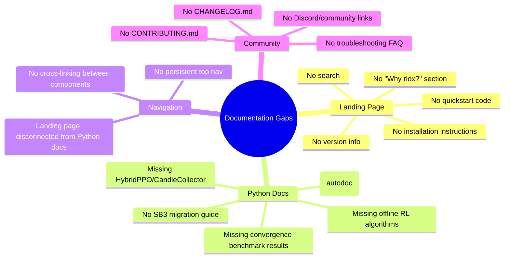
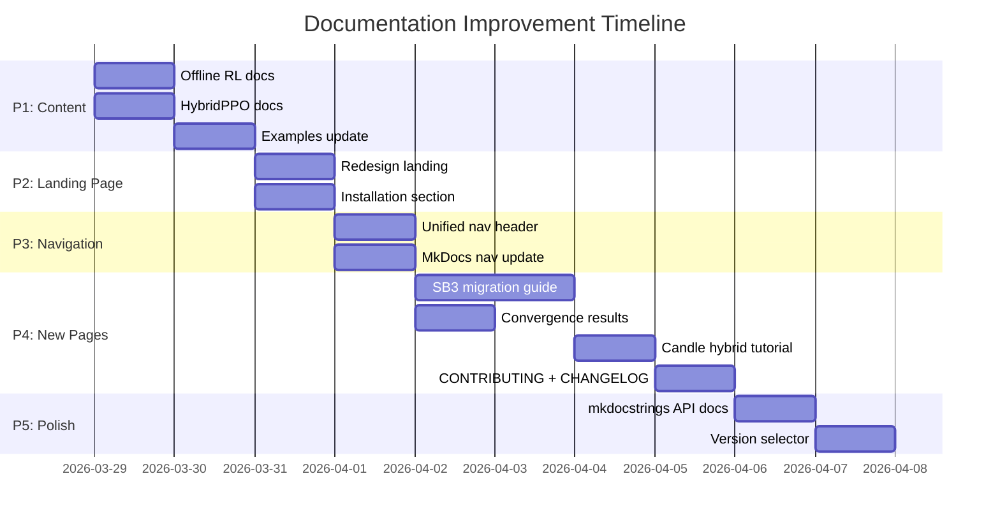

# GitHub Pages Documentation Improvement Plan

## Current State

The rlox documentation site (https://wojciechkpl.github.io/rlox/) has four components:

| Component | URL | Technology | Status |
|-----------|-----|-----------|--------|
| Landing page | `/` | Static HTML | Minimal — 4 cards, no quickstart |
| Python docs | `/python/` | MkDocs Material | Good structure, needs content updates |
| Rust API | `/rust/` | cargo doc | Auto-generated, complete |
| Architecture guide | `/book/` | mdbook | Exists |
| Blog | `/blog/` | Hugo | Exists |

## Issues Identified



---

## Priority 1: Update Content for New Features

### 1.1 Add Offline RL to Python Docs

**File:** `docs/python-guide.md`

Add section after "Off-Policy (SAC, TD3, DQN)":

```markdown
### Offline RL (TD3+BC, IQL, CQL, BC)

Offline RL algorithms train from static datasets without environment interaction.
All use the shared `OfflineDatasetBuffer` (Rust-accelerated) and `OfflineAlgorithm` base class.

```python
import rlox
from rlox.algorithms.td3_bc import TD3BC

# Load dataset (D4RL, Minari, or custom numpy arrays)
buf = rlox.OfflineDatasetBuffer(obs, next_obs, actions, rewards, terminated, truncated)
print(buf.stats())  # dataset statistics

algo = TD3BC(dataset=buf, obs_dim=17, act_dim=6, alpha=2.5)
metrics = algo.train(n_gradient_steps=100_000)
```

Available algorithms:
- **TD3+BC** — TD3 with behavioral cloning regularization (Fujimoto & Gu 2021)
- **IQL** — Implicit Q-Learning with expectile regression (Kostrikov et al. 2022)
- **CQL** — Conservative Q-Learning with OOD penalty (Kumar et al. 2020)
- **BC** — Behavioral Cloning (continuous + discrete)
```

### 1.2 Add HybridPPO / CandleCollector

**File:** `docs/python-guide.md`

Add section "Candle Hybrid Collection":

```markdown
### Candle Hybrid Collection (Zero-Python Overhead)

The `CandleCollector` runs policy inference entirely in Rust using Candle,
achieving 180K+ SPS on CartPole with zero Python dispatch overhead.

```python
import rlox
from rlox.algorithms.hybrid_ppo import HybridPPO

# HybridPPO: Candle collection + PyTorch training
ppo = HybridPPO(env_id="CartPole-v1", n_envs=16, hidden=64)
metrics = ppo.train(total_timesteps=100_000)
print(ppo.timing_summary())  # collection vs training breakdown
```
```

### 1.3 Add Examples Page Entries

**File:** `docs/examples.md`

Add offline RL examples and HybridPPO example.

### 1.4 Update Algorithm List on Index

**File:** `docs/index.md`

Add offline RL and HybridPPO to the algorithm list.

---

## Priority 2: Landing Page Overhaul

### 2.1 Redesign Landing Page

**File:** `docs-landing/index.html`

Current landing page is 4 cards with no code. Replace with:

```html
<!-- Hero section -->
<h1>rlox</h1>
<p>Rust-accelerated reinforcement learning. 3-50x faster than SB3.</p>

<!-- Quickstart -->
<pre><code>
pip install rlox
python -m rlox train PPO CartPole-v1 --timesteps 50000
</code></pre>

<!-- Key metrics -->
<div class="metrics">
  <div>180K SPS</div>     <!-- Candle collection -->
  <div>147x GAE</div>     <!-- vs NumPy -->
  <div>14 algorithms</div>
</div>

<!-- Cards -->
<div class="cards">
  <a href="./python/">Python Guide</a>
  <a href="./python/getting-started/">Getting Started</a>
  <a href="./python/examples/">Examples</a>
  <a href="./rust/rlox_core/">Rust API</a>
</div>
```

### 2.2 Add Installation Section

```markdown
## Installation

```bash
pip install rlox

# With MuJoCo support
pip install rlox[mujoco]

# Development
git clone https://github.com/wojciechkpl/rlox.git
cd rlox && pip install -e ".[dev]"
```
```

### 2.3 Add "Why rlox?" Section

```markdown
## Why rlox?

| vs SB3 | vs CleanRL | vs RLlib | vs TRL |
|--------|-----------|----------|--------|
| 3-50x faster buffers | Same simplicity, faster | Single-machine focus | Rust primitives for GRPO/DPO |
| Rust VecEnv | Rust VecEnv | No Ray overhead | 14x faster advantages |
| Same algorithm API | More algorithms | Lightweight | Complementary (trl_compat) |
```

---

## Priority 3: Cross-Component Navigation

### 3.1 Unified Top Navigation

Add a shared header across all 4 components:

```html
<nav>
  <a href="/">Home</a>
  <a href="/python/">Python</a>
  <a href="/rust/rlox_core/">Rust</a>
  <a href="/book/">Guide</a>
  <a href="/blog/">Blog</a>
  <a href="https://github.com/wojciechkpl/rlox">GitHub</a>
</nav>
```

### 3.2 MkDocs Nav Update

**File:** `mkdocs.yml`

Add missing sections:

```yaml
nav:
  - Home: index.md
  - Learn:
      - Getting Started: getting-started.md
      - RL Introduction: rl-introduction.md
      - Python User Guide: python-guide.md
      - Examples: examples.md
  - Algorithms:
      - Offline RL: offline-rl.md        # NEW
      - LLM Post-Training: llm-post-training.md
      - Math Reference: math-reference.md
  - Tutorials:
      - Custom Components: tutorials/custom-components.md
      - Custom Rewards: tutorials/custom-rewards-and-training-loops.md
      - Candle Hybrid: tutorials/candle-hybrid.md  # NEW
  - Performance:
      - Candle vs PyTorch: benchmarks/candle-comparison.md  # NEW
      - Convergence Results: benchmarks/convergence-results.md  # NEW
      - Component Benchmarks: benchmark/README.md
  - Migration:
      - From SB3: migration/sb3.md  # NEW
  - Architecture: ...
  - Research: ...
```

---

## Priority 4: Missing Documentation

### 4.1 SB3 Migration Guide

**File:** `docs/migration/sb3.md`

Side-by-side comparison showing how to convert SB3 code to rlox.

### 4.2 Convergence Results

**File:** `docs/benchmarks/convergence-results.md`

Publish results from GCP benchmark v5 (currently running 22/32).

### 4.3 Offline RL Guide

**File:** `docs/offline-rl.md`

Dedicated page for offline RL concepts + all 4 algorithms.

### 4.4 Candle Hybrid Tutorial

**File:** `docs/tutorials/candle-hybrid.md`

Step-by-step tutorial on using CandleCollector + HybridPPO.

### 4.5 CONTRIBUTING.md

Standard contribution guidelines with dev setup, testing, PR process.

### 4.6 CHANGELOG.md

Version history with notable changes.

---

## Priority 5: Professional Polish

### 5.1 API Reference with mkdocstrings

**File:** `mkdocs.yml`

```yaml
plugins:
  - mkdocstrings:
      handlers:
        python:
          paths: [python]
```

Auto-generate API docs from docstrings.

### 5.2 Search

Already available with MkDocs Material — just needs the search plugin enabled (usually default).

### 5.3 Version Selector

```yaml
extra:
  version:
    provider: mike
```

### 5.4 Social Cards

```yaml
plugins:
  - social  # Auto-generates OG images for social sharing
```

---

## Implementation Timeline



## Quick Wins (Can Do Now)

1. Update `docs/index.md` algorithm list with offline RL + HybridPPO
2. Update `docs/examples.md` with offline RL examples
3. Update `docs/python-guide.md` with offline RL and CandleCollector sections
4. Update `mkdocs.yml` nav to include new sections
5. Add `CONTRIBUTING.md` skeleton
