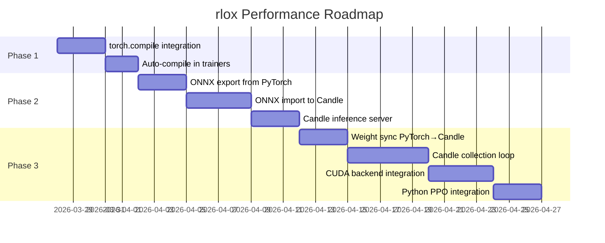
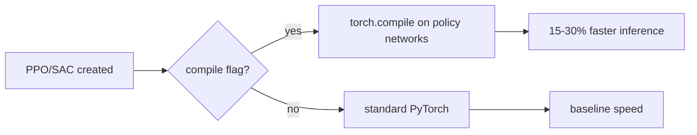
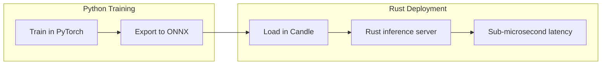
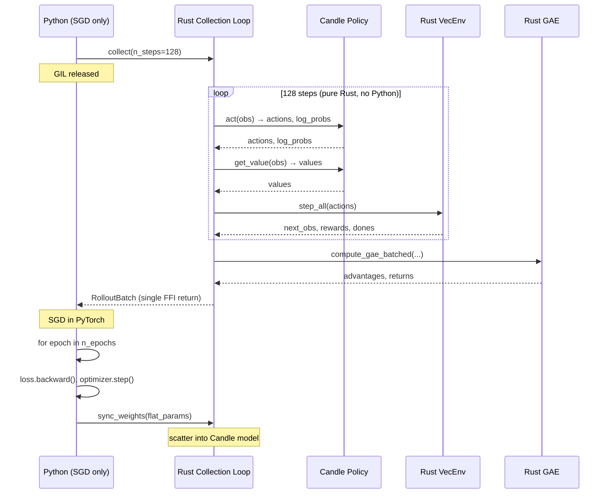
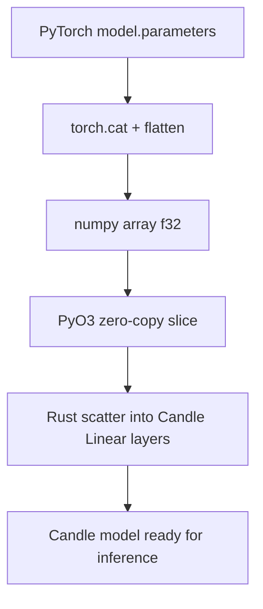
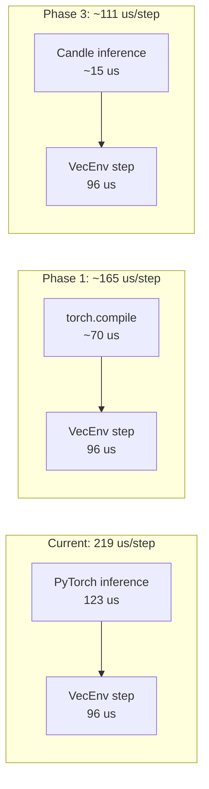
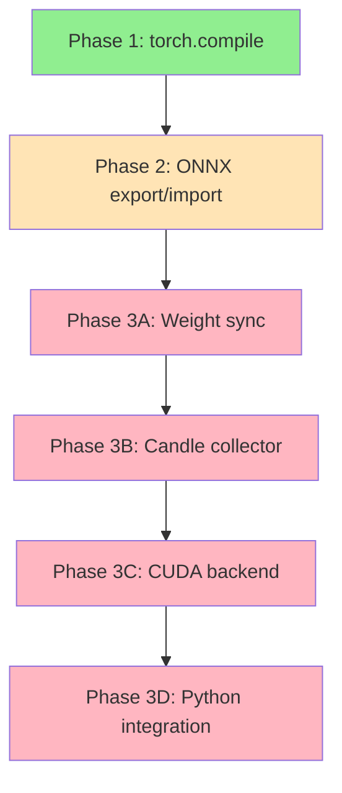

# Hybrid Rust Collection + Candle Inference Architecture

## Motivation

Profiling reveals PyTorch dispatch overhead dominates PPO training time:

| Component | Latency | Share |
|-----------|---------|-------|
| Policy inference (PyTorch) | 123us/call | 56% of step |
| Actual compute | ~10us | — |
| Env step (Rust VecEnv) | 96us/call | 44% of step |

The root cause: each policy forward call crosses Python→PyTorch→Python boundaries with ~113us of dispatch overhead atop ~10us of actual BLAS work.

**Solution**: Three-phase approach to eliminate Python overhead progressively.

---

## Three-Phase Roadmap



---

## Phase 1: torch.compile (Immediate, 15-30% speedup)

**Status**: `compile_policy()` already exists. Needs auto-application in trainers.



### Changes needed:

1. **Auto-compile in algorithm constructors** — add `compile: bool = False` parameter:
   ```python
   class PPO:
       def __init__(self, ..., compile: bool = False):
           ...
           if compile:
               from rlox.compile import compile_policy
               compile_policy(self)
   ```

2. **Fix compile targets** — already done: compiles `get_action_and_logprob`, `get_value`, `get_logprob_and_entropy` individually for on-policy policies.

3. **Benchmark** — measure SPS before/after on CartPole, HalfCheetah.

**Files**: `python/rlox/algorithms/ppo.py`, `sac.py`, `td3.py`, `dqn.py`
**Effort**: 1 day
**Impact**: 15-30% wall-time reduction

---

## Phase 2: ONNX Export → Candle Import (Deployment)

Enable PyTorch-trained models to be deployed via Candle for inference without Python.



### 2.1 ONNX Export from PyTorch

**File**: New `python/rlox/export.py`

```python
def export_policy_onnx(algo, path: str, obs_dim: int):
    """Export a trained policy to ONNX format."""
    import torch
    dummy_input = torch.randn(1, obs_dim)

    if hasattr(algo, 'actor'):  # SAC/TD3
        torch.onnx.export(algo.actor, dummy_input, path,
                          input_names=['obs'], output_names=['action'])
    elif hasattr(algo, 'policy'):  # PPO/A2C
        torch.onnx.export(algo.policy.actor, dummy_input, path,
                          input_names=['obs'], output_names=['logits'])
    elif hasattr(algo, 'q_network'):  # DQN
        torch.onnx.export(algo.q_network, dummy_input, path,
                          input_names=['obs'], output_names=['q_values'])
```

### 2.2 Candle ONNX Import

**File**: `crates/rlox-candle/src/onnx.rs`

Candle has built-in ONNX support via `candle-onnx`:

```rust
use candle_core::{Device, Tensor};
use candle_onnx::onnx;

pub struct OnnxPolicy {
    model: onnx::ONNXModel,
    device: Device,
}

impl OnnxPolicy {
    pub fn load(path: &str, device: Device) -> Result<Self, candle_core::Error> {
        let model = onnx::read_file(path)?;
        Ok(Self { model, device })
    }

    pub fn forward(&self, obs: &Tensor) -> Result<Tensor, candle_core::Error> {
        let inputs = std::collections::HashMap::from([
            ("obs".to_string(), obs.clone())
        ]);
        self.model.forward(&inputs)
    }
}
```

### 2.3 Candle Inference Server

**File**: New `crates/rlox-candle/src/server.rs`

Pure-Rust inference endpoint:
```rust
pub struct CandleInferenceServer {
    policy: OnnxPolicy,
}

impl CandleInferenceServer {
    pub fn predict(&self, obs: &[f32]) -> Vec<f32> {
        let tensor = Tensor::from_slice(obs, &[1, obs.len()], &self.policy.device)?;
        let output = self.policy.forward(&tensor)?;
        output.to_vec1()?
    }
}
```

**Effort**: 5-7 days
**Impact**: PyTorch-free inference deployment, sub-microsecond policy latency

---

## Phase 3: Hybrid Collection Loop (Long-term, 2x PPO speedup)

Move the entire PPO collection loop into Rust with Candle inference.



### 3.1 Weight Synchronization (PyTorch → Candle)

**Strategy**: Flat `f32` buffer transfer. PyTorch concatenates all parameters into one contiguous array; Rust scatters them into Candle's `Linear` layers.



**Python side**:
```python
def get_flat_params(model):
    return torch.cat([p.data.view(-1) for p in model.parameters()]).numpy()

# After each SGD phase:
rust_collector.sync_weights(get_flat_params(policy))
```

**Rust side** (`crates/rlox-candle/src/sync.rs`):
```rust
pub fn scatter_weights(model: &mut CandleActorCritic, flat: &[f32]) {
    let mut offset = 0;
    for (name, tensor) in model.named_parameters() {
        let numel = tensor.elem_count();
        let slice = &flat[offset..offset + numel];
        let shape = tensor.shape().clone();
        *tensor = Tensor::from_slice(slice, shape, &Device::Cpu).unwrap();
        offset += numel;
    }
    debug_assert_eq!(offset, flat.len(), "weight size mismatch");
}
```

**Cost**: ~52KB memcpy for 64-hidden MLP, negligible vs rollout time.

### 3.2 Candle Collection Loop

**File**: New `crates/rlox-candle/src/collector.rs`

```rust
pub struct CandleCollector {
    policy: CandleActorCritic,
    envs: Box<dyn BatchSteppable>,
    obs_normalizer: Option<RunningMeanStd>,
}

impl CandleCollector {
    pub fn collect(&mut self, n_steps: usize, gamma: f64, gae_lambda: f64) -> RolloutBatch {
        let n_envs = self.envs.num_envs();
        // Pre-allocate everything
        let mut all_obs = Vec::with_capacity(n_steps * n_envs * obs_dim);
        let mut all_actions = Vec::with_capacity(n_steps * n_envs);
        let mut all_log_probs = Vec::with_capacity(n_steps * n_envs);
        // ...

        for _step in 0..n_steps {
            // Candle inference (no Python, no GIL)
            let obs_tensor = Tensor::from_slice(&current_obs, &[n_envs, obs_dim], &Device::Cpu)?;
            let (actions, log_probs) = self.policy.act(&obs_tensor)?;
            let values = self.policy.get_value(&obs_tensor)?;

            // Env step (Rust VecEnv)
            let transition = self.envs.step_batch(&action_vec)?;

            // Store data
            all_obs.extend_from_slice(&current_obs);
            // ...
        }

        // GAE in Rust
        let (advantages, returns) = compute_gae_batched(...);

        RolloutBatch { obs: all_obs, actions: all_actions, ... }
    }
}
```

### 3.3 CUDA Backend

Candle supports CUDA natively. The same collection loop works on GPU:

```rust
let device = Device::new_cuda(0)?;  // or Device::Cpu
let policy = CandleActorCritic::new(obs_dim, act_dim, hidden, &device)?;
```

For GPU collection:
- Observations stay on GPU (no CPU→GPU transfer per step)
- Policy inference on GPU (batched CUDA kernels)
- Only the final RolloutBatch transfers to CPU for PyTorch SGD

### 3.4 PyO3 Integration

**File**: `crates/rlox-python/src/candle_collector.rs`

```rust
#[pyclass]
pub struct PyCandleCollector {
    inner: CandleCollector,
}

#[pymethods]
impl PyCandleCollector {
    #[new]
    fn new(env_id: &str, n_envs: usize, obs_dim: usize, act_dim: usize,
           hidden: usize, device: &str) -> PyResult<Self> { ... }

    fn collect<'py>(&mut self, py: Python<'py>, n_steps: usize,
                     gamma: f64, gae_lambda: f64) -> PyResult<Bound<'py, PyDict>> {
        // Release GIL during collection
        let batch = py.allow_threads(|| {
            self.inner.collect(n_steps, gamma, gae_lambda)
        })?;
        // Convert to Python dict
        ...
    }

    fn sync_weights(&mut self, flat_params: PyReadonlyArray1<f32>) -> PyResult<()> {
        scatter_weights(&mut self.inner.policy, flat_params.as_slice()?);
        Ok(())
    }
}
```

### 3.5 Python PPO Integration

```python
from rlox import CandleCollector

collector = CandleCollector(
    env_id="CartPole-v1", n_envs=8,
    obs_dim=4, act_dim=2, hidden=64,
    device="cpu",  # or "cuda:0"
)

# Initial weight sync
collector.sync_weights(get_flat_params(policy))

for update in range(n_updates):
    # One FFI call — entire collection in Rust+Candle
    batch = collector.collect(n_steps=128, gamma=0.99, gae_lambda=0.95)

    # SGD in PyTorch (unchanged)
    for epoch in range(n_epochs):
        for mb in batch.sample_minibatches(batch_size):
            loss = ppo_loss(policy, mb)
            loss.backward()
            optimizer.step()

    # Sync updated weights back to Candle
    collector.sync_weights(get_flat_params(policy))
```

---

## Performance Estimates



| Phase | Inference | Step | Total | PPO Speedup |
|-------|-----------|------|-------|-------------|
| Current | 123 us (PyTorch) | 96 us | 219 us/step | 1.0x |
| Phase 1 (torch.compile) | ~70 us | 96 us | ~166 us/step | **1.3x** |
| Phase 3 (Candle CPU) | ~15 us | 96 us | ~111 us/step | **2.0x** |
| Phase 3 (Candle CUDA) | ~5 us | 96 us | ~101 us/step | **2.2x** |

---

## Dependencies



## Cargo Dependencies

```toml
# crates/rlox-candle/Cargo.toml
[dependencies]
candle-core = "0.8"
candle-nn = "0.8"
candle-onnx = "0.8"      # Phase 2
candle-transformers = "0.8"  # Optional, for LLM inference

[features]
default = ["cpu"]
cpu = []
cuda = ["candle-core/cuda"]
collector = []  # Phase 3: collection loop
onnx = ["candle-onnx"]  # Phase 2: ONNX import
```

---

## Files to Create/Modify

| Phase | File | Action |
|-------|------|--------|
| 1 | `python/rlox/algorithms/*.py` | Add `compile` param |
| 2 | `python/rlox/export.py` | New: ONNX export |
| 2 | `crates/rlox-candle/src/onnx.rs` | New: ONNX import |
| 2 | `crates/rlox-candle/src/server.rs` | New: inference server |
| 3 | `crates/rlox-candle/src/sync.rs` | New: weight sync |
| 3 | `crates/rlox-candle/src/collector.rs` | New: collection loop |
| 3 | `crates/rlox-python/src/candle_collector.rs` | New: PyO3 binding |
| 3 | `python/rlox/hybrid_ppo.py` | New: hybrid PPO trainer |

## Timeline

| Phase | Duration | Prerequisite |
|-------|----------|--------------|
| Phase 1 | 1-2 days | None |
| Phase 2 | 5-7 days | Phase 1 |
| Phase 3 | 10-15 days | Phase 2 |
| **Total** | **16-24 days** | |
