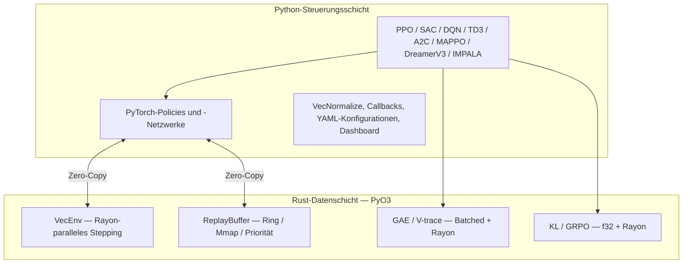

<p align="center">
  
</p>

# rlox — Rust-beschleunigtes Reinforcement Learning

<p align="center">
  <strong>Das Polars-Architekturmuster auf RL angewendet: Datenschicht in Rust + Steuerungsschicht in Python.</strong>
</p>

---

## Warum rlox?

RL-Frameworks wie Stable-Baselines3 und TorchRL erledigen alles in Python. Das funktioniert, aber der Overhead des Python-Interpreters wird zum Flaschenhals, lange bevor es die GPU ist.

rlox verlagert rechenintensive, latenzempfindliche Arbeit (Umgebungsschritte, Buffer, GAE) nach **Rust**, während Trainingslogik, Konfigurationen und neuronale Netze in **Python über PyTorch** bleiben.

**Ergebnis: 3–50× schneller** als SB3/TorchRL bei Datenschicht-Operationen, mit derselben Python-API, die Sie gewohnt sind.

## Schnellstart

```bash
pip install rlox
```

```python
from rlox import Trainer

trainer = Trainer("ppo", env="CartPole-v1", seed=42)
metrics = trainer.train(total_timesteps=50_000)
print(f"Durchschnittliche Belohnung: {metrics['mean_reward']:.1f}")
```

Oder von der Kommandozeile:

```bash
python -m rlox train --algo ppo --env CartPole-v1 --timesteps 100000
```

## Architektur



## Was in der Dokumentation zu finden ist

| Anleitung | Für wen | Was Sie lernen |
|-------|-------------|-------------------|
| [RL-Einführung](rl-introduction.md) | RL-Neulinge | Schlüsselkonzepte mit rlox-Codebeispielen |
| [Erste Schritte](getting-started.md) | rlox-Neulinge | Installation, erster Trainingslauf, Grund-API |
| [Python-Leitfaden](python-guide.md) | Alle Nutzer | Vollständige API-Referenz mit Beispielen |
| [Beispiele](examples.md) | Alle Nutzer | Copy-paste-Code für jeden Algorithmus |
| [Eigene Komponenten](tutorials/custom-components.md) | Fortgeschrittene | Eigene Netze, Collectors, Exploration, Verlustfunktionen |
| [Migration von SB3](tutorials/migration-sb3.md) | SB3-Nutzer | Side-by-side API-Vergleich |
| [LLM-Post-Training](llm-post-training.md) | LLM-Praktiker | DPO, GRPO, OnlineDPO, BestOfN |
| [API-Referenz](api/index.md) | Alle Nutzer | Automatisch aus Docstrings generiert |
| [Benchmarks](benchmark/README.md) | Forscher | Leistungsvergleich mit SB3/TRL |
| [Mathematische Referenz](math-reference.md) | Forscher | Herleitungen von GAE, V-trace, GRPO, DPO |
| [Rust-Leitfaden](rust-guide.md) | Beitragende | Crate-Architektur, Erweiterung in Rust |

## Benchmark-Highlights

| Komponente | vs SB3 | vs TorchRL / NumPy |
|-----------|--------|--------------------|
| GAE (32K Schritte) | 135× vs NumPy | **1.588×** vs TorchRL |
| Buffer-Sample (batch=1024) | **9,7×** | **6,5×** vs TorchRL |
| Buffer-Push (10K, CartPole) | **4,6×** | **60,8×** vs TorchRL |
| End-to-End-Rollout (256×2048) | **3,1×** | **40,4×** vs TorchRL |
| GRPO-Advantages | **41×** vs NumPy | **35×** vs PyTorch |
| KL-Divergenz (f32) | **2--9×** vs TRL | -- |

## Algorithmen

- **On-Policy**: PPO, A2C, IMPALA, MAPPO — Multi-Env via `RolloutCollector`
- **Off-Policy**: SAC, TD3, DQN (Double, Dueling, PER, N-step) — Multi-Env via `OffPolicyCollector`
- **Offline-RL**: TD3+BC, IQL, CQL, BC — Rust-beschleunigter `OfflineDatasetBuffer`
- **Modellbasiert**: DreamerV3
- **LLM-Post-Training**: GRPO, DPO, OnlineDPO, BestOfN
- **Hybrid**: HybridPPO — Candle-Inferenz + PyTorch-Training (180.000 SPS)

Alle Algorithmen unterstützen eigene Netzwerke, Explorationsstrategien und Collectors über [protokollbasierte Injection](tutorials/custom-components.md). Siehe den [SB3-Migrationsleitfaden](tutorials/migration-sb3.md) für den Wechsel von Stable-Baselines3.

---

> **🌐 Übersetzung**: Diese Seite ist Teil der experimentellen Mehrsprachenunterstützung von rlox.
> Übersetzte Seiten decken nur die am häufigsten besuchten Inhalte ab; die übrigen Seiten
> werden auf Englisch angezeigt. Möchten Sie mithelfen? Siehe den [Übersetzungsleitfaden](CONTRIBUTING-translations.md).
