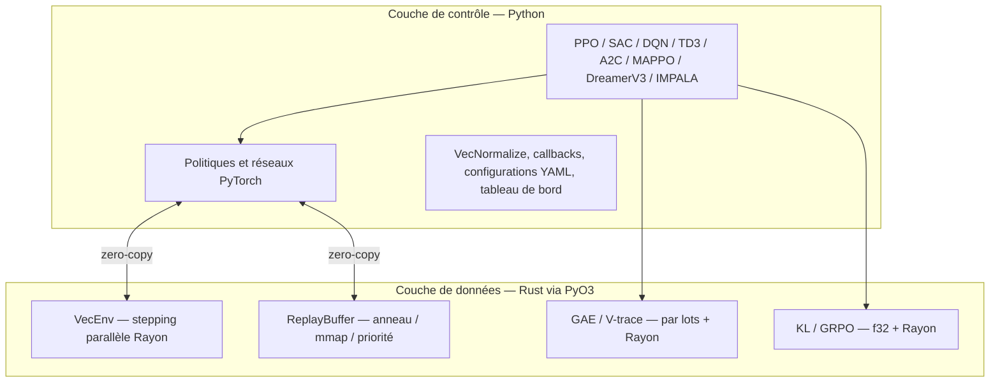

<p align="center">
  
</p>

# rlox — Apprentissage par renforcement accéléré par Rust

<p align="center">
  <strong>Le modèle d'architecture Polars appliqué au RL : couche de données en Rust + couche de contrôle en Python.</strong>
</p>

---

## Pourquoi rlox ?

Les frameworks RL comme Stable-Baselines3 et TorchRL font tout en Python. Cela fonctionne, mais le surcoût de l'interpréteur Python devient le goulot d'étranglement bien avant le GPU.

rlox déplace le travail coûteux et sensible à la latence (pas d'environnement, buffers, GAE) vers **Rust**, tout en conservant la logique d'entraînement, les configurations et les réseaux de neurones en **Python via PyTorch**.

**Résultat : 3 à 50× plus rapide** que SB3/TorchRL sur les opérations de la couche de données, avec la même API Python à laquelle vous êtes habitué·e.

## Démarrage rapide

```bash
pip install rlox
```

```python
from rlox import Trainer

trainer = Trainer("ppo", env="CartPole-v1", seed=42)
metrics = trainer.train(total_timesteps=50_000)
print(f"Récompense moyenne : {metrics['mean_reward']:.1f}")
```

Ou depuis la ligne de commande :

```bash
python -m rlox train --algo ppo --env CartPole-v1 --timesteps 100000
```

## Architecture



## Ce que contient la documentation

| Guide | Pour qui | Ce que vous apprendrez |
|-------|-------------|-------------------|
| [Introduction au RL](rl-introduction.md) | Débutant·es en RL | Concepts clés avec des exemples de code rlox |
| [Premiers pas](getting-started.md) | Débutant·es en rlox | Installation, premier entraînement, API de base |
| [Guide Python](python-guide.md) | Tous les utilisateurs | Référence complète de l'API avec exemples |
| [Exemples](examples.md) | Tous les utilisateurs | Code copier-coller pour chaque algorithme |
| [Composants personnalisés](tutorials/custom-components.md) | Intermédiaires | Réseaux, collecteurs, exploration, fonctions de perte personnalisés |
| [Migration depuis SB3](tutorials/migration-sb3.md) | Utilisateurs de SB3 | Comparaison d'API côte à côte |
| [Post-training LLM](llm-post-training.md) | Praticien·nes LLM | DPO, GRPO, OnlineDPO, BestOfN |
| [Référence API](api/index.md) | Tous les utilisateurs | Générée automatiquement à partir des docstrings |
| [Benchmarks](benchmark/README.md) | Chercheur·euses | Comparaison de performance avec SB3/TRL |
| [Référence mathématique](math-reference.md) | Chercheur·euses | Dérivations GAE, V-trace, GRPO, DPO |
| [Guide Rust](rust-guide.md) | Contributeurs | Architecture des crates, extension en Rust |

## Points forts des benchmarks

| Composant | vs SB3 | vs TorchRL / NumPy |
|-----------|--------|--------------------|
| GAE (32K pas) | 135× vs NumPy | **1 588×** vs TorchRL |
| Sample buffer (batch=1024) | **9,7×** | **6,5×** vs TorchRL |
| Push buffer (10K, CartPole) | **4,6×** | **60,8×** vs TorchRL |
| Rollout de bout en bout (256×2048) | **3,1×** | **40,4×** vs TorchRL |
| Advantages GRPO | **41×** vs NumPy | **35×** vs PyTorch |
| Divergence KL (f32) | **2--9×** vs TRL | -- |

## Algorithmes

- **On-policy** : PPO, A2C, IMPALA, MAPPO — multi-env via `RolloutCollector`
- **Off-policy** : SAC, TD3, DQN (Double, Dueling, PER, N-step) — multi-env via `OffPolicyCollector`
- **RL hors-ligne** : TD3+BC, IQL, CQL, BC — `OfflineDatasetBuffer` accéléré par Rust
- **Basé sur modèle** : DreamerV3
- **Post-training LLM** : GRPO, DPO, OnlineDPO, BestOfN
- **Hybride** : HybridPPO — inférence Candle + entraînement PyTorch (180 000 SPS)

Tous les algorithmes supportent des réseaux, stratégies d'exploration et collecteurs personnalisés via [l'injection basée sur protocoles](tutorials/custom-components.md). Consultez le [guide de migration SB3](tutorials/migration-sb3.md) pour passer de Stable-Baselines3.

---

> **🌐 Traduction** : Cette page fait partie du support multilingue expérimental de rlox.
> Les pages traduites ne couvrent que les contenus les plus consultés ; les autres pages
> s'affichent en anglais. Envie d'aider ? Consultez le [guide pour les traducteur·rices](CONTRIBUTING-translations.md).
