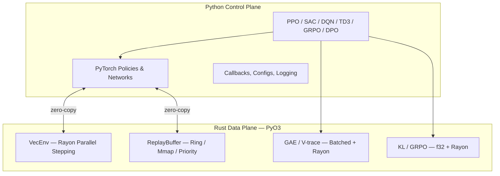

# rlox — Rust-Accelerated Reinforcement Learning

<p align="center">
  <strong>The Polars architecture pattern applied to RL: Rust data plane + Python control plane.</strong>
</p>

---

## Why rlox?

RL frameworks like Stable-Baselines3 and TorchRL do everything in Python. This works, but Python interpreter overhead becomes the bottleneck long before your GPU does.

rlox moves the compute-heavy, latency-sensitive work (environment stepping, buffers, GAE) to **Rust** while keeping training logic, configs, and neural networks in **Python via PyTorch**.

**Result: 3-50x faster** than SB3/TorchRL on data-plane operations, with the same Python API you're used to.

## Quick Start

```bash
pip install rlox
```

```python
from rlox.trainers import PPOTrainer

trainer = PPOTrainer(env="CartPole-v1", seed=42)
metrics = trainer.train(total_timesteps=50_000)
print(f"Mean reward: {metrics['mean_reward']:.1f}")
```

Or from the command line:

```bash
python -m rlox train --algo ppo --env CartPole-v1 --timesteps 100000
```

## Architecture



## What's in the Docs

| Guide | Who it's for | What you'll learn |
|-------|-------------|-------------------|
| [RL Introduction](rl-introduction.md) | New to RL | Key concepts with rlox code examples |
| [Getting Started](getting-started.md) | New to rlox | Install, first training run, basic API |
| [Python Guide](python-guide.md) | All users | Complete API reference with examples |
| [Examples](examples.md) | All users | Copy-paste code for every algorithm |
| [LLM Post-Training](llm-post-training.md) | LLM practitioners | DPO, GRPO, OnlineDPO, BestOfN |
| [Benchmarks](benchmark/README.md) | Researchers | Performance comparison vs SB3/TRL |
| [Math Reference](math-reference.md) | Researchers | GAE, V-trace, GRPO, DPO derivations |
| [Rust Guide](rust-guide.md) | Contributors | Crate architecture, extending in Rust |

## Benchmark Highlights

| Component | vs SB3 | vs TorchRL |
|-----------|--------|------------|
| GAE (32K steps) | 147x vs NumPy | **1,700x** |
| Buffer push (10K) | **9.7x** | **148x** |
| E2E rollout (256x2048) | **3.9x** | **53x** |
| GRPO advantages | **35x** vs NumPy | **34x** vs PyTorch |
| KL divergence (f32) | **2-9x** vs TRL | — |

## Algorithms

- **On-policy**: PPO, A2C, IMPALA, MAPPO
- **Off-policy**: SAC, TD3, DQN (Double, Dueling, PER, N-step)
- **Model-based**: DreamerV3
- **LLM post-training**: GRPO, DPO, OnlineDPO, BestOfN
