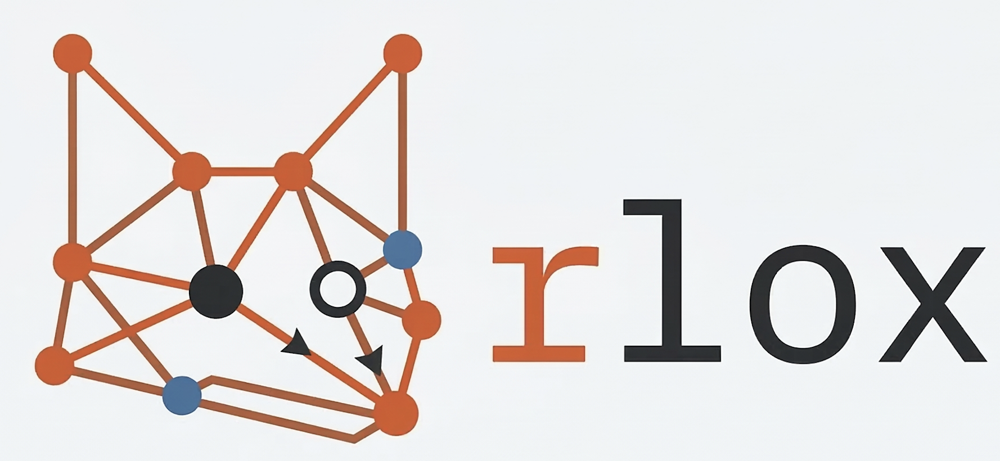
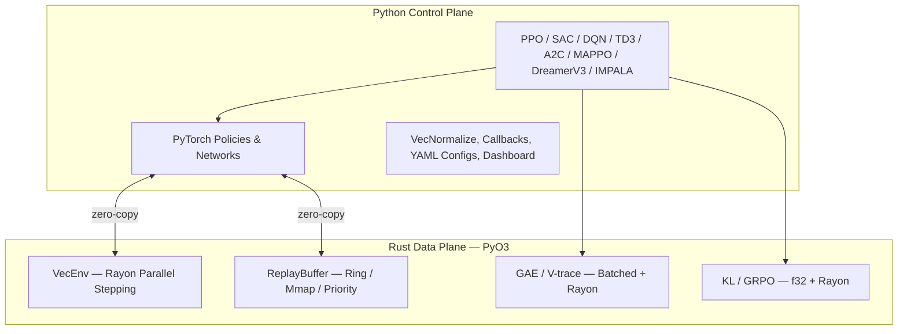

<p align="center">
  
</p>

# rlox — Rust-Accelerated Reinforcement Learning

<p align="center">
  <strong>The Polars architecture pattern applied to RL: Rust data plane + Python control plane.</strong>
</p>

---

## Why rlox?

RL frameworks like Stable-Baselines3 and TorchRL do everything in Python. This works, but Python interpreter overhead becomes the bottleneck long before your GPU does.

rlox moves the compute-heavy, latency-sensitive work (environment stepping, buffers, GAE) to **Rust** while keeping training logic, configs, and neural networks in **Python via PyTorch**.

**Result: 3-50x faster** than SB3/TorchRL on data-plane operations, with the same Python API you're used to.

## Quick Start

```bash
pip install rlox
```

```python
from rlox import Trainer

trainer = Trainer("ppo", env="CartPole-v1", seed=42)
metrics = trainer.train(total_timesteps=50_000)
print(f"Mean reward: {metrics['mean_reward']:.1f}")
```

Or from the command line:

```bash
python -m rlox train --algo ppo --env CartPole-v1 --timesteps 100000
```

## Architecture



## What's in the Docs

| Guide | Who it's for | What you'll learn |
|-------|-------------|-------------------|
| [RL Introduction](rl-introduction.md) | New to RL | Key concepts with rlox code examples |
| [Getting Started](getting-started.md) | New to rlox | Install, first training run, basic API |
| [Python Guide](python-guide.md) | All users | Complete API reference with examples |
| [Examples](examples.md) | All users | Copy-paste code for every algorithm |
| [Custom Components](tutorials/custom-components.md) | Intermediate | Custom networks, collectors, exploration, losses |
| [Migrating from SB3](tutorials/migration-sb3.md) | SB3 users | Side-by-side API comparison |
| [LLM Post-Training](llm-post-training.md) | LLM practitioners | DPO, GRPO, OnlineDPO, BestOfN |
| [API Reference](api/index.md) | All users | Auto-generated from docstrings |
| [Benchmarks](benchmark/README.md) | Researchers | Performance comparison vs SB3/TRL |
| [Math Reference](math-reference.md) | Researchers | GAE, V-trace, GRPO, DPO derivations |
| [Rust Guide](rust-guide.md) | Contributors | Crate architecture, extending in Rust |

## Benchmark Highlights

> Last refreshed: 2026-04-08. Apple M4, macOS 26.2, Python 3.12.7, PyTorch 2.10.0.

| Component | vs SB3 | vs TorchRL / NumPy |
|-----------|--------|--------------------|
| GAE (32K steps) | 135x vs NumPy | **1,588x** vs TorchRL |
| Buffer sample (batch=1024) | **9.7x** | **6.5x** vs TorchRL |
| Buffer push (10K, CartPole) | **4.6x** | **60.8x** vs TorchRL |
| E2E rollout (256x2048) | **3.1x** | **40.4x** vs TorchRL |
| GRPO advantages | **41x** vs NumPy | **35x** vs PyTorch |
| KL divergence (f32) | **2-9x** vs TRL | -- |

## Algorithms

- **On-policy**: PPO, A2C, IMPALA, MAPPO — multi-env via `RolloutCollector`
- **Off-policy**: SAC, TD3, DQN (Double, Dueling, PER, N-step) — multi-env via `OffPolicyCollector`
- **Offline RL**: TD3+BC, IQL, CQL, BC — Rust-accelerated `OfflineDatasetBuffer`
- **Model-based**: DreamerV3
- **LLM post-training**: GRPO, DPO, OnlineDPO, BestOfN
- **Hybrid**: HybridPPO — Candle inference + PyTorch training (180K SPS)

All algorithms support custom networks, exploration strategies, and collectors via [protocol-based injection](tutorials/custom-components.md). See the [SB3 migration guide](tutorials/migration-sb3.md) for switching from Stable-Baselines3.
