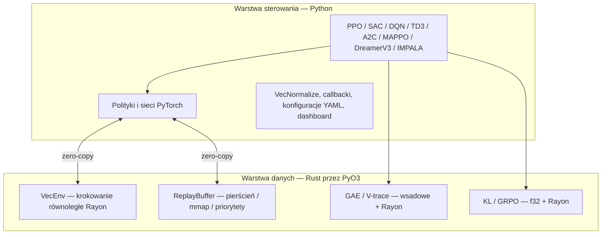

<p align="center">
  
</p>

# rlox — uczenie ze wzmocnieniem przyspieszane Rustem

<p align="center">
  <strong>Wzorzec architektoniczny Polars zastosowany do RL: warstwa danych w Ruście + warstwa sterowania w Pythonie.</strong>
</p>

---

## Dlaczego rlox?

Frameworki RL takie jak Stable-Baselines3 i TorchRL realizują wszystko w Pythonie. To działa, ale narzut interpretera Pythona staje się wąskim gardłem na długo przed GPU.

rlox przenosi obliczeniowo intensywne, czuło-czasowe zadania (krokowanie środowiska, bufory, GAE) do **Rusta**, podczas gdy logika trenowania, konfiguracje i sieci neuronowe pozostają w **Pythonie z PyTorch**.

**Rezultat: 3–50× szybciej** niż SB3/TorchRL na operacjach warstwy danych, z tym samym API Pythona, do którego jesteś przyzwyczajony.

## Szybki start

```bash
pip install rlox
```

```python
from rlox import Trainer

trainer = Trainer("ppo", env="CartPole-v1", seed=42)
metrics = trainer.train(total_timesteps=50_000)
print(f"Średnia nagroda: {metrics['mean_reward']:.1f}")
```

Albo z wiersza poleceń:

```bash
python -m rlox train --algo ppo --env CartPole-v1 --timesteps 100000
```

## Architektura



## Co znajdziesz w dokumentacji

| Przewodnik | Dla kogo | Czego się nauczysz |
|-------|-------------|-------------------|
| [Wprowadzenie do RL](rl-introduction.md) | Początkujący w RL | Kluczowe pojęcia z przykładami w rlox |
| [Pierwsze kroki](getting-started.md) | Początkujący w rlox | Instalacja, pierwszy trening, podstawowe API |
| [Przewodnik po Pythonie](python-guide.md) | Wszyscy | Pełna dokumentacja API z przykładami |
| [Przykłady](examples.md) | Wszyscy | Gotowe fragmenty kodu dla każdego algorytmu |
| [Komponenty niestandardowe](tutorials/custom-components.md) | Średnio zaawansowani | Własne sieci, kolektory, eksploracja, funkcje strat |
| [Migracja z SB3](tutorials/migration-sb3.md) | Użytkownicy SB3 | Porównanie API obok siebie |
| [Post-training LLM](llm-post-training.md) | Praktycy LLM | DPO, GRPO, OnlineDPO, BestOfN |
| [Dokumentacja API](api/index.md) | Wszyscy | Generowana automatycznie z docstringów |
| [Benchmarki](benchmark/README.md) | Naukowcy | Porównanie wydajności z SB3/TRL |
| [Materiały matematyczne](math-reference.md) | Naukowcy | Wyprowadzenia GAE, V-trace, GRPO, DPO |
| [Przewodnik po Ruście](rust-guide.md) | Współtwórcy | Architektura crate'ów, rozszerzanie w Ruście |

## Najważniejsze wyniki benchmarków

| Komponent | vs SB3 | vs TorchRL / NumPy |
|-----------|--------|--------------------|
| GAE (32K kroków) | 135× vs NumPy | **1 588×** vs TorchRL |
| Próbkowanie z bufora (batch=1024) | **9,7×** | **6,5×** vs TorchRL |
| Wstawianie do bufora (10K, CartPole) | **4,6×** | **60,8×** vs TorchRL |
| Rollout end-to-end (256×2048) | **3,1×** | **40,4×** vs TorchRL |
| Wagi GRPO | **41×** vs NumPy | **35×** vs PyTorch |
| Dywergencja KL (f32) | **2--9×** vs TRL | -- |

## Algorytmy

- **On-policy**: PPO, A2C, IMPALA, MAPPO — wiele środowisk przez `RolloutCollector`
- **Off-policy**: SAC, TD3, DQN (Double, Dueling, PER, N-step) — wiele środowisk przez `OffPolicyCollector`
- **Offline RL**: TD3+BC, IQL, CQL, BC — przyspieszany Rustem `OfflineDatasetBuffer`
- **Model-based**: DreamerV3
- **Post-training LLM**: GRPO, DPO, OnlineDPO, BestOfN
- **Hybrydowy**: HybridPPO — inferencja w Candle + trenowanie w PyTorch (180 000 SPS)

Wszystkie algorytmy obsługują niestandardowe sieci, strategie eksploracji i kolektory poprzez [iniekcję opartą na protokołach](tutorials/custom-components.md). Zobacz [przewodnik migracji z SB3](tutorials/migration-sb3.md), jeśli przechodzisz ze Stable-Baselines3.

---

> **🌐 Tłumaczenie**: Ta strona jest częścią eksperymentalnego wsparcia wielojęzycznego rlox.
> Przetłumaczone strony pokrywają tylko najczęściej odwiedzane treści; pozostałe strony są
> wyświetlane w języku angielskim. Chcesz pomóc? Zobacz [przewodnik dla tłumaczy](CONTRIBUTING-translations.md).
