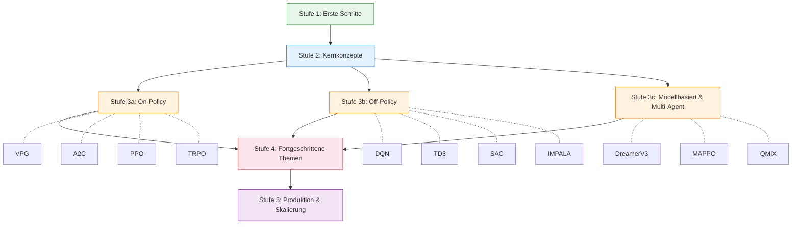

# Lernpfad

> **ℹ️ Gekürzte Übersetzung.** Diese Seite zeigt die Lernpfadkarte und Stufe 1.
> Der vollständige Pfad (Stufen 2–5: Kernkonzepte, On-Policy-/Off-Policy-Algorithmen,
> fortgeschrittene Themen, Produktion) ist nur in der [englischen Version](../learning-path.md) verfügbar.

Ihr Leitfaden zur Beherrschung von Reinforcement Learning mit rlox — von null bis zur Produktion.



---

## Stufe 1: Erste Schritte (30 Minuten)

**Ziel:** rlox installieren, ersten Agenten trainieren und Ergebnisse sehen.

### rlox installieren

```bash
pip install rlox
```

### Ersten Agenten trainieren

```python
from rlox import Trainer

trainer = Trainer("ppo", env="CartPole-v1", seed=42)
metrics = trainer.train(total_timesteps=100_000)
print(f"Finale Rückgabe: {metrics['mean_reward']:.1f}")
```

### Die Trainer-API verstehen

`Trainer` ist der einzige Einstiegspunkt für alle Algorithmen:

```python
# Mit Algorithmus-Name und Umgebung erstellen
trainer = Trainer("sac", env="Pendulum-v1")

# Für N Zeitschritte trainieren
metrics = trainer.train(total_timesteps=50_000)

# Checkpoints speichern / laden
trainer.save("my_model")
trainer = Trainer.from_checkpoint("my_model", algorithm="sac", env="Pendulum-v1")

# Aktionen vorhersagen
action = trainer.predict(obs, deterministic=True)
```

### Weiterlesen

- [Erste Schritte](getting-started.md) — gekürzte Einführung auf Deutsch
- [Vollständiger Lernpfad (en)](../learning-path.md) — Stufen 2–5
- [Beispiele](../examples.md) — gebrauchsfertige Code-Schnipsel
