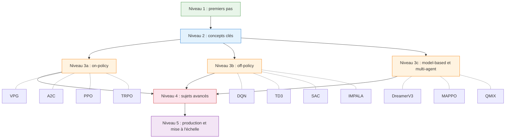

# Parcours d'apprentissage

> **ℹ️ Traduction abrégée.** Cette page présente la carte du parcours et le Niveau 1.
> Le parcours complet (Niveaux 2 à 5 : concepts clés, algorithmes on-policy/off-policy,
> sujets avancés, production) n'est disponible qu'en [version anglaise](../learning-path.md).

Votre guide pour maîtriser l'apprentissage par renforcement avec rlox — de zéro à la production.



---

## Niveau 1 : premiers pas (30 minutes)

**Objectif :** installer rlox, entraîner votre premier agent et voir les résultats.

### Installer rlox

```bash
pip install rlox
```

### Entraîner votre premier agent

```python
from rlox import Trainer

trainer = Trainer("ppo", env="CartPole-v1", seed=42)
metrics = trainer.train(total_timesteps=100_000)
print(f"Retour final : {metrics['mean_reward']:.1f}")
```

### Comprendre l'API Trainer

`Trainer` est le seul point d'entrée pour tous les algorithmes :

```python
# Créer avec un nom d'algorithme + un environnement
trainer = Trainer("sac", env="Pendulum-v1")

# Entraîner pour N pas de temps
metrics = trainer.train(total_timesteps=50_000)

# Sauvegarder / charger des checkpoints
trainer.save("my_model")
trainer = Trainer.from_checkpoint("my_model", algorithm="sac", env="Pendulum-v1")

# Prédire des actions
action = trainer.predict(obs, deterministic=True)
```

### Pour aller plus loin

- [Premiers pas](getting-started.md) — introduction abrégée en français
- [Parcours d'apprentissage complet (en)](../learning-path.md) — Niveaux 2 à 5
- [Exemples](../examples.md) — extraits de code prêts à l'emploi
