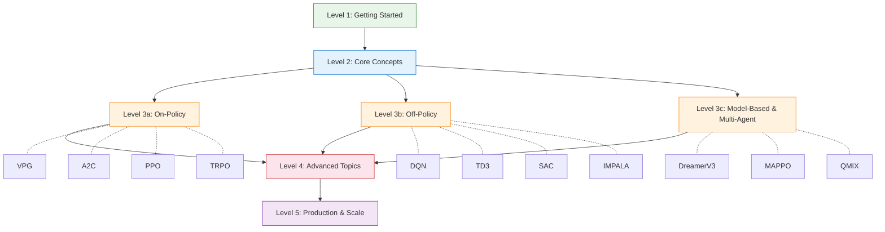
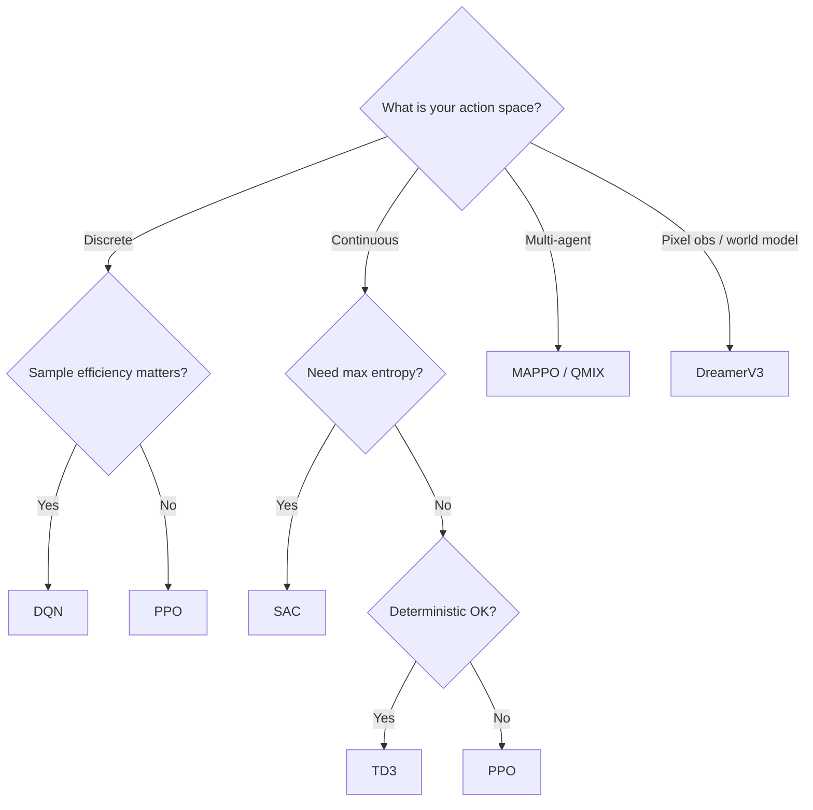

# Learning Path

Your guide to mastering reinforcement learning with rlox, from zero to production.



---

## Level 1: Getting Started (30 minutes)

**Goal:** Install rlox, train your first agent, and see results.

### Install rlox

```bash
pip install rlox
```

### Train your first agent

```python
from rlox import Trainer

trainer = Trainer("ppo", env="CartPole-v1", seed=42)
metrics = trainer.train(total_timesteps=100_000)
print(f"Final return: {metrics['mean_reward']:.1f}")
```

### Understand the Trainer API

The `Trainer` is the single entry point for all algorithms:

```python
# Create with algorithm name + environment
trainer = Trainer("sac", env="Pendulum-v1")

# Train for N timesteps
metrics = trainer.train(total_timesteps=50_000)

# Save / load checkpoints
trainer.save("my_model")
trainer = Trainer.from_checkpoint("my_model", algorithm="sac", env="Pendulum-v1")

# Predict actions
action = trainer.predict(obs, deterministic=True)
```

### Further reading

- [Getting Started guide](getting-started.md) -- full installation and first-run walkthrough
- [Python User Guide](python-guide.md) -- API tour and common patterns

---

## Level 2: Core Concepts (2-3 hours)

**Goal:** Understand the building blocks of RL and the rlox architecture.

### RL fundamentals (start here if new to RL)

Read [Introduction to Reinforcement Learning](rl-introduction.md) first to learn:

- The agent-environment loop
- States, observations, and actions
- Policies: stochastic vs deterministic
- Value functions: V(s), Q(s,a), and the advantage A(s,a)
- The RL optimization problem
- On-policy vs off-policy algorithms

!!! tip "New to RL?"
    If terms like "policy," "value function," or "advantage" are unfamiliar,
    read the RL Introduction before continuing. Everything below builds on it.

### Policy gradient fundamentals

Read [Policy Gradient Fundamentals](tutorials/policy-gradient-fundamentals.md) to understand:

- The REINFORCE algorithm and log-probability trick
- Baselines and variance reduction
- From VPG to modern policy gradients

### The Polars architecture

rlox uses a **Rust data plane + Python control plane**:

| Layer | Language | Responsibility |
|-------|----------|---------------|
| Data collection | Rust (via PyO3) | Rollout buffers, GAE, reward normalization |
| Training loop | Python | Gradient computation, optimizer steps |
| Configuration | Python | Dataclass configs with YAML/TOML serialization |

The Rust data plane provides 3-50x speedups over pure Python for buffer operations, GAE computation, and environment stepping.

### Observations, actions, rewards

| Concept | Discrete (CartPole) | Continuous (MuJoCo) |
|---------|---------------------|---------------------|
| Observation | `Box(4,)` float32 | `Box(N,)` float32 |
| Action | `Discrete(2)` | `Box(M,)` float32 |
| Reward | +1 per step | Task-specific |
| Algorithm | PPO, DQN, A2C | PPO, SAC, TD3 |

### Further reading

- [RL Introduction](rl-introduction.md) -- MDP formalism, Bellman equations, policy vs value methods
- [Math Reference](math-reference.md) -- notation and key derivations

---

## Level 3: Algorithms (1-2 days)

**Goal:** Know which algorithm to use and why.

### On-policy methods

Learn these in order -- each builds on the previous:

1. **[VPG](algorithms/vpg.md)** -- Vanilla Policy Gradient. The simplest policy gradient. High variance, but easy to understand.
2. **[A2C](algorithms/a2c.md)** -- Advantage Actor-Critic. Adds a learned baseline (value function) to reduce variance.
3. **[PPO](algorithms/ppo.md)** -- Proximal Policy Optimization. Clips the policy ratio for stable updates. The default choice for most tasks.
4. **[TRPO](algorithms/trpo.md)** -- Trust Region Policy Optimization. Constrains the KL divergence directly. More principled but slower than PPO.

### Off-policy methods

These reuse past experience via replay buffers:

1. **[DQN](algorithms/dqn.md)** -- Deep Q-Network. Value-based, discrete actions only. Includes Double DQN, Dueling, PER, N-step extensions.
2. **[TD3](algorithms/td3.md)** -- Twin Delayed DDPG. Deterministic policy for continuous control with twin critics and delayed updates.
3. **[SAC](algorithms/sac.md)** -- Soft Actor-Critic. Maximum entropy framework for continuous control. The default off-policy choice.

### Distributed methods

4. **[IMPALA](algorithms/impala.md)** -- Distributed actor-learner architecture with V-trace off-policy correction. For large-scale training.

### Model-based and multi-agent

- **[DreamerV3](algorithms/dreamer.md)** -- Learns a world model (RSSM) and trains a policy entirely in imagination.
- **[MAPPO](algorithms/mappo.md)** -- Multi-Agent PPO with centralized training and decentralized execution (CTDE).

### Algorithm selection flowchart



### Further reading

- [Algorithm taxonomy](algorithms/index.md) -- classification diagram and comparison table
- [Research notes](research/README.md) -- deep dives into each algorithm's paper

---

## Level 4: Advanced Topics (1 week)

**Goal:** Go beyond vanilla training with exploration, meta-learning, and offline RL.

### Intrinsic motivation

Sparse-reward environments need curiosity-driven exploration:

- **RND** (Random Network Distillation) -- prediction error as intrinsic reward
- **ICM** (Intrinsic Curiosity Module) -- forward/inverse model curiosity
- **Go-Explore** -- archive-based exploration for hard-exploration problems

### Meta-learning

- **Reptile** -- first-order meta-learning for fast task adaptation

### Offline RL

Train policies from fixed datasets without environment interaction:

- **CQL** -- Conservative Q-Learning with pessimistic value estimates
- **Cal-QL** -- Calibrated CQL with automatic conservatism tuning
- **IQL** -- Implicit Q-Learning without policy-dependent Bellman backups
- **Decision Transformer** -- sequence modeling approach to offline RL

### Reward shaping

- **PBRS** (Potential-Based Reward Shaping) -- provably policy-invariant reward augmentation

### Population-based training

- **PBT** -- jointly optimize hyperparameters and weights across a population

### Further reading

- [Custom Components tutorial](tutorials/custom-components.md) -- extending rlox with your own modules
- [Custom Rewards tutorial](tutorials/custom-rewards-and-training-loops.md) -- reward wrappers and custom loops

---

## Level 5: Production and Scale

**Goal:** Deploy trained agents and scale training across machines.

### Environment normalization

```python
trainer = Trainer("ppo", env="HalfCheetah-v4", config={
    "normalize_obs": True,
    "normalize_rewards": True,
})
```

VecNormalize is critical for MuJoCo environments -- it maintains running statistics for observations and rewards.

### Config-driven training

Define experiments in YAML or TOML:

```yaml
algorithm: ppo
env_id: HalfCheetah-v4
total_timesteps: 1_000_000
seed: 42
hyperparameters:
  learning_rate: 3.0e-4
  n_steps: 2048
  n_epochs: 10
callbacks: [eval, checkpoint, progress]
logger: wandb
```

```python
from rlox.config import TrainingConfig
cfg = TrainingConfig.from_yaml("experiment.yaml")
```

### Distributed training

Scale across multiple GPUs and machines:

- **IMPALA** -- native multi-actor distributed architecture
- **gRPC workers** -- for multi-node setups
- See [Distributed API reference](api/distributed.md)

### Diagnostics dashboard

Monitor training in real time:

```python
from rlox.dashboard import launch_dashboard
launch_dashboard(log_dir="runs/")
```

See [Dashboard API reference](api/dashboard.md).

### Plugin ecosystem

Extend rlox without modifying the core:

- Register custom environments, buffers, and reward functions via `ENV_REGISTRY`, `BUFFER_REGISTRY`, `REWARD_REGISTRY`
- Auto-discover third-party plugins with `discover_plugins()`
- See [Python User Guide -- Plugin Ecosystem](python-guide.md#plugin-ecosystem)

### Visual RL

Train agents from pixel observations:

- `FrameStack`, `ImagePreprocess`, `AtariWrapper` for standard preprocessing
- `DMControlWrapper` for DeepMind Control Suite
- See [Python User Guide -- Visual RL Wrappers](python-guide.md#visual-rl-wrappers)

### Cloud deploy

Deploy trained agents to production:

- `generate_dockerfile` for containerized model serving
- `generate_k8s_job` for Kubernetes training jobs
- `generate_sagemaker_config` for AWS SageMaker
- See [Python User Guide -- Cloud Deploy](python-guide.md#cloud-deploy)

### Model zoo

Share and reuse pretrained agents:

- `ModelZoo.register` / `ModelZoo.load` for model sharing
- `ModelCard` metadata for discoverability

### Custom algorithms

Extend rlox with the protocol system:

- Implement the algorithm protocol (collect, update, get_policy)
- Register with the Trainer
- See [Custom Components tutorial](tutorials/custom-components.md)

---

## Recommended reading order

| Day | Topic | Pages |
|-----|-------|-------|
| 1 | Level 1 + Level 2 | This page, [Getting Started](getting-started.md), [RL Intro](rl-introduction.md) |
| 2 | On-policy algorithms | [VPG](algorithms/vpg.md), [A2C](algorithms/a2c.md), [PPO](algorithms/ppo.md) |
| 3 | Off-policy algorithms | [DQN](algorithms/dqn.md), [SAC](algorithms/sac.md), [TD3](algorithms/td3.md) |
| 4 | Advanced algorithms | [TRPO](algorithms/trpo.md), [IMPALA](algorithms/impala.md), [DreamerV3](algorithms/dreamer.md) |
| 5 | Multi-agent + advanced | [MAPPO](algorithms/mappo.md), intrinsic motivation, offline RL |
| 6 | Production & plugins | Config-driven training, distributed, dashboard, plugin ecosystem |
| 7 | Deploy & visual RL | Cloud deploy, visual RL wrappers, model zoo |
