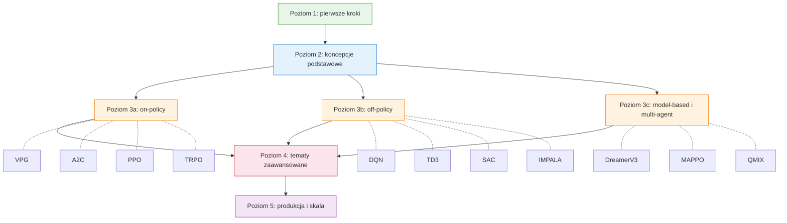

# Ścieżka nauki

> **ℹ️ Skrócone tłumaczenie.** Ta strona pokazuje mapę ścieżki nauki i Poziom 1.
> Pełna ścieżka (Poziomy 2–5: koncepcje podstawowe, algorytmy on-policy/off-policy,
> tematy zaawansowane, produkcja) jest dostępna wyłącznie w [wersji angielskiej](../learning-path.md).

Twój przewodnik po opanowaniu uczenia ze wzmocnieniem z rlox — od zera do produkcji.



---

## Poziom 1: pierwsze kroki (30 minut)

**Cel:** zainstalować rlox, wytrenować pierwszego agenta i zobaczyć wyniki.

### Instalacja rlox

```bash
pip install rlox
```

### Wytrenuj pierwszego agenta

```python
from rlox import Trainer

trainer = Trainer("ppo", env="CartPole-v1", seed=42)
metrics = trainer.train(total_timesteps=100_000)
print(f"Końcowy zwrot: {metrics['mean_reward']:.1f}")
```

### Poznaj API Trainera

`Trainer` jest jedynym punktem wejścia dla wszystkich algorytmów:

```python
# Utwórz z nazwą algorytmu i środowiskiem
trainer = Trainer("sac", env="Pendulum-v1")

# Trenuj przez N kroków
metrics = trainer.train(total_timesteps=50_000)

# Zapisz / wczytaj checkpointy
trainer.save("my_model")
trainer = Trainer.from_checkpoint("my_model", algorithm="sac", env="Pendulum-v1")

# Przewiduj akcje
action = trainer.predict(obs, deterministic=True)
```

### Dalsza lektura

- [Przewodnik pierwszych kroków](getting-started.md) — skrócone wprowadzenie po polsku
- [Pełna ścieżka nauki (en)](../learning-path.md) — Poziomy 2–5
- [Przykłady](../examples.md) — gotowe fragmenty kodu
