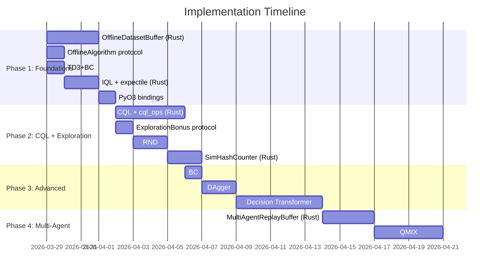

# Offline RL & Exploration: Implementation Plan

## Design Principles

1. **Reusability** — Every Rust primitive serves multiple algorithms
2. **Extensibility** — Trait-based design for custom offline datasets, exploration bonuses, and imitation strategies
3. **Layered API** — Rust primitives → Python base classes → Algorithm implementations
4. **Zero-copy where possible** — Memory-mapped loading, numpy interop via PyO3

---

## Architecture Overview

```mermaid
graph TD
    subgraph "Layer 1: Rust Primitives (crates/rlox-core/src/)"
        ODB[OfflineDatasetBuffer<br/>load, sample, normalize]
        TS[TrajectorySampler<br/>episode boundaries, subsequences]
        CQL_OPS[CQL Ops<br/>random action sampling]
        EXP[Expectile Loss]
        SHC[SimHashCounter<br/>count-based exploration]
        RS[RunningStats<br/>existing, reused]
        RB[ReplayBuffer<br/>existing, reused]
    end

    subgraph "Layer 2: Python Base Classes (python/rlox/offline/)"
        OA[OfflineAlgorithm<br/>protocol + shared train loop]
        EB[ExplorationBonus<br/>protocol for intrinsic rewards]
        IL[ImitationAlgorithm<br/>protocol for BC/DAgger/GAIL]
    end

    subgraph "Layer 3: Algorithm Implementations"
        TD3BC[TD3+BC] --> OA
        IQL[IQL] --> OA
        CQL[CQL] --> OA
        DT[Decision Transformer] --> OA
        BC[Behavioral Cloning] --> IL
        DAG[DAgger] --> IL
        RND[RND] --> EB
        CNT[CountExploration] --> EB
    end

    TD3BC --> RB
    IQL --> ODB
    IQL --> EXP
    CQL --> ODB
    CQL --> CQL_OPS
    DT --> TS
    BC --> ODB
    RND --> RS
    CNT --> SHC
```



---

## Phase 1: Foundations (Days 1–5)

### 1.1 OfflineDatasetBuffer (Rust)

**File:** `crates/rlox-core/src/buffer/offline.rs` (~400 LOC)

The keystone primitive. A read-only buffer loaded from static datasets.

```rust
pub struct OfflineDatasetBuffer {
    obs: Vec<f32>,          // [N, obs_dim] row-major
    next_obs: Vec<f32>,     // [N, obs_dim]
    actions: Vec<f32>,      // [N, act_dim]
    rewards: Vec<f32>,      // [N]
    terminated: Vec<u8>,    // [N]
    truncated: Vec<u8>,     // [N]
    episode_starts: Vec<usize>,  // indices where episodes begin
    episode_returns: Vec<f32>,   // precomputed return per episode
    obs_dim: usize,
    act_dim: usize,
    len: usize,

    // Normalization (optional, computed at load time)
    obs_mean: Option<Vec<f32>>,
    obs_std: Option<Vec<f32>>,
}
```

**Public API:**

```rust
impl OfflineDatasetBuffer {
    /// Load from flat numpy arrays (the PyO3 path)
    pub fn from_arrays(
        obs: &[f32], next_obs: &[f32], actions: &[f32],
        rewards: &[f32], terminated: &[u8], truncated: &[u8],
        obs_dim: usize, act_dim: usize,
    ) -> Result<Self, RloxError>;

    /// Sample i.i.d. transitions (for TD3+BC, IQL, CQL, BC)
    pub fn sample(&self, batch_size: usize, seed: u64) -> SampledBatch;

    /// Sample contiguous trajectory subsequences of length K
    /// (for Decision Transformer)
    pub fn sample_trajectories(
        &self, batch_size: usize, seq_len: usize, seed: u64,
    ) -> TrajectoryBatch;

    /// Sample transitions weighted by return (for return-conditioned methods)
    pub fn sample_by_return(
        &self, batch_size: usize, seed: u64, percentile: f32,
    ) -> SampledBatch;

    /// Compute and cache normalization statistics
    pub fn compute_normalization(&mut self);

    /// Get dataset statistics
    pub fn stats(&self) -> DatasetStats;

    pub fn len(&self) -> usize;
    pub fn n_episodes(&self) -> usize;
}
```

**Why Rust:**
- D4RL datasets have 1M+ transitions. Sampling 256 transitions from 1M is I/O-bound — Rust's cache-friendly contiguous arrays with ChaCha8Rng are 5-10x faster than Python `np.random.choice`.
- Episode boundary detection during loading is a scan-and-mark operation that Rayon parallelizes.
- Normalization computation reuses `RunningStats` pattern.

**Tests (TDD):**
```
test_load_from_arrays
test_sample_uniform_shapes
test_sample_deterministic
test_episode_boundary_detection
test_sample_trajectories_contiguous
test_sample_trajectories_respects_episode_boundaries
test_sample_by_return_top_percentile
test_normalization_computation
test_empty_dataset_error
test_mismatched_array_lengths_error
```

---

### 1.2 OfflineAlgorithm Protocol (Python)

**File:** `python/rlox/offline/__init__.py` (~20 LOC)
**File:** `python/rlox/offline/base.py` (~80 LOC)

```python
from __future__ import annotations
from typing import Protocol, runtime_checkable

import numpy as np
import torch


@runtime_checkable
class OfflineDataset(Protocol):
    """Protocol for offline datasets — users can bring their own."""
    def sample(self, batch_size: int, seed: int) -> dict[str, np.ndarray]: ...
    def __len__(self) -> int: ...


class OfflineAlgorithm:
    """Base class for offline RL algorithms.

    Handles the shared train loop: sample → update → log → callback.
    Subclasses implement _update() with algorithm-specific logic.
    """

    def __init__(
        self,
        dataset: OfflineDataset,
        batch_size: int = 256,
        learning_rate: float = 3e-4,
        callbacks: list | None = None,
        logger: LoggerCallback | None = None,
    ):
        self.dataset = dataset
        self.batch_size = batch_size
        self.callbacks = CallbackList(callbacks)
        self.logger = logger
        self._global_step = 0

    def train(self, n_gradient_steps: int) -> dict[str, float]:
        """Shared training loop for all offline algorithms."""
        self.callbacks.on_training_start()
        metrics = {}

        for step in range(n_gradient_steps):
            batch = self.dataset.sample(self.batch_size, seed=step)
            metrics = self._update(batch)

            self._global_step += 1
            self.callbacks.on_train_batch(**metrics)

            should_continue = self.callbacks.on_step(
                step=self._global_step, algo=self, **metrics
            )
            if not should_continue:
                break

            if self.logger and self._global_step % 1000 == 0:
                self.logger.on_train_step(self._global_step, metrics)

        self.callbacks.on_training_end()
        return metrics

    def _update(self, batch: dict[str, np.ndarray]) -> dict[str, float]:
        """Subclasses implement this."""
        raise NotImplementedError
```

**Why a base class:**
- All offline algorithms share the same loop: sample → SGD update → log
- Reuses existing `CallbackList`, `LoggerCallback` infrastructure
- `OfflineDataset` protocol allows custom datasets (not just `OfflineDatasetBuffer`)

---

### 1.3 TD3+BC (Python, Day 1)

**File:** `python/rlox/algorithms/td3_bc.py` (~150 LOC)

The simplest offline algorithm. Pure reuse of existing TD3 components.

```python
class TD3BC(OfflineAlgorithm):
    """TD3+BC: TD3 with behavioral cloning regularization.

    Loss_actor = -Q(s, a_policy) + alpha * ||a_policy - a_data||^2

    Reference: Fujimoto & Gu, NeurIPS 2021
    """

    def __init__(
        self,
        dataset: OfflineDataset,
        obs_dim: int,
        act_dim: int,
        alpha: float = 2.5,         # BC regularization weight
        hidden: int = 256,
        learning_rate: float = 3e-4,
        tau: float = 0.005,
        gamma: float = 0.99,
        policy_delay: int = 2,
        target_noise: float = 0.2,
        noise_clip: float = 0.5,
        normalize: bool = True,
        **kwargs,
    ): ...

    def _update(self, batch) -> dict[str, float]:
        # 1. Critic update (same as TD3)
        # 2. Actor update with BC term:
        #    actor_loss = -lmbda * Q(s, pi(s)) + (pi(s) - a_data)^2
        #    where lmbda = alpha / mean(|Q(s, a_data)|)
        ...
```

**Tests:**
```
test_td3bc_instantiation
test_td3bc_train_step_returns_metrics
test_td3bc_alpha_zero_is_td3           # alpha=0 → pure TD3
test_td3bc_alpha_large_is_bc           # large alpha → behavioral cloning
test_td3bc_with_normalization
test_td3bc_save_load_checkpoint
```

---

### 1.4 IQL (Python, Days 2–3)

**File:** `python/rlox/algorithms/iql.py` (~250 LOC)
**File:** `crates/rlox-core/src/training/expectile.rs` (~50 LOC)

```python
class IQL(OfflineAlgorithm):
    """Implicit Q-Learning.

    Avoids querying OOD actions by using expectile regression
    on the value function: V(s) ≈ E_τ[Q(s,a)] where τ > 0.5
    biases toward high-Q actions.

    Reference: Kostrikov et al., ICLR 2022
    """

    def __init__(
        self,
        dataset: OfflineDataset,
        obs_dim: int,
        act_dim: int,
        expectile: float = 0.7,      # τ for asymmetric regression
        temperature: float = 3.0,     # β for advantage weighting
        hidden: int = 256,
        **kwargs,
    ): ...
```

**Rust primitive — Expectile loss:**
```rust
/// Asymmetric L2 loss: L_τ(u) = |τ - 1(u < 0)| * u^2
/// Used by IQL for value function regression.
pub fn expectile_loss(predictions: &[f32], targets: &[f32], tau: f32) -> Vec<f32> {
    predictions.iter().zip(targets).map(|(&p, &t)| {
        let diff = p - t;
        let weight = if diff < 0.0 { tau } else { 1.0 - tau };
        weight * diff * diff
    }).collect()
}

/// Batched expectile loss with Rayon parallelism for large batches.
pub fn expectile_loss_batched(
    predictions: &[f32], targets: &[f32], tau: f32,
) -> f32 {
    // Sum and average with Rayon for batches > 4096
    ...
}
```

---

### 1.5 PyO3 Bindings for OfflineDatasetBuffer (Day 3)

**File:** `crates/rlox-python/src/buffer.rs` (extend)

```rust
#[pyclass(name = "OfflineDatasetBuffer")]
pub struct PyOfflineDatasetBuffer {
    inner: OfflineDatasetBuffer,
}

#[pymethods]
impl PyOfflineDatasetBuffer {
    #[new]
    fn from_arrays(
        obs: PyReadonlyArray2<f32>,
        next_obs: PyReadonlyArray2<f32>,
        actions: PyReadonlyArray2<f32>,
        rewards: PyReadonlyArray1<f32>,
        terminated: PyReadonlyArray1<u8>,
        truncated: PyReadonlyArray1<u8>,
    ) -> PyResult<Self>;

    /// Load from D4RL-style dict with keys: observations, actions, rewards, ...
    #[staticmethod]
    fn from_d4rl(data: &Bound<'_, PyDict>) -> PyResult<Self>;

    fn sample(&self, py: Python, batch_size: usize, seed: u64) -> PyResult<Bound<PyDict>>;
    fn sample_trajectories(...) -> PyResult<Bound<PyDict>>;
    fn __len__(&self) -> usize;
    fn n_episodes(&self) -> usize;

    #[getter]
    fn stats(&self) -> PyResult<Bound<PyDict>>;
}
```

**Python convenience:**
```python
# Usage
import rlox

# From D4RL
import d4rl, gymnasium
env = gymnasium.make("halfcheetah-medium-v2")
dataset = env.get_dataset()
buf = rlox.OfflineDatasetBuffer.from_d4rl(dataset)

# From numpy arrays
buf = rlox.OfflineDatasetBuffer(obs, next_obs, actions, rewards, terminated, truncated)

# Train
from rlox.algorithms.td3_bc import TD3BC
algo = TD3BC(dataset=buf, obs_dim=17, act_dim=6)
algo.train(n_gradient_steps=100_000)
```

---

## Phase 2: CQL & Exploration (Days 6–12)

### 2.1 CQL (Days 6–9)

**File:** `python/rlox/algorithms/cql.py` (~300 LOC)
**File:** `crates/rlox-core/src/training/cql_ops.rs` (~150 LOC)

```python
class CQL(OfflineAlgorithm):
    """Conservative Q-Learning.

    Adds a penalty to Q-values for OOD actions:
    L_CQL = α * (E_π[Q(s,a)] - E_D[Q(s,a)]) + standard_bellman_loss

    Reference: Kumar et al., NeurIPS 2020
    """

    def __init__(
        self,
        dataset: OfflineDataset,
        obs_dim: int,
        act_dim: int,
        cql_alpha: float = 5.0,
        n_random_actions: int = 10,
        n_policy_actions: int = 10,
        auto_alpha: bool = True,
        cql_target_value: float = -1.0,
        **kwargs,
    ): ...
```

**Rust CQL ops:**
```rust
/// Sample uniform random actions for CQL penalty computation.
/// Returns [batch_size * n_random, act_dim] flat array.
pub fn sample_random_actions(
    batch_size: usize, n_random: usize, act_dim: usize,
    low: f32, high: f32, seed: u64,
) -> Vec<f32>;

/// Compute log-sum-exp over Q-values for CQL penalty.
/// Takes Q-values [batch_size, n_actions] and returns [batch_size].
pub fn logsumexp_rows(q_values: &[f32], n_cols: usize) -> Vec<f32>;
```

### 2.2 ExplorationBonus Protocol (Day 6)

**File:** `python/rlox/exploration/bonus.py` (~60 LOC)

```python
@runtime_checkable
class ExplorationBonus(Protocol):
    """Protocol for intrinsic reward bonuses."""

    def compute_bonus(self, obs: np.ndarray) -> np.ndarray:
        """Compute intrinsic reward for a batch of observations.

        Args:
            obs: (batch_size, obs_dim) observations

        Returns:
            (batch_size,) intrinsic rewards
        """
        ...

    def update(self, obs: np.ndarray) -> None:
        """Update internal state (e.g., predictor network, counters)."""
        ...
```

### 2.3 RND (Days 6–7)

**File:** `python/rlox/exploration/rnd.py` (~200 LOC)

```python
class RNDBonus:
    """Random Network Distillation exploration bonus.

    Uses prediction error of a learnable predictor network against a
    fixed random target network as intrinsic reward.

    Reference: Burda et al., ICLR 2019
    """

    def __init__(
        self,
        obs_dim: int,
        feature_dim: int = 64,
        hidden: int = 256,
        learning_rate: float = 1e-3,
    ):
        self.target = self._make_network(obs_dim, feature_dim, hidden)
        self.predictor = self._make_network(obs_dim, feature_dim, hidden)
        # Freeze target
        for p in self.target.parameters():
            p.requires_grad_(False)
        self.optimizer = torch.optim.Adam(self.predictor.parameters(), lr=learning_rate)
        # Reuse rlox.RunningStats for reward normalization
        self._reward_stats = rlox.RunningStats()

    def compute_bonus(self, obs: np.ndarray) -> np.ndarray:
        with torch.no_grad():
            obs_t = torch.as_tensor(obs, dtype=torch.float32)
            target_feat = self.target(obs_t)
            pred_feat = self.predictor(obs_t)
            bonus = (target_feat - pred_feat).pow(2).sum(dim=-1)
        # Normalize using RunningStats
        bonus_np = bonus.numpy()
        self._reward_stats.update_batch(bonus_np)
        return bonus_np / (self._reward_stats.std() + 1e-8)

    def update(self, obs: np.ndarray) -> None:
        obs_t = torch.as_tensor(obs, dtype=torch.float32)
        target_feat = self.target(obs_t).detach()
        pred_feat = self.predictor(obs_t)
        loss = (target_feat - pred_feat).pow(2).mean()
        self.optimizer.zero_grad(set_to_none=True)
        loss.backward()
        self.optimizer.step()
```

### 2.4 SimHashCounter (Rust, Days 8–9)

**File:** `crates/rlox-core/src/exploration/simhash.rs` (~100 LOC)

```rust
/// Count-based exploration via SimHash.
///
/// Hashes observations into discrete cells and counts visits.
/// Intrinsic reward: 1 / sqrt(count(hash(obs)))
pub struct SimHashCounter {
    counts: HashMap<u64, u32>,
    projection: Vec<f32>,  // [hash_dim, obs_dim] random projection
    hash_dim: usize,
    obs_dim: usize,
}

impl SimHashCounter {
    pub fn new(obs_dim: usize, hash_dim: usize, seed: u64) -> Self;

    /// Hash an observation to a u64 key.
    fn hash_obs(&self, obs: &[f32]) -> u64;

    /// Update counts and return intrinsic rewards for a batch.
    pub fn update_and_bonus(&mut self, obs: &[f32], obs_dim: usize) -> Vec<f32>;

    /// Get visit count for a single observation.
    pub fn count(&self, obs: &[f32]) -> u32;

    pub fn total_unique_states(&self) -> usize;
}
```

### 2.5 Integration: Exploration + On-Policy Algorithms

**File:** `python/rlox/exploration/__init__.py` (extend)

```python
# Existing: GaussianNoise, EpsilonGreedy, OUNoise
# New exports:
from rlox.exploration.bonus import ExplorationBonus
from rlox.exploration.rnd import RNDBonus
from rlox.exploration.count import CountBonus  # wraps SimHashCounter

# Usage with PPO:
from rlox.algorithms.ppo import PPO
from rlox.exploration import RNDBonus

rnd = RNDBonus(obs_dim=17, feature_dim=64)
ppo = PPO(
    env_id="MontezumaRevenge-v5",
    exploration_bonus=rnd,  # new parameter
    bonus_coef=0.01,
)
ppo.train(total_timesteps=10_000_000)
```

---

## Phase 3: Advanced Algorithms (Days 13–20)

### 3.1 Behavioral Cloning (Day 13)

**File:** `python/rlox/algorithms/bc.py` (~100 LOC)

```python
class BC(OfflineAlgorithm):
    """Behavioral Cloning — supervised learning on demonstrations.

    Discrete: cross-entropy loss
    Continuous: MSE loss
    """

    def __init__(
        self,
        dataset: OfflineDataset,
        obs_dim: int,
        act_dim: int,
        continuous: bool = True,
        **kwargs,
    ): ...

    def _update(self, batch):
        obs = torch.as_tensor(batch["obs"], dtype=torch.float32)
        actions = torch.as_tensor(batch["actions"], dtype=torch.float32)
        pred = self.policy(obs)
        if self.continuous:
            loss = F.mse_loss(pred, actions)
        else:
            loss = F.cross_entropy(pred, actions.long())
        ...
```

### 3.2 DAgger (Days 14–15)

**File:** `python/rlox/algorithms/dagger.py` (~200 LOC)

```python
class DAgger:
    """Dataset Aggregation.

    Iteratively: roll out learner policy → query expert → aggregate → retrain.

    Reference: Ross et al., AISTATS 2011
    """

    def __init__(
        self,
        env_id: str,
        expert_fn: Callable[[np.ndarray], np.ndarray],
        obs_dim: int,
        act_dim: int,
        beta_schedule: str = "linear",  # "linear", "constant", "exponential"
        **kwargs,
    ): ...

    def train(
        self,
        n_iterations: int = 10,
        n_rollout_steps: int = 1000,
        n_train_steps: int = 1000,
    ) -> dict[str, float]: ...
```

### 3.3 Decision Transformer (Days 16–20)

**File:** `python/rlox/algorithms/decision_transformer.py` (~400 LOC)
**File:** `crates/rlox-core/src/buffer/offline.rs` (extend with `sample_trajectories`)

```python
class DecisionTransformer:
    """Decision Transformer — sequence modeling for offline RL.

    Treats RL as a sequence prediction problem:
    input = (R_1, s_1, a_1, R_2, s_2, a_2, ...)
    where R_t is the return-to-go.

    Reference: Chen et al., NeurIPS 2021
    """

    def __init__(
        self,
        dataset: OfflineDataset,
        obs_dim: int,
        act_dim: int,
        context_length: int = 20,
        n_heads: int = 4,
        n_layers: int = 3,
        embed_dim: int = 128,
        target_return: float | None = None,
        **kwargs,
    ): ...
```

---

## Phase 4: Multi-Agent (Days 21–25)

### 4.1 MultiAgentReplayBuffer (Rust)

**File:** `crates/rlox-core/src/buffer/multi_agent.rs` (~300 LOC)

```rust
pub struct MultiAgentReplayBuffer {
    n_agents: usize,
    obs_dim: usize,
    act_dim: usize,
    // Per-agent storage
    obs: Vec<Vec<f32>>,      // [n_agents][capacity * obs_dim]
    actions: Vec<Vec<f32>>,  // [n_agents][capacity * act_dim]
    // Shared
    rewards: Vec<f32>,       // [capacity] (shared team reward)
    terminated: Vec<u8>,
    ...
}

impl MultiAgentReplayBuffer {
    /// Sample with joint observation assembly for centralized critic.
    pub fn sample_joint(
        &self, batch_size: usize, seed: u64,
    ) -> MultiAgentBatch;
}
```

### 4.2 QMIX (Python)

**File:** `python/rlox/algorithms/qmix.py` (~350 LOC)

---

## File Structure Summary

```
crates/rlox-core/src/
├── buffer/
│   ├── offline.rs          # Phase 1: OfflineDatasetBuffer (NEW)
│   ├── multi_agent.rs      # Phase 4: MultiAgentReplayBuffer (NEW)
│   ├── ringbuf.rs          # Existing
│   ├── priority.rs         # Existing
│   └── ...
├── training/
│   ├── expectile.rs        # Phase 1: IQL expectile loss (NEW)
│   ├── cql_ops.rs          # Phase 2: CQL ops (NEW)
│   ├── gae.rs              # Existing
│   └── vtrace.rs           # Existing
├── exploration/
│   ├── mod.rs              # NEW module
│   └── simhash.rs          # Phase 2: SimHashCounter (NEW)
└── ...

python/rlox/
├── offline/
│   ├── __init__.py         # Phase 1: OfflineAlgorithm, OfflineDataset (NEW)
│   └── base.py             # Phase 1: Base class (NEW)
├── algorithms/
│   ├── td3_bc.py           # Phase 1 (NEW)
│   ├── iql.py              # Phase 1 (NEW)
│   ├── cql.py              # Phase 2 (NEW)
│   ├── bc.py               # Phase 3 (NEW)
│   ├── dagger.py           # Phase 3 (NEW)
│   ├── decision_transformer.py  # Phase 3 (NEW)
│   ├── qmix.py             # Phase 4 (NEW)
│   └── ...                 # Existing
├── exploration/
│   ├── bonus.py            # Phase 2: ExplorationBonus protocol (NEW)
│   ├── rnd.py              # Phase 2: RND (NEW)
│   ├── count.py            # Phase 2: CountBonus wrapper (NEW)
│   └── __init__.py         # Extend existing
└── ...
```

---

## Effort Summary



| Phase | Rust LOC | Python LOC | Days | Algorithms |
|-------|----------|-----------|------|------------|
| 1: Foundations | 450 | 500 | 5 | TD3+BC, IQL |
| 2: CQL + Exploration | 250 | 560 | 7 | CQL, RND, CountExploration |
| 3: Advanced | 200 | 700 | 8 | BC, DAgger, Decision Transformer |
| 4: Multi-Agent | 300 | 350 | 5 | QMIX |
| **Total** | **1,200** | **2,110** | **25** | **7 algorithms + 2 exploration methods** |

---

## Extensibility Points

### Custom Offline Datasets
```python
# Users implement OfflineDataset protocol
class MyCustomDataset:
    def sample(self, batch_size, seed):
        return {"obs": ..., "actions": ..., "rewards": ..., ...}
    def __len__(self):
        return self.n_transitions

# Works with any offline algorithm
algo = IQL(dataset=MyCustomDataset(), obs_dim=17, act_dim=6)
```

### Custom Exploration Bonuses
```python
# Users implement ExplorationBonus protocol
class MyNoveltyBonus:
    def compute_bonus(self, obs):
        return my_novelty_score(obs)
    def update(self, obs):
        self.model.update(obs)

# Plug into any on-policy algorithm
ppo = PPO(env_id="...", exploration_bonus=MyNoveltyBonus())
```

### Custom Imitation Strategies
```python
# DAgger with custom expert
def my_expert(obs):
    return optimal_controller(obs)

dagger = DAgger(env_id="HalfCheetah-v4", expert_fn=my_expert)
```

---

## Testing Strategy

Every component gets tests at two levels:

1. **Rust unit tests** — shape validation, deterministic sampling, error handling
2. **Python integration tests (TDD)** — write tests FIRST, then implement

```
tests/python/
├── test_offline_buffer.py          # OfflineDatasetBuffer Python integration
├── test_td3_bc.py                  # TD3+BC algorithm
├── test_iql.py                     # IQL algorithm
├── test_cql.py                     # CQL algorithm
├── test_exploration_bonus.py       # RND + CountBonus
├── test_bc.py                      # Behavioral Cloning
├── test_decision_transformer.py    # Decision Transformer
```
