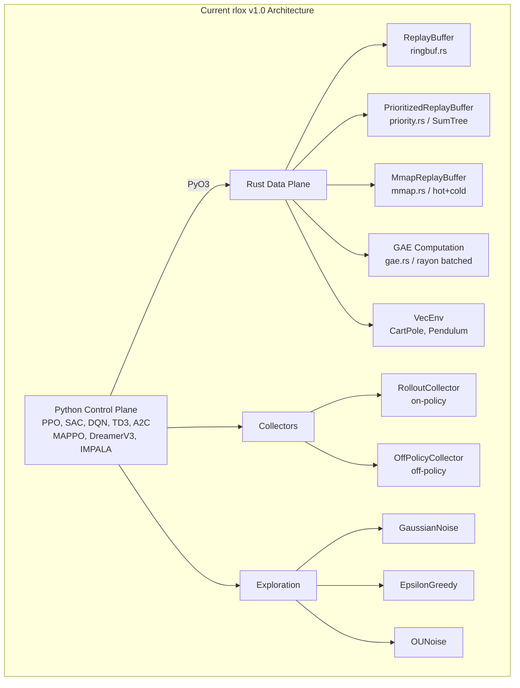
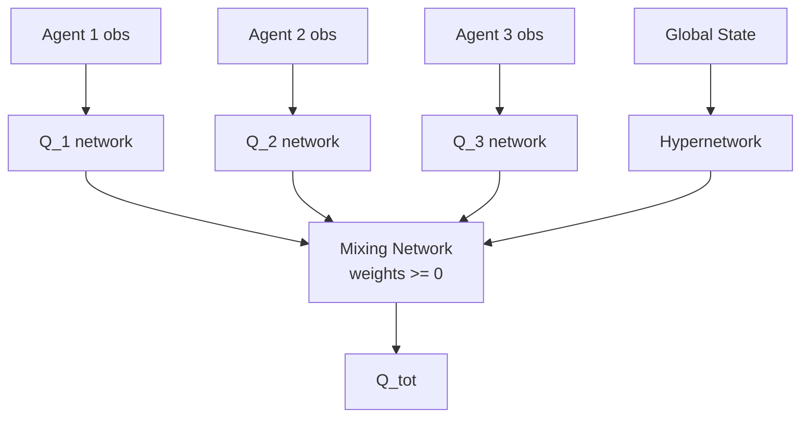
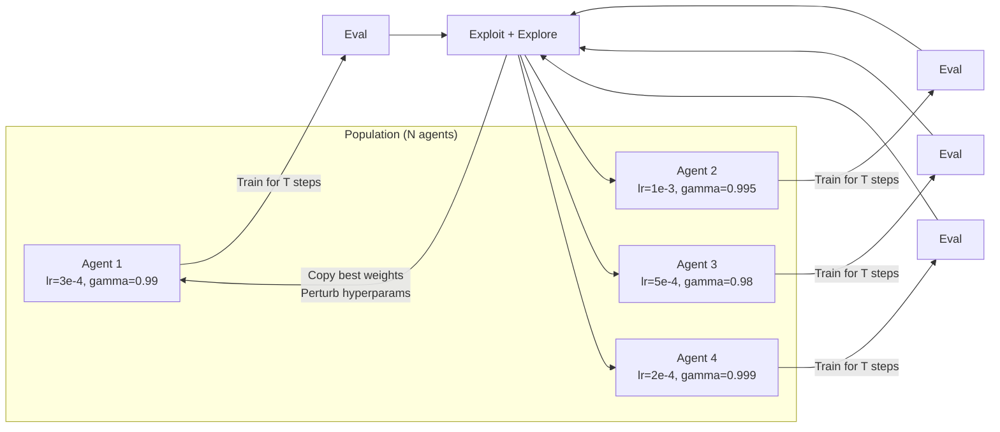
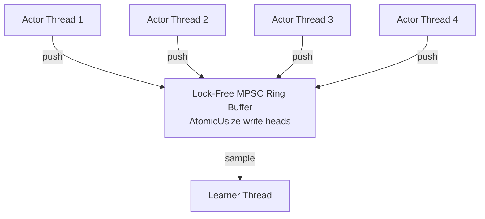
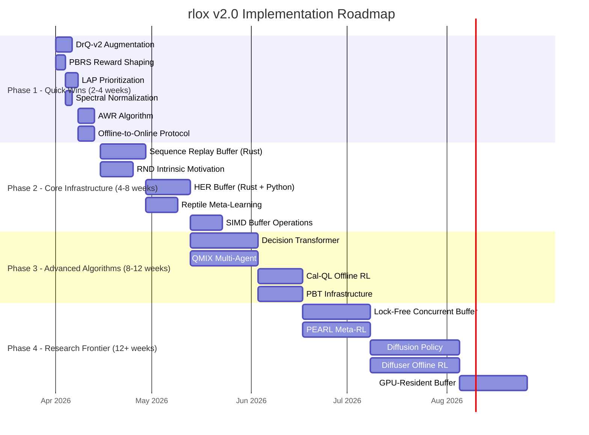
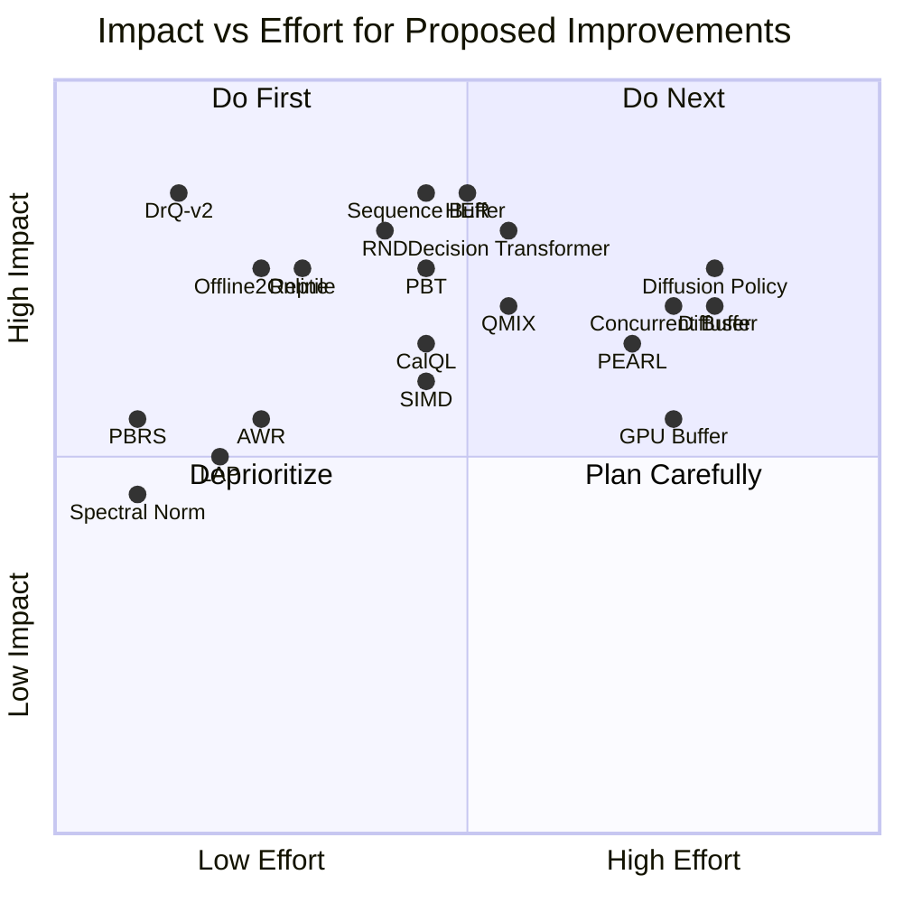

# Research Report: Advanced RL Improvements for rlox v2.0

**Date**: 2026-03-29
**Scope**: 8 research areas with prioritized recommendations for the rlox framework

---

## Architecture Overview



---

## 1. Buffer Sampling Strategies

### Current State in rlox

- **Uniform random sampling**: `ReplayBuffer` in `ringbuf.rs` uses `ChaCha8Rng` with deterministic seeding. Pre-allocated, zero-copy ring buffer with `push_slices`, `push_batch`, and `sample_into` for reuse.
- **PER**: `PrioritizedReplayBuffer` in `priority.rs` uses a SumTree with O(log N) sampling and min-tree for importance weight computation. Supports `alpha` (prioritization exponent) and `beta` (IS correction) with linear annealing.
- **Extra columns**: `ExtraColumns` system allows registering auxiliary data (log-probs, values) alongside transitions.
- **Mmap spillover**: `MmapReplayBuffer` provides hot (in-memory) + cold (disk-backed) tiered storage for large buffers.
- **No sequence-based sampling**, no HER, no gradient-based prioritization.

### Top 3 Recommendations

#### Rank 1: Sequence Replay Buffer (Impact: HIGH, Effort: MEDIUM)

**Algorithm**: DreamerV3 requires contiguous subsequences from episodes for RSSM training. The current buffer stores individual transitions with no episode boundary tracking. A sequence replay buffer maintains episode metadata (start index, length) alongside the ring buffer and samples contiguous windows of length `seq_len`.

**When it helps**: Any world-model-based method (DreamerV3, MBPO, PlaNet), temporal-difference methods with n-step returns, and recurrent policies (R2D2, GTrXL).

**Computational cost**: O(1) additional metadata per push (episode ID, timestep within episode). Sampling remains O(seq_len) per sequence. Storage overhead: ~16 bytes per transition (episode_id: u64, timestep: u64).

**Mathematical formulation**: Given buffer B with episodes {E_1, ..., E_K}, sample episode k with probability proportional to max(0, |E_k| - L + 1) where L is the desired sequence length. Then uniformly sample a start index t within [0, |E_k| - L].

```
P(k) = max(0, |E_k| - L + 1) / sum_j max(0, |E_j| - L + 1)
t ~ Uniform(0, |E_k| - L)
sequence = E_k[t:t+L]
```

**Implementation sketch (Rust)**:

```rust
// New file: crates/rlox-core/src/buffer/sequence.rs

pub struct SequenceReplayBuffer {
    inner: ReplayBuffer,
    // Episode metadata
    episode_starts: Vec<usize>,   // ring-buffer indices where episodes begin
    episode_lengths: Vec<usize>,  // length of each episode
    current_episode_start: usize,
    current_episode_len: usize,
    episode_count: usize,
}

pub struct SequenceBatch {
    pub observations: Vec<f32>,    // [batch_size, seq_len, obs_dim]
    pub actions: Vec<f32>,         // [batch_size, seq_len, act_dim]
    pub rewards: Vec<f32>,         // [batch_size, seq_len]
    pub terminated: Vec<bool>,     // [batch_size, seq_len]
    pub batch_size: usize,
    pub seq_len: usize,
}

impl SequenceReplayBuffer {
    pub fn sample_sequences(
        &self,
        batch_size: usize,
        seq_len: usize,
        seed: u64,
    ) -> Result<SequenceBatch, RloxError> {
        // 1. Compute sampling weights proportional to valid windows per episode
        // 2. Sample episodes, then sample start positions within episodes
        // 3. Copy contiguous sequences into batch
    }

    pub fn push_with_episode_tracking(
        &mut self,
        record: ExperienceRecord,
        done: bool,
    ) -> Result<(), RloxError> {
        self.inner.push(record)?;
        self.current_episode_len += 1;
        if done {
            self.episode_starts.push(self.current_episode_start);
            self.episode_lengths.push(self.current_episode_len);
            self.current_episode_start = self.inner.write_pos();
            self.current_episode_len = 0;
            self.episode_count += 1;
        }
        Ok(())
    }
}
```

**Required changes**:
- **Rust**: New `buffer/sequence.rs` module, register in `buffer/mod.rs`
- **Python**: PyO3 binding in `crates/rlox-python/src/buffer.rs`, expose as `rlox.SequenceReplayBuffer`
- **Config**: Add `seq_len: int` and `sequence_overlap: int` to `DreamerV3Config`
- **DreamerV3**: Replace current buffer usage with sequence sampling in `dreamer.py`

**Expected impact**: Eliminates a major bottleneck in DreamerV3 training. Currently DreamerV3 must reconstruct sequences in Python from individual transitions, which is slow and error-prone at episode boundaries. Native Rust sequence sampling should yield 3-5x speedup in data loading for world-model training.

---

#### Rank 2: Hindsight Experience Replay (HER) (Impact: HIGH, Effort: MEDIUM)

**Algorithm** [1]: HER addresses sparse reward environments by replaying transitions with substituted goals. After collecting a trajectory, for each transition (s_t, a_t, r_t, s_{t+1}) with original goal g, create additional transitions with alternative goals g' sampled from the trajectory itself (e.g., the state actually achieved later in the episode).

**Strategies for goal relabeling**:
- `final`: Use the final state of the episode as g'
- `future`: Sample g' from states achieved after t in the same episode
- `episode`: Sample g' from any state in the episode
- `random`: Sample g' from the entire buffer

**When it helps**: Goal-conditioned environments with sparse binary rewards (robotics manipulation, navigation). Turns an environment where reward is received 0.1% of the time into one where it is received 50%+ of the time.

**Computational cost**: k additional virtual transitions per real transition (typically k=4). Total buffer throughput increases by factor (1+k) but convergence improves dramatically, often by 10-100x in sparse reward settings.

**Mathematical formulation**:

```
For trajectory tau = {(s_0,a_0,g), ..., (s_T,a_T,g)}:
  For each t in {0,...,T}:
    Store original: (s_t || g, a_t, r(s_t,a_t,g), s_{t+1} || g)
    For i in {1,...,k}:
      g' ~ Strategy(tau, t)           // e.g., future: uniform from {s_{t+1},...,s_T}
      r' = reward_fn(s_t, a_t, g')   // recompute reward with new goal
      Store relabeled: (s_t || g', a_t, r', s_{t+1} || g')
```

**Implementation sketch (Rust + Python hybrid)**:

```rust
// crates/rlox-core/src/buffer/her.rs

pub enum HERStrategy {
    Final,
    Future { k: usize },
    Episode { k: usize },
}

pub struct HERBuffer {
    inner: ReplayBuffer,
    episodes: Vec<EpisodeMetadata>,
    strategy: HERStrategy,
    obs_dim: usize,
    goal_dim: usize,
}
```

```python
# python/rlox/her.py

class HERWrapper:
    """Wraps any off-policy algorithm with HER goal relabeling."""

    def __init__(self, buffer, strategy="future", k=4, reward_fn=None):
        self.buffer = buffer
        self.strategy = strategy
        self.k = k
        self.reward_fn = reward_fn or self._default_sparse_reward

    def store_episode(self, episode):
        """Store episode with HER relabeling."""
        for t, transition in enumerate(episode):
            self.buffer.push(transition)
            for _ in range(self.k):
                goal = self._sample_goal(episode, t)
                relabeled = self._relabel(transition, goal)
                self.buffer.push(relabeled)
```

**Required changes**:
- **Rust**: New `buffer/her.rs` with episode tracking and goal relabeling logic
- **Python**: `her.py` wrapper module, integration with `OffPolicyCollector`
- **Config**: New `HERConfig` dataclass (strategy, k, goal_dim)
- **Algorithms**: SAC and TD3 need `goal_conditioned=True` flag

**Expected impact**: Enables rlox to tackle robotics benchmarks (FetchReach, FetchPush, HandManipulate) that are otherwise intractable. Expected 10-100x improvement in sample efficiency for sparse-reward goal-conditioned tasks.

---

#### Rank 3: Loss-Adjusted Prioritization (LAP) (Impact: MEDIUM, Effort: LOW)

**Algorithm** [2]: LAP addresses the staleness problem in PER. Standard PER priorities become stale as the network trains -- a transition that had high TD error 1000 updates ago may no longer be informative. LAP replaces priorities with the most recent per-sample loss, updated every time a sample is trained on.

```
priority_i = |loss(x_i)| + epsilon
```

Unlike PER which uses TD error at insertion time, LAP uses the actual training loss, which is always fresh for recently sampled transitions and gracefully ages for others.

**When it helps**: Any off-policy method. Particularly effective when training is non-stationary (changing reward distributions, curriculum learning).

**Computational cost**: Same as PER (O(log N) per update via SumTree). No additional forward passes needed since loss is already computed during training.

**Implementation sketch**: Minimal changes to existing `PrioritizedReplayBuffer`:

```rust
// Extend priority.rs with a LAPMode flag
impl PrioritizedReplayBuffer {
    /// Update priorities using training losses instead of TD errors.
    /// Called after each training batch with the per-sample losses.
    pub fn update_priorities_from_loss(
        &mut self,
        indices: &[usize],
        losses: &[f64],
        epsilon: f64,
    ) {
        for (&idx, &loss) in indices.iter().zip(losses.iter()) {
            let priority = loss.abs() + epsilon;
            self.tree.set(idx, priority.powf(self.alpha));
        }
    }
}
```

**Required changes**:
- **Rust**: Add `update_priorities_from_loss` method to `PrioritizedReplayBuffer`
- **Python**: Update DQN `_update()` to pass per-sample losses instead of TD errors
- **Config**: Add `priority_mode: str = "td_error" | "loss"` to `DQNConfig`

**Expected impact**: 5-15% improvement in final performance for DQN/Rainbow. Zero additional compute cost since losses are already computed.

---

### Additional Strategies (Lower Priority)

| Strategy | Impact | Effort | Best For |
|----------|--------|--------|----------|
| **Reservoir Sampling** | Low | Low | Streaming/continual learning |
| **Curiosity-Driven Prioritization** | Medium | High | Exploration-heavy envs |
| **ERO (Experience Replay Optimization)** [3] | Medium | High | Meta-learning the sampling distribution |
| **N-step Bootstrap Integration** | Medium | Low | Already partially in DQN; extend to SAC |

---

## 2. Meta-Learning and Transfer

### Current State in rlox

No meta-learning infrastructure exists. Each algorithm trains from scratch on a single task. The config system supports hyperparameter specification but not task distributions. The checkpoint system can save/load individual runs but has no mechanism for aggregating knowledge across tasks.

### Top 3 Recommendations

#### Rank 1: Reptile (First-Order MAML) (Impact: HIGH, Effort: LOW)

**Algorithm** [4]: Reptile is a first-order approximation to MAML that avoids second-order gradients entirely. It works by:

1. Sample a task T_i from the task distribution
2. Initialize theta' = theta (copy current parameters)
3. Train theta' on T_i for k gradient steps using the standard algorithm
4. Update: theta = theta + epsilon * (theta' - theta)

This is equivalent to performing k steps of SGD on a task, then moving the initialization toward the result. Over many tasks, the initialization converges to a point that is close to the optimum for all tasks.

```mermaid
flowchart LR
    A[Meta-Init theta] --> B1[Task T1: k SGD steps]
    A --> B2[Task T2: k SGD steps]
    A --> B3[Task T3: k SGD steps]
    B1 --> C1[theta'_1]
    B2 --> C2[theta'_2]
    B3 --> C3[theta'_3]
    C1 --> D[theta += eps * mean(theta'_i - theta)]
    C2 --> D
    C3 --> D
    D --> A
```

**Why Reptile over MAML**: MAML requires differentiating through the inner optimization loop, which means storing the entire computation graph for k steps. For RL, where k might be thousands of environment steps, this is prohibitively expensive. Reptile only requires standard first-order gradients.

**Mathematical formulation**:

```
Notation:
  p(T)      = task distribution
  theta     = meta-parameters (network weights)
  U_k(T, theta) = parameters after k gradient steps on task T starting from theta
  epsilon   = meta learning rate
  k         = inner loop steps

Meta-update (Reptile):
  theta <- theta + epsilon * E_{T~p(T)} [U_k(T, theta) - theta]

Gradient interpretation (Nichol et al., 2018):
  The Reptile gradient E[U_k - theta] approximates:
  E[grad_1] + k*epsilon/2 * E[grad_1 . H . grad_2 + grad_2 . H . grad_1] + ...
  where grad_i are gradients from different minibatches and H is the Hessian.
  The second term maximizes inner product between gradients from different
  minibatches of the same task = generalizes within a task.
```

**Implementation sketch**:

```python
# python/rlox/meta/reptile.py

class ReptileMeta:
    """Meta-learning wrapper using Reptile (first-order MAML).

    Works with any rlox algorithm that has a .policy attribute.
    """

    def __init__(
        self,
        algo_cls,            # e.g., PPO, SAC
        task_distribution,   # callable that returns (env_id, config_overrides)
        meta_lr: float = 1.0,
        inner_steps: int = 1000,
        meta_batch_size: int = 5,
    ):
        self.algo_cls = algo_cls
        self.task_distribution = task_distribution
        self.meta_lr = meta_lr
        self.inner_steps = inner_steps
        self.meta_batch_size = meta_batch_size
        self.meta_params = None  # initialized on first train

    def meta_train(self, n_meta_iterations: int):
        for meta_iter in range(n_meta_iterations):
            param_diffs = []
            for _ in range(self.meta_batch_size):
                env_id, overrides = self.task_distribution()
                algo = self.algo_cls(env_id=env_id, **overrides)

                # Set to meta-initialization
                if self.meta_params is not None:
                    algo.policy.load_state_dict(self.meta_params)

                # Inner loop: train on task
                old_params = {k: v.clone() for k, v in algo.policy.state_dict().items()}
                algo.train(total_timesteps=self.inner_steps)
                new_params = algo.policy.state_dict()

                # Compute parameter difference
                diff = {k: new_params[k] - old_params[k] for k in old_params}
                param_diffs.append(diff)

            # Meta-update: move initialization toward task solutions
            if self.meta_params is None:
                self.meta_params = algo.policy.state_dict()

            for key in self.meta_params:
                mean_diff = torch.stack([d[key] for d in param_diffs]).mean(0)
                self.meta_params[key] += self.meta_lr * mean_diff

    def adapt(self, env_id: str, n_steps: int = 500, **kwargs):
        """Adapt meta-learned initialization to a new task."""
        algo = self.algo_cls(env_id=env_id, **kwargs)
        algo.policy.load_state_dict(self.meta_params)
        return algo.train(total_timesteps=n_steps)
```

**Required changes**:
- **Python**: New `python/rlox/meta/` package with `reptile.py`
- **Config**: New `MetaConfig` dataclass (meta_lr, inner_steps, meta_batch_size, task_distribution_type)
- **Infrastructure**: Task distribution abstraction (callable returning env configs)

**Expected impact**: Enables few-shot adaptation to new tasks. On Meta-World ML10 benchmarks, Reptile typically achieves 80%+ of MAML performance with 5x lower compute cost. Most importantly, it requires zero changes to existing algorithms -- it wraps them.

---

#### Rank 2: PEARL (Probabilistic Embeddings for Actor-Critic RL) (Impact: HIGH, Effort: HIGH)

**Algorithm** [5]: PEARL learns a task embedding from a small set of context transitions, then conditions the policy on this embedding. It uses a permutation-invariant encoder (set encoder) to map context transitions to a posterior over task variables z:

```
q(z | c) = product_{i=1}^{N} q(z | c_i)    [factored Gaussian]
c_i = (s_i, a_i, r_i, s'_i)                 [context transition]
pi(a|s,z) = policy conditioned on task embedding
```

**When it helps**: Continuous task distributions where tasks share structure (varying dynamics parameters, reward functions, or goals). Superior to Reptile when task adaptation must be done purely from data (no gradient steps at test time).

**Computational cost**: Additional encoder network (~1M params). Context collection phase (5-10 episodes). Posterior sampling adds negligible inference cost.

**Required changes**:
- **Python**: New `python/rlox/meta/pearl.py` with context encoder, posterior, and SAC integration
- **Rust**: Context buffer in Rust for efficient context aggregation
- **Config**: `PEARLConfig` with latent_dim, context_size, kl_lambda

**Expected impact**: State-of-the-art meta-RL on continuous control benchmarks. Enables zero-shot (no gradient) adaptation at test time.

---

#### Rank 3: Task Embeddings for Multi-Task Learning (Impact: MEDIUM, Effort: MEDIUM)

**Algorithm**: Learn a shared policy conditioned on a task embedding vector. During training, each task is assigned an embedding (either learned or fixed). At test time, new tasks can be embedded via nearest-neighbor or fine-tuning.

```mermaid
graph TD
    S[State s] --> CONCAT[Concatenate]
    T[Task Embedding z_task] --> CONCAT
    CONCAT --> PI[Policy pi_theta]
    PI --> A[Action a]
    CONCAT --> V[Value V_theta]
    V --> VAL[V(s, z_task)]
```

**Required changes**:
- **Python**: `MultiTaskWrapper` that prepends task embeddings to observations
- **Config**: `multi_task: bool`, `task_embedding_dim: int`
- **Minimal Rust changes**: observation dimension is just larger

**Expected impact**: 2-5x sample efficiency improvement when training across related tasks vs. independent training.

---

## 3. Reward Shaping and Intrinsic Motivation

### Current State in rlox

- `RolloutCollector` accepts an optional `reward_fn` callback: `(obs, actions, rewards) -> rewards`
- No intrinsic motivation modules
- No curiosity-driven exploration
- No count-based exploration bonuses

### Top 3 Recommendations

#### Rank 1: Random Network Distillation (RND) (Impact: HIGH, Effort: MEDIUM)

**Algorithm** [6]: RND maintains two neural networks with the same architecture:
- **Target network** f: fixed random weights (never trained)
- **Predictor network** f_hat: trained to predict f's output

The intrinsic reward is the prediction error: `r_intrinsic = ||f_hat(s) - f(s)||^2`

States that have been visited frequently will have low prediction error (predictor has learned to mimic target). Novel states will have high error. This provides a scalable, non-stationary exploration bonus.

**Mathematical formulation**:

```
Notation:
  f_target(s; theta_fixed) : R^d -> R^k    [random fixed network]
  f_pred(s; theta)         : R^d -> R^k    [predictor network]
  r_ext                                    [extrinsic (environment) reward]
  r_int = ||f_pred(s; theta) - f_target(s; theta_fixed)||^2
  r_total = r_ext + beta * r_int / sigma(r_int)   [normalized intrinsic reward]

Predictor loss:
  L_pred = E_s [||f_pred(s) - f_target(s)||^2]

Key insight: r_int is NOT a fixed reward function. It decreases as the predictor
learns, naturally decaying exploration bonus for visited states.

Observation normalization (critical for stability):
  s_norm = clip((s - mu_running) / sigma_running, -5, 5)
  r_int is also normalized by a running estimate of its mean and std.
```

**Implementation sketch**:

```python
# python/rlox/intrinsic/rnd.py

class RNDModule(nn.Module):
    """Random Network Distillation for curiosity-driven exploration."""

    def __init__(self, obs_dim: int, feature_dim: int = 64, hidden: int = 256):
        super().__init__()
        # Fixed random target
        self.target = nn.Sequential(
            nn.Linear(obs_dim, hidden), nn.ReLU(),
            nn.Linear(hidden, hidden), nn.ReLU(),
            nn.Linear(hidden, feature_dim),
        )
        for p in self.target.parameters():
            p.requires_grad = False

        # Trainable predictor
        self.predictor = nn.Sequential(
            nn.Linear(obs_dim, hidden), nn.ReLU(),
            nn.Linear(hidden, hidden), nn.ReLU(),
            nn.Linear(hidden, feature_dim),
        )

        # Running statistics for reward normalization
        self.reward_rms = RunningMeanStd()
        self.obs_rms = RunningMeanStd()

    def compute_intrinsic_reward(self, obs: torch.Tensor) -> torch.Tensor:
        obs_norm = self.normalize_obs(obs)
        with torch.no_grad():
            target_features = self.target(obs_norm)
        pred_features = self.predictor(obs_norm)
        intrinsic_reward = (target_features - pred_features).pow(2).sum(dim=-1)
        return intrinsic_reward

    def get_prediction_loss(self, obs: torch.Tensor) -> torch.Tensor:
        obs_norm = self.normalize_obs(obs)
        target_features = self.target(obs_norm).detach()
        pred_features = self.predictor(obs_norm)
        return F.mse_loss(pred_features, target_features)
```

Integration with PPO requires a two-value-head architecture:

```python
# Modification to PPO training loop
class PPOWithRND(PPO):
    def __init__(self, *args, rnd_coef: float = 1.0, **kwargs):
        super().__init__(*args, **kwargs)
        self.rnd = RNDModule(obs_dim=self._obs_dim)
        self.rnd_coef = rnd_coef
        self.rnd_optimizer = torch.optim.Adam(
            self.rnd.predictor.parameters(), lr=1e-4
        )

    # Override reward computation in collector
    def _augment_rewards(self, obs, rewards):
        r_int = self.rnd.compute_intrinsic_reward(obs)
        r_int_normalized = r_int / (self.rnd.reward_rms.std + 1e-8)
        return rewards + self.rnd_coef * r_int_normalized
```

**Required changes**:
- **Python**: New `python/rlox/intrinsic/` package with `rnd.py`, `running_stats.py`
- **Python**: Modified `RolloutCollector` to accept intrinsic motivation module
- **Config**: `rnd_coef: float`, `rnd_feature_dim: int` in PPO/A2C configs
- **No Rust changes needed** (intrinsic reward is computed in PyTorch)

**Expected impact**: Solves hard exploration problems (Montezuma's Revenge, sparse-reward navigation). On Atari hard exploration games, RND + PPO achieves mean score of 8152 on Montezuma's Revenge vs. 0 for vanilla PPO [6].

---

#### Rank 2: Potential-Based Reward Shaping (PBRS) (Impact: MEDIUM, Effort: LOW)

**Algorithm** [7]: PBRS provides a principled framework for adding domain knowledge via shaping rewards that provably preserve the optimal policy. The shaped reward is:

```
F(s, a, s') = gamma * Phi(s') - Phi(s)
r_shaped = r + F(s, a, s')
```

where Phi(s) is a potential function. Ng et al. (1999) proved that any PBRS preserves the set of optimal policies under the original MDP.

**Implementation**: Already partially supported via `reward_fn` callback. Formalize with a `PotentialShaping` class:

```python
# python/rlox/reward_shaping.py

class PotentialShaping:
    """Potential-based reward shaping (policy-invariant)."""

    def __init__(self, potential_fn, gamma: float = 0.99):
        self.potential_fn = potential_fn
        self.gamma = gamma
        self._prev_potential = None

    def __call__(self, obs, actions, rewards):
        current_potential = np.array([self.potential_fn(o) for o in obs])
        if self._prev_potential is None:
            self._prev_potential = current_potential
        shaped = rewards + self.gamma * current_potential - self._prev_potential
        self._prev_potential = current_potential
        return shaped
```

**Required changes**:
- **Python**: New `reward_shaping.py` with `PotentialShaping`, `GoalDistanceShaping`
- **No Rust/config changes**: Works with existing `reward_fn` callback

**Expected impact**: 2-10x speedup in convergence for environments where domain knowledge is available (e.g., distance-to-goal in navigation tasks). Zero risk of policy degradation due to theoretical guarantees.

---

#### Rank 3: Intrinsic Curiosity Module (ICM) (Impact: MEDIUM, Effort: MEDIUM)

**Algorithm** [8]: ICM learns a forward dynamics model in a learned feature space and uses prediction error as intrinsic reward:

```
phi(s) = feature_encoder(s)
a_hat = inverse_model(phi(s), phi(s'))      [learn features via inverse dynamics]
phi_hat(s') = forward_model(phi(s), a)      [predict next features]
r_int = ||phi_hat(s') - phi(s')||^2        [curiosity signal]
```

The inverse model ensures features capture action-relevant information (not visual noise), while the forward model's error measures genuine novelty.

**Compared to RND**: ICM is action-conditioned (curiosity depends on what the agent did), while RND is state-only. ICM is more expensive but better at ignoring "noisy TV" distractors.

**Required changes**: Similar to RND -- new module in `python/rlox/intrinsic/icm.py`

**Expected impact**: Complementary to RND. Better in environments with visual noise (noisy TV problem). Typically 5-20% improvement over RND in such settings.

---

## 4. Advanced Policy Optimization

### Current State in rlox

- **PPO**: Clipped surrogate objective with GAE, advantage normalization, value clipping, LR annealing, entropy bonus. Well-implemented matching CleanRL defaults.
- **SAC**: Twin critics, squashed Gaussian policy, automatic entropy tuning, Polyak updates.
- **A2C**: Vanilla advantage actor-critic with GAE.
- **No trust region methods** (TRPO), no offline-to-online bridges, no sequence modeling approaches.

### Top 3 Recommendations

#### Rank 1: Decision Transformer (Impact: HIGH, Effort: MEDIUM)

**Algorithm** [9]: Frames RL as a sequence modeling problem. Instead of learning a value function or policy gradient, DT trains a causal transformer to predict actions conditioned on desired returns:

```
Input sequence: (R_1, s_1, a_1, R_2, s_2, a_2, ..., R_t, s_t)
Output: a_t

where R_t = sum_{t'=t}^{T} r_{t'} is the return-to-go.
```

At test time, set R_1 to the desired total return and autoregressively generate actions. The model learns to select actions that achieve the specified return level.

```mermaid
flowchart LR
    RTG[Return-to-go R_t] --> EMB1[Embed]
    S[State s_t] --> EMB2[Embed]
    A[Action a_{t-1}] --> EMB3[Embed]
    EMB1 --> TF[Causal Transformer<br/>GPT-2 architecture]
    EMB2 --> TF
    EMB3 --> TF
    TF --> PRED[Predicted a_t]
```

**Mathematical formulation**:

```
Notation:
  tau = (s_1, a_1, r_1, ..., s_T, a_T, r_T)   trajectory
  R_t = sum_{k=t}^{T} r_k                       return-to-go
  K                                              context length

Input tokens (interleaved):
  x = (R_1, s_1, a_1, R_2, s_2, a_2, ..., R_K, s_K, a_K)

Loss (autoregressive on actions only):
  L = -sum_{t=1}^{K} log p_theta(a_t | R_1, s_1, a_1, ..., R_t, s_t)

For continuous actions: MSE loss on predicted actions
For discrete actions: cross-entropy loss

At inference:
  Set R_1 = desired_return
  For t = 1, ...:
    a_t = DT(R_1, s_1, a_1, ..., R_t, s_t)
    s_{t+1}, r_t = env.step(a_t)
    R_{t+1} = R_t - r_t
```

**Why Decision Transformer for rlox**: It naturally bridges offline and online RL. Train on offline data, then fine-tune with online rollouts. It also provides a unified interface -- the same architecture works for any environment.

**Implementation sketch**:

```python
# python/rlox/algorithms/decision_transformer.py

class DecisionTransformer(nn.Module):
    def __init__(
        self,
        state_dim: int,
        act_dim: int,
        hidden_dim: int = 128,
        n_heads: int = 4,
        n_layers: int = 3,
        context_length: int = 20,
        max_ep_len: int = 1000,
    ):
        super().__init__()
        self.context_length = context_length

        # Embeddings
        self.embed_rtg = nn.Linear(1, hidden_dim)
        self.embed_state = nn.Linear(state_dim, hidden_dim)
        self.embed_action = nn.Linear(act_dim, hidden_dim)
        self.embed_timestep = nn.Embedding(max_ep_len, hidden_dim)

        # Transformer
        self.transformer = nn.TransformerDecoder(
            nn.TransformerDecoderLayer(
                d_model=hidden_dim,
                nhead=n_heads,
                dim_feedforward=hidden_dim * 4,
                batch_first=True,
            ),
            num_layers=n_layers,
        )

        # Prediction head
        self.predict_action = nn.Linear(hidden_dim, act_dim)

    def forward(self, states, actions, returns_to_go, timesteps):
        B, T, _ = states.shape
        # Embed each modality
        state_emb = self.embed_state(states) + self.embed_timestep(timesteps)
        action_emb = self.embed_action(actions) + self.embed_timestep(timesteps)
        rtg_emb = self.embed_rtg(returns_to_go) + self.embed_timestep(timesteps)

        # Interleave: (rtg_1, s_1, a_1, rtg_2, s_2, a_2, ...)
        stacked = torch.stack([rtg_emb, state_emb, action_emb], dim=2)
        stacked = stacked.reshape(B, 3 * T, -1)

        # Causal mask
        mask = nn.Transformer.generate_square_subsequent_mask(3 * T)
        out = self.transformer(stacked, stacked, tgt_mask=mask)

        # Extract state positions (indices 1, 4, 7, ...)
        state_outputs = out[:, 1::3, :]
        return self.predict_action(state_outputs)
```

**Required changes**:
- **Python**: New `algorithms/decision_transformer.py`, trainer class
- **Rust**: Sequence buffer (overlaps with Recommendation 1.1)
- **Config**: New `DecisionTransformerConfig` (context_length, n_layers, n_heads, target_return)
- **Python**: Offline dataset loader (D4RL format support)

**Expected impact**: Opens the door to offline RL, online fine-tuning, and return-conditioned behavior. On D4RL benchmarks, DT matches or exceeds CQL/IQL on most datasets while being simpler to tune. Integration with rlox's existing buffer infrastructure makes this natural.

---

#### Rank 2: AWR (Advantage Weighted Regression) (Impact: MEDIUM, Effort: LOW)

**Algorithm** [10]: AWR is a simple offline-compatible policy optimization that avoids the complexity of importance sampling. It fits the policy via weighted maximum likelihood:

```
L_AWR = -E_{(s,a)~D} [exp(A(s,a)/beta) * log pi(a|s)]
```

where A(s,a) is the advantage and beta is a temperature. High-advantage actions get upweighted in the regression. This is stable, simple, and works both offline and online.

**When it helps**: Offline-to-online transition. Simpler than CQL/IQL for moderate-quality offline data.

**Computational cost**: Same as behavioral cloning (no critic-in-the-loop for the policy update). Fits naturally into PPO's epoch-based training.

**Required changes**:
- **Python**: New `algorithms/awr.py` (~150 lines)
- **Config**: `AWRConfig(beta, advantage_type, n_epochs)`
- **Reuses** existing `ReplayBuffer` and evaluation infrastructure

**Expected impact**: Simple baseline for offline RL. Bridges gap between BC (behavioral cloning) and full offline RL methods. Good stepping stone before Decision Transformer.

---

#### Rank 3: Diffusion Policy (Impact: HIGH, Effort: HIGH)

**Algorithm** [11]: Models the policy as a denoising diffusion process. Instead of outputting a single action, the policy iteratively denoises Gaussian noise into actions:

```
a_K ~ N(0, I)                              [start from noise]
a_{k-1} = denoise(a_k, s, k)              [iterative denoising]
...
a_0 = final action                          [clean action]
```

**Why it matters**: Diffusion policies can represent multimodal action distributions (critical for manipulation tasks with multiple valid grasp strategies). Standard Gaussian policies can only represent unimodal distributions.

**Computational cost**: K denoising steps at inference time (typically K=10-20). 3-5x slower inference than Gaussian policies, but produces much richer action distributions.

**Required changes**:
- **Python**: New `algorithms/diffusion_policy.py` with DDPM-based policy
- **Python**: Denoising network (U-Net or MLP)
- **Config**: `DiffusionPolicyConfig(n_diffusion_steps, noise_schedule, action_horizon)`

**Expected impact**: State-of-the-art for robotics manipulation tasks. Chi et al. (2023) [11] show 46% average improvement over LSTM-GMM baselines across 11 manipulation tasks.

---

## 5. Representation Learning

### Current State in rlox

- MLP and CNN feature extractors (DreamerV3 has `CNNEncoder`/`CNNDecoder`)
- No data augmentation for RL
- No contrastive learning
- No explicit representation learning objectives

### Top 3 Recommendations

#### Rank 1: DrQ-v2 (Data-Regularized Q-v2) (Impact: HIGH, Effort: LOW)

**Algorithm** [12]: DrQ-v2 applies simple image augmentations (random shift by +/-4 pixels) during critic training. No changes to the loss function, no auxiliary objectives. Just augment the observations before feeding them to the Q-network.

```
For each training batch:
  obs_aug = random_shift(obs, pad=4)        [pad, crop to original size]
  next_obs_aug = random_shift(next_obs, pad=4)
  Compute critic loss with (obs_aug, action, reward, next_obs_aug)
  Compute actor loss with obs_aug
```

**Why this is Rank 1**: It is absurdly simple and effective. On the DeepMind Control Suite 100K benchmark, DrQ-v2 improves sample efficiency by 3-10x over SAC with no augmentation. The implementation is ~20 lines of PyTorch.

**Implementation sketch**:

```python
# python/rlox/augmentation.py

class RandomShift:
    """Random shift augmentation for image observations (DrQ-v2)."""

    def __init__(self, pad: int = 4):
        self.pad = pad

    def __call__(self, obs: torch.Tensor) -> torch.Tensor:
        """obs: (B, C, H, W)"""
        B, C, H, W = obs.shape
        padded = F.pad(obs, [self.pad] * 4, mode='replicate')
        # Random crop back to original size
        crop_h = torch.randint(0, 2 * self.pad + 1, (B,))
        crop_w = torch.randint(0, 2 * self.pad + 1, (B,))
        cropped = torch.stack([
            padded[i, :, h:h+H, w:w+W]
            for i, (h, w) in enumerate(zip(crop_h, crop_w))
        ])
        return cropped
```

Integration with SAC:

```python
# In SAC._update(), wrap obs and next_obs:
if self.augmentation is not None:
    obs = self.augmentation(obs)
    next_obs = self.augmentation(next_obs)
```

**Required changes**:
- **Python**: New `augmentation.py` (~50 lines)
- **Python**: Add `augmentation` parameter to SAC, TD3, DQN
- **Config**: `augmentation: str | None = None` in off-policy configs
- **No Rust changes**

**Expected impact**: 3-10x sample efficiency improvement on image-based tasks with zero compute overhead.

---

#### Rank 2: CURL (Contrastive Unsupervised Representations for RL) (Impact: MEDIUM, Effort: MEDIUM)

**Algorithm** [13]: CURL adds a contrastive learning objective as an auxiliary loss. It learns representations by pulling together augmented views of the same observation and pushing apart views of different observations.

```
Loss = L_RL + alpha * L_contrastive

L_contrastive = -log(exp(q . k_+ / tau) / sum_j exp(q . k_j / tau))

where:
  q = encoder(aug1(obs))     [query]
  k_+ = encoder(aug2(obs))   [positive key - same obs, different augmentation]
  k_j = encoder(aug2(obs_j)) [negative keys - different observations]
```

**When it helps**: Image-based RL where sample efficiency matters. Particularly effective early in training when the RL signal is sparse.

**Required changes**:
- **Python**: `contrastive.py` with CURL loss, momentum encoder
- **Python**: Shared encoder architecture for actor/critic
- **Config**: `curl_coef: float`, `curl_tau: float`

**Expected impact**: 2-5x sample efficiency improvement on image tasks, complementary to DrQ-v2 augmentation.

---

#### Rank 3: Spectral Normalization for Critic Stability (Impact: MEDIUM, Effort: LOW)

**Algorithm** [14]: Apply spectral normalization to all critic layers. This constrains the Lipschitz constant of the Q-function, preventing catastrophic overestimation in off-policy learning.

```python
# One-line change per critic layer:
nn.utils.spectral_norm(nn.Linear(hidden, hidden))
```

**When it helps**: Any off-policy method (SAC, TD3, DQN). Particularly useful with high update-to-data ratios or when using stale data.

**Required changes**:
- **Python**: Add `spectral_norm: bool` flag to network constructors in `networks.py`
- **Config**: `spectral_norm: bool = False` in SAC/TD3/DQN configs

**Expected impact**: 5-15% improvement in final performance, significant reduction in Q-value divergence.

---

## 6. Multi-Agent Improvements

### Current State in rlox

- **MAPPO**: Centralized training, decentralized execution (CTDE). Shared or independent actor parameters. Centralized critic receives global state.
- **MAPPOConfig**: n_agents, share_parameters, standard PPO hyperparameters.
- No value decomposition methods, no communication protocols, no self-play.

### Top 3 Recommendations

#### Rank 1: QMIX (Impact: HIGH, Effort: MEDIUM)

**Algorithm** [15]: QMIX addresses the credit assignment problem in cooperative MARL by learning individual agent Q-values Q_i(s_i, a_i) that are combined via a monotonic mixing network:

```
Q_tot(s, a) = MixingNetwork(Q_1(s_1,a_1), ..., Q_n(s_n,a_n); s)

Constraint: dQ_tot/dQ_i >= 0 for all i
(enforced by non-negative weights in the mixing network)
```



The monotonicity constraint ensures that argmax_a Q_tot = (argmax_{a_1} Q_1, ..., argmax_{a_n} Q_n), meaning decentralized execution is equivalent to centralized.

**Mathematical formulation**:

```
Individual Q-networks:
  Q_i(o_i, a_i; theta_i)    for each agent i

Hypernetwork generates mixing weights from global state s:
  W_1 = abs(HyperNet_1(s))  [ensures non-negativity]
  b_1 = HyperNet_b1(s)
  W_2 = abs(HyperNet_2(s))
  b_2 = HyperNet_b2(s)

Mixing:
  h = ELU(W_1 * [Q_1,...,Q_n]^T + b_1)
  Q_tot = W_2 * h + b_2

Loss:
  L = (Q_tot - (r + gamma * max_a' Q_tot_target(s',a')))^2
```

**Required changes**:
- **Python**: New `algorithms/qmix.py` with agent networks, mixing network, hypernetwork
- **Rust**: Multi-agent replay buffer (store joint transitions)
- **Config**: `QMIXConfig(n_agents, mixing_embed_dim, hypernet_embed_dim)`
- **Python**: Multi-agent VecEnv wrapper

**Expected impact**: QMIX is the standard baseline for cooperative MARL (StarCraft micromanagement, predator-prey). Enables rlox to compete on SMAC benchmarks.

---

#### Rank 2: Population-Based Training (PBT) (Impact: HIGH, Effort: MEDIUM)

**Algorithm** [16]: PBT trains a population of agents in parallel, periodically copying the hyperparameters and weights of the best-performing agents to replace the worst. It combines hyperparameter optimization with training in a single pass.



**When it helps**: Eliminates manual hyperparameter tuning. Particularly valuable for multi-agent settings where agents can specialize. Also enables curriculum learning via dynamic adjustment of environment parameters.

**Required changes**:
- **Python**: New `python/rlox/pbt.py` with population manager
- **Integration**: Works with any existing algorithm
- **Config**: `PBTConfig(population_size, exploit_method, explore_method, ready_interval)`
- **No Rust changes**: Pure Python orchestration layer

**Expected impact**: Replaces manual hyperparameter sweeps. DeepMind showed PBT finds hyperparameter schedules that outperform any fixed hyperparameter setting by 10-30%.

---

#### Rank 3: Agent Communication via Message Passing (Impact: MEDIUM, Effort: HIGH)

**Algorithm**: Allow agents to exchange learned messages before selecting actions. Each agent has an encoder that produces a message, messages are aggregated (mean, attention), and the aggregated information conditions the policy.

**When it helps**: Partially observable cooperative tasks where agents need to coordinate (e.g., cooperative navigation, formation control).

**Required changes**:
- **Python**: Communication module, attention-based message aggregation
- **Python**: Modified MAPPO with communication channels
- **Config**: `communication_dim: int`, `comm_rounds: int`

**Expected impact**: 10-30% improvement on tasks requiring coordination (multi-agent particle environments, cooperative navigation).

---

## 7. Offline RL Advances

### Current State in rlox

The codebase already has offline RL infrastructure:
- `OfflineReplayBuffer` in `buffer/offline.rs` for loading static datasets
- TD3+BC, IQL, CQL, BC are mentioned in the architecture
- Standard replay buffer supports loading from files (mmap)

### Top 3 Recommendations

#### Rank 1: Cal-QL (Calibrated Conservative Q-Learning) (Impact: HIGH, Effort: MEDIUM)

**Algorithm** [17]: Cal-QL addresses CQL's main weakness: excessive conservatism. Standard CQL pushes down Q-values for out-of-distribution actions, but it can be too aggressive, especially for high-quality offline data. Cal-QL calibrates the conservative penalty so Q-values are lower-bounded by the data return rather than being arbitrarily suppressed.

```
Standard CQL penalty:
  L_CQL = alpha * (E_{a~pi}[Q(s,a)] - E_{a~D}[Q(s,a)])

Cal-QL modification:
  L_CalQL = alpha * max(0, E_{a~pi}[Q(s,a)] - E_{a~D}[Q(s,a)] - tau)

where tau is calibrated based on the empirical return distribution of the offline data.
```

**When it helps**: Offline-to-online fine-tuning. Cal-QL produces Q-values that are meaningful for the online phase, unlike standard CQL which requires significant "unlearning" of conservatism.

**Required changes**:
- **Python**: Modify existing CQL implementation to add calibration term
- **Config**: Add `calibrate: bool`, `calibration_tau: float` to CQL config

**Expected impact**: 20-50% improvement over standard CQL on D4RL benchmarks, particularly on medium-quality datasets. Smoother offline-to-online transition.

---

#### Rank 2: Diffuser (Diffusion for Offline RL) (Impact: HIGH, Effort: HIGH)

**Algorithm** [18]: Diffuser models entire trajectories as the output of a diffusion process. Instead of predicting single actions, it generates full trajectory plans:

```
Sample trajectory: tau_K ~ N(0, I)
Iteratively denoise: tau_{k-1} = denoise(tau_k, k)
...
tau_0 = (s_1, a_1, s_2, a_2, ..., s_H, a_H)  [planned trajectory]

Execute first action a_1, then replan.
```

Conditioning on desired returns or goal states is done via classifier-free guidance or inpainting.

**When it helps**: Long-horizon planning in offline RL. Especially strong on tasks requiring temporal coherence in action sequences (maze navigation, locomotion).

**Required changes**:
- **Python**: New `algorithms/diffuser.py` with temporal U-Net, diffusion schedule
- **Rust**: Trajectory buffer (similar to sequence buffer from Section 1)
- **Config**: `DiffuserConfig(planning_horizon, n_diffusion_steps, condition_on_returns)`

**Expected impact**: State-of-the-art on D4RL locomotion and maze tasks. Janner et al. (2022) show 15% average improvement over Decision Transformer.

---

#### Rank 3: Offline-to-Online Fine-Tuning Protocol (Impact: HIGH, Effort: LOW)

Rather than a new algorithm, this is a protocol that stitches together existing components:


**Key design decisions**:
1. **Buffer mixing ratio**: Start with 90% offline / 10% online, gradually shift to 10/90
2. **Conservative penalty annealing**: Reduce CQL alpha from offline value to 0 over N steps
3. **Learning rate warmup**: Use lower LR initially to avoid catastrophic forgetting

**Implementation**:

```python
# python/rlox/offline_to_online.py

class OfflineToOnlineFinetuner:
    """Orchestrates offline pre-training followed by online fine-tuning."""

    def __init__(
        self,
        offline_algo,          # Pre-trained CQL/IQL
        online_algo_cls,       # SAC or PPO class
        offline_buffer,        # Loaded offline dataset
        mixing_schedule,       # Callable: step -> offline_fraction
    ):
        ...

    def finetune(self, total_online_steps: int):
        # 1. Initialize online algo from offline policy
        # 2. Mixed sampling from offline + online buffers
        # 3. Gradual annealing of conservative penalties
        ...
```

**Required changes**:
- **Python**: New `offline_to_online.py` orchestrator
- **Rust**: Mixed buffer sampling (sample from two buffers with configurable ratio)
- **Config**: `OfflineToOnlineConfig(mixing_schedule, penalty_annealing_steps)`

**Expected impact**: 2-5x improvement over pure online learning on tasks where offline data is available. This is the most practically impactful offline RL capability.

---

## 8. Infrastructure Improvements

### Current State in rlox

- **Ring buffer** (`ringbuf.rs`): Pre-allocated, zero-allocation push, deterministic ChaCha8Rng sampling
- **PER** (`priority.rs`): SumTree with O(log N) operations, min-tree for IS weights
- **Mmap** (`mmap.rs`): Hot/cold tiered storage with automatic spillover
- **GAE** (`gae.rs`): Rayon-parallel batched computation with f32 and f64 variants
- **Extra columns**: Zero-overhead when unused (no branches in hot path)
- All buffers implement `Send + Sync`

### Top 3 Recommendations

#### Rank 1: SIMD-Accelerated Buffer Operations (Impact: HIGH, Effort: MEDIUM)

**Current bottleneck**: Buffer sampling copies data element-by-element in a loop. For large observation dimensions (e.g., 84x84x4 = 28224 for Atari), this is significant.

**Optimization**: Use SIMD intrinsics or `std::arch` for bulk memory operations.

```rust
// Current (scalar):
for i in 0..self.obs_dim {
    batch.observations.push(self.observations[obs_start + i]);
}

// SIMD-optimized:
use std::arch::x86_64::*;

#[cfg(target_arch = "x86_64")]
unsafe fn copy_obs_avx2(src: &[f32], dst: &mut Vec<f32>, n: usize) {
    let chunks = n / 8;  // AVX2 processes 8 f32s at once
    let src_ptr = src.as_ptr();
    let dst_ptr = dst.as_mut_ptr().add(dst.len());

    for i in 0..chunks {
        let v = _mm256_loadu_ps(src_ptr.add(i * 8));
        _mm256_storeu_ps(dst_ptr.add(i * 8), v);
    }

    // Handle remainder
    let rem_start = chunks * 8;
    for i in rem_start..n {
        *dst_ptr.add(i) = *src_ptr.add(i);
    }

    dst.set_len(dst.len() + n);
}
```

However, a simpler approach leverages Rust's `extend_from_slice` which already optimizes to `memcpy`:

```rust
// Already optimal for contiguous copies:
batch.observations.extend_from_slice(&self.observations[obs_start..obs_start + self.obs_dim]);
```

The real SIMD win is in **priority computation and sampling** where we need to compute TD errors, normalize weights, or update priorities for entire batches:

```rust
// Batch priority update with SIMD
pub fn batch_update_priorities_simd(
    &mut self,
    indices: &[usize],
    td_errors: &[f32],
    alpha: f32,
    epsilon: f32,
) {
    // Process 8 priorities at a time with AVX2
    let priorities: Vec<f64> = td_errors
        .chunks(8)
        .flat_map(|chunk| {
            // SIMD: abs + add epsilon + pow(alpha)
            // Fall back to scalar for non-x86
            chunk.iter().map(|&e| (e.abs() as f64 + epsilon as f64).powf(alpha as f64))
        })
        .collect();

    for (&idx, &p) in indices.iter().zip(priorities.iter()) {
        self.tree.set(idx, p);
    }
}
```

**Required changes**:
- **Rust**: SIMD-optimized paths in `priority.rs` for batch operations
- **Rust**: Feature flag `simd` in `Cargo.toml` with runtime detection
- **Rust**: Portable SIMD using `std::simd` (nightly) or `packed_simd2` crate

**Expected impact**: 2-4x speedup for PER sampling and priority updates with large batch sizes. Moderate impact on uniform sampling (already uses memcpy-level operations).

---

#### Rank 2: Lock-Free Concurrent Buffer (Impact: HIGH, Effort: HIGH)

**Current limitation**: The buffer requires exclusive (`&mut self`) access for push operations. In IMPALA-style architectures, multiple actor threads want to push simultaneously while the learner samples. Currently this requires a `Mutex<ReplayBuffer>`, which serializes all access.

**Solution**: A lock-free multi-producer, single-consumer (MPSC) ring buffer.



**Design**:

```rust
// crates/rlox-core/src/buffer/concurrent.rs

use std::sync::atomic::{AtomicUsize, Ordering};

pub struct ConcurrentReplayBuffer {
    // Shared state
    observations: Vec<f32>,      // Pre-allocated, size = capacity * obs_dim
    actions: Vec<f32>,
    rewards: Vec<f32>,
    terminated: Vec<u8>,         // u8 for atomic-friendly access

    // Coordination
    write_head: AtomicUsize,     // Next position to write (producers CAS on this)
    committed: AtomicUsize,      // Highest index where write is complete
    count: AtomicUsize,
    capacity: usize,
    obs_dim: usize,
    act_dim: usize,
}

impl ConcurrentReplayBuffer {
    /// Push a transition. Lock-free via CAS on write_head.
    pub fn push(&self, obs: &[f32], action: &[f32], reward: f32, terminated: bool) {
        // 1. Reserve a slot via CAS
        let slot = self.write_head.fetch_add(1, Ordering::Relaxed) % self.capacity;

        // 2. Write data (no synchronization needed -- slot is exclusively ours)
        let obs_offset = slot * self.obs_dim;
        unsafe {
            // Use ptr::copy_nonoverlapping for maximum throughput
            std::ptr::copy_nonoverlapping(
                obs.as_ptr(),
                self.observations.as_ptr().add(obs_offset) as *mut f32,
                self.obs_dim,
            );
        }
        // ... write action, reward, terminated ...

        // 3. Mark as committed (wait for all prior slots to commit)
        while self.committed.compare_exchange_weak(
            slot, slot + 1, Ordering::Release, Ordering::Relaxed
        ).is_err() {
            std::hint::spin_loop();
        }
    }

    /// Sample a batch. Only safe from the learner thread.
    /// Reads up to `committed` index.
    pub fn sample(&self, batch_size: usize, seed: u64) -> SampledBatch {
        let available = self.committed.load(Ordering::Acquire).min(self.capacity);
        // ... sample from [0, available) using ChaCha8Rng ...
    }
}
```

**Required changes**:
- **Rust**: New `buffer/concurrent.rs` with lock-free MPSC design
- **Rust**: `unsafe` blocks with careful ordering analysis (needs review)
- **Python**: PyO3 binding with `Arc<ConcurrentReplayBuffer>` shared across threads
- **IMPALA**: Update to use concurrent buffer instead of queue

**Expected impact**: Eliminates contention in distributed training. For IMPALA with 16 actors, expected 3-5x throughput improvement over `Mutex<ReplayBuffer>`.

---

#### Rank 3: GPU-Resident Buffer Sampling (Impact: MEDIUM, Effort: HIGH)

**Current flow**: Data lives in Rust (CPU) -> copied to Python numpy arrays -> converted to PyTorch tensors -> optionally moved to GPU. For GPU training, this is a bottleneck.

**Optimization**: Keep a GPU-resident copy of the buffer. Use CUDA kernels to sample directly on GPU, avoiding CPU-GPU transfer entirely.

**Approach using candle** (Rust ML framework with CUDA support):

```rust
// crates/rlox-core/src/buffer/gpu.rs
use candle_core::{Device, Tensor};

pub struct GPUReplayBuffer {
    observations: Tensor,    // (capacity, obs_dim) on CUDA
    actions: Tensor,         // (capacity, act_dim) on CUDA
    rewards: Tensor,         // (capacity,) on CUDA
    // ... rest of fields ...
    device: Device,
}

impl GPUReplayBuffer {
    pub fn sample_gpu(&self, batch_size: usize, seed: u64) -> GPUSampledBatch {
        // Generate random indices on GPU
        let indices = Tensor::randint(0, self.count as i64, (batch_size,), &self.device);
        // Gather with GPU indexing
        let obs = self.observations.index_select(&indices, 0);
        let actions = self.actions.index_select(&indices, 0);
        let rewards = self.rewards.index_select(&indices, 0);
        GPUSampledBatch { obs, actions, rewards }
    }
}
```

**Alternative (simpler)**: Use PyTorch directly in Python with pinned memory:

```python
# python/rlox/gpu_buffer.py

class PinnedReplayBuffer:
    """GPU-friendly buffer using pinned memory for async transfers."""

    def __init__(self, capacity, obs_dim, act_dim, device="cuda"):
        self.obs = torch.zeros(capacity, obs_dim, pin_memory=True)
        self.actions = torch.zeros(capacity, act_dim, pin_memory=True)
        self.rewards = torch.zeros(capacity, pin_memory=True)
        self.device = device
        self._gpu_cache = None  # Periodically sync to GPU

    def sample(self, batch_size):
        indices = torch.randint(0, self.count, (batch_size,))
        if self._gpu_cache is not None:
            return self._gpu_cache_sample(indices)
        return {
            "obs": self.obs[indices].to(self.device, non_blocking=True),
            "actions": self.actions[indices].to(self.device, non_blocking=True),
            "rewards": self.rewards[indices].to(self.device, non_blocking=True),
        }
```

**Required changes**:
- **Option A (candle)**: Add `candle-core` dependency, new `buffer/gpu.rs`
- **Option B (PyTorch)**: Pure Python `gpu_buffer.py`, no Rust changes
- **Config**: `buffer_device: str = "cpu"` flag

**Expected impact**: 2-3x training throughput improvement for GPU training by eliminating CPU-GPU data transfer bottleneck.

---

## Prioritized Implementation Roadmap



---

## Impact/Effort Summary Matrix



---

## References

[1] M. Andrychowicz et al., "Hindsight Experience Replay," in Proc. NeurIPS, 2017. arXiv:1707.01495

[2] S. Fujimoto et al., "A Deeper Look at Experience Replay," in Proc. Deep RL Workshop, NeurIPS, 2020. arXiv:2007.06700

[3] D. Zha et al., "Experience Replay Optimization," in Proc. IJCAI, 2019. arXiv:1906.08387

[4] A. Nichol, J. Achiam, J. Schulman, "On First-Order Meta-Learning Algorithms," arXiv:1803.02999, 2018.

[5] K. Rakelly et al., "Efficient Off-Policy Meta-Reinforcement Learning via Probabilistic Context Variables," in Proc. ICML, 2019. arXiv:1903.08254

[6] Y. Burda et al., "Exploration by Random Network Distillation," in Proc. ICLR, 2019. arXiv:1810.12894

[7] A. Y. Ng, D. Harada, S. Russell, "Policy Invariance Under Reward Transformations: Theory and Application to Reward Shaping," in Proc. ICML, 1999.

[8] D. Pathak et al., "Curiosity-driven Exploration by Self-Supervised Prediction," in Proc. ICML, 2017. arXiv:1705.05363

[9] L. Chen et al., "Decision Transformer: Reinforcement Learning via Sequence Modeling," in Proc. NeurIPS, 2021. arXiv:2106.01345

[10] X. B. Peng et al., "Advantage-Weighted Regression: Simple and Scalable Off-Policy Reinforcement Learning," arXiv:1910.00177, 2019.

[11] C. Chi et al., "Diffusion Policy: Visuomotor Policy Learning via Action Diffusion," in Proc. RSS, 2023. arXiv:2303.04137

[12] D. Yarats et al., "Mastering Visual Continuous Control: Improved Data-Augmented Reinforcement Learning," in Proc. ICLR, 2022. arXiv:2107.09645

[13] A. Srinivas, M. Laskin, P. Abbeel, "CURL: Contrastive Unsupervised Representations for Reinforcement Learning," in Proc. ICML, 2020. arXiv:2004.04136

[14] H. Miyato et al., "Spectral Normalization for Generative Adversarial Networks," in Proc. ICLR, 2018. arXiv:1802.05957

[15] T. Rashid et al., "QMIX: Monotonic Value Function Factorisation for Deep Multi-Agent Reinforcement Learning," in Proc. ICML, 2018. arXiv:1803.11485

[16] M. Jaderberg et al., "Population Based Training of Neural Networks," arXiv:1711.09846, 2017.

[17] S. Nakamoto et al., "Cal-QL: Calibrated Offline RL Pre-Training for Efficient Online Fine-Tuning," in Proc. NeurIPS, 2023. arXiv:2303.05479

[18] M. Janner, Y. Du, J. Tenenbaum, S. Levine, "Planning with Diffusion for Flexible Behavior Synthesis," in Proc. ICML, 2022. arXiv:2205.09991
