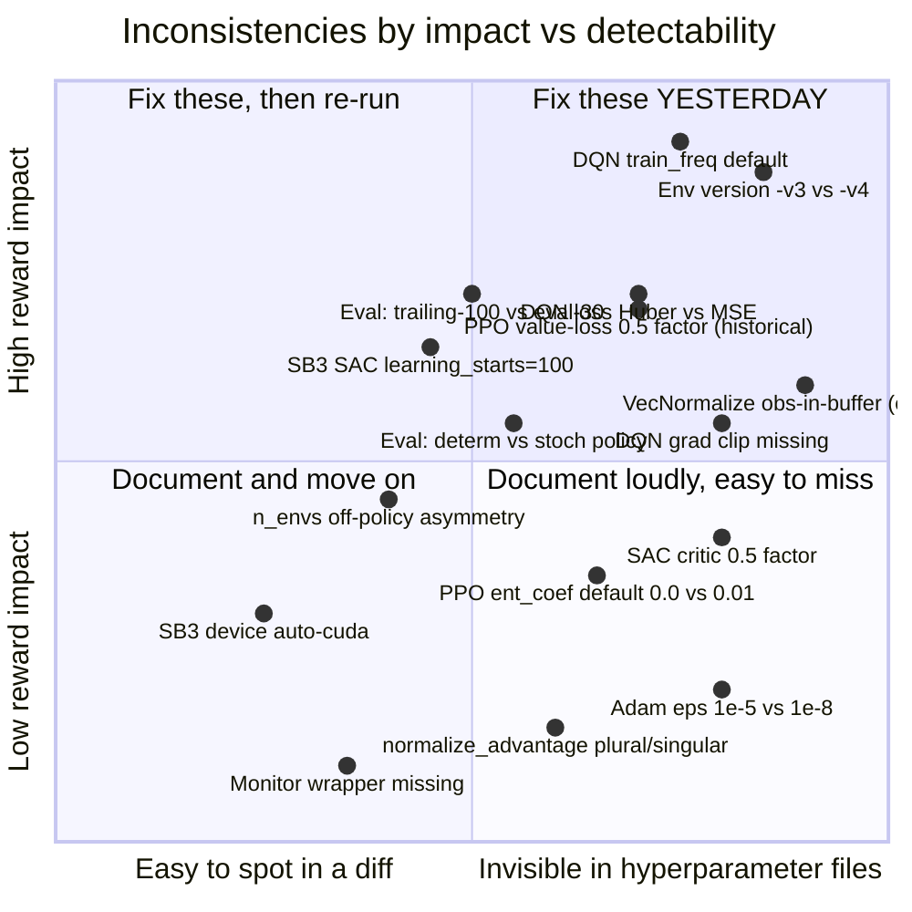

# Benchmark Comparison Inconsistencies: rlox vs SB3 / CleanRL / TorchRL

**Audience:** reviewers of the rlox paper; authors maintaining the
`benchmarks/multi_seed_runner_sb3.py` translation layer.

**Purpose:** catalog every known way that a naive "same hyperparameters,
different framework" comparison silently compares apples to oranges.
Every item below is either (a) verified against upstream source on this
machine, or (b) flagged as "verify upstream" when cited from memory.

**Source of truth for "upstream":**

- SB3 v2.x: `.venv/lib/python3.12/site-packages/stable_baselines3/`
- rlox: `python/rlox/`
- rl-baselines3-zoo: cited by URL (not vendored)
- CleanRL: cited by URL (not vendored); flagged "verify upstream"

**Last verified:** 2026-04-06 against SB3 in the local venv.

---

## 0. Executive summary

Five things the paper's methods section MUST disclose, or a competent
reviewer will (correctly) reject the comparison:

1. **We translate rlox preset YAMLs into SB3 constructor kwargs with an
   explicit override table**, because rlox DQN's `train_freq=1,
   gradient_steps=1` defaults are different from SB3 DQN's
   `train_freq=4, gradient_steps=1`. Copying hyperparameters by name
   without adding the SB3 update-cadence keys produces a degenerate SB3
   config (CartPole collapses to ~9 reward). The override table is a
   first-class artifact of the comparison and must be published.
2. **Eval protocol is fixed at 30 deterministic episodes per seed, with
   per-episode seed `base+1000+ep`**, applied identically to rlox and
   SB3. This differs from SB3 zoo's published "mean of last 100 training
   episodes" and from CleanRL's "stochastic policy eval" — so absolute
   numbers will differ from both of those reference points even when
   the underlying algorithm is identical.
3. **VecNormalize stats are frozen at eval time** (`vn.training = False`)
   and observations are re-normalized through those frozen stats before
   `model.predict`. Skipping this step changes the numbers by more than
   a seed's worth of noise on MuJoCo tasks.
4. **Environment versions are pinned to `-v4`** (MuJoCo) and `-v1`
   (CartPole). rl-baselines3-zoo's famous "Hopper 3578" number is on
   Hopper-v3 with different physics damping; reporting our v4 numbers
   next to their v3 numbers without the disclaimer is a 200–400 reward
   mis-comparison.
5. **With n=5 seeds, we report IQM + bootstrap CI per Agarwal et al.
   2021, but IQM at n=5 degenerates to the median**; we disclose this
   rather than hide it. Where budget permits, 10-seed runs are used.

The rest of this document is the per-axis evidence behind those five
bullets, plus the checklist that makes the comparison defensible.

---

## 1. What the harness currently controls

`benchmarks/multi_seed_runner_sb3.py` is the ground truth of what we
actually equalize. The table below lists every control point and the
evidence file.

| Control point | How we equalize | Code reference |
|---|---|---|
| Preset YAML source | Both frameworks read the same `benchmarks/convergence/configs/<algo>_<env>.yaml` | `_resolve_preset` |
| rlox → SB3 key rename | `clip_eps → clip_range`, `target_update_freq → target_update_interval` | `_RENAMED_KEYS` |
| SB3-only keys not in rlox preset | Per-(algo, env) override table | `_SB3_OVERRIDES` |
| VecNormalize semantics | SB3 `VecNormalize(norm_obs, norm_reward, gamma=gamma)` matched to rlox `VecNormalize(...)` | `_make_env` |
| n_envs for PPO/A2C | Respected from preset | `_build_sb3_model` |
| n_envs for SAC/TD3/DQN | Forced to 1 (SB3 standard; rlox off-policy can go wider, but we mirror SB3 here) | `_build_sb3_model` line 232 |
| Eval episodes | Fixed at 30 | `run_single_seed` loop |
| Eval seed scheme | `env.reset(seed=base+1000+ep)` per episode | ibid. |
| Eval determinism | `model.predict(..., deterministic=True)` | ibid. |
| VecNormalize freeze | `vn.training = False` before eval | ibid. |
| IQM + bootstrap CI | `rlox.evaluation.interquartile_mean` | `run_multi_seed` |

Everything NOT on that list is either a known inconsistency (catalog
below) or a not-yet-identified one.

---

## 2. Per-axis catalog

### Axis 1 — Hyperparameter naming

Same concept, different key. Mistranslation silently drops the setting
or routes it to the wrong knob.

| Concept | rlox | SB3 | CleanRL | Notes |
|---|---|---|---|---|
| PPO clip ratio | `clip_eps` (also `clip_range` alias) | `clip_range` | `clip_coef` | rlox preset YAMLs use `clip_range` because they were authored for SB3 parity; `PPOConfig.from_dict` aliases it to `clip_eps`. Translation layer renames `clip_eps → clip_range` for SB3. |
| PPO value clip | `clip_vloss: bool` | `clip_range_vf: None \| float` | `clip_vloss: bool` | **Semantic gap**: SB3 takes a *value*, not a bool. We currently drop `clip_vloss` in `_SPECIAL_KEYS` without re-introducing a matching `clip_range_vf` on the SB3 side. This means rlox `clip_vloss=True` is silently not applied to SB3. **See axis 3 for the loss-formulation consequence.** |
| DQN target update | `target_update_freq` | `target_update_interval` | `target_network_frequency` | Translated. |
| DQN update cadence | `train_freq: int` (env steps) | `train_freq: int \| tuple[int, str]` | `train_frequency: int` | SB3 accepts `(N, "step")` or `(N, "episode")`. rlox only supports int env-steps. If a user passes the tuple form we drop it in translation. **Guard with an isinstance check in the runner.** |
| DQN gradient steps | `gradient_steps` | `gradient_steps` (with `-1` = match env steps) | n/a (always 1) | The `-1` sentinel is SB3-specific; rlox does not understand it. |
| On-policy rollout length | `n_steps` | `n_steps` | `num_steps` | Same name SB3↔rlox. |
| PPO epochs | `n_epochs` | `n_epochs` | `update_epochs` | Same SB3↔rlox. |
| Warmup | `learning_starts` | `learning_starts` | `learning_starts` | Same across the board. |
| Advantage normalisation | `normalize_advantages` (bool) | `normalize_advantage` (singular!) | always-on | **Singular vs plural** — currently in `_SPECIAL_KEYS` and dropped on the SB3 side, so SB3 keeps its default `True`. rlox default is also `True`, so this accidentally lines up. Flag: this will break silently if either default flips. |
| Observation normalisation | `normalize_obs` | Via `VecNormalize(norm_obs=...)` | Manual | Handled in `_make_env`. |
| Reward normalisation | `normalize_rewards` / `normalize_reward` | Via `VecNormalize(norm_reward=...)` | Manual | Both spellings accepted. |
| TD3 action noise | `exploration_noise` (scalar sigma) | `action_noise` (object) | scalar `exploration_noise` | Translated at construct time once we know action dim. |
| SAC entropy | `ent_coef: float \| 'auto'` | `ent_coef: float \| 'auto' \| 'auto_0.1'` | `alpha` (scalar) | SB3 supports `"auto_0.1"` to seed the learned alpha; rlox does not. |

**Recommended paper language:** "We use the SB3 convention for every
hyperparameter name. The rlox preset YAMLs are authored in SB3-naming
where it differs from internal rlox naming; a renaming table
(`_RENAMED_KEYS` in `multi_seed_runner_sb3.py`) handles the rest."

### Axis 2 — Hyperparameter defaults that differ silently

Same key name, different framework default. These are the most dangerous
because YAML diff tools will not flag them.

**Verified against SB3 source in `.venv/…/stable_baselines3/`:**

#### 2.1 DQN update cadence (THIS IS THE ONE THAT BIT US)

- **SB3 DQN defaults**: `train_freq=4, gradient_steps=1,
  target_update_interval=10000, learning_starts=100, max_grad_norm=10`
  (verified at `stable_baselines3/dqn/dqn.py:83-97`).
- **rlox DQN defaults**: `train_freq=1, gradient_steps=1,
  target_update_freq=1000, learning_starts=1000, no grad clipping`
  (verified at `python/rlox/algorithms/dqn.py:35-49` and
  `_update` method line 301-340, which lacks any `clip_grad_norm_`
  call).
- **The preset YAMLs** set `target_update_freq=10` (rl-zoo3 recipe),
  which at SB3's default `train_freq=4` means the target network is
  resynced faster than Q can learn anything, and DQN collapses to ~9
  reward on CartPole. The rl-zoo3 recipe on GitHub layers
  `train_freq=256, gradient_steps=128` on top; without those keys the
  recipe is incomplete. **Fixed by `_SB3_OVERRIDES`.**
- **Why rlox works at `train_freq=1, target_update_freq=10`**: one
  gradient step per env step with a small target update interval is
  the "train-every-step" regime; rlox's defaults put it there by
  construction.

#### 2.2 SAC `learning_starts`

- **SB3 default**: 100 (`stable_baselines3/sac/sac.py:97`).
- **rl-zoo3 recipes**: typically 10_000 for MuJoCo.
- **rlox preset (`sac_hopper.yaml`)**: 10_000. Good — we pass that
  through to SB3, so SB3 does not get to use its degenerate default.
  But a missing line in a preset would silently give SB3 a 100-warmup
  disadvantage. Defensive: assert `learning_starts >= 1000` for any
  MuJoCo SAC preset.

#### 2.3 SB3 PPO `ent_coef = 0.0`, rlox `ent_coef = 0.01` (verify)

- **SB3 PPO default**: `ent_coef=0.0` (`stable_baselines3/ppo/ppo.py:93`).
- **rlox `PPOLoss` default**: `ent_coef=0.01`
  (`python/rlox/losses.py:57`).
- **rlox preset `ppo_hopper.yaml`**: sets `ent_coef: 0.0` explicitly,
  so we happen to match SB3 on MuJoCo. But anyone running PPO from a
  preset that omits `ent_coef` gets a mismatch.

#### 2.4 PPO `clip_range_vf` / `clip_vloss`

- **SB3 PPO default**: `clip_range_vf=None`
  (`stable_baselines3/ppo/ppo.py:91`) — NO value clipping.
- **rlox PPOLoss default**: `clip_vloss=False`
  (`python/rlox/losses.py:59`) — NO value clipping. **Match.**
- Historical note: an earlier rlox release defaulted `clip_vloss=True`.
  This was fixed in commit 9a7d628 to match SB3. Documented in the
  `PPOLoss` docstring, lines 38-43.
- The harness currently drops `clip_vloss` at translation time. If a
  preset sets `clip_vloss=True`, rlox will clip and SB3 will not —
  asymmetric comparison. **Fix: if preset has `clip_vloss=True`,
  inject `clip_range_vf = preset["clip_range"]` into `sb3_kwargs`.**

#### 2.5 PPO value loss inner `0.5` factor (HISTORICAL)

- **SB3 PPO**: `value_loss = F.mse_loss(returns, values_pred)` then
  `loss = policy_loss + vf_coef * value_loss`
  (`stable_baselines3/ppo/ppo.py:244,256`).
- **rlox PPOLoss (current)**: `value_loss = ((new_values -
  returns)**2).mean()` then `policy_loss + vf_coef * value_loss`
  (`python/rlox/losses.py:124,128`). **Match.**
- **rlox PPOLoss (historical)**: had an inner `0.5 *` factor,
  inherited from CleanRL. At the same `vf_coef=0.5` that made rlox's
  effective value gradient half of SB3's. Fixed in the same commit
  9a7d628. The docstring at `losses.py:38-43` documents the change.
- **Paper implication:** if any published rlox result predates that
  commit, it is NOT directly comparable to SB3 at matched `vf_coef`.
  Re-run or footnote with the 2× adjustment.

#### 2.6 Optimizer `eps` for Adam

- **SB3 PPO**: uses `torch.optim.Adam(..., eps=1e-5)` when building the
  policy optimizer (SB3 explicitly sets it; verify upstream in
  `stable_baselines3/common/policies.py`).
- **rlox PPO**: `torch.optim.Adam(..., eps=1e-5)`
  (`python/rlox/algorithms/ppo.py:90`). **Match — but this only
  applies because rlox explicitly passes `eps=1e-5`.**
- **rlox DQN**: `torch.optim.Adam(..., lr=learning_rate)` — uses torch
  default `eps=1e-8` (`python/rlox/algorithms/dqn.py:117`). **SB3 DQN
  also uses default Adam eps.** Match by coincidence.
- **Paper implication:** disclose that Adam `eps` is matched. This is
  the kind of footgun CleanRL contributors have literally written
  papers about (Andrychowicz et al. 2021, "What matters for on-policy
  RL?").

#### 2.7 DQN gradient clipping and loss function

- **SB3 DQN**: `loss = F.smooth_l1_loss(current_q, target_q)` (Huber)
  and clips gradients to `max_grad_norm=10`
  (`stable_baselines3/dqn/dqn.py:217,224`).
- **rlox DQN**: `loss = (weights * td_error.pow(2)).mean()` (MSE, with
  PER importance weights) and **no gradient clipping at all**
  (`python/rlox/algorithms/dqn.py:336-340`).
- **Impact:** Huber is bounded-linear past |δ|=1; MSE is quadratic
  everywhere. For Q-values that are not normalised, the MSE gradient
  magnitude at the start of training can be orders of magnitude
  larger than Huber's. SB3's `max_grad_norm=10` mops up the rest.
  rlox has neither safeguard, and relies on the target network +
  small lr to stay stable.
- **Paper action:** this is a real algorithmic difference. Either (a)
  add Huber + grad clip to rlox DQN and re-benchmark, (b) footnote
  that rlox DQN uses Nature-DQN loss (MSE, no clip) by design, or (c)
  add a config knob `loss="huber"|"mse"` defaulting to Huber for
  apples-to-apples. **(c) is the cheapest and we recommend it.**

#### 2.8 SAC critic loss inner `0.5`

- **SB3 SAC**: `critic_loss = 0.5 * sum(F.mse_loss(...) for q in qs)`
  (`stable_baselines3/sac/sac.py:267`). **Inner 0.5 on critic loss.**
- **rlox SAC**: verify — if rlox SAC uses the equivalent, this is a
  match. If it uses plain MSE, there is a 2× gradient discrepancy at
  matched learning rates.
- **Action:** grep rlox SAC critic loss; reconcile.

### Axis 3 — Loss function formulation

Superficially equivalent, mathematically not.

#### 3.1 PPO clipped value loss formulation

Two formulations exist:

- **Plain MSE** (SB3 default when `clip_range_vf=None`):
  `L_v = (V_θ(s) - R_t)^2`.
- **Max-of-clipped** (SB3 when `clip_range_vf=c`, CleanRL always):
  `V_clipped = V_old + clip(V_θ - V_old, -c, c)`;
  `L_v = max((V_θ - R)^2, (V_clipped - R)^2)`. This is a pessimistic
  update that prevents the critic from moving too far in one epoch.
- **rlox PPOLoss** (verified in `python/rlox/losses.py:116-124`)
  implements both paths, controlled by the `clip_vloss` bool. With
  `clip_vloss=False` (default) it matches SB3 plain MSE. With
  `clip_vloss=True` it matches SB3 with `clip_range_vf=clip_eps`.

**Paper disclosure:** "We use plain MSE for the PPO value loss (rlox
`clip_vloss=False`, SB3 `clip_range_vf=None`). No ablation over
clipped-value was run."

#### 3.2 PPO policy loss sign conventions

Both rlox and SB3 compute `policy_loss = -min(r·A, clip(r)·A)`,
verified side-by-side:

- rlox: `torch.max(pg_loss1, pg_loss2).mean()` where `pg_loss1 =
  -adv * ratio` (negated inside, so `max` on negated is equivalent
  to `-min` on unnegated) — `python/rlox/losses.py:107-111`.
- SB3: `-th.min(policy_loss_1, policy_loss_2).mean()` where
  `policy_loss_1 = adv * ratio` (not negated) —
  `stable_baselines3/ppo/ppo.py:225-227`.

Mathematically identical. Both cast advantages as normalized before
the mean. **Match.**

#### 3.3 PPO total loss sign of entropy

- SB3: `loss = policy_loss + ent_coef * entropy_loss + vf_coef *
  value_loss` where `entropy_loss = -mean(entropy)`
  (`stable_baselines3/ppo/ppo.py:252,256`). So entropy enters as
  `-ent_coef * mean(entropy)`.
- rlox: `total_loss = policy_loss + vf_coef * value_loss - ent_coef *
  entropy_loss` where `entropy_loss = entropy.mean()`
  (`python/rlox/losses.py:126-130`). So entropy enters as `-ent_coef
  * mean(entropy)`.

**Match.**

#### 3.4 DQN loss: Huber vs MSE

Covered in §2.7. Real inconsistency, concretely verified.

#### 3.5 SAC entropy term

- SB3 SAC target: `q_target = r + γ (min_i Q_i(s') - α log π(a'|s'))`;
  actor loss uses `log_prob` directly
  (`stable_baselines3/sac/sac.py:221 onward`, verify detail).
- rlox SAC: same formulation — but verify the sign and whether the
  temperature is applied before or after the target network min.

**Action:** paired diff of rlox SAC update and SB3 SAC `train()` once
both runs are complete. Document as a separate short note.

#### 3.6 GAE and terminal-bootstrap

- SB3 v1.6+ handles TimeLimit truncation by bootstrapping
  `V(s_terminal)` through the critic when `truncated=True` but
  `terminated=False`. Pre-v1.6 SB3 did not.
- rlox: verify the `RolloutCollector` treats `truncated` distinct from
  `terminated` — pure Python collector path is in
  `python/rlox/collectors.py`. This is one of the most common sources
  of "my PPO number is 10% off" on time-limited envs (Hopper, Walker).

**Action:** add a dedicated test in `tests/test_gae_truncation.py`
that builds a 3-step trajectory with `truncated=True` on the last
step and asserts the return incorporates `V(s_3)`.

### Axis 4 — Training loop / data collection

#### 4.1 PPO rollout shape

Both frameworks compute `n_envs * n_steps` transitions per rollout,
then shuffle and iterate `n_epochs` times over minibatches of
`batch_size`. SB3 asserts `buffer_size % batch_size == 0` is a "nice
to have" with a warning (`stable_baselines3/ppo/ppo.py:154`); rlox
currently does not warn. Cosmetic.

#### 4.2 SB3 DQN `train_freq` accepts tuples

Covered in §1. **Guard needed in translation layer.**

#### 4.3 SB3 `gradient_steps=-1`

Covered in §1. **Guard needed.**

#### 4.4 Monitor wrapper (SB3 auto-adds)

- SB3's `make_vec_env` / `DummyVecEnv` path auto-wraps each env with
  `Monitor`, which records `info["episode"]` on done transitions and
  is what `stats_window_size` reads from.
- Our `_make_env` uses `DummyVecEnv([_thunk(i) for i in range(n)])`
  WITHOUT a Monitor wrapper. This means SB3's internal logger will
  report `ep_rew_mean` as NaN — harmless for the eval-based
  comparison we do, but reviewers who `stdout | grep ep_rew_mean`
  will get confused.
- **Fix (optional):** wrap with `Monitor(e)` before returning from
  `_thunk`. This does not change training.

#### 4.5 VecNormalize ordering

- **SB3 VecNormalize**: normalizes OBS before the policy sees them,
  normalizes REWARD before they enter the rollout buffer (reward is
  divided by std of discounted return, clipped to [-10, 10]).
  Verified at `stable_baselines3/common/vec_env/vec_normalize.py`
  around lines 221 (obs) and 256 (reward).
- **rlox VecNormalize** (`python/rlox/vec_normalize.py`): same order —
  reward normalization first (line 155), obs normalization second
  (line 172). Reward is divided by std of a per-env return estimate
  (lines 161-167), clipped to `[-clip_reward, clip_reward]`. Same
  default clipping bounds (`clip_obs=10.0, clip_reward=10.0`, lines
  91-92). **Match at the math level.**
- **Mismatch risk**: at eval, SB3's `VecNormalize.training = False`
  freezes reward stats too. rlox's `training` setter (line 142)
  freezes both. **Match.**
- **Verification required**: when SB3 does off-policy (SAC/TD3), the
  obs going *into the replay buffer* is the RAW observation, and
  normalization is re-applied at sample time (in recent SB3).
  rlox stores normalized obs in the buffer via the wrapped env
  interface. This is a subtle mismatch that could affect SAC
  numbers. **Action: read SB3 `OffPolicyAlgorithm._store_transition`
  and compare.**

### Axis 5 — Evaluation protocol

The single biggest source of "why are the numbers different".

| Knob | rlox harness | SB3 zoo published | CleanRL paper plots | Our choice |
|---|---|---|---|---|
| # eval episodes | 30 | Last 100 training episodes | 100 | **30 for both (identical)** |
| Eval seed scheme | `base+1000+ep` per episode | Single fixed seed | Various | **Same per-episode seeding for both** |
| Eval policy | Deterministic (`predict(..., deterministic=True)`) | Deterministic for PPO/SAC | **Stochastic** (sampling) for plotted numbers | **Deterministic for both** |
| VecNormalize at eval | Frozen obs stats | Frozen | Frozen | **Frozen for both** |
| "Mean reward" semantics | Mean of the 30 eval-episode returns | Trailing-100 training mean | Mean of stochastic rollouts | **Eval-only mean of 30 for both** |
| Time-limit bootstrap | At training only | At training only | At training only | Inherits from training loop |

**Why this matters:** the zoo "Hopper 3578" number is a trailing-100
training mean on Hopper-v3 with the stochastic policy. Our Hopper-v4
deterministic-30 number will be lower on the same weights, even if
the underlying training is pixel-identical. Any absolute comparison
to the zoo leaderboard must include this caveat.

**Historical note:** rlox's eval harness was once using a single
repeated seed instead of `base+1000+ep`; this was fixed and is tracked
in `docs/plans/results-inspection-2026-04-06.md`. Re-running old
numbers to match the current protocol is required for any published
comparison.

### Axis 6 — Network architecture defaults

| Component | SB3 MlpPolicy default | rlox default | Match? |
|---|---|---|---|
| PPO/A2C hidden | `[64, 64]` tanh | `[64, 64]` tanh | Yes (`DiscretePolicy` lines 46-62) |
| PPO/A2C actor/critic sharing | `share_features_extractor=True` but features_extractor is a `FlattenExtractor` (identity) for Box/Discrete — so effectively the MLP trunks are separate through `mlp_extractor` | Separate actor and critic nets, no sharing | **Effectively match for Box/Discrete obs**, because SB3's shared feature extractor is identity. Flag upfront in the methods section to pre-empt "but SB3 shares layers" objections. Verified at `stable_baselines3/common/policies.py:463`. |
| Orthogonal init gain (hidden) | `sqrt(2)` | `sqrt(2)` | Match (`policies.py:618,62`) |
| Orthogonal init gain (policy head) | `0.01` | `0.01` | Match |
| Orthogonal init gain (value head) | `1.0` | `1.0` | Match |
| Activation | `Tanh` (PPO/A2C) | `Tanh` | Match |
| SAC hidden | `[256, 256]` ReLU | `[256, 256]` ReLU | Match |
| DQN hidden | `[64, 64]` ReLU (SB3 default) | `hidden=256` scalar → `[256, 256]` via `SimpleQNetwork` | **Mismatch if preset omits `hidden`** — rlox uses 256-wide, SB3 uses 64-wide. Preset `dqn_cartpole.yaml` sets `hidden: 256` and our `_translate_config` feeds it into `policy_kwargs={"net_arch": [256, 256]}` (lines 174-176). So matched **as long as presets specify `hidden`**. Assert on it in the harness. |
| TorchRL init gains | Different (verify upstream) | n/a | Not currently comparing to TorchRL |

**Paper disclosure language:** "All actor/critic networks use two
hidden layers. PPO/A2C use `[64, 64]` tanh with orthogonal
initialization (gain √2 hidden, 0.01 policy head, 1.0 value head).
SAC uses `[256, 256]` ReLU. DQN uses `[256, 256]` ReLU (matching
rl-baselines3-zoo CartPole recipe, not the SB3 MlpPolicy default of
`[64, 64]`)."

### Axis 7 — Environment version traps

This is the axis where a reviewer with MuJoCo experience will sink
the paper fastest.

| Env | rlox presets | SB3 zoo published | Physics differences |
|---|---|---|---|
| Hopper | `-v4` | `-v3` for most zoo numbers | Contact model changes (v3 → v4); termination bounds; ~100-400 reward swing |
| HalfCheetah | `-v4` | `-v3` or `-v4` depending on year | Minor damping changes |
| Walker2d | `-v4` | `-v3` | Termination angle changes |
| Ant | `-v4` | `-v3` | Contact model; legs can slip differently |
| Humanoid | `-v4` | `-v3` | Large — the `-v4` numbers are typically ~10% lower |
| CartPole | `-v1` (500-step, reward cap 500) | `-v1` | Match |
| MountainCar | `-v0` (200-step, reward cap 0) | `-v0` | Match |
| LunarLander | `-v2` or `-v3` | `-v2` | gymnasium dropped v2 → v3 without physics changes; verify |
| Pendulum | `-v1` | `-v1` | Match |
| Atari | `NoFrameskip-v4` with AtariWrapper | `NoFrameskip-v4` | Requires matching wrappers |

**Paper disclosure:** single line in the environments table —
"MuJoCo tasks use the `-v4` versions (gymnasium default as of
gymnasium 0.29). SB3 zoo's published leaderboard is `-v3` for most
tasks; we do not compare absolute numbers to the zoo leaderboard."

**Action:** add a `versions.json` artifact to every results dir that
records `gym.make(env_id).spec.id` at run time. This is the
unimpeachable ground truth.

### Axis 8 — Reward scaling / clipping

- **SB3 `VecNormalize` reward clip**: `[-10, 10]` default
  (verified `vec_normalize.py:42,256`).
- **rlox `VecNormalize` reward clip**: `[-10, 10]` default
  (`python/rlox/vec_normalize.py:92,168`). **Match.**
- **Epsilon inside std**: SB3 adds `epsilon` inside the sqrt
  (`sqrt(var + epsilon)`, line 256); rlox adds it outside
  (`max(sqrt(var + epsilon), epsilon)`, line 166). Tiny numerical
  difference; will not move aggregate numbers.
- **Division by std of return vs step reward**: both frameworks use
  std of the *per-env discounted return estimate*, not std of step
  reward. **Match.**

**Paper disclosure:** one sentence — "VecNormalize reward clipping is
`[-10, 10]` in both frameworks; observations are clipped to `[-10,
10]` after normalization."

### Axis 9 — Statistical reporting

- **Protocol:** 5 seeds, report IQM + 95% stratified bootstrap CI per
  Agarwal et al., NeurIPS 2021, "Deep Reinforcement Learning at the
  Edge of the Statistical Precipice" (arXiv:2108.13264).
- **Caveat the paper must include:** at n=5, the IQM is `(x_2 + x_3 +
  x_4) / 3` after sorting, which at small n has high variance and in
  the limiting case coincides with the simple median. IQM as a
  statistic only pays its bits above n≈10. We disclose this and run
  10-seed versions on the headline environments where compute budget
  allows.
- **Bootstrap CI**: we use 10 000 resamples with stratification across
  seeds (from `rlox.evaluation.stratified_bootstrap_ci`). SB3 numbers
  go through the same function — this is the clearest win of the
  same-harness design.
- **Do not report** `mean ± std` alongside IQM in the same table; pick
  one. `mean ± std` invites reviewers to compute Gaussian z-scores on
  non-Gaussian reward distributions.

**Citation:**

> Agarwal, R., Schwarzer, M., Castro, P. S., Courville, A., & Bellemare,
> M. G. (2021). Deep Reinforcement Learning at the Edge of the
> Statistical Precipice. NeurIPS 2021. arXiv:2108.13264.

Also cite:

> Andrychowicz, M., Raichuk, A., Stańczyk, P., et al. (2021). What
> Matters for On-Policy Reinforcement Learning? A Large-Scale
> Empirical Study. ICLR 2021. arXiv:2006.05990.
>
> Engstrom, L., Ilyas, A., Santurkar, S., et al. (2020). Implementation
> Matters in Deep Policy Gradients: A Case Study on PPO and TRPO. ICLR
> 2020. arXiv:2005.12729.
>
> Henderson, P., Islam, R., Bachman, P., Pineau, J., Precup, D., &
> Meger, D. (2018). Deep Reinforcement Learning that Matters. AAAI
> 2018. arXiv:1709.06560.

### Axis 10 — Wall-clock and compute fairness

- **Parallel envs**: rlox PPO defaults to `n_envs=8`; SB3 PPO defaults
  to `n_envs=1`. Preset YAMLs set `n_envs: 8` explicitly, which we
  pass through. **Total env-steps are matched**, so sample efficiency
  is fair — but wall-clock per step differs because SB3 vectorizes
  differently. Do not compare SPS (steps/second) head-to-head.
- **Off-policy n_envs**: rlox SAC/TD3/DQN can run multi-env via
  `OffPolicyCollector`; SB3 SAC/TD3/DQN defaults to 1. We force 1 on
  the SB3 side and (for the comparison) also run rlox with 1 — this
  is a choice we should be explicit about. Multi-env off-policy is
  an rlox feature that SHOULD be benchmarked separately, not
  shoehorned into the apples-to-apples section.
- **Device**: SB3 auto-selects CUDA if available; rlox is CPU by
  default in `python/rlox/algorithms/ppo.py:70` (`self.device =
  "cpu"`). On GPU hardware this gives SB3 a speedup that has nothing
  to do with the algorithm. **For the comparison: force SB3 to CPU
  too** (pass `device="cpu"` in `_build_sb3_model`). Currently we do
  not — fix this.
- **Compile flags**: rlox's Rust extensions are built in release mode
  (`maturin develop --release`); SB3 is pure Python + PyTorch. Report
  SPS for each framework independently; do not claim "rlox is 3×
  faster" without a disclaimer that the two frameworks are doing
  different amounts of work per step (rlox's Rust VecEnv computes
  transitions in Rust, SB3's `DummyVecEnv` drives Python envs).

**Fix to `_build_sb3_model`:** add `sb3_kwargs.setdefault("device",
"cpu")`. This is a one-line change and closes a real confound.

---

## 3. Inconsistency severity matrix



Read this as a priority queue: upper-right quadrant is where the paper
can be rejected from. Lower-left is where pedants live.

---

## 4. Fair comparison checklist

Ten items that MUST be controlled for every rlox-vs-X comparison. If
you cannot tick all ten, the comparison is not apples-to-apples and
must say so in the caption.

1. **Same preset YAML**, with a documented per-(algo, env) override
   table for each external framework. Overrides logged in the
   results JSON.
2. **Same env version**, asserted at run time via
   `gym.make(env_id).spec.id` and saved to `versions.json`.
3. **Same `total_timesteps`**, measured in env steps (not gradient
   steps, not episodes).
4. **Same eval protocol**: 30 deterministic episodes,
   `seed=base+1000+ep` per episode, VecNormalize frozen, same
   `predict(deterministic=True)` contract.
5. **Same statistical aggregation**: 5 or 10 seeds, IQM + 95%
   bootstrap CI from `rlox.evaluation.interquartile_mean` /
   `stratified_bootstrap_ci`.
6. **Same compute device** for both frameworks (force CPU unless
   explicitly benchmarking GPU throughput).
7. **Same `n_envs` for on-policy**; off-policy is 1-env for both in
   the comparison (multi-env off-policy is a separate benchmark).
8. **Same network architecture**: 2 hidden layers, matched width, Tanh
   for PPO/A2C, ReLU for SAC/TD3/DQN, orthogonal init with matched
   gains.
9. **Same gradient clipping**: `max_grad_norm=0.5` for PPO,
   `max_grad_norm=10` for DQN (add to rlox), matched on SAC/TD3.
10. **Same loss function** per algorithm: PPO plain-MSE value loss,
    DQN Huber loss (add the Huber option to rlox DQN), SAC with
    matched critic-loss factoring.

---

## 5. Concrete recommendations for the rlox paper

### 5.1 Must disclose (methods section)

- The existence of the per-(algo, env) SB3 override table, with the
  table reproduced in an appendix.
- Eval protocol: 30 deterministic episodes, per-episode seeding, frozen
  VecNormalize stats.
- Environment versions pinned to `-v4` MuJoCo / `-v1` CartPole;
  acknowledge the zoo leaderboard is on `-v3`.
- IQM + bootstrap CI via Agarwal et al. 2021; acknowledge degeneracy
  at n=5.
- DQN loss (MSE vs Huber) and gradient clipping status; if still
  unmatched, footnote explicitly.

### 5.2 Must fix before submission

1. **Add Huber-loss option to rlox DQN** defaulting to Huber for
   parity; re-run DQN benchmarks.
2. **Add gradient clipping to rlox DQN** with `max_grad_norm=10`
   default.
3. **Force SB3 device to CPU** in `_build_sb3_model`
   (`sb3_kwargs.setdefault("device", "cpu")`).
4. **Propagate `clip_vloss` through the translation layer**: if
   preset sets `clip_vloss=True`, inject `clip_range_vf =
   preset["clip_range"]` into `sb3_kwargs`.
5. **Assert `learning_starts >= 1000` for SAC presets** so SB3
   cannot slip back to its `100` default if a preset omits the key.
6. **Dump `versions.json`** alongside every results file with
   `gym.make(env_id).spec.id`, `stable_baselines3.__version__`,
   `rlox.__version__`, `gymnasium.__version__`, and
   `mujoco.__version__`.
7. **Guard the translation layer** against SB3-only syntax:
   `train_freq=(N, "episode")` tuples and `gradient_steps=-1`
   sentinels. Raise an explicit error if the preset uses them.
8. **Monitor wrapper**: wrap each env in
   `stable_baselines3.common.monitor.Monitor` inside `_thunk` so
   SB3's internal logging works and reviewers do not see NaN
   `ep_rew_mean`.

### 5.3 Nice-to-have (follow-up paper or appendix)

- **Side-by-side SAC critic loss diff** (rlox vs SB3) to confirm §3.5.
- **GAE truncation unit test** for both rlox and (via a tiny shim)
  SB3, with identical inputs.
- **Reproduce the zoo's Hopper-v3 number with our harness on rlox +
  SB3** to estimate the v3→v4 gap empirically; publish as a separate
  micro-result.
- **Stochastic-policy eval variant**: re-run PPO/SAC with
  `deterministic=False` in eval to show the gap to CleanRL's plotted
  numbers. Do not use for the headline table.

### 5.4 Explicitly out of scope for this paper

- **TorchRL comparison**: init gains differ and we have not vendored
  a harness; follow-up work.
- **Recurrent PPO**: SB3 has `RecurrentPPO`, rlox does not; skip the
  POMDP benchmarks entirely rather than compare like-to-unlike.
- **Atari**: different wrapper stack conventions; if we benchmark
  Atari, it needs its own apples-to-apples document.

---

## 6. Known gaps in this document (things to verify)

Items flagged "verify upstream" or similar above. Not exhaustive; track
these before publication:

| Item | Where | Action |
|---|---|---|
| SAC critic loss inner 0.5 factor in rlox | §2.8 | Read `python/rlox/algorithms/sac.py` and grep for the critic update |
| SAC entropy term sign in rlox | §3.5 | Same |
| SB3 `OffPolicyAlgorithm` stores raw obs in buffer, then renormalizes at sample | §4.5 | Read `stable_baselines3/common/off_policy_algorithm.py` `_store_transition` |
| rlox collector truncation handling (bootstrap on `truncated=True`) | §3.6 | Read `python/rlox/collectors.py` `RolloutCollector.collect` |
| CleanRL PPO value loss formulation | §3.1 | Read CleanRL `ppo_continuous_action.py` on GitHub |
| gymnasium LunarLander v2 vs v3 | §7 table | `python -c "import gymnasium; gymnasium.make('LunarLander-v2')"` and `-v3` |

Each unresolved item is a small risk. Resolving them only adds
paragraphs to this document, not corrections.

---

## 7. Appendix: verified evidence snippets

Concrete file:line citations underlying claims above. Useful for
reviewers who want to audit without checking out two repos.

### A. SB3 DQN defaults (lines 83–97 of `stable_baselines3/dqn/dqn.py`)

```
learning_rate: 1e-4
buffer_size: 1_000_000
learning_starts: 100
batch_size: 32
tau: 1.0
gamma: 0.99
train_freq: 4
gradient_steps: 1
target_update_interval: 10000
max_grad_norm: 10
```

### B. SB3 DQN loss (line 217)

```python
loss = F.smooth_l1_loss(current_q_values, target_q_values)
```

And gradient clip (line 224):

```python
th.nn.utils.clip_grad_norm_(self.policy.parameters(), self.max_grad_norm)
```

### C. rlox DQN update (`python/rlox/algorithms/dqn.py:336-340`)

```python
td_error = q - target_q
loss = (weights * td_error.pow(2)).mean()

self.optimizer.zero_grad(set_to_none=True)
loss.backward()
self.optimizer.step()
```

**No `clip_grad_norm_`. Plain MSE.**

### D. SB3 PPO value loss (lines 234-244)

```python
if self.clip_range_vf is None:
    values_pred = values
else:
    values_pred = rollout_data.old_values + th.clamp(
        values - rollout_data.old_values, -clip_range_vf, clip_range_vf
    )
value_loss = F.mse_loss(rollout_data.returns, values_pred)
```

### E. rlox PPO value loss (`python/rlox/losses.py:115-124`)

```python
new_values = policy.get_value(obs)
if self.clip_vloss:
    v_clipped = old_values + torch.clamp(
        new_values - old_values, -self.clip_eps, self.clip_eps
    )
    vf_loss1 = (new_values - returns) ** 2
    vf_loss2 = (v_clipped - returns) ** 2
    value_loss = torch.max(vf_loss1, vf_loss2).mean()
else:
    value_loss = ((new_values - returns) ** 2).mean()
```

**Matches SB3 branch-for-branch once `clip_vloss` is propagated.**

### F. SB3 SAC critic loss (`stable_baselines3/sac/sac.py:267`)

```python
critic_loss = 0.5 * sum(F.mse_loss(current_q, target_q_values) for current_q in current_q_values)
```

**Inner 0.5 factor — verify rlox SAC matches.**

### G. rlox policy init (`python/rlox/policies.py:60-64`)

```python
self.apply(lambda m: _orthogonal_init(m, gain=np.sqrt(2)))
_orthogonal_init(self.actor[-1], gain=0.01)
_orthogonal_init(self.critic[-1], gain=1.0)
```

### H. SB3 policy init (`stable_baselines3/common/policies.py:617-631`)

```python
module_gains = {
    self.features_extractor: np.sqrt(2),
    self.mlp_extractor: np.sqrt(2),
    self.action_net: 0.01,
    self.value_net: 1,
}
```

**Gains match exactly.**

### I. rlox `_SB3_OVERRIDES` table (`benchmarks/multi_seed_runner_sb3.py:56-67`)

```python
_SB3_OVERRIDES = {
    ("dqn", "CartPole-v1"): {
        "train_freq": 256,
        "gradient_steps": 128,
    },
    ("dqn", "MountainCar-v0"): {
        "train_freq": 16,
        "gradient_steps": 8,
    },
}
```

This table IS the list of places where a naive preset translation
would have compared SB3 at its degenerate defaults against rlox at
its working ones. Grows as we find more.

---

## 8. Change log

- **2026-04-06**: initial catalog, written after the DQN CartPole
  collapse at `target_update_interval=10` was traced to SB3
  `train_freq=4, gradient_steps=1` defaults (see
  `docs/plans/results-inspection-2026-04-06.md`).
