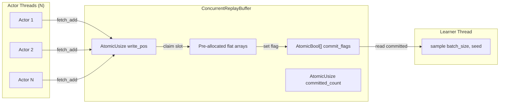
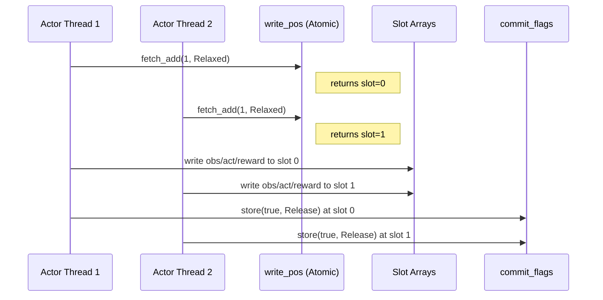
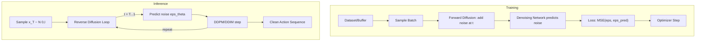

# Plan: Lock-free Concurrent Replay Buffer + Diffusion Policy

## Task 1: Lock-free Concurrent Replay Buffer (Rust)

### Architecture

### Sequence: Concurrent Push

### Key Design Decisions

- `fetch_add` on global `write_pos` for slot claiming (wraps via modulo)
- `AtomicBool` per slot as commit flag (Release on write, Acquire on read)
- `AtomicUsize` for `committed_count` incremented after commit flag set
- Sampling only reads committed slots
- On wrap-around, old commit flags get cleared when slot is reclaimed (set false before write)

## Task 2: Diffusion Policy (Python)

### Components
- `DiffusionPolicyConfig(ConfigMixin)` dataclass
- `NoiseSchedule` class (linear + cosine)
- `DenoisingMLP` network (obs-conditioned noise predictor)
- `DiffusionPolicy` algorithm class satisfying `Algorithm` protocol
