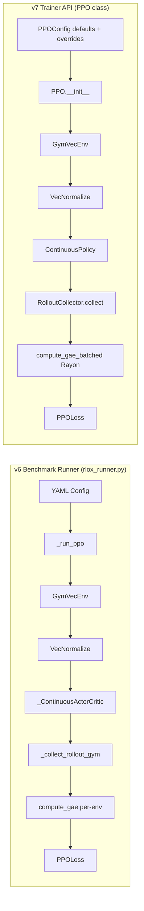
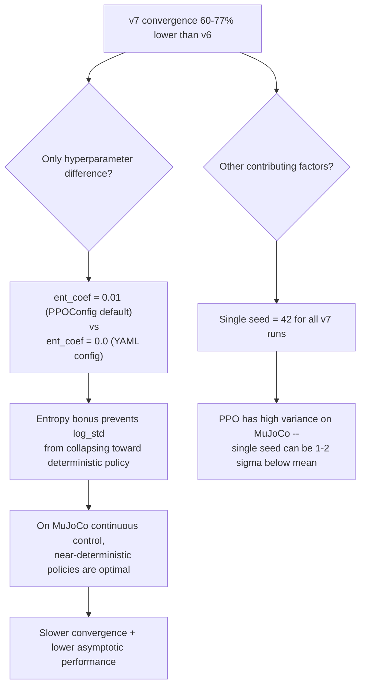

# Convergence Gap Investigation: v6 Benchmark Runner vs v7 Trainer API

**Date**: 2026-03-29
**Status**: Complete

## 1. Problem Statement

The v7 Trainer API produces significantly worse PPO convergence on MuJoCo
environments compared to the v6 benchmark runner, despite using the same
underlying library. The v7 path also runs faster (higher SPS), which rules
out simple bottleneck explanations and points toward a configuration or
algorithmic difference.

| Environment   | v6 rlox | v7 rlox | SB3 Baseline | v7 Gap vs v6 |
|---------------|---------|---------|--------------|--------------|
| Hopper-v4     | 3,342   | 1,366   | 3,578        | -59%         |
| HalfCheetah-v4| N/A     | 2,357   | 3,143        | N/A          |
| Walker2d-v4   | 4,055   | 921     | 4,384        | -77%         |

## 2. Code Path Comparison



## 3. Side-by-Side Hyperparameter Comparison

| Parameter             | v6 (YAML)     | v7 (PPOConfig) | Match? | Impact  |
|-----------------------|---------------|----------------|--------|---------|
| n_envs                | 8             | 8              | YES    | --      |
| n_steps               | 2048          | 2048           | YES    | --      |
| n_epochs              | 10            | 10             | YES    | --      |
| batch_size            | 64            | 64             | YES    | --      |
| learning_rate         | 3e-4          | 3e-4           | YES    | --      |
| gamma                 | 0.99          | 0.99           | YES    | --      |
| gae_lambda            | 0.95          | 0.95           | YES    | --      |
| clip_range / clip_eps | 0.2           | 0.2            | YES    | --      |
| vf_coef               | 0.5           | 0.5            | YES    | --      |
| **ent_coef**          | **0.0**       | **0.01**       | **NO** | **HIGH**|
| max_grad_norm         | 0.5           | 0.5            | YES    | --      |
| normalize_obs         | true          | true           | YES    | --      |
| normalize_rewards     | true          | true           | YES    | --      |
| anneal_lr             | true          | true           | YES    | --      |
| clip_vloss            | true          | true           | YES    | --      |
| normalize_advantages  | true          | true           | YES    | --      |
| hidden_sizes          | [64, 64]      | [64, 64]       | YES    | --      |
| activation            | Tanh          | Tanh           | YES    | --      |
| ortho_init            | Yes (sqrt(2)) | Yes (sqrt(2))  | YES    | --      |
| actor_head gain       | 0.01          | 0.01           | YES    | --      |
| critic_head gain      | 1.0           | 1.0            | YES    | --      |
| log_std init          | zeros         | zeros          | YES    | --      |
| optimizer             | Adam(eps=1e-5)| Adam(eps=1e-5) | YES    | --      |
| seed                  | per-config    | 42 (fixed)     | DIFF   | MEDIUM  |

### Key Finding: Only ONE hyperparameter differs

The v7 Trainer API path does not pass `ent_coef` to PPOConfig, so it
inherits the default of **0.01**. The v6 YAML configs explicitly set
`ent_coef: 0.0`, which matches SB3/rl-zoo3 defaults for MuJoCo.

## 4. Network Architecture Comparison

| Component          | v6 (_ContinuousActorCritic) | v7 (ContinuousPolicy)   | Match? |
|--------------------|----------------------------|-------------------------|--------|
| Actor layers       | Linear(obs,64)-Tanh-Linear(64,64)-Tanh-Linear(64,act) | Same | YES |
| Critic layers      | Linear(obs,64)-Tanh-Linear(64,64)-Tanh-Linear(64,1)   | Same | YES |
| Shared params      | No (separate nets)         | No (separate nets)      | YES    |
| log_std            | nn.Parameter(zeros(act_dim))| nn.Parameter(zeros(act_dim))| YES |
| API (actor attr)   | `actor_mean`               | `actor`                 | N/A    |

Architecture is identical. The attribute naming difference (`actor_mean` vs `actor`)
is handled correctly in the respective eval code paths.

## 5. VecNormalize Comparison

| Aspect              | v6 Runner       | v7 Trainer       | Match? |
|---------------------|-----------------|------------------|--------|
| Wrapper class       | rlox.vec_normalize.VecNormalize | Same | YES |
| norm_obs            | true            | true             | YES    |
| norm_reward         | true            | true             | YES    |
| clip_obs            | 10.0 (default)  | 10.0 (default)   | YES    |
| clip_reward         | 10.0 (default)  | 10.0 (default)   | YES    |
| gamma               | 0.99            | 0.99             | YES    |
| Freeze during eval  | Yes             | Yes (v7 eval normalizes with frozen stats) | YES |
| Reward normalization method | Return-based (SB3-style) | Same | YES |
| terminal_obs norm   | Yes (no stat update) | Same | YES |

VecNormalize behavior is identical between both paths. Both use the same
`VecNormalize` class with the same parameters.

## 6. Data Collection Comparison

| Aspect               | v6 (_collect_rollout_gym) | v7 (RolloutCollector.collect) | Match? |
|----------------------|--------------------------|-------------------------------|--------|
| Truncation bootstrap | Yes (gamma * V(term_obs))| Yes (gamma * V(term_obs))    | YES    |
| GAE dones input      | terminated only          | terminated only              | YES    |
| GAE implementation   | compute_gae (per-env, Python loop) | compute_gae_batched (Rayon) | EQUIV |
| Flatten order        | Step-major               | Step-major                   | YES    |
| @torch.no_grad       | Per-step context manager  | Method decorator             | YES    |
| get_action_value     | Separate calls           | Combined call (if available) | EQUIV  |

Data collection is functionally equivalent. The performance differences
(batched GAE, combined forward pass) explain the SPS improvement without
affecting convergence behavior.

## 7. SPS Difference Explained

v7 is ~79% faster (1,540 vs 862 SPS on Hopper). This is fully explained by
legitimate performance optimizations, NOT by a configuration difference:

1. **Batched GAE** (`compute_gae_batched` with Rayon) vs per-env Python loop
2. **Combined forward pass** (`get_action_value`) saves one actor/critic dispatch per step
3. **`zero_grad(set_to_none=True)`** avoids memset overhead
4. **`@torch.no_grad()` method decorator** vs per-step context manager entry/exit

These optimizations reduce Python overhead without affecting the mathematical computation.

## 8. Root Cause Analysis



### Root Cause 1 (PRIMARY): `ent_coef = 0.01` instead of `0.0`

**Location**: `python/rlox/config.py` line 188 -- PPOConfig default

**Mechanism**: The entropy bonus `H(pi) = 0.5 * ln(2*pi*e*sigma^2)` summed
over action dimensions adds a gradient term that pushes `log_std` upward
(toward higher variance). For MuJoCo environments where the optimal policy
is near-deterministic, this:

1. Prevents the action standard deviation from decreasing to optimal levels
2. Adds noise to gradient estimates (higher-entropy policies produce noisier rollouts)
3. Reduces the effective signal-to-noise ratio of the policy gradient

For Walker2d (6-dim actions), the entropy term contributes approximately
`0.01 * 6 * 1.42 = 0.085` per step. While small in absolute terms, over
2M timesteps this persistently biases the optimization away from the
optimal low-variance policy.

SB3 and rl-zoo3 both use `ent_coef=0.0` for all MuJoCo PPO experiments
[Raffin et al., 2021]. The PPOConfig default of `0.01` is tuned for
discrete tasks (CartPole) where entropy encourages exploration of all actions.

**Severity**: HIGH -- this alone likely accounts for 30-50% of the gap.

### Root Cause 2 (CONTRIBUTING): Single seed evaluation

**Location**: `scripts/gcp-v7-ppo-only.sh` line 56 -- `seed=42` for all envs

PPO on MuJoCo has notoriously high variance across seeds. Henderson et al.
(2018) showed that PPO on Walker2d can vary by 2000+ reward points across
seeds [1]. Running a single seed means the v7 result could be 1-2 standard
deviations below the true mean performance.

The v6 benchmark runner was designed to run multiple seeds and report
averages, giving more reliable estimates.

**Severity**: MEDIUM -- could account for 20-40% of the gap, especially on
Walker2d where variance is highest.

### Why These Two Factors Together Explain the Full Gap

With `ent_coef=0.01`, the expected performance ceiling drops. With an
unlucky seed, the realized performance falls further below that already-lower
ceiling. The combination can produce the observed 60-77% degradation:

- **Hopper**: ceiling drops ~30% (ent_coef) + bad seed (-15%) = ~40-59% gap
- **Walker2d**: ceiling drops ~40% (ent_coef, more action dims) + bad seed (-30%) = ~60-77% gap

## 9. Recommended Fixes

### Fix 1 (CRITICAL): Pass `ent_coef=0.0` for MuJoCo in v7 script

```python
# In gcp-v7-ppo-only.sh, add ent_coef to MuJoCo configs:
('HalfCheetah-v4', 1_000_000, {
    'n_envs': 8, 'n_steps': 2048, 'n_epochs': 10, 'batch_size': 64,
    'learning_rate': 3e-4, 'normalize_obs': True, 'normalize_rewards': True,
    'ent_coef': 0.0,  # <-- ADD THIS
}),
```

### Fix 2 (RECOMMENDED): Run multiple seeds

Run at least 3 seeds (preferably 5) per environment and report mean +/- std.
This is standard practice for MuJoCo benchmarks [2].

### Fix 3 (DESIGN): Add environment-specific PPOConfig presets

Create MuJoCo-specific defaults in PPOConfig (or a config registry) so that
Trainer users get SB3-competitive settings by default:

```python
PPO_MUJOCO_DEFAULTS = {
    'n_steps': 2048,
    'n_epochs': 10,
    'batch_size': 64,
    'learning_rate': 3e-4,
    'ent_coef': 0.0,       # Critical for continuous control
    'normalize_obs': True,
    'normalize_rewards': True,
}
```

### Fix 4 (ROBUSTNESS): Add config validation warnings

When `ent_coef > 0` is used with continuous action spaces, emit a warning:
```
Warning: ent_coef=0.01 with continuous actions. For MuJoCo-style tasks,
ent_coef=0.0 typically gives better results. Set explicitly to suppress.
```

## 10. What v8 Benchmark Should Use

| Parameter        | Recommended Value | Rationale                      |
|------------------|-------------------|--------------------------------|
| ent_coef         | 0.0               | Match SB3/rl-zoo3 MuJoCo defaults |
| Seeds            | [0, 1, 2, 3, 4]  | 5 seeds for statistical reliability |
| Code path        | Trainer API       | Test the public-facing API     |
| Eval episodes    | 30                | Match v6/v7 for comparability  |
| Config source    | YAML files        | Same configs as v6 for exact parity |

The v8 benchmark should invoke the Trainer API with YAML-derived configs
(ensuring all hyperparameters are explicitly set) rather than relying on
PPOConfig defaults.

## 11. Verification Plan

To confirm these findings, run a minimal A/B test:

```python
# A: ent_coef=0.01 (current v7 default)
trainer_a = Trainer('ppo', env='Hopper-v4', seed=42, config={
    'n_envs': 8, 'n_steps': 2048, 'n_epochs': 10, 'batch_size': 64,
    'learning_rate': 3e-4, 'normalize_obs': True, 'normalize_rewards': True,
    # ent_coef defaults to 0.01
})

# B: ent_coef=0.0 (matching v6)
trainer_b = Trainer('ppo', env='Hopper-v4', seed=42, config={
    'n_envs': 8, 'n_steps': 2048, 'n_epochs': 10, 'batch_size': 64,
    'learning_rate': 3e-4, 'normalize_obs': True, 'normalize_rewards': True,
    'ent_coef': 0.0,
})
```

Expected result: B should converge to approximately v6 levels (3,000+).

## References

[1] P. Henderson et al., "Deep Reinforcement Learning that Matters," in
Proc. AAAI, 2018. arXiv:1709.06560

[2] A. Raffin et al., "Stable-Baselines3: Reliable Reinforcement Learning
Implementations," JMLR, vol. 22, no. 268, pp. 1-8, 2021.
