# Improvement Plan: External Review Response

**Date:** 2026-04-03
**Source:** ChatGPT deep analysis of riserally/rlox
**Status:** Triage complete

---

## Feedback Triage

The review was based on a snapshot before our recent work. Some points are already
addressed, others are valid gaps.

| # | Feedback Point | Status | Action Needed |
|---|----------------|--------|---------------|
| 1 | No Rust-side docs/examples | **Valid gap** | Add crate READMEs + Rust usage examples |
| 2 | Build instructions incomplete | **Partially fixed** | README mentions maturin but lacks prerequisites section |
| 3 | No Rust unit tests | **WRONG** — 412 Rust tests exist | No action (reviewer missed them) |
| 4 | Enhance examples/tutorials | **Partially done** | Add more examples (custom env, custom network, reward shaping) |
| 5 | Publish benchmark results | **Partially done** | Convergence docs exist but no summary in README |
| 6 | No CONTRIBUTING.md | **WRONG** — exists (101 lines) | Minor update needed |
| 7 | No Rust doc comments on lib.rs | **Valid gap** | Add `//!` module docs to all crate roots |
| 8 | No crate-level READMEs | **Valid gap** | Add README.md to each crate |
| 9 | No "How to run tests" in docs | **Valid gap** | Add testing section to README/CONTRIBUTING |

## Priority Implementation Plan

```mermaid
gantt
    title External Review Improvements
    dateFormat X
    axisFormat %s

    section P1: Quick (< 1 hour each)
    Crate READMEs (6 crates)          :a1, 0, 2
    Rust doc comments on lib.rs       :a2, 0, 2
    Prerequisites section in README   :a3, 0, 1
    Testing instructions              :a4, 0, 1

    section P2: Medium (1-3 hours)
    Rust usage examples               :b1, 2, 4
    More Python examples              :b2, 2, 4
    Benchmark summary in README       :b3, 2, 3
```



---

## Detailed Actions

### 1. Crate READMEs (6 crates)

Each crate needs a `README.md` with:
- One-line description
- Key types/functions
- Usage example (Rust code)
- Link to main project

Crates: `rlox-core`, `rlox-nn`, `rlox-burn`, `rlox-candle`, `rlox-python`, `rlox-grpc`

### 2. Rust doc comments

Add `//!` module-level docs to:
- `crates/rlox-core/src/lib.rs`
- `crates/rlox-nn/src/lib.rs`
- `crates/rlox-burn/src/lib.rs`
- `crates/rlox-candle/src/lib.rs`
- `crates/rlox-python/src/lib.rs`
- `crates/rlox-grpc/src/lib.rs`

### 3. Prerequisites in README

Add after Quick Start:
```markdown
### Prerequisites
- Rust 1.75+ (`curl --proto '=https' --tlsv1.2 -sSf https://sh.rustup.rs | sh`)
- Python 3.10-3.13
- For MuJoCo envs: `pip install gymnasium[mujoco]`
```

### 4. Testing instructions

Add to README and CONTRIBUTING.md:
```markdown
### Running Tests
```bash
# Rust tests (412 tests)
cargo test --workspace

# Python tests (900+ tests)
pip install -e ".[all]"
pytest tests/python/ -q

# Quick smoke test
pytest tests/python/ -m "not slow" -q
```

### 5. Rust usage examples

Create `examples/rust/` with:
- `compute_gae.rs` — standalone GAE computation
- `vec_env.rs` — parallel environment stepping
- `replay_buffer.rs` — buffer push/sample

### 6. More Python examples

Add to `examples/`:
- `custom_environment.py` — wrap a custom gym env
- `reward_shaping.py` — using PotentialShaping
- `meta_learning.py` — Reptile across tasks
- `intrinsic_motivation.py` — RND with PPO
- `config_driven.py` — YAML config training

### 7. Benchmark summary

Add a "Performance" section to README with key numbers from v5 results.
