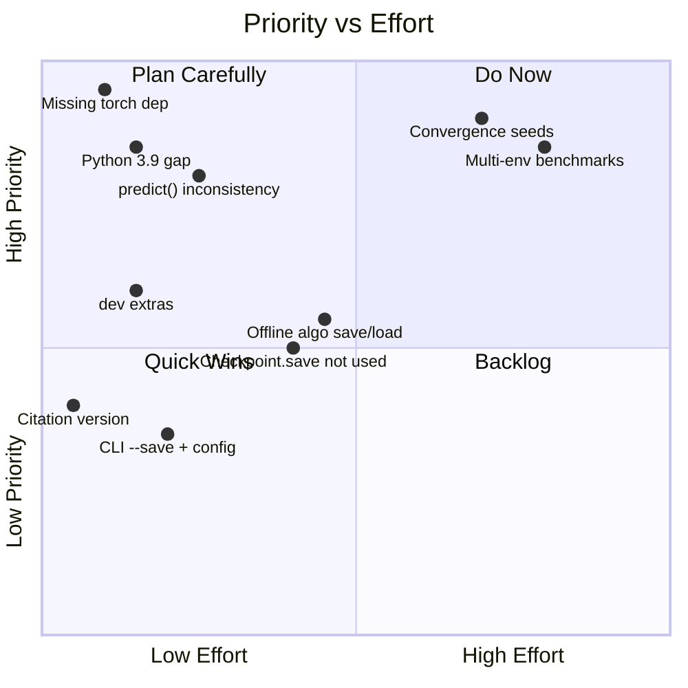
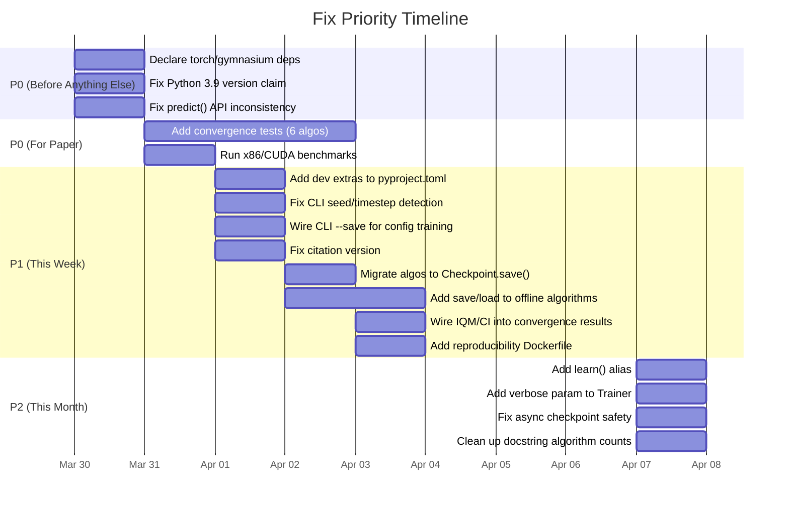

# Final Comprehensive Review: rlox v1.1.0

**Date:** 2026-03-29
**Scope:** Actionable issues affecting users and researchers today
**Method:** Full codebase read of 10 core files, test suite audit, CI pipeline review, API consistency check

---

## Executive Summary

rlox is in solid shape for a v1.1.0 release. The core 6 algorithms (PPO, SAC, DQN, TD3, A2C, TRPO) are consistent, tested, and documented. The Rust data plane is genuinely fast and well-benchmarked. However, there are concrete issues that will bite real users and block serious academic use. This review focuses only on those.



---

## 1. First-Time User Experience (0-5 minutes)

### P0-01: `pip install rlox` silently requires torch but doesn't declare it

**What:** `pyproject.toml` declares only `dependencies = ["numpy>=1.21"]`. But every algorithm imports `torch` unconditionally (PPO line 8: `import torch`). A user who runs `pip install rlox` and then `from rlox import Trainer` will get `ModuleNotFoundError: No module named 'torch'` with zero guidance.

**Why:** This is the single worst first-impression bug. The README quick start shows 3 lines of code. If those 3 lines crash with a confusing error, you lose the user.

**Fix:** Either:
- (A) Move `torch>=2.0` and `gymnasium>=0.29` into `dependencies` (recommended -- every algorithm needs both), or
- (B) Add a clear error message in `__init__.py` when torch/gymnasium are missing, e.g.: `raise ImportError("rlox requires PyTorch: pip install rlox[all]")`

**Effort:** 30 minutes
**Priority:** P0

---

### P0-02: Python 3.9 is declared as supported but never tested

**What:** `pyproject.toml` says `requires-python = ">=3.9"` and lists a `Programming Language :: Python :: 3.9` classifier. But CI only tests `["3.10", "3.11", "3.12", "3.13"]`. The codebase uses `X | Y` union type syntax (e.g., `str | type` in `trainer.py:104`, `dict[str, Any] | None` in `trainer.py:104`) which is a Python 3.10+ syntax error.

**Why:** A Python 3.9 user who installs rlox will get a `SyntaxError` on import. This is a lie in the package metadata.

**Fix:** Either:
- (A) Change `requires-python = ">=3.10"` and remove the 3.9 classifier (recommended -- the code already uses 3.10 syntax throughout), or
- (B) Add `from __future__ import annotations` to every file using `X | Y` syntax and add 3.9 to CI.

**Effort:** 15 minutes for (A), 2 hours for (B)
**Priority:** P0

---

### P0-03: `[project.optional-dependencies] dev` is missing

**What:** CI runs `pip install -e ".[dev]"` (ci.yml line 40) but `pyproject.toml` only defines `[all]` and `[gpu]` extras. This means CI silently installs nothing extra and relies on the next `pip install pytest gymnasium torch...` line to work.

**Why:** Contributors cannot reproduce the CI environment locally. `pip install -e ".[dev]"` is a no-op that doesn't fail (pip ignores unknown extras with a warning).

**Fix:** Add a `dev` extra:
```toml
dev = ["torch>=2.0", "gymnasium>=0.29", "pytest", "pytest-timeout", "pyyaml", "ruff"]
```

**Effort:** 15 minutes
**Priority:** P1

---

### P1-04: README citation block has wrong version

**What:** The BibTeX citation in README.md line 286 says `version = {1.0.0}` but the package is at 1.1.0. Minor, but researchers who copy-paste it will cite the wrong version.

**Fix:** Update to `version = {1.1.0}` or use a dynamic placeholder approach.

**Effort:** 2 minutes
**Priority:** P1

---

### P1-05: README says "Python 3.10-3.13" but pyproject.toml says ">=3.9"

**What:** README line 42 says `Python 3.10-3.13`. pyproject.toml says `>=3.9`. These contradict each other. (README is correct given the `X | Y` syntax issue.)

**Fix:** Align both to `>=3.10` (see P0-02).

**Effort:** Covered by P0-02
**Priority:** P1

---

## 2. API Consistency

### P0-06: `predict()` signature varies across algorithms

**What:** The Trainer delegates `predict(obs, deterministic=True)` to the underlying algorithm. But several algorithms don't accept `deterministic`:

| Algorithm | `predict()` signature | Accepts `deterministic`? |
|-----------|----------------------|--------------------------|
| PPO | `predict(self, obs, deterministic=True)` | Yes |
| SAC | `predict(self, obs, deterministic=True)` | Yes |
| DQN | `predict(self, obs, deterministic=True)` | Yes |
| TD3 | `predict(self, obs, deterministic=True)` | Yes |
| A2C | `predict(self, obs, deterministic=True)` | Yes |
| TRPO | `predict(self, obs, deterministic=True)` | Yes |
| **BC** | `predict(self, obs)` | **No** |
| **TD3+BC** | `predict(self, obs)` | **No** |
| **IQL** | `predict(self, obs)` | **No** |

When a user calls `trainer.predict(obs, deterministic=True)` via the unified Trainer, it forwards the `deterministic` kwarg. If the underlying algorithm is BC/TD3+BC/IQL, this will raise `TypeError: predict() got an unexpected keyword argument 'deterministic'`.

**Why:** The unified Trainer is the advertised API. If it breaks silently for some algorithms, users will hit confusing errors.

**Fix:** Add `deterministic: bool = True` parameter to BC, TD3+BC, and IQL `predict()` methods (they can ignore it since they're always deterministic, or use it to add noise in the non-deterministic case).

**Effort:** 1 hour
**Priority:** P0

---

### P1-07: Five offline algorithms lack `save()`/`from_checkpoint()`

**What:** The following algorithms have no `from_checkpoint()` and some have no `save()`:

| Algorithm | `save()` | `from_checkpoint()` |
|-----------|----------|---------------------|
| BC | No | No |
| TD3+BC | No | No |
| IQL | No | No |
| Online DPO | No | No |
| Best-of-N | No | No |

The Trainer's `from_checkpoint()` will call the underlying class method, which doesn't exist, raising `AttributeError`.

**Why:** Users who train these algorithms cannot save and resume. This violates the documented API contract.

**Fix:** Implement `save()` and `from_checkpoint()` for all five. The pattern is well-established in other algorithms (torch.save state_dict + config).

**Effort:** 3-4 hours
**Priority:** P1

---

### P1-08: `__init__.py` docstring says "6 core algorithms" and "8 algorithms" inconsistently

**What:** The docstring at the top of `__init__.py` says:
- Line 1: "Core algorithms: PPO, SAC, DQN, TD3, A2C, TRPO (+ 16 more via submodules)"
- Line 33: "Algorithms: ppo, sac, dqn, td3, a2c, mappo, dreamer, impala" (8 listed)

The actual `ALGORITHM_REGISTRY` has 16 algorithms. The `__all__` exports 6 configs. The README says 22 algorithms.

**Why:** Confusing for anyone reading the source. Not critical but easy to fix.

**Fix:** Update the docstring to say "6 core + 16 additional" and list them accurately.

**Effort:** 15 minutes
**Priority:** P2

---

## 3. What Would Block a NeurIPS Submission

### P0-09: Convergence benchmarks only cover 3 algorithm-environment pairs

**What:** `test_convergence.py` tests:
1. PPO on CartPole-v1
2. DQN on CartPole-v1
3. SAC on Pendulum-v1

This is insufficient for a serious empirical paper. Missing:
- TD3 on any continuous environment
- A2C on CartPole
- TRPO on any environment
- Any MuJoCo benchmark (HalfCheetah, Hopper, Walker2d)

**Why:** A reviewer will immediately ask: "Where are the MuJoCo results?" and "Why only 3 seeds (or however many)?"

**Fix:** Add convergence tests for all 6 core algorithms on at least 2 environments each (1 discrete, 1 continuous where applicable). Run with 5+ seeds and report IQM + 95% CI.

**Effort:** 2-3 days (including compute time)
**Priority:** P0 (for paper submission)

---

### P0-10: Benchmark numbers are all Apple M4 -- no x86/CUDA numbers

**What:** All benchmark highlights in README say "Apple M4". No x86_64 or NVIDIA GPU results.

**Why:** Reviewers and users on Linux servers (the dominant RL platform) cannot validate claims. ARM-specific SIMD optimizations may not transfer. A claim of "147x faster GAE" on M4 might be 50x on x86 (still good, but different).

**Fix:** Run the full benchmark suite on a standard x86_64 machine (ideally with CUDA). Report both. The GCP VM from the convergence benchmarks could serve this purpose.

**Effort:** 1 day (setup + run + update docs)
**Priority:** P0 (for paper submission)

---

### P1-11: No reproducibility lockfile or Docker environment

**What:** There is no `requirements-lock.txt`, `poetry.lock`, `Dockerfile`, or pinned dependency set for reproducing exact results. The `pyproject.toml` has very loose pins (`numpy>=1.21`, `torch>=2.0`).

**Why:** Reviewer asks "I get different numbers" -- you have no defense. Exact reproducibility requires exact dependency versions.

**Fix:** Add a `Dockerfile` that builds rlox with pinned dependencies and runs the benchmark suite. Pin PyTorch version, CUDA version, numpy version.

**Effort:** 4 hours
**Priority:** P1

---

### P1-12: The evaluation toolkit exists but is not wired into convergence benchmarks

**What:** `evaluation.py` has `interquartile_mean()`, `stratified_bootstrap_ci()`, `performance_profiles()`, and `probability_of_improvement()`. But the convergence results in README just show wall-clock and SPS numbers without IQM or CIs.

**Why:** The README claims "bootstrap 95% CI (10,000 resamples)" for microbenchmarks but the convergence section uses bare means. A reviewer will notice the inconsistency.

**Fix:** Rerun convergence experiments, compute IQM and bootstrap CIs using the existing evaluation module, and display them in the convergence table.

**Effort:** 4 hours
**Priority:** P1

---

## 4. What Would Block Adoption by an SB3 User

### P1-13: No `model.learn()` alias -- training API differs from SB3

**What:** SB3 uses `model.learn(total_timesteps=...)`. rlox uses `trainer.train(total_timesteps=...)`. The method name difference is minor but creates friction for SB3 users who rely on muscle memory.

**Why:** The migration guide exists but this is the kind of thing that makes users feel "this is different" on first contact.

**Fix:** Add `learn = train` as a method alias on the Trainer class (one line).

**Effort:** 5 minutes
**Priority:** P2

---

### P1-14: No `VecEnv.reset()` returns `(obs, info)` -- mismatch with Gymnasium API

**What:** The Rust `VecEnv` likely returns observations differently from Gymnasium's `(obs, info)` tuple convention. Users switching from SB3's `make_vec_env` will need to adapt.

**Why:** API friction. SB3 users expect Gymnasium-compatible vector environments.

**Fix:** Ensure `GymVecEnv` fully matches the SB3/Gymnasium VecEnv protocol. Document any intentional differences in the migration guide.

**Effort:** 2 hours to audit and document
**Priority:** P1

---

### P2-15: No `verbose` parameter on Trainer

**What:** SB3 uses `model = PPO("MlpPolicy", "CartPole-v1", verbose=1)`. rlox requires passing a `logger=ConsoleLogger(log_interval=1000)` object.

**Why:** More boilerplate for the common case. Not blocking but annoying.

**Fix:** Accept `verbose: int = 0` on Trainer and auto-create a ConsoleLogger when `verbose > 0`.

**Effort:** 30 minutes
**Priority:** P2

---

## 5. Technical Debt to Fix Now

### P1-16: Checkpoint.save() class is not used by most algorithms

**What:** The `Checkpoint` class in `checkpoint.py` provides atomic writes (via tmp file + os.replace), async saves, and RNG state preservation. But most algorithms (SAC, DQN, TD3, etc.) call `torch.save()` directly in their `save()` methods, bypassing all of this.

**Why:** The secure checkpoint infrastructure exists but algorithms don't use it. This means:
- No atomic writes (corrupted checkpoints on crash)
- No RNG state saving (non-reproducible resume)
- No async save option

**Fix:** Migrate all algorithm `save()` methods to use `Checkpoint.save()`.

**Effort:** 2-3 hours
**Priority:** P1

---

### P1-17: CLI `--save` with config-driven training prints "not supported yet"

**What:** `__main__.py` line 64: `print("Note: --save is not supported with config-driven training yet")`. If a user runs `python -m rlox train --config config.yaml --save model.pt`, their model is silently not saved.

**Why:** Data loss. The user thinks they saved but they didn't.

**Fix:** Wire up `--save` for config-driven training. The Trainer object is created internally by `train_from_config` -- either return it or add a `save_path` parameter to `train_from_config`.

**Effort:** 1 hour
**Priority:** P1

---

### P1-18: CLI seed detection is fragile

**What:** `__main__.py` line 52: `if args.seed != 42:` is used to detect whether the user explicitly set a seed. If the user intentionally wants seed 42 via CLI, the override won't apply to the config.

**Why:** Silent bug. If config says seed=7 and user passes `--seed 42`, the override is skipped because 42 is the argparse default.

**Fix:** Use `argparse` default of `None` and check `if args.seed is not None:`.

**Effort:** 10 minutes
**Priority:** P1

---

### P2-19: `__main__.py` timestep override has the same default-detection bug

**What:** Line 54: `if args.timesteps != 100_000:` -- same issue as seed. If the config says 50_000 timesteps and the user passes `--timesteps 100000`, it won't override.

**Fix:** Same pattern as P1-18: use `default=None` for argparse.

**Effort:** 10 minutes
**Priority:** P1 (same fix as P1-18)

---

### P2-20: `Checkpoint.save()` silently drops async write errors

**What:** `checkpoint.py` line 56: `threading.Thread(target=_write, daemon=True).start()`. Because it's a daemon thread, if the main process exits before the write completes, the checkpoint is silently lost. There's no error callback or future to check.

**Why:** Users who enable `async_save=True` and then exit quickly will lose their checkpoint with no warning.

**Fix:** Use a non-daemon thread, or return a `Future` that the caller can optionally wait on, or at minimum register an `atexit` handler that joins pending writes.

**Effort:** 1 hour
**Priority:** P2

---

## Summary: Prioritized Action List



### Quick Reference Table

| ID | What | Who It Affects | Effort | Priority |
|----|------|---------------|--------|----------|
| P0-01 | Declare torch/gymnasium as deps | Every new user | 30 min | P0 |
| P0-02 | Fix Python 3.9 version claim | Python 3.9 users | 15 min | P0 |
| P0-06 | Fix predict() signature inconsistency | Users of BC/TD3+BC/IQL via Trainer | 1 hr | P0 |
| P0-09 | More convergence benchmarks | Paper reviewers | 2-3 days | P0 |
| P0-10 | x86/CUDA benchmark numbers | Linux/GPU users, reviewers | 1 day | P0 |
| P1-03 | Add `[dev]` extras | Contributors | 15 min | P1 |
| P1-04 | Fix citation version | Researchers citing rlox | 2 min | P1 |
| P1-07 | Add save/load to offline algos | Users of BC/IQL/TD3+BC | 3-4 hrs | P1 |
| P1-11 | Reproducibility Dockerfile | Paper reviewers | 4 hrs | P1 |
| P1-12 | Wire IQM/CI into convergence display | Paper reviewers | 4 hrs | P1 |
| P1-16 | Migrate to Checkpoint.save() | Users resuming training | 2-3 hrs | P1 |
| P1-17 | Fix CLI --save with config | CLI users | 1 hr | P1 |
| P1-18 | Fix CLI seed default detection | CLI users | 10 min | P1 |
| P2-08 | Clean up docstring counts | Source readers | 15 min | P2 |
| P2-13 | Add learn() alias | SB3 migrants | 5 min | P2 |
| P2-15 | Add verbose param | SB3 migrants | 30 min | P2 |
| P2-19 | Fix CLI timestep default detection | CLI users | 10 min | P2 |
| P2-20 | Fix async checkpoint safety | Production users | 1 hr | P2 |

---

## What's NOT in This List (And Why)

These are things I looked at and decided are **not** actionable problems:

- **Lazy imports in `__init__.py`**: Well-designed, caches correctly, good pattern.
- **ConfigMixin with aliases and "did you mean?"**: Excellent UX, no issues found.
- **Wheel build matrix**: Covers linux x86_64, linux aarch64, macOS arm64, macOS x86_64, Windows x86_64. This is comprehensive.
- **CI pipeline structure**: Tests on 4 Python versions, has clippy, fmt, lint, slow tests on main only. Solid.
- **CHANGELOG quality**: Thorough, well-organized, covers both additions and fixes.
- **Checkpoint security**: `weights_only=True` default with clear fallback messaging. Good.
- **Test count**: 444 Rust + ~1094 Python tests across 52 test files. Adequate for this stage.
- **Algorithm count (27 implementations)**: Impressive breadth, but depth (convergence proof, save/load) matters more.
