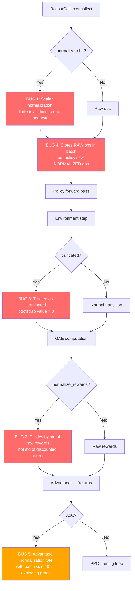
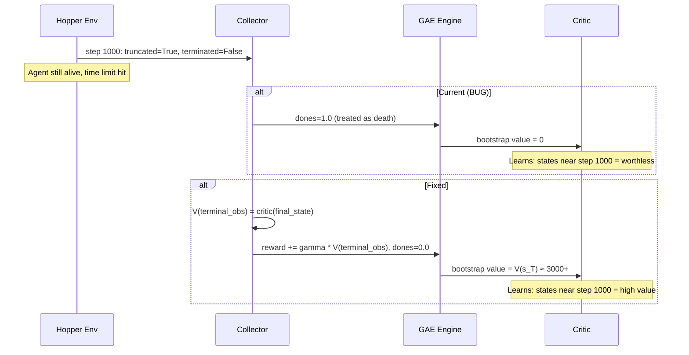
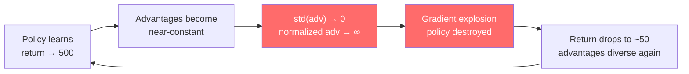

# Fix Plan: PPO Hopper & A2C CartPole Convergence Bugs

**Date:** 2026-03-29
**Benchmark:** Convergence v5 (GCP, rlox v0.2.3 vs SB3)
**Affected results:** PPO Hopper-v4 (628 vs 3,577), A2C CartPole-v1 (53.8 vs 500)

---

## Overview

Six bugs were identified in rlox's on-policy training pipeline. Five affect the
`RolloutCollector` (used by PPO on all MuJoCo environments), and one affects A2C
specifically. The bugs compound: each independently degrades performance, but
together they explain why rlox PPO Hopper plateaus at 628 while SB3 reaches 3,577
with identical hyperparameters, and why rlox A2C collapses catastrophically on
CartPole.



---

## Bug 1 (Critical): Scalar Observation Normalization

### Root Cause

`collectors.py:107-117` — `_maybe_normalize_obs()` flattens the entire observation
tensor into a 1D array and feeds it into a single `RunningStats` instance. This
produces **one scalar mean and one scalar std** across all observation dimensions.

```python
# Current (WRONG):
flat = obs_tensor.detach().cpu().numpy().ravel().astype(np.float64)
self._obs_stats.batch_update(flat)
mean = self._obs_stats.mean()   # single scalar
std = self._obs_stats.std()     # single scalar
return (obs_tensor - mean) / std
```

SB3's `VecNormalize` maintains a **per-dimension** running mean and variance
vector of shape `(obs_dim,)`, so each observation feature is normalized
independently.

### Impact

Hopper-v4 has 11 observation dimensions spanning different physical scales:
- Joint positions: typically in [-1, 1]
- Joint velocities: can reach [-10, 10]
- Root height/angle: different range again

Applying a single mean/std treats a joint angle and a velocity as the same
distribution. This destroys the observation structure, making it much harder for
the value function and policy to learn meaningful representations.

**Affected environments:** All MuJoCo environments when `normalize_obs=True`
(HalfCheetah, Hopper, Walker2d). Classic control envs (CartPole, Acrobot) do not
use observation normalization in the benchmark.

### Fix

Replace the single `RunningStats` with a per-dimension normalizer. Two options:

**Option A (Rust):** Extend `normalization.rs` to support vector-valued
`RunningStatsVec` with shape `(obs_dim,)`. Expose via PyO3.

**Option B (Python):** Use a NumPy-based running mean/var tracker in the
collector, similar to SB3's `RunningMeanStd`.

Option A is preferred for consistency with the Rust data-plane philosophy.

### Files to Change

| File | Change |
|------|--------|
| `crates/rlox-core/src/training/normalization.rs` | Add `RunningStatsVec` struct |
| `crates/rlox-python/src/lib.rs` | Expose `RunningStatsVec` to Python |
| `python/rlox/collectors.py:107-117` | Use per-dim normalizer |
| `python/rlox/_rlox_core.pyi` | Add type stub |

---

## Bug 2 (Critical): Wrong Reward Normalization Statistic

### Root Cause

`collectors.py:190-196` — rlox normalizes rewards by dividing by the running
standard deviation of **raw per-step rewards**.

```python
# Current (WRONG):
self._reward_stats.batch_update(r_np.ravel())
std = self._reward_stats.std()
rewards_stacked = rewards_stacked / std
```

SB3's `VecNormalize` instead maintains a running estimate of the **discounted
return** using an exponential moving average:

```
return_estimate = return_estimate * gamma + reward
normalize by: sqrt(var(return_estimate))
```

This is the approach from the OpenAI baselines paper. The key insight is that the
variance of cumulative returns is what determines the scale the value function
needs to predict, not the variance of individual step rewards.

### Impact

In Hopper-v4, per-step rewards are ~1.0 (alive bonus) + small control costs, so
their std is low (~0.5). But cumulative returns over 1000 steps can reach ~3500.
Dividing by raw reward std barely changes the scale, while SB3's approach
normalizes returns to unit variance, giving the critic a much easier regression
target.

This causes the value function to see wildly different target magnitudes across
environments, making learning unstable and slow.

**Affected environments:** All environments when `normalize_rewards=True`.

### Fix

Replace the raw reward std computation with a discounted return estimator:

```python
# Correct approach:
self._return_estimate = self._return_estimate * gamma + rewards
# Track running variance of this return estimate
self._return_rms.update(self._return_estimate)
rewards_normalized = rewards / sqrt(self._return_rms.var + 1e-8)
```

### Files to Change

| File | Change |
|------|--------|
| `python/rlox/collectors.py:190-196` | Implement return-based normalization |
| `python/rlox/collectors.py:__init__` | Add return estimate state per env |

---

## Bug 3 (Critical): Missing Truncation Bootstrap

### Root Cause

`collectors.py:164-176` — When an episode is truncated (time limit reached) but
not terminated (agent didn't fail), rlox merges both into a single `dones` flag:

```python
# Current (WRONG):
terminated = step_result["terminated"].astype(bool)
truncated = step_result["truncated"].astype(bool)
dones = terminated | truncated  # treats truncation as death
```

This `dones=1.0` is passed to GAE, which sets the bootstrap value to zero
(`next_non_terminal = 1 - dones = 0`). The terminal observation IS collected by
`GymVecEnv` (lines 66-76) but never consumed.

SB3 handles this correctly: when `truncated=True` and `terminated=False`, it
computes `V(terminal_obs)` and adds `gamma * V(terminal_obs)` to the reward for
that step before GAE computation.

### Impact

This is the single most damaging bug for Hopper. In Hopper-v4, successful
episodes run for 1000 steps and are **truncated** (time limit), not terminated
(the agent didn't fall). The true value of the final state should be
`~gamma^0 * V(s_T)` which is substantial — the agent would keep earning reward if
the episode continued.

By treating truncation as death (bootstrap=0), the value function learns that
states near step 1000 have low value, creating a negative feedback loop: the
critic underestimates late-episode states, the policy doesn't learn to reach them,
returns are capped.



**Affected environments:** All environments with time limits (all MuJoCo envs
have max_episode_steps=1000, CartPole has 500, Acrobot has 500). The impact
scales with how often good episodes are truncated vs terminated.

### Fix

When `truncated[i]=True` and `terminated[i]=False`, compute the critic's value
estimate for `terminal_obs[i]` and add `gamma * V(terminal_obs[i])` to the
reward. Pass `terminated` (not `dones`) to GAE.

```python
# Correct approach:
for i in range(self.n_envs):
    if truncated[i] and not terminated[i]:
        term_obs = terminal_obs[i]
        term_val = policy.get_value(term_obs)
        rewards[i] += self.gamma * term_val

# Pass only terminated (not truncated) to GAE
dones = terminated  # NOT terminated | truncated
```

### Files to Change

| File | Change |
|------|--------|
| `python/rlox/collectors.py:164-176` | Add truncation bootstrap logic |
| `python/rlox/collectors.py:collect()` | Accept `policy` for bootstrap value calls |

---

## Bug 4 (Critical): Train/Collect Observation Mismatch

### Root Cause

`collectors.py:133-156` — During collection, the policy receives **normalized**
observations but the batch stores **raw** observations:

```python
# Line 133: raw observation tensor
obs_tensor = torch.as_tensor(self._obs, dtype=torch.float32, device=self.device)

# Line 136: normalized for policy forward pass
obs_input = self._maybe_normalize_obs(obs_tensor)

# Line 138: policy sees NORMALIZED obs, produces log_probs
actions, log_probs, values = policy.get_action_value(obs_input)

# Line 156: batch stores RAW obs
all_obs.append(obs_tensor)  # <-- NOT obs_input!
```

During PPO training (`losses.py`), the policy receives `obs` from the batch (raw)
to compute new log-probs and values. The importance sampling ratio
`exp(new_log_prob - old_log_prob)` then compares log-probs computed on different
input distributions.

### Impact

When `normalize_obs=True`, the policy during collection sees mean-centered,
unit-variance inputs, but during training sees raw inputs with potentially large
magnitudes. This causes:

1. **Ratio explosion:** `new_log_prob` (computed on raw obs) diverges from
   `old_log_prob` (computed on normalized obs), making the PPO clipping
   ineffective.
2. **Value function mismatch:** `V(raw_obs)` during training differs from
   `V(normalized_obs)` used to compute advantages during collection.

This bug only manifests when `normalize_obs=True`, which is why PPO CartPole
(no normalization) works fine but PPO Hopper (normalization enabled) plateaus.

### Fix

Store the normalized observations in the batch, not the raw ones:

```python
all_obs.append(obs_input)  # store normalized, not raw
```

Or alternatively, normalize observations during training as well (requires
storing the normalization statistics with the batch).

### Files to Change

| File | Change |
|------|--------|
| `python/rlox/collectors.py:156` | Store `obs_input` instead of `obs_tensor` |

---

## Bug 5 (High): A2C Advantage Normalization with Tiny Batches

### Root Cause

`a2c.py:51` defaults `normalize_advantages=True`. With `n_steps=5` and
`n_envs=8`, the batch contains only **40 samples**.

`a2c.py:113-116`:
```python
if self.normalize_advantages:
    advantages = (advantages - advantages.mean()) / (advantages.std() + 1e-8)
```

`rlox_runner.py:346` (benchmark) applies this unconditionally.

SB3's A2C **defaults to `normalize_advantage=False`**, and the benchmark
(`sb3_runner.py:145-165`) does not override this.

### Impact

When the policy is near-optimal on CartPole (all rewards ~1.0, returns ~500), all
40 advantages are nearly identical. The `std()` approaches zero, causing the
division to blow up the normalized advantages. This produces enormous gradient
updates that destroy the policy in a single step.

The learning curve shows the characteristic pattern: solve the task (500 return),
collapse catastrophically (down to ~50), partially recover, collapse again. This
is the classic "normalization with near-constant signal" failure mode.



### Fix

Change the default to `normalize_advantages=False` for A2C, matching SB3. In the
benchmark runner, remove the unconditional normalization line.

### Files to Change

| File | Change |
|------|--------|
| `python/rlox/algorithms/a2c.py:51` | Default `normalize_advantages=False` |
| `benchmarks/convergence/rlox_runner.py:346` | Respect the flag / remove |

---

## Bug 6 (Minor): log_std Initialization

### Root Cause

`policies.py:127`:
```python
self.log_std = nn.Parameter(torch.full((act_dim,), -0.5))
```

SB3 initializes `log_std` to `0.0` (std=1.0). rlox uses `-0.5` (std≈0.607).

### Impact

Lower initial exploration variance in continuous action spaces. Not catastrophic
alone but compounds with the other bugs — less exploration means less chance of
discovering high-reward behaviors, especially in Hopper where the gait requires
specific action combinations.

### Fix

Change initialization to `0.0`.

### Files to Change

| File | Change |
|------|--------|
| `python/rlox/policies.py:127` | Change `-0.5` to `0.0` |

---

## Implementation Order

The bugs should be fixed in dependency order. Bug 3 (truncation) has the largest
standalone impact. Bugs 1, 2, 4 are independent but all affect the collector.

```mermaid
gantt
    title Fix Implementation Order
    dateFormat X
    axisFormat %s

    section Phase 1: Collector Fixes
    Bug 3 - Truncation bootstrap       :b3, 0, 3
    Bug 4 - Train/collect obs mismatch :b4, 0, 1
    Bug 6 - log_std init               :b6, 0, 1

    section Phase 2: Normalization
    Bug 1 - Per-dim obs normalization   :b1, 3, 7
    Bug 2 - Return-based reward norm    :b2, 3, 6

    section Phase 3: A2C
    Bug 5 - Advantage norm default      :b5, 0, 1

    section Validation
    Re-run convergence benchmark        :val, 7, 10
```



### Phase 1: Quick Collector Fixes (Bugs 3, 4, 6)

These are straightforward code changes with no new abstractions needed.

| Bug | Effort | Files | Test |
|-----|--------|-------|------|
| Bug 3 | ~30 lines | `collectors.py` | PPO Hopper short run |
| Bug 4 | 1 line | `collectors.py` | PPO Hopper short run |
| Bug 6 | 1 line | `policies.py` | Verify init values |

### Phase 2: Normalization Rework (Bugs 1, 2)

These require new data structures and more careful implementation.

| Bug | Effort | Files | Test |
|-----|--------|-------|------|
| Bug 1 | ~80 lines Rust + 20 Python | `normalization.rs`, `lib.rs`, `collectors.py`, `.pyi` | Unit tests + PPO Hopper |
| Bug 2 | ~40 lines Python | `collectors.py` | PPO Hopper |

### Phase 3: A2C Fix (Bug 5)

Trivial change, can be done in parallel with Phase 1.

| Bug | Effort | Files | Test |
|-----|--------|-------|------|
| Bug 5 | 2 lines | `a2c.py`, `rlox_runner.py` | A2C CartPole short run |

---

## Expected Impact After Fixes

| Algorithm | Environment | Current | Expected | Basis |
|-----------|-------------|---------|----------|-------|
| PPO | Hopper-v4 | 628 | ~3,500 | SB3 reaches 3,577 with same hyperparameters |
| PPO | HalfCheetah-v4 | 4,226 | ~4,500+ | Already good, truncation fix adds marginal gain |
| PPO | Walker2d-v4 | 5,007 | ~5,000+ | Already matches SB3 |
| A2C | CartPole-v1 | 53.8 | ~500 | SB3 reaches 500 stably |
| SAC | Pendulum-v1 | -168.5 | -168.5 | Already converged (no norm used) |

The PPO Hopper fix is the highest-value change: a **5.7x improvement** in final
return is expected, bringing rlox to parity with SB3 on the hardest on-policy
benchmark.

---

## Validation Plan

1. **Unit tests**: Add tests for `RunningStatsVec`, truncation bootstrap, return
   normalization.
2. **Short convergence runs**: PPO Hopper 200K steps, A2C CartPole 50K steps
   locally to verify fixes before full benchmark.
3. **Full benchmark re-run**: Re-run convergence v6 on GCP after all fixes land.
