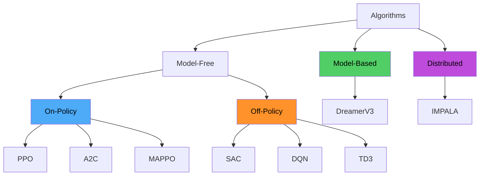
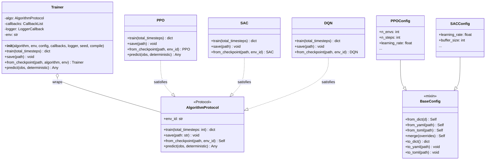
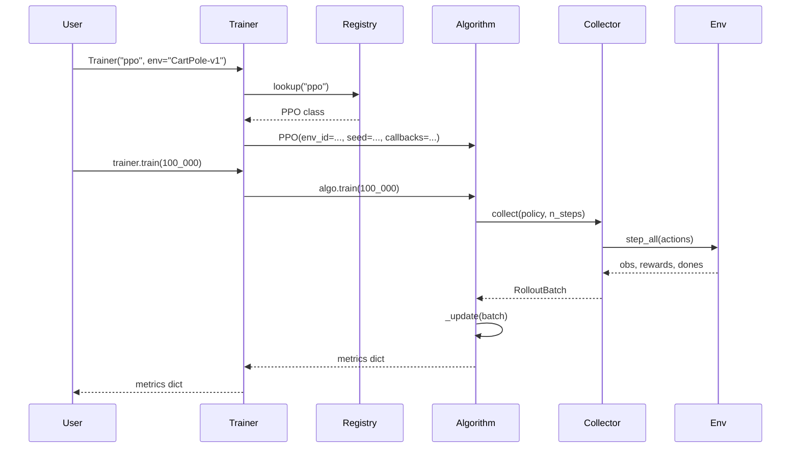
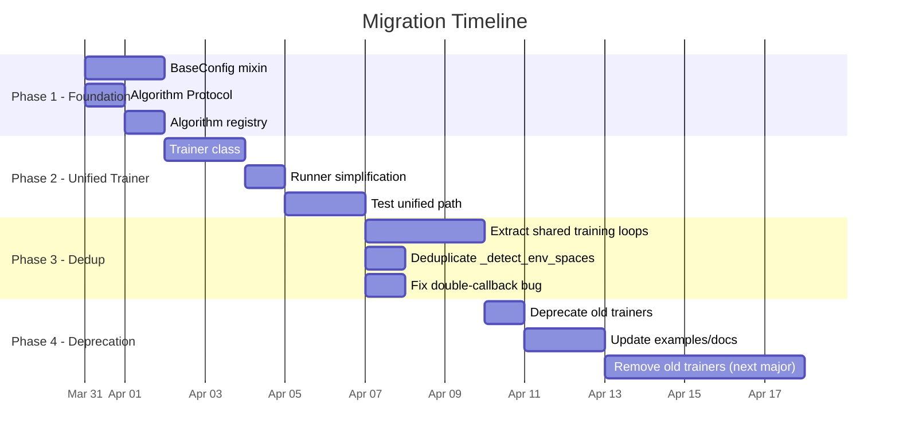
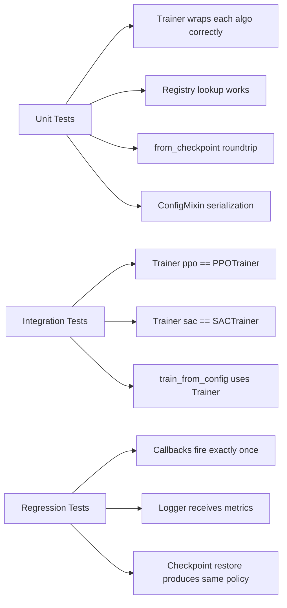

# General-Purpose Trainer Architecture

**Date**: 2026-03-29
**Status**: Proposal
**Scope**: Replace 8 individual trainer classes with a unified `Trainer` that delegates to algorithm-specific logic via a strategy pattern.

---

## Table of Contents

1. [Current State Analysis](#1-current-state-analysis)
2. [Commonality Analysis](#2-commonality-analysis)
3. [Divergence Analysis](#3-divergence-analysis)
4. [Proposed Architecture](#4-proposed-architecture)
5. [Migration Strategy](#5-migration-strategy)
6. [Tradeoff Analysis](#6-tradeoff-analysis)
7. [Implementation Plan](#7-implementation-plan)

---

## 1. Current State Analysis

### 1.1 Trainer Layer (trainers.py)

The 8 trainer classes in `trainers.py` are thin wrappers around algorithm instances. Every trainer follows an identical pattern:

```python
class XTrainer:
    def __init__(self, env, config=None, callbacks=None, logger=None, seed=42, compile=False):
        self.algo = X(env_id=env, seed=seed, logger=logger, callbacks=callbacks, **cfg)
        self.callbacks = CallbackList(callbacks)
        self.env = env

    def train(self, total_timesteps):
        self.callbacks.on_training_start()
        metrics = self.algo.train(total_timesteps=total_timesteps)
        self.callbacks.on_training_end()
        return metrics

    def save(self, path):
        self.algo.save(path)

    @classmethod
    def from_checkpoint(cls, path, env=None):
        trainer = object.__new__(cls)
        trainer.algo = X.from_checkpoint(path, env_id=env)
        trainer.env = env or trainer.algo.env_id
        trainer.callbacks = CallbackList(None)
        return trainer
```

### 1.2 Inconsistencies Across Trainers

Despite the identical structure, there are subtle inconsistencies that reveal organic growth:

| Aspect | PPOTrainer | SACTrainer | DQNTrainer | A2CTrainer | TD3Trainer | Others |
|---|---|---|---|---|---|---|
| `model` param | Yes | No | No | No | No | No |
| `logger` param in `__init__` | Yes | No | No | Yes | Yes | Yes |
| `compile` param | Yes | Yes | Yes | Yes | Yes | No |
| Callback wrapping in `train()` | Delegates to algo | Wraps with start/end | Wraps with start/end | Wraps with start/end | Wraps with start/end | Wraps |
| Stores `self.callbacks` | No | Yes | Yes | Yes | Yes | Yes |

**PPOTrainer is the outlier**: it does NOT wrap callbacks at the trainer level (no `on_training_start/end` calls) because the PPO algorithm itself calls them. The other 7 trainers all call `self.callbacks.on_training_start()` and `on_training_end()`, resulting in **double callback invocation** for algorithms that also call callbacks internally (A2C, TD3, MAPPO, IMPALA all call callbacks inside `train()`).

### 1.3 Algorithm Layer Duplication

The real duplication lives in the algorithm implementations. Key repeated patterns:

**Environment detection** -- duplicated in PPO, A2C, MAPPO, IMPALA:
```python
def _detect_env_spaces(env_id: str) -> tuple[int, Any, bool]:
    tmp = gym.make(env_id)
    obs_dim = int(np.prod(tmp.observation_space.shape))
    action_space = tmp.action_space
    is_discrete = isinstance(action_space, gym.spaces.Discrete)
    tmp.close()
    return obs_dim, action_space, is_discrete
```

**Off-policy training loop** -- nearly identical in SAC, DQN, TD3:
```python
for step in range(total_timesteps):
    if step < self.learning_starts:
        action = <random>
    else:
        action = <policy_action>
    next_obs, reward, terminated, truncated, info = self.env.step(action)
    self.buffer.push(...)
    if terminated or truncated:
        episode_rewards.append(ep_reward)
        ep_reward = 0.0
        obs, _ = self.env.reset()
    self._global_step += 1
    should_continue = self.callbacks.on_step(...)
    if step >= self.learning_starts and len(self.buffer) >= self.batch_size:
        metrics = self._update(step)
```

**Collector-based training loop** -- nearly identical in SAC, DQN, TD3:
```python
def _train_with_collector(self, total_timesteps):
    collector = self.collector
    collector.reset()
    for step in range(total_timesteps):
        _, _, mean_ep_reward = collector.collect_step(get_action, step, total_timesteps)
        self._global_step += 1
        should_continue = self.callbacks.on_step(...)
        if step >= self.learning_starts and len(self.buffer) >= self.batch_size:
            metrics = self._update(step)
```

**On-policy training loop** -- similar in PPO, A2C, MAPPO:
```python
for update in range(n_updates):
    batch = self.collector.collect(self.policy, n_steps=cfg.n_steps)
    <optimization step(s)>
    should_continue = self.callbacks.on_step(...)
    if self.logger is not None:
        self.logger.on_train_step(...)
```

### 1.4 Config Layer Duplication

All 8 config dataclasses duplicate the same serialization methods:
- `from_dict()` -- identical filter-and-construct logic
- `from_yaml()` / `from_toml()` -- identical file loading
- `merge()` -- identical dict merge
- `to_dict()` / `to_yaml()` / `to_toml()` -- identical serialization

This is approximately 30 lines of boilerplate per config class, totaling ~240 lines of duplicated code.

---

## 2. Commonality Analysis

### Shared Across All 8 Trainers

| Component | Current Location | Notes |
|---|---|---|
| Callback wiring | Each trainer + each algorithm | Double invocation bug |
| Logger setup | `runner.py` + trainer `__init__` | Inconsistent |
| Checkpoint save/load | Each algorithm class | Different state dict shapes |
| Config handling | Each config dataclass | Identical boilerplate |
| Environment detection | 4 copies of `_detect_env_spaces` | PPO, A2C, MAPPO, IMPALA |
| `train() -> dict[str, float]` | All trainers | Universal return type |
| `save(path)` / `from_checkpoint` | All trainers + algorithms | Universal interface |
| Seed propagation | All trainers | `seed: int = 42` |
| Global step tracking | All algorithms | `self._global_step` |
| Compile support | 5 of 8 trainers | `compile_policy(self)` |

### Shared Across On-Policy (PPO, A2C, MAPPO)

- `RolloutCollector` for data gathering
- GAE computation via `rlox.compute_gae_batched`
- Rollout-based update cadence
- `VecNormalize` wrapping (PPO only, but should be shared)

### Shared Across Off-Policy (SAC, DQN, TD3)

- `rlox.ReplayBuffer` / `PrioritizedReplayBuffer`
- `OffPolicyCollector` for multi-env
- `learning_starts` random exploration phase
- Step-based update cadence
- Polyak target network updates (SAC, TD3)

---

## 3. Divergence Analysis

### 3.1 Taxonomy of Differences



### 3.2 Axis of Variation

| Axis | Variants | Affected Algorithms |
|---|---|---|
| **Data collection** | On-policy rollouts, off-policy replay, model imagination, async actors | PPO/A2C/MAPPO vs SAC/DQN/TD3 vs DreamerV3 vs IMPALA |
| **Update cadence** | Per-rollout (multiple epochs), per-step, per-imagination-batch | PPO/MAPPO vs A2C vs SAC/DQN/TD3 vs DreamerV3 |
| **Policy type** | Discrete, continuous, deterministic, stochastic | All -- but auto-detected |
| **Agent count** | Single, multi-agent CTDE | MAPPO vs all others |
| **Parallelism** | Sync vectorized, async actor-learner | IMPALA vs all others |
| **World model** | None vs RSSM | DreamerV3 vs all others |
| **Buffer type** | None, replay, prioritized, sequential | Varies |
| **Network topology** | Shared actor-critic, separate actor+twin critics, Q-network, world model+latent AC | All different |

### 3.3 What CANNOT Be Unified

1. **The `_update()` method** -- This is the mathematical core of each algorithm (PPO clipping, SAC entropy, DQN TD-error, etc.). It must remain algorithm-specific.

2. **Network construction** -- Each algorithm has fundamentally different network architectures. A shared factory would add complexity without reducing it.

3. **DreamerV3's training loop** -- Its collect-imagine-train cycle is structurally different from both on-policy and off-policy loops.

4. **IMPALA's threading model** -- Actor-learner parallelism requires fundamentally different control flow.

---

## 4. Proposed Architecture

### 4.1 Design Philosophy

Rather than forcing all 8 algorithms into a single class hierarchy, we introduce:

1. **`AlgorithmProtocol`** -- a Python Protocol that all algorithms already (almost) satisfy
2. **`Trainer`** -- a single generic trainer class that wraps any `AlgorithmProtocol`
3. **`BaseConfig`** -- a mixin or base for config serialization boilerplate
4. **Preserve algorithm classes** -- the real logic stays in `PPO`, `SAC`, etc.

This is the **Strategy pattern**: the Trainer is the context, the algorithm is the strategy.

### 4.2 Class Diagram



### 4.3 AlgorithmProtocol

```python
# protocols.py (extend existing file)

@runtime_checkable
class Algorithm(Protocol):
    """Protocol that all rlox algorithms must satisfy."""

    env_id: str

    def train(self, total_timesteps: int) -> dict[str, float]:
        """Run training and return metrics."""
        ...

    def save(self, path: str) -> None:
        """Save checkpoint."""
        ...

    @classmethod
    def from_checkpoint(cls, path: str, env_id: str | None = None) -> Self:
        """Restore from checkpoint."""
        ...
```

### 4.4 Unified Trainer

```python
# trainer.py (new file, replaces trainers.py)

ALGORITHM_REGISTRY: dict[str, type] = {}

def register_algorithm(name: str):
    """Decorator to register an algorithm class."""
    def decorator(cls):
        ALGORITHM_REGISTRY[name] = cls
        return cls
    return decorator


class Trainer:
    """Unified trainer wrapping any registered algorithm.

    Usage:
        trainer = Trainer("ppo", env="CartPole-v1", config={"n_envs": 16})
        metrics = trainer.train(total_timesteps=100_000)
    """

    def __init__(
        self,
        algorithm: str | type,
        env: str,
        config: dict[str, Any] | None = None,
        callbacks: list[Callback] | None = None,
        logger: Any | None = None,
        seed: int = 42,
        compile: bool = False,
    ):
        cfg = config or {}

        # Resolve algorithm class
        if isinstance(algorithm, str):
            algo_cls = ALGORITHM_REGISTRY.get(algorithm.lower())
            if algo_cls is None:
                raise ValueError(
                    f"Unknown algorithm {algorithm!r}. "
                    f"Registered: {sorted(ALGORITHM_REGISTRY)}"
                )
        else:
            algo_cls = algorithm

        # Build algorithm -- inspect __init__ to pass only accepted params
        algo_kwargs = {"env_id": env, "seed": seed}
        if _accepts_param(algo_cls, "logger"):
            algo_kwargs["logger"] = logger
        if _accepts_param(algo_cls, "callbacks"):
            algo_kwargs["callbacks"] = callbacks
        if _accepts_param(algo_cls, "compile"):
            algo_kwargs["compile"] = compile
        algo_kwargs.update(cfg)

        self.algo = algo_cls(**algo_kwargs)
        self.env = env
        self._logger = logger
        self._callbacks = CallbackList(callbacks)

        # Attach logger if not accepted by algo __init__
        if logger is not None and not _accepts_param(algo_cls, "logger"):
            if hasattr(self.algo, "logger"):
                self.algo.logger = logger

    def train(self, total_timesteps: int) -> dict[str, float]:
        return self.algo.train(total_timesteps=total_timesteps)

    def save(self, path: str) -> None:
        self.algo.save(path)

    def predict(self, obs, deterministic: bool = True):
        return self.algo.predict(obs, deterministic=deterministic)

    @classmethod
    def from_checkpoint(
        cls,
        path: str,
        algorithm: str | type,
        env: str | None = None,
    ) -> Trainer:
        if isinstance(algorithm, str):
            algo_cls = ALGORITHM_REGISTRY[algorithm.lower()]
        else:
            algo_cls = algorithm
        trainer = object.__new__(cls)
        trainer.algo = algo_cls.from_checkpoint(path, env_id=env)
        trainer.env = env or trainer.algo.env_id
        trainer._callbacks = CallbackList(None)
        trainer._logger = None
        return trainer
```

### 4.5 BaseConfig Mixin

```python
# config.py (refactored)

class ConfigMixin:
    """Shared serialization/deserialization for all config dataclasses."""

    @classmethod
    def from_dict(cls, d: dict[str, Any]):
        valid_keys = {f.name for f in fields(cls)}
        filtered = {k: v for k, v in d.items() if k in valid_keys}
        return cls(**filtered)

    @classmethod
    def from_yaml(cls, path: str | Path):
        import yaml
        with open(path) as f:
            data = yaml.safe_load(f) or {}
        return cls.from_dict(data)

    @classmethod
    def from_toml(cls, path: str | Path):
        return cls.from_dict(_load_toml(path))

    def merge(self, overrides: dict[str, Any]):
        d = asdict(self)
        d.update(overrides)
        return type(self).from_dict(d)

    def to_dict(self) -> dict[str, Any]:
        return asdict(self)

    def to_yaml(self, path: str | Path) -> None:
        import yaml
        with open(path, "w") as f:
            yaml.dump(self.to_dict(), f, default_flow_style=False, sort_keys=False)

    def to_toml(self, path: str | Path) -> None:
        _write_toml(self.to_dict(), path)


@dataclass
class PPOConfig(ConfigMixin):
    n_envs: int = 8
    n_steps: int = 128
    # ... (only fields + validation, no serialization methods)

    def __post_init__(self):
        _validate_positive("learning_rate", self.learning_rate)
        # ...
```

### 4.6 Interaction Flow



### 4.7 Runner Simplification

```python
# runner.py (simplified)

def train_from_config(config: TrainingConfig | str | Path) -> dict[str, float]:
    # ... parse config file as before ...

    callbacks = _build_callbacks(config)
    logger = _build_logger(config)

    hp = dict(config.hyperparameters)
    hp["n_envs"] = config.n_envs
    if config.normalize_obs:
        hp["normalize_obs"] = True
    if config.normalize_rewards:
        hp["normalize_rewards"] = True

    # One line replaces the entire dispatch block
    trainer = Trainer(
        algorithm=config.algorithm,
        env=config.env_id,
        config=hp,
        callbacks=callbacks,
        logger=logger,
        seed=config.seed,
    )
    return trainer.train(total_timesteps=config.total_timesteps)
```

### 4.8 Rust Trait Inspiration

The Rust codebase shows how `BatchSteppable` abstracts over environment parallelism strategies while `RLEnv` defines the core step/reset contract. We can mirror this:

| Rust Pattern | Python Equivalent |
|---|---|
| `trait RLEnv: Send + Sync` | `VecEnv` Protocol (already exists) |
| `trait BatchSteppable: Send` | `Algorithm` Protocol (proposed) |
| `VecEnv` wraps `Vec<Box<dyn RLEnv>>` | `Trainer` wraps `Algorithm` |
| Static dispatch via generics | Dynamic dispatch via Protocol |

The key insight from the Rust side is that `BatchSteppable` does NOT try to unify the internal logic of different env types -- it only unifies the external interface. The proposed `Trainer` follows the same principle: it unifies the external training API without touching the internal algorithm logic.

---

## 5. Migration Strategy

### 5.1 Phase Diagram



### 5.2 Phase 1: Foundation (Non-Breaking)

1. **Add `ConfigMixin`** to `config.py` and have all 8 config classes inherit from it. Remove the duplicated methods from each class. This is a pure refactor with no API change.

2. **Add `Algorithm` Protocol** to `protocols.py`. All existing algorithm classes already satisfy it (they all have `train()`, `save()`, `from_checkpoint()`). Add `predict()` to SAC/TD3 (they already have it) and A2C/MAPPO/IMPALA (trivial to add).

3. **Add algorithm registry** with `@register_algorithm` decorator on each algorithm class.

### 5.3 Phase 2: Unified Trainer (Additive)

1. **Create `trainer.py`** with the `Trainer` class. This is a NEW file -- does not touch `trainers.py`.

2. **Simplify `runner.py`** to use `Trainer` instead of the `_ALGO_TRAINER_MAP` dispatch.

3. **Add tests** that verify `Trainer("ppo", ...)` produces identical results to `PPOTrainer(...)`.

### 5.4 Phase 3: Deduplication (Internal Refactor)

1. **Extract `_detect_env_spaces`** into a shared utility in `rlox/utils.py`.

2. **Fix the double-callback bug**: Remove `on_training_start/end` calls from trainer wrappers since algorithms already call them. Or remove them from algorithms and keep them only in the Trainer.

3. **Extract shared off-policy training loop** into a helper function used by SAC, DQN, TD3. This is the biggest refactor and most risk-bearing step.

### 5.5 Phase 4: Deprecation

1. **Deprecate per-algorithm trainers** with `warnings.warn()` in their `__init__`. Make them thin wrappers around `Trainer`.

2. **Update examples and documentation** to use `Trainer("ppo", ...)` instead of `PPOTrainer(...)`.

3. **Remove `trainers.py`** in the next major version.

### 5.6 Backward Compatibility

During the transition, both APIs work:

```python
# Old (deprecated but functional)
from rlox.trainers import PPOTrainer
trainer = PPOTrainer(env="CartPole-v1", seed=42)

# New (preferred)
from rlox import Trainer
trainer = Trainer("ppo", env="CartPole-v1", seed=42)

# Also works -- pass class directly
from rlox.algorithms.ppo import PPO
trainer = Trainer(PPO, env="CartPole-v1", seed=42)
```

---

## 6. Tradeoff Analysis

### 6.1 Pros

| Benefit | Impact |
|---|---|
| **~240 lines of config boilerplate eliminated** | Less code to maintain |
| **~150 lines of trainer boilerplate eliminated** | 8 classes -> 1 |
| **Double-callback bug fixed** | Correctness improvement |
| **Single entry point for all algorithms** | Simpler API, easier onboarding |
| **Algorithm registry enables plugins** | Users can register custom algorithms |
| **Runner dispatch simplified** | One line instead of conditional blocks |
| **Consistent logger/callback wiring** | No more algorithm-specific special cases |

### 6.2 Cons

| Cost | Mitigation |
|---|---|
| **Loss of per-algorithm type hints** | `Trainer` can be generic `Trainer[PPO]` if needed |
| **`from_checkpoint` requires algorithm name** | Registry lookup by name; or store algorithm name in checkpoint |
| **Per-algorithm docstrings less discoverable** | Keep algorithm classes well-documented; Trainer docstring links to them |
| **`model` param on PPOTrainer has no equivalent** | Deprecate it -- users should pass `policy` via config |
| **Migration period with two APIs** | Short deprecation window; automated codemods |

### 6.3 What We Intentionally Do NOT Unify

- **Algorithm internals (`_update`, `_train_world_model`, etc.)** -- These are the intellectual property of each algorithm. Forcing them into a template would make the code harder to understand, not easier.
- **Network construction** -- Too diverse across algorithms. A factory pattern here would be over-engineering.
- **Off-policy vs on-policy training loops** -- While similar, the differences (learning_starts, buffer warmup, rollout vs step cadence) are load-bearing. Extracting them into a shared function is Phase 3, done carefully with comprehensive tests.

---

## 7. Implementation Plan

### 7.1 File Changes

| File | Action | Description |
|---|---|---|
| `python/rlox/config.py` | **Modify** | Add `ConfigMixin`, refactor 8 config classes to inherit from it |
| `python/rlox/protocols.py` | **Modify** | Add `Algorithm` Protocol |
| `python/rlox/trainer.py` | **Create** | Unified `Trainer` class + algorithm registry |
| `python/rlox/trainers.py` | **Modify (Phase 4)** | Deprecation wrappers around `Trainer` |
| `python/rlox/runner.py` | **Modify** | Simplify dispatch to use `Trainer` |
| `python/rlox/algorithms/ppo.py` | **Modify** | Add `@register_algorithm("ppo")` |
| `python/rlox/algorithms/sac.py` | **Modify** | Add `@register_algorithm("sac")` |
| `python/rlox/algorithms/dqn.py` | **Modify** | Add `@register_algorithm("dqn")` |
| `python/rlox/algorithms/a2c.py` | **Modify** | Add `@register_algorithm("a2c")` + `predict()` |
| `python/rlox/algorithms/td3.py` | **Modify** | Add `@register_algorithm("td3")` |
| `python/rlox/algorithms/mappo.py` | **Modify** | Add `@register_algorithm("mappo")` + `predict()` |
| `python/rlox/algorithms/dreamer.py` | **Modify** | Add `@register_algorithm("dreamer")` + `predict()` |
| `python/rlox/algorithms/impala.py` | **Modify** | Add `@register_algorithm("impala")` + `predict()` |
| `python/rlox/utils.py` | **Create** | Shared `detect_env_spaces()` |
| `python/rlox/__init__.py` | **Modify** | Export `Trainer` |
| `tests/test_trainer.py` | **Create** | Tests for unified Trainer |

### 7.2 Estimated Line Counts

| Change | Lines Removed | Lines Added | Net |
|---|---|---|---|
| ConfigMixin extraction | ~240 | ~40 | **-200** |
| Unified Trainer | 0 | ~100 | +100 |
| Trainer deprecation wrappers | ~480 (eventually) | ~80 | **-400** |
| Registry decorators | 0 | ~16 | +16 |
| Shared `detect_env_spaces` | ~40 | ~15 | **-25** |
| **Total** | **~760** | **~251** | **~-509** |

### 7.3 Test Strategy



Key test: **behavioral equivalence** between `Trainer("ppo", env="CartPole-v1", seed=42).train(10_000)` and `PPOTrainer(env="CartPole-v1", seed=42).train(10_000)`. Same seed, same metrics, same policy weights.

### 7.4 Risk Assessment

| Risk | Probability | Impact | Mitigation |
|---|---|---|---|
| Subtle behavioral difference between old and new trainer | Medium | High | Seed-deterministic equivalence tests |
| Algorithm `__init__` signature incompatibility | Low | Medium | `_accepts_param` introspection handles this |
| Double-callback fix breaks existing callback-dependent code | Medium | Medium | Phase 3 is opt-in; document the change |
| Users relying on `PPOTrainer` type in isinstance checks | Low | Low | Deprecation period with warnings |
