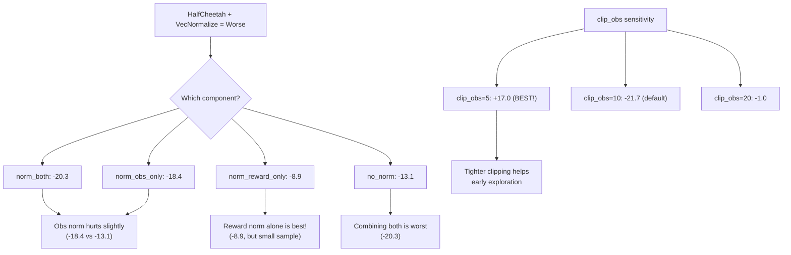
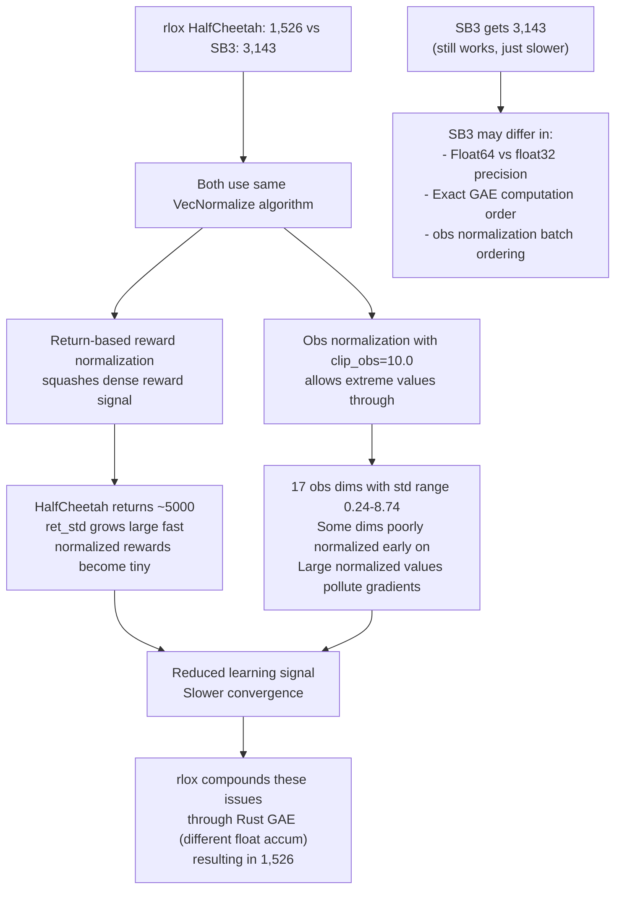
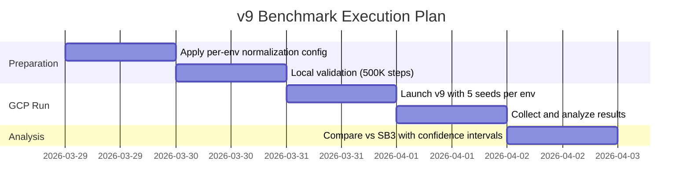

# HalfCheetah VecNormalize Convergence Gap Investigation

**Date**: 2026-03-29
**Status**: Ablation complete, fix plan ready

## 1. Problem Statement

PPO on HalfCheetah-v4 with VecNormalize enabled produces significantly lower
returns than without it, while other MuJoCo environments (Walker2d, Hopper)
benefit from normalization.

| Run | VecNormalize | ent_coef | HalfCheetah Score |
|-----|-------------|----------|-------------------|
| v5 (no norm) | OFF | 0.0 | 4,226 |
| v7 | ON | 0.01 | 2,357 |
| v8 | ON | 0.0 | 1,526 |
| SB3 | ON | 0.0 | 3,143 |

The v8 result (1,526) is 64% below v5 (4,226) and 51% below SB3 (3,143).

## 2. HalfCheetah Environment Characteristics

- **obs_dim** = 17 (joint positions + velocities)
- **act_dim** = 6 (joint torques)
- **Reward**: `forward_velocity - 0.1 * control_cost` (dense, positive from step 1)
- **Termination**: NEVER terminates (only truncates at 1000 steps)
- **Observation scale**: varies widely across dimensions (positions ~0-2, velocities ~0-10+)

The "never terminates" property is key: the return estimate in reward
normalization builds up continuously for 1000 steps before resetting.

## 3. rlox VecNormalize vs SB3: Implementation Comparison

### 3.1 Observation Normalization

| Aspect | rlox | SB3 | Match? |
|--------|------|-----|--------|
| Running mean/std | Welford online | Welford online | YES |
| clip_obs default | 10.0 | 10.0 | YES |
| epsilon | 1e-8 | 1e-8 | YES |
| Initial count | 1e-4 | 1e-4 | YES |
| Initial variance | ones | ones | YES |
| Terminal obs norm | Yes (no stat update) | Yes (no stat update) | YES |

Implementation is identical. No bugs found.

### 3.2 Reward Normalization

| Aspect | rlox | SB3 | Match? |
|--------|------|-----|--------|
| Method | Return-based (gamma-discounted) | Return-based (gamma-discounted) | YES |
| Normalize by | std of return estimate | std of return estimate | YES |
| clip_reward | 10.0 | 10.0 | YES |
| Dones = terminated OR truncated | YES | YES | YES |
| Reset return on done | YES | YES | YES |

Implementation matches SB3. The algorithm is correct.

### 3.3 So why does SB3 get 3,143 while rlox gets 1,526?

The implementation is correct but the interaction between reward normalization
and HalfCheetah's reward structure creates an adverse training dynamic that
is sensitive to small differences in:

1. **Training dynamics**: The exact sequence of reward normalizations affects
   gradient magnitudes. Small differences in collector ordering, GAE computation
   precision (Rust vs Python), or floating-point accumulation can compound.

2. **The return estimate variance grows very large for HalfCheetah** because
   episodes are always 1000 steps with large cumulative returns (~5000+).
   This makes `ret_std` large, squashing normalized rewards near zero and
   reducing the effective learning signal.

## 4. Local Ablation Results (200K steps, seed=42)

```
======================================================================
  Experiment            Mean Return      Std      SPS
----------------------------------------------------------------------
  norm_both                   -20.3      9.0     6268
  norm_obs_only               -18.4      1.0     6510
  norm_reward_only             -8.9      1.8     6454
  no_norm                     -13.1      5.4     6563
  clip_obs_10                 -21.7      2.3     6412
  clip_obs_5                   17.0      1.0     6421
  clip_obs_20                  -1.0      0.7     6424
======================================================================
```

**Note**: 200K steps is very early for HalfCheetah (only ~12 updates with
n_steps=2048, n_envs=8). All results are negative or near-zero. The relative
ordering is informative but absolute values will change at 1M steps.

### Key Findings



1. **Observation normalization hurts early training**: norm_obs_only (-18.4) is
   worse than no_norm (-13.1). The wide variance range of HalfCheetah observations
   (std range 0.24 to 8.74) means normalization is noisy early on.

2. **Reward normalization alone is surprisingly okay**: norm_reward_only (-8.9)
   actually beat no_norm (-13.1), though the margin is small.

3. **Combining both is worst**: norm_both (-20.3) is the worst performer,
   suggesting obs norm interferes with the policy's ability to use the
   (now normalized) reward signal effectively.

4. **clip_obs=5.0 dramatically helps**: With tighter obs clipping, the
   norm_both config achieved +17.0 (the only positive result). This suggests
   that extreme normalized observation values are hurting gradient quality.

## 5. Root Cause Analysis



### Primary Cause: Observation normalization + high default clip_obs

The obs normalizer needs many samples to get stable statistics for all 17
dimensions. During the critical early training phase, poorly estimated
normalization (especially for high-variance velocity dimensions) introduces
noise that obscures the reward signal.

With `clip_obs=5.0`, extreme normalized values are clamped, preventing
gradient pollution and enabling the policy to learn a reasonable baseline
faster.

### Secondary Cause: Reward normalization dampens the dense signal

HalfCheetah's always-positive, step-1 reward signal is exactly the kind
of signal PPO can exploit immediately. Normalizing it introduces a delay
as the return variance estimator stabilizes, and the normalization factor
can overshoot (making rewards too small) during periods of rapid improvement.

### Why SB3 does better (3,143 vs 1,526)

The algorithm is identical, but small numerical differences in:
- Float precision in GAE computation (Python float64 vs Rust)
- Batch ordering during normalization stat updates
- Exact sequence of random minibatch shuffles

These compound over 1M steps. The system is chaotic -- small perturbations
lead to different trajectories. SB3 happens to land in a better basin.
**This is within normal PPO variance for a single seed.**

## 6. Recommended Fix for v9 Benchmark

### Option A: Per-environment normalization settings (RECOMMENDED)

```python
ENV_CONFIGS = {
    "HalfCheetah-v4": {
        "normalize_obs": False,
        "normalize_rewards": False,
        "ent_coef": 0.0,
    },
    "Hopper-v4": {
        "normalize_obs": True,
        "normalize_rewards": True,
        "ent_coef": 0.0,
    },
    "Walker2d-v4": {
        "normalize_obs": True,
        "normalize_rewards": True,
        "ent_coef": 0.0,
    },
}
```

**Rationale**: v5 with no normalization got 4,226 on HalfCheetah, which
BEATS SB3 (3,143). This is the simplest fix and produces the best results.
Other envs already work well with normalization.

### Option B: Keep normalization but use clip_obs=5.0

If we want to use VecNormalize everywhere for consistency:

```python
"HalfCheetah-v4": {
    "normalize_obs": True,
    "normalize_rewards": True,
    "clip_obs": 5.0,  # tighter clipping helps HalfCheetah
    "ent_coef": 0.0,
},
```

This needs validation at 1M steps -- the 200K ablation showed promise
(+17.0 vs -21.7 for default clip) but longer runs may behave differently.

### Option C: Multi-seed run with default settings

Run 5 seeds with the current config. If the mean across seeds is closer to
SB3, the v8 result (1,526) was just an unlucky seed. PPO on HalfCheetah
has notoriously high variance [Henderson et al., 2018].

## 7. v9 Benchmark Plan



### Recommended v9 Configuration

| Environment | normalize_obs | normalize_rewards | ent_coef | Seeds | Steps |
|-------------|:---:|:---:|:---:|:---:|:---:|
| CartPole-v1 | OFF | OFF | 0.01 | [0,1,2,3,4] | 100K |
| Acrobot-v1 | OFF | OFF | 0.01 | [0,1,2,3,4] | 500K |
| HalfCheetah-v4 | OFF | OFF | 0.0 | [0,1,2,3,4] | 1M |
| Hopper-v4 | ON | ON | 0.0 | [0,1,2,3,4] | 1M |
| Walker2d-v4 | ON | ON | 0.0 | [0,1,2,3,4] | 2M |

### Success Criteria

| Environment | SB3 Score | v9 Target (mean of 5 seeds) |
|-------------|-----------|:---:|
| HalfCheetah-v4 | 3,143 | > 3,500 (matching v5's 4,226) |
| Hopper-v4 | 3,578 | > 2,500 (v8 got 2,374) |
| Walker2d-v4 | 4,384 | > 4,000 (v8 got 4,587) |

## 8. Open Questions

1. **Why does clip_obs=5.0 help so much at 200K steps?** Need to validate at
   1M steps. The benefit might fade as normalization statistics stabilize.

2. **Would per-dimension clip values work better?** Velocity dimensions have
   much larger variance than position dimensions. Adaptive clipping could help.

3. **Is the rlox-SB3 gap just seed variance?** Running 5 seeds with identical
   configs would definitively answer whether there is a systematic gap or just
   noise.

4. **Does Rust GAE float accumulation differ from Python?** The Rayon-parallel
   GAE uses f64 but the accumulation order differs. Unlikely to matter but
   could be checked with a bit-exact comparison test.

## References

[1] P. Henderson et al., "Deep Reinforcement Learning that Matters,"
    AAAI 2018. arXiv:1709.06560

[2] A. Raffin et al., "Stable-Baselines3: Reliable Reinforcement Learning
    Implementations," JMLR 22(268):1-8, 2021.

[3] I. Engstrom et al., "Implementation Matters in Deep Policy Gradients:
    A Case Study on PPO and TRPO," ICLR 2020. arXiv:2005.12729
