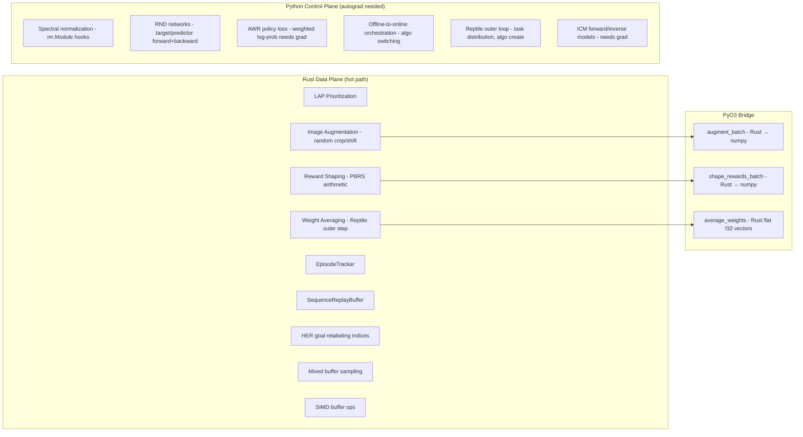

# Implementation Strategy v2: Rust-First Advanced RL Improvements

**Date**: 2026-04-01
**Revision**: v2 — maximizes Rust over Python per the Polars data-plane rule
**Principles**: TDD, Modularity, Composability, Rust-first for all non-autograd ops

---

## Design Rule

> If it's data transformation without autograd, it belongs in Rust.

This revision moves 3 items from Python to Rust and adds Rust acceleration
to 2 more. Only components requiring PyTorch autograd remain in Python.

---

## Layer Assignment



## Revised Item Inventory

| ID | Item | Layer | Change from v1 | Effort |
|----|------|-------|----------------|--------|
| P1.1 | DrQ-v2 Augmentation | **Rust + PyO3** | Was Python | 3 days |
| P1.2 | PBRS Reward Shaping | **Rust + PyO3** | Was Python | 3 days |
| P1.3 | LAP Prioritization | Rust + PyO3 | Same | 2 days |
| P1.4 | Spectral Normalization | Python | Same (needs autograd) | 1 day |
| P1.5 | AWR Algorithm | Python | Same (needs autograd) | 4 days |
| P1.6 | Offline-to-Online | Rust (mixed sampler) + Python (orchestration) | Same | 4 days |
| P2.1 | Sequence Replay Buffer | Rust + PyO3 | Same | 8 days |
| P2.2 | RND Intrinsic Motivation | Python (autograd) + **Rust (reward normalization)** | Partial move | 6 days |
| P2.3 | HER Buffer | Rust + PyO3 | Same | 8 days |
| P2.4 | Reptile Meta-Learning | **Rust (weight avg)** + Python (outer loop) | Partial move | 5 days |
| P2.5 | SIMD Buffer Operations | Rust | Same | 5 days |

---

## New Rust Modules

### 1. `crates/rlox-core/src/training/augmentation.rs` (NEW)

Image augmentation in Rust — zero-copy random crop on flat f32 pixel arrays.

```rust
/// Random crop augmentation for image observations.
///
/// Given a batch of images `(B, C, H, W)` stored as flat f32, applies
/// random spatial translation by cropping from a padded version.
/// This is the DrQ-v2 augmentation — pure arithmetic, no autograd.
pub fn random_shift_batch(
    images: &[f32],        // flat (B * C * H * W)
    batch_size: usize,
    channels: usize,
    height: usize,
    width: usize,
    pad: usize,
    seed: u64,
) -> Vec<f32>

/// Bilinear interpolation crop (higher quality, ~2x slower).
pub fn random_crop_bilinear(
    images: &[f32],
    batch_size: usize,
    channels: usize,
    height: usize,
    width: usize,
    crop_height: usize,
    crop_width: usize,
    seed: u64,
) -> Vec<f32>
```

**TDD Tests:**
- `test_random_shift_preserves_shape` — output length matches input
- `test_random_shift_different_seeds_differ` — stochastic
- `test_random_shift_pad_zero_is_identity` — pad=0 returns copy
- `test_random_shift_values_bounded` — output values in [min(input), max(input)]
- `prop_shift_batch_size_preserved` — proptest: any B,C,H,W -> same length
- `prop_shift_deterministic_with_seed` — same seed → same output

### 2. `crates/rlox-core/src/training/reward_shaping.rs` (NEW)

Potential-based reward shaping — batch f64 arithmetic.

```rust
/// Compute shaped rewards: r' = r + gamma * Phi(s') - Phi(s)
///
/// `potentials_current` and `potentials_next` are pre-computed potential
/// values for each transition. The potential function itself lives in
/// Python (it may use a neural network), but the shaping arithmetic is
/// pure f64 math done in Rust.
pub fn shape_rewards_pbrs(
    rewards: &[f64],
    potentials_current: &[f64],
    potentials_next: &[f64],
    gamma: f64,
    dones: &[f64],  // reset potential diff to 0 at episode boundaries
) -> Vec<f64>

/// Goal-distance potential: Phi(s) = -scale * ||s[goal_slice] - goal||
pub fn compute_goal_distance_potentials(
    observations: &[f64],  // flat (n * obs_dim)
    goal: &[f64],          // (goal_dim,)
    obs_dim: usize,
    goal_start: usize,     // index into obs where goal-relevant dims start
    goal_dim: usize,
    scale: f64,
) -> Vec<f64>
```

**TDD Tests:**
- `test_pbrs_known_values` — hand-computed example
- `test_pbrs_done_resets_potential` — at episode boundary, no carryover
- `test_pbrs_preserves_optimal_policy` — sum of shaped rewards equals sum of original + boundary terms
- `test_goal_distance_decreasing_near_goal` — closer obs → less negative potential
- `prop_pbrs_length_matches_input` — output length equals input length

### 3. `crates/rlox-core/src/training/weight_ops.rs` (NEW)

Weight vector operations for meta-learning — Reptile outer step.

```rust
/// Reptile weight update: params += lr * (task_params - params)
///
/// Operates on flat f32 weight vectors. Both vectors must have same length.
pub fn reptile_update(
    meta_params: &mut [f32],
    task_params: &[f32],
    meta_lr: f32,
)

/// Average multiple weight vectors: result = mean(vecs)
pub fn average_weight_vectors(
    vectors: &[&[f32]],  // N vectors of same length
) -> Vec<f32>

/// Exponential moving average: target = tau * source + (1 - tau) * target
/// (Polyak update — used by SAC/TD3 target networks, also useful for meta-learning)
pub fn polyak_update(
    target: &mut [f32],
    source: &[f32],
    tau: f32,
)
```

**TDD Tests:**
- `test_reptile_update_known_values` — verify lr=1.0 sets params to task_params
- `test_reptile_update_lr_zero_no_change` — lr=0 leaves params unchanged
- `test_average_weight_vectors_mean` — mean of [1,2,3] and [4,5,6] = [2.5,3.5,4.5]
- `test_polyak_update_tau_one` — tau=1 copies source to target
- `prop_reptile_interpolates` — result is between meta_params and task_params

### 4. `crates/rlox-core/src/buffer/episode.rs` (NEW)

Shared episode boundary tracker — reused by SequenceReplayBuffer and HER.

```rust
pub struct EpisodeTracker { ... }
pub struct EpisodeMeta { pub start: usize, pub length: usize }
pub struct EpisodeWindow { pub episode_idx: usize, pub ring_start: usize, pub length: usize }

impl EpisodeTracker {
    pub fn new(ring_capacity: usize) -> Self;
    pub fn notify_push(&mut self, write_pos: usize, done: bool);
    pub fn invalidate_overwritten(&mut self, write_pos: usize, count: usize);
    pub fn sample_windows(&self, batch_size: usize, seq_len: usize, seed: u64) -> Result<Vec<EpisodeWindow>, RloxError>;
    pub fn num_complete_episodes(&self) -> usize;
}
```

### 5. `crates/rlox-core/src/buffer/sequence.rs` (NEW)

Sequence replay buffer wrapping ReplayBuffer + EpisodeTracker.

### 6. `crates/rlox-core/src/buffer/her.rs` (NEW)

HER buffer with goal relabeling index computation in Rust.

### 7. `crates/rlox-core/src/buffer/mixed.rs` (NEW)

Mixed buffer sampling for offline-to-online.

---

## PyO3 Bindings

All new Rust modules exposed via `crates/rlox-python/src/`:

| Rust Module | PyO3 Function/Class | Python Usage |
|-------------|---------------------|-------------|
| `augmentation.rs` | `random_shift_batch(images, B, C, H, W, pad, seed)` | `rlox.random_shift_batch(obs_np, ...)` |
| `reward_shaping.rs` | `shape_rewards_pbrs(r, phi, phi_next, gamma, dones)` | `rlox.shape_rewards_pbrs(...)` |
| `reward_shaping.rs` | `compute_goal_distance_potentials(obs, goal, ...)` | `rlox.compute_goal_distance_potentials(...)` |
| `weight_ops.rs` | `reptile_update(meta, task, lr)` | `rlox.reptile_update(...)` |
| `weight_ops.rs` | `polyak_update(target, source, tau)` | `rlox.polyak_update(...)` |
| `episode.rs` | `PyEpisodeTracker` | `rlox.EpisodeTracker(capacity)` |
| `sequence.rs` | `PySequenceReplayBuffer` | `rlox.SequenceReplayBuffer(cap, obs_dim, act_dim)` |
| `her.rs` | `PyHERBuffer` | `rlox.HERBuffer(cap, obs_dim, act_dim, goal_dim)` |
| `mixed.rs` | `sample_mixed(buf_a, buf_b, ratio, batch_size, seed)` | `rlox.sample_mixed(...)` |

---

## Python Layer (autograd only)

| File | What | Why Python |
|------|------|-----------|
| `python/rlox/augmentation.py` | `RandomShift` class wrapping Rust `random_shift_batch` | Thin wrapper, converts torch↔numpy |
| `python/rlox/reward_shaping.py` | `PotentialShaping` calling Rust PBRS | Potential fn may be neural net (autograd) |
| `python/rlox/intrinsic/rnd.py` | RND target/predictor networks | Forward+backward pass needs autograd |
| `python/rlox/algorithms/awr.py` | AWR weighted policy loss | `exp(A/β) * log π` needs autograd |
| `python/rlox/meta/reptile.py` | Reptile outer loop | Task sampling, algo creation (control plane) |
| `python/rlox/offline_to_online.py` | Fine-tuning orchestrator | Algorithm switching (control plane) |
| `python/rlox/networks.py` | Spectral normalization | `nn.utils.spectral_norm` hooks |

---

## Implementation Waves (TDD)

```mermaid
gantt
    title Implementation Waves (Rust-First)
    dateFormat X
    axisFormat %s

    section Wave 1: Rust Foundation (parallel)
    augmentation.rs + tests           :r1, 0, 3
    reward_shaping.rs + tests         :r2, 0, 3
    weight_ops.rs + tests             :r3, 0, 2
    LAP on PER + tests                :r4, 0, 2
    episode.rs + tests                :r5, 0, 3

    section Wave 2: PyO3 Bindings (parallel)
    Expose augmentation               :b1, 3, 4
    Expose reward_shaping             :b2, 3, 4
    Expose weight_ops                 :b3, 3, 4
    Expose EpisodeTracker             :b4, 3, 4

    section Wave 3: Rust Buffers (depends on Wave 1)
    sequence.rs + tests               :s1, 4, 8
    her.rs + tests                    :s2, 4, 8
    mixed.rs + tests                  :s3, 4, 6
    PyO3 for buffers                  :s4, 8, 9

    section Wave 4: Python Layer (depends on Wave 2)
    RandomShift wrapper               :p1, 4, 5
    PotentialShaping wrapper          :p2, 4, 5
    Spectral norm                     :p3, 4, 5
    AWR algorithm                     :p4, 4, 7
    RND intrinsic motivation          :p5, 5, 8
    Reptile meta-learning             :p6, 5, 7
    Offline-to-online                 :p7, 6, 9

    section Wave 5: SIMD Optimization
    SIMD buffer ops                   :simd, 9, 12
```



### Wave 1: Red Phase (Tests First)

For each Rust module, write the tests FIRST:

1. `augmentation.rs` — 6 tests + 2 proptests
2. `reward_shaping.rs` — 5 tests + 1 proptest
3. `weight_ops.rs` — 5 tests + 1 proptest
4. `episode.rs` — 8 tests + 3 proptests
5. LAP on PER — 6 tests + 2 proptests

Then implement (Green phase), then refactor.

### Wave 2: Bridge Tests

For each PyO3 binding, write Python tests that call the Rust functions:

1. `test_augmentation_rust` — verify numpy in → numpy out, shape preserved
2. `test_reward_shaping_rust` — verify PBRS output matches hand computation
3. `test_weight_ops_rust` — verify Reptile/Polyak update on numpy arrays
4. `test_episode_tracker_python` — verify episode counting from Python

### Wave 3: Buffer Tests (Red Phase)

1. `sequence.rs` — 13 tests (contiguity, no cross-episode, deterministic, etc.)
2. `her.rs` — 10 tests (goal relabeling indices, strategy variants, etc.)
3. `mixed.rs` — 6 tests (ratio correctness, dimension validation, etc.)

### Wave 4: Python Integration Tests

Each Python wrapper gets integration tests that verify the full pipeline:

1. `test_sac_with_augmentation` — SAC training with Rust-backed RandomShift
2. `test_ppo_with_reward_shaping` — PPO with Rust-backed PBRS
3. `test_dreamer_with_sequence_buffer` — DreamerV3 using SequenceReplayBuffer
4. `test_reptile_meta_training` — Reptile wrapping PPO across tasks

---

## File Change Summary

### New Rust files (8):
| File | Lines (est) |
|------|-------------|
| `crates/rlox-core/src/training/augmentation.rs` | ~150 |
| `crates/rlox-core/src/training/reward_shaping.rs` | ~120 |
| `crates/rlox-core/src/training/weight_ops.rs` | ~80 |
| `crates/rlox-core/src/buffer/episode.rs` | ~200 |
| `crates/rlox-core/src/buffer/sequence.rs` | ~250 |
| `crates/rlox-core/src/buffer/her.rs` | ~200 |
| `crates/rlox-core/src/buffer/mixed.rs` | ~80 |
| `crates/rlox-python/src/training.rs` (extend) | ~100 |

### New Python files (7):
| File | Lines (est) |
|------|-------------|
| `python/rlox/augmentation.py` | ~40 |
| `python/rlox/reward_shaping.py` | ~60 |
| `python/rlox/intrinsic/rnd.py` | ~100 |
| `python/rlox/algorithms/awr.py` | ~150 |
| `python/rlox/meta/reptile.py` | ~120 |
| `python/rlox/offline_to_online.py` | ~100 |
| `python/rlox/networks.py` (extend) | ~20 |

### Test files (est ~200 tests total):
| File | Tests |
|------|-------|
| Rust unit tests across 7 new modules | ~60 |
| Rust proptests | ~15 |
| Python PyO3 bridge tests | ~25 |
| Python integration tests | ~40 |
| Python algorithm tests (AWR, RND, Reptile) | ~30 |

---

## Rust vs Python Decision Matrix

| Operation | Autograd? | Hot path? | SIMD? | → Layer |
|-----------|-----------|-----------|-------|---------|
| Random crop pixels | No | Yes (every batch) | Yes | **Rust** |
| Reward shaping arithmetic | No | Yes (every step) | Yes | **Rust** |
| Weight averaging | No | Yes (meta step) | Yes | **Rust** |
| Polyak target update | No | Yes (every step) | Yes | **Rust** |
| LAP priority computation | No | Yes (every sample) | No | **Rust** |
| Episode boundary tracking | No | Yes (every push) | No | **Rust** |
| Sequence sampling | No | Yes (every batch) | Partial | **Rust** |
| HER index computation | No | Yes (every sample) | No | **Rust** |
| Mixed buffer sampling | No | Yes (every batch) | No | **Rust** |
| Spectral norm hooks | Yes (SVD grad) | No (once at init) | No | **Python** |
| RND forward/backward | Yes | Yes | No | **Python** |
| AWR policy loss | Yes | Yes | No | **Python** |
| Reptile outer loop | No (control) | No | No | **Python** |
| Offline-to-online switch | No (control) | No | No | **Python** |
