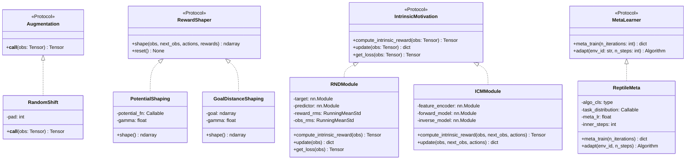
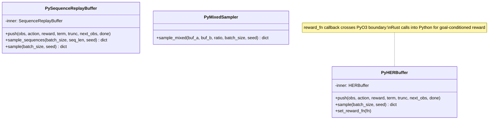
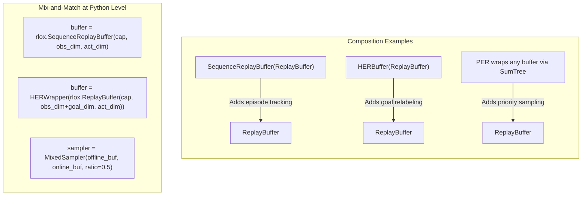
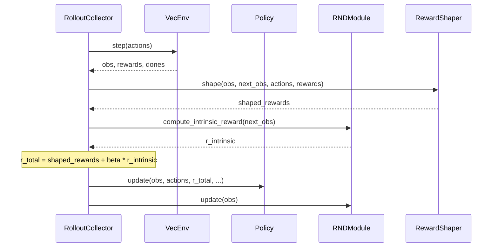
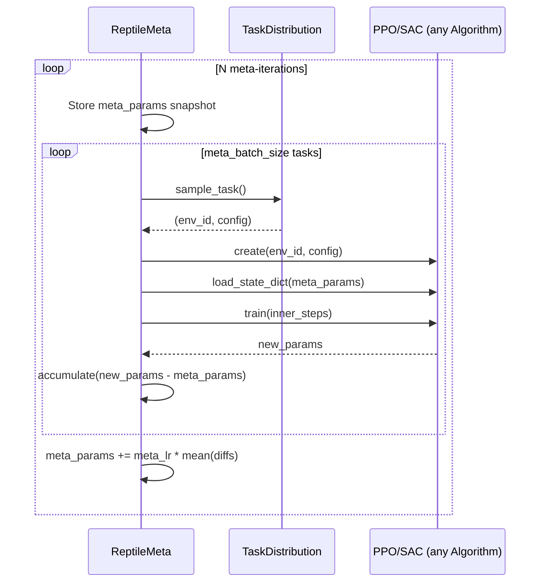
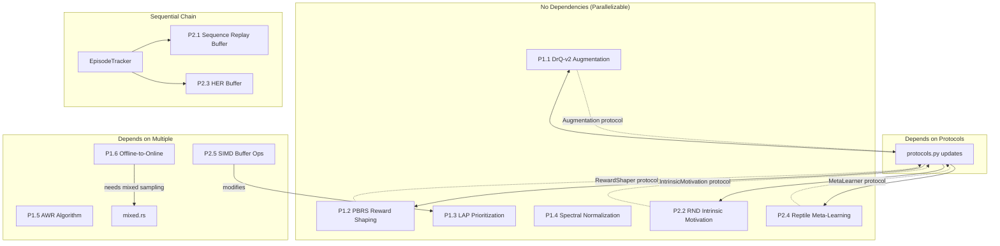
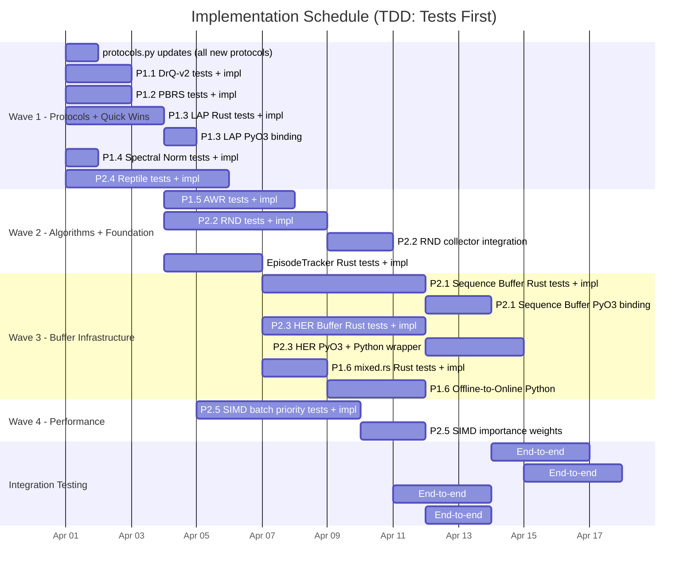

# Implementation Strategy: Advanced RL Improvements

**Date**: 2026-03-29
**Scope**: Phase 1 (Quick Wins) + Phase 2 Rust Infrastructure from `advanced-rl-improvements.md`
**Principles**: TDD, Modularity (Decorator/Strategy/Mixin), Composability, Feature Flags

---

## Table of Contents

1. [Scope and Item Inventory](#1-scope-and-item-inventory)
2. [Architecture Design: New Traits and Structs](#2-architecture-design)
3. [Composability Model](#3-composability-model)
4. [Component Details and TDD Plans](#4-component-details)
5. [File-by-File Change Plan](#5-file-by-file-change-plan)
6. [Implementation Order and Dependencies](#6-implementation-order)
7. [Gantt Chart](#7-gantt-chart)

---

## 1. Scope and Item Inventory

### Phase 1 -- Quick Wins (Pure Python or Minimal Rust)

| ID | Item | Layer | Effort |
|----|------|-------|--------|
| P1.1 | DrQ-v2 Augmentation | Python | 2 days |
| P1.2 | PBRS Reward Shaping | Python | 2 days |
| P1.3 | LAP Prioritization | Rust + PyO3 | 3 days |
| P1.4 | Spectral Normalization | Python | 1 day |
| P1.5 | AWR Algorithm | Python | 4 days |
| P1.6 | Offline-to-Online Protocol | Python + Rust | 4 days |

### Phase 2 -- Core Infrastructure (Rust-heavy)

| ID | Item | Layer | Effort |
|----|------|-------|--------|
| P2.1 | Sequence Replay Buffer | Rust + PyO3 | 10 days |
| P2.2 | RND Intrinsic Motivation | Python | 7 days |
| P2.3 | HER Buffer | Rust + PyO3 + Python | 10 days |
| P2.4 | Reptile Meta-Learning | Python | 7 days |
| P2.5 | SIMD Buffer Operations | Rust | 7 days |

---

## 2. Architecture Design

### 2.1 New Rust Traits

The central design principle: buffer enhancements are **decorators** (wrappers), not modifications to `ringbuf.rs`. New sampling strategies are **strategies** injected at sample-time. Reward shaping uses the **mixin** pattern via Python callables.

```mermaid
classDiagram
    class SamplingStrategy {
        <<trait>>
        +select_indices(&self, count: usize, batch_size: usize, seed: u64) Vec~usize~
    }

    class UniformSampling {
        +select_indices() Vec~usize~
    }

    class PrioritySampling {
        -tree: SumTree
        -alpha: f64
        +select_indices() Vec~usize~
        +update_priorities(indices, priorities)
    }

    class LAPSampling {
        -tree: SumTree
        -alpha: f64
        -epsilon: f64
        +select_indices() Vec~usize~
        +update_from_losses(indices, losses)
    }

    SamplingStrategy <|.. UniformSampling
    SamplingStrategy <|.. PrioritySampling
    SamplingStrategy <|.. LAPSampling

    class EpisodeTracker {
        -episode_starts: Vec~usize~
        -episode_lengths: Vec~usize~
        -current_episode_start: usize
        -current_episode_len: usize
        +notify_push(write_pos: usize, done: bool)
        +sample_episode_window(seq_len, seed) Vec~EpisodeWindow~
        +invalidate_before(pos: usize)
    }

    class EpisodeWindow {
        +episode_idx: usize
        +start_offset: usize
        +length: usize
    }

    class SequenceReplayBuffer {
        -inner: ReplayBuffer
        -tracker: EpisodeTracker
        +push_with_done(record, done)
        +sample_sequences(batch_size, seq_len, seed) SequenceBatch
        +sample(batch_size, seed) SampledBatch
    }

    class HERBuffer {
        -inner: ReplayBuffer
        -tracker: EpisodeTracker
        -strategy: HERStrategy
        -obs_dim: usize
        -goal_dim: usize
        +push_with_done(record, done)
        +sample_with_relabeling(batch_size, seed, reward_fn) SampledBatch
    }

    class HERStrategy {
        <<enum>>
        Final
        Future(k: usize)
        Episode(k: usize)
    }

    SequenceReplayBuffer *-- ReplayBuffer
    SequenceReplayBuffer *-- EpisodeTracker
    HERBuffer *-- ReplayBuffer
    HERBuffer *-- EpisodeTracker
    HERBuffer *-- HERStrategy

    class MixedSampler {
        +sample_mixed(buf_a, buf_b, ratio, batch_size, seed) SampledBatch
    }
```



### 2.2 New Python Protocols and Classes



### 2.3 PyO3 Binding Layer



---

## 3. Composability Model

### 3.1 Buffer Enhancement Composition

Buffers compose via wrapping, not inheritance. Each wrapper delegates storage to `ReplayBuffer` and adds metadata or sampling logic.



### 3.2 Intrinsic Motivation Composition

Intrinsic motivation modules are **orthogonal** to algorithms. They hook into the collector's reward pipeline.



### 3.3 Meta-Learning Composition

Meta-learners wrap any `Algorithm` that satisfies the protocol. Zero changes to the wrapped algorithm.



---

## 4. Component Details and TDD Plans

### 4.1 P1.1 -- DrQ-v2 Augmentation

**Location**: `python/rlox/augmentation.py` (new file)

**Design**: `Augmentation` protocol in `protocols.py`. `RandomShift` class implements pad-crop augmentation. SAC/TD3/DQN accept optional `augmentation` parameter.

**Rust code sketch**: None (pure Python + PyTorch).

**Python code sketch**:

```python
# python/rlox/augmentation.py

class RandomShift:
    def __init__(self, pad: int = 4):
        self.pad = pad

    def __call__(self, obs: torch.Tensor) -> torch.Tensor:
        if obs.dim() == 2:  # (B, flat) -- no-op for non-image
            return obs
        B, C, H, W = obs.shape
        padded = F.pad(obs, [self.pad] * 4, mode="replicate")
        crop_h = torch.randint(0, 2 * self.pad + 1, (B,))
        crop_w = torch.randint(0, 2 * self.pad + 1, (B,))
        return torch.stack([
            padded[i, :, h:h+H, w:w+W]
            for i, (h, w) in enumerate(zip(crop_h, crop_w))
        ])
```

**TDD test cases (Red phase)**:

| # | Test | What it validates |
|---|------|-------------------|
| 1 | `test_random_shift_preserves_shape` | Output shape == input shape for (B,C,H,W) |
| 2 | `test_random_shift_different_seeds_differ` | Two calls produce different outputs (stochastic) |
| 3 | `test_random_shift_noop_for_flat` | (B, obs_dim) input passes through unchanged |
| 4 | `test_random_shift_values_in_range` | Output pixel values remain in valid range |
| 5 | `test_augmentation_protocol_compliance` | `isinstance(RandomShift(4), Augmentation)` |
| 6 | `test_sac_accepts_augmentation` | SAC constructor with `augmentation=RandomShift()` does not error |
| 7 | `test_sac_training_with_augmentation` | Short training run with augmentation completes |

---

### 4.2 P1.2 -- PBRS Reward Shaping

**Location**: `python/rlox/reward_shaping.py` (new file)

**Design**: `RewardShaper` protocol in `protocols.py`. `PotentialShaping` and `GoalDistanceShaping` implementations. Integrates with existing `reward_fn` callback in `RolloutCollector` and `OffPolicyCollector`.

**Python code sketch**:

```python
# python/rlox/reward_shaping.py

class PotentialShaping:
    def __init__(self, potential_fn: Callable[[np.ndarray], float], gamma: float = 0.99):
        self.potential_fn = potential_fn
        self.gamma = gamma
        self._prev_potentials: np.ndarray | None = None

    def shape(
        self,
        obs: np.ndarray,
        next_obs: np.ndarray,
        actions: np.ndarray,
        rewards: np.ndarray,
    ) -> np.ndarray:
        current = np.array([self.potential_fn(o) for o in next_obs])
        prev = (
            self._prev_potentials
            if self._prev_potentials is not None
            else np.array([self.potential_fn(o) for o in obs])
        )
        shaped = rewards + self.gamma * current - prev
        self._prev_potentials = current
        return shaped

    def reset(self) -> None:
        self._prev_potentials = None


class GoalDistanceShaping(PotentialShaping):
    def __init__(self, goal: np.ndarray, gamma: float = 0.99, scale: float = 1.0):
        self.goal = goal
        self._scale = scale
        super().__init__(
            potential_fn=lambda obs: -scale * np.linalg.norm(obs - goal),
            gamma=gamma,
        )
```

**TDD test cases**:

| # | Test | What it validates |
|---|------|-------------------|
| 1 | `test_potential_shaping_preserves_optimal_policy` | For known MDP, shaped and unshaped produce same optimal Q-values |
| 2 | `test_potential_shaping_adds_gamma_phi_diff` | `r_shaped = r + gamma*phi(s') - phi(s)` numerically |
| 3 | `test_potential_shaping_reset_clears_state` | After reset, next call recomputes from obs |
| 4 | `test_goal_distance_shaping_decreases_near_goal` | Shaping reward is higher when moving toward goal |
| 5 | `test_reward_shaper_protocol_compliance` | `isinstance(PotentialShaping(...), RewardShaper)` |
| 6 | `test_collector_integration` | `RolloutCollector` with `reward_fn=shaper.shape` runs |

---

### 4.3 P1.3 -- LAP Prioritization

**Location**: Rust `crates/rlox-core/src/buffer/priority.rs` (extend existing), PyO3 binding update.

**Design**: Add `update_priorities_from_loss` method to `PrioritizedReplayBuffer`. This is a thin wrapper over existing `update_priorities` that computes `priority = |loss| + epsilon` before calling the SumTree. No new struct needed.

**Rust code sketch**:

```rust
// In priority.rs, add to impl PrioritizedReplayBuffer:

/// Update priorities using per-sample training losses (LAP mode).
///
/// Computes `priority_i = (|loss_i| + epsilon)^alpha` and updates the
/// SumTree. This replaces TD-error-based priorities with fresh loss
/// values, addressing the staleness problem in standard PER.
pub fn update_priorities_from_loss(
    &mut self,
    indices: &[usize],
    losses: &[f64],
    epsilon: f64,
) -> Result<(), RloxError> {
    if indices.len() != losses.len() {
        return Err(RloxError::ShapeMismatch {
            expected: format!("indices.len()={}", indices.len()),
            got: format!("losses.len()={}", losses.len()),
        });
    }
    let priorities: Vec<f64> = losses
        .iter()
        .map(|&l| (l.abs() + epsilon).powf(self.alpha))
        .collect();
    self.update_priorities(indices, &priorities)
}
```

**TDD test cases (Rust)**:

| # | Test | Proptest? | What it validates |
|---|------|-----------|-------------------|
| 1 | `test_lap_update_sets_correct_priorities` | No | After LAP update, SumTree priorities match `(\|loss\| + eps)^alpha` |
| 2 | `test_lap_update_mismatched_lengths_errors` | No | Different-length indices and losses returns `Err` |
| 3 | `test_lap_sampling_favors_high_loss` | No | After LAP update, high-loss transitions are sampled more frequently |
| 4 | `test_lap_zero_loss_gets_epsilon_priority` | No | Loss=0 yields priority `epsilon^alpha`, not zero |
| 5 | `prop_lap_priorities_always_positive` | Yes | For any losses and epsilon > 0, all priorities > 0 |
| 6 | `prop_lap_preserves_buffer_integrity` | Yes | After random LAP updates, buffer still samples correctly |

**PyO3 binding**:

```rust
// In crates/rlox-python/src/buffer.rs, add to PyPrioritizedReplayBuffer:

/// Update priorities using per-sample training losses (LAP).
fn update_priorities_from_loss(
    &mut self,
    indices: PyReadonlyArray1<u64>,
    losses: PyReadonlyArray1<f64>,
    epsilon: f64,
) -> PyResult<()> {
    let idx: Vec<usize> = indices.as_slice()?.iter().map(|&i| i as usize).collect();
    self.inner
        .update_priorities_from_loss(&idx, losses.as_slice()?, epsilon)
        .map_err(|e| PyRuntimeError::new_err(e.to_string()))
}
```

---

### 4.4 P1.4 -- Spectral Normalization

**Location**: `python/rlox/networks.py` (modify existing or new utility module)

**Design**: Add `spectral_norm: bool` parameter to critic network constructors. Apply `torch.nn.utils.spectral_norm` to all Linear layers when enabled.

**TDD test cases**:

| # | Test | What it validates |
|---|------|-------------------|
| 1 | `test_spectral_norm_constrains_lipschitz` | Singular values of weight matrices are <= 1 |
| 2 | `test_spectral_norm_forward_backward_works` | Forward and backward pass complete without error |
| 3 | `test_spectral_norm_off_by_default` | Default construction has no spectral norm hooks |
| 4 | `test_sac_with_spectral_norm_trains` | Short SAC training with spectral_norm=True completes |

---

### 4.5 P1.5 -- AWR Algorithm

**Location**: `python/rlox/algorithms/awr.py` (new file)

**Design**: Advantage Weighted Regression. Reuses existing `ReplayBuffer` for off-policy data, `OfflineDatasetBuffer` for offline data. Inherits evaluation infrastructure from existing algorithms.

**Python code sketch**:

```python
# python/rlox/algorithms/awr.py

@register_algorithm("awr")
class AWR:
    def __init__(
        self,
        env_id: str,
        beta: float = 0.05,
        n_epochs: int = 10,
        batch_size: int = 256,
        advantage_type: str = "gae",  # or "mc"
        lr: float = 3e-4,
        gamma: float = 0.99,
        gae_lambda: float = 0.95,
        max_weight: float = 20.0,
        seed: int = 42,
        **kwargs,
    ):
        ...

    def train(self, total_timesteps: int) -> dict[str, float]:
        # 1. Collect data (or load offline dataset)
        # 2. Compute advantages
        # 3. Fit policy via weighted MLE: L = -E[exp(A/beta) * log pi(a|s)]
        # 4. Fit value function via MSE
        ...

    def _compute_policy_loss(self, obs, actions, advantages):
        weights = torch.exp(advantages / self.beta)
        weights = torch.clamp(weights, max=self.max_weight)
        log_probs = self.policy.get_logprob(obs, actions)
        return -(weights * log_probs).mean()
```

**TDD test cases**:

| # | Test | What it validates |
|---|------|-------------------|
| 1 | `test_awr_constructs` | AWR() with CartPole does not error |
| 2 | `test_awr_policy_loss_upweights_high_advantage` | Higher advantage -> higher weight in loss |
| 3 | `test_awr_weight_clipping` | Weights are clamped to max_weight |
| 4 | `test_awr_offline_mode` | AWR trains on pre-loaded OfflineDatasetBuffer |
| 5 | `test_awr_online_mode` | AWR trains with environment interaction |
| 6 | `test_awr_registered_in_trainer` | `Trainer("awr", env="CartPole-v1")` works |
| 7 | `test_awr_save_load_roundtrip` | Save and load checkpoint preserves policy |

---

### 4.6 P1.6 -- Offline-to-Online Protocol

**Location**: `python/rlox/offline_to_online.py` (new file), Rust `MixedSampler` utility.

**Design**: Orchestrator that initializes an online algorithm from an offline-pretrained policy, manages mixed buffer sampling, and anneals conservative penalties.

**Rust code sketch** for mixed sampling:

```rust
// crates/rlox-core/src/buffer/mixed.rs (new file)

use super::ringbuf::{ReplayBuffer, SampledBatch};
use crate::error::RloxError;
use rand::Rng;
use rand::SeedableRng;
use rand_chacha::ChaCha8Rng;

/// Sample from two buffers according to a mixing ratio.
///
/// `ratio` is the fraction of samples drawn from `buf_a`.
/// Both buffers must have the same obs_dim and act_dim.
pub fn sample_mixed(
    buf_a: &ReplayBuffer,
    buf_b: &ReplayBuffer,
    ratio: f64,
    batch_size: usize,
    seed: u64,
) -> Result<SampledBatch, RloxError> {
    let n_a = (batch_size as f64 * ratio).round() as usize;
    let n_b = batch_size - n_a;

    let mut rng = ChaCha8Rng::seed_from_u64(seed);
    let seed_a = rng.random();
    let seed_b = rng.random();

    let batch_a = buf_a.sample(n_a.min(buf_a.len()), seed_a)?;
    let batch_b = buf_b.sample(n_b.min(buf_b.len()), seed_b)?;

    // Concatenate batches
    let mut result = SampledBatch::with_capacity(batch_size, batch_a.obs_dim, batch_a.act_dim);
    // ... extend all fields from batch_a then batch_b ...
    Ok(result)
}
```

**Python code sketch**:

```python
# python/rlox/offline_to_online.py

class OfflineToOnlineFinetuner:
    def __init__(
        self,
        offline_algo,
        online_algo_cls,
        offline_buffer,
        mixing_schedule: Callable[[int], float] = None,
        penalty_annealing_steps: int = 100_000,
    ):
        self.offline_algo = offline_algo
        self.online_algo_cls = online_algo_cls
        self.offline_buffer = offline_buffer
        self.mixing_schedule = mixing_schedule or (
            lambda step: max(0.1, 0.9 - 0.8 * step / penalty_annealing_steps)
        )

    def finetune(self, env_id: str, total_online_steps: int) -> dict:
        # 1. Initialize online algo with offline policy weights
        # 2. Create online buffer
        # 3. Training loop: mixed sampling per mixing_schedule
        ...
```

**TDD test cases**:

| # | Test | What it validates |
|---|------|-------------------|
| 1 | `test_mixed_sampling_ratio_correct` | Given ratio=0.7, ~70% samples come from buf_a |
| 2 | `test_mixed_sampling_mismatched_dims_errors` | Different obs_dim between buffers returns Err |
| 3 | `test_mixing_schedule_anneals` | Schedule returns decreasing offline fraction over time |
| 4 | `test_finetuner_initializes_from_offline` | Online policy weights match offline policy after init |
| 5 | `test_finetuner_runs_without_error` | Short fine-tuning loop completes |
| 6 | `prop_mixed_batch_size_matches_request` | For any ratio, output batch_size equals requested |

---

### 4.7 P2.1 -- Sequence Replay Buffer (Rust)

**Location**: `crates/rlox-core/src/buffer/sequence.rs` (new file), `crates/rlox-core/src/buffer/episode.rs` (new file for `EpisodeTracker`)

**Design**: `EpisodeTracker` is a reusable component shared by both `SequenceReplayBuffer` and `HERBuffer`. It maintains episode boundary metadata alongside the ring buffer. `SequenceReplayBuffer` wraps `ReplayBuffer` + `EpisodeTracker` and adds `sample_sequences`.

**Rust code sketch**:

```rust
// crates/rlox-core/src/buffer/episode.rs

/// Reusable episode boundary tracker for ring buffers.
///
/// Maintains metadata about episode boundaries (start index, length)
/// as transitions are pushed into a ring buffer. Handles invalidation
/// when the ring buffer wraps and overwrites old episodes.
pub struct EpisodeTracker {
    /// (start_pos_in_ring, length) for each complete episode.
    episodes: Vec<EpisodeMeta>,
    current_start: usize,
    current_len: usize,
    ring_capacity: usize,
}

#[derive(Debug, Clone, Copy)]
pub struct EpisodeMeta {
    pub start: usize,
    pub length: usize,
}

#[derive(Debug, Clone)]
pub struct EpisodeWindow {
    pub episode_idx: usize,
    pub ring_start: usize,
    pub length: usize,
}

impl EpisodeTracker {
    pub fn new(ring_capacity: usize) -> Self { ... }

    /// Notify the tracker that a transition was pushed at `write_pos`.
    /// If `done` is true, the current episode is finalized.
    pub fn notify_push(&mut self, write_pos: usize, done: bool) { ... }

    /// Invalidate episodes whose data has been overwritten by the ring buffer.
    /// Call after push when the ring has wrapped past old episode starts.
    pub fn invalidate_overwritten(&mut self, current_write_pos: usize, count: usize) { ... }

    /// Sample `batch_size` episode windows of length `seq_len`.
    /// Returns windows where each episode has >= seq_len valid transitions.
    pub fn sample_windows(
        &self,
        batch_size: usize,
        seq_len: usize,
        seed: u64,
    ) -> Result<Vec<EpisodeWindow>, RloxError> { ... }

    pub fn num_complete_episodes(&self) -> usize { ... }
}
```

```rust
// crates/rlox-core/src/buffer/sequence.rs

pub struct SequenceBatch {
    pub observations: Vec<f32>,     // [batch_size * seq_len * obs_dim]
    pub next_observations: Vec<f32>,
    pub actions: Vec<f32>,          // [batch_size * seq_len * act_dim]
    pub rewards: Vec<f32>,          // [batch_size * seq_len]
    pub terminated: Vec<bool>,      // [batch_size * seq_len]
    pub truncated: Vec<bool>,
    pub batch_size: usize,
    pub seq_len: usize,
    pub obs_dim: usize,
    pub act_dim: usize,
}

pub struct SequenceReplayBuffer {
    inner: ReplayBuffer,
    tracker: EpisodeTracker,
    obs_dim: usize,
    act_dim: usize,
}

impl SequenceReplayBuffer {
    pub fn new(capacity: usize, obs_dim: usize, act_dim: usize) -> Self { ... }

    pub fn push_with_done(
        &mut self,
        record: ExperienceRecord,
        done: bool,
    ) -> Result<(), RloxError> {
        let pos = self.inner.write_pos();
        self.inner.push(record)?;
        self.tracker.notify_push(pos, done);
        self.tracker.invalidate_overwritten(self.inner.write_pos(), self.inner.len());
        Ok(())
    }

    pub fn sample_sequences(
        &self,
        batch_size: usize,
        seq_len: usize,
        seed: u64,
    ) -> Result<SequenceBatch, RloxError> { ... }

    /// Delegate to inner for standard transition sampling.
    pub fn sample(&self, batch_size: usize, seed: u64) -> Result<SampledBatch, RloxError> {
        self.inner.sample(batch_size, seed)
    }

    pub fn len(&self) -> usize { self.inner.len() }
    pub fn is_empty(&self) -> bool { self.inner.is_empty() }
    pub fn num_complete_episodes(&self) -> usize { self.tracker.num_complete_episodes() }
}
```

**TDD test cases (Rust)**:

| # | Test | Proptest? | What it validates |
|---|------|-----------|-------------------|
| 1 | `test_episode_tracker_counts_episodes` | No | After 3 complete episodes, `num_complete_episodes() == 3` |
| 2 | `test_episode_tracker_invalidates_on_wrap` | No | After ring wraps, old episodes are removed |
| 3 | `test_sequence_sample_shape` | No | `SequenceBatch` has correct dimensions |
| 4 | `test_sequence_contiguity` | No | Sampled sequences are contiguous within episodes |
| 5 | `test_sequence_no_cross_episode` | No | No sequence spans an episode boundary |
| 6 | `test_sequence_deterministic` | No | Same seed produces same sequences |
| 7 | `test_sequence_errors_when_no_long_episodes` | No | Returns error if no episodes >= seq_len |
| 8 | `test_push_with_done_tracks_correctly` | No | Episode metadata matches pushed data |
| 9 | `test_standard_sample_still_works` | No | `sample()` delegation to inner works |
| 10 | `prop_episode_count_never_exceeds_pushes` | Yes | n_episodes <= n_done_signals |
| 11 | `prop_sequence_batch_size_matches` | Yes | Returned batch has requested batch_size |
| 12 | `prop_episode_tracker_invariant` | Yes | sum(episode_lengths) + current_len <= ring count |
| 13 | `test_send_sync` | No | `SequenceReplayBuffer: Send + Sync` |

---

### 4.8 P2.2 -- RND Intrinsic Motivation

**Location**: `python/rlox/intrinsic/` (new package), `python/rlox/intrinsic/rnd.py`

**Design**: `IntrinsicMotivation` protocol in `protocols.py`. `RNDModule` implements it. Integrates via a new `intrinsic_motivation` parameter on `RolloutCollector`.

**Python code sketch**:

```python
# python/rlox/intrinsic/rnd.py

class RNDModule(nn.Module):
    def __init__(
        self,
        obs_dim: int,
        feature_dim: int = 64,
        hidden_dim: int = 256,
        lr: float = 1e-4,
    ):
        super().__init__()
        self.target = self._build_net(obs_dim, feature_dim, hidden_dim)
        for p in self.target.parameters():
            p.requires_grad = False
        self.predictor = self._build_net(obs_dim, feature_dim, hidden_dim)
        self.optimizer = torch.optim.Adam(self.predictor.parameters(), lr=lr)
        self.obs_rms = RunningMeanStd(shape=(obs_dim,))
        self.reward_rms = RunningMeanStd(shape=())

    def compute_intrinsic_reward(self, obs: torch.Tensor) -> torch.Tensor:
        obs_norm = self._normalize_obs(obs)
        with torch.no_grad():
            target_feat = self.target(obs_norm)
        pred_feat = self.predictor(obs_norm)
        r_int = (target_feat - pred_feat).pow(2).sum(dim=-1)
        # Normalize intrinsic reward
        self.reward_rms.update(r_int.detach())
        return r_int / (self.reward_rms.std + 1e-8)

    def update(self, obs: torch.Tensor) -> dict[str, float]:
        loss = self.get_loss(obs)
        self.optimizer.zero_grad()
        loss.backward()
        self.optimizer.step()
        return {"rnd_loss": loss.item()}

    def get_loss(self, obs: torch.Tensor) -> torch.Tensor:
        obs_norm = self._normalize_obs(obs)
        target_feat = self.target(obs_norm).detach()
        pred_feat = self.predictor(obs_norm)
        return F.mse_loss(pred_feat, target_feat)
```

**TDD test cases**:

| # | Test | What it validates |
|---|------|-------------------|
| 1 | `test_rnd_intrinsic_reward_shape` | Output shape matches batch size |
| 2 | `test_rnd_novel_states_higher_reward` | Unseen states have higher reward than trained states |
| 3 | `test_rnd_reward_decreases_with_training` | After training on same obs, intrinsic reward drops |
| 4 | `test_rnd_target_frozen` | Target network params unchanged after update() |
| 5 | `test_rnd_obs_normalization` | Normalized obs have roughly zero mean, unit variance |
| 6 | `test_rnd_protocol_compliance` | `isinstance(rnd, IntrinsicMotivation)` |
| 7 | `test_rnd_integration_with_collector` | RolloutCollector with RND produces augmented rewards |

---

### 4.9 P2.3 -- HER Buffer (Rust + Python)

**Location**: `crates/rlox-core/src/buffer/her.rs` (new), `python/rlox/her.py` (new)

**Design**: Rust side stores transitions and episode metadata (reusing `EpisodeTracker`). The actual goal relabeling happens at sample time. For `future` strategy, the Rust side samples future indices from the same episode. The `reward_fn` callback crosses the PyO3 boundary (Rust calls into Python).

**Rust code sketch**:

```rust
// crates/rlox-core/src/buffer/her.rs

#[derive(Debug, Clone, Copy)]
pub enum HERStrategy {
    Final,
    Future { k: usize },
    Episode { k: usize },
}

pub struct HERBuffer {
    inner: ReplayBuffer,
    tracker: EpisodeTracker,
    strategy: HERStrategy,
    obs_dim: usize,
    goal_dim: usize,
    act_dim: usize,
}

/// A batch where some transitions have relabeled goals.
pub struct HERSampledBatch {
    pub observations: Vec<f32>,      // [batch_size * (obs_dim + goal_dim)]
    pub next_observations: Vec<f32>,
    pub actions: Vec<f32>,
    pub rewards: Vec<f32>,
    pub terminated: Vec<bool>,
    pub truncated: Vec<bool>,
    pub goals: Vec<f32>,             // [batch_size * goal_dim] (for reward recomputation)
    pub achieved_goals: Vec<f32>,    // [batch_size * goal_dim]
    pub batch_size: usize,
    pub obs_dim: usize,
    pub goal_dim: usize,
    pub act_dim: usize,
}

impl HERBuffer {
    pub fn new(
        capacity: usize,
        obs_dim: usize,
        goal_dim: usize,
        act_dim: usize,
        strategy: HERStrategy,
    ) -> Self { ... }

    pub fn push_with_done(
        &mut self,
        obs: &[f32],       // obs_dim (without goal)
        goal: &[f32],      // goal_dim
        next_obs: &[f32],
        achieved_goal: &[f32],
        action: &[f32],
        reward: f32,
        terminated: bool,
        truncated: bool,
        done: bool,
    ) -> Result<(), RloxError> { ... }

    /// Sample a batch with HER relabeling.
    /// Returns the batch with original + relabeled goals.
    /// The Python side must recompute rewards for relabeled goals.
    pub fn sample_for_relabeling(
        &self,
        batch_size: usize,
        seed: u64,
    ) -> Result<HERSampledBatch, RloxError> { ... }
}
```

**TDD test cases (Rust)**:

| # | Test | Proptest? | What it validates |
|---|------|-----------|-------------------|
| 1 | `test_her_push_stores_goal_obs` | No | obs+goal concatenated correctly in inner buffer |
| 2 | `test_her_final_strategy_uses_last_state` | No | Relabeled goal == final achieved_goal of episode |
| 3 | `test_her_future_strategy_samples_future` | No | Relabeled goal comes from t' > t in same episode |
| 4 | `test_her_episode_strategy_samples_any` | No | Relabeled goal comes from any step in same episode |
| 5 | `test_her_sample_without_complete_episodes_errors` | No | Returns error before any episode completes |
| 6 | `test_her_batch_size_correct` | No | Output batch has correct size with relabeled transitions |
| 7 | `test_her_original_transitions_preserved` | No | Some samples retain original goal unchanged |
| 8 | `prop_her_goals_from_same_episode` | Yes | All relabeled goals belong to the source episode |

**Python wrapper** (`python/rlox/her.py`):

```python
class HERWrapper:
    """Python wrapper that applies reward recomputation after Rust sampling."""

    def __init__(
        self,
        buffer,  # PyHERBuffer from Rust
        reward_fn: Callable[[np.ndarray, np.ndarray, np.ndarray], float],
    ):
        self.buffer = buffer
        self.reward_fn = reward_fn  # (achieved_goal, desired_goal, info) -> reward

    def sample(self, batch_size: int, seed: int) -> dict:
        batch = self.buffer.sample_for_relabeling(batch_size, seed)
        # Recompute rewards for relabeled goals
        batch["rewards"] = np.array([
            self.reward_fn(ag, g, {})
            for ag, g in zip(batch["achieved_goals"], batch["goals"])
        ])
        return batch
```

---

### 4.10 P2.4 -- Reptile Meta-Learning

**Location**: `python/rlox/meta/` (new package), `python/rlox/meta/reptile.py`

**Design**: Wraps any `Algorithm`. Uses `policy.state_dict()` / `load_state_dict()` for parameter manipulation. Task distribution is a callable returning `(env_id, config_overrides)`.

**Python code sketch**:

```python
# python/rlox/meta/reptile.py

class TaskDistribution(Protocol):
    def __call__(self) -> tuple[str, dict[str, Any]]: ...

class ReptileMeta:
    def __init__(
        self,
        algo_cls: type,
        task_distribution: TaskDistribution,
        meta_lr: float = 1.0,
        inner_steps: int = 1000,
        meta_batch_size: int = 5,
        base_config: dict | None = None,
    ):
        self.algo_cls = algo_cls
        self.task_distribution = task_distribution
        self.meta_lr = meta_lr
        self.inner_steps = inner_steps
        self.meta_batch_size = meta_batch_size
        self.base_config = base_config or {}
        self.meta_params: dict[str, torch.Tensor] | None = None

    def meta_train(self, n_meta_iterations: int) -> dict[str, float]:
        for meta_iter in range(n_meta_iterations):
            diffs = []
            for _ in range(self.meta_batch_size):
                env_id, overrides = self.task_distribution()
                cfg = {**self.base_config, **overrides}
                algo = self.algo_cls(env_id=env_id, **cfg)

                if self.meta_params is not None:
                    algo.policy.load_state_dict(
                        {k: v.clone() for k, v in self.meta_params.items()}
                    )

                old = {k: v.clone() for k, v in algo.policy.state_dict().items()}
                algo.train(total_timesteps=self.inner_steps)
                new = algo.policy.state_dict()
                diffs.append({k: new[k] - old[k] for k in old})

            if self.meta_params is None:
                self.meta_params = {k: v.clone() for k, v in algo.policy.state_dict().items()}

            for key in self.meta_params:
                mean_diff = torch.stack([d[key] for d in diffs]).mean(0)
                self.meta_params[key] += self.meta_lr * mean_diff

        return {"meta_iterations": n_meta_iterations}

    def adapt(self, env_id: str, n_steps: int = 500, **kwargs) -> object:
        algo = self.algo_cls(env_id=env_id, **{**self.base_config, **kwargs})
        if self.meta_params is not None:
            algo.policy.load_state_dict(
                {k: v.clone() for k, v in self.meta_params.items()}
            )
        algo.train(total_timesteps=n_steps)
        return algo
```

**TDD test cases**:

| # | Test | What it validates |
|---|------|-------------------|
| 1 | `test_reptile_meta_params_change` | After meta_train, meta_params differ from initial |
| 2 | `test_reptile_adapts_faster_than_scratch` | Adapted policy reaches threshold reward in fewer steps |
| 3 | `test_reptile_meta_lr_zero_no_change` | With meta_lr=0, meta_params unchanged |
| 4 | `test_reptile_works_with_ppo` | Reptile wrapping PPO on CartPole variants |
| 5 | `test_reptile_works_with_sac` | Reptile wrapping SAC on Pendulum variants |
| 6 | `test_task_distribution_protocol` | Custom task distribution satisfies protocol |

---

### 4.11 P2.5 -- SIMD Buffer Operations

**Location**: `crates/rlox-core/src/buffer/priority.rs` (modify), `crates/rlox-core/Cargo.toml` (new feature flag)

**Design**: SIMD-accelerated batch priority computation. Uses portable SIMD via iterator patterns that LLVM auto-vectorizes, plus explicit `std::arch` intrinsics behind a `simd` feature flag for hot paths.

**Rust code sketch**:

```rust
// In priority.rs, add batch update method

/// Batch update priorities using SIMD-friendly computation.
///
/// Computes `priority_i = (|td_error_i| + epsilon)^alpha` for all
/// elements, then updates the SumTree.
pub fn batch_update_priorities(
    &mut self,
    indices: &[usize],
    td_errors: &[f64],
    epsilon: f64,
) -> Result<(), RloxError> {
    if indices.len() != td_errors.len() {
        return Err(RloxError::ShapeMismatch { ... });
    }

    // Compute priorities in bulk (auto-vectorizable by LLVM)
    let priorities: Vec<f64> = td_errors
        .iter()
        .map(|&e| (e.abs() + epsilon).powf(self.alpha))
        .collect();

    for (&idx, &p) in indices.iter().zip(priorities.iter()) {
        self.tree.set(idx, p);
    }
    Ok(())
}

/// Batch compute importance sampling weights.
///
/// Returns `w_i = (N * P(i))^{-beta} / max_w` for the given indices.
pub fn batch_importance_weights(&self, indices: &[usize]) -> Vec<f64> {
    let total = self.tree.total();
    let min_p = self.tree.min();
    let n = self.count as f64;

    // max_weight = (N * min_p / total)^{-beta}
    let max_weight = if min_p > 0.0 {
        (n * min_p / total).powf(-self.beta)
    } else {
        1.0
    };

    indices
        .iter()
        .map(|&idx| {
            let p = self.tree.get(idx);
            let prob = p / total;
            let w = (n * prob).powf(-self.beta);
            w / max_weight
        })
        .collect()
}
```

**TDD test cases**:

| # | Test | Proptest? | What it validates |
|---|------|-----------|-------------------|
| 1 | `test_batch_update_matches_sequential` | No | Batch update produces same tree state as sequential sets |
| 2 | `test_batch_importance_weights_normalized` | No | Max weight in batch is 1.0 |
| 3 | `test_batch_importance_weights_sum_property` | No | Weights increase with beta |
| 4 | `prop_batch_priorities_match_individual` | Yes | Batch and sequential produce identical priorities |
| 5 | `bench_batch_vs_sequential_priority_update` | No | Benchmark showing batch is faster |

---

## 5. File-by-File Change Plan

### New Rust Files

| File | Component | Description |
|------|-----------|-------------|
| `crates/rlox-core/src/buffer/episode.rs` | P2.1, P2.3 | Reusable `EpisodeTracker` for ring buffers |
| `crates/rlox-core/src/buffer/sequence.rs` | P2.1 | `SequenceReplayBuffer` wrapping ReplayBuffer + EpisodeTracker |
| `crates/rlox-core/src/buffer/her.rs` | P2.3 | `HERBuffer` with goal relabeling strategies |
| `crates/rlox-core/src/buffer/mixed.rs` | P1.6 | `sample_mixed()` utility for dual-buffer sampling |

### Modified Rust Files

| File | Component | Changes |
|------|-----------|---------|
| `crates/rlox-core/src/buffer/mod.rs` | P2.1, P2.3, P1.6 | Add `pub mod episode; pub mod sequence; pub mod her; pub mod mixed;` |
| `crates/rlox-core/src/buffer/priority.rs` | P1.3, P2.5 | Add `update_priorities_from_loss`, `batch_update_priorities`, `batch_importance_weights` |
| `crates/rlox-core/Cargo.toml` | P2.5 | Add `simd` feature flag (empty for now, future-proofing) |
| `crates/rlox-python/src/buffer.rs` | P2.1, P2.3, P1.3, P1.6 | Add `PySequenceReplayBuffer`, `PyHERBuffer`, `PyMixedSampler`, LAP binding |
| `crates/rlox-python/src/lib.rs` | All PyO3 | Register new pyclass types |

### New Python Files

| File | Component | Description |
|------|-----------|-------------|
| `python/rlox/augmentation.py` | P1.1 | `RandomShift` and `Augmentation` protocol |
| `python/rlox/reward_shaping.py` | P1.2 | `PotentialShaping`, `GoalDistanceShaping` |
| `python/rlox/algorithms/awr.py` | P1.5 | AWR algorithm |
| `python/rlox/offline_to_online.py` | P1.6 | `OfflineToOnlineFinetuner` |
| `python/rlox/intrinsic/__init__.py` | P2.2 | Package init |
| `python/rlox/intrinsic/rnd.py` | P2.2 | `RNDModule` |
| `python/rlox/intrinsic/running_mean_std.py` | P2.2 | PyTorch `RunningMeanStd` for GPU |
| `python/rlox/her.py` | P2.3 | `HERWrapper` Python-side reward recomputation |
| `python/rlox/meta/__init__.py` | P2.4 | Package init |
| `python/rlox/meta/reptile.py` | P2.4 | `ReptileMeta` |

### Modified Python Files

| File | Component | Changes |
|------|-----------|---------|
| `python/rlox/protocols.py` | P1.1, P1.2, P2.2, P2.4 | Add `Augmentation`, `RewardShaper`, `IntrinsicMotivation`, `MetaLearner`, `TaskDistribution` protocols |
| `python/rlox/collectors.py` | P2.2 | Add optional `intrinsic_motivation` parameter |
| `python/rlox/off_policy_collector.py` | P1.2, P2.3 | Add `reward_shaper` parameter, HER-aware episode tracking |
| `python/rlox/trainer.py` | P1.5 | Register AWR in `_register_builtins` |

### New Test Files

| File | Tests For |
|------|-----------|
| `crates/rlox-core/src/buffer/episode.rs` (inline) | EpisodeTracker |
| `crates/rlox-core/src/buffer/sequence.rs` (inline) | SequenceReplayBuffer |
| `crates/rlox-core/src/buffer/her.rs` (inline) | HERBuffer |
| `crates/rlox-core/src/buffer/mixed.rs` (inline) | Mixed sampling |
| `tests/test_augmentation.py` | DrQ-v2 |
| `tests/test_reward_shaping.py` | PBRS |
| `tests/test_awr.py` | AWR algorithm |
| `tests/test_offline_to_online.py` | Fine-tuning protocol |
| `tests/test_rnd.py` | RND intrinsic motivation |
| `tests/test_her.py` | HER end-to-end |
| `tests/test_reptile.py` | Reptile meta-learning |

---

## 6. Implementation Order and Dependencies

### Dependency Graph



### Critical Path

```
protocols.py -> EpisodeTracker -> SequenceReplayBuffer -> PyO3 binding -> DreamerV3 integration
                              \-> HERBuffer -> PyO3 binding -> HERWrapper
```

### Parallelization Opportunities

**Wave 1** (can all start immediately, in parallel):
- P1.1 DrQ-v2 (Python only)
- P1.2 PBRS (Python only)
- P1.3 LAP (small Rust change)
- P1.4 Spectral Norm (Python only)
- P2.4 Reptile (Python only)
- `protocols.py` updates (all new protocols)

**Wave 2** (after protocols.py, Wave 1 items):
- P1.5 AWR (Python only)
- P2.2 RND (Python, needs `IntrinsicMotivation` protocol)
- `EpisodeTracker` (Rust, foundational for P2.1 and P2.3)

**Wave 3** (after EpisodeTracker):
- P2.1 Sequence Replay Buffer (Rust + PyO3)
- P2.3 HER Buffer (Rust + PyO3 + Python)
- P1.6 Offline-to-Online (needs `mixed.rs`)

**Wave 4** (after P1.3):
- P2.5 SIMD Buffer Ops (builds on priority.rs changes from P1.3)

---

## 7. Gantt Chart



---

## Appendix A: Cargo.toml Changes

```toml
# crates/rlox-core/Cargo.toml additions

[features]
default = []
mujoco = []
simd = []  # Explicit SIMD intrinsics (auto-vectorization always active)
```

No new crate dependencies are needed for Phase 1 and Phase 2 Rust work. The existing `rand`, `rand_chacha`, `rayon`, and `thiserror` cover all requirements. The `proptest` dev-dependency already supports property-based testing.

---

## Appendix B: Protocol Additions to `protocols.py`

```python
# Additions to python/rlox/protocols.py

@runtime_checkable
class Augmentation(Protocol):
    """Protocol for observation augmentation (DrQ-v2 style)."""
    def __call__(self, obs: torch.Tensor) -> torch.Tensor: ...

@runtime_checkable
class RewardShaper(Protocol):
    """Protocol for reward shaping modules."""
    def shape(
        self,
        obs: np.ndarray,
        next_obs: np.ndarray,
        actions: np.ndarray,
        rewards: np.ndarray,
    ) -> np.ndarray: ...
    def reset(self) -> None: ...

@runtime_checkable
class IntrinsicMotivation(Protocol):
    """Protocol for intrinsic motivation / curiosity modules."""
    def compute_intrinsic_reward(self, obs: torch.Tensor) -> torch.Tensor: ...
    def update(self, obs: torch.Tensor) -> dict[str, float]: ...
    def get_loss(self, obs: torch.Tensor) -> torch.Tensor: ...

@runtime_checkable
class MetaLearner(Protocol):
    """Protocol for meta-learning wrappers."""
    def meta_train(self, n_iterations: int) -> dict[str, float]: ...
    def adapt(self, env_id: str, n_steps: int) -> object: ...

@runtime_checkable
class TaskDistribution(Protocol):
    """Protocol for task distributions used in meta-learning."""
    def __call__(self) -> tuple[str, dict[str, Any]]: ...
```

---

## Appendix C: Key Design Decisions

### C.1 Why Decorator over Modification

Modifying `ringbuf.rs` to add episode tracking would:
1. Add branches to the hot push path (even when episode tracking is unused)
2. Make the module harder to reason about
3. Risk regressions in existing buffer consumers

The wrapper pattern keeps `ReplayBuffer` as a zero-overhead building block and adds features via composition.

### C.2 Why EpisodeTracker is Separate from SequenceReplayBuffer

Both `SequenceReplayBuffer` and `HERBuffer` need episode boundary tracking. Extracting `EpisodeTracker` into its own module avoids duplication and enables future episode-aware features (e.g., episode-level prioritization, hindsight relabeling) without creating deep inheritance hierarchies.

### C.3 Why HER Reward Recomputation Happens in Python

Goal-conditioned reward functions are domain-specific and often involve goal-dependent thresholds (e.g., "is the block within 5cm of the goal?"). Implementing this in Rust would require a complex callback mechanism or a restricted DSL. Instead, the Rust side handles the expensive part (sampling indices, copying data, selecting future goals) and returns the raw data for Python to recompute rewards. The PyO3 boundary crossing cost is amortized over the batch.

### C.4 Why SIMD Uses Auto-Vectorization First

Modern LLVM auto-vectorizes iterator chains like `.iter().map(|x| x.abs()).collect()` effectively. Explicit SIMD intrinsics are only worthwhile for operations that LLVM cannot auto-vectorize (e.g., SumTree traversal, custom reduction patterns). The `simd` feature flag gates the explicit intrinsics but auto-vectorization is always active.
