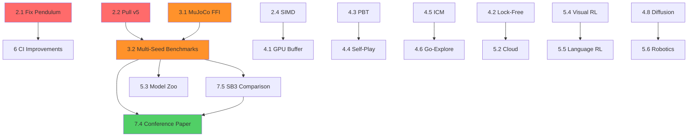
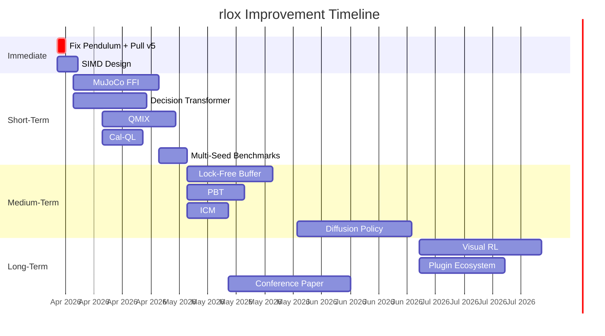

# Master Improvement Plan

**Date:** 2026-04-03
**Version:** rlox v1.0.0
**Status:** Single source of truth for all remaining work

---

## 1. Current Status Dashboard

| Metric | Value |
|--------|-------|
| Rust tests | 412 |
| Python tests | 956 passed, 1 flaky, 2 skipped |
| Algorithms | 9 model-free + 4 offline + 2 LLM (15 total) |
| Convergence | v5 complete (32/32), v6 running (24/32) |
| CI | Rust, Python 3.10-3.13, Clippy, Rustfmt, Ruff |
| PyPI | v1.0.0 published |
| Waves shipped | 1-4 (augmentation, reward shaping, weight ops, LAP, buffers, RND, Reptile, AWR) |

---

## 2. Immediate (This Week)

| # | Action | Effort | Impact | Files |
|---|--------|--------|--------|-------|
| 2.1 | Fix flaky Pendulum test (IQM=-1205 vs -1000) | 1h | HIGH | `test_mujoco_convergence.py` |
| 2.2 | Pull v5 final results from GCS | 2h | MEDIUM | `docs/benchmark/` |
| 2.3 | Monitor v6 completion (24/32) | Passive | MEDIUM | — |
| 2.4 | Wave 5 SIMD design + initial benchmarks | 3d | MEDIUM | `priority.rs`, `rlox-bench` |

---

## 3. Short-Term (1-4 Weeks)

| # | Action | Effort | Impact | Prerequisites |
|---|--------|--------|--------|---------------|
| 3.1 | **MuJoCo FFI** — replace SimplifiedMuJoCoEnv with real bindings | 2-3w | HIGH | mujoco-sys crate |
| 3.2 | **Multi-seed benchmarks** — 5+ seeds, IQM, bootstrap CI | 1w | HIGH | 3.1 for full coverage |
| 3.3 | **Decision Transformer** — RL as sequence modeling | 2-3w | HIGH | SequenceReplayBuffer (shipped) |
| 3.4 | **QMIX** — cooperative MARL value decomposition | 2-3w | HIGH | MAPPO (exists) |
| 3.5 | **Cal-QL** — calibrated conservative Q-learning | 1-2w | MED-HIGH | CQL (exists) |

---

## 4. Medium-Term (1-3 Months)

| # | Action | Effort | Impact |
|---|--------|--------|--------|
| 4.1 | GPU-accelerated buffer sampling | 3w | MEDIUM |
| 4.2 | Lock-free concurrent buffers (MPSC) | 3w | HIGH |
| 4.3 | Population-based training (PBT) | 2w | HIGH |
| 4.4 | Self-play for competitive envs | 2-3w | MEDIUM |
| 4.5 | ICM intrinsic curiosity | 1-2w | MEDIUM |
| 4.6 | Go-Explore hard exploration | 3-4w | MEDIUM |
| 4.7 | TRPO / MPO algorithms | 2w each | MEDIUM |
| 4.8 | Diffusion Policy | 4w | HIGH |

---

## 5. Long-Term Vision (3-6 Months)

| # | Action | Effort | Impact |
|---|--------|--------|--------|
| 5.1 | Plugin ecosystem (`@register_env`, `@register_buffer`) | 3-4w | HIGH |
| 5.2 | Cloud-native deployment (K8s, SageMaker, Helm) | 4-6w | HIGH |
| 5.3 | Model zoo / pretrained checkpoints | 2-3w | HIGH |
| 5.4 | Visual RL (Atari, DMControl pixels) | 4-6w | HIGH |
| 5.5 | Language-conditioned RL | 4-6w | MED-HIGH |
| 5.6 | Real-world robotics integration | 8+w | HIGH |

---

## 6. Technical Debt

| Item | Effort | Impact |
|------|--------|--------|
| Fix flaky Pendulum test | 1h | HIGH |
| Add nightly CI job for slow tests | 2h | HIGH |
| Add MuJoCo to CI matrix | 1h | MEDIUM |
| Add wheel smoke test to CI | 1h | MEDIUM |
| Add codecov | 2h | MEDIUM |
| Extract `_detect_env_spaces` to `utils.py` (4 copies) | 1h | LOW |
| Fix compiler warnings (rlox-burn: 3, rlox-candle: 6) | 1h | LOW |

---

## 7. Community & Growth

| Item | Effort | Impact |
|------|--------|--------|
| GitHub issue templates | 1h | MEDIUM |
| PyPI download badge | 30min | LOW |
| Discord / Discussions | 2h | MEDIUM |
| **Conference paper** (JMLR MLOSS / NeurIPS) | 4-6w | HIGH |
| **SB3/TorchRL comparison benchmarks** | 2w | HIGH |

---

## Dependency Graph

## Timeline

