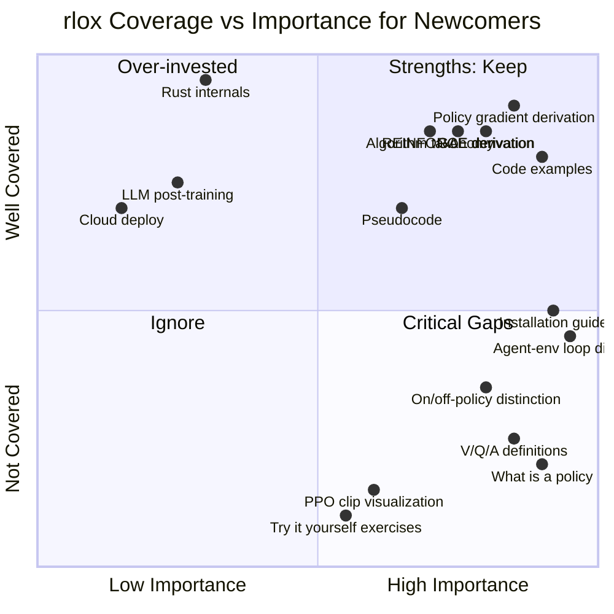
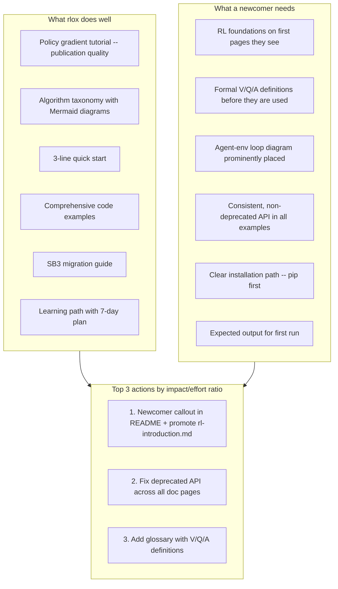

# Newcomer Experience Audit: rlox Documentation

**Date:** 2026-03-29
**Persona:** CS grad student, knows Python + basic ML, zero RL experience
**Benchmark:** OpenAI Spinning Up in Deep RL

---

## 1. Overall Grade: B+

**Justification:** rlox's documentation is remarkably comprehensive for a project of its maturity. The learning path, algorithm taxonomy, and policy gradient tutorial are genuinely strong -- better than most RL libraries outside of Spinning Up. However, the documentation is primarily written for someone who *already knows RL* and wants to learn *rlox's API*. A true newcomer with no RL background would hit several walls: concepts used before they are defined, missing visual intuition-builders, and an implicit assumption that the reader can fill in gaps from Spinning Up or Sutton & Barto. The "last mile" of beginner-friendliness is the gap.

| Dimension | Grade | Notes |
|-----------|-------|-------|
| Completeness | A- | Nearly every topic is covered somewhere |
| Discoverability | B+ | Learning path is excellent; some cross-links are broken or circular |
| Beginner-friendliness | C+ | Assumes too much RL knowledge in the first 3 pages |
| Code runnability | B+ | Many examples, but some use deprecated API patterns |
| Visual intuition | B- | Mermaid diagrams present but missing key pedagogical visuals |
| Engagement / narrative | B | Tutorial tone varies; some pages are dry API reference |

---

## 2. Journey Walkthrough: Step by Step

### Step 1: README.md

**First impression:** Polished, professional. The "Why rlox?" section is clear and well-motivated for someone who already uses SB3 or TorchRL. The 3-line quick start is excellent.

**Where a newcomer gets stuck:**
- The "Polars architecture pattern" metaphor assumes you know Polars. A newcomer who only knows sklearn/PyTorch will not understand "Rust data plane + Python control plane" without more context.
- The term "GAE" appears in the quick start section (`rlox.compute_gae`) with no definition. A newcomer sees "140x faster GAE than Python loops" and thinks: what is GAE?
- The architecture diagram lists "V-trace, GRPO, pipeline" -- all undefined at this point.
- The benchmark table is impressive but meaningless to someone who does not yet know what "GAE," "buffer push," or "E2E rollout" mean in RL context.
- **Missing:** A single sentence like "New to RL? Start with our [Learning Path](docs/learning-path.md)." The README links to the learning path only in the Tutorials table, buried below the benchmarks.

**Checklist:**
- [ ] Can understand without prior RL? **No.** GAE, V-trace, GRPO, advantage computation all used without definition.
- [x] Runnable code examples? **Yes.** The 3-line PPO example is great.
- [ ] Clear "next step" for newcomers? **No.** The link to the learning path is in a table, not called out prominently.
- [x] Prerequisites stated? **Yes.** Rust and Python versions listed.

### Step 2: docs/learning-path.md

**Strengths:** The Mermaid flowchart is genuinely helpful. The 7-day reading order table is pragmatic. The algorithm selection flowchart is one of the best features of the entire documentation.

**Where a newcomer gets stuck:**
- Level 2 "Core Concepts" links to `rl-introduction.md` -- but this link appears at the *bottom* of the section, after the Observations/Actions/Rewards table. The newcomer needs rl-introduction.md *first*, before they can parse the table.
- The table "Observations, actions, rewards" uses notation like `Box(4,)` and `Discrete(2)` without explaining these are Gymnasium space types.
- Level 3 says "Learn these in order -- each builds on the previous" for on-policy methods, but does not say *what prerequisite knowledge* each one requires. A newcomer reading VPG.md will hit terms like "advantage estimate" which are only fully derived in the policy-gradient-fundamentals tutorial.
- Level 4 lists "RND," "ICM," "Go-Explore," "Reptile," "CQL," "Cal-QL" etc. with one-line descriptions. A newcomer does not have enough context to know whether they need any of these.

**Checklist:**
- [ ] Can understand without prior RL? **Partially.** The structure is clear but individual concept descriptions assume familiarity.
- [ ] All technical terms defined? **No.** "CTDE," "value decomposition," "stochastic policy" used without definition.
- [x] Clear next steps? **Yes.** Links at every level.
- [x] Engaging? **Yes.** Progressive structure with estimated times.

### Step 3: docs/getting-started.md

**Strengths:** Step-by-step structure. The low-level API example (Step 3) is excellent for showing what happens "under the hood." The API reference table at the bottom is comprehensive.

**Where a newcomer gets stuck:**
- **Installation friction:** The getting-started page shows `maturin develop --release` as the primary installation method, while the README shows `pip install rlox`. These are contradictory first experiences. A newcomer will be confused about which to use.
- Step 5 uses `SACTrainer` (deprecated per the README deprecation note). Step 7 uses `PPOTrainer` (also deprecated). This is a real credibility issue -- the getting-started guide contradicts the README.
- Step 3 (Low-Level API) introduces `RolloutCollector`, `PPOLoss`, `RolloutBatch`, `DiscretePolicy` all at once. No explanation of what a "rollout" is, what "advantages" are, why we normalize them, or what "minibatches" mean in RL context.
- Step 4 (Rust Primitives) shows `compute_gae` and `ReplayBuffer` as low-level tools. Fine, but the newcomer still does not know what GAE *is* -- that is only covered in the policy gradient tutorial.
- Step 6 (Custom Environments) is premature in a getting-started guide. The newcomer has not even understood the default environments yet.
- **Massive API reference table** at the bottom is overwhelming for a getting-started page. This belongs in a separate API reference document.

**Checklist:**
- [ ] Can understand without prior RL? **No.** Terms like "rollout," "advantage," "GAE," "replay buffer" used without definition.
- [ ] All technical terms defined? **No.**
- [x] Runnable examples? **Yes.** Step 1 is directly runnable.
- [x] Clear next steps? **Yes.** Links at the bottom.
- [ ] Prerequisites stated? **Partially.** Python/Rust versions but not RL knowledge level.

### Step 4: docs/tutorials/policy-gradient-fundamentals.md

**This is the strongest page in the documentation.** It closely mirrors Spinning Up's pedagogical approach.

**Strengths:**
- Derives the policy gradient from first principles
- Explains the score function trick with a proof sketch
- Progressive: REINFORCE -> reward-to-go -> baselines -> VPG -> GAE -> TRPO -> PPO
- Side-by-side code (Python vs Rust)
- The Mermaid diagram showing REINFORCE -> VPG -> TRPO/PPO progression
- "What you should observe" callout boxes
- Hands-on experiments with different clip_eps values

**Where a newcomer gets stuck:**
- **Prerequisites box says** "You should be comfortable with: The RL loop: agent observes s, takes action a, receives reward r." But this is the *very thing* that Spinning Up explains in detail and rlox does not explain before this page. The learning path sends you here *before* you read rl-introduction.md in many flows.
- Missing: an explanation of what a *policy* is as a function. Spinning Up has a whole section "What is a policy?" with concrete examples (lookup table vs neural network). rlox jumps straight to $\pi_\theta(a|s)$ notation.
- Missing: the distinction between stochastic and deterministic policies
- Missing: V(s), Q(s,a), and A(s,a) are used in the GAE section without ever being formally introduced. The baseline section says "the optimal baseline is V^pi(s_t), the state-value function" but never defines what a state-value function is.
- Missing: the environment/dynamics model distinction. Why does $p(s_{t+1}|s_t,a_t)$ "drop out"? A newcomer needs to understand model-free vs model-based to appreciate this.

**Checklist:**
- [ ] Can understand without prior RL? **Almost.** 80% of the way there, but missing foundational definitions.
- [ ] All terms defined when first used? **No.** V(s), Q(s,a), "on-policy," "off-policy" all assumed.
- [x] Runnable code? **Yes.** Multiple examples.
- [x] Engaging? **Yes.** Best page in the docs.
- [ ] Clear next step? **Yes.** Further reading section.

### Step 5: docs/algorithms/index.md

**Strengths:** The Mermaid taxonomy diagram is excellent. The comparison table is comprehensive and well-organized. The "Choosing an algorithm" section with "Start with PPO" is exactly right.

**Where a newcomer gets stuck:**
- The comparison table uses terms like "Stochastic (CTDE)," "Value decomposition," "Deterministic (offline)" -- none defined on this page.
- "Data Efficiency" column: what does "Low" vs "High" mean? Is this sample efficiency? Wall-clock efficiency? Not specified.
- The distinction between "Stability: Medium" for A2C and "Stability: High" for PPO -- stability of what? Training? Policy? Not explained.
- The algorithm selection flowchart asks "Need max entropy?" A newcomer does not know what maximum entropy RL is.

**Checklist:**
- [ ] Can understand without prior RL? **No.** Comparison table requires existing knowledge to interpret.
- [ ] Terms defined? **No.** CTDE, value decomposition, stochastic vs deterministic policy all undefined.
- [ ] Runnable code? **No.** This is a navigation page.
- [x] Clear next steps? **Yes.** Links to every algorithm page.

### Step 6: docs/algorithms/vpg.md

**Strengths:** Clean structure. Pseudocode before real code. Equations clearly formatted. The "Quick Start" showing how to emulate VPG via PPO config is practical.

**Where a newcomer gets stuck:**
- "VPG is not implemented as a standalone algorithm." This is confusing. The learning path says "Learn these in order: VPG, A2C, PPO." But VPG does not actually exist as a separate entity -- you configure PPO to behave like VPG. A newcomer will wonder: did I misunderstand the learning path?
- The Trainer API in the quick start uses `Trainer("ppo", ...)` but calls it VPG. The learning path has a separate link `[VPG](algorithms/vpg.md)` suggesting it is its own thing.
- The equations repeat what is in the policy gradient fundamentals tutorial without adding new insight.

**Checklist:**
- [ ] Can understand without prior RL? **No.** Advantage estimate, discount factor assumed.
- [x] Pseudocode? **Yes.**
- [x] Runnable code? **Yes.** (Via PPO emulation.)
- [x] When to use / not use? **Yes.**

### Step 7: docs/algorithms/ppo.md

**Strengths:** Clean, concise. The hyperparameter table with defaults is very useful. The pseudocode is clear.

**Where a newcomer gets stuck:**
- No intuition-building beyond "PPO prevents destructively large policy updates by clipping the probability ratio." A newcomer needs to understand *why* large updates are bad. This is covered in the tutorial but not linked from here.
- No link back to the policy-gradient-fundamentals tutorial for the derivation context.
- The "When to Use" section is great, but the "Do not use" clause references SAC and TD3 without explaining why they would be better (sample efficiency for continuous control is stated but not explained).

**Checklist:**
- [ ] Can understand without prior RL? **No.** Importance sampling ratio, clipped surrogate, GAE all assumed.
- [x] Hyperparameter table? **Yes.** Excellent.
- [x] Runnable code? **Yes.**
- [ ] Cross-links to tutorials? **No.** Should link to policy-gradient-fundamentals.

### Step 8: docs/examples.md

**Strengths:** Comprehensive. Every algorithm has a runnable example. The Python/Rust tabs are a nice touch. Plugin, visual RL, and cloud deploy examples are present.

**Where a newcomer gets stuck:**
- The examples assume you already know *what* each component does. There is no narrative -- it is a cookbook, not a tutorial.
- The PPO example uses `PPO` from `rlox.algorithms.ppo` while other examples use `Trainer("ppo", ...)`. The distinction between these two APIs is not explained on this page.
- The "Custom Collector with Exploration" example introduces `GaussianNoise`, `OffPolicyCollector`, and shared buffers. This is advanced usage presented as just another example.

**Checklist:**
- [ ] Can understand without prior RL? **No.** Pure cookbook.
- [x] Runnable code? **Yes.** Many examples.
- [ ] Progressive difficulty? **No.** Jumps from "2 lines" to "custom collectors."
- [ ] Narrative? **No.** Just code blocks.

### Step 9: docs/python-guide.md

**Strengths:** The 3-level API table (Trainer / Algorithm / Primitives) is excellent conceptual framing.

**Where a newcomer gets stuck:**
- Installation section shows `maturin develop --release` again, contradicting `pip install rlox`.
- Uses deprecated `PPOTrainer`, `SACTrainer`, `DQNTrainer`, `A2CTrainer` in examples.
- Heavy on API surface, light on explanation.

### Step 10: docs/rust-guide.md

**Strengths:** Extremely detailed. Great for someone who wants to understand or contribute to the Rust layer. The code examples with assertions serve as self-documenting specs.

**Where a newcomer gets stuck:**
- This is correctly optional for a Python-focused newcomer. No issues.

### Step 11: docs/tutorials/migration-sb3.md

**Strengths:** The side-by-side table is immediately useful. The full migration example is realistic.

**Where a newcomer gets stuck:**
- This page is well-targeted at SB3 users, not complete beginners. Fine as is.

### Step 12: docs/tutorials/custom-rewards-and-training-loops.md

**Strengths:** Practical, with a clear progression from simple reward shaping to Rust extensions.

**Where a newcomer gets stuck:**
- "Assumes you have installed rlox and are familiar with the basics" -- good prerequisite statement.
- The curiosity-based reward example is a great "aha moment" candidate.

### Step 13: docs/tutorials/custom-components.md

**Strengths:** Protocol diagrams are excellent. Examples show real-world usage patterns.

**Where a newcomer gets stuck:**
- Advanced content, appropriately so. No issues for its target audience.

---

## 3. Missing Content List (Prioritized)

### P0 -- Critical (newcomers will abandon without these)

| # | Gap | Impact | Where it should go |
|---|-----|--------|--------------------|
| 1 | **"What is RL?" standalone primer** -- rl-introduction.md exists but is not prominently linked from README or getting-started | Newcomers land on README, see GAE/V-trace, have no on-ramp | README + getting-started header |
| 2 | **Agent-environment loop diagram** on the first page they see | Spinning Up's #1 pedagogical tool. rl-introduction.md has it but it is buried. | README or getting-started Step 0 |
| 3 | **Glossary of RL terms** -- policy, value function V(s), Q(s,a), advantage A(s,a), trajectory, episode, on-policy, off-policy, discount factor, return | Terms used everywhere without definition | New file: docs/glossary.md, linked from learning-path Level 2 |
| 4 | **Fix deprecated API in getting-started.md** -- Steps 5 and 7 use `SACTrainer` / `PPOTrainer` instead of `Trainer(...)` | Newcomers copy-paste, get deprecation warnings, lose trust | getting-started.md |
| 5 | **Resolve installation contradiction** -- README says `pip install rlox`, getting-started says `maturin develop` | First 5 minutes determines whether they continue | getting-started.md |

### P1 -- Important (newcomers will struggle without these)

| # | Gap | Impact | Where it should go |
|---|-----|--------|--------------------|
| 6 | **"What is a policy?" with concrete examples** (lookup table, if-then rules, neural network) | Spinning Up's #2 pedagogical tool. rlox jumps to $\pi_\theta$ | policy-gradient-fundamentals.md Section 0 |
| 7 | **Value function definitions** -- V(s), Q(s,a), A(s,a) formally defined with intuition | Used in GAE, VPG, PPO sections without definition | policy-gradient-fundamentals.md or rl-introduction.md |
| 8 | **On-policy vs off-policy explained** with the "reuse data?" frame | Learning path separates algorithms by this distinction but never defines it | learning-path.md Level 3 preamble or rl-introduction.md |
| 9 | **Cross-links between algorithm pages and the tutorial** -- PPO.md should link to the derivation in policy-gradient-fundamentals | Newcomer reads PPO.md in isolation, misses the "why" | All algorithm pages |
| 10 | **Expected output** for the 3-line quick start -- what does the terminal print? | Newcomer runs it, sees numbers scrolling, does not know if it worked | README + getting-started Step 1 |

### P2 -- Nice to have (improves the experience)

| # | Gap | Impact | Where it should go |
|---|-----|--------|--------------------|
| 11 | **"Try it yourself" exercises** at the end of tutorials | Spinning Up includes exercises; rlox does not | policy-gradient-fundamentals.md, rl-introduction.md |
| 12 | **Pseudocode before code in getting-started Step 3** | Low-level API example jumps straight to code | getting-started.md Step 3 |
| 13 | **Troubleshooting FAQ** -- common errors (maturin not found, torch version mismatch, etc.) | Reduces first-5-minutes friction | getting-started.md or new FAQ page |
| 14 | **Visual: clipping diagram** showing what PPO's clip does graphically | Spinning Up has this; rlox only has the equation | ppo.md or policy-gradient-fundamentals.md |
| 15 | **Algorithm page template consistency** -- not all algorithm pages have pseudocode, "When to Use," or links back to tutorials | Inconsistent experience | All algorithm pages |

---

## 4. Specific Recommendations (with Effort Estimates)

### R1: Add a newcomer callout to README.md (30 min)

Add after the "Why rlox?" section:

```markdown
> **New to reinforcement learning?** Start with the [RL Introduction](docs/rl-introduction.md)
> and the [Learning Path](docs/learning-path.md) to build up from zero.
```

### R2: Fix deprecated API in getting-started.md (1 hour)

Replace all `SACTrainer(...)`, `DQNTrainer(...)`, `PPOTrainer(...)` with `Trainer("sac", ...)`, `Trainer("dqn", ...)`, `Trainer("ppo", ...)` throughout getting-started.md. Also fix in python-guide.md.

### R3: Resolve installation path (1 hour)

getting-started.md should lead with:

```markdown
## Quick Install (recommended)
pip install rlox

## Build from Source (for contributors)
git clone ... && maturin develop --release
```

### R4: Add a glossary page (2-3 hours)

New file `docs/glossary.md` with definitions of:
- Agent, Environment, State, Observation, Action, Reward, Return, Episode, Trajectory
- Policy (stochastic, deterministic), Value Function V(s), Action-Value Q(s,a), Advantage A(s,a)
- On-policy, Off-policy, Model-free, Model-based
- Discount factor, GAE, Replay buffer, Rollout
- Sample efficiency, Wall-clock time, Steps per second (SPS)

Each with a one-line definition and a link to where it is used in the docs.

### R5: Add "Section 0: What is a Policy?" to policy-gradient-fundamentals.md (2 hours)

Before the RL Objective section, add:
- What a policy is (function from observations to actions)
- Three examples: lookup table, hand-coded rules, neural network
- Stochastic vs deterministic (with code showing both)
- Why we parameterize policies with neural networks

### R6: Add formal V(s), Q(s,a), A(s,a) definitions (1-2 hours)

Either in rl-introduction.md or as a new "Section 1.5" in policy-gradient-fundamentals.md:
- V(s) = expected return starting from state s
- Q(s,a) = expected return starting from state s, taking action a
- A(s,a) = Q(s,a) - V(s) = "how much better is action a than average?"
- Bellman equations (brief)

### R7: Promote rl-introduction.md in the learning path (30 min)

In learning-path.md Level 2, move the link to rl-introduction.md to the *top* of the section, before "Policy gradient fundamentals":

```markdown
## Level 2: Core Concepts

**Start here:** [RL Introduction](rl-introduction.md) -- the agent-environment loop,
states, actions, rewards, and the RL optimization problem.

Then read [Policy Gradient Fundamentals](tutorials/policy-gradient-fundamentals.md)...
```

### R8: Add cross-links from algorithm pages to tutorials (1 hour)

Every algorithm page (ppo.md, vpg.md, etc.) should have a "Background" section at the top:

```markdown
> **Background:** This page assumes familiarity with policy gradients.
> See [Policy Gradient Fundamentals](../tutorials/policy-gradient-fundamentals.md)
> for the derivation of the equations used here.
```

### R9: Add expected output to quick start examples (1 hour)

After the 3-line PPO example in README.md and getting-started.md:

```
$ python train.py
Step 1024 | SPS: 8,432 | Mean reward: 32.5
Step 2048 | SPS: 9,100 | Mean reward: 87.3
...
Step 50000 | SPS: 9,121 | Mean reward: 487.2
Mean reward: 487.2
```

### R10: Add a PPO clipping visualization (2-3 hours)

Either a Mermaid diagram or a matplotlib plot showing:
- x-axis: probability ratio r(theta)
- y-axis: objective L(theta)
- The clipped region [1-eps, 1+eps]
- What happens for positive vs negative advantages

This is one of Spinning Up's most linked-to diagrams.

---

## 5. Comparison Matrix: Spinning Up vs rlox Coverage



| Spinning Up Feature | Spinning Up Quality | rlox Coverage | rlox Location | Gap Severity |
|---|---|---|---|---|
| Agent-environment loop diagram | Excellent (visual + text) | Exists but buried | rl-introduction.md | **High** -- not on first pages |
| "What is a policy?" with examples | Excellent (concrete) | Missing | -- | **High** |
| States, observations, actions, rewards | Excellent (formal + intuitive) | Partial | learning-path.md table | **Medium** -- table but no prose |
| V(s), Q(s,a), A(s,a) definitions | Excellent (Bellman eqs) | Missing formal defs | -- | **High** -- used everywhere |
| Policy types (stochastic vs deterministic) | Good | Missing | -- | **Medium** |
| On-policy vs off-policy | Good (with diagram) | Label only | learning-path.md | **Medium** |
| Algorithm taxonomy (model-free/based) | Good | Good (Mermaid) | algorithms/index.md | **Low** |
| Policy gradient derivation | Good | Excellent | policy-gradient-fundamentals.md | **None** |
| REINFORCE derivation | Good | Excellent | policy-gradient-fundamentals.md | **None** |
| GAE derivation | Good | Excellent | policy-gradient-fundamentals.md | **None** |
| PPO clipping explanation | Good (with figure) | Good (equation) | policy-gradient-fundamentals.md | **Low** -- missing visual |
| Pseudocode before real code | Consistent | Inconsistent | Some algorithm pages | **Low** |
| "Try it yourself" exercises | Several per page | None | -- | **Medium** |
| Runnable code that reproduces paper results | Some | Many | examples.md | **None** -- rlox is stronger here |
| Algorithm comparison table | Minimal | Excellent | algorithms/index.md | **None** -- rlox is stronger here |
| Benchmarks / performance data | None | Excellent | benchmark/* | **None** -- rlox is much stronger |

---

## 6. Quick Wins (< 1 day each)

These are changes that would disproportionately improve the newcomer experience relative to their implementation effort.

### Win 1: Newcomer callout in README (30 min)
Add a visible callout box linking to rl-introduction.md for people new to RL. This single change fixes the most common entry-point failure: landing on the README, seeing jargon, and leaving.

### Win 2: Fix deprecated API in getting-started and python-guide (1 hour)
Search-and-replace `SACTrainer`, `DQNTrainer`, `PPOTrainer`, `A2CTrainer` with the unified `Trainer(...)` API. This eliminates the most common trust-breaking moment: "the tutorial code does not match the README."

### Win 3: Clarify installation path (30 min)
Lead with `pip install rlox` in getting-started.md. Move source-build instructions to a "Contributing" or "Building from Source" subsection.

### Win 4: Promote rl-introduction.md in the reading order (30 min)
In learning-path.md, make rl-introduction.md the *first* link in Level 2, not the last. In the Day 1 row of the reading order table, list it before "Getting Started."

### Win 5: Add cross-links from algorithm pages to the tutorial (1 hour)
Every algorithm .md file gets a one-line "Background" note linking to policy-gradient-fundamentals.md. Prevents the "I'm reading PPO but I don't understand what clipping is" moment.

### Win 6: Add expected terminal output to the 3-line example (30 min)
Show what the newcomer should see when they run the quick start. This is the difference between "did it work?" and "it worked!"

### Win 7: Trim the API reference from getting-started.md (1 hour)
Move the 40-row API reference table from getting-started.md to a dedicated api-reference.md page. Getting-started should be a gentle on-ramp, not a phone book.

---

## 7. Practical Experimentation Readiness Checklist

After reading all the docs, can a newcomer:

| Task | Can they? | Friction level | Notes |
|------|-----------|---------------|-------|
| Install rlox in < 5 min | Mostly | Medium | `pip install rlox` works, but getting-started suggests source build |
| Train first agent in < 1 min | Yes | Low | 3-line example is great |
| Understand output | No | High | No sample output shown; no explanation of SPS, mean_reward |
| Try a different algorithm | Yes | Low | `Trainer("sac", ...)` is obvious |
| Try a different environment | Yes | Low | `env="Pendulum-v1"` is obvious |
| Modify hyperparameters | Yes | Low | Config dict pattern is clear |
| Add a callback | Yes | Medium | Examples exist but scattered |
| Compare rlox to SB3 | Yes | Low | migration-sb3.md is excellent |

---

## 8. Summary



**Bottom line:** rlox's documentation is 80% of the way to being genuinely best-in-class for an RL library. The gap is almost entirely in the "zero to first concept" phase -- the first 30 minutes of a newcomer's experience. The policy gradient tutorial, algorithm taxonomy, and examples are strong enough that once a newcomer *gets past* the initial jargon barrier, they have everything they need. Closing that initial gap requires approximately 1-2 days of focused writing, not a documentation overhaul.
