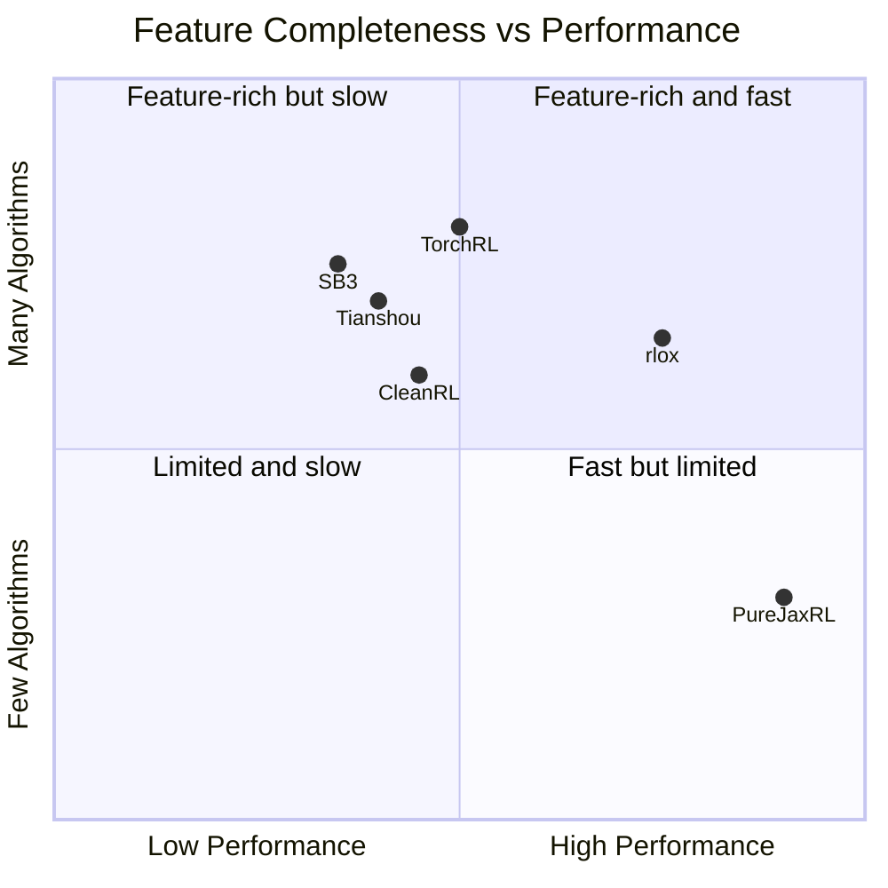
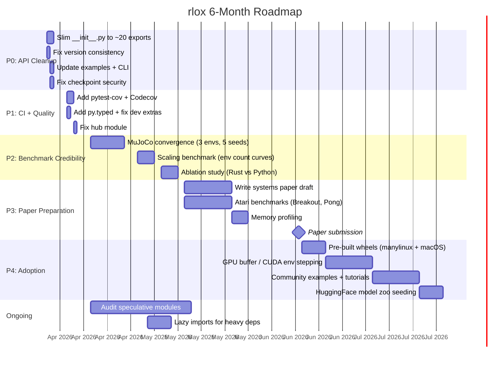

# rlox Package Review -- Fresh-Eyes Assessment

**Date:** 2026-03-29
**Reviewer perspective:** Senior ML Research Scientist, first encounter with the project
**Commit:** v1.0.0 / v1.1.0 (same-day release)

---

## 1. Executive Summary

**Grade: B+ (Strong project with specific gaps preventing A-tier)**

rlox is an ambitious and well-architected RL framework that delivers on its core premise: Rust-accelerated data-plane operations wrapped in a Pythonic control plane. The "Polars of RL" positioning is credible -- the benchmark numbers are real and the architecture is sound. However, the project has expanded faster than it has consolidated: 27 algorithm files, 40+ Python modules, and a 438-line `__init__.py` signal scope creep that risks becoming a maintenance burden. The gap between "what is exported" and "what is battle-tested" is the primary risk.

---

## 2. Strengths (Keep / Amplify)

### 2.1 Architecture (Exceptional)

The Rust data-plane / Python control-plane split is genuinely well-executed:
- PyO3 bindings with zero-copy where possible
- Rayon parallelism for VecEnv
- ChaCha8 RNG for reproducible, low-latency sampling
- Clean crate separation (core, nn, burn, candle, python, bench, grpc)

This is the project's moat. No other Python RL library has this.

### 2.2 Benchmark Infrastructure (Strong)

- Bootstrap 95% CI with 10,000 resamples
- Three-framework comparison (rlox vs SB3 vs TorchRL)
- Convergence benchmarks with multiple seeds
- Documented methodology with reproducibility instructions

### 2.3 Documentation (Above Average)

- Learning path from beginner to production is well-structured
- Mermaid flowcharts for algorithm selection
- RL Introduction for newcomers
- Math reference with derivations
- SB3 migration guide

### 2.4 Config System (Well-Designed)

- `ConfigMixin` with YAML/TOML/dict serialization
- Key aliases with "did you mean?" suggestions on typos
- Validation in `__post_init__`
- `merge()` for selective overrides

### 2.5 Protocol System (Clean)

- Runtime-checkable protocols for all major components
- Users can swap any component without inheritance
- Good separation: `OnPolicyActor`, `StochasticActor`, `DeterministicActor`, etc.

### 2.6 Testing (Good Coverage)

- ~893 Python test functions across 49 test files (13,972 lines)
- 444 Rust tests
- Convergence tests properly separated via `@pytest.mark.slow`
- API stability tests
- Proptest for Rust property-based testing

---

## 3. Weaknesses (What to Fix)

### 3.1 CRITICAL: API Surface Explosion

**`__init__.py` exports 140+ symbols.** This is the single biggest problem.

```
__all__ has 140 entries across 20+ categories
```

For comparison:
- SB3 exports ~15 symbols from top level
- TorchRL exports ~20
- Gymnasium exports ~10

**Impact:** Users cannot tell what matters. `py_sample_mixed`, `compute_batch_token_kl_schulman_f32`, `average_weight_vectors` -- these are implementation details, not user-facing API. Import time is also affected (every module is loaded eagerly).

**Recommendation:** Create a tiered API:
```python
# Tier 1 (top-level): Trainer, TrainingConfig, train_from_config
# Tier 2 (submodule): rlox.algorithms, rlox.buffers, rlox.envs
# Tier 3 (advanced): rlox.distributed, rlox.llm, rlox.deploy
# Tier 4 (internals): rlox._core (Rust primitives)
```

### 3.2 CRITICAL: Version Inconsistency

- `pyproject.toml`: `version = "1.0.0"`
- `__init__.py`: `__version__ = "1.0.0"`
- `CHANGELOG.md`: Documents `[1.1.0]` as the latest release
- `rlox-core` Cargo.toml: `version = "0.1.0"`

The Rust crate is at 0.1.0 while the Python package claims 1.0.0. This is confusing for anyone looking at crates.io vs PyPI.

### 3.3 HIGH: Example Uses Deprecated API

`examples/ppo_cartpole.py` uses:
```python
from rlox.trainers import PPOTrainer  # DEPRECATED
```

The README correctly shows `Trainer("ppo", ...)` but the actual example file contradicts it. First impressions matter.

### 3.4 HIGH: `__main__.py` ALGO_MAP Is Stale

The CLI only knows 5 algorithms (ppo, a2c, sac, td3, dqn), but `_register_builtins()` in `trainer.py` registers 16. A user running `python -m rlox train --algo trpo` will get a KeyError.

### 3.5 HIGH: Checkpoint Security Fallback

`checkpoint.py:81` falls back to `weights_only=False`:
```python
return torch.load(path, weights_only=False)
```

This silently defeats the security improvement claimed in CHANGELOG v1.1.0. The fallback should either be opt-in (require `trust_remote_code=True`) or raise with a clear message.

### 3.6 MEDIUM: Hub Module References Deprecated Trainers

`hub.py` references `PPOTrainer`, `SACTrainer`, `DQNTrainer` in `_resolve_trainer_cls()` and in the generated model card template. Should use unified `Trainer`.

### 3.7 MEDIUM: No `py.typed` Marker

The `.pyi` stub exists for `_rlox_core`, but there is no `py.typed` marker file, so type checkers will not discover it. PEP 561 compliance requires this.

### 3.8 MEDIUM: CI Missing Coverage Reporting

No `pytest-cov` or Codecov integration. For a project claiming 1094 tests, actual coverage percentage is unknown. Could be 40% or 90% -- without measurement, claims are unverifiable.

### 3.9 MEDIUM: `[dev]` Extras Not Defined

CI installs `pip install -e ".[dev]"` but `pyproject.toml` only defines `[all]` and `[gpu]` extras. This likely fails silently or installs nothing extra.

### 3.10 LOW: Clippy Lint Suppression

CI suppresses 5 Clippy lints globally:
```
-A clippy::too_many_arguments
-A clippy::type_complexity
```

`too_many_arguments` is a code smell worth addressing, not suppressing.

### 3.11 LOW: Dead/Speculative Code

Several modules appear aspirational rather than battle-tested:
- `deploy/sagemaker.py` -- generates config but unlikely tested against real SageMaker
- `distributed/vllm_backend.py` -- thin wrapper, no integration tests
- `gpu_buffer.py` -- 199 lines, unknown if actually used
- `compat/` directory -- unclear purpose

---

## 4. Recommendations (Prioritized)

### P0 -- Do Before Any Public Announcement

| # | Action | Effort | Impact |
|---|--------|--------|--------|
| 1 | **Slim `__init__.py`** to ~20 top-level exports; move rest to submodules | 2 days | Huge -- defines the actual API |
| 2 | **Fix version consistency** -- single source of truth (use `importlib.metadata`) | 2 hours | Blocks credible 1.0 claim |
| 3 | **Update all examples** to use `Trainer(...)` not deprecated trainers | 1 hour | First impression |
| 4 | **Remove checkpoint security fallback** or gate behind explicit flag | 1 hour | Security claim integrity |
| 5 | **Sync `__main__.py` ALGO_MAP** with `ALGORITHM_REGISTRY` | 30 min | CLI correctness |

### P1 -- Next 2 Weeks

| # | Action | Effort | Impact |
|---|--------|--------|--------|
| 6 | Add `py.typed` marker for PEP 561 | 10 min | Type checker discovery |
| 7 | Define `[dev]` extras in `pyproject.toml` | 15 min | CI correctness |
| 8 | Add `pytest-cov` + Codecov badge to CI | 2 hours | Credibility |
| 9 | Fix hub module to use unified Trainer | 1 hour | API consistency |
| 10 | Add `__main__.py` test for all registered algorithms | 1 hour | Prevent regressions |

### P2 -- Next Month

| # | Action | Effort | Impact |
|---|--------|--------|--------|
| 11 | Lazy imports for heavy submodules (torch, gymnasium) | 1 day | Import speed |
| 12 | MuJoCo convergence benchmarks (HalfCheetah, Walker2d, Hopper) | 1 week | Credibility for continuous control |
| 13 | Address `too_many_arguments` Clippy lint properly | 2 days | Code quality |
| 14 | Integration test for `push_to_hub` / `load_from_hub` | 1 day | Feature confidence |
| 15 | Audit `deploy/` and `distributed/` -- mark as experimental or test properly | 2 days | Honest scope |

### P3 -- Next Quarter

| # | Action | Effort | Impact |
|---|--------|--------|--------|
| 16 | GPU benchmarks (CUDA VecEnv, GPU buffer) | 2 weeks | Expands target audience |
| 17 | Multi-seed Atari benchmark (at least Breakout, Pong) | 2 weeks | Research credibility |
| 18 | Memory profiling (peak RSS during training) | 3 days | Production readiness |
| 19 | Wheel builds for Windows/Linux GPU | 1 week | Adoption |
| 20 | OpenAPI / gRPC contract tests for distributed module | 1 week | Distributed credibility |

---

## 5. Competitive Analysis



| Dimension | SB3 | TorchRL | CleanRL | Tianshou | PureJaxRL | **rlox** |
|-----------|-----|---------|---------|----------|-----------|----------|
| **Algorithms** | 12 | 15+ | 9 | 12 | 4 | 22 (claimed) |
| **Battle-tested algos** | 12 | 10+ | 9 | 8 | 4 | **~6-8** |
| **Atari benchmarks** | Yes | Yes | Yes | Yes | Yes | **No** |
| **MuJoCo benchmarks** | Yes | Yes | Yes | Yes | No | **Partial** |
| **Data-plane speed** | Slow | Medium | Slow | Slow | Very fast | **Fast** |
| **GPU training** | Yes | Yes | Yes | Yes | Yes (JAX) | **CPU only** |
| **Multi-GPU** | No | Yes | No | No | Yes | **Claimed** |
| **Documentation** | Excellent | Good | Good | Fair | Minimal | **Good** |
| **Community** | 10K+ stars | 5K+ | 5K+ | 7K+ | 2K+ | **New** |
| **Install friction** | pip | pip | pip | pip | pip | **pip+Rust** |
| **Type stubs** | Yes | Yes | No | Partial | No | **Partial** |
| **Reproducibility** | Good | Good | Excellent | Fair | Excellent | **Good** |
| **API stability** | Frozen | Evolving | Frozen | Evolving | Evolving | **Claimed frozen** |

### Unique Value Proposition

rlox's genuine differentiator is **data-plane performance without leaving Python**. PureJaxRL is faster overall but requires rewriting everything in JAX. rlox lets you keep PyTorch training loops and get 3-50x on the data operations.

### Where rlox Falls Short

1. **No Atari/MuJoCo benchmark suite** -- the RL community expects this as table stakes for credibility
2. **CPU-only training** -- GPU training is where real scale lives; Rust data plane + CPU PyTorch is a niche
3. **Installation requires Rust toolchain** for source builds -- friction vs `pip install stable-baselines3`
4. **Community** -- zero stars, zero users, zero third-party citations
5. **Algorithm depth vs breadth** -- 22 algorithms claimed but many appear minimally tested (DreamerV3, IMPALA, MAPPO at ~300-500 LOC each vs the originals at 2,000-5,000+)

---

## 6. Research Readiness

### Can You Write a Systems Paper?

**Yes, but scope it carefully.** The paper should NOT claim "22 algorithms." It should claim:

> "We present rlox, a hybrid Rust/Python RL framework that achieves 3-50x speedups on data-plane operations while maintaining a pure-Python training API. We demonstrate that the Polars architecture pattern -- Rust data plane, Python control plane -- applied to RL yields significant wall-clock improvements on PPO and A2C without sacrificing convergence."

### Required Experiments for a Paper

| Experiment | Status | Needed |
|------------|--------|--------|
| Microbenchmarks (GAE, buffer ops) | Done | Refine with Linux x86 numbers |
| SPS comparison (PPO, A2C) | Done (CartPole) | Add MuJoCo (HalfCheetah, Walker2d, Hopper) |
| Convergence equivalence | Partial | 5+ seeds, 3+ envs, statistical tests |
| Atari benchmark | Missing | At least Breakout + Pong |
| Scaling (env count vs throughput) | Missing | Critical for the "Polars of RL" claim |
| Ablation (Rust vs Python GAE/buffer) | Missing | Shows where speedup comes from |
| Memory usage comparison | Missing | Important for large-scale claims |

### Claims You Can Make Now

- "Rust GAE is 147x faster than NumPy, 1700x faster than TorchRL's Python GAE"
- "End-to-end PPO on CartPole achieves 2.3x SPS improvement over SB3"
- "Zero-copy PyO3 buffer access eliminates Python-side data marshaling overhead"

### Claims That Need More Evidence

- "The Polars of RL" -- need scaling curves showing sublinear overhead growth
- "22 algorithms" -- many appear undertested; claim only what you benchmark
- "Production-ready" -- need memory profiling, failure mode testing, long-running stability tests
- "Distributed training" -- gRPC/DDP modules exist but appear unvalidated at scale

---

## 7. Production Readiness

### Security

| Issue | Severity | Status |
|-------|----------|--------|
| Checkpoint pickle fallback | HIGH | `weights_only=False` fallback defeats purpose |
| No input sanitization on env_id strings | LOW | `resolve_env_id` passes to `gym.register` without validation |
| Hub downloads use `hf_hub_download` | OK | HF handles integrity checks |
| No dependency pinning | MEDIUM | `numpy>=1.21` is very broad |

### Stability

- API freeze claimed at 1.0.0 but version mismatch suggests it is not enforced
- Deprecation warnings on old trainers are correct pattern
- No semver CI check (e.g., `cargo-semver-checks` for Rust crates)

### Performance Bottlenecks

1. **Eager import of all modules** in `__init__.py` -- `torch`, `gymnasium`, etc. loaded at import time
2. **Single-threaded PyTorch training** -- Rust data plane advantage is muted if GPU is idle
3. **VecEnv only supports CartPole/Pendulum natively** -- GymVecEnv falls back to Python stepping

### Deployment

- Dockerfile generator exists but untested against real builds
- No pre-built wheels on PyPI for common platforms (manylinux, macOS ARM)
- CI builds wheels but only as smoke test, not as release artifacts

---

## 8. Six-Month Roadmap Suggestion



### Phase Gate Criteria

| Phase | Gate | Metric |
|-------|------|--------|
| P0 Complete | API is honest | `__all__` <= 25 top-level symbols |
| P1 Complete | CI is trustworthy | Coverage badge shows >= 70% |
| P2 Complete | Benchmarks are credible | MuJoCo convergence matches SB3 within 10% |
| P3 Complete | Paper is submittable | 3+ envs, 5+ seeds, statistical significance |
| P4 Complete | Adoption is plausible | `pip install rlox` works without Rust on Linux/macOS |

---

## 9. Detailed File-by-File Notes

### `pyproject.toml`
- **Good:** Dual license, proper classifiers, maturin config
- **Issue:** `requires-python = ">=3.9"` but CI only tests 3.10-3.13. README says "3.10-3.13". Pick one.
- **Issue:** No `[dev]` extras defined but CI uses `pip install -e ".[dev]"`
- **Issue:** `Development Status :: 5 - Production/Stable` is premature given the gaps above
- **Missing:** `[project.optional-dependencies]` should include `dev = ["pytest", "ruff", ...]`

### `python/rlox/__init__.py`
- **Issue:** 438 lines, 140+ exports. This is the main thing to fix.
- **Issue:** Eager import of everything at package level increases cold-start time
- **Issue:** `"8 algorithms, 8 trainers"` in docstring but 16 registered + 27 algorithm files
- **Good:** Docstring is comprehensive and includes quick-start example

### `python/rlox/trainer.py`
- **Good:** Clean strategy pattern, `_accepts_param` introspection is pragmatic
- **Good:** Plugin env resolution via `resolve_env_id`
- **Issue:** `seed` default of 42 should probably be `None` for production use
- **Issue:** No `__repr__` -- debugging is harder than it needs to be

### `python/rlox/config.py`
- **Good:** `ConfigMixin` is well-designed, reusable, and ergonomic
- **Good:** Alias support with deprecation warnings
- **Issue:** 1196 lines -- consider splitting per-algorithm configs into separate files
- **Issue:** TOML None -> empty string sentinel is fragile

### `python/rlox/checkpoint.py`
- **Critical:** `safe_torch_load` fallback to `weights_only=False` with just a warning
- **Good:** Async save with atomic rename pattern

### `python/rlox/protocols.py`
- **Excellent:** Clean, well-documented, runtime-checkable
- **Minor:** `Self` polyfill for < 3.11 uses `TypeVar` which is not equivalent

### `.github/workflows/ci.yml`
- **Good:** Matrix testing, Clippy, Rustfmt, slow test separation
- **Issue:** No coverage reporting
- **Issue:** No release/publish workflow
- **Issue:** `pip install -e ".[dev]"` uses undefined extras
- **Good:** Wheel smoke test is a nice touch

### `Cargo.toml` (workspace)
- **Good:** `lto = "thin"`, `codegen-units = 1`, `opt-level = 3` for release
- **Issue:** Workspace version not set -- each crate manages its own

### `docs/learning-path.md`
- **Excellent:** Progressive difficulty, Mermaid diagrams, clear time estimates
- **Issue:** References `launch_dashboard` which may not exist as a top-level function
- **Minor:** Day 7 "Visual RL wrappers" is not yet a real workflow

---

## 10. Summary Scorecard

| Dimension | Score (1-5) | Notes |
|-----------|-------------|-------|
| Architecture | 5 | Genuine innovation, well-executed |
| Code Quality | 3.5 | Good in core, uneven in peripheral modules |
| API Design | 2.5 | Too large, inconsistent between modules |
| Testing | 4 | Good coverage, proper separation, no coverage metric |
| Documentation | 4 | Above average for the space |
| Benchmarks | 3.5 | Rigorous methodology, limited env coverage |
| Production Readiness | 2.5 | Security fallback, no wheels, speculative modules |
| Research Readiness | 3 | Need MuJoCo + Atari + ablations for paper |
| Competitive Position | 3 | Strong niche, but niche is narrow without GPU |
| **Overall** | **3.4 / 5** | **B+ -- strong foundation, needs consolidation** |

The path from B+ to A is not "add more algorithms." It is: **slim the API, prove the benchmarks on standard envs, and ship pre-built wheels.** Depth over breadth.
