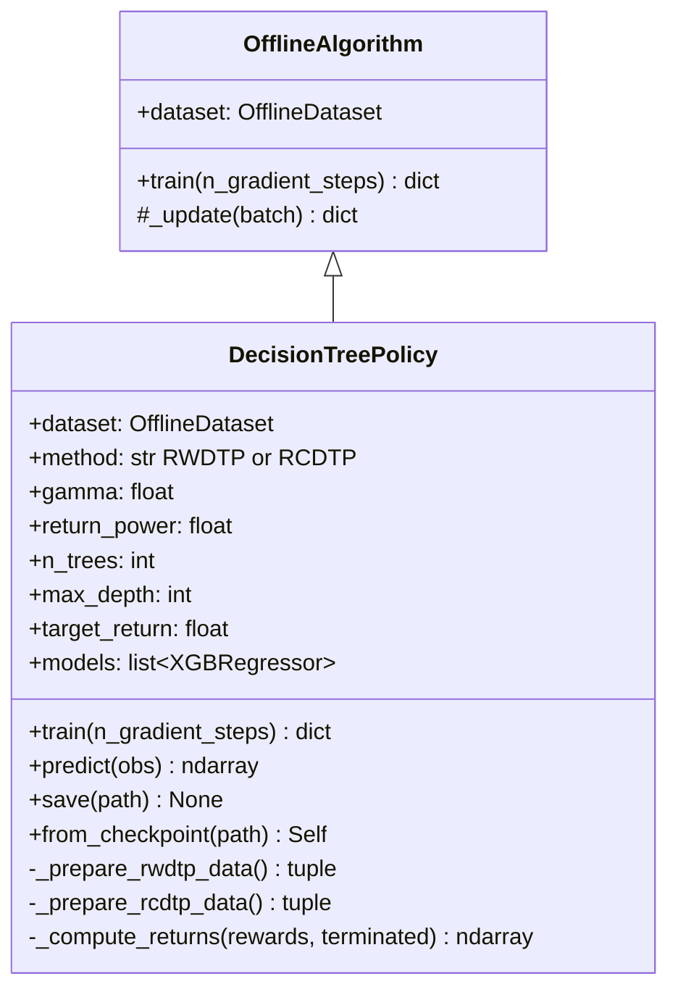

# Implementation Plan: Decision Tree Policies for Offline RL (RWDTP / RCDTP)

**Paper**: "Solving Offline Reinforcement Learning with Decision Tree Regression"
**Authors**: Prajwal Koirala, Cody Fleming (Iowa State University)
**arXiv**: 2401.11630 (2024)

## 1. Paper Summary

The paper reframes offline RL as a regression problem solvable with XGBoost decision trees instead of neural networks. Two frameworks are proposed:

1. **RWDTP (Return-Weighted Decision Tree Policy)**: A deterministic policy `a = pi(s; theta)` trained via weighted MSE regression, where each sample is weighted by its normalized return raised to a power `p`.

2. **RCDTP (Return-Conditioned Decision Tree Policy)**: A policy `a = pi(s, R_t, t; theta)` conditioned on return-to-go (RTG) and timestep, trained via standard MSE regression (like Decision Transformer but with XGBoost instead of a Transformer).

### Key Claims
- Training completes in seconds-to-minutes (vs. hours for neural baselines)
- Competitive with CQL, EDAC, SAC-N on D4RL locomotion/manipulation benchmarks
- Excels on expert and medium-expert datasets
- Robust to delayed/sparse rewards (RWDTP especially)
- Inherently interpretable (feature importance, tree visualization)

## 2. Key Equations

### RWDTP Objective (Eq. 2)
```
J_RWDTP(pi) = sum_{n=1}^{N} (a_n - pi(s_n; theta))^2 * R_tilde_n^p
```

Where:
- `R_tilde_n = (R_n - min_N{R_n}) / (max_N{R_n} - min_N{R_n})` (min-max normalized return)
- `R_t = sum_{k=t}^{T} gamma^{k-t} * r_k` (discounted return from timestep t)
- `p` is a hyperparameter exponent (default 1)

### RCDTP Objective (Eq. 3)
```
J_RCDTP(pi) = sum_{n=1}^{N} (a_n - pi(s_n, R_n, t_n; theta))^2
```

Where:
- `R_n` = return-to-go (undiscounted) at timestep n
- `t_n` = timestep within the episode
- At inference: `R_target_{t+1} = R_target_t - r_t`

### XGBoost Ensemble (Eq. 5-6)
```
pi(.) = sum_{k=1}^{K} pi^k(.)
```
Each weak policy pi^k is fitted on second-order Taylor expansion of the loss w.r.t. previous prediction.

### Hyperparameters
| Method | Params |
|--------|--------|
| RWDTP  | gamma, p (return power), n_trees (K), max_depth |
| RCDTP  | n_trees (K), max_depth, target_return (runtime) |

## 3. Architecture & Data Flow

```mermaid
flowchart TD
    subgraph Data Preparation
        A[OfflineDatasetBuffer] -->|sample all| B[Compute per-step returns]
        B --> C{Method?}
        C -->|RWDTP| D[Compute normalized weights R_tilde^p]
        C -->|RCDTP| E[Compute RTG + timestep features]
    end

    subgraph Training
        D --> F[XGBoost weighted MSE regression<br>X=states, y=actions, w=weights]
        E --> G[XGBoost MSE regression<br>X=[states, RTG, timestep], y=actions]
        F --> H[XGBRegressor model per action dim]
        G --> H
    end

    subgraph Inference
        H --> I{Method?}
        I -->|RWDTP| J[a = model.predict(s)]
        I -->|RCDTP| K[a = model.predict(s, RTG, t)<br>RTG updated each step]
    end
```

## 4. Design: What Goes Where

### Python Control Plane (all of it)
This algorithm is XGBoost-based, not PyTorch-based, so no Rust data plane is needed.
The entire implementation lives in Python.

| Component | Location |
|-----------|----------|
| Algorithm class | `python/rlox/algorithms/dtp.py` |
| Config dataclass | `python/rlox/config.py` (new `DTPConfig`) |
| Tests | `tests/python/test_dtp.py` |
| Registry | `@register_algorithm("rwdtp")` and `@register_algorithm("rcdtp")` |
| Exports | `python/rlox/algorithms/__init__.py` |

### Why not Rust?
- XGBoost is a C++ library with Python bindings; no benefit from Rust FFI
- The algorithm trains on the full dataset at once (no mini-batch SGD loop)
- Data prep (return computation, normalization) is trivially fast in NumPy

## 5. Implementation Design



### Key Design Decisions

1. **Single class, two methods**: Both RWDTP and RCDTP share enough structure (XGBoost fitting, return computation) to live in one class parameterized by `method`.

2. **One XGBRegressor per action dimension**: XGBoost's `multi_output` support is limited; per-dim regressors are standard practice and match the paper.

3. **Full-dataset training**: Unlike neural offline RL which uses mini-batch SGD, XGBoost sees the entire dataset at once. The `train()` method ignores `n_gradient_steps` and calls XGBoost's `fit()` directly.

4. **Offline-only**: No environment interaction during training. Inference is stateless for RWDTP; RCDTP maintains a running RTG.

## 6. File Changes

| File | Change |
|------|--------|
| `python/rlox/algorithms/dtp.py` | **NEW** - DecisionTreePolicy class |
| `python/rlox/config.py` | **ADD** DTPConfig dataclass |
| `python/rlox/algorithms/__init__.py` | **ADD** import + __all__ entry |
| `python/rlox/trainer.py` | **ADD** registration in _register_builtins |
| `tests/python/test_dtp.py` | **NEW** - comprehensive test suite |

## 7. Config Dataclass

```python
@dataclass
class DTPConfig(ConfigMixin):
    method: str = "rwdtp"          # "rwdtp" or "rcdtp"
    gamma: float = 1.0             # discount factor for return computation
    return_power: float = 1.0      # exponent p for RWDTP weight shaping
    n_trees: int = 500             # number of boosting rounds (K)
    max_depth: int = 6             # maximum tree depth
    learning_rate_xgb: float = 0.1 # XGBoost learning rate (shrinkage)
    target_return: float | None = None  # RCDTP runtime target return
    subsample: float = 1.0         # row subsampling ratio
    colsample_bytree: float = 1.0  # column subsampling per tree
    reg_alpha: float = 0.0         # L1 regularization
    reg_lambda: float = 1.0        # L2 regularization
```

## 8. TDD Test Plan

```mermaid
flowchart LR
    T1[test_config_defaults] --> T2[test_config_validation]
    T2 --> T3[test_return_computation]
    T3 --> T4[test_rwdtp_data_prep]
    T4 --> T5[test_rcdtp_data_prep]
    T5 --> T6[test_rwdtp_train_smoke]
    T6 --> T7[test_rcdtp_train_smoke]
    T7 --> T8[test_predict_shapes]
    T8 --> T9[test_save_load]
    T9 --> T10[test_registry_lookup]
```



### Test Cases

| Test | Description |
|------|-------------|
| `test_config_defaults` | DTPConfig has correct defaults |
| `test_config_validation` | Invalid method/negative values raise ValueError |
| `test_return_computation` | Discounted returns computed correctly on synthetic data |
| `test_rwdtp_weight_normalization` | Weights are in [0,1], sum > 0 |
| `test_rwdtp_data_prep` | Features = obs, targets = actions, weights = R_tilde^p |
| `test_rcdtp_data_prep` | Features = [obs, rtg, timestep], targets = actions |
| `test_rwdtp_train_smoke` | Training completes, loss dict returned |
| `test_rcdtp_train_smoke` | Training completes, loss dict returned |
| `test_predict_shapes` | predict(obs) returns correct shape for both methods |
| `test_predict_rcdtp_with_rtg` | RCDTP predict accepts (obs, rtg, timestep) |
| `test_save_load_roundtrip` | Save and reload produces identical predictions |
| `test_registry_rwdtp` | Trainer("rwdtp", ...) resolves correctly |
| `test_registry_rcdtp` | Trainer("rcdtp", ...) resolves correctly |
| `test_multi_action_dim` | Works with act_dim > 1 |
| `test_delayed_reward` | RWDTP handles zero-padded rewards |

## 9. Gantt Chart

```mermaid
gantt
    title DTP Implementation Timeline
    dateFormat X
    axisFormat %s

    section Tests (Red)
    Write test_dtp.py           :t1, 0, 1

    section Config
    Add DTPConfig to config.py  :t2, 1, 2

    section Algorithm (Green)
    Create dtp.py skeleton      :t3, 2, 3
    Implement return computation:t4, 3, 4
    Implement RWDTP training    :t5, 4, 5
    Implement RCDTP training    :t6, 5, 6
    Implement predict + save/load:t7, 6, 7

    section Integration
    Register + exports          :t8, 7, 8
    Run tests (all green)       :t9, 8, 9
```



## 10. Dependencies

- `xgboost` (pip install xgboost) -- the paper uses XGBoost exclusively
- Already available: `numpy`, `rlox.OfflineDatasetBuffer`

## 11. References

```
[1] P. Koirala and C. Fleming, "Solving Offline Reinforcement Learning with
    Decision Tree Regression," arXiv:2401.11630, 2024.
[2] T. Chen and C. Guestrin, "XGBoost: A Scalable Tree Boosting System,"
    in Proc. KDD, 2016, pp. 785-794.
[3] L. Chen et al., "Decision Transformer: Reinforcement Learning via
    Sequence Modeling," in Proc. NeurIPS, 2021.
[4] X. Peng et al., "Advantage-Weighted Regression: Simple and Scalable
    Off-Policy Reinforcement Learning," arXiv:1910.00177, 2019.
```
