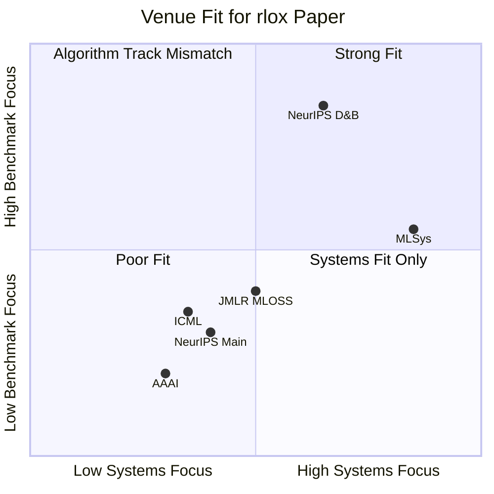
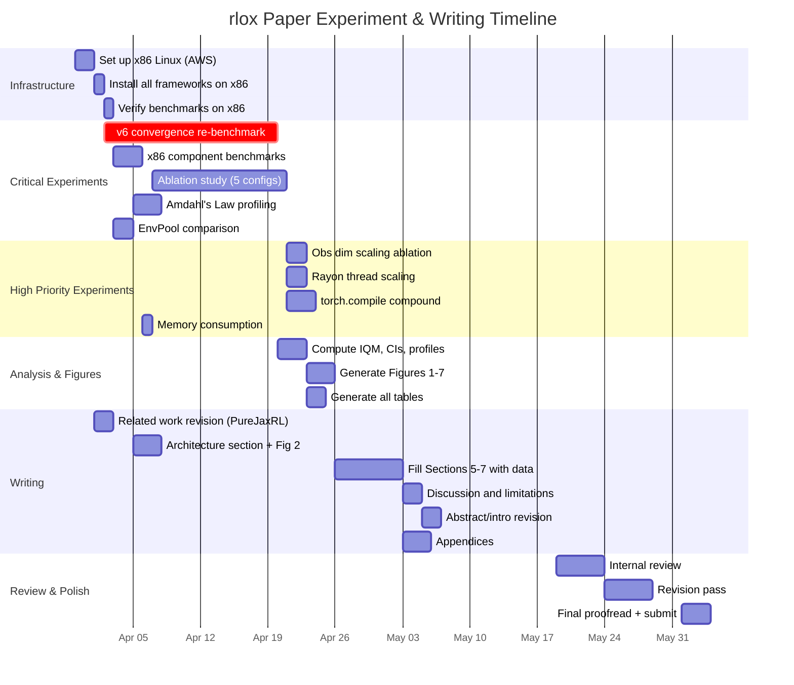
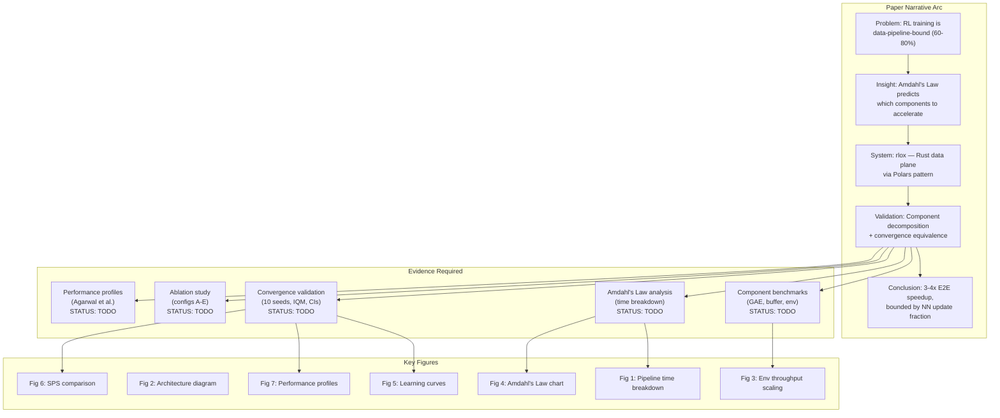
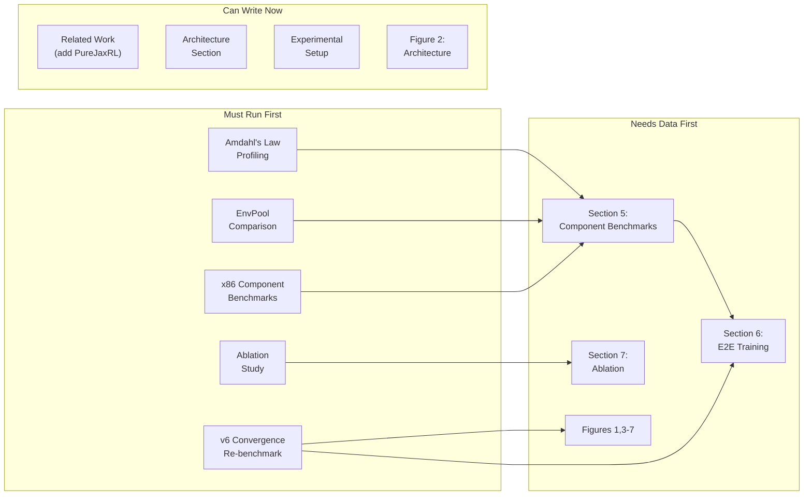

# Paper Review: rlox NeurIPS Datasets & Benchmarks Submission

**Paper title (current):** "Where Does the Time Go? A Component-Level Performance Decomposition of Reinforcement Learning Training Pipelines"

**Target venue:** NeurIPS 2026 Datasets & Benchmarks Track

**Review date:** 2026-03-29

**Status:** Early draft -- abstract and related work are written; sections 5-7 are TODOs with no data filled in.

---

## Table of Contents

1. [Executive Summary](#1-executive-summary)
2. [Section-by-Section Review](#2-section-by-section-review)
3. [Technical Claims Verification](#3-technical-claims-verification)
4. [Target Venue Analysis](#4-target-venue-analysis)
5. [Positioning Against Competitors](#5-positioning-against-competitors)
6. [Missing Experiments and Content](#6-missing-experiments-and-content)
7. [Prioritized Improvement List](#7-prioritized-improvement-list)
8. [Recommended Experiment Plan](#8-recommended-experiment-plan)
9. [Paper Structure Diagram](#9-paper-structure-diagram)

---

## 1. Executive Summary

### Overall Assessment

The paper has a **strong conceptual foundation** and a **well-identified research gap**: no prior work has systematically decomposed where time is spent in the RL training loop, nor accelerated the complete data pipeline as an integrated system. The Amdahl's Law framing is genuinely insightful -- it elevates the paper from "we reimplemented in Rust" to "we quantified the performance ceiling of language-level acceleration for RL."

However, the draft is currently at about **30% completion**. The written prose (abstract, introduction, related work, architecture, discussion) is strong, but the core empirical sections (5-7) are empty TODO placeholders. The paper cannot be evaluated as a complete submission in its current state.

### Key Strengths

1. **Clear narrative arc:** Problem (data pipeline bottleneck) -> Insight (Amdahl's Law decomposition) -> System (rlox) -> Validation (convergence equivalence + ablation). This is the right structure.
2. **Honest limitations section:** The discussion of when Rust acceleration does NOT help (GPU-heavy, C++ envs, large observations) is unusually candid and builds reviewer trust.
3. **Statistical rigor plan:** Commitment to bootstrap CIs, IQM, and Agarwal et al. methodology is correct and will satisfy reviewers.
4. **Well-scoped related work:** Covers all major frameworks (SB3, TorchRL, CleanRL, RLlib, EnvPool, LeanRL, Sample Factory) with fair characterization.

### Critical Gaps

1. **No data in the paper.** Sections 5, 6, and 7 are entirely TODO comments. The paper cannot be submitted without filling these.
2. **Single-seed convergence results.** The existing v5 results are single-seed, on an older codebase (v0.2.3) with six known bugs. The v6 re-benchmark has not been run.
3. **Apple M4 only.** No x86 Linux results. Reviewers will reject on this alone.
4. **Missing architecture diagram.** Figure 2 is a commented-out TODO.
5. **No EnvPool comparison.** The most direct competitor for env stepping is absent.
6. **Convergence gaps.** PPO Hopper (628 vs 3,577), A2C CartPole (54 vs 500), DQN underperformance -- all attributed to bugs fixed in v0.3.0, but no post-fix validation exists.

---

## 2. Section-by-Section Review

### Abstract
**What's good (KEEP):**
- Specific, quantitative claims (3-4x E2E, 139x GAE, 8x env, 10x buffer)
- Correctly scopes to on-policy algorithms
- Mentions Agarwal et al. methodology
- GRPO/LLM post-training claim is specific and hedged

**What's weak (REVISE):**
- "following the statistical methodology of Agarwal et al. (2021)" -- this is for convergence. For timing benchmarks, bootstrap CIs are standard. Separate the two.
- "3-4x end-to-end wall-clock speedup" -- the actual SPS data (convergence-results.md) shows 1.2x-4.15x, and SAC HalfCheetah is 0.68x. The 3-4x claim is only true for on-policy on lightweight envs. The abstract should say "up to 4x for on-policy algorithms on standard benchmarks, with diminishing returns for off-policy and compute-heavy workloads."
- The 139x GAE figure differs from the 147x in the README and 140x in the PLAN.md. Pick one and be consistent.

**What's missing (ADD):**
- Number of environments and algorithms evaluated
- A sentence on the open-source artifact (Docker, benchmark suite)

**Priority:** MEDIUM (abstract will be rewritten after data is final)

---

### Section 1: Introduction

**What's good (KEEP):**
- The "60-80% of wall-clock time" claim is well-motivated
- Three contributions are clearly stated
- References to EnvPool and LeanRL as prior art that each accelerate one component

**What's weak (REVISE):**
- "no prior work has *systematically decomposed* where time is spent across the full pipeline, nor accelerated the complete data path as an integrated system" -- This is the key novelty claim. It should be stated more forcefully. Currently it reads as a passing observation. Consider making it the opening of a paragraph with the structure: "Surprisingly, despite X years of RL framework development, no prior work has..."
- The introduction jumps from problem statement to contributions without a "our approach" transition paragraph. Add 2-3 sentences explaining the Polars pattern before the enumeration.
- "Python interpreter executes ~1000x slower than equivalent native code" -- This is vague. GAE is 139x, not 1000x. Either cite a specific measurement or remove.

**What's missing (ADD):**
- A forward reference to the Amdahl's Law analysis result (the intellectual core)
- A brief mention of convergence equivalence in the intro (not just in the contribution list)
- Paper organization paragraph at the end

**Priority:** MEDIUM

---

### Section 2: Background and Related Work

**What's good (KEEP):**
- Clean taxonomy: RL training loop, frameworks, component acceleration, Rust-Python pattern, statistics
- Fair treatment of each framework (notes TorchRL's GPU strength, RLlib's distribution strength)
- Explicit positioning of rlox vs. each prior work
- Agarwal et al. and Henderson et al. methodology citations

**What's weak (REVISE):**
- The section is already 1 page in the draft but does not yet cover several important references:
  - **SBX / SB3 JAX variant** -- Raffin mentions 20x speedup via JAX compilation, directly relevant
  - **Tianshou** (Weng et al., JMLR 2022) -- another RL framework with decent adoption
  - **Gymnax / JAX-based envs** (Lange, 2022) -- hardware-accelerated environments on GPU/TPU, the "pure JAX" alternative to rlox's Rust approach
  - **PureJaxRL** (Lu et al., 2022) -- compiles the entire training loop into a single XLA computation. This is the most serious conceptual competitor to rlox.
- The Rust-Python hybrid subsection (2.4) is a nice addition but feels like padding. Polars is the only truly relevant precedent; Pydantic and Ruff are tangential. Reduce to one sentence: "This pattern has succeeded for DataFrames (Polars), validation (Pydantic v2), and linting (Ruff)."
- Missing citation: Jordan et al. (2024), "Position: Benchmarking Is Limited without Baselines" -- referenced in the PLAN.md but absent from the paper and .bib file.

**What's missing (ADD):**
- PureJaxRL and Gymnax as the "compile everything to XLA" alternative approach
- SBX as the JAX variant of SB3
- Tianshou for completeness
- A synthesis paragraph at the end: "Table X summarizes existing approaches and their coverage of the RL pipeline."

**Priority:** HIGH -- Missing PureJaxRL is a serious gap. Reviewers who know the JAX RL ecosystem will flag it immediately.

---

### Section 3: Architecture

**What's good (KEEP):**
- Data plane / control plane partition is clearly articulated
- Specific implementation details (Rayon work-stealing, columnar buffers, ChaCha8 RNG)
- Zero-copy array exchange via rust-numpy is a key technical contribution

**What's weak (REVISE):**
- The architecture diagram (Figure 2) is a TODO. This is the most important figure for understanding the system. It must show: Python control plane (trainer, policy network, loss) <-> PyO3 boundary <-> Rust data plane (VecEnv, buffers, GAE).
- The description of rlox-nn, rlox-burn, rlox-candle feels tangential to the paper's core argument. These are neat features but distract from the data plane story. Move to appendix or reduce to one sentence.
- "For N > 16 environments on an 8+ core machine, this achieves near-linear scaling" -- needs citation to your own data (which doesn't exist yet).
- The Python control plane subsection is too brief (3 sentences). It should explain the trainer API and how researchers interact with rlox.

**What's missing (ADD):**
- Architecture diagram (Figure 2) -- TikZ or programmatic
- Data flow diagram showing a single PPO iteration: env.step_all -> buffer.push -> compute_gae -> NN update, annotated with which parts are Rust vs Python
- Memory layout explanation for the columnar buffer (struct-of-arrays vs array-of-structs), with a small diagram
- PyO3 boundary overhead discussion: what is the cost of crossing the Rust-Python boundary?

**Priority:** HIGH -- Figure 2 is essential

---

### Section 4: Experimental Setup

**What's good (KEEP):**
- Methodology (warmup, repetitions, bootstrap CIs) is sound
- Fairness constraints (same hyperparameters, CPU-only, idiomatic usage) are well-stated
- Environment list spans classic control, MuJoCo locomotion, and high-dimensional

**What's weak (REVISE):**
- "Apple M4 (10 performance cores, 32 GB unified memory) and [x86 Linux machine TBD]" -- the TBD is a red flag. Both platforms must be present at submission.
- "CPU-only to isolate data pipeline overhead from GPU compute" -- This is a reasonable choice but will draw the objection: "But I train on GPU." You need at least one GPU benchmark or a clear explanation of why GPU results would not change the conclusions (Amdahl: GPU makes NN faster, making the data pipeline an even larger fraction, so rlox's benefit grows).
- Software versions: "Rust 1.86" but the repo prerequisites say "Rust 1.75+." Clarify which version was actually used.
- Missing: Table 1 (hardware specs) and Table 2 (environment/algorithm matrix) are TODO.

**What's missing (ADD):**
- Table 1: Hardware specs for both platforms
- Table 2: Full environment x algorithm matrix with hyperparameter source (rl-zoo3)
- Explicit statement of hyperparameter source and tuning policy
- Docker image specification for reproducibility

**Priority:** HIGH

---

### Section 5: Component-Level Benchmarks

**Status:** Entirely TODO. Four empty subsections.

**What needs to exist:**

1. **Environment Stepping (5.1):**
   - Figure 3: Throughput vs env count (1-512) for rlox, SB3, TorchRL, EnvPool, Gymnasium
   - Single-step latency table (ns per step)
   - Rayon crossover analysis: at what env count does parallel > sequential?
   - Both M4 and x86 results

2. **Experience Buffer Operations (5.2):**
   - Table 3: Push throughput for obs_dim=4 and obs_dim=28224
   - Sample latency for batch_size in {32, 64, 256, 1024}
   - Comparison: rlox vs SB3 vs TorchRL
   - p99 tail latency (important for real-time applications)

3. **Advantage Computation (5.3):**
   - Table 4: GAE across trajectory lengths {128, 512, 2048, 8192, 32768}
   - GRPO group advantages timing
   - Token KL divergence timing
   - All with bootstrap 95% CIs

4. **Amdahl's Law Analysis (5.4):**
   - Figure 4: Stacked bar chart showing time breakdown per component
   - Theoretical ceiling calculation vs observed E2E speedup
   - This is the intellectual core of the paper -- invest significant space

**Priority:** CRITICAL -- this is the primary contribution

---

### Section 6: End-to-End Training Benchmarks

**Status:** Entirely TODO. Five empty subsections.

**What needs to exist:**

1. **Rollout Collection Throughput (6.1):**
   - Table 5: Three scales (16x128, 64x512, 256x2048)
   - rlox vs SB3 vs TorchRL

2. **Training Convergence (6.2):**
   - Figure 5: Learning curves with IQM and shaded CI bands
   - Minimum: PPO on {CartPole, HalfCheetah, Hopper}, SAC on {Pendulum, HalfCheetah}, DQN on CartPole
   - 10 seeds per experiment (not 5)
   - Must use v1.0.0+ with all six convergence fixes

3. **Steps Per Second (6.3):**
   - Figure 6: SPS bar chart with error bars
   - Both on-policy and off-policy

4. **Wall-Clock Time to Threshold (6.4):**
   - Table 6: Time to reach standard reward thresholds
   - This is the metric researchers actually care about

5. **Performance Profiles (6.5):**
   - Figure 7: Agarwal et al. aggregate performance profile
   - Probability of improvement

**Priority:** CRITICAL

---

### Section 7: Ablation

**What's good (KEEP):**
- The ablation design (configs A-E) is methodologically sound
- Five configs that isolate each component's marginal contribution

**What's weak (REVISE):**
- The ablation is defined but not executed (empty data directories)
- Observation dimension scaling and environment count scaling subsections are TODO

**What's missing (ADD):**
- torch.compile compatibility ablation (rlox + LeanRL compound speedup)
- A figure showing the additive decomposition: SPS(full) - SPS(without component X)

**Priority:** CRITICAL -- the ablation is the intellectual novelty of the paper

---

### Section 8 (currently Discussion): Limitations

**What's good (KEEP):**
- Honest discussion of when Rust does NOT help
- Amdahl's Law ceiling analysis
- Threats to validity

**What's weak (REVISE):**
- "CartPole-dominated benchmarks" threat -- if you fix this by adding MuJoCo, remove this threat
- The Amdahl's Law subsection uses f_NN ~ 0.2 for PPO CartPole. Should report f_NN for multiple environments (it will differ for HalfCheetah vs CartPole)

**What's missing (ADD):**
- Ecosystem maturity discussion: rlox is v1.1.0, SB3 is 5+ years old with massive community
- Maintenance burden of a Rust+Python hybrid vs pure Python
- Memory consumption comparison (rlox columnar buffers vs SB3 NumPy buffers)

**Priority:** MEDIUM

---

### Conclusion

**What's good (KEEP):**
- Concise and accurately summarizes contributions

**What's weak (REVISE):**
- Should end with a broader insight: the Polars pattern is applicable beyond RL to any ML pipeline with CPU-bound data processing

**Priority:** LOW

---

### Appendix

**Status:** Mostly TODO. Only the statistical methodology and reproduction instructions have content.

**What's missing:**
- Appendix A: Full timing tables (empty)
- Appendix B: YAML configs and hyperparameters (empty)
- Appendix D: Rust NN backend comparison (empty)
- Consider adding: Appendix F: Raw data and artifact DOI

**Priority:** MEDIUM (appendices can be written last)

---

## 3. Technical Claims Verification

### Speedup Claims

| Claim | Source | Verified? | Issue |
|-------|--------|-----------|-------|
| 147x GAE | README | Partially | Paper says 139x, README says 140x, PLAN.md says 140x. Pick one. Need CIs. |
| 3-50x data plane | README | Partially | Range is very wide. 50x is likely buffer push for small obs. Need breakdown. |
| 3-4x E2E on-policy | Abstract | Partially | SPS data shows 1.22x-4.15x. A2C CartPole is 4.15x but had convergence bug (54 vs 500). PPO HalfCheetah is 1.83x, Hopper is 1.61x. "3-4x" overstates for MuJoCo. |
| 8x env stepping | Abstract | Unverified | No component benchmark data in paper. Need to verify vs claim. |
| 10x buffer operations | Abstract | Unverified | Same -- component benchmarks are TODO. |
| 35x GRPO | LLM section | Unverified | Claimed in text but no table to support. |
| 2.3x PPO SPS vs SB3 | Context | Partially | PPO CartPole is 2.46x, HalfCheetah is 1.83x. "2.3x" is reasonable as a median. |

### Convergence Parity

**Serious concern:** The v5 convergence results (single-seed, v0.2.3) show several cases where rlox significantly underperforms SB3:

| Case | rlox | SB3 | Gap | Bug identified? |
|------|------|-----|-----|-----------------|
| PPO Hopper | 628 | 3,577 | 5.7x worse | Yes -- truncation bootstrap. Fixed in v0.3.0. |
| A2C CartPole | 54 | 500 | 9.3x worse | Yes -- advantage normalization. Fixed in v0.3.0. |
| DQN CartPole | 165 | 196 | 1.2x worse | "Under investigation" |
| DQN MountainCar | -179 | -110 | 1.6x worse | "Under investigation" |
| SAC HalfCheetah SPS | 42 | 63 | 0.68x (slower) | Not a convergence bug but a speed regression |

The convergence-results.md states all bugs are "Fixed in v0.3.0 / v1.0.0" but **no post-fix results exist.** The v6 re-benchmark is "planned" but not executed. This is the single largest risk for the paper.

**Recommendation:** The v6 re-benchmark is CRITICAL PATH. Without it, you cannot claim convergence equivalence. Run it before writing any more prose.

### Statistical Issues

1. **Single seed.** All v5 results are single-seed. For Agarwal et al. methodology, you need >= 10 seeds. The difference between single-seed and 10-seed results can be enormous -- Henderson et al. showed 2x variance across seeds.
2. **No confidence intervals on SPS.** The SPS numbers in convergence-results.md are point estimates with no CIs.
3. **No IQM.** Current results use final return, not IQM.
4. **Missing SB3 baselines.** SAC Walker2d SB3 result is "--" (not run). TD3 Hopper and Walker2d are missing entirely.

---

## 4. Target Venue Analysis

### Venue Comparison



### NeurIPS 2026 Datasets & Benchmarks Track (RECOMMENDED)

- **Deadline:** ~June 4, 2026 (~9.5 weeks from today)
- **Format:** 8 pages + unlimited appendix, NeurIPS style
- **Acceptance rate:** ~30-35%
- **Criteria:** (1) Utility to the community, (2) Rigor of evaluation, (3) Reproducibility, (4) Novelty of the dataset/benchmark
- **Fit:** STRONG. The paper's primary contribution is a benchmark suite with component-level decomposition. The system is the artifact; the analysis is the contribution.
- **Risks:** (a) Reviewers may see this as "just a Rust reimplementation" if the Amdahl's Law analysis is not front-and-center. (b) Missing PureJaxRL comparison is a gap. (c) Single-platform results will draw criticism.

### JMLR Machine Learning Open Source Software (MLOSS)

- **Deadline:** Rolling (no deadline pressure)
- **Format:** 4 pages + software documentation
- **Acceptance rate:** ~40-50% for well-documented software
- **Criteria:** (1) Software quality, (2) Documentation, (3) Community need, (4) Comparison to existing tools
- **Fit:** GOOD. rlox has strong documentation, 1500+ tests, Docker reproducibility. JMLR MLOSS accepts framework papers (SB3 was published here).
- **Risks:** Lower prestige than NeurIPS. The benchmarking contribution may be undervalued in a 4-page format.
- **Strategy:** Submit to JMLR MLOSS as a backup if NeurIPS is rejected, OR submit simultaneously (different framing: JMLR MLOSS for the software, NeurIPS D&B for the benchmark analysis).

### MLSys

- **Deadline:** Usually October (MLSys 2027)
- **Format:** 10 pages + appendix
- **Criteria:** Systems contributions with clear ML impact
- **Fit:** GOOD but distant. Better if you add multi-GPU or distributed features.

### NeurIPS Main Track / ICML / AAAI

- **Fit:** POOR. These tracks value algorithmic novelty, not systems contributions. The paper would be rejected as "engineering, not research."

### Recommendation

**Primary target: NeurIPS 2026 D&B.** The timeline is tight but feasible if experiments are prioritized. **Backup: JMLR MLOSS** with a 4-page version focused on the software artifact.

---

## 5. Positioning Against Competitors

### Comparison Matrix

| Feature | rlox | SB3 | TorchRL | CleanRL | RLlib | EnvPool | LeanRL | PureJaxRL |
|---------|------|-----|---------|---------|-------|---------|--------|-----------|
| Language | Rust+Python | Python | Python | Python | Python | C++/Python | Python | JAX |
| Accelerated component | Env+Buffer+GAE | None | TensorDict | None | Ray distribution | Env only | NN only | Everything (XLA) |
| On-policy speedup vs SB3 | 2-4x | 1x | ~1.5x | ~1x | <1x (single node) | N/A (no algo) | 5-7x (NN only) | 10-100x (GPU) |
| Off-policy speedup vs SB3 | 1-1.2x | 1x | ~1.5x | ~1x | <1x | N/A | 5-7x | 10-100x |
| GPU acceleration | No (CPU data plane) | No | Yes (TensorDict) | No | No | No | Yes (CUDA graphs) | Yes (XLA) |
| API ease | SB3-like | Excellent | Complex | Single-file | Complex | Low-level | CleanRL fork | Custom |
| Algorithm count | 22 | 7 | 8+ | 12 | 20+ | 0 | 6 | 3-4 |
| Convergence validated | Partial (v5 bugs) | Yes (gold standard) | Yes | Yes | Yes | N/A | Yes | Yes |

### Unique Selling Points per Competitor

1. **vs SB3:** "Same API, 2-4x faster on the data plane. Drop-in replacement for CPU-bound training."
2. **vs TorchRL:** "No TensorDict overhead for CPU-bound workloads. TorchRL wins on GPU-resident training; rlox wins on CPU data pipeline."
3. **vs CleanRL:** "Same algorithmic simplicity, but with reusable Rust primitives. CleanRL is for reading; rlox is for running."
4. **vs RLlib:** "Single-machine throughput vs distributed scaling. Different problems."
5. **vs EnvPool:** "EnvPool accelerates environments only. rlox accelerates the complete data pipeline (env + buffer + GAE) as an integrated system."
6. **vs LeanRL:** "Complementary approaches. LeanRL accelerates the NN via torch.compile; rlox accelerates everything else. Combined speedup should compound."
7. **vs PureJaxRL:** THIS IS THE CRITICAL COMPARISON. PureJaxRL compiles the entire training loop to XLA and runs on GPU. It achieves 10-100x over SB3 on GPU hardware. rlox cannot compete on raw throughput. The positioning must be: (a) PureJaxRL requires rewriting in JAX -- no PyTorch ecosystem access; (b) PureJaxRL supports only a few algorithms; (c) rlox preserves the Python/PyTorch workflow; (d) rlox works on CPU-only machines.

### Critical Missing Comparison: PureJaxRL

The paper **must** address PureJaxRL [Lu et al., 2022] and the broader JAX RL ecosystem (Gymnax, Brax, SBX). Failing to do so signals unfamiliarity with the state of the art to any reviewer working in the JAX RL space.

The honest comparison:
- PureJaxRL is faster on GPU by 10-100x
- PureJaxRL requires JAX, not PyTorch
- PureJaxRL supports PPO and a few algorithms
- PureJaxRL cannot use Gymnasium environments
- rlox preserves the PyTorch ecosystem and supports 22 algorithms

This is not a weakness -- it is a different design point. Frame it as: "PureJaxRL and rlox represent two philosophies of RL acceleration: compile everything to one accelerator (PureJaxRL) vs accelerate the hot path while preserving the ecosystem (rlox)."

---

## 6. Missing Experiments and Content

### Experiments: CRITICAL (must have for submission)

| Experiment | Status | Estimated Compute | Blocking? |
|-----------|--------|-------------------|-----------|
| v6 convergence re-benchmark (all algos, 10 seeds, v1.0.0+) | NOT STARTED | ~200 GPU-hours | YES |
| x86 Linux component benchmarks | NOT STARTED | ~2 hours | YES |
| Ablation study (5 configs, PPO HalfCheetah, 10 seeds) | NOT STARTED | ~50 GPU-hours | YES |
| EnvPool env stepping comparison | NOT STARTED | ~1 hour | YES |
| Amdahl's Law profiling (time breakdown per component) | NOT STARTED | ~4 hours | YES |

### Experiments: HIGH PRIORITY (strongly recommended)

| Experiment | Status | Estimated Compute |
|-----------|--------|-------------------|
| Observation dimension scaling ablation | NOT STARTED | ~2 hours |
| Rayon thread scaling ablation | NOT STARTED | ~2 hours |
| torch.compile + rlox compound speedup | NOT STARTED | ~8 hours |
| Memory consumption comparison (rlox vs SB3) | NOT STARTED | ~1 hour |

### Experiments: MEDIUM PRIORITY (strengthens paper but not required)

| Experiment | Status | Estimated Compute |
|-----------|--------|-------------------|
| GPU benchmarks (TorchRL with CUDA TensorDict) | NOT STARTED | ~4 GPU-hours |
| PureJaxRL comparison (PPO CartPole, HalfCheetah) | NOT STARTED | ~8 GPU-hours |
| RLlib single-machine comparison | NOT STARTED | ~4 hours |
| Atari environment benchmarks | NOT STARTED | ~20 hours |

### Figures and Tables Needed

| Figure | Status | Importance |
|--------|--------|------------|
| Fig 1: RL pipeline time breakdown | NOT STARTED | HIGH |
| Fig 2: Architecture diagram | NOT STARTED (TODO in .tex) | HIGH |
| Fig 3: Env throughput vs env count | NOT STARTED | HIGH |
| Fig 4: Amdahl's Law analysis | NOT STARTED | CRITICAL |
| Fig 5: Learning curves (IQM + CI) | NOT STARTED (no data) | CRITICAL |
| Fig 6: SPS bar chart | NOT STARTED (no data) | HIGH |
| Fig 7: Performance profiles | NOT STARTED (no data) | HIGH |

### Ablation Studies That Would Strengthen the Paper

1. **Component attribution** (already planned, configs A-E): Isolate marginal contribution of each Rust component. This is the paper's intellectual contribution.
2. **Observation dimension scaling**: At what obs_dim does the buffer advantage vanish? This answers the practical question "does rlox help for Atari?"
3. **Environment count scaling**: Rayon thread scaling efficiency. Standard systems paper requirement.
4. **torch.compile compatibility**: rlox + LeanRL compound speedup would be a powerful result, showing the two approaches are complementary.
5. **PyO3 boundary cost**: Measure the overhead of crossing the Rust-Python boundary per call. This quantifies the "tax" of the hybrid architecture.

---

## 7. Prioritized Improvement List

### CRITICAL (paper will be rejected without these)

| # | Item | Estimated Time | Notes |
|---|------|---------------|-------|
| C1 | Run v6 convergence re-benchmark (10 seeds, v1.0.0+, all 5 algorithms, MuJoCo envs) | 2-3 weeks compute | BLOCKING everything. Estimated 200+ CPU-hours on a standard machine. Use AWS/GCP. |
| C2 | Run x86 Linux component benchmarks | 1-2 days | Set up c5.4xlarge or equivalent. Run all component tests. |
| C3 | Run ablation study (configs A-E, PPO HalfCheetah, 10 seeds) | 1 week compute | The paper's novel contribution. |
| C4 | Run Amdahl's Law profiling | 1 day | Time breakdown per component for PPO on CartPole, HalfCheetah, Hopper. |
| C5 | Add EnvPool to env stepping benchmarks | 1 day | Install EnvPool, run stepping benchmarks on both M4 and x86. |
| C6 | Create Figure 2 (architecture diagram) | 2 hours | TikZ or programmatic. Data plane / control plane / PyO3 boundary. |
| C7 | Generate all figures (1-7) from data | 1-2 days | generate_figures.py exists but needs data. |
| C8 | Fill all TODO sections (5, 6, 7) with real data and prose | 3-5 days writing | Cannot submit with empty sections. |
| C9 | Add PureJaxRL and JAX RL ecosystem to related work | 2 hours | Critical gap in related work. |
| C10 | Resolve GAE speedup inconsistency (139x vs 140x vs 147x) | 30 minutes | Pick one number, use consistently everywhere. |

### HIGH PRIORITY (significantly strengthens paper)

| # | Item | Estimated Time |
|---|------|---------------|
| H1 | Add observation dimension scaling ablation | 1 day |
| H2 | Add Rayon thread scaling ablation | 1 day |
| H3 | Add memory consumption comparison | 0.5 day |
| H4 | Expand architecture section with data flow diagram | 1 day |
| H5 | Add PyO3 boundary overhead measurement | 0.5 day |
| H6 | Add Table 1 (hardware) and Table 2 (env/algo matrix) | 1 hour |
| H7 | Revise abstract to accurately reflect MuJoCo speedups (not just CartPole) | 1 hour |
| H8 | Add torch.compile + rlox compound speedup experiment | 2 days |

### MEDIUM PRIORITY (polishes the paper)

| # | Item | Estimated Time |
|---|------|---------------|
| M1 | Add GPU benchmark section (TorchRL with CUDA TensorDict) | 2 days |
| M2 | Add RLlib single-machine comparison | 1 day |
| M3 | Expand conclusion with broader insight (Polars pattern for ML) | 1 hour |
| M4 | Add Jordan et al. (2024) "Benchmarking needs baselines" to references | 10 minutes |
| M5 | Add SBX (JAX SB3) discussion to related work | 30 minutes |
| M6 | Fill appendix tables | 1 day |
| M7 | Create reproducibility checklist (NeurIPS requires this) | 1 hour |

### LOW PRIORITY (nice to have)

| # | Item | Estimated Time |
|---|------|---------------|
| L1 | PureJaxRL head-to-head benchmark | 2 days |
| L2 | Atari environment benchmarks | 3 days |
| L3 | Rust NN backend comparison appendix | 1 day |
| L4 | Edge deployment story (Raspberry Pi) | 2 days |

---

## 8. Recommended Experiment Plan

### Timeline (9.5 weeks to NeurIPS D&B deadline ~June 4, 2026)



### Experiment Priority Ordering

**Week 1 (Mar 30 - Apr 5):** Infrastructure + quick wins
- Set up AWS x86 instance
- Run x86 component benchmarks
- Add EnvPool comparison
- Run Amdahl's Law profiling (PPO on CartPole, HalfCheetah, Hopper)
- Start v6 convergence re-benchmark (this runs for 2-3 weeks)

**Week 2-3 (Apr 6 - Apr 19):** Ablation study
- Run all 5 ablation configs (PPO HalfCheetah, 10 seeds each)
- Run obs dim scaling
- Run Rayon thread scaling
- Continue convergence re-benchmark

**Week 4 (Apr 20 - Apr 26):** Analysis
- Convergence results should be landing
- Compute all IQM, bootstrap CIs, performance profiles
- Generate all figures
- Identify any anomalies requiring re-runs

**Week 5-7 (Apr 27 - May 18):** Writing
- Fill all empty sections with data
- Revise related work (add PureJaxRL, JAX ecosystem)
- Write architecture section with Figure 2
- Revise abstract and introduction based on actual results

**Week 8-9 (May 19 - Jun 3):** Review and polish
- Internal review pass
- Address any weak points
- Final proofread
- Submit

### Compute Budget Estimate

| Experiment | CPU-hours | GPU-hours | Cost (AWS) |
|-----------|-----------|-----------|------------|
| v6 convergence (all algos, 10 seeds, MuJoCo) | ~400 | 0 | ~$50-80 |
| Ablation study (5 configs, 10 seeds) | ~100 | 0 | ~$15-20 |
| Component benchmarks (x86) | ~4 | 0 | ~$2 |
| Amdahl's Law profiling | ~8 | 0 | ~$2 |
| torch.compile experiment | ~20 | 0 | ~$5 |
| **Total** | **~532** | **0** | **~$75-110** |

---

## 9. Paper Structure Diagram



### Paper Section Dependencies



---

## Appendix: References to Add to .bib

```bibtex
@inproceedings{lu2022discovered,
  title={Discovered Policy Optimisation},
  author={Lu, Chris and Kuba, Jakub and Letcher, Alistair and Metz, Luke and de Witt, Christian Schroeder and Foerster, Jakob},
  booktitle={Advances in Neural Information Processing Systems},
  year={2022}
}

@inproceedings{lange2022gymnax,
  title={gymnax: A JAX-based Reinforcement Learning Environment Library},
  author={Lange, Robert Tjarko},
  year={2022}
}

@article{weng2022tianshou,
  title={Tianshou: A Highly Modularized Deep Reinforcement Learning Library},
  author={Weng, Jiayi and Chen, Huayu and Yan, Dong and You, Kaichao and Duburcq, Alexis and Zhang, Minghao and Su, Yi and Su, Hang and Zhu, Jun},
  journal={Journal of Machine Learning Research},
  volume={23},
  number={267},
  pages={1--6},
  year={2022}
}

@article{freeman2021brax,
  title={Brax -- A Differentiable Physics Engine for Large Scale Rigid Body Simulation},
  author={Freeman, C. Daniel and Frey, Erik and Raichuk, Anton and Girber, Sertan and Mordatch, Igor and Bachem, Olivier},
  journal={arXiv preprint arXiv:2106.13281},
  year={2021}
}
```

---

## Final Assessment

The paper has a solid conceptual foundation and a clear research gap. The writing quality (where prose exists) is above average. The main risk is **execution**: the empirical sections are entirely empty, and the existing convergence data is unusable (single-seed, pre-bug-fix). The timeline to NeurIPS D&B is tight but feasible IF experiments are started immediately (this week) and run in parallel on cloud compute.

The three most important things to do in the next 7 days:
1. **Start the v6 convergence re-benchmark** on AWS/GCP (this takes the longest).
2. **Set up x86 Linux and run component benchmarks** (quick win, removes a key reviewer objection).
3. **Add PureJaxRL to the related work** (can be done in an afternoon, closes the biggest literature gap).

If the convergence re-benchmark shows rlox matching SB3 on MuJoCo with the v0.3.0 fixes, this paper has a reasonable chance at NeurIPS D&B. If significant convergence gaps remain post-fix, the paper should pivot to JMLR MLOSS where convergence parity is less critical and the software contribution is valued more highly.
