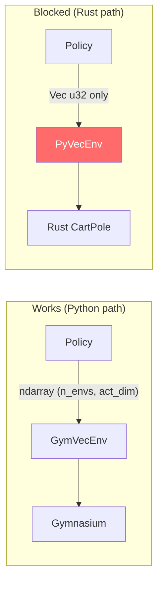

# Phase 7: Multi-Dimensional Action Space Support

**Date:** 2026-03-30
**Priority:** Highest Phase 7 item
**Status:** Implementation

---

## Current State

The Python pipeline **already fully supports multi-dim actions**. SAC/TD3 on
HalfCheetah (6-dim), Hopper (3-dim), Walker2d (6-dim) all work through `GymVecEnv`.
The Rust `ReplayBuffer` also supports arbitrary `act_dim`. The **only gap** is the
Rust native `VecEnv` PyO3 binding, which only accepts `Vec<u32>` (discrete).

## What Needs to Change

### 1. PyVecEnv.step_all — accept continuous actions (~30 lines Rust)
**File:** `crates/rlox-python/src/env.rs`

Make `step_all` polymorphic: accept `PyObject`, dispatch to discrete (`Vec<u32>`)
or continuous (`PyReadonlyArray2<f32>`) based on input type.

### 2. Expose action_space from PyVecEnv (~10 lines Rust)
**File:** `crates/rlox-python/src/env.rs`

Add property so Python can detect discrete vs continuous without hardcoding.

### 3. Native Pendulum-v1 in Rust (~100 lines Rust)
**File:** New `crates/rlox-core/src/env/pendulum.rs`

Validates the continuous action path end-to-end. Simple dynamics, 1-dim action.

### 4. Update collector action type detection (~5 lines Python)
**File:** `python/rlox/collectors.py`

Query `action_space` from env instead of hardcoding `_is_discrete = True` for native envs.

## What Does NOT Need to Change

- `ReplayBuffer` (Rust) — already supports arbitrary `act_dim`
- `GymVecEnv` (Python) — already handles multi-dim
- `OffPolicyCollector` — already multi-dim aware
- `exploration.py` — already multi-dim aware
- `networks.py` — parameterized by `act_dim`
- `SAC/TD3/PPO` — already work with multi-dim actions
- `ContinuousPolicy` — handles multi-dim

```mermaid
gantt
    title Implementation Order
    dateFormat X
    axisFormat %s

    section Rust Core
    Pendulum-v1 env             :p1, 0, 3
    PyVecEnv polymorphic step   :p2, 0, 2
    Expose action_space         :p3, 2, 3

    section Python
    Collector action detection  :p4, 3, 4

    section Tests
    Rust unit tests             :t1, 3, 4
    Python integration tests    :t2, 4, 5
    E2E SAC Pendulum native     :t3, 5, 6
```

