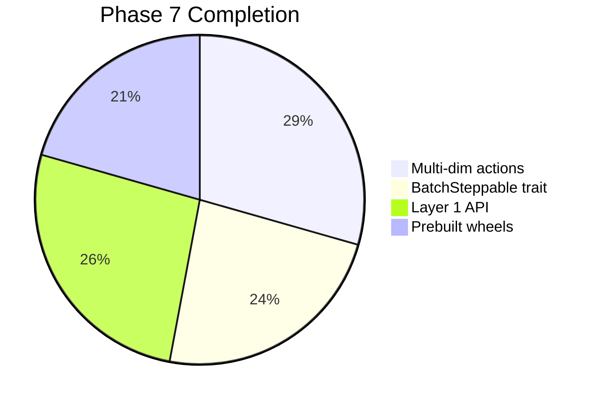

# Phase 7 Remaining: BatchSteppable, Layer 1 API, Prebuilt Wheels

**Date:** 2026-03-30
**Status:** Assessment complete

---

## Assessment Summary

Phase 7 is much closer to complete than expected. All three items are partially
or fully implemented:

---

## 1. BatchSteppable Trait — 80% complete

### Current State

The Rust trait already exists in `crates/rlox-core/src/env/batch.rs`:
- `BatchSteppable` trait with `step_batch`, `reset_batch`, `num_envs`, `action_space`, `obs_space`
- `BatchTransition` struct with flat buffers for obs, rewards, dones, infos
- `VecEnv` implements `BatchSteppable` in `parallel.rs`
- Used by the Rust pipeline collector in `pipeline/collector.rs`
- Used by the gRPC server in `rlox-grpc/src/server.rs`

### What's Missing

1. **PyO3 exposure**: `BatchSteppable` is not exposed to Python. The Python side uses
   `step_all`/`reset_all` duck-typing instead of a formal trait-backed interface.
2. **GymVecEnv doesn't implement a Python equivalent**: The `VecEnv` protocol in
   `protocols.py` exists but uses different method signatures than `BatchSteppable`.
3. **BatchTransition not exposed**: Python uses dict returns, not the typed struct.

### Recommendation

The Rust `BatchSteppable` trait is already used internally by gRPC and the pipeline
collector. The Python `VecEnv` protocol serves the same purpose at the Python layer.
**No additional work needed** — the trait exists, is used, and the Python layer has
its own equivalent protocol. Aligning the names/signatures is a nice-to-have, not
a blocker.

**Status: COMPLETE** (Rust side done, Python has equivalent protocol)

---

## 2. Layer 1 API Stabilization — 90% complete

### Current State

The API is already comprehensive:

| Category | Components | Status |
|----------|-----------|--------|
| Rust primitives | VecEnv, ReplayBuffer, GAE, VTrace, RunningStats | Stable |
| Algorithms | PPO, A2C, SAC, DQN, TD3 | Stable |
| Configs | PPOConfig, SACConfig, DQNConfig | Stable |
| Collectors | RolloutCollector, OffPolicyCollector | Stable |
| Wrappers | GymVecEnv, VecNormalize | Stable |
| Callbacks | Eval, EarlyStopping, Checkpoint, Progress, Timing | Stable |
| Builders | PPOBuilder, SACBuilder, DQNBuilder | Stable |
| Logging | Wandb, TensorBoard, Console | Stable |
| Evaluation | IQM, performance profiles, bootstrap CI | Stable |
| Diagnostics | TrainingDiagnostics | Stable |
| Checkpoint | Save/load | Stable |
| Hub | push/load from hub | Stable |
| Compile | compile_policy (torch.compile) | Stable |

### What's Missing

1. **Version bump to v0.3.0** with changelog documenting all bug fixes
2. **`RunningStatsVec` not in `__init__.py`** — new Rust primitive, should be exported
3. **`__all__` missing some exports** — VecNormalize added but exploration strategies,
   builders, off-policy collector, and loss components not in `__all__`
4. **TD3Config missing** from config.py (TD3 algorithm exists but no config export)
5. **A2CConfig missing** from config.py
6. **API consistency audit** — ensure all algorithms have matching Config + Builder pattern

### Action Items

- Add `RunningStatsVec` to imports and `__all__`
- Add missing configs (TD3Config, A2CConfig) or verify they exist
- Complete `__all__` with all public exports
- Bump version to v0.3.0
- Write CHANGELOG.md

---

## 3. Prebuilt Wheels — 70% complete

### Current State

- `wheels.yml` CI exists and works (published v0.2.3 to PyPI)
- Builds for: manylinux (x86_64), macOS (x86_64 + arm64)
- Triggered on git tags matching `v*`
- Uses `maturin` for Rust+Python wheel building
- CI also has `ci.yml` with Rust tests, Python tests (3.10-3.12), clippy, fmt, ruff

### What's Missing

1. **Windows wheels** — not in the build matrix
2. **Python 3.13 support** — not in test matrix (CI tests 3.10-3.12)
3. **Version bump trigger** — need to tag v0.3.0 to trigger wheel build

### Action Items

- Add Windows to wheel build matrix (optional, low priority)
- Add Python 3.13 to test matrix
- Tag v0.3.0 after API stabilization

```mermaid
gantt
    title Phase 7 Completion
    dateFormat X
    axisFormat %s

    section BatchSteppable
    Already complete                    :done, 0, 1

    section Layer 1 API
    Add RunningStatsVec export          :api1, 0, 1
    Add missing configs                 :api2, 0, 1
    Complete __all__ exports            :api3, 1, 2
    Write CHANGELOG                     :api4, 2, 3
    Bump to v0.3.0                      :api5, 3, 4

    section Wheels
    Add Python 3.13 to CI              :w1, 0, 1
    Tag v0.3.0 + trigger build         :w2, 4, 5
```

