# Phase 8: Production Hardening (v0.7, Q4 2026)

**Date:** 2026-03-30
**Status:** Assessment complete, implementation starting

---

## Assessment Summary

| Item | Effort | Impact | Current | Priority |
|------|--------|--------|---------|----------|
| mmap buffer polish | Small | Medium | 80% done | **P1** |
| Layer 2 YAML/TOML configs | Medium | High | 70% foundation | **P2** |
| Diagnostics dashboard | Medium | High | 40% (data, no viz) | **P3** |
| MuJoCo native binding | Large | High | 0% (planning only) | **P4** |

```mermaid
gantt
    title Phase 8 Implementation
    dateFormat X
    axisFormat %s

    section P1: mmap Buffer
    push_batch + cold eviction  :a1, 0, 3
    Algorithm integration       :a2, 3, 5
    Benchmarks                  :a3, 5, 6

    section P2: YAML/TOML Configs
    TrainingConfig + TOML       :b1, 0, 3
    Trainer.from_config         :b2, 3, 5
    CLI entrypoint              :b3, 5, 6

    section P3: Dashboard
    MetricsCollector            :c1, 6, 8
    Terminal dashboard (rich)   :c2, 8, 10
    HTML report (Plotly)        :c3, 10, 12

    section P4: MuJoCo Native
    mujoco-sys + generic env    :d1, 12, 16
    Specific envs + tests       :d2, 16, 20
```

