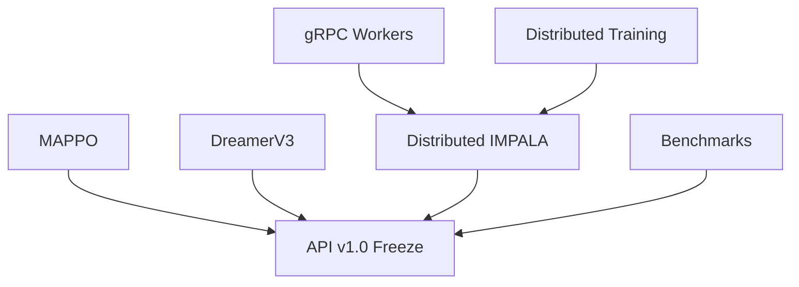

# Phase 9: Distributed & Scale (v1.0, Q2 2027)

**Date:** 2026-03-30
**Status:** Assessment complete, implementation starting

---

## Assessment: Phase 9 is 50-75% complete

All 7 items have existing foundations. Algorithms (MAPPO, DreamerV3, IMPALA) have
full scaffolds. gRPC has complete Rust server + client. Distributed infra has
working DDP. Benchmarks are extensive.

| Item | Existing | Remaining | Priority |
|------|----------|-----------|----------|
| Distributed infra | 60% (DDP, Pipeline) | FSDP, multi-node, elastic | P1 |
| gRPC workers | 70% (Rust done) | Python bindings, RemoteEnvPool | P1 |
| Benchmarking suite | 75% | Distributed benchmarks, CI regression | P3 |
| API v1.0 freeze | 50% | Configs, trainers, docs, version bump | P4 |
| MAPPO | 65% (single-agent) | Multi-agent collector, PettingZoo | P2 |
| DreamerV3 | 40% (scaffold) | RSSM, symlog, sequence replay | P2 |
| IMPALA | 75% (thread-based) | Vectorize V-trace, remote actors | P2 |

```mermaid
gantt
    title Phase 9 Implementation
    dateFormat X
    axisFormat %s

    section P1: Infrastructure
    Distributed infra (FSDP, elastic)  :a1, 0, 4
    gRPC Python bindings               :a2, 0, 4

    section P2: Algorithms
    MAPPO multi-agent                   :b1, 4, 7
    IMPALA distributed                  :b2, 4, 6
    DreamerV3 enrichment               :b3, 4, 8

    section P3: Benchmarks
    Distributed benchmarks              :c1, 6, 8
    CI regression detection             :c2, 8, 9

    section P4: Release
    API v1.0 freeze + docs              :d1, 8, 10
    Version bump + release              :d2, 10, 11
```

