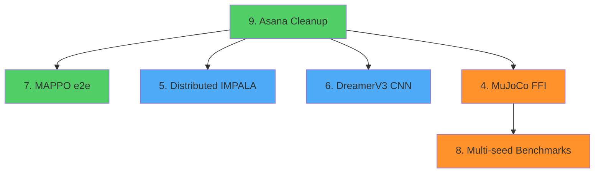
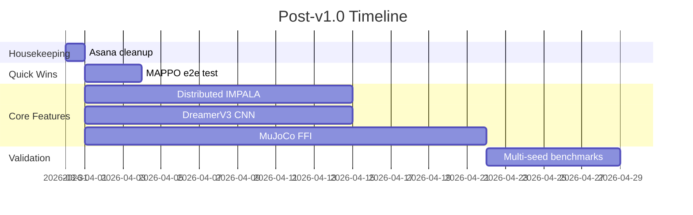

# Post-v1.0 Roadmap

**Date:** 2026-03-31
**Status:** Implementation starting

---

## Summary

| # | Item | Effort | Dependencies |
|---|------|--------|-------------|
| 9 | Asana cleanup | 0.5 day | None |
| 7 | MAPPO PettingZoo e2e test | 2-3 days | PettingZoo package |
| 5 | Distributed IMPALA | 1-2 weeks | gRPC server (exists) |
| 6 | DreamerV3 CNN | 1-2 weeks | None |
| 4 | MuJoCo FFI | 2-3 weeks | mujoco-sys crate |
| 8 | Multi-seed benchmarks | 1 week compute | Item 4 for full coverage |

