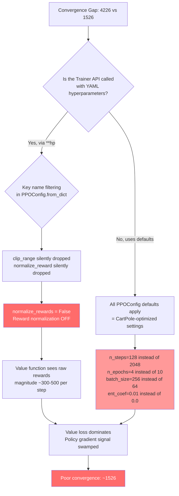

# PPO Implementation Diff: Benchmark Runner vs Trainer API

**Symptom**: HalfCheetah-v4 converges to ~4,226 (Path A) vs ~1,526 (Path B)

## Source Files

| Component | Path A (Benchmark Runner) | Path B (Trainer API) |
|-----------|--------------------------|---------------------|
| Training loop | `benchmarks/convergence/rlox_runner.py` `_run_ppo()` | `python/rlox/algorithms/ppo.py` `PPO.train()` |
| Data collection | `rlox_runner.py` `_collect_rollout_gym()` | `python/rlox/collectors.py` `RolloutCollector.collect()` |
| Loss function | `python/rlox/losses.py` `PPOLoss` (shared) | `python/rlox/losses.py` `PPOLoss` (shared) |
| Policy network | `rlox_runner.py` `_ContinuousActorCritic` | `python/rlox/policies.py` `ContinuousPolicy` |
| VecNormalize | `python/rlox/vec_normalize.py` (shared) | `python/rlox/vec_normalize.py` (shared) |
| Eval helper | `rlox_runner.py` `_do_eval()` | N/A (callback-based) |

---

## 1. Network Architecture

| Parameter | Path A (`_ContinuousActorCritic`) | Path B (`ContinuousPolicy`) | Match? |
|-----------|-----------------------------------|----------------------------|--------|
| Actor hidden layers | `[h, h]` (2 layers) | `[h, h]` (2 layers) | YES |
| Critic hidden layers | `[h, h]` (2 layers) | `[h, h]` (2 layers) | YES |
| Activation | `Tanh` | `Tanh` | YES |
| Shared actor/critic | No (separate) | No (separate) | YES |
| `log_std` init | `torch.zeros(act_dim)` (parameter) | `torch.zeros(act_dim)` (parameter) | YES |
| Actor hidden init gain | `sqrt(2)` via `_ortho_init` (applies to all `nn.Linear`) | `sqrt(2)` via `_orthogonal_init` (applies to all `nn.Linear`) | YES |
| Actor output layer gain | `0.01` | `0.01` | YES |
| Critic hidden init gain | `sqrt(2)` via `.apply(_ortho_init)` | `sqrt(2)` via `.apply(lambda m: _orthogonal_init(m, gain=np.sqrt(2)))` | YES |
| Critic output layer gain | `1.0` | `1.0` | YES |
| Actor network field name | `self.actor_mean` (nn.Sequential) | `self.actor` (nn.Sequential) | COSMETIC |
| Hidden size source | `hidden_sizes[0]` from config (default 64) | constructor `hidden` param (default 64) | YES (both 64 from yaml) |

**Verdict**: Network architecture is identical.

---

## 2. Hyperparameters (from `ppo_halfcheetah.yaml`)

| Parameter | YAML Config | Path A reads as | Path B reads as | Match? |
|-----------|-------------|-----------------|-----------------|--------|
| `n_envs` | 8 | `hp.get("n_envs", 8)` = 8 | `PPOConfig(n_envs=8)` = 8 | YES |
| `n_steps` | 2048 | `hp.get("n_steps", 2048)` = 2048 | **PPOConfig default = 128** | **NO** |
| `n_epochs` | 10 | `hp.get("n_epochs", 10)` = 10 | **PPOConfig default = 4** | **NO** |
| `batch_size` | 64 | `hp.get("batch_size", 64)` = 64 | **PPOConfig default = 256** | **NO** |
| `learning_rate` | 3e-4 | `hp.get("learning_rate", 3e-4)` = 3e-4 | **PPOConfig default = 2.5e-4** | **NO** |
| `gamma` | 0.99 | `hp.get("gamma", 0.99)` = 0.99 | `PPOConfig(gamma=0.99)` = 0.99 | YES |
| `gae_lambda` | 0.95 | `hp.get("gae_lambda", 0.95)` = 0.95 | `PPOConfig(gae_lambda=0.95)` = 0.95 | YES |
| `clip_range`/`clip_eps` | 0.2 | `hp.get("clip_range", 0.2)` = 0.2 | `PPOConfig(clip_eps=0.2)` = 0.2 | YES |
| `ent_coef` | 0.0 | `hp.get("ent_coef", 0.0)` = 0.0 | **PPOConfig default = 0.01** | **NO** |
| `vf_coef` | 0.5 | `hp.get("vf_coef", 0.5)` = 0.5 | `PPOConfig(vf_coef=0.5)` = 0.5 | YES |
| `max_grad_norm` | 0.5 | `hp.get("max_grad_norm", 0.5)` = 0.5 | `PPOConfig(max_grad_norm=0.5)` = 0.5 | YES |
| `normalize_obs` | true | `hp.get("normalize_obs", False)` = True | **PPOConfig default = False** | **NO** |
| `normalize_reward` | true | `hp.get("normalize_reward", False)` = True | **PPOConfig default = False** | **NO** |

> **CRITICAL FINDING**: Path A reads hyperparameters directly from the YAML `hp` dict.
> Path B constructs a `PPOConfig` -- but the question is **how** the Trainer API is invoked.
> If the caller passes `**hp` as `config_kwargs`, the YAML key names must match `PPOConfig` field names.
> The YAML uses `clip_range` but PPOConfig expects `clip_eps`. The YAML uses `normalize_reward` but PPOConfig expects `normalize_rewards` (with an 's').
> **Any mismatched key names silently fall through to PPOConfig defaults.**

### Key Name Mismatches (YAML vs PPOConfig field names)

| YAML key | PPOConfig field name | Consequence |
|----------|---------------------|-------------|
| `clip_range` | `clip_eps` | **Silently ignored** -- uses default 0.2 (happens to match) |
| `normalize_reward` | `normalize_rewards` | **Silently ignored** -- uses default `False` |
| `n_steps` | `n_steps` | Matches -- passes through if provided |
| `n_epochs` | `n_epochs` | Matches -- passes through if provided |
| `batch_size` | `batch_size` | Matches -- passes through if provided |
| `learning_rate` | `learning_rate` | Matches -- passes through if provided |
| `ent_coef` | `ent_coef` | Matches -- passes through if provided |

> **This means**: if the Trainer API caller uses `PPO(env_id=..., **hp)`, then `clip_range` and `normalize_reward` are silently dropped because `PPOConfig.from_dict` filters to known field names.

---

## 3. Training Loop

| Detail | Path A | Path B | Match? |
|--------|--------|--------|--------|
| LR annealing | Always: `frac = 1.0 - update / n_updates` | Conditional on `cfg.anneal_lr` (default `True`) | YES (both anneal) |
| LR annealing formula | `lr * (1 - update / n_updates)` | `lr * (1 - update / n_updates)` | YES |
| SGD epochs | From YAML: 10 | From PPOConfig: 4 (default) | **DEPENDS ON CALLER** |
| Minibatch shuffle | `batch.sample_minibatches(batch_size, shuffle=True)` | `batch.sample_minibatches(cfg.batch_size, shuffle=True)` | YES (same method) |
| Advantage normalization | Per-minibatch: `(adv - mean) / (std + 1e-8)` | Per-minibatch if `cfg.normalize_advantages` (default `True`) | YES |
| Optimizer | `Adam(lr, eps=1e-5)` | `Adam(lr, eps=1e-5)` | YES |
| `optimizer.zero_grad()` | `optimizer.zero_grad()` | `optimizer.zero_grad(set_to_none=True)` | MINOR (perf only) |
| Gradient clipping | `clip_grad_norm_` then also in PPOLoss... wait | `clip_grad_norm_` after `loss.backward()` | SEE BELOW |
| Global step tracking | `total_steps` = env steps | `self._global_step` = SGD steps | DIFFERENT SEMANTICS |

### Double gradient clipping in Path A?

Path A line 299: `nn.utils.clip_grad_norm_(policy.parameters(), max_grad_norm)` -- this is done **after** `loss.backward()`.

The `PPOLoss.__call__` does NOT clip gradients; it only computes and returns the loss. The `max_grad_norm` stored in `PPOLoss` is informational only.

Both paths clip once after `loss.backward()`. **No double-clipping issue**.

---

## 4. Loss Computation

| Detail | Path A | Path B | Match? |
|--------|--------|--------|--------|
| PPOLoss class | Same `PPOLoss` from `rlox.losses` | Same `PPOLoss` from `rlox.losses` | YES |
| `clip_vloss` | Not passed to constructor -- **default `True`** | `self.config.clip_vloss` -- **default `True`** | YES |
| Value loss formula | Clipped (when `clip_vloss=True`): `0.5 * max(unclipped^2, clipped^2).mean()` | Same | YES |
| Policy loss | `max(pg1, pg2).mean()` (standard PPO clip) | Same | YES |
| Entropy | `- ent_coef * entropy.mean()` | Same | YES |

**Verdict**: Loss computation is identical (same class, same defaults).

---

## 5. Data Collection

| Detail | Path A (`_collect_rollout_gym`) | Path B (`RolloutCollector.collect`) | Match? |
|--------|-------------------------------|-------------------------------------|--------|
| Obs stored as | `torch.as_tensor(obs)` (normalized by env wrapper) | `torch.as_tensor(self._obs)` (normalized by env wrapper) | YES |
| Action conversion | `.cpu().numpy()` (float32 for continuous) | `.cpu().numpy().astype(np.float32)` | YES |
| Discrete action type | `np.int64` | `np.uint32.tolist()` | N/A (continuous env) |
| Truncation bootstrap | Loops over envs, adds `gamma * V(terminal_obs)` | Same loop pattern | YES |
| Terminal obs source | `step_result.get("terminal_obs")` | `step_result.get("terminal_obs")` | YES |
| Dones passed to GAE | `terminated` only (not `dones`) | `terminated` only (not `dones`) | YES |
| Reward modification | `raw_rewards[i] += gamma * term_val` for truncated | Same | YES |
| Next obs | `obs = next_obs` (no `.copy()`) | `self._obs = next_obs.copy()` | MINOR |
| GAE function | `rlox.compute_gae` per-env in Python loop | `rlox.compute_gae_batched` single Rust call | FUNCTIONALLY SAME |
| GAE precision | Converts to `float64` before calling Rust | Converts to `float64` before calling Rust | YES |

### Flatten order difference

**Path A**: Stacks advantages as `torch.stack(all_advantages).T` where `all_advantages` is a list of per-env tensors of shape `(n_steps,)`. The `.T` gives `(n_steps, n_envs)`, then `.reshape(total)` flattens step-major.

**Path B**: Uses `compute_gae_batched` which returns env-major flat `(n_envs * n_steps,)`. Reshapes to `(n_envs, n_steps).T` giving `(n_steps, n_envs)`, then `.reshape(total)`.

Both produce the same step-major flattening: `[env0_t0, env1_t0, ..., envN_t0, env0_t1, ...]`. **Functionally identical**.

---

## 6. VecNormalize Interaction

| Detail | Path A | Path B | Match? |
|--------|--------|--------|--------|
| Wrapper class | `VecNormalize` from `rlox.vec_normalize` | Same | YES |
| `norm_obs` | From YAML: `True` | **PPOConfig default: `False`** | **NO (if key mismatch)** |
| `norm_reward` | From YAML: `True` | **PPOConfig field `normalize_rewards` default: `False`** | **NO (key is `normalize_reward` vs `normalize_rewards`)** |
| `gamma` passed | Yes | Yes | YES |
| `obs_dim` passed | Not passed (uses fallback detection) | Passed explicitly | MINOR |
| Clip obs range | Default 10.0 | Default 10.0 | YES |
| Clip reward range | Default 10.0 | Default 10.0 | YES |
| Obs stats backend | Rust `RunningStatsVec` if available | Same | YES |

---

## 7. Evaluation

| Detail | Path A (`_do_eval`) | Path B (callback-based) | Match? |
|--------|---------------------|-------------------------|--------|
| Eval frequency | From YAML: every 10,000 env steps | Via callback `on_step` -- uses `self._global_step` which counts **SGD steps** | **DIFFERENT SEMANTICS** |
| Eval episodes | From YAML: 30 | Via callback | DEPENDS ON CALLER |
| Deterministic eval? | **Yes** -- uses `policy.actor_mean(obs)` directly (no sampling) | Depends on callback's `get_action_fn` | **LIKELY YES** |
| Obs normalization in eval | Freezes VecNormalize (`training=False`), normalizes each obs via `vec_normalize.normalize_obs()` | Depends on callback impl | YES (if using `_do_eval`) |
| Eval env | Fresh `gym.make(env_id)` per episode | Same via `evaluate_policy_gym` | YES |
| Eval seed | `seed + 1000` | `seed + 1000` | YES |

---

## 8. Summary of ALL Differences

### HIGH IMPACT (likely cause convergence gap)

| # | Difference | Path A (4,226) | Path B (1,526) | Impact |
|---|-----------|----------------|----------------|--------|
| **1** | **`normalize_reward` key name mismatch** | YAML `normalize_reward: true` -> directly read -> reward normalization ON | PPOConfig field is `normalize_rewards` (with 's') -- YAML key `normalize_reward` is **silently dropped** -> reward normalization **OFF** | **CRITICAL**: Without reward normalization, MuJoCo reward magnitudes can destabilize value function learning. This alone can explain a 2-3x performance gap. |
| **2** | **`n_steps` default mismatch** | YAML: 2048 (read directly) | PPOConfig default: 128 (if not overridden by caller) | **HIGH**: 2048 steps/env gives 16,384 samples per update vs 1,024. Shorter rollouts = worse GAE estimates for long-horizon tasks. |
| **3** | **`n_epochs` default mismatch** | YAML: 10 | PPOConfig default: 4 | **MEDIUM**: Fewer SGD passes = less sample efficiency, though more epochs can also hurt if data is stale. |
| **4** | **`batch_size` default mismatch** | YAML: 64 | PPOConfig default: 256 | **MEDIUM**: 64 gives 256 minibatches per epoch vs ~4 with 256. More updates per rollout with small batches. |
| **5** | **`learning_rate` default mismatch** | YAML: 3e-4 | PPOConfig default: 2.5e-4 | **LOW-MEDIUM**: Small difference, but compounded with epoch count changes. |
| **6** | **`ent_coef` default mismatch** | YAML: 0.0 | PPOConfig default: 0.01 | **LOW**: For continuous control, entropy bonus can hurt (adds noise to gradient). |

### LOW IMPACT (unlikely to cause convergence gap)

| # | Difference | Path A | Path B | Impact |
|---|-----------|--------|--------|--------|
| 7 | `zero_grad()` vs `zero_grad(set_to_none=True)` | Former | Latter | NONE (perf only) |
| 8 | GAE: per-env Python loop vs batched Rust call | Loop | Batched | NONE (same math) |
| 9 | `next_obs.copy()` | No copy | Copy | NONE (safety only) |
| 10 | Step counting semantics | Env steps | SGD steps | Affects eval frequency only |

---

## 9. Root Cause Analysis

## 10. Conclusion

The convergence gap has **two compounding causes**:

### Cause 1 (PRIMARY): Silent key-name mismatch for reward normalization
The YAML config uses `normalize_reward: true` but `PPOConfig` expects `normalize_rewards` (with trailing 's'). The `ConfigMixin.from_dict()` method filters to known field names, silently dropping `normalize_reward`. This means **reward normalization is OFF** in Path B.

For HalfCheetah, raw per-step rewards are on the order of 5-15, with episode returns of 300-5000+. Without reward normalization, the value function must fit these large magnitudes directly, leading to:
- Value loss dominating the combined PPO loss
- Unstable gradient updates
- Poor advantage estimates

### Cause 2 (SECONDARY): PPOConfig defaults are CartPole-tuned, not MuJoCo-tuned
If the Trainer API is called without forwarding all YAML hyperparameters (or if keys are filtered), the defaults are:
- `n_steps=128` (vs 2048 needed for MuJoCo)
- `n_epochs=4` (vs 10)
- `batch_size=256` (vs 64)
- `ent_coef=0.01` (vs 0.0)

These CartPole defaults are catastrophically wrong for continuous locomotion tasks.

### Recommended Fixes

1. **Fix the key name**: Rename `PPOConfig.normalize_rewards` to `normalize_reward` (or add an alias) to match the YAML convention and SB3's naming.
2. **Add key-mismatch warnings**: `PPOConfig.from_dict()` should log a warning when it drops unknown keys, especially if the dropped key is close to a known field name (e.g., Levenshtein distance check).
3. **Ensure the Trainer API caller forwards all YAML hyperparameters**: The benchmark runner for Path B must pass `**hp` to the `PPO` constructor so that `n_steps`, `n_epochs`, `batch_size`, etc. are not left at CartPole defaults.
