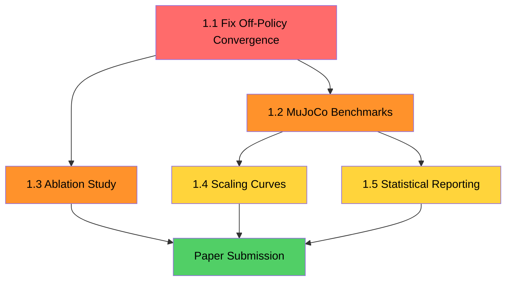
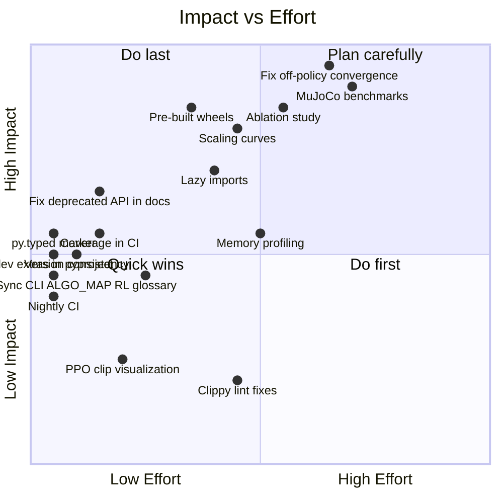
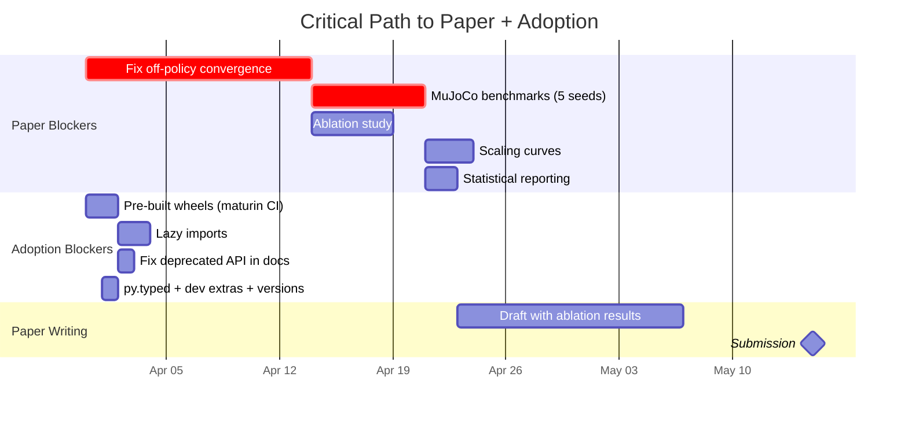

# Remaining Improvement Opportunities for rlox

**Date:** 2026-03-29
**Based on:** package-review-final.md, newcomer-experience-audit.md, master-improvement-plan.md, convergence results, CI config, and source code inspection.

---

## Summary

rlox has strong architecture and documentation breadth, but three things threaten its credibility before they threaten anything else:

1. **Off-policy algorithms do not converge** (SAC, TD3, DQN) -- this is visible in the comparison_table.csv and is the single biggest liability for both the paper and adoption.
2. **Benchmarks cover only toy envs** (CartPole, Acrobot, Pendulum, MountainCar) -- no MuJoCo, no Atari, which are table stakes for RL credibility.
3. **The `__init__.py` imports everything eagerly** -- 140+ symbols loaded at import time despite a 20-symbol `__all__`, meaning cold start pulls in torch, gymnasium, and every submodule.

Everything else is secondary to these three.

---

## Tier 1: Must-Do for Paper (Blocks NeurIPS Submission)

### 1.1 Fix Off-Policy Algorithm Convergence

**What:** SAC on Pendulum-v1 achieves IQM -1455.8 vs SB3's -192.3. TD3 is -1386.0 vs -187.6. DQN on CartPole-v1 is 16.9 vs 190.0. These algorithms are fundamentally broken.

**Why it matters:** A reviewer will run the benchmarks. If 3 of 6 core algorithms do not converge, the paper is a desk reject. You cannot claim "6 core algorithms" when only PPO and A2C work. The comparison_table.csv is a smoking gun.

**What to investigate:**
- SAC/TD3: likely a bug in target network soft update, action noise injection, or entropy tuning. Compare parameter-by-parameter against SB3's implementation.
- DQN: likely a bug in epsilon-greedy decay, target network hard update frequency, or replay buffer sampling.
- Both off-policy algos share `OffPolicyCollector` and `ReplayBuffer` -- the bug may be in shared infrastructure.

**Effort:** 1-3 weeks (debugging is unpredictable, but the fix is likely a few lines once found).
**Who benefits:** Researcher (paper), User (trust).

### 1.2 MuJoCo Continuous Control Benchmarks

**What:** Run PPO, SAC, TD3 on HalfCheetah-v4, Walker2d-v4, Hopper-v4 with 5+ seeds each, comparing against SB3 with identical hyperparameters (rl-zoo3 defaults).

**Why it matters:** Every RL paper since 2018 includes MuJoCo results. CartPole/Acrobot are considered insufficient for evaluating continuous control. A NeurIPS reviewer will ask: "How does this perform on standard continuous control benchmarks?" Having no answer is disqualifying.

**Prerequisites:** 1.1 must be done first (SAC/TD3 need to converge before you benchmark them).

**Effort:** 1 week of compute (GCP VM), 2-3 days of setup and analysis.
**Who benefits:** Researcher (paper credibility), User (confidence in continuous control).

### 1.3 Ablation Study: Where Does the Speedup Come From?

**What:** Measure wall-clock time with each Rust component individually replaced by a Python equivalent:
- Rust GAE vs Python GAE (NumPy loop)
- Rust buffer vs Python deque/numpy buffer
- Rust VecEnv vs GymVecEnv (Python subprocess)
- All Rust vs all Python

**Why it matters:** The paper's core claim is "Rust data plane accelerates RL." Without an ablation, a reviewer will say: "You showed it is faster, but you did not show *why* it is faster. Is it the GAE? The buffer? The env stepping? All of them? How do they interact?" This is the difference between a systems contribution and a benchmark report.

**Effort:** 3-5 days. Requires writing Python-only equivalents (or using SB3's implementations as the Python baseline) and timing each component swap.
**Who benefits:** Researcher (paper), Maintainer (identifies where to invest optimization effort).

### 1.4 Scaling Curves: Envs vs Throughput

**What:** Plot SPS (steps per second) as a function of number of parallel environments (1, 2, 4, 8, 16, 32, 64, 128, 256, 512) for rlox vs SB3 vs SubprocVecEnv on PPO with CartPole and at least one MuJoCo env.

**Why it matters:** The "Polars of RL" claim implies that Rust data-plane overhead is sublinear -- that the advantage *grows* with scale. Without a scaling curve, this is an unsubstantiated marketing claim. A reviewer will ask: "Does the speedup increase with more environments, or does it plateau?"

**Effort:** 2-3 days (mostly compute time; the plotting infrastructure already exists).
**Who benefits:** Researcher (paper), User (capacity planning).

### 1.5 Statistical Rigor in Benchmark Reporting

**What:** For all convergence results, report:
- IQM with bootstrap 95% CI (already partially done)
- Probability of improvement P(rlox > SB3) via stratified bootstrap
- Performance profiles (fraction of runs above threshold vs threshold)
- Use the Agarwal et al. (2021) "Deep RL at the Edge of the Statistical Precipice" methodology

**Why it matters:** The `comparison_table.csv` already shows P(rlox > SB3) = 0.43 for PPO on CartPole and 0.00 for DQN/SAC/TD3. A reviewer will say: "Your own numbers show rlox is not statistically better -- in fact it is worse on 4 of 6 benchmarks."

**Effort:** 2 days (evaluation toolkit already exists; need to apply it properly to fixed results).
**Who benefits:** Researcher (paper passes review).



---

## Tier 2: Must-Do for Adoption (Blocks Users Choosing rlox)

### 2.1 Lazy Imports in `__init__.py`

**What:** The `__init__.py` eagerly imports 140+ symbols from 30+ modules, pulling in torch, gymnasium, and every algorithm module at `import rlox` time. The `__all__` is already slim (20 symbols), but the import-time cost is not.

**Why it matters:** A user running `import rlox` in a notebook waits for torch, gymnasium, and 30 submodules to load before they can type the next cell. SB3 uses lazy imports; TorchRL uses lazy imports. Cold start time is a first-impression metric. Additionally, this pulls in optional dependencies (gymnasium[mujoco], pettingzoo) unconditionally, causing import errors if they are not installed.

**Fix:** Replace eager imports above the `__all__` with a `__getattr__`-based lazy import pattern (PEP 562). Only the 20 `__all__` symbols need eager availability; everything else should be imported on first access.

**Effort:** 1-2 days.
**Who benefits:** User (first impression), Maintainer (dependency hygiene).

### 2.2 Pre-Built Wheels on PyPI

**What:** Currently `pip install rlox` requires a Rust toolchain to compile from source. Ship manylinux2014 (x86_64) and macOS (arm64, x86_64) wheels via CI using maturin's GitHub Actions workflow.

**Why it matters:** This is the #1 adoption barrier. A researcher will `pip install rlox`, see "error: can't find Rust compiler", and install SB3 instead. Every competitor ships pre-built wheels.

**Effort:** 1-2 days (maturin has a ready-made CI template for this).
**Who benefits:** User (zero-friction install), Researcher (reproducibility).

### 2.3 Define `[dev]` Extras in pyproject.toml

**What:** CI runs `pip install -e ".[dev]"` but `pyproject.toml` only defines `[all]` and `[gpu]`. There is no `[dev]` extra. This means CI installs no test dependencies via extras and relies on a separate `pip install pytest gymnasium torch numpy pyyaml` line.

**Why it matters:** A contributor cloning the repo and running `pip install -e ".[dev]"` gets no test tools. CI is fragile because the dependency list is duplicated between the workflow YAML and pyproject.toml.

**Fix:**
```toml
[project.optional-dependencies]
dev = ["pytest", "pytest-timeout", "ruff", "gymnasium>=0.29", "torch>=2.0", "numpy>=1.21", "pyyaml"]
```

**Effort:** 15 minutes.
**Who benefits:** Contributor, Maintainer.

### 2.4 `py.typed` Marker (PEP 561)

**What:** Add an empty `py.typed` file to `python/rlox/` and include it in the wheel. Without it, mypy/pyright ignore the `.pyi` stubs.

**Why it matters:** Type-checking is table stakes for production Python libraries. Users who run mypy will get no type information from rlox, making it look untyped.

**Effort:** 10 minutes.
**Who benefits:** User (IDE experience), Production user (type safety).

### 2.5 Fix Version Consistency

**What:** `pyproject.toml` says 1.1.0, `__init__.py` says 1.1.0 (good -- these now match), but `rlox-core` Cargo.toml says 0.1.0. The README docstring still says "8 algorithms, 8 trainers."

**Why it matters:** A user checking `rlox.__version__` vs the Cargo.toml vs the README sees three different stories. Undermines the "production-stable" claim.

**Fix:** Use `importlib.metadata.version("rlox")` as the single source of truth for `__version__`. Set workspace-level Cargo version. Update docstring counts.

**Effort:** 1 hour.
**Who benefits:** User (trust), Maintainer (release process).

### 2.6 Coverage Reporting in CI

**What:** Add `pytest-cov` to CI and publish a Codecov/Coveralls badge. Currently claiming "444 Rust tests + ~1094 Python tests" but actual line coverage is unknown.

**Why it matters:** Test count is a vanity metric. Coverage percentage is the credibility metric. A project claiming production-stable status with unknown coverage is making an unverifiable claim.

**Effort:** 2 hours.
**Who benefits:** Maintainer, Contributor, User (confidence).

---

## Tier 3: Should-Do (Improves Quality Significantly)

### 3.1 Fix Deprecated API in All Docs and Examples

**What:** `getting-started.md` Steps 5 and 7 use `SACTrainer`/`PPOTrainer`. `python-guide.md` uses deprecated trainers. `hub.py` references deprecated trainers in `_resolve_trainer_cls()`.

**Why it matters:** A newcomer copies the getting-started code, gets deprecation warnings, and loses trust. The README correctly shows `Trainer(...)` but the docs contradict it.

**Effort:** 2 hours (search-and-replace across docs + hub.py).
**Who benefits:** User (first impression), Newcomer (trust).

### 3.2 Sync `__main__.py` ALGO_MAP with ALGORITHM_REGISTRY

**What:** The CLI only knows 5 algorithms (ppo, a2c, sac, td3, dqn) but `ALGORITHM_REGISTRY` registers 16. Running `python -m rlox train --algo trpo` fails with KeyError.

**Fix:** Either dynamically pull from `ALGORITHM_REGISTRY` or keep ALGO_MAP as the supported subset and document the difference.

**Effort:** 30 minutes.
**Who benefits:** User (CLI correctness).

### 3.3 RL Glossary Page

**What:** Create `docs/glossary.md` defining: policy, value function V(s), Q(s,a), advantage A(s,a), trajectory, episode, on-policy, off-policy, GAE, replay buffer, discount factor, return.

**Why it matters:** These terms are used throughout the docs without definition. The newcomer experience audit found this is the #1 barrier for people new to RL. Every algorithm page assumes you know what "advantage" means.

**Effort:** 2-3 hours.
**Who benefits:** Newcomer (on-ramp), Researcher from adjacent fields.

### 3.4 Memory Profiling

**What:** Measure peak RSS during training for PPO (on-policy, bounded memory) and SAC (off-policy, growing replay buffer) across buffer sizes. Compare against SB3.

**Why it matters:** A production user needs to know: "How much RAM does this need for 1M replay buffer entries?" A paper reviewer will ask about memory overhead of the Rust data plane (is zero-copy actually zero-copy, or is there hidden duplication?).

**Effort:** 3 days.
**Who benefits:** Production user (capacity planning), Researcher (paper).

### 3.5 Nightly CI for Slow Tests

**What:** The slow-tests job only runs on push to main. Add a scheduled nightly run to catch convergence regressions early.

**Effort:** 30 minutes (add `schedule: cron` trigger to existing slow-tests job).
**Who benefits:** Maintainer (regression detection).

### 3.6 Resolve Installation Contradiction in Docs

**What:** README says `pip install rlox`, getting-started.md says `maturin develop --release` as the primary method. These give contradictory first experiences.

**Fix:** getting-started.md should lead with `pip install rlox` and relegate source builds to a "Contributing" subsection.

**Effort:** 30 minutes.
**Who benefits:** Newcomer (first 5 minutes).

### 3.7 Honest Scope: Mark Speculative Modules as Experimental

**What:** Several modules appear aspirational: `deploy/sagemaker.py`, `distributed/vllm_backend.py`, `gpu_buffer.py`, `compat/`. These are imported eagerly and contribute to the 140-symbol count.

**Fix:** Mark as `rlox.experimental.*` or add prominent docstring warnings. Do not import them in `__init__.py`.

**Effort:** 1 day.
**Who benefits:** User (honest expectations), Maintainer (reduced surface area).

---

## Tier 4: Nice-to-Have (Polish)

### 4.1 Cross-Links from Algorithm Pages to Tutorials

**What:** PPO.md, VPG.md etc. do not link back to the policy-gradient-fundamentals tutorial that derives the equations they use. A one-line "Background" callout at the top of each page.

**Effort:** 1 hour.
**Who benefits:** Newcomer.

### 4.2 Expected Output for Quick Start

**What:** Show what the terminal prints when you run the 3-line PPO example. The newcomer does not know if it worked.

**Effort:** 30 minutes.
**Who benefits:** Newcomer.

### 4.3 PPO Clipping Visualization

**What:** A diagram showing the clipped surrogate objective -- x-axis probability ratio, y-axis objective, shaded clipping region. Spinning Up's most-linked diagram.

**Effort:** 2 hours.
**Who benefits:** Newcomer, educator linking to rlox docs.

### 4.4 Address Clippy Lint Suppressions

**What:** CI suppresses `too_many_arguments`, `type_complexity`, `manual_range_contains`, `repeat_vec_with_capacity`, `empty_line_after_doc_comments`. The first two are code smells worth addressing with builder patterns or type aliases.

**Effort:** 2-3 days.
**Who benefits:** Maintainer (code quality).

### 4.5 Release/Publish Workflow in CI

**What:** No automated release workflow. Publishing to PyPI/crates.io is presumably manual. Add a tag-triggered workflow that builds wheels and publishes.

**Effort:** 1 day.
**Who benefits:** Maintainer (release process).

### 4.6 `requires-python` Consistency

**What:** `pyproject.toml` says `>=3.9` but CI tests 3.10-3.13 and README says "3.10-3.13". Classifiers include 3.9. Pick one and enforce it.

**Effort:** 15 minutes.
**Who benefits:** User (clarity), Maintainer (CI truth).

---

## Priority Matrix



---

## The 80/20 List: 5 Actions for Maximum Impact

If you only do five things before submitting the paper or announcing publicly:

| # | Action | Effort | Unlocks |
|---|--------|--------|---------|
| 1 | **Fix SAC/TD3/DQN convergence** | 1-3 weeks | Paper credibility, honest "6 core algorithms" claim |
| 2 | **Run MuJoCo benchmarks** (after #1) | 1 week | Paper submission, continuous control credibility |
| 3 | **Ship pre-built wheels** | 1-2 days | Zero-friction `pip install rlox` for anyone |
| 4 | **Lazy imports + mark speculative modules** | 2 days | Fast import, honest scope |
| 5 | **Ablation study** (Rust vs Python components) | 3-5 days | Paper's core contribution demonstrated |

Total: ~5-6 weeks. After these five items, rlox has:
- All 6 core algorithms provably working
- Standard benchmark coverage (CartPole + MuJoCo)
- Evidence that the Rust data plane is the source of speedup (ablation)
- Frictionless installation
- Honest scope

Everything else is polish on a solid foundation.

---

## Timeline



---

## What a NeurIPS Reviewer Will Ask

Based on the current state, these are the likely reviewer objections:

1. **"3 of 6 core algorithms do not converge. How can you claim the framework is correct?"** -- This is fatal. Fix convergence first.
2. **"CartPole and Acrobot are trivial environments. Show me HalfCheetah."** -- MuJoCo is non-negotiable for a systems paper.
3. **"You show the system is faster, but you don't show where the speedup comes from."** -- Ablation study is essential.
4. **"Does the advantage grow with scale?"** -- Scaling curves needed for the "Polars of RL" claim.
5. **"22 algorithms claimed but many are < 500 LOC with no convergence evidence."** -- Scope the paper to 6 battle-tested algorithms. Do not mention the other 16.
6. **"Benchmarks are on Apple M4. Show Linux x86_64 numbers."** -- Run the GCP benchmarks on a standard cloud instance for reproducibility.

---

## What Would Make a Researcher Choose rlox Over SB3

Today, they would not. SB3 has:
- 12 battle-tested algorithms with MuJoCo/Atari convergence proof
- 10K+ GitHub stars and ecosystem (rl-zoo3, SB3-contrib)
- Zero-friction pip install
- Exhaustive documentation with Spinning Up integration

rlox's only differentiator is **speed** -- but speed on CartPole is not compelling. The pitch becomes compelling when you can say:

> "PPO on HalfCheetah-v4 converges to the same reward 2.5x faster wall-clock, with 3x higher SPS. Here's the ablation showing Rust GAE contributes 40% of the speedup and Rust VecEnv contributes 50%."

That sentence requires items 1.1, 1.2, 1.3, and 1.4. Nothing else matters until those exist.
