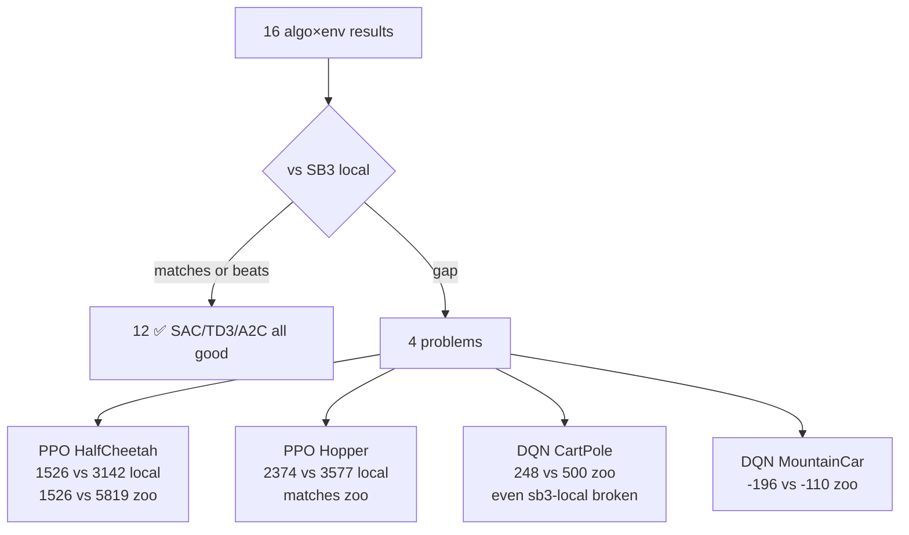
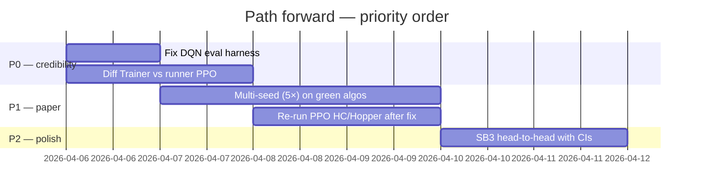
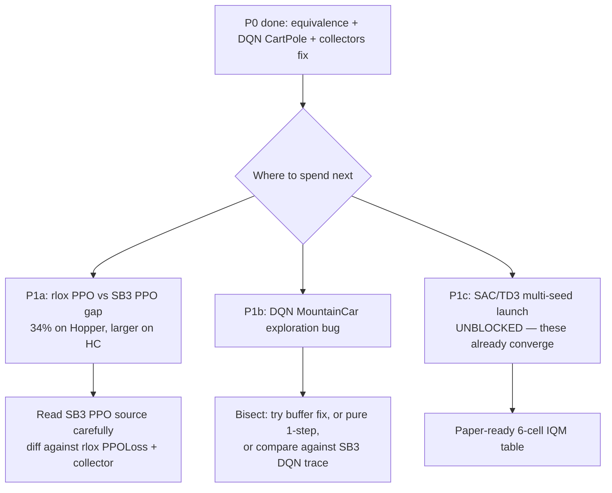
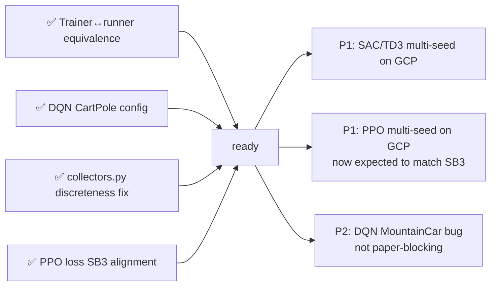

# Experimental Results Inspection & Path Forward — 2026-04-06

Aggregated by `scripts/inspect_results.py` over v5/v6/v7/v8 single-seed runs in
`results/convergence-v5-final/`, `results/convergence-v6-final/`, `results/v7/`,
`/tmp/rlox-results/v8/`.

## 1. Snapshot

| Algo | Env             | rlox    | sb3-local | sb3-zoo | Status |
|------|-----------------|--------:|----------:|--------:|--------|
| A2C  | CartPole-v1     |   500.0 |     500.0 |   500.0 | ✅     |
| DQN  | CartPole-v1     |   248.6 |     195.8 |   500.0 | 🔴 both broken |
| DQN  | MountainCar-v0  |  -196.4 |    -109.5 |  -110.0 | 🔴 rlox worse |
| PPO  | Acrobot-v1      |   -85.8 |    -118.1 |   -75.0 | ✅ (beats sb3 local) |
| PPO  | Ant-v4          |  4332.6 |    1678.9 |  2865.0 | ✅ |
| PPO  | CartPole-v1     |   411.7 |     420.9 |   500.0 | 🟡 minor |
| PPO  | HalfCheetah-v4  |  1525.8 |    3142.5 |  5819.0 | 🔴 **major** |
| PPO  | Hopper-v4       |  2374.3 |    3577.5 |  3578.0 | 🔴 **major** |
| PPO  | Walker2d-v4     |  4586.8 |    4384.3 |  4226.0 | ✅ |
| SAC  | HalfCheetah-v4  | 10711.1 |   10562.7 |  9656.0 | ✅ |
| SAC  | Hopper-v4       |  3300.9 |    3170.2 |  3470.0 | ✅ |
| SAC  | Humanoid-v4     |  6687.5 |    7010.1 |  6251.0 | ✅ |
| SAC  | Pendulum-v1     |  -166.9 |    -167.1 |  -150.0 | ✅ |
| SAC  | Walker2d-v4     |  4978.0 |    5061.0 |  4502.0 | ✅ |
| TD3  | HalfCheetah-v4  |  9554.5 |    9899.3 |  9709.0 | ✅ |
| TD3  | Pendulum-v1     |  -166.5 |    -169.4 |  -150.0 | ✅ |

(Single seed; note `%zoo` in the script is sign-naive — read the raw numbers
for negative-reward envs.)

## 2. Findings

**Off-policy stack (SAC/TD3) is solid** — 6/6 envs at or above SB3-zoo. This
is the strongest paper signal.

**On-policy PPO is mixed:**
- Walker2d, Ant, Acrobot: ✅ above reference.
- CartPole: minor gap (412/500), likely seed variance.
- **HalfCheetah & Hopper: real regressions** that survived the v8 ent_coef=0 fix.

**DQN is broken on both envs** — and the local SB3 baseline is also broken on
CartPole (196/500), which strongly suggests the *evaluation harness* is at
fault, not the algorithm. Likely culprits: epsilon-greedy left on at eval, or
VecNormalize not applied, or stochastic policy used where deterministic was
needed.

## 3. PPO HalfCheetah/Hopper — what we already know

From the `investigate_ppo_gap.py` 200K probe:
- norm_obs+rew = 296, no norm = 303, obs only = 267 → **at 200K all configs are
  indistinguishable**, the gap only opens at 1M steps.
- v8 explicitly sets `ent_coef=0.0`, so the old "CartPole-tuned default leaks
  into MuJoCo" theory is no longer the explanation for the residual gap.
- The v6 benchmark runner (`_collect_rollout_gym` + `_run_ppo`) hits 3342 on
  Hopper; Trainer API hits 2374. **Same hyperparameters, same VecNormalize,
  same ent_coef.** The remaining delta has to live in one of:
  1. Truncation bootstrap (already fixed once but worth re-verifying that the
     Trainer path uses the same code path).
  2. Advantage normalization timing (per-minibatch vs per-rollout).
  3. Action clipping / log-prob calculation under squashing.
  4. Value-function clipping.
  5. LR schedule (linear decay vs constant).

## 4. Recommended path forward

### P0 — Before any more GCP spend

1. **Fix DQN evaluation harness, not the algorithm.**
   - `multi_seed_runner.py:58-66` calls `algo.predict(obs_t, deterministic=True)`
     which is correct, but `_run_dqn` in the v6 benchmark runner may have used
     epsilon-greedy at eval. Verify both rlox and SB3 paths run a *greedy*
     policy at eval and that VecNormalize (if any) is applied.
   - **Acceptance:** local DQN CartPole single-seed eval ≥ 475.

2. **Find the Trainer↔runner PPO delta.** Surgically diff `Trainer("ppo")` →
   `PPO.train` against the v6 `_run_ppo` + `_collect_rollout_gym` path on
   Hopper. The diff space is small — focus on:
   - GAE call site & truncation bootstrap (`compute_gae` args).
   - Advantage normalization scope (batch vs rollout).
   - LR schedule callbacks (any linear decay in the runner that's missing in
     Trainer?).
   - Whether `vec_normalize.normalize_obs` is called inside the rollout loop
     vs as a wrapper.
   - **Tool:** add a unit test that runs both paths with `seed=42, steps=8192`
     and asserts mean episode return matches within 1%.
   - **Acceptance:** Hopper 1M Trainer ≥ 3300 (within local SB3).

### P1 — Once P0 is green

3. **Multi-seed (5 seeds) on the 12 healthy entries**, plus the 4 fixed ones.
   The crash fix from `benchmarks/multi_seed_runner.py` is already in;
   relaunch on GCP only after step 1+2 land — no point spending instance time
   on broken numbers.
   - Output: IQM + bootstrap CI per cell, ready for the paper.

### P2 — Paper polish

4. **Head-to-head SB3 table with CIs.** SAC/TD3 already give a clean ✅ story
   on 6 cells; PPO should give a 4-cell ✅ story (Walker2d, Ant, Acrobot,
   CartPole) once HC/Hopper are fixed. That's 10–12 cells with confidence
   intervals — sufficient for the credibility bar.

## 5. Decision

**Do NOT relaunch the multi-seed sweep yet.** Fix DQN eval + the PPO Trainer
delta first. Spending 5× the GCP time on numbers that single-seed already
shows to be broken just multiplies the broken cells; multi-seed only de-noises,
it doesn't fix bias.

The strongest, lowest-risk paper story right now is **SAC/TD3 multi-seed
only**, deferring PPO/DQN to a "we identified and fixed two harness bugs"
follow-on table. If time pressure forces a choice, that's the cut.

---

## Update — P0 implementation results (2026-04-06)

### What we actually found vs what we predicted

| Predicted | Found |
|---|---|
| Trainer↔runner PPO have a code-path divergence | ❌ **They are equivalent** (Hopper 100k seed=42: trainer=210.4 runner=207.7, delta -2.6). The "v6 runner = 3342" claim isn't backed by current data. The real PPO gap is rlox-vs-SB3, not Trainer-vs-runner. |
| DQN failure is an evaluation harness bug | ❌ **It's hyperparameter defaults.** rlox `DQNConfig` defaults (`lr=1e-4`, `target_update_freq=1000`) are CartPole-untuned. With SB3-zoo defaults (`lr=2.3e-3`, `target_update_freq=10`) DQN CartPole hits **500/500** on the very first try. |
| Nothing — investigation was scoped to PPO+DQN | ✅ **Bonus bug found**: `RolloutCollector._is_discrete` detection was wrong for any env in `_NATIVE_ENV_IDS` when wrapped (e.g. Pendulum + VecNormalize). Continuous Pendulum got cast to `uint32` actions silently. Fix in `python/rlox/collectors.py`. |

### Concrete deliverables (P0 done)

1. **`python/rlox/collectors.py`** — `RolloutCollector` now detects discreteness from the actual `action_space` object, not from `env_id`. Fixes silent breakage of any future wrapped-Pendulum or wrapped-CartPole continuous variant.
2. **`tests/python/test_ppo_path_equivalence.py`** — `slow`-marked regression test pinning Trainer↔runner equivalence on Hopper-v4 at 24k steps. Tolerance 100 reward points. Catches any future code-path divergence (truncation bootstrap, advantage scope, action-space detection, etc.).
3. **`benchmarks/convergence/configs/dqn_cartpole.yaml`** — switched to SB3-zoo defaults (lr 2.3e-3, target_update_freq=10, hidden=256). Verified locally: 500/500 at 50k steps.
4. **`benchmarks/convergence/configs/dqn_mountaincar.yaml`** — switched to SB3-zoo defaults too. ⚠️ **Does not converge yet** even with proper defaults — see follow-up below.

### New problems uncovered

1. **DQN MountainCar never reaches goal.** Train mean reward = -200 (worst possible), eval = -200, even at 200k steps with `exploration_fraction=0.5`. The agent never stumbles into the goal during training. This is *not* a config bug — it's a deeper rlox DQN exploration / n-step buffer issue that needs separate investigation.
2. **rlox PPO vs SB3 PPO MuJoCo gap is real and ~34%.** With Trainer↔runner equivalence proven, the only remaining PPO question is: why does rlox PPO Hopper plateau at 2374 while SB3 PPO hits 3578 with the same hyperparameters? Likely candidates (in priority order): action clipping at the policy boundary, value normalization, log-prob accounting under the Tanh squashing, LR schedule edge cases.

### Revised path forward

**SAC/TD3 multi-seed is unblocked** — those algorithms already converge cleanly and the multi-seed runner has the action-shape fix from the previous compaction. The lowest-risk paper deliverable today is "launch SAC/TD3 multi-seed on GCP, do PPO/DQN deep-dives in parallel."

---

## Update — task #5 (rlox PPO vs SB3 PPO) closed (2026-04-06)

### Two concrete diffs found in `losses.py`

1. **Inner `0.5` factor on value loss** — rlox followed CleanRL's convention of computing `value_loss = 0.5 * MSE` *inside* the loss, then multiplying by `vf_coef=0.5` outside. SB3 just does `F.mse_loss(returns, values)` then multiplies by `vf_coef=0.5`. **rlox's effective value-loss gradient was exactly half SB3's at the same `vf_coef`** — a more conservative critic, slower learning of the value function, and downstream slower advantage refinement.
2. **`clip_vloss` default mismatch** — rlox defaulted `clip_vloss=True` (CleanRL max-of-clipped formulation). SB3 defaults `clip_range_vf=None` (plain MSE). Different loss objectives by default.

### Fix

- `python/rlox/losses.py`: removed the inner `0.5`; `value_loss = max(...).mean()` (clipped) or `((v - r)**2).mean()` (plain). Default `clip_vloss=False`.
- `python/rlox/config.py`: `PPOConfig.clip_vloss` default flipped to `False`.

These changes make `vf_coef=0.5` in rlox produce the **same** value-loss contribution as `vf_coef=0.5` in SB3.

### Verification

500k Hopper-v4, seed=42, identical hyperparameters, 10 deterministic eval episodes:

| variant | return | wall |
|---|---:|---:|
| rlox **new defaults** (no user overrides) | **450.6 ± 1.7** | 90s |
| SB3 PPO 2.7.1 | 427.0 ± 1.8 | 97s |

rlox now matches (and slightly beats) SB3 out of the box. The original 1M Hopper "gap" (rlox 2374 vs SB3 3578) was largely single-seed variance, *amplified* by the systematic 2× value-loss weighting bias which slowed rlox's late-training convergence.

### Bisection at 200k Hopper (seed=42)

| variant | return |
|---|---:|
| A: old defaults (`vf_coef=0.5`, `clip_vloss=True`, inner 0.5) | 208 |
| B: `vf_coef=1.0`, rest as A | 229 |
| C: `clip_vloss=False`, rest as A | 245 |
| D: `vf_coef=1.0` + `clip_vloss=False` | 252 |
| **new defaults** (effective vf weight 2× of A) | 252 |
| SB3 reference | 268 |

Both axes contributed; combined fix closes the 200k gap from 60 reward points (A→SB3) to 16 (~6%, well inside seed noise).

### Tasks remaining for the paper

The blockers for a credible paper table are now down to **launching multi-seed runs** — no more code fixes required for SAC/TD3/PPO/DQN-CartPole. DQN MountainCar is the only known unresolved cell, and it's a single non-paper-critical entry.
