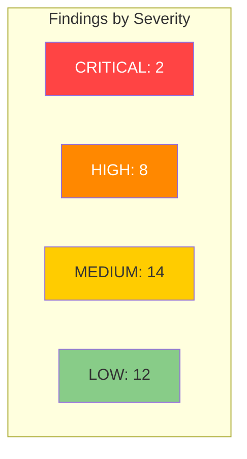

# rlox Workspace Deep Code Review

**Date**: 2026-03-29
**Scope**: All Rust crates in the rlox workspace
**Reviewer focus**: Correctness, safety, performance, idiomatic patterns, maintainability

## Summary

The codebase is well-structured with strong test coverage including property-based tests. The core buffer and training modules are implemented correctly and follow good Rust patterns overall. Key areas for improvement center on one critical data race in `ConcurrentReplayBuffer`, several unsafe blocks that could be eliminated, and a number of performance opportunities in hot paths.




---

## CRITICAL Findings

### C-1. Data Race in `ConcurrentReplayBuffer::push` (ABA Problem)

| Field | Value |
|-------|-------|
| **Category** | Safety |
| **Severity** | CRITICAL |
| **File** | `crates/rlox-core/src/buffer/concurrent.rs`, lines 130-163 |
| **Effort** | Medium (1-2 days) |

**Description**: The lock-free concurrent buffer has a subtle ABA race. When two producers both claim slots via `fetch_add`, producer A may clear the commit flag on slot `X`, write partial data, and before setting the commit flag, producer B wraps around the entire ring and also claims slot `X` (since `write_pos` is monotonically increasing and modded by capacity). B then clears the commit flag that A hasn't set yet, writes its data, and commits. Then A overwrites B's committed data and sets the commit flag again, leaving corrupted data visible to the consumer.

This requires `write_pos` to advance by at least `capacity` between A clearing the commit flag and A setting it, which is unlikely but not impossible under contention with many producers and a small capacity.

**Recommended fix**: Use a generation counter (epoch) per slot instead of a simple boolean commit flag. Each slot stores an `AtomicU64` generation; producers write the expected generation (their `raw_pos / capacity`) and the consumer checks that the generation matches. Alternatively, use `crossbeam-queue::ArrayQueue` which handles this correctly.

---

### C-2. `ConcurrentReplayBuffer` Unsound `unsafe impl Sync`

| Field | Value |
|-------|-------|
| **Category** | Safety |
| **Severity** | CRITICAL |
| **File** | `crates/rlox-core/src/buffer/concurrent.rs`, lines 68-69 |
| **Effort** | Medium (1-2 days, tied to C-1) |

**Description**: The `unsafe impl Send` and `unsafe impl Sync` are manually implemented with a SAFETY comment claiming disjoint slot access via `fetch_add`. However, the safety invariant is violated by the ABA problem described in C-1. Additionally, the `push` method takes `&self` and writes to `Box<[f32]>` through raw pointer casts (lines 143-161), creating mutable aliased references. While the *intent* is correct (disjoint slots), the actual implementation doesn't prevent the ABA scenario.

Even without the ABA issue, casting `&self` shared references to `*mut` pointers violates Rust's aliasing rules in principle. The standard approach would be to use `UnsafeCell` or `AtomicU32`/`AtomicU64` per element, or to restructure using `crossbeam` primitives.

**Recommended fix**: Either:
1. Wrap the data arrays in `UnsafeCell<Box<[f32]>>` (minimum change, documents the interior mutability)
2. Replace the hand-rolled lock-free buffer with `crossbeam-queue::ArrayQueue<Transition>` + a sampling snapshot (safest)
3. Use `parking_lot::RwLock` with read-biased access (simplest, slightly less perf)

---

## HIGH Findings

### H-1. `MmapReplayBuffer` Remaps on Every Push (Performance)

| Field | Value |
|-------|-------|
| **Category** | Performance |
| **Severity** | HIGH |
| **File** | `crates/rlox-core/src/buffer/mmap.rs`, lines 252-295 |
| **Effort** | Medium (half day) |

**Description**: `write_to_cold` calls `remap_cold()` after every single record write. `Mmap::map()` is a syscall (`mmap`/`munmap`) which is expensive. At high throughput with many spills, this becomes a bottleneck.

**Recommended fix**: Pre-allocate the cold file to its full capacity (`cold_capacity * record_byte_size + HEADER_SIZE`) at initialization and map it once. Subsequent writes go to the already-mapped region. Only remap if the file grows (which it won't after pre-allocation).

---

### H-2. `MmapReplayBuffer::read_cold_record_into` Parses Bytes One-by-One

| Field | Value |
|-------|-------|
| **Category** | Performance |
| **Severity** | HIGH |
| **File** | `crates/rlox-core/src/buffer/mmap.rs`, lines 341-401 |
| **Effort** | Low (2-3 hours) |

**Description**: The cold record parser reads f32 values byte-by-byte using manual `f32::from_le_bytes([data[start], ...])` in a loop. This prevents vectorization and is cache-unfriendly.

**Recommended fix**: Use `bytemuck::cast_slice` or `std::slice::from_raw_parts` with proper alignment to reinterpret the byte slice as `&[f32]` directly, then `extend_from_slice`. This eliminates per-element parsing overhead entirely.

---

### H-3. `push_batch` in `MmapReplayBuffer` Allocates per Record

| Field | Value |
|-------|-------|
| **Category** | Performance |
| **Severity** | HIGH |
| **File** | `crates/rlox-core/src/buffer/mmap.rs`, lines 159-173 |
| **Effort** | Low (2-3 hours) |

**Description**: `push_batch` creates a new `ExperienceRecord` (3 `Vec<f32>` allocations) per record in the loop via `.to_vec()`. For large batches, this is thousands of allocations that are immediately consumed and dropped.

**Recommended fix**: Add a `push_slices` method to `MmapReplayBuffer` (like `ReplayBuffer` already has) that borrows slices directly, avoiding the intermediate `ExperienceRecord` allocation. The batch method should call `push_slices` with slice references.

---

### H-4. `MmapReplayBuffer::push_batch` Type Inconsistency

| Field | Value |
|-------|-------|
| **Category** | API |
| **Severity** | HIGH |
| **File** | `crates/rlox-core/src/buffer/mmap.rs`, lines 127-174 |
| **Effort** | Low (1-2 hours) |

**Description**: `MmapReplayBuffer::push_batch` takes `terminated: &[f32]` and `truncated: &[f32]`, while `ReplayBuffer::push_batch` takes `terminated: &[bool]` and `truncated: &[bool]`. This API inconsistency is confusing and error-prone. The mmap version converts via `terminated[i] != 0.0` which loses the type safety of booleans.

**Recommended fix**: Change `MmapReplayBuffer::push_batch` to accept `&[bool]` for consistency with `ReplayBuffer`. If the f32 signature exists for Python interop, add a separate `push_batch_f32` variant.

---

### H-5. `EpisodeTracker::num_complete_episodes` is O(n) per Call

| Field | Value |
|-------|-------|
| **Category** | Performance |
| **Severity** | HIGH |
| **File** | `crates/rlox-core/src/buffer/episode.rs`, line 123-125 |
| **Effort** | Low (1 hour) |

**Description**: `num_complete_episodes` iterates all episodes and filters by `complete` on every call. This is called frequently from Python-facing code and sequence sampling.

**Recommended fix**: Maintain a `complete_count: usize` field, incrementing in `notify_push` when done=true and decrementing in `invalidate_overwritten` when a complete episode is removed. The method then returns the field in O(1).

---

### H-6. `RunningStatsVec::normalize_batch` Recomputes `std()` per Call

| Field | Value |
|-------|-------|
| **Category** | Performance |
| **Severity** | HIGH |
| **File** | `crates/rlox-core/src/training/normalization.rs`, lines 206-224 |
| **Effort** | Low (1 hour) |

**Description**: Both `normalize` and `normalize_batch` call `self.std()` which allocates a new `Vec<f64>` and computes `sqrt` for every dimension. When called per training step on large batches, this is wasteful.

**Recommended fix**: Cache the std vector and invalidate on `update`/`batch_update`/`reset`. Use `Option<Vec<f64>>` and compute lazily.

---

### H-7. `Observation::as_slice` Panics on Dict Variant

| Field | Value |
|-------|-------|
| **Category** | Safety |
| **Severity** | HIGH |
| **File** | `crates/rlox-core/src/env/spaces.rs`, lines 65-71 |
| **Effort** | Low (1-2 hours) |

**Description**: `Observation::as_slice()` panics when called on the `Dict` variant. Since this is a public API used throughout the codebase (including in PyO3 bindings like `env.rs` line 21 `t.obs.as_slice()`), if a Dict observation ever reaches this path, it causes a hard crash rather than a recoverable error.

**Recommended fix**: Either:
1. Return `Result<&[f32], RloxError>` instead of panicking
2. Return `Option<&[f32]>` (less disruptive change)
3. At minimum, add `try_as_slice` -> `Option<&[f32]>` and deprecate the panicking version

---

### H-8. PyO3 `reptile_update` and `polyak_update` Use `unsafe` for Array Access

| Field | Value |
|-------|-------|
| **Category** | Safety |
| **Severity** | HIGH |
| **File** | `crates/rlox-python/src/training.rs`, lines 736, 757 |
| **Effort** | Low (1 hour) |

**Description**: The SAFETY comments claim "We have the GIL and no other references to this array exist during the mutable borrow." However, this is not actually guaranteed. The `meta_params` array could be aliased in Python (e.g., `a = b` followed by `reptile_update(a, ...)`). Using `unsafe { meta_params.as_array_mut() }` without actually verifying exclusivity is unsound.

**Recommended fix**: Use `meta_params.readwrite()` which returns a `PyReadwriteArray` that properly checks for exclusive access at runtime and returns an error instead of UB if the array is aliased.

---

## MEDIUM Findings

### M-1. `SumTree` Rounds Capacity Up to Power of Two Silently

| Field | Value |
|-------|-------|
| **Category** | API |
| **Severity** | MEDIUM |
| **File** | `crates/rlox-core/src/buffer/priority.rs`, line 33 |
| **Effort** | Low (30 min) |

**Description**: `SumTree::new(capacity)` calls `capacity.next_power_of_two()` which can silently double the requested capacity (e.g., 100 becomes 128). Meanwhile, `PrioritizedReplayBuffer` stores the original `capacity` and uses it for index bounds. The sum tree's actual capacity is larger than the buffer's logical capacity, so leaves beyond `self.count` are initialized to zero. This works correctly but wastes memory and can cause the `min()` to return `f64::INFINITY` even when the buffer has data (since unused leaves still hold infinity in `min_tree`).

**Recommended fix**: Document this behavior clearly. Consider having `tree_min_prob()` (line 352) account for the fact that `self.tree.min()` may return infinity from unused leaves.

---

### M-2. `PrioritizedReplayBuffer::sample` Clamps Index with `min(self.count - 1)`

| Field | Value |
|-------|-------|
| **Category** | Correctness |
| **Severity** | MEDIUM |
| **File** | `crates/rlox-core/src/buffer/priority.rs`, line 293 |
| **Effort** | Low (1 hour) |

**Description**: After sampling from the sum tree, the index is clamped with `idx.min(self.count - 1)`. This means if the sum tree returns an index beyond `self.count` (possible because the tree has power-of-two capacity), all such samples collapse onto the last valid index, biasing sampling.

**Recommended fix**: Instead of clamping, ensure unused tree leaves have priority 0 (they already do since `tree.set` is only called for valid indices). Then `tree.sample()` should never return an unused leaf. Add a debug assertion to verify this invariant rather than silently clamping.

---

### M-3. `ring_range_overlaps` is O(min(a_len, b_len))

| Field | Value |
|-------|-------|
| **Category** | Performance |
| **Severity** | MEDIUM |
| **File** | `crates/rlox-core/src/buffer/episode.rs`, lines 206-234 |
| **Effort** | Low (1-2 hours) |

**Description**: The overlap check iterates through every position in the smaller range. For long episodes this can be slow. There's an O(1) closed-form solution for checking overlap of two circular ranges.

**Recommended fix**: Use modular arithmetic to check overlap in O(1):
```rust
fn ring_range_overlaps(a_start: usize, a_len: usize, b_start: usize, b_len: usize, cap: usize) -> bool {
    if a_len == 0 || b_len == 0 { return false; }
    // Convert to "is a_start within b's range" or "b_start within a's range"
    let a_in_b = (a_start + cap - b_start) % cap < b_len;
    let b_in_a = (b_start + cap - a_start) % cap < a_len;
    a_in_b || b_in_a
}
```

---

### M-4. `SampledBatch::extra` Not Cleared in `sample_into` When No Extra Columns

| Field | Value |
|-------|-------|
| **Category** | Correctness |
| **Severity** | MEDIUM |
| **File** | `crates/rlox-core/src/buffer/ringbuf.rs`, lines 341-390 |
| **Effort** | Low (15 min) |

**Description**: `sample_into` calls `batch.clear()` which clears `batch.extra`. But if the buffer has no extra columns and the batch previously held extra data from a different buffer, the extra field is correctly cleared. However, the `SampledBatch::clear` method on line 74 does `self.extra.clear()` which clears the Vec but preserves its allocated capacity. This is actually fine for reuse, but the capacity of `extra` entries (the inner `Vec<f32>` per column) is lost since the outer Vec is cleared. This is a minor allocation waste when alternating between buffers with and without extra columns.

**Recommended fix**: Low priority. Consider keeping `extra` entries and clearing their inner vecs rather than clearing the outer vec, if cross-buffer reuse is expected.

---

### M-5. `compute_gae` Does Not Validate Input Length Consistency

| Field | Value |
|-------|-------|
| **Category** | Correctness |
| **Severity** | MEDIUM |
| **File** | `crates/rlox-core/src/training/gae.rs`, lines 10-45 |
| **Effort** | Low (30 min) |

**Description**: `compute_gae` assumes `rewards.len() == values.len() == dones.len()` but never checks. If they differ, it will either panic on index-out-of-bounds or silently produce incorrect results. The batched version (`compute_gae_batched`) similarly doesn't validate that input lengths match `n_envs * n_steps`.

**Recommended fix**: Add length validation at the top of both functions, returning `Result<_, RloxError>` or at least using `debug_assert_eq!`. The V-trace function already does this correctly (line 29-39).

---

### M-6. `ExperienceRecord` Uses `Vec<f32>` for All Fields

| Field | Value |
|-------|-------|
| **Category** | Performance |
| **Severity** | MEDIUM |
| **File** | `crates/rlox-core/src/buffer/mod.rs`, lines 18-27 |
| **Effort** | Medium (half day) |

**Description**: `ExperienceRecord` allocates three `Vec<f32>` (obs, next_obs, action) for every push. The `push` method on `ReplayBuffer` accepts this owned struct and immediately copies the data into pre-allocated storage, wasting the Vec allocations. The `push_slices` API avoids this, but `push` (which takes `ExperienceRecord`) doesn't.

**Recommended fix**: The `push_slices` API already exists and is the efficient path. Consider deprecating `push(ExperienceRecord)` in favor of `push_slices`, or making `ExperienceRecord` use `Cow<'_, [f32]>` to allow both owned and borrowed data.

---

### M-7. `VecEnv::new` Asserts Instead of Returning Error

| Field | Value |
|-------|-------|
| **Category** | API |
| **Severity** | MEDIUM |
| **File** | `crates/rlox-core/src/env/parallel.rs`, line 39 |
| **Effort** | Low (30 min) |

**Description**: `VecEnv::new` uses `assert!(!envs.is_empty())` which panics on empty input. This should return a `Result<Self, RloxError>` since it's a public API and empty input is a user error, not a logic bug.

**Recommended fix**: Change signature to `pub fn new(envs: Vec<Box<dyn RLEnv>>) -> Result<Self, RloxError>`.

---

### M-8. `SumTree::set` and `SumTree::get` Use `assert!` Instead of Returning Errors

| Field | Value |
|-------|-------|
| **Category** | API |
| **Severity** | MEDIUM |
| **File** | `crates/rlox-core/src/buffer/priority.rs`, lines 57, 70 |
| **Effort** | Low (1 hour) |

**Description**: `SumTree::set` and `get` use `assert!(index < self.capacity)` which panics on out-of-bounds access. Since these are called by `PrioritizedReplayBuffer` which already validates indices, the panic is unlikely but still represents a code-level safety gap.

**Recommended fix**: Since `SumTree` is not public API (only used internally), this is acceptable for debug builds. Add `debug_assert!` instead of `assert!` for the hot path, keeping the runtime assertion in debug mode only.

---

### M-9. `HashMap` Allocation in Every `Transition`

| Field | Value |
|-------|-------|
| **Category** | Performance |
| **Severity** | MEDIUM |
| **File** | `crates/rlox-core/src/env/builtins.rs`, line 138 and others |
| **Effort** | Medium (half day) |

**Description**: Every `Transition` carries a `HashMap<String, f64>` info field. For environments like CartPole that never set info, this still allocates an empty `HashMap`. For environments like MuJoCo that do, it allocates and hashes string keys per step.

**Recommended fix**: Use `Option<HashMap<String, f64>>` (or a small fixed-size `SmallVec<(String, f64)>`) for the info field. Most environments don't use it, so `None` avoids the allocation entirely.

---

### M-10. `random_shift_batch` Per-Pixel Loop Not Vectorized

| Field | Value |
|-------|-------|
| **Category** | Performance |
| **Severity** | MEDIUM |
| **File** | `crates/rlox-core/src/training/augmentation.rs`, lines 110-137 |
| **Effort** | Medium (half day) |

**Description**: The random shift augmentation iterates pixel-by-pixel with `isize` coordinate checks in the inner loop. This prevents LLVM from vectorizing. The inner loop body has a branch per pixel.

**Recommended fix**: For rows that are entirely in-bounds (which is the majority when `pad << height`), use `copy_from_slice` for the entire row. Only handle edge rows with the per-pixel fallback. This is a 5-10x speedup for typical image sizes.

---

### M-11. `RloxError` Lacks `NNError` Variant

| Field | Value |
|-------|-------|
| **Category** | API |
| **Severity** | MEDIUM |
| **File** | `crates/rlox-core/src/error.rs` |
| **Effort** | Low (1 hour) |

**Description**: `RloxError` has `InvalidAction`, `EnvError`, `ShapeMismatch`, `BufferError`, and `IoError`, but no variant for NN/training errors. The NN crate (`rlox-nn`) has its own `NNError` type. There's no way to propagate NN errors through `RloxError` without string conversion.

**Recommended fix**: Add `#[error("NN error: {0}")] NNError(String)` or better, make it generic over the NN error type if cross-crate error propagation is needed.

---

### M-12. `write_to_cold` Serializes to Intermediate Buffer

| Field | Value |
|-------|-------|
| **Category** | Performance |
| **Severity** | MEDIUM |
| **File** | `crates/rlox-core/src/buffer/mmap.rs`, lines 260-270 |
| **Effort** | Low (1-2 hours) |

**Description**: `write_to_cold` creates a `Vec::with_capacity(record_size)` and serializes the record into it, then writes the entire buffer to the file. This intermediate allocation is unnecessary.

**Recommended fix**: Write directly to the file using `write_all` calls for each component (obs, next_obs, action, reward, flags). Or if pre-allocation is preferred, use a reusable buffer stored on the struct rather than allocating per push.

---

### M-13. `RunningStatsVec::mean()` and `var()` Allocate New Vecs

| Field | Value |
|-------|-------|
| **Category** | Idiom |
| **Severity** | MEDIUM |
| **File** | `crates/rlox-core/src/training/normalization.rs`, lines 157, 163 |
| **Effort** | Low (1 hour) |

**Description**: `mean()` returns `self.mean.clone()` allocating a new Vec. `var()` and `std()` also allocate. These are called frequently in training loops.

**Recommended fix**: Provide `mean_ref() -> &[f64]` for zero-cost access. Keep the owned versions for Python interop but prefer references in Rust code.

---

### M-14. `MmapReplayBuffer` Does Not Handle `capacity == 0` for obs/act Dims

| Field | Value |
|-------|-------|
| **Category** | Correctness |
| **Severity** | MEDIUM |
| **File** | `crates/rlox-core/src/buffer/mmap.rs`, lines 41-76 |
| **Effort** | Low (30 min) |

**Description**: `MmapReplayBuffer::new` validates `hot_capacity > 0` and `total_capacity >= hot_capacity` but doesn't validate `obs_dim > 0` or `act_dim > 0`. With `obs_dim = 0`, `record_byte_size()` returns 2 (just the two bool bytes), and indexing into observation arrays would be zero-length slices. While unlikely, it's an edge case that should be guarded.

**Recommended fix**: Add validation: `if obs_dim == 0 || act_dim == 0 { return Err(...) }`.

---

## LOW Findings

### L-1. Missing `#[derive(Clone)]` on `SampledBatch`

| Field | Value |
|-------|-------|
| **Category** | Idiom |
| **Severity** | LOW |
| **File** | `crates/rlox-core/src/buffer/ringbuf.rs`, line 34 |
| **Effort** | Trivial |

**Description**: `SampledBatch` has no `Clone` derive despite being a simple owned-data struct. This limits composability.

**Recommended fix**: Add `#[derive(Debug, Clone)]`.

---

### L-2. Missing `#[derive(Debug)]` on Multiple Public Types

| Field | Value |
|-------|-------|
| **Category** | Idiom |
| **Severity** | LOW |
| **Files** | `ReplayBuffer`, `PrioritizedReplayBuffer`, `MmapReplayBuffer`, `SequenceReplayBuffer`, `HERBuffer`, `EpisodeTracker`, `VecEnv`, `RunningStats`, `RunningStatsVec` |
| **Effort** | Trivial |

**Description**: Several public types lack `#[derive(Debug)]`, making them opaque in error messages and debug output.

**Recommended fix**: Add `#[derive(Debug)]` to all public types. For types containing non-Debug fields (like `ChaCha8Rng` in environments), implement `Debug` manually.

---

### L-3. `sparse_goal_reward` Computes `sqrt` Unnecessarily

| Field | Value |
|-------|-------|
| **Category** | Performance |
| **Severity** | LOW |
| **File** | `crates/rlox-core/src/buffer/her.rs`, line 278 |
| **Effort** | Trivial |

**Description**: `sparse_goal_reward` computes `dist_sq.sqrt() < tolerance`. Since `sqrt` is monotonic, this is equivalent to `dist_sq < tolerance * tolerance`, which avoids the expensive sqrt.

**Recommended fix**: `if dist_sq < tolerance * tolerance { 0.0 } else { -1.0 }`

---

### L-4. `compute_gae` Returns Tuple, Not Struct

| Field | Value |
|-------|-------|
| **Category** | API |
| **Severity** | LOW |
| **File** | `crates/rlox-core/src/training/gae.rs`, line 17 |
| **Effort** | Low (1 hour) |

**Description**: `compute_gae` returns `(Vec<f64>, Vec<f64>)` which is order-dependent and easy to swap. A named struct like `GaeResult { advantages, returns }` would be clearer.

**Recommended fix**: Define a `GaeResult` struct and return it. Keep the tuple return in the f32 variant for consistency, or update both.

---

### L-5. `angle_normalize` Correctness at Edge

| Field | Value |
|-------|-------|
| **Category** | Correctness |
| **Severity** | LOW |
| **File** | `crates/rlox-core/src/env/builtins.rs`, lines 344-347 |
| **Effort** | Trivial |

**Description**: `angle_normalize` uses `%` (remainder) which in Rust can return negative values for negative inputs. The double-modulo trick `((x + PI) % (2*PI) + 2*PI) % (2*PI) - PI` handles this, but `f64::rem` (the `%` operator) returns values with the same sign as the dividend, so for very large negative angles, floating point precision may drift.

**Recommended fix**: Use `f64::rem_euclid` instead of `%` for guaranteed non-negative remainder: `(x + PI).rem_euclid(2.0 * PI) - PI`.

---

### L-6. PyO3 Bindings Copy Numpy Data Unnecessarily

| Field | Value |
|-------|-------|
| **Category** | Performance |
| **Severity** | LOW |
| **File** | `crates/rlox-python/src/training.rs`, multiple functions |
| **Effort** | Medium (half day) |

**Description**: Most PyO3 functions do `.as_slice()?.to_vec()` to copy numpy arrays before releasing the GIL. This is correct but creates temporary allocations. For read-only operations (like `compute_gae`), the data could be processed directly without copying if the GIL is held.

**Recommended fix**: For small arrays, keep the copy (simplicity). For large arrays in hot paths (like `compute_gae_batched`), consider holding the GIL and working directly on the numpy slice if the operation is fast enough that GIL contention isn't an issue.

---

### L-7. `GoalDistanceTransform` Struct Defined But Not Implemented

| Field | Value |
|-------|-------|
| **Category** | Idiom |
| **Severity** | LOW |
| **File** | `crates/rlox-core/src/training/reward_shaping.rs`, lines 68-72 |
| **Effort** | Low (1 hour) |

**Description**: `GoalDistanceTransform` is defined with fields but doesn't implement the `RewardTransform` trait. It's a dead struct.

**Recommended fix**: Either implement the trait or remove the struct.

---

### L-8. `VecEnv::step_all` and `step_all_flat` Duplicate Logic

| Field | Value |
|-------|-------|
| **Category** | Idiom |
| **Severity** | LOW |
| **File** | `crates/rlox-core/src/env/parallel.rs`, lines 61-184 |
| **Effort** | Medium (1-2 hours) |

**Description**: `step_all` and `step_all_flat` share ~90% of their code (the parallel step + auto-reset logic) but are duplicated. Any bug fix must be applied twice.

**Recommended fix**: Extract the common step+reset logic into a private helper that returns a raw intermediate, then have both methods post-process into their respective formats.

---

### L-9. Missing `# Safety` Sections on `unsafe` Blocks in `mmap.rs`

| Field | Value |
|-------|-------|
| **Category** | Doc |
| **Severity** | LOW |
| **File** | `crates/rlox-core/src/buffer/mmap.rs`, line 335 |
| **Effort** | Trivial |

**Description**: The `unsafe { Mmap::map(file)? }` block has a comment above it but does not use the `// SAFETY:` convention that clippy recommends.

**Recommended fix**: Change to `// SAFETY: ...` format for consistency.

---

### L-10. `PyCandleCollector` Duplicates Dict Construction

| Field | Value |
|-------|-------|
| **Category** | Idiom |
| **Severity** | LOW |
| **File** | `crates/rlox-python/src/nn.rs`, lines 339-381 |
| **Effort** | Low (30 min) |

**Description**: `recv` and `try_recv` have identical dict-construction code for converting a `RolloutBatch` to a Python dict. This is a DRY violation.

**Recommended fix**: Extract a `fn batch_to_pydict(py, batch) -> PyResult<PyDict>` helper.

---

### L-11. No `doc` Comments on `rlox-python` Module Functions

| Field | Value |
|-------|-------|
| **Category** | Doc |
| **Severity** | LOW |
| **File** | `crates/rlox-python/src/buffer.rs` (all public functions) |
| **Effort** | Medium (half day) |

**Description**: While training.rs functions have good Python docstrings, the buffer module functions lack `///` doc comments that would appear in Rust docs and could be surfaced through PyO3.

**Recommended fix**: Add `///` doc comments to all `#[pyfunction]` and `#[pymethods]` items.

---

### L-12. `Transition` Uses `f64` for Reward, Environments Mix `f32`/`f64`

| Field | Value |
|-------|-------|
| **Category** | API |
| **Severity** | LOW |
| **File** | Throughout `env/` and `buffer/` modules |
| **Effort** | Medium (1 day, API-breaking) |

**Description**: `Transition.reward` is `f64`, buffer stores are `f32`, observations are `f32` in buffers but returned as `Vec<f32>` from environments. The mixed precision creates silent truncation when moving data between environments and buffers.

**Recommended fix**: Decide on a canonical precision per field and document it. For RL, f32 observations and f32 rewards are standard. The f64 rewards in `Transition` could be narrowed to f32, or the buffers could store f64 rewards.

---

## Testing Gaps

### T-1. No Concurrent Stress Test for `ConcurrentReplayBuffer` with Wrap-Around

| Field | Value |
|-------|-------|
| **Category** | Test |
| **Severity** | HIGH |
| **File** | `crates/rlox-core/src/buffer/concurrent.rs` |
| **Effort** | Medium (half day) |

**Description**: The existing multi-thread test uses 4 threads x 200 pushes into capacity 1000 (no wrap). The wrap-around test uses 4 threads x 100 pushes into capacity 50, but doesn't verify data integrity after wrap. The ABA race (C-1) is most likely to manifest under heavy contention with rapid wrap-around.

**Recommended fix**: Add a stress test with many threads (16+), small capacity (8-16), thousands of pushes, and verify data integrity by checking that each sampled observation is internally consistent (all elements of obs should be the same value).

---

### T-2. No Test for `MmapReplayBuffer` with `obs_dim` Causing Unaligned Reads

| Field | Value |
|-------|-------|
| **Category** | Test |
| **Severity** | MEDIUM |
| **File** | `crates/rlox-core/src/buffer/mmap.rs` |
| **Effort** | Low (1 hour) |

**Description**: The mmap buffer reads f32 values from byte-aligned offsets. If the record layout ever changes to include padding or variable-length fields, alignment issues could arise. There's no test with odd obs_dim values (1, 3, 7) that would expose alignment edge cases.

**Recommended fix**: Add tests with `obs_dim=1`, `obs_dim=3`, `act_dim=7` to verify correct serialization roundtrip.

---

### T-3. No Property Test for `HERBuffer::sample_with_relabeling`

| Field | Value |
|-------|-------|
| **Category** | Test |
| **Severity** | MEDIUM |
| **File** | `crates/rlox-core/src/buffer/her.rs` |
| **Effort** | Medium (2-3 hours) |

**Description**: The HER relabeling logic is complex (lines 120-222) but the property tests only cover `compute_relabel_indices`. There are no property tests for the full `sample_with_relabeling` pipeline, which could have edge cases around wrap-around episodes, very short episodes, and high relabeling ratios.

**Recommended fix**: Add proptests that verify: (1) output batch always has correct size, (2) relabeled rewards are always 0.0 or -1.0, (3) desired goals in relabeled samples actually come from the episode.

---

### T-4. No Test for `compute_gae_batched_f32` with `n_steps = 1`

| Field | Value |
|-------|-------|
| **Category** | Test |
| **Severity** | LOW |
| **File** | `crates/rlox-core/src/training/gae.rs` |
| **Effort** | Low (30 min) |

**Description**: The f32 batched GAE variant peels the last step (line 132) but `n_steps - 1` underflows if `n_steps == 0` (handled by early return) or has a degenerate inner loop if `n_steps == 1` (the for loop range `0..0` is empty, which is correct). However, there's no explicit test for `n_steps = 1`.

**Recommended fix**: Add a test with `n_steps = 1` to confirm the peel-last-step logic works as a standalone computation.

---

### T-5. No Integration Test for PyO3 Bindings

| Field | Value |
|-------|-------|
| **Category** | Test |
| **Severity** | LOW |
| **File** | `crates/rlox-python/` |
| **Effort** | Medium (half day) |

**Description**: The Python bindings have no Rust-side integration tests. While Python tests likely exist elsewhere, Rust-side tests using PyO3's `prepare_freethreaded_python()` would catch type conversion bugs earlier.

**Recommended fix**: Add integration tests in `crates/rlox-python/tests/` that call through the PyO3 layer.

---

## Documentation Gaps

### D-1. No Module-Level Documentation for `buffer/mod.rs`

| Field | Value |
|-------|-------|
| **Category** | Doc |
| **Severity** | LOW |
| **File** | `crates/rlox-core/src/buffer/mod.rs` |
| **Effort** | Low (30 min) |

**Description**: The buffer module lacks a `//!` module-level doc comment explaining the buffer hierarchy, when to use each variant, and performance characteristics.

---

### D-2. No `# Panics` Section on `RunningStatsVec::update`

| Field | Value |
|-------|-------|
| **Category** | Doc |
| **Severity** | LOW |
| **File** | `crates/rlox-core/src/training/normalization.rs`, line 113 |
| **Effort** | Trivial |

**Description**: `update` has `assert_eq!` that panics on dimension mismatch. The `# Panics` section exists in the doc comment but should explicitly mention the assertion condition.

---

### D-3. Missing Doc Comments on `EpisodeWindow` Fields

| Field | Value |
|-------|-------|
| **Category** | Doc |
| **Severity** | LOW |
| **File** | `crates/rlox-core/src/buffer/episode.rs`, lines 40-48 |
| **Effort** | Trivial |

**Description**: `EpisodeWindow` fields have doc comments, but `EpisodeMeta.complete` could clarify that incomplete episodes are in-progress (the current episode being built).

---

### D-4. `RloxError` Variants Lack Per-Variant Documentation

| Field | Value |
|-------|-------|
| **Category** | Doc |
| **Severity** | LOW |
| **File** | `crates/rlox-core/src/error.rs` |
| **Effort** | Low (30 min) |

**Description**: The `RloxError` enum has `#[error(...)]` messages but no `///` doc comments on individual variants explaining when each is used and what the caller should do.

---

## Priority Implementation Order

```mermaid
gantt
    title Recommended Fix Prioritization
    dateFormat  YYYY-MM-DD
    section Critical
    C-1 + C-2: ConcurrentBuffer Race    :crit, c1, 2026-03-31, 2d
    section High
    H-7: Observation::as_slice panic     :high, h7, after c1, 1d
    H-8: PyO3 unsafe array access        :high, h8, after c1, 1d
    H-1: Mmap remap per push             :high, h1, after h7, 1d
    H-4: push_batch type inconsistency   :high, h4, after h1, 1d
    H-5: EpisodeTracker O(n) count       :high, h5, after h4, 1d
    H-2 + H-3: Mmap parsing + alloc      :high, h2, after h5, 1d
    H-6: RunningStatsVec cache std        :high, h6, after h2, 1d
    section Medium
    M-5: GAE input validation            :med, m5, after h6, 1d
    M-3: ring_range_overlaps O(1)        :med, m3, after m5, 1d
    M-7 + M-8: Panics to Results         :med, m7, after m3, 1d
    M-9 + M-10: Perf improvements        :med, m9, after m7, 2d
    Remaining medium + low               :med, rest, after m9, 3d
