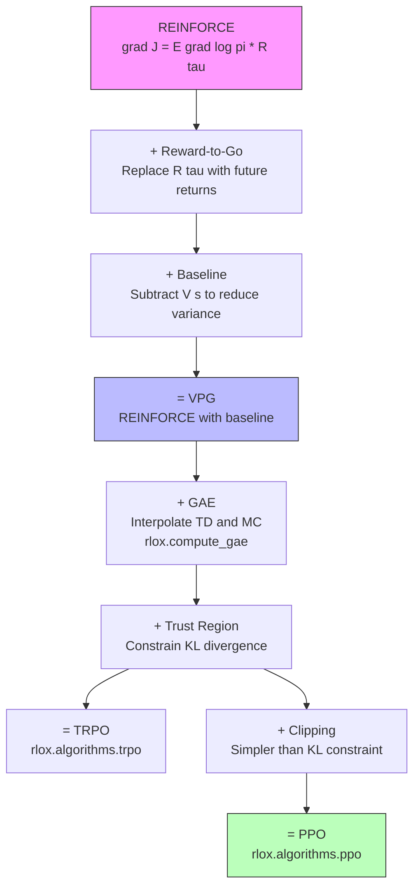
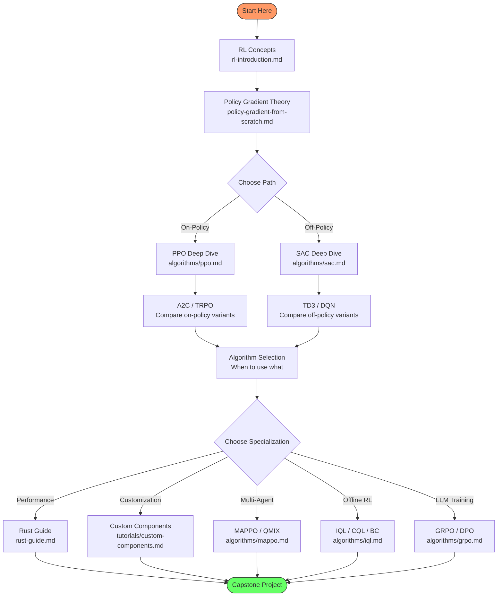
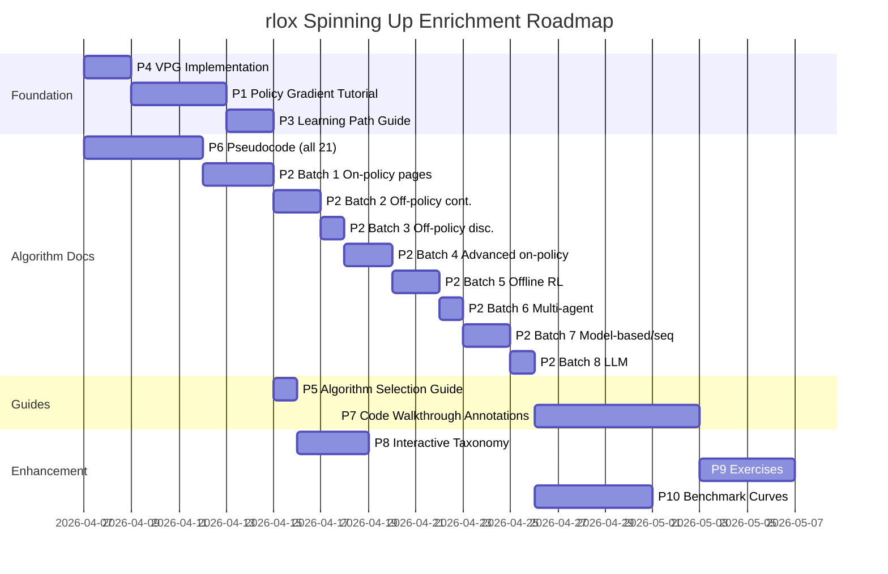
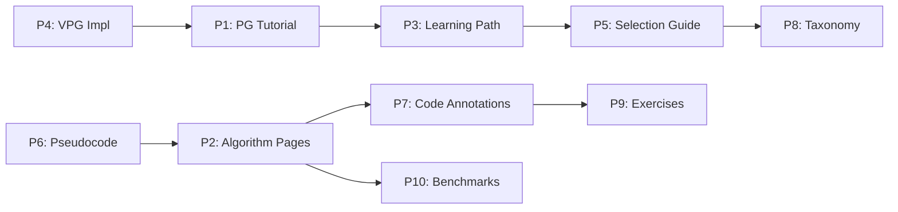

# Spinning Up in Deep RL -- Enrichment Plan for rlox

**Date:** 2026-03-29
**Scope:** Review OpenAI Spinning Up's educational content, algorithm documentation, and design philosophy; identify concrete ways to enrich rlox's documentation, learning path, and algorithm coverage.

---

## Table of Contents

1. [Spinning Up Overview](#1-spinning-up-overview)
2. [Side-by-Side Comparison](#2-side-by-side-comparison)
3. [Educational Content Gap Analysis](#3-educational-content-gap-analysis)
4. [Algorithm Documentation Format Analysis](#4-algorithm-documentation-format-analysis)
5. [Implementation Philosophy Contrast](#5-implementation-philosophy-contrast)
6. [Missing Algorithms](#6-missing-algorithms)
7. [Prioritized Enrichment Proposals](#7-prioritized-enrichment-proposals)
8. [Detailed Content Outlines (Top 3)](#8-detailed-content-outlines-top-3)
9. [Proposed Learning Path](#9-proposed-learning-path)
10. [Implementation Roadmap](#10-implementation-roadmap)

---

## 1. Spinning Up Overview

OpenAI's Spinning Up in Deep RL [1] is a structured educational resource designed to take newcomers from zero RL knowledge to implementing and running policy optimization algorithms. Its key structural components are:

### Content Architecture

```mermaid
graph TD
    A[Spinning Up] --> B[Part 1: Key Concepts in RL]
    A --> C[Part 2: Kinds of RL Algorithms]
    A --> D[Part 3: Intro to Policy Optimization]
    A --> E[User Guide]
    A --> F[Algorithm Implementations]

    B --> B1[Agent-Environment Loop]
    B --> B2[States, Observations, Actions]
    B --> B3[Policies: Stochastic vs Deterministic]
    B --> B4[Trajectories, Returns, Value Functions]
    B --> B5[The RL Optimization Problem]
    B --> B6[Value Functions in Detail]

    C --> C1[Model-Free vs Model-Based Taxonomy]
    C --> C2[What to Learn: Policy, Value, or Both]
    C --> C3[On-Policy vs Off-Policy]
    C --> C4[Algorithm Landscape Diagram]

    D --> D1[Deriving Simplest PG]
    D --> D2[Reward-to-Go]
    D --> D3[Baselines]
    D --> D4[Generalized Advantage Estimation]
    D --> D5[TRPO and PPO Motivation]

    F --> F1[VPG]
    F --> F2[TRPO]
    F --> F3[PPO]
    F --> F4[DDPG]
    F --> F5[TD3]
    F --> F6[SAC]
```



### Design Principles (Spinning Up)

| Principle | Description |
|-----------|-------------|
| **Clarity over performance** | Short, readable implementations (~300 lines per algorithm) |
| **Theory-first** | Every algorithm page starts with mathematical background before code |
| **Incremental complexity** | VPG -> TRPO -> PPO builds intuition step by step |
| **Self-contained** | Each algorithm page has Background, Key Equations, Pseudocode, Docs, References |
| **Opinionated path** | Prescribes a specific reading order and study plan |
| **Runnable examples** | Every algorithm has a working training script with benchmarks |

---

## 2. Side-by-Side Comparison

### Feature Comparison

| Dimension | Spinning Up | rlox | Gap? |
|-----------|-------------|------|------|
| **RL Intro (concepts)** | 3-part series: key concepts, algorithm taxonomy, policy optimization derivation | Single `rl-introduction.md` covering basics + rlox code examples | Partial -- rlox intro is practical but lacks the theoretical depth of Part 3 (policy gradient derivation) |
| **Algorithm taxonomy** | Dedicated page with interactive diagram of model-free/model-based, on/off-policy, what-to-learn dimensions | Taxonomy in `research/README.md` (ASCII tree) | Minor -- rlox has taxonomy but less visual and less pedagogical |
| **Per-algorithm docs** | Standardized format: Background, Quick Facts, Key Equations, Pseudocode, Documentation, References | Research notes (10 algorithms), Math reference (equations only) | Significant -- rlox splits math and narrative; no pseudocode; no standardized format across all 21 algorithms |
| **Policy gradient derivation** | Full derivation from REINFORCE through reward-to-go, baselines, GAE to PPO | GAE derivation in math-reference; PPO clipped objective; but no REINFORCE derivation | Significant -- the "why" chain from simplest PG to PPO is missing |
| **Pseudocode** | Every algorithm has boxed pseudocode (close to implementation) | None | Significant gap |
| **Code simplicity** | ~300 lines per algorithm, flat structure, no framework abstractions | 140-411 lines per algorithm but with framework abstractions (Trainer, Collector, callbacks) | Different goal -- rlox prioritizes production use, Spinning Up prioritizes reading |
| **Suggested curriculum** | Explicit "How to use Spinning Up" guide with reading order, exercises, problem sets | No prescribed learning path; docs are reference-oriented | Significant gap |
| **Exercises / challenges** | Spinning Up suggests implementing algorithms from scratch, proposes challenge environments | No exercises | Gap |
| **Logging / experiment tools** | Uses own logger; documents how to read TensorBoard plots | MLflow integration documented in getting-started; callbacks in examples | Similar |
| **Environment coverage** | MuJoCo only (continuous control focus) | CartPole, Pendulum, MuJoCo, plus Gymnasium ecosystem | rlox is broader |
| **Algorithm count** | 6 (VPG, TRPO, PPO, DDPG, TD3, SAC) | 21 (includes offline RL, multi-agent, LLM, model-based, diffusion) | rlox far broader |
| **Benchmark results** | Performance curves per algorithm per environment | Convergence benchmarks exist but less standardized | Partial |
| **Theory-to-code bridge** | Each equation maps to specific code lines; docs reference source files | Math reference maps to Rust/Python implementations but not line-by-line | Gap |
| **Rust/performance story** | N/A (pure Python/NumPy) | Core differentiator -- Rust data plane, SIMD, parallel stepping | rlox unique advantage |
| **Offline RL** | Not covered | 6 offline algorithms (BC, IQL, CQL, Cal-QL, TD3+BC, DT) | rlox advantage |
| **LLM post-training** | Not covered | GRPO, DPO, Online DPO, Best-of-N | rlox advantage |
| **Multi-agent** | Not covered | MAPPO, QMIX | rlox advantage |

### Visual Summary

```mermaid
quadrantChart
    title Educational Depth vs Algorithm Breadth
    x-axis Low Breadth --> High Breadth
    y-axis Low Depth --> High Depth
    quadrant-1 Ideal: Deep + Broad
    quadrant-2 Spinning Up Territory
    quadrant-3 Minimal
    quadrant-4 rlox Territory
    Spinning Up: [0.25, 0.85]
    rlox current: [0.88, 0.45]
    rlox target: [0.88, 0.80]
```

---

## 3. Educational Content Gap Analysis

### 3.1 What Spinning Up Provides That rlox Lacks

#### Gap A: The Policy Gradient Derivation Chain

Spinning Up's Part 3 ("Intro to Policy Optimization") is its crown jewel. It derives the policy gradient from first principles:

1. The RL objective: `J(pi) = E_tau~pi [R(tau)]`
2. The log-derivative trick to get the gradient
3. REINFORCE: `grad J = E [sum_t grad log pi(a_t|s_t) * R(tau)]`
4. Reward-to-go: replace R(tau) with future-only returns
5. Baselines: subtract V(s) without introducing bias
6. Generalized Advantage Estimation as the culmination
7. Natural motivation for trust regions (TRPO) and clipping (PPO)

**rlox's current state:** The `rl-introduction.md` jumps from "what is RL" to "here are the algorithms and how to call them in rlox." The `math-reference.md` has the GAE and PPO equations but does not derive them from REINFORCE. The research notes have the final formulas but not the derivation path.

**Impact:** Without this chain, a reader cannot answer "why does PPO clip?" or "why GAE instead of Monte Carlo returns?" They must accept the formulas as given.

#### Gap B: Prescribed Learning Path / Curriculum

Spinning Up has an explicit "How to Use Spinning Up" page that says:
- Read Part 1 (concepts), then Part 2 (taxonomy), then Part 3 (policy optimization)
- Implement VPG from scratch
- Read and run the provided implementations
- Try increasingly difficult environments
- Suggested timeline: 1-2 months

**rlox's current state:** Documentation is reference-oriented. A newcomer would need to self-navigate between `rl-introduction.md`, `math-reference.md`, `getting-started.md`, `python-guide.md`, research notes, and tutorials. There is no "start here, then do this" guide.

#### Gap C: Pseudocode for Every Algorithm

Spinning Up provides boxed pseudocode for each algorithm that closely mirrors the implementation. This is the bridge between math and code. Example (PPO pseudocode from Spinning Up):

```
for iteration = 1, 2, ...:
    Collect set of trajectories D_k by running pi_k in environment
    Compute rewards-to-go R_hat_t
    Compute advantage estimates A_hat_t (via GAE or other method)
    Update the policy by maximizing the PPO-Clip objective:
        theta_{k+1} = argmax_theta (1/|D_k|T) sum_{tau in D_k} sum_{t=0}^T
            min(r_t(theta) A^{pi_k}(s_t,a_t), clip(r_t, 1-eps, 1+eps) A^{pi_k}(s_t,a_t))
    Fit value function by regression on MSE:
        phi_{k+1} = argmin_phi (1/|D_k|T) sum_{tau in D_k} sum_{t=0}^T
            (V_phi(s_t) - R_hat_t)^2
```

**rlox's current state:** No pseudocode anywhere. The math reference has equations, the research notes have formulas, but the procedural "algorithm as a recipe" view is missing.

#### Gap D: Theory-to-Code Annotations

Spinning Up's documentation pages for each algorithm include a "Documentation" section that walks through the code, explaining which lines implement which equations. For example: "Lines 45-52 compute the policy loss (Eq. 3)" with a link to the source.

**rlox's current state:** The math reference mentions implementation locations (`rlox.losses.PPOLoss`, `rlox_core::training::gae::compute_gae`) but does not walk through the code or map equations to lines.

#### Gap E: "Why This Algorithm?" Decision Guide

Spinning Up includes a section on "which algorithm to use" with practical advice:
- Start with PPO or SAC depending on discrete vs continuous
- If sample efficiency matters, go off-policy
- If stability matters, go on-policy

**rlox's current state:** The `rl-introduction.md` has an on-policy vs off-policy section and brief algorithm descriptions, but no explicit decision flowchart for "I have problem X, which algorithm should I use?"

### 3.2 What rlox Already Does Better Than Spinning Up

- **Breadth:** 21 algorithms vs 6, covering offline RL, multi-agent, LLM post-training
- **Production-readiness:** Trainer API, CLI, callbacks, checkpointing, evaluation pipelines
- **Performance story:** Rust data plane with benchmarks showing concrete speedups
- **Runnable code examples:** 9 Python examples + 6 Rust examples
- **Ecosystem integration:** Gymnasium, MuJoCo, custom environments, MLflow
- **Mathematical reference:** Centralized, numbered equations with notation table

---

## 4. Algorithm Documentation Format Analysis

### 4.1 Spinning Up's Per-Algorithm Format

Each Spinning Up algorithm page follows this exact template:

```
1. Background
   - Informal explanation of what the algorithm does and why
   - How it relates to predecessor algorithms
   - Key intuitions (with diagrams where helpful)

2. Quick Facts
   - Table: on/off-policy, action space, uses value function?, etc.

3. Key Equations
   - Numbered equations with explanation between each
   - Derivation context ("this follows from X because...")

4. Exploration vs. Exploitation
   - How the algorithm handles the exploration problem

5. Pseudocode
   - Boxed, numbered pseudocode close to implementation

6. Documentation
   - Code walkthrough with equation references
   - API documentation for the implementation

7. References
   - Original paper + key follow-up works
```

### 4.2 rlox's Current Per-Algorithm Documentation

rlox has three separate locations for algorithm information, none following a unified template:

| Location | Content | Format |
|----------|---------|--------|
| `book/src/research/01-ppo.md` etc. | Key idea, math, properties, hyperparams, limitations, variants | Research note (survey style) |
| `docs/math-reference.md` | Equations only, numbered, with notation | Reference appendix |
| `docs/rl-introduction.md` | Brief description + rlox code snippet | Tutorial/intro |

### 4.3 Proposed Unified Algorithm Page Template for rlox

Combining the best of Spinning Up's pedagogy with rlox's technical depth:

```
# [Algorithm Name] -- [Full Name]

## At a Glance
| Property | Value |
| On/Off-Policy | ... |
| Action Space | ... |
| Key Innovation | ... |
| rlox Class | `rlox.algorithms.xxx` |
| Rust Primitives Used | GAE, ReplayBuffer, ... |

## 1. Intuition
   Why does this algorithm exist? What problem does it solve that its
   predecessor didn't? (2-3 paragraphs, no equations)

## 2. Background
   The mathematical setup. Derive the objective from first principles
   where possible. Number all equations.

## 3. Key Equations
   The 3-5 most important equations, each with a plain-English explanation.

## 4. Pseudocode
   Boxed pseudocode annotated with:
   - Which rlox Rust primitive handles each step
   - Which Python module implements the logic

## 5. Implementation Notes
   How rlox implements this algorithm. What is in Rust vs Python.
   Link to specific source files.
   Call out any departures from the paper.

## 6. Quick Start
   Minimal rlox code to train this algorithm.

## 7. Hyperparameters
   Table with defaults, ranges, and tuning advice.

## 8. Benchmarks
   Training curves on standard environments.

## 9. Common Pitfalls
   What goes wrong and how to debug it.

## 10. References
   Original paper + key follow-ups.
```

---

## 5. Implementation Philosophy Contrast

### 5.1 Spinning Up: "Clarity Over Performance"

Spinning Up's implementations are intentionally simple:
- Single-file algorithms (~300 lines)
- No abstractions beyond standard PyTorch/TensorFlow
- Inline comments mapping to equations
- No parallelism, no vectorized environments in core implementations
- MLP-only policies (no CNN, no Transformer)

**Purpose:** The code is meant to be read, not deployed. A student should be able to trace every gradient computation back to the math.

### 5.2 rlox: "Rust Performance + Python Clarity"

rlox's architecture separates concerns:
- **Rust data plane:** Buffers, GAE, V-trace, environment stepping, SIMD -- all performance-critical paths
- **Python control plane:** Algorithm logic, neural network definitions, training orchestration
- **Three API levels:** Trainer (high), Algorithm (mid), Primitives (low)

**Purpose:** The framework is meant to be used in production while remaining understandable.

### 5.3 What rlox Can Learn

The key insight from Spinning Up is not "simplify your code" (rlox's production focus is correct) but rather: **provide a pedagogical layer alongside the production layer**.

Concrete lessons:

| Spinning Up Lesson | rlox Application |
|--------------------|-----------------|
| Single-file readable implementations | Create `docs/algorithm-walkthroughs/` with annotated, simplified versions of each algorithm |
| Theory derives code | Add a "Policy Gradient from Scratch" tutorial that builds from REINFORCE to PPO |
| Pseudocode as bridge | Add pseudocode to every algorithm page, annotated with rlox module names |
| VPG as teaching baseline | Implement VPG as a minimal on-policy algorithm (~100 lines) for educational use |
| Code-to-math mapping | Add comments in algorithm source code referencing equation numbers from math-reference.md |

### 5.4 What Spinning Up Could Learn from rlox

- How to scale implementations for real workloads (Rust acceleration)
- Multi-agent, offline, and LLM algorithm coverage
- Structured configuration and experiment management
- Type-safe environment abstractions

---

## 6. Missing Algorithms

### 6.1 Spinning Up Algorithms vs rlox

| Spinning Up Algorithm | rlox Equivalent | Status |
|-----------------------|-----------------|--------|
| VPG (Vanilla Policy Gradient) | None | **MISSING** |
| TRPO | `rlox.algorithms.trpo` | Present |
| PPO | `rlox.algorithms.ppo` | Present |
| DDPG | None (superseded by TD3) | **Not needed** -- TD3 is strictly better |
| TD3 | `rlox.algorithms.td3` | Present |
| SAC | `rlox.algorithms.sac` | Present |

### 6.2 Should rlox Implement VPG?

**Recommendation: Yes, as a teaching algorithm.**

Arguments for:

1. **Pedagogical foundation.** VPG (REINFORCE with baseline) is the simplest policy gradient algorithm. It is the algorithm you get when you directly implement the policy gradient theorem without any trust-region or clipping tricks. Understanding VPG is prerequisite to understanding why PPO exists.

2. **Minimal implementation.** VPG is essentially A2C minus the multi-environment parallelism, or PPO minus the clipping and multiple epochs. It would be ~80-120 lines of Python and reuse existing Rust primitives (GAE, RolloutCollector).

3. **Debugging reference.** A VPG implementation provides a "known simple" baseline. If PPO is not converging, comparing against VPG helps isolate whether the issue is in the policy gradient computation or in the PPO-specific logic.

4. **Completeness of the policy gradient family.** rlox already has A2C, PPO, and TRPO. VPG fills the simplest slot in the progression: VPG -> A2C -> TRPO -> PPO.

**Proposed VPG specification:**

```
VPG (Vanilla Policy Gradient / REINFORCE with baseline)
- On-policy, model-free
- Single gradient step per rollout (no epochs)
- GAE advantage estimation (reuses existing Rust GAE)
- No ratio clipping (unlike PPO)
- No parallel environments required (but supports VecEnv)
- Acts as a teaching tool and ablation baseline
```

### 6.3 Should rlox Implement DDPG?

**Recommendation: No.** TD3 is a strict improvement over DDPG and is already implemented. DDPG is mainly of historical interest. If needed for educational purposes, a documentation note explaining "TD3 = DDPG + twin critics + delayed updates + target smoothing" is sufficient.

---

## 7. Prioritized Enrichment Proposals

### Priority Rankings

| # | Proposal | Target Audience | Effort | Impact | Priority |
|---|----------|----------------|--------|--------|----------|
| P1 | Policy Gradient from First Principles tutorial | Newcomers to RL | 3-4 days | High | **Critical** |
| P2 | Unified algorithm documentation pages (21 algorithms) | All users | 10-14 days | High | **Critical** |
| P3 | Prescribed learning path / curriculum guide | Newcomers | 1-2 days | High | **Critical** |
| P4 | VPG implementation (teaching baseline) | Learners, ablation studies | 1-2 days | Medium | **High** |
| P5 | Algorithm selection decision guide | Practitioners | 1 day | Medium | **High** |
| P6 | Pseudocode for all 21 algorithms | All users | 3-5 days | Medium | **High** |
| P7 | Theory-to-code walkthrough annotations | Intermediate users | 5-7 days | Medium | **Medium** |
| P8 | Interactive algorithm taxonomy page | Newcomers | 2-3 days | Medium | **Medium** |
| P9 | Exercises and challenge problems | Students, self-learners | 3-4 days | Low-Medium | **Medium** |
| P10 | Standardized benchmark curves page | Researchers, practitioners | 3-5 days | Medium | **Medium** |

### Effort Estimation Notes

- "Days" assumes one focused person writing documentation or implementing.
- P2 is the largest effort but can be parallelized (one algorithm at a time).
- P1 and P3 are high-leverage: they make all other documentation more accessible.

---

## 8. Detailed Content Outlines (Top 3)

### Proposal P1: Policy Gradient from First Principles

**File:** `docs/tutorials/policy-gradient-from-scratch.md`
**Target audience:** ML practitioners who know PyTorch but are new to RL
**Leverages rlox:** Shows how each concept maps to rlox's Rust primitives

#### Outline

```
# Policy Gradient from First Principles

## 1. The RL Objective
   - Define J(theta) = E_{tau~pi_theta}[R(tau)]
   - What does "maximize expected return" mean concretely?
   - rlox code: run a random policy, measure average return

## 2. The Log-Derivative Trick
   - Derive: grad J = E[sum_t grad log pi(a_t|s_t) * R(tau)]
   - Full derivation (5-6 steps with explanation)
   - Intuition: "increase probability of actions that led to high returns"

## 3. REINFORCE
   - Implementation from the gradient formula
   - rlox code: implement REINFORCE in ~30 lines using rlox env
   - Problem: high variance (show noisy training curves)

## 4. Reward-to-Go
   - Why future-only returns reduce variance without bias
   - Derivation showing E[grad log pi * past_rewards] = 0
   - rlox code: modify REINFORCE to use reward-to-go
   - Show improved training curves

## 5. Baselines
   - Subtract V(s) from returns: A(s,a) = Q(s,a) - V(s)
   - Why baselines don't introduce bias (proof)
   - rlox code: add a value network, compute advantages
   - This is now VPG/REINFORCE-with-baseline

## 6. GAE: Interpolating Bias and Variance
   - The spectrum from 1-step TD (lambda=0) to Monte Carlo (lambda=1)
   - Derive GAE formula
   - rlox code: rlox.compute_gae() -- "this is what you just derived,
     but in Rust and 50x faster"
   - Show effect of lambda on training stability

## 7. The Trust Region Problem
   - Why large policy updates are catastrophic (show example)
   - Natural gradient / Fisher information intuition
   - TRPO's constraint: KL(pi_old, pi_new) < delta
   - rlox code: rlox.algorithms.trpo quick demo

## 8. PPO: Clipping Instead of Constraining
   - PPO-Clip as a simpler approximation to the trust region
   - Derive the clipped objective from the trust region motivation
   - rlox code: rlox.algorithms.ppo -- "this is the algorithm you've
     been building toward"
   - Annotated training curves showing clip fraction, KL divergence

## 9. The Complete Picture
   - Mermaid diagram: REINFORCE -> Reward-to-Go -> Baselines -> GAE -> TRPO -> PPO
   - What each step added and what problem it solved
   - Where to go from here (off-policy methods, actor-critic variants)
```

#### Mermaid Diagram (included in tutorial)



#### Unique rlox Value

This tutorial would show:
- Each mathematical step alongside runnable rlox code
- When we reach GAE, pivot to "rlox computes this in Rust, here is the speedup"
- At VPG, introduce the rlox VPG implementation (Proposal P4)
- At PPO, show both the `PPO` class and the `Trainer("ppo", ...)` high-level API

---

### Proposal P2: Unified Algorithm Documentation Pages

**File:** `docs/algorithms/<name>.md` for each of the 21 algorithms
**Target audience:** All users (beginners skim; experts reference)
**Leverages rlox:** Annotated pseudocode showing Rust/Python split

#### Template (applied to PPO as example)

```
# PPO -- Proximal Policy Optimization

> Schulman et al., "Proximal Policy Optimization Algorithms," arXiv:1707.06347, 2017.

## At a Glance

| Property | Value |
|----------|-------|
| Type | On-policy, model-free, actor-critic |
| Action Space | Discrete and continuous |
| Key Innovation | Clipped surrogate objective (trust region without second-order optimization) |
| Python Class | `rlox.algorithms.ppo.PPO` |
| Trainer | `Trainer("ppo", ...)` |
| Rust Primitives | `compute_gae`, `RolloutCollector`, `VecEnv` |
| Predecessor | TRPO (Schulman et al., 2015) |

## Intuition

[2-3 paragraphs explaining *why* PPO exists in plain language.
What happens if you take too large a policy gradient step?
How does clipping fix this? Use the "rubber band" analogy --
the objective lets you improve up to a point, then snaps back.]

## Background

[Derive from the policy gradient theorem. Reference the
Policy Gradient tutorial (P1) for the full derivation.]

## Key Equations

[Equations 5-9 from math-reference.md, each with a sentence
of explanation. Cross-reference equation numbers.]

## Pseudocode

  Algorithm: PPO-Clip
  -----------------------------------------------
  Input: initial policy params theta_0, initial value params phi_0
  for k = 0, 1, 2, ... do
      Collect trajectories D_k = {tau_i} by running pi_{theta_k}     [Rust: VecEnv + RolloutCollector]
      Compute GAE advantages A_hat_t                                  [Rust: compute_gae]
      for epoch = 1, ..., K do                                        [Python: PPO.train_step()]
          for minibatch B in shuffle(D_k) do
              Compute r_t(theta) = pi_theta(a|s) / pi_{theta_k}(a|s)
              L_clip = mean(min(r_t A_hat, clip(r_t, 1-eps, 1+eps) A_hat))
              L_value = mean((V_phi(s) - R_hat)^2)
              L = -L_clip + c_v * L_value - c_h * H[pi]
              Update theta, phi via Adam
          end
      end
  end

## Implementation Notes

[What rlox does differently from the paper.
Which parts are in Rust. Where the source files are.]

## Quick Start

  from rlox import Trainer
  metrics = Trainer("ppo", env="CartPole-v1", seed=42).train(50_000)

## Hyperparameters

[Table with name, default, range, description, tuning advice]

## Benchmark Results

[Training curves: CartPole-v1, Pendulum-v1, HalfCheetah-v4.
Include mean +/- std over 5 seeds. Compare to SB3 baseline.]

## Common Pitfalls

[Debugging checklist: clip fraction too high/low, KL divergence
exploding, value loss not decreasing, etc.]

## References

[1] J. Schulman et al., "Proximal Policy Optimization Algorithms," arXiv:1707.06347, 2017.
[2] J. Schulman et al., "High-Dimensional Continuous Control Using GAE," ICLR 2016.
[3] L. Engstrom et al., "Implementation Matters in Deep RL," 2020.
```

#### Rollout Plan

Create pages in batches by algorithm family:

| Batch | Algorithms | Est. Time |
|-------|-----------|-----------|
| 1 (On-policy) | VPG, A2C, PPO, TRPO | 3 days |
| 2 (Off-policy continuous) | SAC, TD3 | 2 days |
| 3 (Off-policy discrete) | DQN | 1 day |
| 4 (Advanced on-policy) | IMPALA, MPO, AWR | 2 days |
| 5 (Offline RL) | BC, IQL, CQL, Cal-QL, TD3+BC | 2 days |
| 6 (Multi-agent) | MAPPO, QMIX | 1 day |
| 7 (Model-based / sequence) | DreamerV3, Decision Transformer, Diffusion Policy | 2 days |
| 8 (LLM) | GRPO, DPO | 1 day |

---

### Proposal P3: Prescribed Learning Path / Curriculum Guide

**File:** `docs/learning-path.md`
**Target audience:** Newcomers to RL who want a structured study plan
**Leverages rlox:** Each step is paired with rlox code and exercises

#### Outline

```
# rlox Learning Path

A structured curriculum for learning reinforcement learning with rlox.
Estimated time: 2-4 weeks (part-time).

## Who Is This For?
You know Python and PyTorch. You've never trained an RL agent.
By the end of this path, you'll understand the theory behind
modern RL algorithms and know how to apply them using rlox.

## Prerequisites
- Python 3.10+
- PyTorch basics (tensors, autograd, nn.Module)
- Probability basics (expectations, distributions, Bayes' rule)
- Linear algebra basics (vectors, matrices, gradients)

## Week 1: Foundations

### Day 1-2: RL Concepts
- Read: rl-introduction.md (Sections 1-3)
- Do: Run the CartPole heuristic agent
- Do: Modify the heuristic and observe reward changes
- Quiz: What is the difference between observation and state?

### Day 3-4: The RL Objective and Policy Gradient
- Read: tutorials/policy-gradient-from-scratch.md (Sections 1-5)
- Do: Implement REINFORCE on CartPole
- Do: Add reward-to-go, measure variance reduction
- Challenge: Can you solve CartPole with REINFORCE alone?

### Day 5: From VPG to PPO
- Read: tutorials/policy-gradient-from-scratch.md (Sections 6-9)
- Do: Train VPG, then PPO on CartPole -- compare training curves
- Do: Experiment with GAE lambda values

## Week 2: Core Algorithms

### Day 1-2: On-Policy Deep Dive
- Read: algorithms/ppo.md, algorithms/a2c.md
- Do: Train PPO on Pendulum-v1 (continuous actions!)
- Do: Use callbacks to plot training curves
- Challenge: Tune PPO to solve LunarLander-v3

### Day 3-4: Off-Policy Methods
- Read: rl-introduction.md (Section 3: On vs Off-Policy)
- Read: algorithms/sac.md, algorithms/dqn.md
- Do: Train SAC on Pendulum-v1
- Do: Train DQN with Rainbow extensions on CartPole
- Challenge: Compare sample efficiency of PPO vs SAC on Pendulum

### Day 5: Algorithm Selection
- Read: algorithm-selection-guide.md
- Do: Given a new environment, choose and train an algorithm
- Challenge: Try 3 algorithms on HalfCheetah, compare results

## Week 3: Advanced Topics

### Day 1-2: The Rust Advantage
- Read: rust-guide.md
- Do: Run the Rust CartPole example
- Do: Benchmark rlox.compute_gae() vs a NumPy implementation
- Explore: VecEnv parallel stepping throughput

### Day 3-4: Custom Components
- Read: tutorials/custom-components.md
- Do: Implement a custom CNN policy for Atari
- Do: Implement a custom reward shaping function

### Day 5: Multi-Agent and Offline
- Read: algorithms/mappo.md, algorithms/iql.md
- Do: Train MAPPO on a simple multi-agent task
- Do: Train IQL on an offline dataset

## Week 4: Capstone

### Research Project (pick one)
1. Reproduce a CleanRL benchmark result using rlox
2. Implement a paper's algorithm using rlox primitives
3. Train an agent on a custom environment from scratch
4. Compare rlox vs SB3 training speed on MuJoCo suite
```

#### Learning Path Diagram



---

## 9. Proposed Learning Path (Implementation Sequence)

The enrichment proposals should be implemented in dependency order:



### Dependency Graph



---

## 10. Implementation Roadmap

### Phase 1: Foundation (Week 1)

| Task | Deliverable | Est. Hours |
|------|-------------|------------|
| Implement VPG algorithm | `python/rlox/algorithms/vpg.py`, tests | 8 |
| Write policy gradient tutorial | `docs/tutorials/policy-gradient-from-scratch.md` | 16 |
| Write learning path guide | `docs/learning-path.md` | 8 |
| Write algorithm selection guide | `docs/algorithm-selection-guide.md` | 4 |

### Phase 2: Algorithm Documentation (Weeks 2-3)

| Task | Deliverable | Est. Hours |
|------|-------------|------------|
| Create pseudocode for all 21 algorithms | Incorporated into algorithm pages | 20 |
| Write 21 unified algorithm pages | `docs/algorithms/*.md` | 56 |
| Update mkdocs.yml navigation | Updated site structure | 2 |

### Phase 3: Enhancement (Week 4)

| Task | Deliverable | Est. Hours |
|------|-------------|------------|
| Theory-to-code walkthrough annotations | Comments in source + walkthrough docs | 28 |
| Interactive taxonomy page | `docs/algorithm-taxonomy.md` | 12 |
| Exercises and challenges | `docs/exercises.md` or per-algorithm | 16 |
| Standardized benchmark curves | `docs/benchmark/algorithm-comparison.md` | 20 |

### Total Estimated Effort: ~190 hours (~5 weeks at 40h/week)

### Quick Wins (Can Be Done Immediately)

1. **Add pseudocode to math-reference.md** -- Low effort, high impact. Take existing equations and wrap them in algorithmic pseudocode.
2. **Add an "Algorithm Selection" flowchart** -- A single Mermaid diagram that helps users pick the right algorithm.
3. **Cross-reference math-reference.md from research notes** -- Add equation number references between the two existing doc sets.
4. **Add VPG to the on-policy family** -- Small Python file reusing existing primitives.

---

## Appendix: Key Takeaways

### What to Adopt from Spinning Up

1. **The derivation chain.** REINFORCE -> Reward-to-Go -> Baselines -> GAE -> TRPO -> PPO. This is the single most valuable pedagogical contribution.
2. **Pseudocode as bridge.** Every algorithm needs pseudocode annotated with implementation references.
3. **Prescribed reading order.** Tell the user what to read and in what sequence.
4. **VPG as pedagogical anchor.** The simplest algorithm that actually works grounds all other explanations.
5. **Quick Facts table.** At-a-glance properties for every algorithm.

### What NOT to Adopt from Spinning Up

1. **"Clarity over performance" as sole principle.** rlox's Rust+Python split is a genuine advantage. The docs should explain this architecture, not hide it.
2. **Narrow algorithm scope.** Spinning Up covers 6 algorithms; rlox covers 21. Do not reduce coverage.
3. **Single-file implementations.** rlox's modular architecture (Trainer, Algorithm, Primitives) is better for production. Provide annotated walkthroughs rather than dumbed-down reimplementations.
4. **MuJoCo-only benchmarks.** rlox should benchmark across discrete (CartPole, Atari), continuous (MuJoCo), and domain-specific (LLM) environments.
5. **TensorFlow support.** Spinning Up supported both TF and PyTorch; rlox is correctly PyTorch-only.

### The Synthesis

rlox's enrichment strategy should be: **Spinning Up's pedagogical structure + rlox's technical depth and breadth**. The goal is not to become a textbook but to provide a structured on-ramp that leads users from "I've never done RL" to "I'm training MAPPO on a custom multi-agent environment with Rust-accelerated data collection" in a guided, incremental way.

---

## References

[1] J. Achiam, "Spinning Up in Deep Reinforcement Learning," OpenAI, 2018. https://spinningup.openai.com/
[2] J. Schulman, P. Moritz, S. Levine, M. Jordan, P. Abbeel, "High-Dimensional Continuous Control Using Generalized Advantage Estimation," ICLR 2016.
[3] J. Schulman, F. Wolski, P. Dhariwal, A. Radford, O. Klimov, "Proximal Policy Optimization Algorithms," arXiv:1707.06347, 2017.
[4] R. J. Williams, "Simple Statistical Gradient-Following Algorithms for Connectionist Reinforcement Learning," Machine Learning, 1992.
[5] T. Haarnoja, A. Zhou, P. Abbeel, S. Levine, "Soft Actor-Critic: Off-Policy Maximum Entropy Deep RL with a Stochastic Actor," ICML 2018.
[6] S. Fujimoto, H. Hoof, D. Meger, "Addressing Function Approximation Error in Actor-Critic Methods," ICML 2018.
[7] V. Mnih et al., "Human-level Control through Deep Reinforcement Learning," Nature, 2015.
[8] L. Engstrom, A. Ilyas, S. Santurkar, D. Tsipras, F. Janoos, L. Rudolph, A. Madry, "Implementation Matters in Deep Policy Gradients: A Case Study on PPO and TRPO," ICLR 2020.
[9] S. Keshav, "How to Read a Paper," ACM SIGCOMM Computer Communication Review, 2007.
