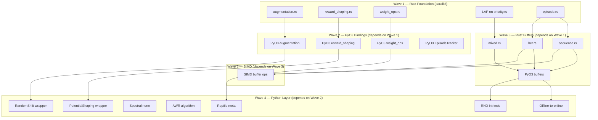
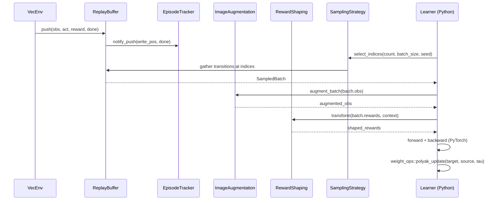
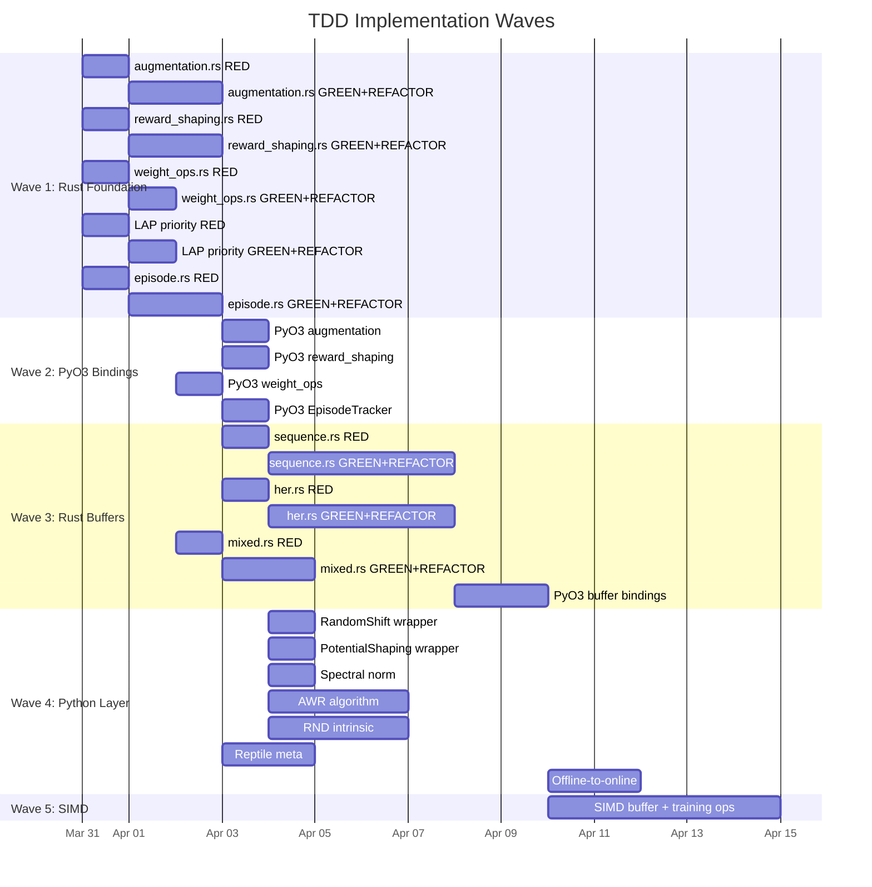

# TDD Implementation Plan: Advanced RL Improvements (Rust-First)

**Date**: 2026-03-29
**Source**: `implementation-strategy-advanced-rl-v2.md`
**Approach**: Red-Green-Refactor per module, traits-first for expandability

---

## Table of Contents

1. [Dependency Graph](#dependency-graph)
2. [Trait Architecture](#trait-architecture)
3. [Wave 1: Rust Foundation](#wave-1-rust-foundation)
4. [Wave 2: PyO3 Bindings](#wave-2-pyo3-bindings)
5. [Wave 3: Rust Buffers](#wave-3-rust-buffers)
6. [Wave 4: Python Layer](#wave-4-python-layer)
7. [Wave 5: SIMD Optimization](#wave-5-simd-optimization)
8. [Summary Tables](#summary-tables)

---

## Dependency Graph



---

## Trait Architecture

### Class Diagram — All New Traits

```mermaid
classDiagram
    class ImageAugmentation {
        <<trait>>
        +augment_batch(images: &[f32], batch_size: usize, channels: usize, height: usize, width: usize, seed: u64) Vec~f32~
        +name() &str
    }

    class RewardTransform {
        <<trait>>
        +transform(rewards: &[f64], context: &RewardContext) Vec~f64~
        +name() &str
    }

    class WeightUpdate {
        <<trait>>
        +apply(target: &mut [f32], source: &[f32], lr: f32)
    }

    class SamplingStrategy {
        <<trait>>
        +select_indices(count: usize, batch_size: usize, seed: u64) Vec~usize~
        +name() &str
    }

    class BufferDecorator {
        <<trait>>
        +on_push(write_pos: usize, record: &TransitionRef)
        +on_sample(indices: &mut Vec~usize~, count: usize, seed: u64)
    }

    class EpisodeAware {
        <<trait>>
        +notify_push(write_pos: usize, done: bool)
        +invalidate_overwritten(write_pos: usize, count: usize)
        +num_complete_episodes() usize
    }

    class GoalRelabeling {
        <<trait>>
        +relabel(episode_transitions: &[usize], original_goal: &[f64], strategy: HERStrategy) Vec~RelabeledGoal~
    }

    class RandomShiftAug {
        +pad: usize
    }

    class BilinearCropAug {
        +crop_h: usize
        +crop_w: usize
    }

    class PBRSTransform {
        +gamma: f64
    }

    class GoalDistanceTransform {
        +scale: f64
        +goal_start: usize
        +goal_dim: usize
    }

    class ReptileUpdate { }
    class PolyakUpdate { }
    class AverageUpdate { }

    class UniformSampling { }
    class PrioritySampling { }
    class MixedSampling {
        +ratio: f64
    }

    class EpisodeTracker { }
    class HERBuffer { }

    ImageAugmentation <|.. RandomShiftAug
    ImageAugmentation <|.. BilinearCropAug
    RewardTransform <|.. PBRSTransform
    RewardTransform <|.. GoalDistanceTransform
    WeightUpdate <|.. ReptileUpdate
    WeightUpdate <|.. PolyakUpdate
    WeightUpdate <|.. AverageUpdate
    SamplingStrategy <|.. UniformSampling
    SamplingStrategy <|.. PrioritySampling
    SamplingStrategy <|.. MixedSampling
    EpisodeAware <|.. EpisodeTracker
    GoalRelabeling <|.. HERBuffer
```



### Data Flow — Training Step with New Modules



---

## Wave 1: Rust Foundation

All five modules can be implemented in parallel. Each follows Red-Green-Refactor.

---

### 1.1 `augmentation.rs`

**File**: `crates/rlox-core/src/training/augmentation.rs`
**Estimated**: ~180 lines impl + ~150 lines tests = ~330 lines total
**Test count**: 10 unit + 4 proptest = 14 tests

#### Trait Definition

```rust
/// Trait for composable image augmentations.
///
/// Implementors transform a flat batch of images `(B, C, H, W)` stored as
/// contiguous f32 arrays. The trait enables adding new augmentations
/// (color jitter, cutout, etc.) without modifying existing code.
pub trait ImageAugmentation: Send + Sync {
    /// Apply the augmentation to a batch of images.
    ///
    /// `images` is a flat array of length `batch_size * channels * height * width`.
    /// Returns a new flat array of the same length.
    fn augment_batch(
        &self,
        images: &[f32],
        batch_size: usize,
        channels: usize,
        height: usize,
        width: usize,
        seed: u64,
    ) -> Result<Vec<f32>, RloxError>;

    /// Human-readable name for logging/debugging.
    fn name(&self) -> &str;
}
```

#### Struct Definitions

```rust
/// DrQ-v2 random shift augmentation.
///
/// Pads the image with zeros, then randomly crops back to original size.
/// Effectively translates the image by up to `pad` pixels in each direction.
pub struct RandomShift {
    pub pad: usize,
}

/// Bilinear interpolation crop augmentation.
pub struct BilinearCrop {
    pub crop_height: usize,
    pub crop_width: usize,
}
```

#### Function Signatures

```rust
/// Random shift: pad image with zeros, then crop a random (H, W) window.
///
/// # Arguments
/// * `images` - flat `(B * C * H * W)` f32 array
/// * `pad` - number of zero-pad pixels on each side
/// * `seed` - ChaCha8 RNG seed for reproducibility
///
/// # Returns
/// New flat array of same length as input.
#[inline]
pub fn random_shift_batch(
    images: &[f32],
    batch_size: usize,
    channels: usize,
    height: usize,
    width: usize,
    pad: usize,
    seed: u64,
) -> Result<Vec<f32>, RloxError>

/// Bilinear interpolation crop.
pub fn random_crop_bilinear(
    images: &[f32],
    batch_size: usize,
    channels: usize,
    height: usize,
    width: usize,
    crop_height: usize,
    crop_width: usize,
    seed: u64,
) -> Result<Vec<f32>, RloxError>
```

#### Algorithm Steps (Green Phase)

```
random_shift_batch:
  1. Validate: images.len() == B * C * H * W
  2. Allocate output: Vec::with_capacity(images.len())
  3. Compute padded dims: pH = H + 2*pad, pW = W + 2*pad
  4. Create ChaCha8Rng from seed
  5. For each image in batch:
     a. Generate random offset: dy in [0, 2*pad], dx in [0, 2*pad]
     b. For each channel:
        For each row y in [0, H):
          For each col x in [0, W):
            src_y = y + dy
            src_x = x + dx
            If src_y in [pad, pad+H) and src_x in [pad, pad+W):
              output[...] = images[... src_y-pad, src_x-pad]
            Else:
              output[...] = 0.0  (zero padding)
  6. Return output
```

#### TDD Test Cases (RED Phase)

| # | Test Name | Type | What It Validates | Input | Expected Output |
|---|-----------|------|-------------------|-------|-----------------|
| 1 | `test_random_shift_preserves_shape` | unit | Output length matches input | B=2, C=3, H=8, W=8, pad=2 | `output.len() == 2*3*8*8 == 384` |
| 2 | `test_random_shift_different_seeds_differ` | unit | Stochastic behavior | Same input, seeds 42 vs 99 | `output_a != output_b` |
| 3 | `test_random_shift_pad_zero_is_identity` | unit | No shift when pad=0 | B=1, C=1, H=4, W=4, pad=0 | `output == input` (exact copy) |
| 4 | `test_random_shift_values_bounded` | unit | Output values within input range | B=1, C=1, H=4, W=4, values in [0.0, 1.0] | All output values in [0.0, 1.0] |
| 5 | `test_random_shift_single_pixel` | unit | Degenerate case: 1x1 image | B=1, C=1, H=1, W=1, pad=1 | `output.len() == 1`, value is 0.0 or input[0] |
| 6 | `test_random_shift_large_pad_mostly_zeros` | unit | Large pad produces many zeros | B=1, C=1, H=2, W=2, pad=10 | Most output values are 0.0 |
| 7 | `test_bilinear_crop_preserves_shape` | unit | Output shape matches crop dims | B=2, C=3, H=84, W=84, crop 68x68 | `output.len() == 2*3*68*68` |
| 8 | `test_bilinear_crop_same_size_no_change` | unit | Crop size == image size | crop_h=H, crop_w=W | Output approximately equals input (rounding) |
| 9 | `test_empty_batch_returns_empty` | unit | Edge case: B=0 | B=0, C=3, H=8, W=8 | `output.len() == 0` |
| 10 | `test_shape_validation_rejects_mismatched_input` | unit | Error on wrong input length | images.len() != B*C*H*W | `Err(RloxError::ShapeMismatch{..})` |
| 11 | `prop_shift_batch_size_preserved` | proptest | Any B,C,H,W produce same-length output | B in 1..8, C in 1..4, H in 2..16, W in 2..16, pad in 0..4 | `output.len() == B*C*H*W` |
| 12 | `prop_shift_deterministic_with_seed` | proptest | Same seed produces same output | Random input, same seed twice | `output_a == output_b` |
| 13 | `prop_shift_values_in_input_range` | proptest | Output values bounded by input min/max | Random values | `output.iter().all(\|v\| v >= min && v <= max)` |
| 14 | `prop_bilinear_output_length` | proptest | Bilinear crop output length correct | Random dims, crop <= dims | `output.len() == B*C*crop_h*crop_w` |

#### Refactor Considerations

- Extract a `pad_image_2d` helper used by both `RandomShift` and potential future augmentations (GaussianNoise, Cutout)
- Consider `rayon::par_chunks_mut` for batch-parallel augmentation when B is large
- The inner loop over (H, W) is a candidate for SIMD in Wave 5

#### Module Integration

Add to `crates/rlox-core/src/training/mod.rs`:
```rust
pub mod augmentation;
```

---

### 1.2 `reward_shaping.rs`

**File**: `crates/rlox-core/src/training/reward_shaping.rs`
**Estimated**: ~140 lines impl + ~120 lines tests = ~260 lines total
**Test count**: 9 unit + 3 proptest = 12 tests

#### Trait Definition

```rust
/// Context passed to reward transforms for access to transition metadata.
pub struct RewardContext<'a> {
    pub dones: &'a [f64],
    pub gamma: f64,
    /// Arbitrary f64 slices keyed by name, for potential values, goal distances, etc.
    pub extras: &'a [(&'a str, &'a [f64])],
}

/// Trait for composable reward transformations.
///
/// Each transform takes raw rewards and a context and produces shaped rewards.
/// Transforms can be chained: `ClipReward -> PBRSTransform -> ScaleReward`.
pub trait RewardTransform: Send + Sync {
    /// Transform a batch of rewards.
    fn transform(
        &self,
        rewards: &[f64],
        context: &RewardContext<'_>,
    ) -> Result<Vec<f64>, RloxError>;

    /// Human-readable name.
    fn name(&self) -> &str;
}
```

#### Function Signatures

```rust
/// Compute shaped rewards: r' = r + gamma * Phi(s') - Phi(s)
///
/// At episode boundaries (dones[i] == 1.0), the potential difference
/// is zeroed out: r'_i = r_i (no shaping across episode boundaries).
///
/// # Arguments
/// * `rewards` - raw rewards, length N
/// * `potentials_current` - Phi(s_t), length N
/// * `potentials_next` - Phi(s_{t+1}), length N
/// * `gamma` - discount factor
/// * `dones` - episode termination flags (1.0 = done), length N
///
/// # Panics (via RloxError)
/// Returns `ShapeMismatch` if slice lengths differ.
pub fn shape_rewards_pbrs(
    rewards: &[f64],
    potentials_current: &[f64],
    potentials_next: &[f64],
    gamma: f64,
    dones: &[f64],
) -> Result<Vec<f64>, RloxError>

/// Goal-distance potential: Phi(s) = -scale * ||s[goal_slice] - goal||_2
///
/// # Arguments
/// * `observations` - flat `(N * obs_dim)` array
/// * `goal` - target goal vector, length `goal_dim`
/// * `obs_dim` - dimensionality of each observation
/// * `goal_start` - starting index within obs where goal-relevant dims begin
/// * `goal_dim` - number of goal-relevant dimensions
/// * `scale` - scaling factor for the potential
pub fn compute_goal_distance_potentials(
    observations: &[f64],
    goal: &[f64],
    obs_dim: usize,
    goal_start: usize,
    goal_dim: usize,
    scale: f64,
) -> Result<Vec<f64>, RloxError>
```

#### Algorithm Steps

```
shape_rewards_pbrs:
  1. Validate: all slices same length
  2. Allocate output: Vec::with_capacity(rewards.len())
  3. For each i in 0..N:
     if dones[i] == 1.0:
       output[i] = rewards[i]  // no carryover at boundary
     else:
       output[i] = rewards[i] + gamma * potentials_next[i] - potentials_current[i]
  4. Return output

compute_goal_distance_potentials:
  1. Validate: observations.len() % obs_dim == 0, goal.len() == goal_dim
  2. N = observations.len() / obs_dim
  3. For each observation:
     a. Extract goal-relevant slice: obs[goal_start..goal_start+goal_dim]
     b. Compute L2 distance to goal
     c. Phi = -scale * distance
  4. Return potentials vector
```

#### TDD Test Cases (RED Phase)

| # | Test Name | Type | What It Validates | Input | Expected Output |
|---|-----------|------|-------------------|-------|-----------------|
| 1 | `test_pbrs_known_values` | unit | Hand-computed PBRS | rewards=[1.0, 2.0], phi=[0.5, 0.3], phi_next=[0.3, 0.8], gamma=0.99, dones=[0.0, 0.0] | `[1.0 + 0.99*0.3 - 0.5, 2.0 + 0.99*0.8 - 0.3]` = `[0.797, 2.492]` |
| 2 | `test_pbrs_done_resets_potential` | unit | No shaping at episode boundary | rewards=[1.0, 2.0], dones=[0.0, 1.0] | `output[1] == 2.0` (raw reward, no shaping) |
| 3 | `test_pbrs_zero_potentials_no_change` | unit | Zero potential = no shaping | phi=phi_next=[0.0; N] | `output == rewards` |
| 4 | `test_pbrs_preserves_optimal_policy` | unit | Sum of shaped rewards = sum(raw) + boundary terms | 10-step episode | `sum(shaped) == sum(raw) + gamma*Phi(s_T) - Phi(s_0)` |
| 5 | `test_pbrs_length_mismatch_errors` | unit | Rejects mismatched lengths | rewards.len=3, phi.len=2 | `Err(ShapeMismatch{..})` |
| 6 | `test_goal_distance_decreasing_near_goal` | unit | Closer obs = less negative potential | obs at dist 1.0 vs 0.1 from goal | `phi_close > phi_far` (less negative) |
| 7 | `test_goal_distance_at_goal_is_zero` | unit | Phi = 0 when obs == goal | obs_goal_slice == goal | `phi == 0.0` |
| 8 | `test_goal_distance_scale_factor` | unit | Scale multiplies potential | scale=2 vs scale=1 | `phi_2x == 2 * phi_1x` |
| 9 | `test_goal_distance_validates_dimensions` | unit | Rejects wrong goal_dim | goal.len() != goal_dim | `Err(ShapeMismatch{..})` |
| 10 | `prop_pbrs_length_matches_input` | proptest | Output length equals input | N in 1..500 | `output.len() == N` |
| 11 | `prop_pbrs_zero_gamma_no_future` | proptest | gamma=0 means only current potential matters | Random input, gamma=0 | `output[i] == rewards[i] - phi_current[i]` |
| 12 | `prop_goal_distance_non_positive` | proptest | Potential always <= 0 (with scale > 0) | Random obs, random goal, scale > 0 | `all potentials <= 0.0` |

#### Refactor Considerations

- `RewardTransform` pipeline: implement `CompositeRewardTransform` that chains multiple transforms
- Add `ClipRewardTransform` and `ScaleRewardTransform` as zero-cost wrappers
- Goal distance computation can be SIMD-accelerated in Wave 5

#### Module Integration

Add to `crates/rlox-core/src/training/mod.rs`:
```rust
pub mod reward_shaping;
```

---

### 1.3 `weight_ops.rs`

**File**: `crates/rlox-core/src/training/weight_ops.rs`
**Estimated**: ~100 lines impl + ~100 lines tests = ~200 lines total
**Test count**: 9 unit + 3 proptest = 12 tests

#### Trait Definition

```rust
/// Trait for weight vector update strategies.
///
/// All operations are in-place on flat f32 weight vectors.
/// This enables adding new meta-learning update rules (MAML outer step,
/// Lookahead, exponential moving average variants) without modifying
/// existing code.
pub trait WeightUpdate: Send + Sync {
    /// Apply the update rule in-place.
    ///
    /// `target` is modified. `source` is read-only. `lr` controls step size.
    ///
    /// # Errors
    /// Returns `ShapeMismatch` if `target.len() != source.len()`.
    fn apply(
        &self,
        target: &mut [f32],
        source: &[f32],
        lr: f32,
    ) -> Result<(), RloxError>;

    /// Human-readable name.
    fn name(&self) -> &str;
}
```

#### Function Signatures

```rust
/// Reptile weight update: params += lr * (task_params - params)
///
/// Operates in-place on `meta_params`. Both slices must have the same length.
/// When `meta_lr == 1.0`, this copies `task_params` into `meta_params`.
/// When `meta_lr == 0.0`, `meta_params` is unchanged.
#[inline]
pub fn reptile_update(
    meta_params: &mut [f32],
    task_params: &[f32],
    meta_lr: f32,
) -> Result<(), RloxError>

/// Average N weight vectors element-wise: result[i] = mean(vectors[j][i] for all j)
///
/// All vectors must have the same length.
pub fn average_weight_vectors(
    vectors: &[&[f32]],
) -> Result<Vec<f32>, RloxError>

/// Exponential moving average (Polyak update):
///   target[i] = tau * source[i] + (1 - tau) * target[i]
///
/// Used by SAC/TD3 for target network updates. Operates in-place on `target`.
#[inline]
pub fn polyak_update(
    target: &mut [f32],
    source: &[f32],
    tau: f32,
) -> Result<(), RloxError>
```

#### TDD Test Cases (RED Phase)

| # | Test Name | Type | What It Validates | Input | Expected Output |
|---|-----------|------|-------------------|-------|-----------------|
| 1 | `test_reptile_update_lr_one_copies` | unit | lr=1.0 sets params to task_params | meta=[1,2,3], task=[4,5,6], lr=1.0 | `meta == [4,5,6]` |
| 2 | `test_reptile_update_lr_zero_no_change` | unit | lr=0 leaves params unchanged | meta=[1,2,3], task=[4,5,6], lr=0.0 | `meta == [1,2,3]` |
| 3 | `test_reptile_update_lr_half` | unit | Correct interpolation | meta=[0,0], task=[2,4], lr=0.5 | `meta == [1,2]` |
| 4 | `test_reptile_length_mismatch` | unit | Error on different lengths | meta.len=3, task.len=2 | `Err(ShapeMismatch{..})` |
| 5 | `test_average_weight_vectors_mean` | unit | Mean of two vectors | [[1,2,3], [4,5,6]] | `[2.5, 3.5, 4.5]` |
| 6 | `test_average_single_vector` | unit | Mean of one vector = itself | [[7,8,9]] | `[7,8,9]` |
| 7 | `test_average_empty_errors` | unit | Empty vector list | [] | `Err(BufferError{..})` |
| 8 | `test_polyak_update_tau_one_copies` | unit | tau=1 copies source | target=[1,2], source=[3,4], tau=1.0 | `target == [3,4]` |
| 9 | `test_polyak_update_tau_zero_no_change` | unit | tau=0 leaves target unchanged | target=[1,2], source=[3,4], tau=0.0 | `target == [1,2]` |
| 10 | `prop_reptile_interpolates` | proptest | Result between meta and task | Random vecs, lr in 0..1 | `for all i: min(meta[i], task[i]) <= result[i] <= max(meta[i], task[i])` |
| 11 | `prop_polyak_interpolates` | proptest | Result between target and source | Random vecs, tau in 0..1 | Same as above |
| 12 | `prop_average_idempotent` | proptest | Averaging N copies of same vec = that vec | Random vec, N in 1..10 | `result == input` |

#### Refactor Considerations

- All three functions have the same `target[i] = a * source[i] + b * target[i]` pattern -- extract a `linear_combine_inplace` core
- This core function is the SIMD target for Wave 5
- Consider adding `weighted_average` for future FedAvg support

#### Module Integration

Add to `crates/rlox-core/src/training/mod.rs`:
```rust
pub mod weight_ops;
```

---

### 1.4 LAP on `priority.rs`

**File**: `crates/rlox-core/src/buffer/priority.rs` (extend existing)
**Estimated**: ~60 lines added impl + ~80 lines tests = ~140 lines total
**Test count**: 8 unit + 2 proptest = 10 tests

#### New Struct / Extension

```rust
/// Loss-Adjusted Prioritization (LAP) priority computation.
///
/// LAP uses `priority = |TD_error| + eta * loss` where `eta` is a
/// configurable scale factor. This provides better prioritization
/// for actor-critic methods where TD error alone is insufficient.
///
/// Reference: Schaul et al. (2015) extended with Fujimoto et al. (2020) LAP.
pub struct LAPConfig {
    /// Scale factor for the loss component. Default: 1.0.
    pub eta: f64,
    /// Minimum priority to avoid zero-probability sampling. Default: 1e-6.
    pub min_priority: f64,
}

impl Default for LAPConfig {
    fn default() -> Self {
        Self {
            eta: 1.0,
            min_priority: 1e-6,
        }
    }
}

/// Compute LAP priorities from TD errors and losses.
///
/// priority[i] = max(|td_errors[i]| + eta * losses[i], min_priority)
pub fn compute_lap_priorities(
    td_errors: &[f64],
    losses: &[f64],
    config: &LAPConfig,
) -> Result<Vec<f64>, RloxError>

/// Convenience: compute priorities from TD errors only (standard PER).
///
/// priority[i] = max(|td_errors[i]|, min_priority)
pub fn compute_td_priorities(
    td_errors: &[f64],
    min_priority: f64,
) -> Vec<f64>
```

#### TDD Test Cases (RED Phase)

| # | Test Name | Type | What It Validates | Input | Expected Output |
|---|-----------|------|-------------------|-------|-----------------|
| 1 | `test_lap_known_values` | unit | Hand-computed priorities | td=[1.0, -2.0], loss=[0.5, 0.3], eta=1.0 | `[1.5, 2.3]` |
| 2 | `test_lap_eta_zero_is_standard_per` | unit | eta=0 reduces to |TD| | td=[1.0, -2.0], loss=[999], eta=0 | `[1.0, 2.0]` |
| 3 | `test_lap_min_priority_floor` | unit | Never below min_priority | td=[0.0], loss=[0.0], min=1e-6 | `[1e-6]` |
| 4 | `test_lap_negative_td_uses_abs` | unit | Absolute value of TD | td=[-3.0], loss=[0.0] | `[3.0]` |
| 5 | `test_lap_length_mismatch` | unit | Error on mismatched lengths | td.len=3, loss.len=2 | `Err(ShapeMismatch{..})` |
| 6 | `test_td_priorities_known_values` | unit | Standard PER priorities | td=[0.5, -1.0, 0.0], min=0.01 | `[0.5, 1.0, 0.01]` |
| 7 | `test_lap_integration_with_per_buffer` | unit | Push LAP priorities into PER buffer | Push 10 records with LAP priorities | Sample produces valid batch |
| 8 | `test_lap_large_eta_emphasizes_loss` | unit | Large eta makes loss dominate | td=[0.01], loss=[10.0], eta=100.0 | `[0.01 + 1000.0]` |
| 9 | `prop_lap_priorities_non_negative` | proptest | All priorities >= min_priority | Random td, loss | `all >= min_priority` |
| 10 | `prop_lap_monotone_in_td` | proptest | Higher |TD| means higher priority | Two inputs differing only in td[0] | If |td_a| > |td_b| then priority_a > priority_b |

---

### 1.5 `episode.rs`

**File**: `crates/rlox-core/src/buffer/episode.rs`
**Estimated**: ~220 lines impl + ~200 lines tests = ~420 lines total
**Test count**: 12 unit + 4 proptest = 16 tests

#### Trait Definition

```rust
/// Trait for episode-aware buffer components.
///
/// Anything that needs to track episode boundaries in a ring buffer
/// implements this trait. Used by SequenceReplayBuffer and HERBuffer.
pub trait EpisodeAware {
    /// Notify that a transition was pushed at `write_pos` with `done` flag.
    fn notify_push(&mut self, write_pos: usize, done: bool);

    /// Invalidate any episodes that overlap with the overwritten region.
    fn invalidate_overwritten(&mut self, write_pos: usize, count: usize);

    /// Number of complete (terminated/truncated) episodes currently tracked.
    fn num_complete_episodes(&self) -> usize;
}
```

#### Struct Definitions

```rust
/// Metadata for a single episode within the ring buffer.
#[derive(Debug, Clone, Copy)]
pub struct EpisodeMeta {
    /// Starting position in the ring buffer.
    pub start: usize,
    /// Number of transitions in this episode.
    pub length: usize,
    /// Whether this episode is complete (reached done=true).
    pub complete: bool,
}

/// A contiguous window of transitions within an episode,
/// suitable for sequence sampling.
#[derive(Debug, Clone, Copy)]
pub struct EpisodeWindow {
    /// Index of the episode this window belongs to.
    pub episode_idx: usize,
    /// Starting position in the ring buffer.
    pub ring_start: usize,
    /// Number of transitions in this window.
    pub length: usize,
}

/// Tracks episode boundaries within a ring buffer.
///
/// Maintains a list of `EpisodeMeta` entries, invalidating episodes
/// whose data has been overwritten by the ring buffer's write pointer.
/// Provides efficient sampling of contiguous windows for sequence models.
pub struct EpisodeTracker {
    ring_capacity: usize,
    episodes: Vec<EpisodeMeta>,
    /// Index of the episode currently being built (not yet complete).
    current_episode_start: Option<usize>,
    current_episode_length: usize,
}
```

#### Function Signatures

```rust
impl EpisodeTracker {
    pub fn new(ring_capacity: usize) -> Self;

    /// Record a push at `write_pos`. If `done`, the current episode is finalized.
    pub fn notify_push(&mut self, write_pos: usize, done: bool);

    /// Remove any episodes whose transitions have been overwritten.
    ///
    /// Called when the ring buffer wraps. `write_pos` is the position
    /// about to be overwritten, `count` is how many slots are being written.
    pub fn invalidate_overwritten(&mut self, write_pos: usize, count: usize);

    /// Sample `batch_size` windows of `seq_len` consecutive transitions,
    /// each entirely within a single complete episode.
    ///
    /// Uses ChaCha8Rng seeded with `seed`.
    ///
    /// # Errors
    /// Returns `BufferError` if no episodes are long enough for `seq_len`.
    pub fn sample_windows(
        &self,
        batch_size: usize,
        seq_len: usize,
        seed: u64,
    ) -> Result<Vec<EpisodeWindow>, RloxError>;

    /// Number of complete episodes currently tracked.
    pub fn num_complete_episodes(&self) -> usize;

    /// All currently tracked episodes (complete and in-progress).
    pub fn episodes(&self) -> &[EpisodeMeta];

    /// Episodes long enough for a given sequence length.
    pub fn eligible_episodes(&self, min_length: usize) -> Vec<usize>;
}
```

#### TDD Test Cases (RED Phase)

| # | Test Name | Type | What It Validates | Input | Expected Output |
|---|-----------|------|-------------------|-------|-----------------|
| 1 | `test_new_tracker_is_empty` | unit | Initial state | `new(100)` | `num_complete_episodes() == 0` |
| 2 | `test_single_episode_tracked` | unit | One complete episode | Push 5 transitions, last done=true | `num_complete_episodes() == 1`, episode.length=5 |
| 3 | `test_multiple_episodes` | unit | Track 3 episodes | Push 3 episodes of length 3,5,2 | `num_complete_episodes() == 3` |
| 4 | `test_incomplete_episode_not_counted` | unit | In-progress episode excluded | Push 5 transitions, no done | `num_complete_episodes() == 0` |
| 5 | `test_invalidate_removes_overwritten` | unit | Ring wrap invalidates old episodes | Push 150 into cap=100, first episodes overwritten | Old episodes removed |
| 6 | `test_sample_windows_within_episode` | unit | Windows don't cross episodes | 2 episodes of len 10, sample seq_len=5 | All windows have length 5, within single episode |
| 7 | `test_sample_windows_deterministic` | unit | Same seed = same windows | Two calls with seed=42 | Identical results |
| 8 | `test_sample_windows_rejects_too_long_seq` | unit | Error when no eligible episodes | All episodes len<seq_len | `Err(BufferError{..})` |
| 9 | `test_eligible_episodes_filters_short` | unit | Only long-enough episodes eligible | eps of len [2,5,3,8], min=4 | Indices [1, 3] |
| 10 | `test_invalidate_partial_episode` | unit | Episode partially overwritten | Episode at start of ring, ring wraps mid-episode | Episode removed entirely |
| 11 | `test_window_ring_wrap` | unit | Episode spanning ring boundary | Episode starts near end of ring, wraps | Window handles wrap correctly |
| 12 | `test_consecutive_dones` | unit | Two done=true in a row | Push with done, then another with done | Two episodes: second has length 1 |
| 13 | `prop_episode_count_matches_dones` | proptest | #complete_episodes == #done_flags (before invalidation) | Random sequence of pushes with dones | Count matches |
| 14 | `prop_window_within_bounds` | proptest | All windows within ring_capacity | Random episodes, sample windows | `ring_start + length <= ring_capacity` (or wraps correctly) |
| 15 | `prop_no_cross_episode_windows` | proptest | Each window from single episode | Sample many windows | Each window's start..end within one episode |
| 16 | `prop_invalidation_never_returns_overwritten` | proptest | After invalidation, no stale data | Random pushes exceeding capacity | All episode starts are valid |

#### Refactor Considerations

- `episodes` Vec will grow unbounded -- consider a `VecDeque` that drops from front when invalidated
- The `eligible_episodes` scan is O(num_episodes) -- for high throughput, maintain a sorted index by length
- Factor out ring-buffer arithmetic (`wrapping_range_overlaps`) into a utility module

#### Module Integration

Add to `crates/rlox-core/src/buffer/mod.rs`:
```rust
pub mod episode;
```

---

## Wave 2: PyO3 Bindings

All four binding modules can be implemented in parallel once their Rust modules exist.

### Binding Pattern (shared across all modules)

Following the existing pattern in `crates/rlox-python/src/training.rs`:

```rust
// Pattern: PyO3 function binding
#[pyfunction]
#[pyo3(signature = (param1, param2, ...))]
pub fn rust_function_name<'py>(
    py: Python<'py>,
    param1: PyReadonlyArray1<'py, f32>,  // numpy input
    param2: f64,                          // scalar
) -> PyResult<Bound<'py, PyArray1<f32>>> {
    let owned = param1.as_slice()?.to_vec();
    let result = py.allow_threads(|| {
        rlox_core::module::function(&owned, param2)
    }).map_err(|e| PyRuntimeError::new_err(e.to_string()))?;
    Ok(PyArray1::from_vec(py, result))
}

// Pattern: PyO3 class binding
#[pyclass(name = "RustStruct")]
pub struct PyRustStruct {
    inner: rlox_core::module::RustStruct,
}

#[pymethods]
impl PyRustStruct {
    #[new]
    fn new(args...) -> Self { ... }
    fn method(&self, ...) -> PyResult<...> { ... }
}
```

---

### 2.1 PyO3 Augmentation

**File**: `crates/rlox-python/src/training.rs` (extend)
**Estimated**: ~40 lines added

#### Binding Signatures

```rust
/// Apply random shift augmentation to a batch of images (DrQ-v2).
///
/// Args:
///     images: flat f32 numpy array of shape (B * C * H * W,)
///     batch_size: number of images
///     channels: number of channels
///     height: image height
///     width: image width
///     pad: padding size (pixels)
///     seed: RNG seed
///
/// Returns:
///     Augmented images as flat f32 numpy array, same shape as input.
#[pyfunction]
#[pyo3(signature = (images, batch_size, channels, height, width, pad, seed))]
pub fn random_shift_batch<'py>(
    py: Python<'py>,
    images: PyReadonlyArray1<'py, f32>,
    batch_size: usize,
    channels: usize,
    height: usize,
    width: usize,
    pad: usize,
    seed: u64,
) -> PyResult<Bound<'py, PyArray1<f32>>>
```

#### Registration

Add to `crates/rlox-python/src/lib.rs`:
```rust
m.add_function(wrap_pyfunction!(training::random_shift_batch, m)?)?;
```

#### Python Test Cases (Wave 2)

| # | Test Name | What It Validates |
|---|-----------|-------------------|
| 1 | `test_random_shift_numpy_roundtrip` | numpy f32 in, numpy f32 out, shape preserved |
| 2 | `test_random_shift_dtype_validation` | Rejects f64 input with clear error |
| 3 | `test_random_shift_deterministic_from_python` | Same seed, same output from Python |

---

### 2.2 PyO3 Reward Shaping

**File**: `crates/rlox-python/src/training.rs` (extend)
**Estimated**: ~50 lines added

#### Binding Signatures

```rust
#[pyfunction]
#[pyo3(signature = (rewards, potentials_current, potentials_next, gamma, dones))]
pub fn shape_rewards_pbrs<'py>(
    py: Python<'py>,
    rewards: PyReadonlyArray1<'py, f64>,
    potentials_current: PyReadonlyArray1<'py, f64>,
    potentials_next: PyReadonlyArray1<'py, f64>,
    gamma: f64,
    dones: PyReadonlyArray1<'py, f64>,
) -> PyResult<Bound<'py, PyArray1<f64>>>

#[pyfunction]
#[pyo3(signature = (observations, goal, obs_dim, goal_start, goal_dim, scale))]
pub fn compute_goal_distance_potentials<'py>(
    py: Python<'py>,
    observations: PyReadonlyArray1<'py, f64>,
    goal: PyReadonlyArray1<'py, f64>,
    obs_dim: usize,
    goal_start: usize,
    goal_dim: usize,
    scale: f64,
) -> PyResult<Bound<'py, PyArray1<f64>>>
```

#### Python Test Cases (Wave 2)

| # | Test Name | What It Validates |
|---|-----------|-------------------|
| 1 | `test_pbrs_matches_hand_computation` | Same result as manual NumPy calculation |
| 2 | `test_goal_distance_numpy_roundtrip` | Correct shapes and values |
| 3 | `test_pbrs_error_propagates_as_python_exception` | RloxError becomes RuntimeError |

---

### 2.3 PyO3 Weight Ops

**File**: `crates/rlox-python/src/training.rs` (extend)
**Estimated**: ~60 lines added

#### Binding Signatures

```rust
/// Reptile weight update: meta_params += lr * (task_params - meta_params).
/// Modifies meta_params in-place.
#[pyfunction]
#[pyo3(signature = (meta_params, task_params, meta_lr))]
pub fn reptile_update<'py>(
    py: Python<'py>,
    meta_params: &Bound<'py, PyArray1<f32>>,
    task_params: PyReadonlyArray1<'py, f32>,
    meta_lr: f32,
) -> PyResult<()>

/// Polyak (EMA) update: target = tau * source + (1-tau) * target.
/// Modifies target in-place.
#[pyfunction]
#[pyo3(signature = (target, source, tau))]
pub fn polyak_update<'py>(
    py: Python<'py>,
    target: &Bound<'py, PyArray1<f32>>,
    source: PyReadonlyArray1<'py, f32>,
    tau: f32,
) -> PyResult<()>

/// Average weight vectors. Returns a new numpy array.
#[pyfunction]
#[pyo3(signature = (vectors))]
pub fn average_weight_vectors<'py>(
    py: Python<'py>,
    vectors: Vec<PyReadonlyArray1<'py, f32>>,
) -> PyResult<Bound<'py, PyArray1<f32>>>
```

**Note on in-place operations**: `reptile_update` and `polyak_update` modify numpy arrays in-place using `PyArray1::readwrite()` to avoid allocating new arrays. This is important for large weight vectors (millions of parameters).

#### Python Test Cases (Wave 2)

| # | Test Name | What It Validates |
|---|-----------|-------------------|
| 1 | `test_reptile_update_inplace` | Modifies numpy array in place |
| 2 | `test_polyak_update_inplace` | Modifies numpy array in place |
| 3 | `test_average_vectors_from_python` | Correct mean from list of arrays |
| 4 | `test_weight_ops_large_vectors` | Works with 1M+ element vectors |

---

### 2.4 PyO3 EpisodeTracker

**File**: `crates/rlox-python/src/buffer.rs` (extend)
**Estimated**: ~80 lines added

#### Binding

```rust
#[pyclass(name = "EpisodeTracker")]
pub struct PyEpisodeTracker {
    inner: rlox_core::buffer::episode::EpisodeTracker,
}

#[pymethods]
impl PyEpisodeTracker {
    #[new]
    fn new(ring_capacity: usize) -> Self;

    fn notify_push(&mut self, write_pos: usize, done: bool);
    fn invalidate_overwritten(&mut self, write_pos: usize, count: usize);
    fn num_complete_episodes(&self) -> usize;

    fn sample_windows(
        &self,
        batch_size: usize,
        seq_len: usize,
        seed: u64,
    ) -> PyResult<Vec<(usize, usize, usize)>>;  // (episode_idx, ring_start, length)
}
```

#### Registration

Add to `crates/rlox-python/src/lib.rs`:
```rust
m.add_class::<buffer::PyEpisodeTracker>()?;
```

#### Python Test Cases (Wave 2)

| # | Test Name | What It Validates |
|---|-----------|-------------------|
| 1 | `test_episode_tracker_from_python` | Basic push/count from Python |
| 2 | `test_sample_windows_from_python` | Returns list of tuples |
| 3 | `test_episode_tracker_error_handling` | Error when no eligible episodes |

---

## Wave 3: Rust Buffers

Depends on Wave 1 (specifically `episode.rs`). The three buffer modules can be implemented in parallel.

---

### 3.1 `sequence.rs`

**File**: `crates/rlox-core/src/buffer/sequence.rs`
**Estimated**: ~280 lines impl + ~250 lines tests = ~530 lines total
**Test count**: 15 unit + 4 proptest = 19 tests

#### Struct Definition

```rust
/// Replay buffer that samples contiguous sequences of transitions.
///
/// Wraps a `ReplayBuffer` for storage and an `EpisodeTracker` for
/// episode-aware sequence sampling. Sequences never cross episode
/// boundaries.
///
/// Used by DreamerV3, R2D2, and other sequence-based algorithms.
pub struct SequenceReplayBuffer {
    buffer: ReplayBuffer,
    tracker: EpisodeTracker,
    obs_dim: usize,
    act_dim: usize,
    capacity: usize,
}

/// A batch of sampled sequences.
pub struct SequenceBatch {
    /// Observations: flat `(batch_size * seq_len * obs_dim)`.
    pub observations: Vec<f32>,
    /// Actions: flat `(batch_size * seq_len * act_dim)`.
    pub actions: Vec<f32>,
    /// Rewards: flat `(batch_size * seq_len)`.
    pub rewards: Vec<f32>,
    /// Terminated flags: flat `(batch_size * seq_len)`.
    pub terminated: Vec<bool>,
    /// Truncated flags: flat `(batch_size * seq_len)`.
    pub truncated: Vec<bool>,
    pub obs_dim: usize,
    pub act_dim: usize,
    pub batch_size: usize,
    pub seq_len: usize,
}
```

#### Function Signatures

```rust
impl SequenceReplayBuffer {
    pub fn new(capacity: usize, obs_dim: usize, act_dim: usize) -> Self;

    /// Push a single transition.
    pub fn push_slices(
        &mut self,
        obs: &[f32],
        next_obs: &[f32],
        action: &[f32],
        reward: f32,
        terminated: bool,
        truncated: bool,
    ) -> Result<(), RloxError>;

    /// Sample `batch_size` sequences of `seq_len` consecutive transitions.
    ///
    /// Each sequence is guaranteed to be within a single episode.
    pub fn sample_sequences(
        &self,
        batch_size: usize,
        seq_len: usize,
        seed: u64,
    ) -> Result<SequenceBatch, RloxError>;

    pub fn len(&self) -> usize;
    pub fn is_empty(&self) -> bool;
    pub fn num_complete_episodes(&self) -> usize;
}
```

#### TDD Test Cases (RED Phase)

| # | Test Name | Type | What It Validates | Input | Expected Output |
|---|-----------|------|-------------------|-------|-----------------|
| 1 | `test_new_is_empty` | unit | Initial state | `new(100, 4, 1)` | `len() == 0` |
| 2 | `test_push_increments_len` | unit | Basic push | Push 5 transitions | `len() == 5` |
| 3 | `test_single_episode_sequence_sample` | unit | Sample from one episode | 10-step episode, sample seq_len=3 | Batch of 3 contiguous transitions |
| 4 | `test_sequences_dont_cross_episodes` | unit | Episode boundary respected | 2 episodes of len 5, seq_len=4 | No sequence spans both episodes |
| 5 | `test_sequence_contiguity` | unit | Transitions are contiguous | Sample seq_len=5 | `obs[i+1] == next_obs[i]` within sequence |
| 6 | `test_sequence_deterministic` | unit | Same seed = same sequences | Two samples with seed=42 | Identical batches |
| 7 | `test_reject_too_long_sequence` | unit | Error when seq_len > all episodes | All episodes len<5, seq_len=5 | `Err(BufferError{..})` |
| 8 | `test_capacity_respected` | unit | Ring buffer wrap | Push 200 into cap=100 | `len() == 100` |
| 9 | `test_episode_invalidation_on_wrap` | unit | Old episodes removed on wrap | Fill past capacity | Old episodes not sampled |
| 10 | `test_batch_shape_correct` | unit | Output dimensions | B=4, seq_len=3, obs_dim=8, act_dim=2 | obs.len=4\*3\*8, act.len=4\*3\*2 |
| 11 | `test_empty_buffer_sample_errors` | unit | Error on empty buffer | No pushes, sample | `Err(BufferError{..})` |
| 12 | `test_push_slices_validates_dims` | unit | Shape validation | Wrong obs_dim | `Err(ShapeMismatch{..})` |
| 13 | `test_multiple_episodes_mixed_lengths` | unit | Various episode lengths | Eps of len [3,7,2,10] | Only eps with len>=seq_len sampled |
| 14 | `test_sequence_rewards_match_buffer` | unit | Data integrity | Known rewards, sample | Reward values match pushed data |
| 15 | `test_is_send_sync` | unit | Thread safety | - | Compile-time check |
| 16 | `prop_sequence_within_episode` | proptest | All sequences within single episode | Random pushes, random sample | Each sequence's positions in one episode |
| 17 | `prop_batch_size_matches_request` | proptest | Correct batch size | Random params | `batch.batch_size == requested` |
| 18 | `prop_len_never_exceeds_capacity` | proptest | Ring buffer invariant | Random pushes | `len() <= capacity` |
| 19 | `prop_sequence_obs_contiguous` | proptest | `next_obs[t] == obs[t+1]` within seq | Random data | Contiguity holds |

---

### 3.2 `her.rs`

**File**: `crates/rlox-core/src/buffer/her.rs`
**Estimated**: ~230 lines impl + ~200 lines tests = ~430 lines total
**Test count**: 13 unit + 3 proptest = 16 tests

#### Struct Definitions

```rust
/// HER goal relabeling strategy.
#[derive(Debug, Clone, Copy)]
pub enum HERStrategy {
    /// Replace goal with the final state achieved in the episode.
    Final,
    /// Replace goal with a future state sampled uniformly from the remainder of the episode.
    Future {
        /// Number of relabeled goals per transition. Default: 4.
        k: usize,
    },
    /// Replace goal with a random state from the episode.
    Episode,
}

impl Default for HERStrategy {
    fn default() -> Self {
        HERStrategy::Future { k: 4 }
    }
}

/// A relabeled transition with new goal and recomputed reward.
#[derive(Debug, Clone)]
pub struct RelabeledTransition {
    /// Index of the original transition in the buffer.
    pub original_idx: usize,
    /// New goal to substitute.
    pub new_goal: Vec<f32>,
    /// Recomputed reward (typically sparse: 0 if achieved, -1 otherwise).
    pub new_reward: f32,
}

/// Hindsight Experience Replay buffer.
///
/// Stores transitions with goal information and performs goal relabeling
/// during sampling. The relabeling index computation is done in Rust;
/// the actual reward recomputation uses a configurable reward function.
pub struct HERBuffer {
    buffer: ReplayBuffer,
    tracker: EpisodeTracker,
    obs_dim: usize,
    act_dim: usize,
    goal_dim: usize,
    /// Where the achieved-goal starts within the observation vector.
    achieved_goal_start: usize,
    /// Where the desired-goal starts within the observation vector.
    desired_goal_start: usize,
    capacity: usize,
    strategy: HERStrategy,
    /// Goal achievement tolerance for sparse reward computation.
    goal_tolerance: f32,
}
```

#### Function Signatures

```rust
impl HERBuffer {
    pub fn new(
        capacity: usize,
        obs_dim: usize,
        act_dim: usize,
        goal_dim: usize,
        achieved_goal_start: usize,
        desired_goal_start: usize,
        strategy: HERStrategy,
        goal_tolerance: f32,
    ) -> Self;

    pub fn push_slices(
        &mut self,
        obs: &[f32],
        next_obs: &[f32],
        action: &[f32],
        reward: f32,
        terminated: bool,
        truncated: bool,
    ) -> Result<(), RloxError>;

    /// Sample a batch with HER relabeling.
    ///
    /// Returns both original and relabeled transitions.
    /// `her_ratio` controls the fraction of relabeled samples (typically 0.8).
    pub fn sample_with_relabeling(
        &self,
        batch_size: usize,
        her_ratio: f32,
        seed: u64,
    ) -> Result<SampledBatch, RloxError>;

    /// Compute relabeling indices for a given episode.
    ///
    /// Returns the indices within the episode that should be used as
    /// substitute goals, based on the configured strategy.
    pub fn compute_relabel_indices(
        &self,
        episode: &EpisodeMeta,
        transition_idx: usize,
        seed: u64,
    ) -> Vec<usize>;

    pub fn len(&self) -> usize;
    pub fn is_empty(&self) -> bool;
}

/// Compute sparse goal-conditioned reward.
///
/// Returns 0.0 if ||achieved - desired||_2 < tolerance, else -1.0.
#[inline]
pub fn sparse_goal_reward(
    achieved: &[f32],
    desired: &[f32],
    tolerance: f32,
) -> f32
```

#### TDD Test Cases (RED Phase)

| # | Test Name | Type | What It Validates | Input | Expected Output |
|---|-----------|------|-------------------|-------|-----------------|
| 1 | `test_her_new_is_empty` | unit | Initial state | `new(100, 10, 2, 3, ...)` | `len() == 0` |
| 2 | `test_her_push_increments` | unit | Basic push | Push 5 | `len() == 5` |
| 3 | `test_final_strategy_uses_last_state` | unit | Final strategy picks episode-end goal | 5-step episode | Relabeled goal == achieved_goal of last step |
| 4 | `test_future_strategy_picks_future_state` | unit | Future strategy picks from remainder | transition at t=2, episode len=5 | Goal from t in {3, 4} |
| 5 | `test_episode_strategy_picks_any_state` | unit | Episode strategy picks any state | 10-step episode | Goal from any t in [0, 9] |
| 6 | `test_her_ratio_controls_relabeling_fraction` | unit | ~80% relabeled with ratio=0.8 | B=100, ratio=0.8 | ~80 transitions have modified goals |
| 7 | `test_sparse_goal_reward_achieved` | unit | Reward = 0 when achieved | `\|\|a-d\|\| < tol` | `0.0` |
| 8 | `test_sparse_goal_reward_not_achieved` | unit | Reward = -1 when not achieved | `\|\|a-d\|\| > tol` | `-1.0` |
| 9 | `test_relabel_indices_future_k4` | unit | k=4 produces 4 indices per transition | k=4, episode len 10, transition at t=3 | 4 indices all in [4, 9] |
| 10 | `test_relabel_indices_deterministic` | unit | Same seed = same indices | Two calls with seed=42 | Identical |
| 11 | `test_her_with_ring_wrap` | unit | Works after ring buffer wraps | Push 200 into cap=100 | Valid samples, no stale goals |
| 12 | `test_her_validates_goal_dimensions` | unit | Rejects wrong goal_dim obs | obs with wrong achieved_goal slice | Error or panic |
| 13 | `test_her_sample_batch_shape` | unit | Output dimensions correct | B=8, obs_dim=10, act_dim=2 | Correct batch shapes |
| 14 | `prop_relabel_indices_in_range` | proptest | All indices within episode | Random episodes | All indices < episode.length |
| 15 | `prop_future_indices_strictly_future` | proptest | Future strategy indices > current | transition_idx, episode | All relabel indices > transition_idx |
| 16 | `prop_sparse_reward_binary` | proptest | Reward is 0.0 or -1.0 | Random achieved/desired | `result == 0.0 \|\| result == -1.0` |

---

### 3.3 `mixed.rs`

**File**: `crates/rlox-core/src/buffer/mixed.rs`
**Estimated**: ~100 lines impl + ~100 lines tests = ~200 lines total
**Test count**: 8 unit + 2 proptest = 10 tests

#### Trait Usage

```rust
/// Sampling strategy trait for extensible buffer sampling.
pub trait SamplingStrategy: Send + Sync {
    /// Select indices to sample from a buffer of `count` transitions.
    fn select_indices(
        &self,
        count: usize,
        batch_size: usize,
        seed: u64,
    ) -> Vec<usize>;

    fn name(&self) -> &str;
}

/// Uniform random sampling (default).
pub struct UniformSampling;

/// Mixed sampling from two index ranges.
///
/// Used for offline-to-online fine-tuning: sample `ratio` fraction from
/// range A (offline) and `1-ratio` from range B (online).
pub struct MixedSampling {
    pub ratio: f64,
}
```

#### Function Signatures

```rust
/// Sample a mixed batch from two buffers.
///
/// Draws `ceil(batch_size * ratio)` from `buffer_a` and the remainder from
/// `buffer_b`. Returns a merged `SampledBatch`.
///
/// # Arguments
/// * `buffer_a` - first buffer (e.g., offline dataset)
/// * `buffer_b` - second buffer (e.g., online replay)
/// * `ratio` - fraction of samples from buffer_a (0.0 to 1.0)
/// * `batch_size` - total number of transitions to sample
/// * `seed` - RNG seed
pub fn sample_mixed(
    buffer_a: &ReplayBuffer,
    buffer_b: &ReplayBuffer,
    ratio: f64,
    batch_size: usize,
    seed: u64,
) -> Result<SampledBatch, RloxError>

/// Sample mixed from a PER buffer and a uniform buffer.
pub fn sample_mixed_per_uniform(
    per_buffer: &PrioritizedReplayBuffer,
    uniform_buffer: &ReplayBuffer,
    ratio: f64,
    batch_size: usize,
    seed: u64,
) -> Result<SampledBatch, RloxError>
```

#### TDD Test Cases (RED Phase)

| # | Test Name | Type | What It Validates | Input | Expected Output |
|---|-----------|------|-------------------|-------|-----------------|
| 1 | `test_mixed_ratio_one_all_from_a` | unit | ratio=1.0 samples only from A | ratio=1.0, B=32 | All from buffer_a |
| 2 | `test_mixed_ratio_zero_all_from_b` | unit | ratio=0.0 samples only from B | ratio=0.0, B=32 | All from buffer_b |
| 3 | `test_mixed_ratio_half` | unit | ~50/50 split | ratio=0.5, B=32 | 16 from A, 16 from B |
| 4 | `test_mixed_deterministic` | unit | Same seed = same batch | Two calls, seed=42 | Identical |
| 5 | `test_mixed_batch_shape` | unit | Correct output dimensions | obs_dim=4, act_dim=1, B=32 | Correct shapes |
| 6 | `test_mixed_empty_buffer_errors` | unit | Error when a buffer is empty | buffer_a empty | `Err(BufferError{..})` |
| 7 | `test_mixed_different_obs_dim_errors` | unit | Dimension mismatch | buffer_a obs_dim=4, buffer_b obs_dim=8 | `Err(ShapeMismatch{..})` |
| 8 | `test_mixed_validates_ratio_range` | unit | Rejects ratio outside [0, 1] | ratio=1.5 | `Err(BufferError{..})` |
| 9 | `prop_mixed_batch_size_correct` | proptest | Total samples = batch_size | Random params | `batch.batch_size == batch_size` |
| 10 | `prop_mixed_ratio_approximately_correct` | proptest | Ratio approximately met | Random ratio, large batch | Actual ratio within 1/batch_size of target |

---

### 3.4 PyO3 Buffer Bindings

**File**: `crates/rlox-python/src/buffer.rs` (extend)
**Estimated**: ~200 lines added

Add `PySequenceReplayBuffer`, `PyHERBuffer`, and `sample_mixed` function.

```rust
#[pyclass(name = "SequenceReplayBuffer")]
pub struct PySequenceReplayBuffer {
    inner: rlox_core::buffer::sequence::SequenceReplayBuffer,
}

#[pymethods]
impl PySequenceReplayBuffer {
    #[new]
    fn new(capacity: usize, obs_dim: usize, act_dim: usize) -> Self;
    fn push(...) -> PyResult<()>;
    fn sample_sequences<'py>(...) -> PyResult<Bound<'py, PyDict>>;
    fn __len__(&self) -> usize;
    fn num_complete_episodes(&self) -> usize;
}

#[pyclass(name = "HERBuffer")]
pub struct PyHERBuffer {
    inner: rlox_core::buffer::her::HERBuffer,
}

#[pymethods]
impl PyHERBuffer {
    #[new]
    #[pyo3(signature = (capacity, obs_dim, act_dim, goal_dim, achieved_goal_start, desired_goal_start, strategy="future", k=4, goal_tolerance=0.05))]
    fn new(...) -> PyResult<Self>;
    fn push(...) -> PyResult<()>;
    fn sample<'py>(...) -> PyResult<Bound<'py, PyDict>>;
    fn __len__(&self) -> usize;
}

#[pyfunction]
#[pyo3(signature = (buffer_a, buffer_b, ratio, batch_size, seed))]
pub fn sample_mixed<'py>(...) -> PyResult<Bound<'py, PyDict>>
```

#### Registration

```rust
m.add_class::<buffer::PySequenceReplayBuffer>()?;
m.add_class::<buffer::PyHERBuffer>()?;
m.add_function(wrap_pyfunction!(buffer::sample_mixed, m)?)?;
```

---

## Wave 4: Python Layer

These are Python wrappers and algorithms. They depend on Wave 2 (PyO3 bindings).

---

### 4.1 `python/rlox/augmentation.py` (~40 lines)

```python
class RandomShift:
    """DrQ-v2 random shift augmentation backed by Rust.

    Wraps rlox.random_shift_batch for use with PyTorch tensors.
    Handles torch <-> numpy conversion.
    """
    def __init__(self, pad: int = 4):
        self.pad = pad

    def __call__(self, obs: torch.Tensor, seed: int) -> torch.Tensor:
        # obs: (B, C, H, W) float32 tensor
        # 1. .numpy() on CPU tensor (or .cpu().numpy() for CUDA)
        # 2. Call rlox.random_shift_batch(flat, B, C, H, W, pad, seed)
        # 3. Convert back to torch tensor, reshape to (B, C, H, W)
        ...
```

### 4.2 `python/rlox/reward_shaping.py` (~60 lines)

```python
class PotentialShaping:
    """PBRS reward shaping with a configurable potential function.

    The potential function can be a neural network (autograd needed)
    or a simple distance function.
    """
    def __init__(self, potential_fn: Callable, gamma: float = 0.99):
        self.potential_fn = potential_fn
        self.gamma = gamma

    def shape(self, rewards, obs, next_obs, dones) -> np.ndarray:
        # 1. Compute potentials via self.potential_fn (Python/PyTorch)
        # 2. Call rlox.shape_rewards_pbrs(rewards, phi, phi_next, gamma, dones)
        ...
```

### 4.3 `python/rlox/networks.py` (extend, ~20 lines)

```python
def apply_spectral_norm(module: nn.Module, name: str = "weight") -> nn.Module:
    """Apply spectral normalization to a module's weight parameter."""
    return torch.nn.utils.spectral_norm(module, name=name)
```

### 4.4 `python/rlox/algorithms/awr.py` (~150 lines)

Advantage Weighted Regression. Needs autograd for `exp(A/beta) * log_prob`.

Protocol compliance: implements `Algorithm`.

### 4.5 `python/rlox/intrinsic/rnd.py` (~100 lines)

Random Network Distillation. Needs autograd for target/predictor networks.
Uses `rlox.RunningStatsVec` for reward normalization (Rust-accelerated).

### 4.6 `python/rlox/meta/reptile.py` (~120 lines)

Reptile meta-learning outer loop (control plane).
Uses `rlox.reptile_update()` for the weight update step (Rust-accelerated).

### 4.7 `python/rlox/offline_to_online.py` (~100 lines)

Orchestrates offline pretraining + online fine-tuning.
Uses `rlox.sample_mixed()` for mixed buffer sampling.

---

### Python Type Stubs (Wave 4)

**File**: `python/rlox/_rlox_core.pyi` (extend)

Add stubs for all new PyO3 functions and classes:

```python
def random_shift_batch(
    images: npt.NDArray[np.float32],
    batch_size: int, channels: int, height: int, width: int,
    pad: int, seed: int,
) -> npt.NDArray[np.float32]: ...

def shape_rewards_pbrs(
    rewards: npt.NDArray[np.float64],
    potentials_current: npt.NDArray[np.float64],
    potentials_next: npt.NDArray[np.float64],
    gamma: float, dones: npt.NDArray[np.float64],
) -> npt.NDArray[np.float64]: ...

def compute_goal_distance_potentials(
    observations: npt.NDArray[np.float64],
    goal: npt.NDArray[np.float64],
    obs_dim: int, goal_start: int, goal_dim: int, scale: float,
) -> npt.NDArray[np.float64]: ...

def reptile_update(
    meta_params: npt.NDArray[np.float32],
    task_params: npt.NDArray[np.float32],
    meta_lr: float,
) -> None: ...

def polyak_update(
    target: npt.NDArray[np.float32],
    source: npt.NDArray[np.float32],
    tau: float,
) -> None: ...

def average_weight_vectors(
    vectors: list[npt.NDArray[np.float32]],
) -> npt.NDArray[np.float32]: ...

def sample_mixed(
    buffer_a: ReplayBuffer, buffer_b: ReplayBuffer,
    ratio: float, batch_size: int, seed: int,
) -> dict[str, object]: ...

class EpisodeTracker:
    def __init__(self, ring_capacity: int) -> None: ...
    def notify_push(self, write_pos: int, done: bool) -> None: ...
    def num_complete_episodes(self) -> int: ...
    def sample_windows(
        self, batch_size: int, seq_len: int, seed: int,
    ) -> list[tuple[int, int, int]]: ...

class SequenceReplayBuffer:
    def __init__(self, capacity: int, obs_dim: int, act_dim: int) -> None: ...
    def push(self, obs, action, reward, terminated, truncated, next_obs=None) -> None: ...
    def sample_sequences(self, batch_size: int, seq_len: int, seed: int) -> dict[str, object]: ...
    def __len__(self) -> int: ...
    def num_complete_episodes(self) -> int: ...

class HERBuffer:
    def __init__(
        self, capacity: int, obs_dim: int, act_dim: int,
        goal_dim: int, achieved_goal_start: int, desired_goal_start: int,
        strategy: str = "future", k: int = 4, goal_tolerance: float = 0.05,
    ) -> None: ...
    def push(self, obs, action, reward, terminated, truncated, next_obs=None) -> None: ...
    def sample(self, batch_size: int, her_ratio: float, seed: int) -> dict[str, object]: ...
    def __len__(self) -> int: ...
```

### Python Protocol Extensions

**File**: `python/rlox/protocols.py` (extend)

```python
@runtime_checkable
class RewardShaper(Protocol):
    """Protocol for reward shaping transforms."""
    def shape(
        self, rewards: np.ndarray, obs: np.ndarray,
        next_obs: np.ndarray, dones: np.ndarray,
    ) -> np.ndarray: ...

@runtime_checkable
class IntrinsicReward(Protocol):
    """Protocol for intrinsic motivation modules."""
    def compute_reward(self, obs: torch.Tensor, next_obs: torch.Tensor) -> torch.Tensor: ...
    def update(self, obs: torch.Tensor, next_obs: torch.Tensor) -> dict[str, float]: ...

@runtime_checkable
class MetaLearner(Protocol):
    """Protocol for meta-learning outer loops."""
    def meta_train(self, n_iterations: int) -> dict[str, float]: ...
    def adapt(self, task_env: Any, n_steps: int) -> Algorithm: ...
```

---

## Wave 5: SIMD Optimization

Depends on Wave 3. Applied to the hottest inner loops.

**File**: `crates/rlox-core/src/buffer/simd_ops.rs` (NEW)
**File**: `crates/rlox-core/src/training/simd_ops.rs` (NEW)
**Estimated**: ~200 lines impl + ~150 lines tests per file
**Test count**: ~20 tests total

### Targets for SIMD

1. **`weight_ops.rs`**: `linear_combine_inplace` core loop -- process 8 f32s at a time with `std::simd` or manual `target_feature` intrinsics
2. **`reward_shaping.rs`**: PBRS inner loop -- `r + gamma * phi_next - phi_current` vectorized
3. **`augmentation.rs`**: Image copy inner loop -- `copy_nonoverlapping` with SIMD gather for non-contiguous strides
4. **Buffer sampling**: Batch copy of obs/act/reward from ring buffer to output -- `memcpy`-like with explicit prefetch hints

### SIMD Trait

```rust
/// Feature-flag gated SIMD operations.
///
/// Implementations auto-detect CPU features at runtime (SSE4.2, AVX2, NEON).
/// Fallback to scalar operations when SIMD is unavailable.
pub trait SimdOps {
    /// In-place linear combination: target[i] = a * src[i] + b * target[i]
    fn linear_combine_inplace(target: &mut [f32], source: &[f32], a: f32, b: f32);

    /// Batch L2 distance: compute ||a[i*dim..(i+1)*dim] - b||_2 for each i
    fn batch_l2_distance(a: &[f64], b: &[f64], dim: usize) -> Vec<f64>;
}
```

### Feature Flag

Add to `crates/rlox-core/Cargo.toml`:
```toml
[features]
simd = []
```

Conditional compilation:
```rust
#[cfg(feature = "simd")]
mod simd_ops;
```

---

## Expandability Hooks

### Adding a New Sampling Strategy

1. Implement `SamplingStrategy` trait
2. No existing code modified -- the strategy is passed as a parameter
3. Example:

```rust
pub struct CuriositySampling {
    pub curiosity_weight: f64,
}

impl SamplingStrategy for CuriositySampling {
    fn select_indices(&self, count: usize, batch_size: usize, seed: u64) -> Vec<usize> {
        // Custom logic using curiosity scores
    }
    fn name(&self) -> &str { "curiosity" }
}
```

### Adding a New Reward Transformation

1. Implement `RewardTransform` trait
2. Chain with existing transforms via `CompositeRewardTransform`
3. No modification to existing PBRS or goal distance code

### Adding a New Buffer Decorator

1. Implement `BufferDecorator` trait
2. Wrap around existing buffer via composition
3. Pattern follows `MmapReplayBuffer` wrapping `ReplayBuffer`

### Plugin Registration (Python side)

```python
# python/rlox/registry.py
REWARD_TRANSFORM_REGISTRY = {}

def register_reward_transform(name: str):
    def decorator(cls):
        REWARD_TRANSFORM_REGISTRY[name] = cls
        return cls
    return decorator

@register_reward_transform("pbrs")
class PBRSTransform:
    ...
```

---

## Summary Tables

### Estimated Lines per Module

| Module | File Path | Impl Lines | Test Lines | Total | Test Count |
|--------|-----------|-----------|-----------|-------|------------|
| augmentation.rs | `rlox-core/src/training/augmentation.rs` | 180 | 150 | 330 | 14 |
| reward_shaping.rs | `rlox-core/src/training/reward_shaping.rs` | 140 | 120 | 260 | 12 |
| weight_ops.rs | `rlox-core/src/training/weight_ops.rs` | 100 | 100 | 200 | 12 |
| LAP (priority.rs extend) | `rlox-core/src/buffer/priority.rs` | 60 | 80 | 140 | 10 |
| episode.rs | `rlox-core/src/buffer/episode.rs` | 220 | 200 | 420 | 16 |
| sequence.rs | `rlox-core/src/buffer/sequence.rs` | 280 | 250 | 530 | 19 |
| her.rs | `rlox-core/src/buffer/her.rs` | 230 | 200 | 430 | 16 |
| mixed.rs | `rlox-core/src/buffer/mixed.rs` | 100 | 100 | 200 | 10 |
| PyO3 bindings (extend) | `rlox-python/src/{training,buffer}.rs` | 430 | - | 430 | - |
| SIMD ops | `rlox-core/src/{training,buffer}/simd_ops.rs` | 400 | 300 | 700 | 20 |
| Python wrappers | `python/rlox/*.py` | 590 | - | 590 | - |
| Python bridge tests | `tests/python/` | - | 300 | 300 | 25 |
| Python integration tests | `tests/python/` | - | 400 | 400 | 40 |
| **TOTAL** | | **2730** | **2200** | **4930** | **194** |

### Wave Timeline



### New Error Variants

Add to `crates/rlox-core/src/error.rs`:

```rust
#[derive(Debug, Error)]
pub enum RloxError {
    // ... existing variants ...

    #[error("Augmentation error: {0}")]
    AugmentationError(String),

    #[error("Reward shaping error: {0}")]
    RewardShapingError(String),

    #[error("Episode error: {0}")]
    EpisodeError(String),

    #[error("No eligible episodes for sequence length {seq_len} (longest episode: {longest})")]
    NoEligibleEpisodes { seq_len: usize, longest: usize },
}
```

### Cargo.toml Changes

No new dependencies needed for Wave 1-3. All modules use `rand`, `rand_chacha`, and `rayon` which are already in `Cargo.toml`.

For Wave 5 SIMD, no additional crates -- use `std::arch` intrinsics or the nightly `std::simd` behind a feature flag.

### Module Registration Checklist

When all waves are complete, `crates/rlox-python/src/lib.rs` should have these additions:

```rust
// Classes
m.add_class::<buffer::PyEpisodeTracker>()?;
m.add_class::<buffer::PySequenceReplayBuffer>()?;
m.add_class::<buffer::PyHERBuffer>()?;

// Functions
m.add_function(wrap_pyfunction!(training::random_shift_batch, m)?)?;
m.add_function(wrap_pyfunction!(training::shape_rewards_pbrs, m)?)?;
m.add_function(wrap_pyfunction!(training::compute_goal_distance_potentials, m)?)?;
m.add_function(wrap_pyfunction!(training::reptile_update, m)?)?;
m.add_function(wrap_pyfunction!(training::polyak_update, m)?)?;
m.add_function(wrap_pyfunction!(training::average_weight_vectors, m)?)?;
m.add_function(wrap_pyfunction!(buffer::sample_mixed, m)?)?;
```
