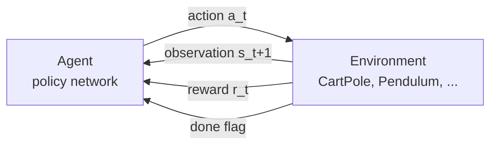
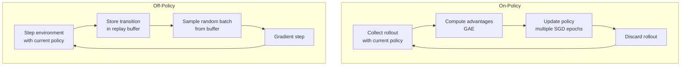
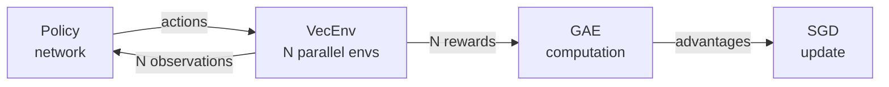
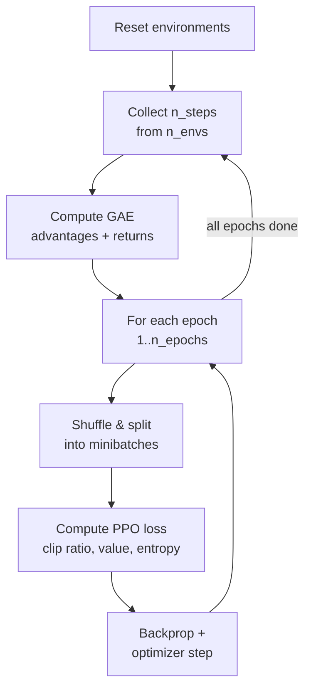
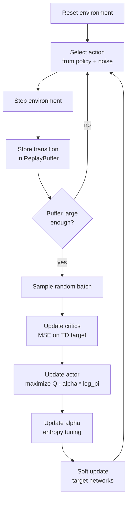
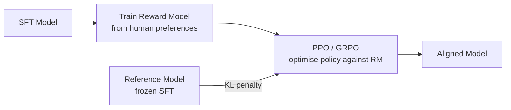

# Introduction to Reinforcement Learning with rlox

A practical guide for ML practitioners who know Python and PyTorch but are
new to reinforcement learning. Every concept is illustrated with runnable
rlox code.

---

## Table of Contents

1. [What is Reinforcement Learning?](#1-what-is-reinforcement-learning)
2. [Key Concepts](#2-key-concepts)
3. [On-Policy vs Off-Policy](#3-on-policy-vs-off-policy)
4. [Key Algorithms](#4-key-algorithms)
5. [Advantage Estimation (GAE)](#5-advantage-estimation-gae)
6. [Replay Buffers](#6-replay-buffers)
7. [Vectorized Environments](#7-vectorized-environments)
8. [Training Loop Anatomy](#8-training-loop-anatomy)
9. [LLM Post-Training](#9-llm-post-training)
10. [Next Steps](#10-next-steps)

---

## 1. What is Reinforcement Learning?

In supervised learning you have a dataset of (input, label) pairs. In
reinforcement learning there is no dataset -- instead, an **agent** learns by
interacting with an **environment** and receiving **reward** signals that tell
it how well it is doing.

The analogy: imagine learning to ride a bicycle. Nobody hands you a labelled
dataset of "lean left 3 degrees when the road curves right." Instead you try
things, fall over (negative reward), stay upright (positive reward), and
gradually improve your policy for converting sensory input into actions.



Here is the RL loop in rlox, using the built-in CartPole environment:

```python
import rlox

# Create a CartPole environment (Rust-native, identical to gymnasium)
env = rlox.CartPole(seed=42)

obs = env.reset()          # shape: (4,) -- [cart_pos, cart_vel, pole_angle, angular_vel]
total_reward = 0.0

for step in range(500):
    action = 1 if obs[2] > 0 else 0   # simple heuristic: push toward the pole
    result = env.step(action)

    obs    = result["obs"]             # next observation
    reward = result["reward"]          # +1 for every step the pole stays up
    done   = result["terminated"] or result["truncated"]

    total_reward += reward
    if done:
        print(f"Episode ended after {step + 1} steps, total reward: {total_reward}")
        break
```

The goal of RL is to replace that hand-coded heuristic with a learned
**policy** -- typically a neural network -- that maximises cumulative reward.

---

## 2. Key Concepts

### State / Observation

The **observation** (or **state**) is what the agent sees at each timestep.
In CartPole-v1, the observation is a 4-dimensional vector:

| Index | Meaning          | Range                  |
|-------|------------------|------------------------|
| 0     | Cart position    | [-4.8, 4.8]            |
| 1     | Cart velocity    | [-inf, inf]            |
| 2     | Pole angle       | [-0.418 rad, 0.418 rad]|
| 3     | Angular velocity | [-inf, inf]            |

```python
env = rlox.CartPole(seed=0)
obs = env.reset()
print(obs)  # e.g. array([ 0.0273, -0.0048, -0.0208,  0.0321], dtype=float32)
```

### Action

An **action** is what the agent does. Actions can be:

- **Discrete**: a finite set of choices. CartPole has two actions: `0` (push
  left) and `1` (push right).
- **Continuous**: a real-valued vector. Pendulum-v1 has a single continuous
  action: torque in `[-2.0, 2.0]`.

rlox provides policies for both:

```python
from rlox.policies import DiscretePolicy, ContinuousPolicy

# Discrete: for CartPole (4-dim obs, 2 actions)
policy = DiscretePolicy(obs_dim=4, n_actions=2)

# Continuous: for Pendulum (3-dim obs, 1-dim action)
policy = ContinuousPolicy(obs_dim=3, act_dim=1)
```

### Reward

The **reward** is a scalar feedback signal the environment returns after each
action. It is the only training signal in RL -- there are no labels.

- CartPole: `+1` for every timestep the pole stays upright (maximum 500).
- Pendulum: a negative cost based on angle, angular velocity, and torque.

The agent's objective is to maximise the **cumulative** reward over an episode,
not just the immediate reward. This is what makes RL different from greedy
optimisation.

### Episode

An **episode** is a sequence of interactions from an initial state to a
**terminal state** (the pole falls, the game ends, or a time limit is
reached). After an episode ends, the environment resets.

```python
env = rlox.CartPole(seed=42)
obs = env.reset()

episode_reward = 0.0
for t in range(500):
    result = env.step(1)  # always push right (bad policy)
    episode_reward += result["reward"]
    if result["terminated"] or result["truncated"]:
        print(f"Episode length: {t + 1}, reward: {episode_reward}")
        break
```

### Policy

A **policy** pi(a|s) maps observations to actions. In deep RL, the policy is
a neural network. For discrete actions, the network outputs logits over
actions; for continuous actions, it outputs the mean (and sometimes variance)
of a Gaussian distribution.

```python
import torch
from rlox.policies import DiscretePolicy

policy = DiscretePolicy(obs_dim=4, n_actions=2)

obs = torch.randn(1, 4)                          # single observation
action, log_prob = policy.get_action_and_logprob(obs)
print(f"Action: {action.item()}, log_prob: {log_prob.item():.3f}")
```

### Value Function

The **value function** V(s) estimates the expected total future reward
starting from state s and following the current policy. It answers the
question: "how good is it to be in this state?"

```python
value = policy.get_value(obs)
print(f"Estimated value of this state: {value.item():.3f}")
```

The value function is critical for computing **advantages** (see Section 5).

### Discount Factor (gamma)

Future rewards are worth less than immediate rewards. The **discount factor**
gamma (typically 0.99) controls this trade-off:

```
G_t = r_t + gamma * r_{t+1} + gamma^2 * r_{t+2} + ...
```

With gamma = 0.99, a reward 100 steps in the future is worth 0.99^100 ~= 0.37
of an immediate reward. With gamma = 0, the agent is purely myopic; with
gamma = 1, it treats all future rewards equally.

### Return

The **return** G_t is the discounted sum of rewards from timestep t onward:

```
G_t = sum_{k=0}^{T-t} gamma^k * r_{t+k}
```

In rlox, returns are computed automatically by `compute_gae()` alongside
advantages:

```python
import numpy as np
import rlox

rewards = np.array([1.0, 1.0, 1.0, 0.0], dtype=np.float64)
values  = np.array([2.5, 2.0, 1.0, 0.0], dtype=np.float64)
dones   = np.array([0.0, 0.0, 0.0, 1.0], dtype=np.float64)

advantages, returns = rlox.compute_gae(
    rewards=rewards, values=values, dones=dones,
    last_value=0.0, gamma=0.99, lam=0.95,
)
print(f"Returns: {returns}")  # discounted sums of future rewards
```

---

## 3. On-Policy vs Off-Policy

This is one of the most important distinctions in RL. It determines what data
the algorithm learns from and how it stores experience.



### On-Policy (PPO, A2C)

The agent learns **only from data collected by the current policy**. After
each update, the old data is discarded because it was generated by a
different (now outdated) policy.

- **Pros**: stable, well-understood convergence properties.
- **Cons**: sample-inefficient -- every transition is used once and thrown away.

In rlox, on-policy algorithms use `RolloutCollector`:

```python
from rlox.collectors import RolloutCollector
from rlox.policies import DiscretePolicy

collector = RolloutCollector("CartPole-v1", n_envs=8, seed=0, gamma=0.99)
policy = DiscretePolicy(obs_dim=4, n_actions=2)

# Collect 128 steps from 8 envs = 1024 transitions
batch = collector.collect(policy, n_steps=128)

print(f"Observations: {batch.obs.shape}")     # torch.Size([1024, 4])
print(f"Advantages:   {batch.advantages.shape}")  # torch.Size([1024])
# After the PPO update, this batch is discarded
```

### Off-Policy (SAC, TD3, DQN)

The agent stores **all** experience in a **replay buffer** and can learn from
any past transition, regardless of which policy generated it.

- **Pros**: highly sample-efficient -- each transition can be reused many times.
- **Cons**: requires careful stability techniques (target networks, clipped critics).

In rlox, off-policy algorithms use `ReplayBuffer`:

```python
import numpy as np
import rlox

buffer = rlox.ReplayBuffer(capacity=100_000, obs_dim=4, act_dim=1)

# Store transitions from any policy
obs = np.zeros(4, dtype=np.float32)
buffer.push(obs, action=0.5, reward=1.0, terminated=False, truncated=False)

# Sample random batches for training (can sample the same transition many times)
batch = buffer.sample(batch_size=32, seed=0)
print(f"Sampled obs shape: {batch['obs'].shape}")  # (32, 4)
```

---

## 4. Key Algorithms

### PPO (Proximal Policy Optimization)

PPO [Schulman et al., 2017] is the workhorse of on-policy RL. It prevents
destructively large policy updates by **clipping** the probability ratio
between the new and old policy.

**Core idea**: if the new policy is too different from the old one, clip the
objective so the gradient pushes back.

```
L_CLIP = E[ min(r_t * A_t, clip(r_t, 1-eps, 1+eps) * A_t) ]

where r_t = pi_new(a|s) / pi_old(a|s)  (probability ratio)
      A_t = advantage estimate
      eps = 0.2 (clipping range)
```

```python
from rlox.algorithms import PPO

ppo = PPO("CartPole-v1", n_envs=8, seed=42)
metrics = ppo.train(total_timesteps=50_000)
print(f"Mean reward: {metrics['mean_reward']:.1f}")

# Or even simpler with the trainer API:
from rlox.trainers import PPOTrainer
trainer = PPOTrainer(env="CartPole-v1", seed=42)
metrics = trainer.train(total_timesteps=50_000)
```

### SAC (Soft Actor-Critic)

SAC [Haarnoja et al., 2018] is the go-to off-policy algorithm for continuous
control. It maximises reward **and** policy entropy, encouraging exploration:

```
J(pi) = E[ sum gamma^t (r_t + alpha * H(pi(.|s_t))) ]
```

Key components: twin critics (reduce overestimation), automatic temperature
tuning (alpha adjusts itself), squashed Gaussian policy.

```python
from rlox.algorithms import SAC

sac = SAC("Pendulum-v1", seed=42)
metrics = sac.train(total_timesteps=20_000)
print(f"Mean reward: {metrics['mean_reward']:.1f}")
```

### DQN (Deep Q-Network)

DQN [Mnih et al., 2015] learns a Q-function Q(s, a) that estimates the
expected return for taking action a in state s. The policy is implicit:
always pick the action with the highest Q-value.

rlox supports Rainbow extensions: Double DQN, Dueling architecture, N-step
returns, and Prioritized Experience Replay.

```python
from rlox.algorithms import DQN

# Vanilla DQN
dqn = DQN("CartPole-v1", seed=42)

# Rainbow-style DQN
dqn = DQN(
    "CartPole-v1",
    double_dqn=True,      # use online network for action selection
    dueling=True,          # separate value and advantage streams
    n_step=3,              # 3-step returns
    prioritized=True,      # prioritized experience replay
    seed=42,
)
metrics = dqn.train(total_timesteps=50_000)
```

### TD3 (Twin Delayed DDPG)

TD3 [Fujimoto et al., 2018] improves DDPG with three techniques: twin
critics, delayed policy updates (update the actor less frequently than the
critics), and target policy smoothing (add noise to target actions).

```python
from rlox.algorithms import TD3

td3 = TD3(
    "Pendulum-v1",
    policy_delay=2,        # update actor every 2 critic updates
    target_noise=0.2,      # smoothing noise for target policy
    noise_clip=0.5,        # clip target noise
    seed=42,
)
metrics = td3.train(total_timesteps=20_000)
```

### GRPO (Group Relative Policy Optimization)

GRPO [Shao et al., 2024] is designed for LLM post-training. Instead of using
a learned value function, it generates **multiple completions** per prompt and
normalises rewards within each group:

```
A_i = (r_i - mean(r_1..r_K)) / std(r_1..r_K)
```

See [Section 9](#9-llm-post-training) for a full example.

---

## 5. Advantage Estimation (GAE)

### What is it?

The **advantage** A(s, a) measures how much better action a is compared to
the average action from state s:

```
A(s, a) = Q(s, a) - V(s)
```

If A > 0, the action was better than expected. If A < 0, it was worse.
Training the policy to increase the probability of positive-advantage actions
and decrease negative-advantage actions is the core of policy gradient methods.

### The Bias-Variance Tradeoff

Computing advantages involves a tradeoff:

- **Low bias, high variance** (Monte Carlo return): use the actual discounted
  return G_t minus V(s_t). Unbiased but noisy.
- **High bias, low variance** (TD residual): use r_t + gamma * V(s_{t+1}) - V(s_t).
  Lower variance but biased by errors in V.

**Generalized Advantage Estimation** (GAE) [Schulman et al., 2016] interpolates
between these extremes using a parameter lambda:

```
A_t^GAE = sum_{l=0}^{T-t} (gamma * lambda)^l * delta_{t+l}

where delta_t = r_t + gamma * V(s_{t+1}) - V(s_t)  (TD residual)
```

- lambda = 0: pure TD residual (low variance, high bias)
- lambda = 1: pure Monte Carlo return (high variance, low bias)
- lambda = 0.95: the standard default (good tradeoff)

### rlox.compute_gae()

rlox computes GAE in Rust via a backwards scan. This is 140x faster than
a Python for-loop and 1700x faster than TorchRL's TensorDict-based
implementation.

```python
import numpy as np
import rlox

# Simulate a 2048-step rollout
n_steps = 2048
rewards = np.random.randn(n_steps).astype(np.float64)
values  = np.random.randn(n_steps).astype(np.float64)
dones   = (np.random.rand(n_steps) < 0.01).astype(np.float64)

# Single-environment GAE
advantages, returns = rlox.compute_gae(
    rewards=rewards,
    values=values,
    dones=dones,
    last_value=0.0,   # V(s_T+1) -- bootstrap from final state
    gamma=0.99,        # discount factor
    lam=0.95,          # GAE lambda
)

print(f"Advantages: mean={advantages.mean():.3f}, std={advantages.std():.3f}")
print(f"Returns:    mean={returns.mean():.3f}, std={returns.std():.3f}")
```

For multiple parallel environments, use the batched variant:

```python
n_envs = 8
n_steps = 128

# Flat arrays in env-major layout: [env0_step0, env0_step1, ..., env1_step0, ...]
rewards_flat = np.random.randn(n_envs * n_steps).astype(np.float64)
values_flat  = np.random.randn(n_envs * n_steps).astype(np.float64)
dones_flat   = np.zeros(n_envs * n_steps, dtype=np.float64)
last_values  = np.zeros(n_envs, dtype=np.float64)

advantages, returns = rlox.compute_gae_batched(
    rewards=rewards_flat,
    values=values_flat,
    dones=dones_flat,
    last_values=last_values,
    n_steps=n_steps,
    gamma=0.99,
    lam=0.95,
)
# Shape: (n_envs * n_steps,) -- same flat layout
```

### Why rlox is fast

The GAE backward scan has an inherent sequential dependency
(`A_t` depends on `A_{t+1}`), so it cannot be trivially parallelised.
In Python, this means a for-loop over `T` timesteps with dictionary lookups
and dynamic dispatch at every step. rlox implements the scan in Rust with:

- No Python overhead per step (single PyO3 boundary crossing)
- Contiguous memory layout (cache-friendly)
- SIMD-friendly operations on flat f64 arrays
- Batched variant processes multiple environments in parallel via Rayon

---

## 6. Replay Buffers

### Why off-policy needs them

Off-policy algorithms (SAC, TD3, DQN) learn from experience generated by
**any** policy, not just the current one. A replay buffer stores past
transitions and allows random sampling, which:

1. **Breaks correlation**: consecutive transitions are highly correlated;
   random sampling decorrelates training data.
2. **Improves sample efficiency**: each transition can be reused many times.
3. **Stabilises training**: learning from a diverse mixture of old and new
   experience prevents catastrophic forgetting.

### Uniform Replay Buffer

The simplest buffer: store transitions in a ring buffer, sample uniformly
at random.

```python
import numpy as np
import rlox

# Create a buffer for an environment with 3-dim obs and 1-dim action
buffer = rlox.ReplayBuffer(capacity=100_000, obs_dim=3, act_dim=1)

# Store transitions
for i in range(1000):
    obs = np.random.randn(3).astype(np.float32)
    buffer.push(
        obs=obs,
        action=np.random.randn(),
        reward=float(np.random.randn()),
        terminated=False,
        truncated=False,
    )

print(f"Buffer size: {len(buffer)}")  # 1000

# Sample a training batch
batch = buffer.sample(batch_size=64, seed=42)
print(f"obs:     {batch['obs'].shape}")         # (64, 3)
print(f"actions: {batch['actions'].shape}")      # (64, 1)
print(f"rewards: {batch['rewards'].shape}")      # (64,)
```

rlox's `ReplayBuffer` is 8-13x faster than TorchRL and Stable-Baselines3
for sampling, with p99 latency under 15 microseconds even at batch_size=1024.

### Prioritized Experience Replay

Not all transitions are equally useful. Prioritized replay [Schaul et al.,
2016] samples transitions proportional to their **TD error** -- transitions
the model is most wrong about get sampled more often.

```python
buffer = rlox.PrioritizedReplayBuffer(
    capacity=100_000,
    obs_dim=3,
    act_dim=1,
    alpha=0.6,  # priority exponent (0 = uniform, 1 = fully prioritised)
    beta=0.4,   # importance-sampling correction (anneal toward 1.0)
)

# Push with initial priority
obs = np.zeros(3, dtype=np.float32)
buffer.push(obs, action=0.5, reward=1.0, terminated=False, truncated=False, priority=1.0)

# Sample returns importance-sampling weights and indices
batch = buffer.sample(batch_size=32, seed=0)
weights = batch["weights"]   # use these to weight the loss
indices = batch["indices"]   # use these to update priorities

# After computing TD errors, update priorities
new_priorities = np.abs(td_errors) + 1e-6  # small epsilon for stability
buffer.update_priorities(
    indices.astype(np.uint64),
    new_priorities.astype(np.float64),
)

# Anneal beta toward 1.0 over training
buffer.set_beta(0.4 + training_progress * 0.6)
```

---

## 7. Vectorized Environments

### Why parallel envs help

A single environment produces one transition per step. By running N
environments in parallel, you get N transitions per step -- more data per
unit of wall-clock time. This is critical for on-policy algorithms like PPO,
which need large batches for stable updates.



### rlox.VecEnv

rlox provides a Rust-native vectorized CartPole that uses Rayon work-stealing
parallelism. At 256+ environments, it delivers 3-6x speedup over gymnasium's
`SyncVectorEnv`.

```python
import time
import numpy as np
import rlox

N_ENVS = 256
N_STEPS = 1000

vec = rlox.VecEnv(n=N_ENVS, seed=42)
obs = vec.reset_all()  # shape: (256, 4)

start = time.perf_counter()
for _ in range(N_STEPS):
    actions = np.random.randint(0, 2, size=N_ENVS).tolist()
    result = vec.step_all(actions)
elapsed = time.perf_counter() - start

total_steps = N_ENVS * N_STEPS
print(f"{total_steps / elapsed:,.0f} steps/sec")
# Typical output: ~2,700,000 steps/sec
```

For non-CartPole environments, rlox wraps gymnasium via `GymVecEnv`:

```python
from rlox.gym_vec_env import GymVecEnv

vec = GymVecEnv("Pendulum-v1", n_envs=16, seed=0)
obs = vec.reset_all()   # shape: (16, 3)
result = vec.step_all(np.zeros((16, 1)))
```

The `RolloutCollector` automatically selects the right backend:

```python
from rlox.collectors import RolloutCollector

# Uses Rust VecEnv (fast)
collector_fast = RolloutCollector("CartPole-v1", n_envs=64, seed=0)

# Uses GymVecEnv (any gymnasium env)
collector_gym = RolloutCollector("LunarLander-v3", n_envs=8, seed=0)
```

---

## 8. Training Loop Anatomy

### PPO Training Loop

PPO follows a collect-then-train pattern. Understanding this loop is essential
for debugging and customising RL training.



Here is a complete PPO training loop using rlox primitives:

```python
import torch
import rlox
from rlox.collectors import RolloutCollector
from rlox.policies import DiscretePolicy
from rlox.losses import PPOLoss

# Setup
policy = DiscretePolicy(obs_dim=4, n_actions=2)
optimizer = torch.optim.Adam(policy.parameters(), lr=2.5e-4, eps=1e-5)
collector = RolloutCollector("CartPole-v1", n_envs=8, seed=42, gamma=0.99, gae_lambda=0.95)
loss_fn = PPOLoss(clip_eps=0.2, vf_coef=0.5, ent_coef=0.01)

# Training loop
for update in range(50):
    # 1. Collect rollout (8 envs x 128 steps = 1024 transitions)
    batch = collector.collect(policy, n_steps=128)

    # 2. Multiple SGD passes over the same rollout
    for epoch in range(4):
        for mb in batch.sample_minibatches(batch_size=256, shuffle=True):
            # Normalise advantages per minibatch
            adv = (mb.advantages - mb.advantages.mean()) / (mb.advantages.std() + 1e-8)

            # Compute clipped PPO loss
            loss, metrics = loss_fn(
                policy, mb.obs, mb.actions, mb.log_probs,
                adv, mb.returns, mb.values,
            )

            # Standard PyTorch optimisation step
            optimizer.zero_grad(set_to_none=True)
            loss.backward()
            torch.nn.utils.clip_grad_norm_(policy.parameters(), 0.5)
            optimizer.step()

    print(f"Update {update}: reward={batch.rewards.sum().item() / 8:.0f}, "
          f"policy_loss={metrics['policy_loss']:.3f}, "
          f"entropy={metrics['entropy']:.3f}")
```

### SAC Training Loop

SAC follows a step-then-train pattern. Every environment step is immediately
stored in the replay buffer, and a gradient step follows.



Here is a complete SAC loop with rlox primitives:

```python
import copy
import numpy as np
import torch
import torch.nn.functional as F
import gymnasium as gym
import rlox
from rlox.networks import QNetwork, SquashedGaussianPolicy, polyak_update

# Setup
env = gym.make("Pendulum-v1")
obs_dim, act_dim = 3, 1
act_high = 2.0

actor = SquashedGaussianPolicy(obs_dim, act_dim, hidden=256)
critic1 = QNetwork(obs_dim, act_dim, hidden=256)
critic2 = QNetwork(obs_dim, act_dim, hidden=256)
critic1_target = copy.deepcopy(critic1)
critic2_target = copy.deepcopy(critic2)

actor_opt = torch.optim.Adam(actor.parameters(), lr=3e-4)
critic1_opt = torch.optim.Adam(critic1.parameters(), lr=3e-4)
critic2_opt = torch.optim.Adam(critic2.parameters(), lr=3e-4)

# Rust replay buffer -- 8-13x faster sampling than Python alternatives
buffer = rlox.ReplayBuffer(capacity=100_000, obs_dim=obs_dim, act_dim=act_dim)

alpha = 0.2
gamma = 0.99
tau = 0.005

obs, _ = env.reset()
for step in range(20_000):
    # Select action
    if step < 1000:  # random exploration
        action = env.action_space.sample()
    else:
        with torch.no_grad():
            obs_t = torch.as_tensor(obs, dtype=torch.float32).unsqueeze(0)
            action_t, _ = actor.sample(obs_t)
            action = action_t.squeeze(0).numpy() * act_high

    # Step environment
    next_obs, reward, terminated, truncated, _ = env.step(action)
    buffer.push(
        np.asarray(obs, dtype=np.float32),
        np.asarray(action, dtype=np.float32),
        float(reward), bool(terminated), bool(truncated),
        np.asarray(next_obs, dtype=np.float32),
    )
    obs = next_obs
    if terminated or truncated:
        obs, _ = env.reset()

    # Train
    if step >= 1000 and len(buffer) >= 256:
        batch = buffer.sample(batch_size=256, seed=step)
        obs_b = torch.as_tensor(batch["obs"], dtype=torch.float32)
        acts_b = torch.as_tensor(batch["actions"], dtype=torch.float32)
        rews_b = torch.as_tensor(batch["rewards"], dtype=torch.float32)
        term_b = torch.as_tensor(batch["terminated"], dtype=torch.float32)
        next_b = torch.as_tensor(batch["next_obs"], dtype=torch.float32)

        # Critic update
        with torch.no_grad():
            next_a, next_lp = actor.sample(next_b)
            q_next = torch.min(
                critic1_target(next_b, next_a * act_high).squeeze(-1),
                critic2_target(next_b, next_a * act_high).squeeze(-1),
            ) - alpha * next_lp
            target = rews_b + gamma * (1.0 - term_b) * q_next

        for critic, opt in [(critic1, critic1_opt), (critic2, critic2_opt)]:
            q = critic(obs_b, acts_b).squeeze(-1)
            opt.zero_grad(set_to_none=True)
            F.mse_loss(q, target).backward()
            opt.step()

        # Actor update
        new_a, log_p = actor.sample(obs_b)
        q_new = torch.min(
            critic1(obs_b, new_a * act_high).squeeze(-1),
            critic2(obs_b, new_a * act_high).squeeze(-1),
        )
        actor_opt.zero_grad(set_to_none=True)
        (alpha * log_p - q_new).mean().backward()
        actor_opt.step()

        # Soft update targets
        polyak_update(critic1, critic1_target, tau)
        polyak_update(critic2, critic2_target, tau)
```

---

## 9. LLM Post-Training

Reinforcement learning is not only for robotics and games. It is a critical
component of modern LLM alignment pipelines.

### RLHF (Reinforcement Learning from Human Feedback)

The standard RLHF pipeline:



1. **Supervised fine-tuning (SFT)**: train the model on high-quality examples.
2. **Reward model**: train a model to predict human preferences from
   comparison data.
3. **Policy optimisation**: use RL (PPO or GRPO) to maximise the reward model's
   score while staying close to the SFT model (KL penalty).

### GRPO for LLM Post-Training

GRPO avoids the need for a learned value function. Instead, for each prompt
it generates K completions, scores them with a reward model (or rule-based
function), and computes **group-relative advantages**:

```
A_i = (r_i - mean(r_1..r_K)) / std(r_1..r_K)
```

rlox provides Rust-accelerated primitives for this:

```python
import numpy as np
import rlox

# Score 4 completions for the same prompt
rewards = np.array([0.9, 0.3, 0.7, 0.1], dtype=np.float64)
advantages = rlox.compute_group_advantages(rewards)
print(advantages)  # [1.18, -0.51, 0.51, -1.18] -- z-score normalised

# Batched: process multiple prompts at once
# 3 prompts, 4 completions each = 12 rewards
all_rewards = np.array([
    0.9, 0.3, 0.7, 0.1,    # prompt 1
    0.5, 0.5, 0.5, 0.5,    # prompt 2 (all equal -> advantages = 0)
    1.0, 0.0, 0.5, 0.8,    # prompt 3
], dtype=np.float64)

all_advantages = rlox.compute_batch_group_advantages(all_rewards, group_size=4)
print(all_advantages)
```

### DPO (Direct Preference Optimization)

DPO [Rafailov et al., 2023] skips the reward model entirely. It directly
optimises the policy from preference pairs (chosen vs rejected completions):

```
L_DPO = -log sigmoid(beta * (log pi(chosen)/pi_ref(chosen) - log pi(rejected)/pi_ref(rejected)))
```

```python
import torch
from rlox.algorithms import DPO

model = ...      # your language model
ref_model = ...  # frozen copy

dpo = DPO(model=model, ref_model=ref_model, beta=0.1)

# One training step on a batch of preference pairs
metrics = dpo.train_step(
    prompt=prompt_ids,      # (B, P) token IDs
    chosen=chosen_ids,      # (B, C) preferred completion
    rejected=rejected_ids,  # (B, R) dispreferred completion
)
```

rlox also provides `DPOPair` for efficient storage of preference data:

```python
pair = rlox.DPOPair(
    prompt_tokens=np.array([1, 2, 3], dtype=np.uint32),
    chosen_tokens=np.array([4, 5, 6, 7], dtype=np.uint32),
    rejected_tokens=np.array([8, 9], dtype=np.uint32),
)
print(f"Chosen length: {pair.chosen_len()}, Rejected length: {pair.rejected_len()}")
```

### KL Divergence as Regularisation

A critical component of LLM RL is the **KL penalty** that prevents the
policy from diverging too far from the reference model. Without it, the model
can "hack" the reward model by producing degenerate text.

rlox provides fast token-level KL computation:

```python
import numpy as np
import rlox

# Per-token log probabilities from policy and reference model
policy_logprobs = np.array([-1.2, -0.8, -1.5, -0.3], dtype=np.float64)
ref_logprobs    = np.array([-1.0, -0.9, -1.4, -0.5], dtype=np.float64)

# Exact KL divergence
kl = rlox.compute_token_kl(policy_logprobs, ref_logprobs)
print(f"KL divergence: {kl:.4f}")

# Schulman (2020) estimator -- numerically more stable, used by TRL
kl_schulman = rlox.compute_token_kl_schulman(policy_logprobs, ref_logprobs)
print(f"KL (Schulman): {kl_schulman:.4f}")

# Batched: compute KL for multiple sequences at once
batch_size = 8
seq_len = 128
policy_flat = np.random.randn(batch_size * seq_len).astype(np.float64) - 1.0
ref_flat    = np.random.randn(batch_size * seq_len).astype(np.float64) - 1.0

per_seq_kl = rlox.compute_batch_token_kl(policy_flat, ref_flat, seq_len)
print(f"Per-sequence KL: {per_seq_kl}")  # shape: (8,)
```

### Complete GRPO Example

```python
import torch
import torch.nn as nn
from rlox.algorithms import GRPO

# Define your model (must implement forward and generate)
class TinyLM(nn.Module):
    def __init__(self, vocab_size=100, dim=32):
        super().__init__()
        self.embed = nn.Embedding(vocab_size, dim)
        self.head = nn.Linear(dim, vocab_size)

    def forward(self, x):
        return self.head(self.embed(x))

    def generate(self, prompts, max_new_tokens=8):
        tokens = prompts.clone()
        for _ in range(max_new_tokens):
            logits = self.forward(tokens)[:, -1, :]
            next_token = logits.argmax(dim=-1, keepdim=True)
            tokens = torch.cat([tokens, next_token], dim=1)
        return tokens

# Reward function: scores completions
def reward_fn(completions, prompts):
    return [1.0 if 42 in c.tolist() else 0.0 for c in completions]

# Setup
model = TinyLM()
ref_model = TinyLM()
ref_model.load_state_dict(model.state_dict())
for p in ref_model.parameters():
    p.requires_grad = False

grpo = GRPO(
    model=model,
    ref_model=ref_model,
    reward_fn=reward_fn,
    group_size=4,       # 4 completions per prompt
    kl_coef=0.1,        # KL penalty weight
    max_new_tokens=8,
)

prompts = torch.randint(0, 100, (4, 5))  # 4 prompts, length 5
metrics = grpo.train(prompts, n_epochs=3)
print(f"Loss: {metrics['loss']:.4f}, Reward: {metrics['mean_reward']:.2f}, KL: {metrics['kl']:.4f}")
```

---

## 10. Next Steps

### rlox Documentation

- [Getting Started](getting-started.md) -- installation, first training run
- [Python Guide](python-guide.md) -- detailed Python API reference
- [Examples](examples.md) -- runnable scripts for every algorithm
- [LLM Post-Training](llm-post-training.md) -- GRPO, DPO, and RLHF pipelines
- [Math Reference](math-reference.md) -- full mathematical formulations
- [References](references.md) -- papers cited in this guide

### Key Papers

| Paper | Year | What it introduced |
|-------|------|--------------------|
| Mnih et al., "Human-level control through deep RL" | 2015 | DQN, experience replay, target networks |
| Schulman et al., "High-dimensional continuous control using GAE" | 2016 | Generalized Advantage Estimation |
| Schaul et al., "Prioritized Experience Replay" | 2016 | Proportional priority sampling |
| Schulman et al., "Proximal Policy Optimization Algorithms" | 2017 | PPO clipped surrogate |
| Haarnoja et al., "Soft Actor-Critic" | 2018 | SAC, maximum entropy RL |
| Fujimoto et al., "Addressing Function Approximation Error..." | 2018 | TD3, twin critics, delayed updates |
| Rafailov et al., "Direct Preference Optimization" | 2023 | DPO, preference-based alignment without RM |
| Shao et al., "DeepSeekMath" | 2024 | GRPO, group-relative advantages |

### Recommended Learning Path

1. **Start with PPO on CartPole** -- it is the "hello world" of RL. Use
   `PPOTrainer` first, then write the loop yourself.
2. **Try SAC on Pendulum** -- understand continuous control and replay buffers.
3. **Read the PPO loss code** (`rlox/losses.py`) -- it is 130 lines and
   implements the entire clipped surrogate objective.
4. **Experiment with GAE parameters** -- change gamma and lambda and observe
   the effect on training stability.
5. **Move to LLM post-training** -- if your goal is alignment, start with the
   GRPO example and swap in your own reward function.
